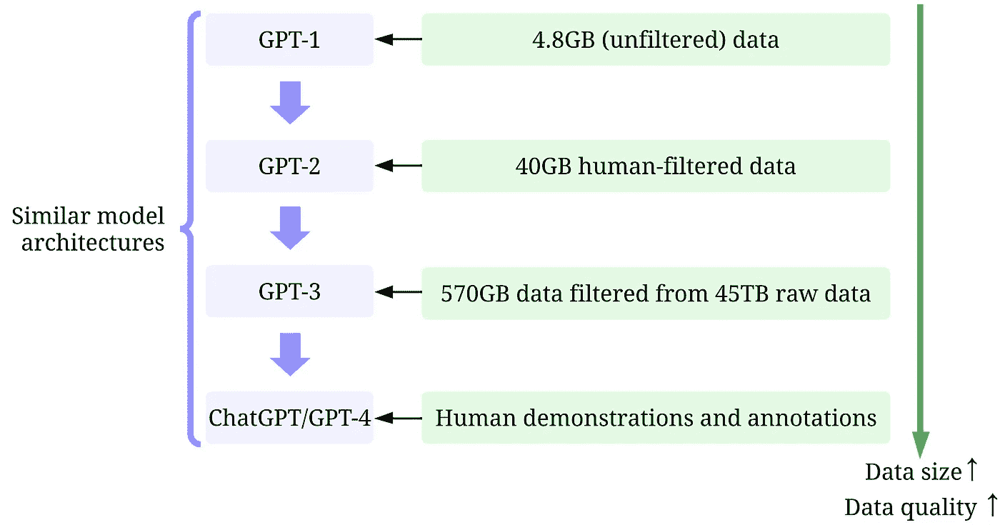
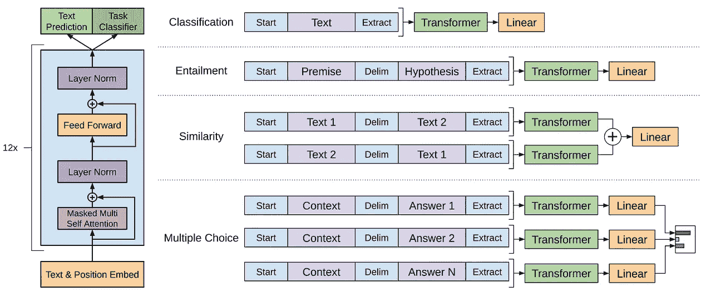
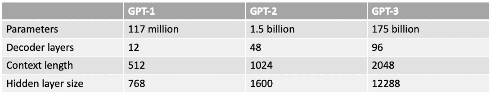
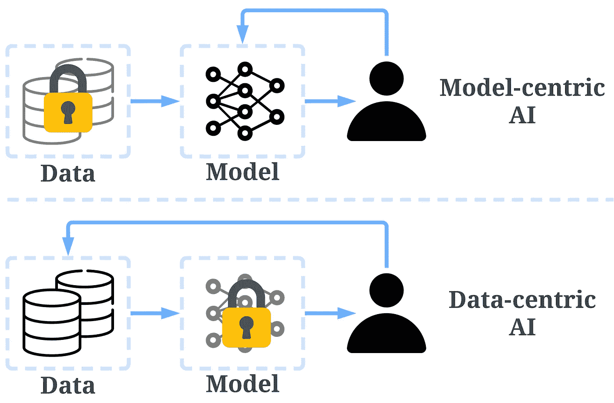
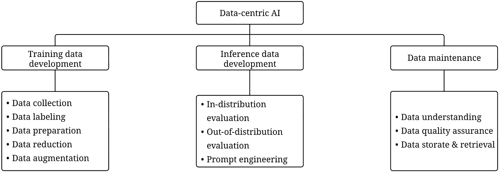
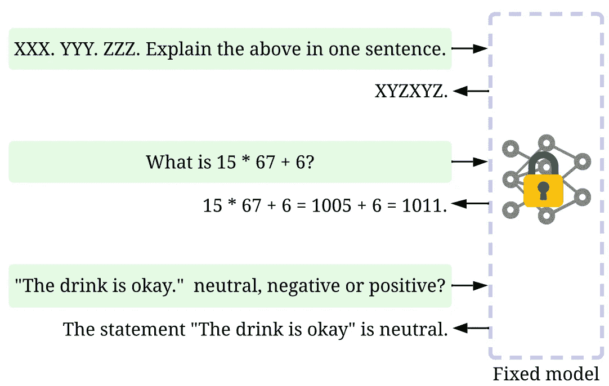
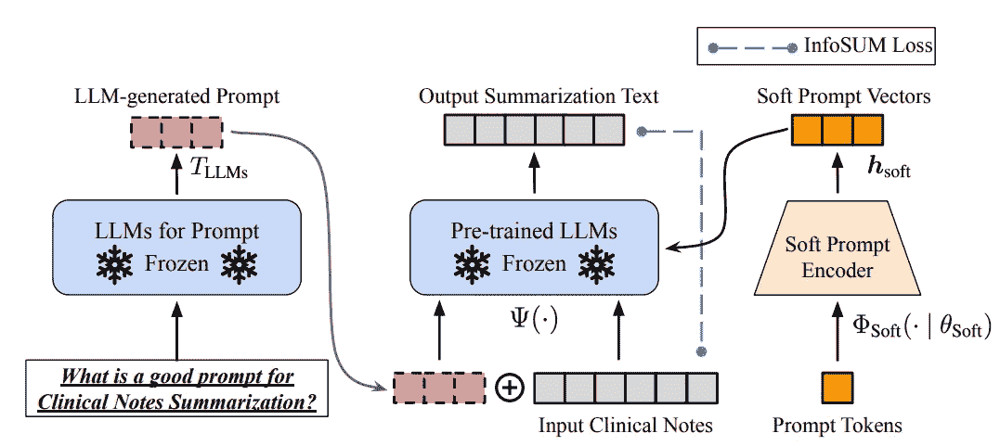
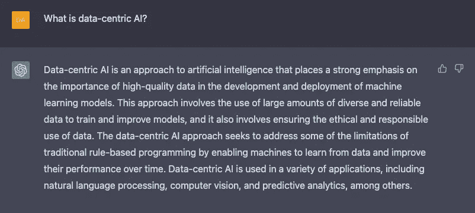
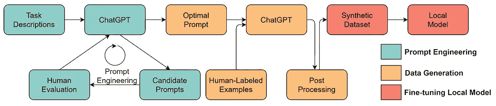

# GPT 模型背后的数据中心 AI 概念是什么？

> 原文：[`towardsdatascience.com/what-are-the-data-centric-ai-concepts-behind-gpt-models-a590071bb727`](https://towardsdatascience.com/what-are-the-data-centric-ai-concepts-behind-gpt-models-a590071bb727)

## 解读 ChatGPT 和 GPT-4 中使用的数据中心 AI 技术

 [Henry Lai](https://medium.com/@a0987284901?source=post_page-----a590071bb727--------------------------------)

·发表于 [Towards Data Science](https://towardsdatascience.com/?source=post_page-----a590071bb727--------------------------------) ·阅读时间 8 分钟·2023 年 3 月 29 日

--

[`arxiv.org/abs/2303.10158`](https://arxiv.org/abs/2303.10158)。作者提供的图像。

人工智能（AI）在改变我们的生活、工作和与技术互动的方式上取得了令人难以置信的进展。最近，取得显著进展的一个领域是大型语言模型（LLMs）的发展，例如 [GPT-3](https://arxiv.org/abs/2005.14165)、[ChatGPT](https://openai.com/blog/chatgpt) 和 [GPT-4](https://cdn.openai.com/papers/gpt-4.pdf)。这些模型能够以令人印象深刻的准确性执行语言翻译、文本摘要和问答等任务。

尽管很难忽视大型语言模型（LLMs）模型尺寸的不断增长，但同样重要的是认识到它们的成功在很大程度上归功于用于训练它们的大量高质量数据。

在本文中，我们将从数据中心 AI 的角度概述大型语言模型（LLMs）的最新进展，借鉴我们最近的调查论文 [1,2] 以及在 [GitHub](https://github.com/daochenzha/data-centric-AI) 上的相关技术资源。特别是，我们将通过 [数据中心 AI](https://github.com/daochenzha/data-centric-AI) 的视角，深入探讨 GPT 模型。我们将通过讨论三个数据中心 AI 目标来解读 GPT 模型背后的数据中心 AI 概念： [训练数据开发、推理数据开发和数据维护](https://arxiv.org/abs/2303.10158)。

## 大型语言模型（LLMs）和 GPT 模型

LLM 是一种自然语言处理模型，经过训练以在上下文中推断单词。例如，LLM 的最基本功能是根据上下文预测缺失的标记。为此，LLM 通过海量数据训练来预测每个标记候选的概率。

一个示例，展示了如何在上下文中用 LLM 预测缺失标记的概率。图片由作者提供。

GPT 模型指的是一系列由 OpenAI 创建的 LLM，例如 [GPT-1](https://cdn.openai.com/research-covers/language-unsupervised/language_understanding_paper.pdf)、[GPT-2](https://d4mucfpksywv.cloudfront.net/better-language-models/language_models_are_unsupervised_multitask_learners.pdf)、[GPT-3](https://arxiv.org/abs/2005.14165)、[InstructGPT](https://arxiv.org/abs/2203.02155) 和 [ChatGPT/GPT-4](https://cdn.openai.com/papers/gpt-4.pdf)。与其他 LLM 一样，GPT 模型的架构主要基于 [Transformers](https://arxiv.org/abs/1706.03762)，该架构使用文本和位置嵌入作为输入，并通过注意力层建模标记之间的关系。

GPT-1 模型架构。图片来自论文 [`cdn.openai.com/research-covers/language-unsupervised/language_understanding_paper.pdf`](https://cdn.openai.com/research-covers/language-unsupervised/language_understanding_paper.pdf)

后来的 GPT 模型使用了与 GPT-1 相似的架构，但模型参数更多，层数更多，上下文长度更大，隐藏层大小等也有所增加。

GPT 模型的模型大小比较。图片由作者提供。

## 什么是数据驱动的 AI？

[数据驱动的 AI](https://github.com/daochenzha/data-centric-AI) 是一种新兴的思考方式，旨在构建 AI 系统。它得到了 AI 先驱 Andrew Ng 的倡导。

> *数据驱动的 AI 是系统地工程化用于构建 AI 系统的数据的学科。 — Andrew Ng*

过去，我们主要关注在数据基本不变的情况下创建更好的模型（模型驱动 AI）。然而，这种方法可能会在现实世界中导致问题，因为它没有考虑到数据中可能出现的不同问题，如标签不准确、重复和偏差。因此，"过拟合" 一个数据集不一定会带来更好的模型表现。

相比之下，数据驱动的 AI 侧重于提高用于构建 AI 系统的数据的质量和数量。这意味着关注点在于数据本身，而模型则相对固定。采用数据驱动的方法开发 AI 系统在现实世界场景中具有更大的潜力，因为用于训练的数据最终决定了模型的最大能力。

需要注意的是，“数据中心”与“数据驱动”在根本上有所不同，因为后者仅强调使用数据来指导 AI 开发，通常仍然侧重于开发模型，而不是工程化数据。

数据中心 AI 与模型中心 AI 的比较。 [`arxiv.org/abs/2301.04819`](https://arxiv.org/abs/2301.04819) 图像由作者提供。

[数据中心 AI 框架](https://github.com/daochenzha/data-centric-AI) 由三个目标组成：

+   **训练数据开发**是为了收集和生成丰富且高质量的数据，以支持机器学习模型的训练。

+   **推断数据开发**是为了创建新的评估集，这些评估集可以提供对模型更细致的见解，或通过工程化的数据输入触发模型的特定能力。

+   **数据维护**是为了确保在动态环境中数据的质量和可靠性。数据维护至关重要，因为现实世界中的数据不是一次性创建的，而是需要持续的维护。

数据中心 AI 框架。 [`arxiv.org/abs/2303.10158`](https://arxiv.org/abs/2303.10158)。图像由作者提供。

## 数据中心 AI 如何让 GPT 模型取得成功

几个月前，Yann LeCun 在推特上表示 ChatGPT 并没有什么新意。确实，ChatGPT 和 GPT-4 中使用的所有技术（变换器、从人类反馈中学习的强化学习等）都并不新颖。然而，它们确实取得了之前模型无法达到的惊人结果。那么，它们成功的驱动力是什么呢？

**训练数据开发。** 通过更好的数据收集、数据标注和数据准备策略，用于训练 GPT 模型的数据的数量和质量有了显著提升。

+   **GPT-1：** [BooksCorpus 数据集](https://huggingface.co/datasets/bookcorpus) 被用于训练。该数据集包含 4629.00 MB 的原始文本，涵盖了来自冒险、奇幻和浪漫等多种类型的书籍。

    **- *数据中心的 AI 策略*:** 无。

    **- *结果：*** 关于这个数据集的 GPT-1 可以通过微调提高下游任务的表现。

+   **GPT-2：** [WebText](https://paperswithcode.com/dataset/webtext) 被用于训练。这是一个由 OpenAI 创建的内部数据集，通过抓取 Reddit 上的外链生成。

    **- *数据中心的 AI 策略：*** (1) 通过仅使用来自 Reddit 的外链（获得至少 3 个 Karma）来策划/筛选数据。 (2) 使用工具 [Dragnet](https://dl.acm.org/doi/abs/10.1145/2487788.2487828) 和 [Newspaper](https://github.com/codelucas/newspaper) 提取干净的内容。 (3) 采用去重和一些其他基于启发式的清洗方法（论文中未提及具体细节）。

    **- *结果：*** 经过筛选后获得了 40 GB 的文本。GPT-2 在未经过微调的情况下实现了强大的零样本结果。

+   **GPT-3：** GPT-3 的训练主要基于 [Common Crawl](https://commoncrawl.org/the-data/)。

    **- *数据中心 AI 策略：***（1）训练分类器，根据每个文档与 WebText 的相似性来筛选低质量文档，WebText 是高质量文档的代理。 （2）使用 Spark 的 MinHashLSH 进行模糊去重。 （3）用 WebText、书籍语料库和维基百科来增强数据。

    ***- 结果：*** 经过筛选后，从 45TB 的纯文本中获得了 570GB 的文本（仅 1.27% 的数据在此质量筛选中被选择）。GPT-3 在零样本设置中显著优于 GPT-2。

+   **InstructGPT：** 让人类评估答案以调整 GPT-3，使其更好地符合人类期望。他们为标注员设计了测试，只有通过测试的标注员才有资格进行标注。他们甚至设计了一项调查，以确保标注员喜欢标注过程。

    **- *数据中心 AI 策略：***（1）使用人工提供的答案来调整模型，进行监督训练。 （2）收集比较数据来训练奖励模型，然后使用此奖励模型通过人类反馈强化学习（RLHF）来调整 GPT-3。

    ***- 结果：*** InstructGPT 显示出更好的真实性和更少的偏见，即更好的对齐。

+   **ChatGPT/GPT-4:** OpenAI 并未公开详细信息。但已知 ChatGPT/GPT-4 大体上遵循之前 GPT 模型的设计，并且仍然使用 RLHF 来调整模型（可能使用了更多、更高质量的数据/标签）。普遍认为 GPT-4 使用了更大的数据集，因为模型权重有所增加。

**推理数据开发。** 由于最近的 GPT 模型已经足够强大，我们可以通过调整提示（或调整推理数据）来实现各种目标，而不需要调整模型。例如，我们可以通过将待总结的文本与“总结一下”或“TL;DR”这样的指令一起提供来进行文本摘要，从而引导推理过程。

提示调优。 [`arxiv.org/abs/2303.10158`](https://arxiv.org/abs/2303.10158)。图像由作者提供。

设计适当的推理提示是一项具有挑战性的任务。这在很大程度上依赖于启发式方法。一项不错的 [调查](https://arxiv.org/abs/2107.13586) 总结了不同的促销方法。有时，即使是语义上相似的提示也可能产生非常不同的输出。在这种情况下，可能需要 [软提示基础校准](https://arxiv.org/abs/2303.13035v1) 来减少方差。

基于软提示的校准。图像来自论文 [`arxiv.org/abs/2303.13035v1`](https://arxiv.org/abs/2303.13035v1)，已获原作者许可。

LLM 的推理数据开发研究仍处于初期阶段。更多 [推理数据开发技术在其他任务中](https://arxiv.org/abs/2303.10158) 的应用可能会在不久的将来应用于 LLM。

**数据维护。** ChatGPT/GPT-4 作为一种商业产品，不仅仅是训练一次，而是会持续更新和维护。显然，我们无法了解 OpenAI 外部的数据维护是如何执行的。因此，我们讨论一些用于 GPT 模型的数据中心 AI 策略，这些策略现在或将来很可能会被使用：

***- 持续的数据收集：*** 当我们使用 ChatGPT/GPT-4 时，我们的提示/反馈可能会被 OpenAI 进一步用于提升他们的模型。质量指标和保证策略可能已经被设计和实施，以在此过程中收集高质量的数据。

***- 数据理解工具：*** 可能已经开发出各种工具来可视化和理解用户数据，从而更好地理解用户的需求并指导未来的改进方向。

***- 高效的数据处理：*** 随着 ChatGPT/GPT-4 用户数量的快速增长，需要一个高效的数据管理系统来实现快速的数据获取。

ChatGPT/GPT-4 使用“赞”和“踩”来收集用户反馈，以进一步发展他们的系统。截图来自 [`chat.openai.com/chat`](https://chat.openai.com/chat)。

## 数据科学社区能从这波 LLM 中学到什么？

LLM 的成功已经彻底改变了 AI。展望未来，LLM 可能会进一步革新数据科学生命周期。我们做出两个预测：

+   **数据中心 AI 变得更加重要。** 经过多年的研究，模型设计已经非常成熟，特别是在 Transformer 之后。工程数据将成为未来提高 AI 系统的关键（或可能是唯一）途径。此外，当模型变得足够强大时，我们在日常工作中无需训练模型。相反，我们只需设计合适的推理数据（提示工程）以从模型中探测知识。因此，数据中心 AI 的研究与发展将推动未来的进步。

+   **LLM 将推动更好的数据中心 AI 解决方案。** 许多繁琐的数据科学工作可以借助 LLM 更高效地完成。例如，ChatGPT/GPT-4 已经能够编写可用的代码来处理和清理数据。此外，LLM 甚至可以用于创建训练数据。例如，[最近的工作](https://arxiv.org/abs/2303.04360) 表明，使用 LLM 生成合成数据可以提升临床文本挖掘中的模型性能。

使用 LLM 生成合成数据以训练模型。图片来自论文 [`arxiv.org/abs/2303.04360`](https://arxiv.org/abs/2303.04360) 并获得原作者的许可。

## 资源

我希望这篇文章能激发你在自己的工作中。你可以通过以下论文了解更多关于数据中心 AI 框架以及它如何使 LLM 受益的信息：

+   [1] [数据中心人工智能：综述](https://arxiv.org/abs/2303.10158)

+   [2] [数据驱动 AI：视角与挑战](https://arxiv.org/abs/2301.04819)

我们维护了一个[GitHub 仓库](https://github.com/daochenzha/data-centric-AI)，该仓库将定期更新相关的数据驱动 AI 资源。敬请关注！

在后续文章中，我将深入探讨数据驱动 AI 的三个目标（训练数据开发、推理数据开发和数据维护），并介绍代表性的方法。
