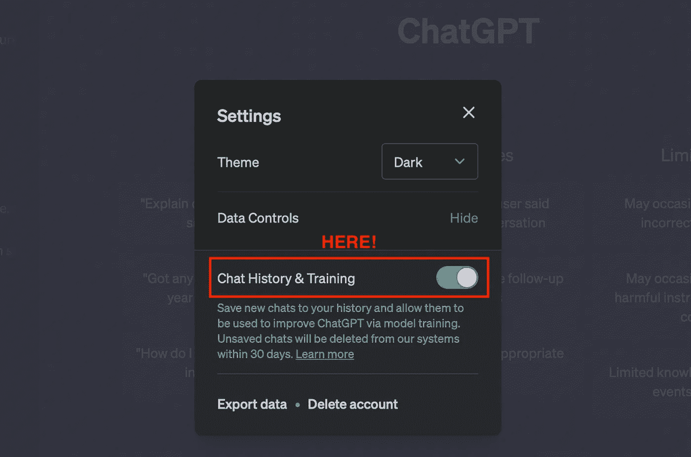
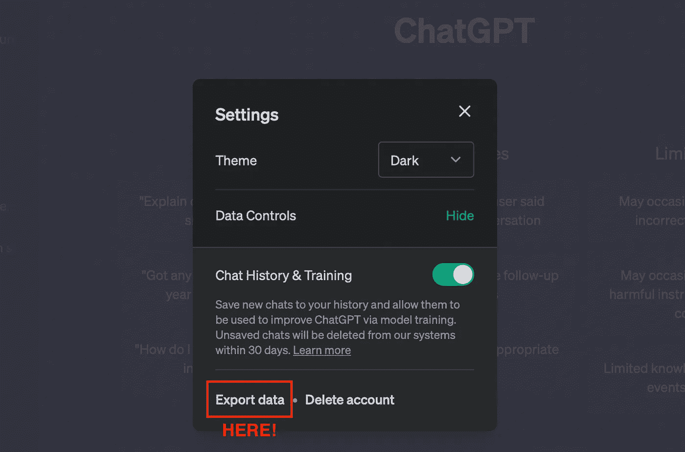
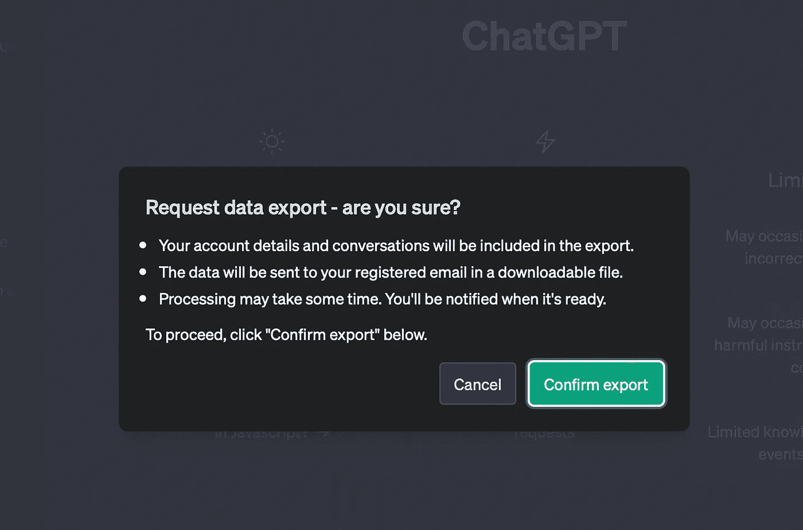
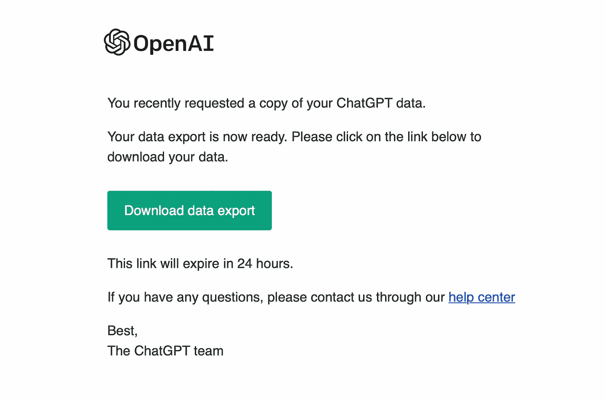
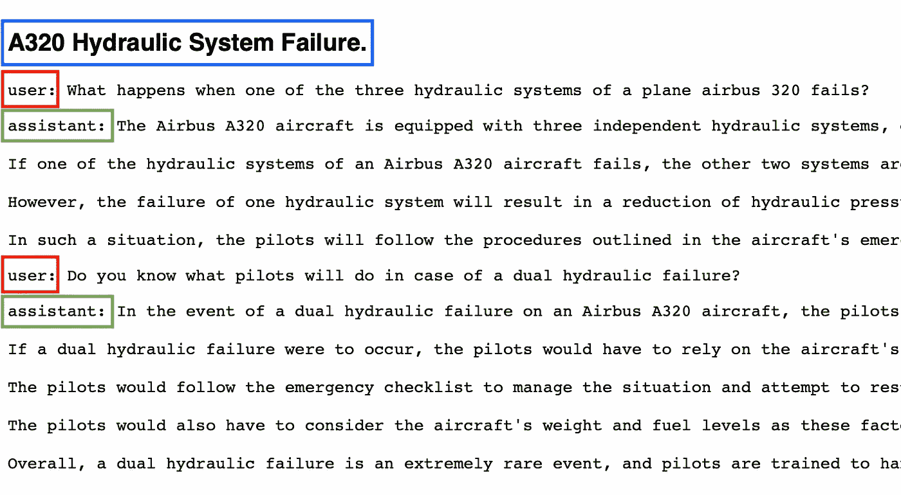

# ChatGPT 对你的了解：OpenAI 在数据隐私方面的进展

> 原文：[`towardsdatascience.com/what-chatgpt-knows-about-you-openai-towards-data-privacy-science-ai-b0fa2376a5f6`](https://towardsdatascience.com/what-chatgpt-knows-about-you-openai-towards-data-privacy-science-ai-b0fa2376a5f6)

## 管理 ChatGPT 个人数据的新方法

[](https://medium.com/@andvalenzuela?source=post_page-----b0fa2376a5f6--------------------------------)[](https://towardsdatascience.com/?source=post_page-----b0fa2376a5f6--------------------------------) [安德烈亚·瓦伦苏埃拉](https://medium.com/@andvalenzuela?source=post_page-----b0fa2376a5f6--------------------------------)

·发布于 [Towards Data Science](https://towardsdatascience.com/?source=post_page-----b0fa2376a5f6--------------------------------) ·阅读时间 11 分钟·2023 年 5 月 9 日

--


图片由 [马修·亨利](https://unsplash.com/@matthewhenry?utm_source=unsplash&utm_medium=referral&utm_content=creditCopyText) 提供，来源于 [Unsplash](https://unsplash.com/es/fotos/fPxOowbR6ls?utm_source=unsplash&utm_medium=referral&utm_content=creditCopyText)。

在 3 月 20 日 ChatGPT 数据中断引发的各种关注之后，我们迅速观察到外界的一些反应。**最强烈的反应是什么？** [*意大利因数据隐私问题禁止 ChatGPT*](https://medium.com/geekculture/ai-under-ban-italys-chatgpt-chatgpt3-chatgpt4-artificial-intelligence-data-science-ea0f6eabe073)。

近一个月后的事件，OpenAI 已经在用户数据隐私方面采取了一些措施：**可以关闭聊天记录功能并导出你的个人数据**，即他们从你与 ChatGPT 的互动中保留的数据。

这篇文章概述了 OpenAI 在强大 AI 生成技术 ChatGPT 的数据隐私方面采取的两项**主要措施**。我们将通过仔细查看 ChatGPT 从用户那里保留的数据，来尝试这两个新功能，以帮助你理解所给格式，从而解读你的数据。

# #1\. 关闭聊天记录

ChatGPT 的聊天记录不仅仅是存储你与聊天机器人对话的方式，让你可以随时登录查看过去的对话：**你的聊天记录也被用来训练和改进 ChatGPT 背后的模型**。

聊天记录功能于 2022 年 12 月 15 日启用，老实说：我们都从存储对话中受益！但也确实，这一功能引发了一些数据隐私问题：*ChatGPT 是否保存对话数据来训练其 AI 模型？* *如果对话中涉及敏感或个人数据怎么办？*

**现在 OpenAI 赋予了用户控制权！** 根据[OpenAI 的公告](https://openai.com/blog/new-ways-to-manage-your-data-in-chatgpt)，从 4 月 25 日起，可以禁用聊天记录，这样对话将不再出现在侧边栏中。此外，它们不会被用于进一步的训练，为用户提供了管理数据的选项。

之前，用户可以根据需求定期清除聊天记录，但任何对话仍然可以用于微调。目前，如果禁用聊天记录，**对话只会保留 30 天。这是为了防止由于工具的误用需要审核对话**，然后再永久删除它们。

在*设置*控制中禁用聊天记录非常简单。要在网页界面中访问*设置*，请导航到主页左下角的部分。会弹出一个小窗口，你将在那里找到*聊天记录和训练*的控制：



自制的 ChatGPT 设置窗口截图。

在这一点上，我相信你也会注意到这个问题：

*为什么 OpenAI 将保存聊天记录与使用这些数据训练其 AI 模型结合起来？*

**我猜这是一种微妙的方式，迫使用户继续使用他们的对话用于训练目的。** 作为对 OpenAI 的支持点，从我的专业经验来看，我清楚地看到使用这些真实数据进行训练的好处。

# **#2\. 导出你的个人数据**

OpenAI 还在 ChatGPT 的设置中添加了第二个新功能：**一个*导出*选项，以获取你的 ChatGPT 数据**，并了解 ChatGPT 存储了关于你的哪些信息。

这个新选项可以看作是朝着[欧盟通用数据保护条例](https://www.consilium.europa.eu/en/policies/data-protection/data-protection-regulation/#:~:text=The%20GDPR%20establishes%20the%20general,data%20processing%20operations%20they%20perform.)（GDPR）迈出的一个步骤。GDPR 定义了**处理数据的义务，以便利数据主体访问其个人数据**。这就是为什么收集个人信息的平台，如*Google*或*Netflix*，现在必须随时向用户提供他们拥有的数据。

在网页界面中，导出个人数据也非常简单。*导出数据*按钮就在*聊天记录和训练*按钮下方：



自制的 ChatGPT 设置窗口截图。

在导出数据的前几分钟，我在注册邮箱收到了一个包含我对话和其他相关信息的文件。



自制的 ChatGPT 设置窗口截图。

确认导出操作后，这是我在邮箱中收到的：



从 ChatGPT 的导出邮件中自制的截图。

点击*下载*按钮，我得到了一个包含 5 个`html`和`json`格式文件的文件夹。

允许用户请求其个人数据的公司使其遵守上述 GDPR 法规。然而，有一个问题：**文件格式可能使数据对大多数人不可读**。在这种情况下，我们得到了`html`和`json`文件。虽然`html`可以直接读取，`json`文件则可能更难以解释。我个人认为，新法规也应该强制要求数据具有可读格式。**但目前为止……**

**让我们一个一个地探索这些文件，以充分利用这个新功能！**

# 聊天记录

第一个文件是`chat.html`，其中包含我与 ChatGPT 的完整聊天记录。对话按其对应的标题存储。用户的问题和 ChatGPT 的回答分别标记为`assistant`和`user`。

*如果你曾经自己训练过 AI 模型，这个标记系统对你来说应该很熟悉*。

让我们观察一下我历史中的一个示例对话：



我从 ChatGPT 历史中自制的截图。对话标题用蓝色突出显示。用户/助手标签分别用红色和绿色突出显示。

# 用户反馈

*你是否见过 ChatGPT 回答旁边的竖起大拇指和竖下大拇指图标 (👍👎)？*

**这些信息被 ChatGPT 视为对给定答案的反馈**，这将有助于聊天机器人训练。

这些信息存储在`message_feedback.json`文件中，包含您通过竖起大拇指图标提供的任何反馈。信息以以下格式存储：

```py
[{"message_id": <MESSAGE ID>, "conversation_id": <CONVERSATION ID>, "user_id": <USER ID>, "rating": "thumbsDown", "content": "{\"tags\": [\"not-helpful\"]}"}]
```

`thumbsDown`评分用于记录错误生成的答案，而`thumbsUp`用于记录正确生成的答案。

# 用户数据

还有一个文件（`user.json`）包含用户的以下个人数据：

```py
{"id": <USER ID>, "email": <USER EMAIL>, "chatgpt_plus_user": [true|false], "phone_number": <USER PONE>}
```

**一些平台因根据用户使用平台的情况创建用户模型而闻名**。例如，如果*Google*的用户搜索大多与编程有关，*Google*可能会推断该用户是程序员，并利用这些信息显示个性化广告。

**ChatGPT 可以用对话中的信息做同样的事情，但目前他们被要求将这些推测的信息包含在导出的数据中**。

> ⚠️ ***仅供参考，*** *可以通过点击* Gmail *中的* 账户 *>>* 数据与隐私 *>>* 个性化广告 *>>* 我的广告中心 *来访问* Google 对他们的了解。

# 完整对话历史

还有一个包含对话历史的文件，还包括一些元数据。这个文件名为`conversations.json`，**包括诸如创建时间、多个标识符以及 ChatGPT 背后的模型等信息**。

> ⚠️ **元数据提供了关于主要数据的信息**。它可能包括数据来源、意义、位置、所有权和创建等信息。元数据涉及与主要数据相关的信息，但并不构成主要数据的一部分。

让我们探讨同一对话关于 *A320 液压系统故障* 的 `json` 格式。对话本身包含以下问答：

从这个简单的对话中，OpenAI 保留了相当多的信息。让我们回顾存储的信息：

+   `json` 文件的主要字段包含以下信息：

字段 `moderation_results` 是空的，因为 **在这个具体案例中没有提供反馈给 ChatGPT**。此外，`mapping` 字段中的 `[+]` 符号表示有更多信息可用。

+   实际上，`mapping` 字段包含关于对话本身的所有信息。由于对话有四次交互，映射为每次交互存储一个 `children` 条目。

再次，`[+]` 符号表示有更多信息可用。**让我们查看不同的条目！**

+   `mapping_id`：它包含对话的 `id` 以及关于创建时间和内容类型等信息。据推测，它还创建了对话的 `parent_id` 和对应于用户与 ChatGPT 之间下一个交互的 `children_id`。以下是一个示例：

+   `children_idX`：每次交互（无论是来自用户还是助手）都会创建一个新的 `children` 条目。由于对话有四次交互，因此 `json` 文件显示了四个 `children` 条目。每个 `children` 条目具有以下结构：

第一个 `children` 条目在对话中被嵌套，具有 `mapping_id` 作为父项，第二次交互 *— ChatGP 的回答 —* 作为第二个子项。

+   `Children` 对应于 ChatGPT 答案的条目包含额外的字段。例如，对于第二次交互：

在 ChatGPT 的回答中，**我们获得关于 ChatGPT 背后的模型和停止词的信息**。它还显示了第一个 `children` 作为其 `parent` 和第三个 `children` 作为下一个交互。

完整的文件可以在这个 GitHub [gist](https://gist.github.com/aandvalenzuela/1bc444520c59a2b4a5e8e686666a880d) 中找到。

# 模型比较

*你是否曾在对 ChatGPT 提供的回答不完全满意时使用过“重新生成回答”按钮？*


ChatGPT 中“重新生成回答”按钮的自制截图。

**这些反馈信息也被存储！**

有一个名为 `model_comparisons.json` 的文件，它**包含对话片段及每次 ChatGPT 重新生成回答时的连续尝试**。信息仅包含文本，不包括标题，但包括其他一些元数据。以下是该文件的基本结构：

```py
{
  "id":"<id>",
  "user_id":"<user_id>",
  "input":{[+]},
  "output":{[+]},
  "metadata":{[+]},
  "create_time": "<time>"
}
```

`metadata`字段包含一些重要信息，如对话发生的国家和大陆，以及`https`访问协议的信息等。该文件的有趣部分在于`input`/`output`条目：

## 输入

`input`包含来自原始对话的一系列消息。交互根据*作者*进行标记，并且如前所述，还存储了一些额外的信息。让我们观察一下我们样本对话中存储的消息：

`User`/`Assistant`条目是预期的，但我相信在这一点上我们都在想***为什么会有一个*** `***system***` ***标签呢？***

而且，*为什么他们在每次对话开始时都要提供这样的初始声明呢？*

*ChatGPT 是否在任何新的对话中预先提供当前日期？*

*是的*，**这些条目就是所谓的系统消息**。

## 系统消息

系统消息为助手提供总体指示。**它们帮助设置助手的行为**。在网页界面中，系统消息对用户是透明的，这也是我们看不到它们的直接原因。

**系统消息的好处在于，它允许开发者在不将请求本身作为对话的一部分的情况下调整助手的行为**。可以通过 API 提供系统消息。例如，如果你正在构建一个汽车销售助手，一个可能的系统消息可以是*“你是一个汽车销售助手。使用友好的语气与用户交谈，直到了解他们的需求。然后，解释符合他们偏好的可用汽车”*。你甚至可以提供车辆清单、规格和价格，以便助手也能提供这些信息。

## 输出

输出条目包含 ChatGPT 给出的回应以及每次点击*再生回应*按钮时的连续尝试：

如上所述，`feedback_step_1`条目存储了之前提到的点赞/点踩反馈信息。

再生信息存储在`feedback_step_2`条目中，其中第一个子条目`original_turn`用于原始回应，而重试的回应则在`new_turn`下。

**这就是 OpenAI 对我们与 ChatGPT 互动的所有信息！** 我认为了解哪些信息被存储对于两个主要目的是有用的。

首先，在当今的数据世界中，**关注我们的隐私并了解平台存储和推测的关于我们的信息是非常重要的**。其次，了解信息的结构和处理方式可以帮助我们使用 ChatGPT 作为起点来构建定制化的模型。例如，通过查看我们自己的数据，**我们意识到你可以通过系统消息来引导 ChatGPT**，以透明的方式将代理定向到我们希望其执行的目标。

# 总结

在这篇文章中，我们回顾了 OpenAI 在过去几个月中对用户数据隐私问题的回应措施。

关闭聊天记录的可能性以及随时导出个人数据的新功能都是保护 ChatGPT 用户的重要步骤。我个人认为这些措施承诺了优先考虑数据隐私，遵守相关数据保护法规。**透明性和安全性是建立信任和确保负责任的 AI 使用的关键**。

从我们的角度来看*— 用户端 —*，我认为了解管理数据隐私的可能性是很有必要的。特别是关于这两个控制基本点的新功能，比如确保你的 ChatGPT 互动不会被用于训练目的（如果你不希望这样的话），或明确获得公司对你的数据。

当然，使用这项技术还有其他风险。例如，用户还应了解**数据保留政策**。即知道平台保留数据的时间，这个时间理想上应为最短必要时间。了解你提供给 AI 平台的数据的**预期用途**以及是否**平台将你的数据与第三方共享及共享目的**也是我们主要关注的内容。

考虑这些因素，**用户可以在使用 ChatGPT 或其他大型语言模型时做出明智的关于数据隐私的决策**。

主动了解你的数据如何处理并采取措施保护你的隐私权利是很重要的。

就这些！非常感谢你的阅读！

我希望这篇文章能帮助**理解 ChatGPT 在我们的对话中保留的信息**，以及**管理新 OpenAI 功能以保护数据隐私**。

你也可以订阅我的 [**通讯**](https://medium.com/@andvalenzuela/subscribe) 以获取最新内容。**特别是**，**如果你对 ChatGPT 相关的文章感兴趣**：

[## 解锁 ChatGPT 的新维度：文本转语音集成](https://medium.com/geekculture/prompt-engineering-prompting-guidelines-chatgpt-chatgpt3-chatgpt4-artificial-intelligence-6b74f35d2695?source=post_page-----b0fa2376a5f6--------------------------------)

### 提升 ChatGPT 交互中的用户体验

## 从 OpenAI 提供的提示工程课程中学到的内容 — 提示指南

### 了解 OpenAI 的更佳提示指南

[提高 ChatGPT 性能的提示工程](https://medium.com/geekculture/prompt-engineering-prompting-guidelines-chatgpt-chatgpt3-chatgpt4-artificial-intelligence-6b74f35d2695?source=post_page-----b0fa2376a5f6--------------------------------) [## 提升 ChatGPT 性能的提示工程

### 如何向 ChatGPT 提问以最大化成功回答的几率

[levelup.gitconnected.com](https://levelup.gitconnected.com/improve-chatgpt-performance-prompt-engineering-data-science-artificial-intelligence-6fa3953bc5b6?source=post_page-----b0fa2376a5f6--------------------------------) [## 使用迁移学习创建您自己的 ChatGPT

### 通过微调提升 ChatGPT 能力

[medium.com](https://medium.com/geekculture/openai-fine-tuning-custom-chatgpt-transfer-learning-prompt-data-science-machine-learning-chatgpt3-chatgpt4-2aad7148438a?source=post_page-----b0fa2376a5f6--------------------------------) [## 请 ChatGPT 帮助我使用您的 API！

### 使用 ChatGPT API 提升您的 Python 脚本

[betterprogramming.pub](https://betterprogramming.pub/chatgpt-python-api-chatgpt3-openai-prompts-data-science-artificial-intelligence-ff179baf61c5?source=post_page-----b0fa2376a5f6--------------------------------)

**随时向我提出任何问题**，*forcodesake.hello@gmail.com* :)
