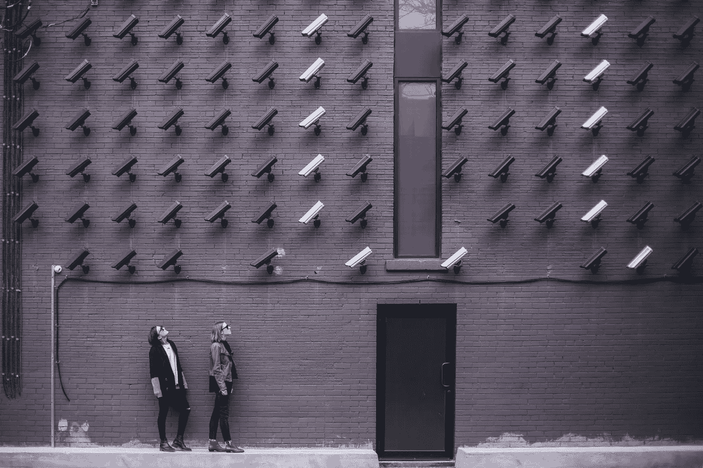

# ChatGPT 对你的了解：OpenAI 在数据隐私方面的进展

> 原文：[`towardsdatascience.com/what-chatgpt-knows-about-you-openai-towards-data-privacy-science-ai-b0fa2376a5f6?source=collection_archive---------5-----------------------#2023-05-09`](https://towardsdatascience.com/what-chatgpt-knows-about-you-openai-towards-data-privacy-science-ai-b0fa2376a5f6?source=collection_archive---------5-----------------------#2023-05-09)

## 在 ChatGPT 中管理个人数据的新方法

 [Andrea Valenzuela](https://medium.com/@andvalenzuela?source=post_page-----b0fa2376a5f6--------------------------------)

·

[关注](https://medium.com/m/signin?actionUrl=https%3A%2F%2Fmedium.com%2F_%2Fsubscribe%2Fuser%2Fa6f3f1654c3&operation=register&redirect=https%3A%2F%2Ftowardsdatascience.com%2Fwhat-chatgpt-knows-about-you-openai-towards-data-privacy-science-ai-b0fa2376a5f6&user=Andrea+Valenzuela&userId=a6f3f1654c3&source=post_page-a6f3f1654c3----b0fa2376a5f6---------------------post_header-----------) 发表在 [Towards Data Science](https://towardsdatascience.com/?source=post_page-----b0fa2376a5f6--------------------------------) ·11 分钟阅读·2023 年 5 月 9 日 

--

图片由 [Matthew Henry](https://unsplash.com/@matthewhenry?utm_source=unsplash&utm_medium=referral&utm_content=creditCopyText) 提供，来源于 [Unsplash](https://unsplash.com/es/fotos/fPxOowbR6ls?utm_source=unsplash&utm_medium=referral&utm_content=creditCopyText)。

在 ChatGPT 于 3 月 20 日的数据中断引发的所有担忧之后，我们迅速观察到了外界的一些反应。**最强烈的反应是什么？** [*意大利因数据隐私担忧禁止 ChatGPT*](https://medium.com/geekculture/ai-under-ban-italys-chatgpt-chatgpt3-chatgpt4-artificial-intelligence-data-science-ea0f6eabe073)。

事件发生近一个月后，OpenAI 已经采取了一些措施来保护用户数据隐私：**关闭聊天记录和导出个人数据的可能性**，即他们从你与 ChatGPT 互动中保留的数据。

本文概述了**OpenAI 在强大的 AI 生成技术 ChatGPT 中采取的两个主要数据隐私措施**。我们将仔细观察 ChatGPT 保存的用户数据，帮助你理解给定的格式，从而解读你的数据。

# #1\. 关闭聊天记录

ChatGPT 的历史记录不仅仅是存储你与聊天机器人对话的方式，以便你可以随时登录查看过去的对话：**你的聊天记录还用于训练和改进 ChatGPT 背后的模型**。

聊天记录于 2022 年 12 月 15 日启用，老实说：我们都从中受益…
