# 熵度量了什么？直观解释

> 原文：[`towardsdatascience.com/what-does-entropy-measure-an-intuitive-explanation-a7f7e5d16421`](https://towardsdatascience.com/what-does-entropy-measure-an-intuitive-explanation-a7f7e5d16421)

 [Tim Lou, PhD](https://tim-lou.medium.com/?source=post_page-----a7f7e5d16421--------------------------------)

·发表于 [Towards Data Science](https://towardsdatascience.com/?source=post_page-----a7f7e5d16421--------------------------------) ·阅读时间 11 分钟·2023 年 1 月 4 日

--

熵可能看起来很抽象，但它有一个直观的方面：即看到数据中某些模式的概率。它是如何工作的呢？

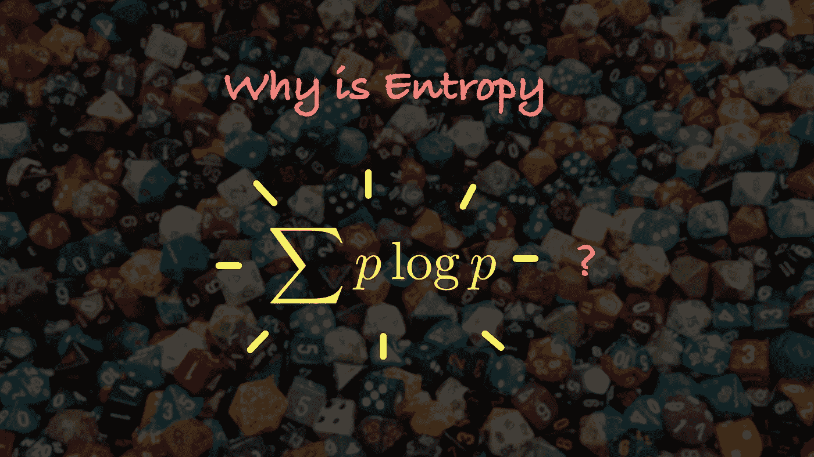

背景来源：Joe Maldonado [@unsplash](https://unsplash.com/@joesracingteam)

在数据科学中，有许多与熵的概念相关的概念。最基本的是香农信息熵，通过公式定义在任意分布 *P*(*x*) 中：

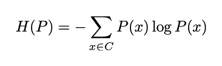

其中求和是对所有可能的类别 *C* 进行的。

还有其他相关的概念，其公式类似：

+   [Kullback–Leibler 散度](https://en.wikipedia.org/wiki/Kullback%E2%80%93Leibler_divergence)：用于比较两个分布

+   [互信息](https://en.wikipedia.org/wiki/Mutual_information)：用于捕捉两个变量之间的一般关系

+   [交叉熵](https://en.wikipedia.org/wiki/Cross_entropy)：用于训练分类模型

尽管熵类似的公式很普遍，但关于公式背后的直觉讨论却很少：为什么涉及对数？为什么我们要将 *P*(*x*) 和 log *P*(*x*) 相乘？虽然许多文章提到“信息”、“期望惊讶”等术语，但其背后的直觉却缺失。

事实证明，正如概率一样，熵可以通过计数练习来理解，并且可以与分布的某种对数似然性联系起来。此外，这种计数还可以与计算机中的字节数字面上的数量相关联。这些解释将使我们能够揭开熵的许多事实。好奇吗？那就开始吧！

# 计数熵

概率的计数定义使得它变得如此直观（照片由 [Ibrahim Rifath](https://unsplash.com/@photoripey?utm_source=medium&utm_medium=referral) 提供，来源于 [Unsplash](https://unsplash.com/?utm_source=medium&utm_medium=referral)）

概率可以从操作上定义：当我们说一枚硬币有 50%的机会落到正面时，这意味着如果我们将硬币抛掷一百万次，正面的次数将接近五十万。随着试验次数的增加，这一比例会越来越接近 50%的概率。这一定义使得概率变得如此直观。

熵是否有类似的解释？有的，不过计数会稍微复杂一些：这将需要一些基础的组合数学。

有多少种方法可以排列 *N* 个不同的球？第一个球有 *N* 种选择，第二个球有 *N* − 1 种选择……等等。答案是 *N*!，或者阶乘符号：

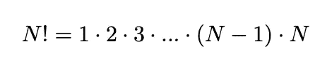

就像在概率的定义中，我们将处理非常大的数字。因此，通过 [斯特林近似](https://en.wikipedia.org/wiki/Stirling%27s_approximation) 来近似这个对象是有帮助的：

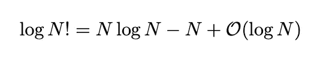

其中 log 表示自然对数；如果我们使用其他基数如 log₂ 和 log₁₀，也存在类似的公式（这将决定我们测量熵的单位）。大 O 符号表明近似在 *N* 很大时的有效性。术语 *N* log *N* 将成为熵定义中 *p* log *p* 的来源。

我们现在准备推导熵所计数的内容。想象有大量可区分的对象或可区分的数据点。这些 *N* 数据点被分组为 *c* 个类别，如下图所示：

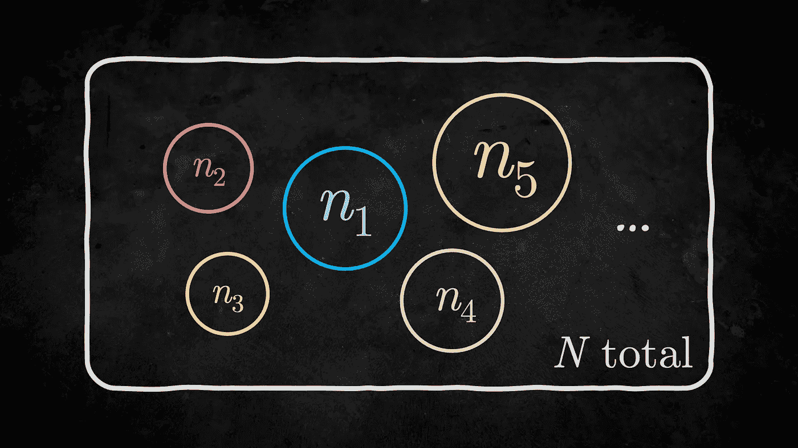

这种情况的总排列方式是多少？记住我们不关心任何类别中数据的排序，答案由经典的多项式系数给出：

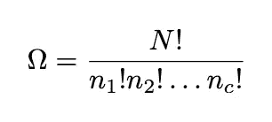

我们用 Ω 符号来表示配置的数量。

就像概率的情况一样，我们只对大的 *N* 行为感兴趣。当处理如此大的数字时，取对数是有帮助的，这样我们可以使用斯特林近似来使事情更可控：

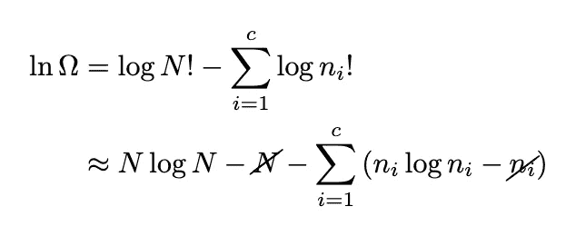

公式可以通过利用所有 *nᵢ* 总和等于 *N* 的事实来简化，

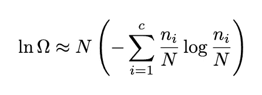

如果我们将 *nᵢ*/*N* → *P*(*i*) 代入，我们就得到了熵的公式。或者，对于大的 *N*，我们可以写成：

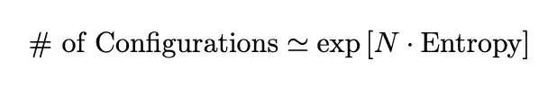

所以我们达到了熵的操作定义：

> 熵计算了将大量数据分类成给定概率分布的方式数（以对数单位和每个数据点计算）。

这个计数练习是信息理论的核心，我们接下来会讨论它。

# 熵作为信息

那么，我们的熵概念如何与计算机中的字面 0 和 1 比特相关呢？

当我们将熵应用于 1 和 0 的模式时，熵的概念可以与信息相关（信用：[Gerd Altmann](https://pixabay.com/users/geralt-9301/)）。

想象一个固定长度为*N*的二进制序列。直观上我们知道它包含*N*比特的信息：因为实际上需要*N*比特来存储序列到硬盘或内存中。

但如果序列有一些有趣的模式，例如下面的呢？

+   000000000000000000000000000

+   010101010101010101010101010

+   000000010000000000000000000

在这些情况下，二进制序列表示会非常低效。我们直观地知道有更高效的存储方式：我们可以指定模式，而不是所有的字面比特，这些序列中的有效信息量应该更小。

所以，如果我们忽略数字重复的微妙模式，只看数字的基本统计属性（0 和 1 的比例），在存储这些序列时我们能做得更好吗？

这是我们的熵计数公式可以帮助我们的地方：它可以计算给定固定比例的 0 和 1 的总序列数。

在 0 和 1 的比例为 50/50 的情况下，总的可能性数量是（在大的*N*极限下）：

我们看到这大致上产生了所有可能的二进制序列的数量 2*ᴺ*。所以存储序列所需的比特数仍然是*N*。这并不令人惊讶，因为我们知道随机序列应该无法压缩：它具有最大*N*比特的信息。

但如果比例不再是 50/50 呢？我们应该期望有一些潜在的节省。在这种情况下，存储一个序列所需的比特总数将是：

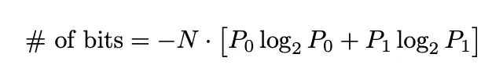

让我们 sanity check 当 0 的数量远小于 1 的数量时的情况，比如*n* ≪ *N*。在这种情况下，可以忽略*P*₁项，所需的比特数为：

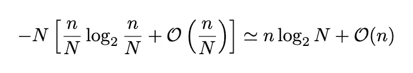

因此，信息量与*n*成正比，而不是*N*。这是因为我们现在只需要存储每个 0 的位置，而不是整个序列。

这说明了熵与计算机中物理比特和字节相关的力量。总之，

> 信息熵指定了每单位长度所需的比特数，用于存储由给定概率分布生成的序列。

换句话说，熵是一种针对序列中固定比例字符的*最佳*压缩比。这是熵与信息相关联的方式。

除了将序列视为我们的研究对象，我们还可以将注意力转向分布本身。这种观点使我们能够将熵解释为一种概率（或对数似然）。

# 熵作为对数似然

熵计算的是可能性的数量。我们想将其转换为一种概率。为此，我们只需对计数进行归一化。

将 *N* 个数据点分为 *c* 类别的总方法数是多少？答案很简单，因为每个数据点有 *c* 种选择：

我们现在可以将熵的计数除以总数以获得概率（替换 *nᵢ*/*N* → *P*(*i*)）：

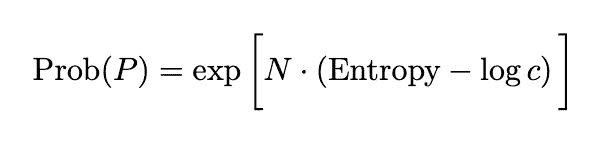

这样，熵变成了观察到特定分布的概率（由于 *N* 很大，趋近于最终值）：

> 熵可以视为观察给定分布的对数似然（每个数据点）。

然而，我们的讨论中存在一个隐含的假设，即我们在计算中将每种配置视为同样可能。如果某些类别比其他类别更受青睐会发生什么？

我们可以考虑一些参考分布 *Q*(*x*)。如果每个数据点有 *Q*(*x*) 的机会进入特定类别 *x*，那么观察到类别 1 中的 *n*₁、类别 2 中的 *n*₂ 等的概率由多项式概率给出：

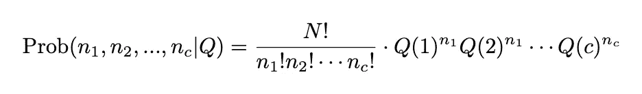

我们可以再次使用斯特林近似。计算过程与之前类似，只是最后多了一个 *Q*(*i*)。

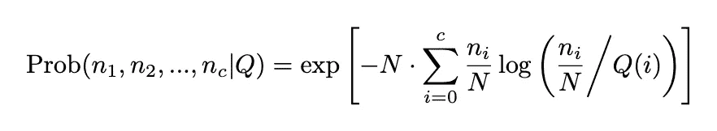

替换 *nᵢ*/*N* → *P*(*i*)，指数内的项变成了 [Kullback–Leibler 散度](https://en.wikipedia.org/wiki/Kullback%E2%80%93Leibler_divergence)。因此，我们的方程可以总结为

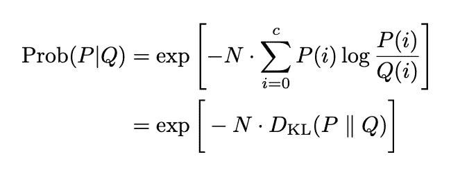

在这里，我们使用了指数内的 KL-散度的常见表示法。KL-散度是香农信息熵的推广，我们的方程使我们的解释更加精准：

> P 相对于 Q 的 Kullback-Leibler 散度是观察到 P 时按照 Q 采样的负对数似然（每个数据点）。

再次说明，所有这些都是假设 *N* 非常大。

关于 KL-散度的一些事实现在变得明显：

1.  KL-散度始终非负：这是因为概率永远不会大于 1。

1.  KL-散度可以是无限的：这发生在两个分布没有重叠时，因此计数的结果为 0 = exp[–∞]。

1.  KL-散度为零当且仅当 *P* = *Q*：当我们按照 *Q* 采样数据时，我们期望结果分布类似于 *Q*——这种期望在 *N* 很大时是准确的。

凭借这种新的理解，我们现在准备重新解释数据科学中各种熵概念的事实！

# 熵采样器

下面我们将讨论数据科学中一些常见的类似熵的变量的直觉。我们将再次提醒读者，大* N*极限是隐含假设的。

## 交叉熵

这对训练分类变量很有用。定义为

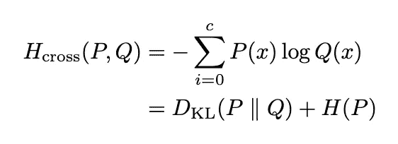

请注意，我们已经将定义重写为 KL 散度和香农信息熵的和。这可能看起来有点不熟悉，因为当我们训练机器学习模型时，我们仅通过样本（比如*S*）计算其估计值

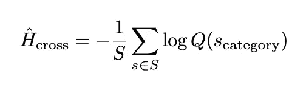

利用我们的计数直觉，我们得出结论

> 最小化交叉熵等同于最大化观察到与我们从分布 Q 中采样的数据统计相同的对数似然性，如果我们从训练中的分布 Q 中采样数据

这使得交叉熵损失与回归中的 L2 损失处于类似的概念基础上：它们都是某种对数似然函数。

## 互信息

互信息可以被视为两个变量之间的一种广义相关性。用*I*表示，它通过 KL 散度定义

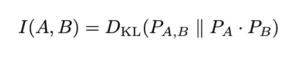

在 KL 散度计算中，我们比较两个变量的分布与考虑每个变量单独分布的分布。

我们的计数直觉给出了一个很好的解释：

> 互信息是获得两个变量给定分布的负对数似然性（每个数据点），当我们根据其边际分布独立地采样这两个变量时

这解释了为什么互信息是一个强大的工具，可以捕捉变量之间的非线性相关性。

## 熵的不可避免增加？

最后，我们准备讨论关于熵的最著名事实之一：热力学定律和熵的不可避免增加。

但需要记住的是，这里存在两个熵的概念：

1.  数据科学中的香农信息熵

1.  热物理学中的熵

熵的增加是一个仅适用于第二种情况的物理定律。然而，物理中的熵可以被视为应用于物理系统时香农熵的一个特例，所以两者之间有联系。

这意味着在计数练习中，可能性数量将不可避免地增加。这很直观，因为当一个物理（混沌）系统不受约束时，它最终应该会采样所有可能性。这有点类似于著名的墨菲定律，它说“任何可能出错的事情都会出错”。

从数据科学的角度来看，如果我们相信我们的数据是某些动力系统的结果，那么最大化熵可能是合理的：因为如果我们相信所有变量都已被考虑，就没有理由认为我们的数据不会探索所有可能性。换句话说，我们希望考虑所有可能性/组合——即使是那些在我们数据中不存在的。这或许赋予了熵的概念在数据科学中强大的超能力。

> 通过计算所有可能性，熵是我们无知的保守测量

这种观点在我另一篇关于[熵](https://medium.com/swlh/entropy-is-not-disorder-a-physicists-perspective-c0dccfea67f1)的文章中得到了探讨。

# 结论

通过将熵的公式解释为计算可能性，我们能够理解熵在信息理论中的作用，并将熵视为一种概率。这种解释最终使各种熵的概念变得有意义和有用。

如果你有任何想法和反馈，请分享，祝阅读愉快！👋

如果你喜欢这篇文章，你可能对我的一些其他相关文章感兴趣：

 [## 熵不是混乱：物理学家的视角

### 熵常被视为混乱的同义词。但它到底是什么呢？在本文中，我们探索了熵如何更多地……

[medium.com](https://medium.com/swlh/entropy-is-not-disorder-a-physicists-perspective-c0dccfea67f1?source=post_page-----a7f7e5d16421--------------------------------)  ## 物理学家对机器学习的看法：机器学习的热力学

### 自然界中的复杂系统可以通过热力学成功研究。那么，机器学习呢？

[towardsdatascience.com  [## 为什么我们不生活在模拟中

### 将现实描述为模拟大大低估了我们世界的复杂性。以下是为什么模拟……

[medium.com](https://medium.com/physicist-musings/why-we-dont-live-in-a-simulation-a-physicist-s-perspective-1811d65f502d?source=post_page-----a7f7e5d16421--------------------------------)
