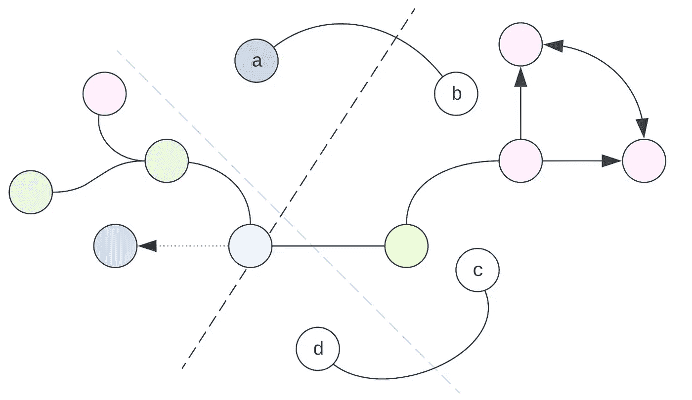

# 算法“学习”究竟意味着什么？

> 原文：[`towardsdatascience.com/what-does-it-really-mean-for-an-algorithm-to-learn-1f3e5e8d7884?source=collection_archive---------0-----------------------#2023-04-22`](https://towardsdatascience.com/what-does-it-really-mean-for-an-algorithm-to-learn-1f3e5e8d7884?source=collection_archive---------0-----------------------#2023-04-22)

## 两种一般视角和一些心理学

 [Andre Ye](https://andre-ye.medium.com/?source=post_page-----1f3e5e8d7884--------------------------------)

·

[关注](https://medium.com/m/signin?actionUrl=https%3A%2F%2Fmedium.com%2F_%2Fsubscribe%2Fuser%2Fbe743a65b006&operation=register&redirect=https%3A%2F%2Ftowardsdatascience.com%2Fwhat-does-it-really-mean-for-an-algorithm-to-learn-1f3e5e8d7884&user=Andre+Ye&userId=be743a65b006&source=post_page-be743a65b006----1f3e5e8d7884---------------------post_header-----------) 发布于 [Towards Data Science](https://towardsdatascience.com/?source=post_page-----1f3e5e8d7884--------------------------------) ·20 分钟阅读·2023 年 4 月 22 日

--

当一个人首次接触机器学习时，通常会急于一算法接一算法、一技术接一技术、一个方程接一个方程。然而，之后才有机会反思他们所获得知识的一般趋势。

“学习”是什么意思是一个非常抽象的概念。本文的目标是提供机器学习的两个一般解释。这两种解释，正如我们将看到的，是同一事物的两个方面，并且在机器学习中普遍存在。

即使你在机器学习方面有经验，你也可能会从暂时脱离具体机制，考虑在抽象层面上的学习概念中获得一些启发。

机器学习中大致有两种关键的学习解释，我们将称之为***损失导向参数更新***和***流形映射***。正如我们将看到的，它们与心理学和心灵哲学有实质性的联系。

# 损失导向参数更新

一些之前讨论过的机器学习算法采用了***白纸***的方法：它们从一个‘空白的’随机猜测开始……
