# 算法“学习”到底意味着什么？

> 原文：[`towardsdatascience.com/what-does-it-really-mean-for-an-algorithm-to-learn-1f3e5e8d7884`](https://towardsdatascience.com/what-does-it-really-mean-for-an-algorithm-to-learn-1f3e5e8d7884)

## 两种一般观点和一些心理学

 [Andre Ye](https://andre-ye.medium.com/?source=post_page-----1f3e5e8d7884--------------------------------)

·发表于 [Towards Data Science](https://towardsdatascience.com/?source=post_page-----1f3e5e8d7884--------------------------------) ·阅读时间 20 分钟·2023 年 4 月 22 日

--

当人们第一次接触机器学习时，通常会快速浏览一个又一个算法、一个又一个技术、一个又一个方程。但之后，才有可能反思他们所掌握的知识中的一般趋势。

“学习”意味着什么是一个非常抽象的概念。本文的目标是提供机器学习中“学习”的两种一般解释。这两种解释，正如我们将看到的，是同一枚硬币的两面，并且在机器学习中普遍存在。

即使你在机器学习方面经验丰富，暂时脱离具体的机制，考虑学习的抽象概念，可能仍会有所收获。

在机器学习中，学习有两个主要的解释，我们称之为***损失导向参数更新***和***流形映射***。正如我们将看到的，它们与心理学和心灵哲学有实质性的联系。

# 损失导向参数更新

一些之前讨论的机器学习算法采用了***白板***方法：它们从一个“空白”随机猜测开始，并迭代改进其猜测。这个范式对我们来说似乎很直观：当我们尝试掌握一项新技能，比如学习骑自行车或简化代数表达式时，我们犯了许多错误，并通过“实践”变得更好。然而，从算法的角度来看，我们需要明确识别两个实体的存在：***状态***和***损失***。

算法的***状态***由其一组*参数*的值定义。在这个上下文中，参数是决定算法行为的非静态值。例如，考虑优化你的保龄球游戏。有几个参数：保龄球的重量、你在指孔中的手指配置、准备投球时的速度、你手臂的速度、你投球的角度、释放时的旋转等等。每次你投球时，你都定义了一个新的*状态*，因为你作为一个优化算法正在尝试新的参数（除非你投球的方式完全相同，否则你是在返回到之前的状态，但在保龄球和机器学习中这种情况都很少见）。

线性回归和逻辑回归中的每一个系数都是一个参数。基于树的模型没有固定数量的参数，因为它们的深度是自适应的。相反，它们可以根据需要创建更多或更少的条件来优化信息增益标准，但这些都是参数。

然而，基于树的模型——以及所有算法——都受到***超参数***的影响。这些是参数自身必须遵循的系统级约束。决策树的最大深度和随机森林集成中的树的数量都是超参数的例子。在我们的保龄球示例中，元参数可能包括建筑物的湿度、你所穿的保龄球鞋的质量以及保龄球道的拥挤程度。作为一种优化算法，你存在于这些条件*之中*，必须优化你的内部参数（你选择哪个保龄球，你如何投球等），即使你不能改变基本条件。

***损失***，另一方面，是任何给定状态的‘坏 ness’或错误。损失必须制定如何从模型的行为中得出坏 ness。例如，假设我采取了某种状态——我选择了一个直径为 6.3 英寸的保龄球，以每小时 18 英里的速度、相对于球道边缘 9 度的角度释放球，距离球道四英尺远，等等——并击倒了 6 个球瓶。我的状态的行为是我击倒了 6 个球瓶。为了量化状态的坏 ness，我们计算我*没有*击倒的球瓶数量——4 个球瓶，给定这些确切的状态参数释放的保龄球。为了最小化我的坏 ness，我会在下一次投球时调整我的参数。

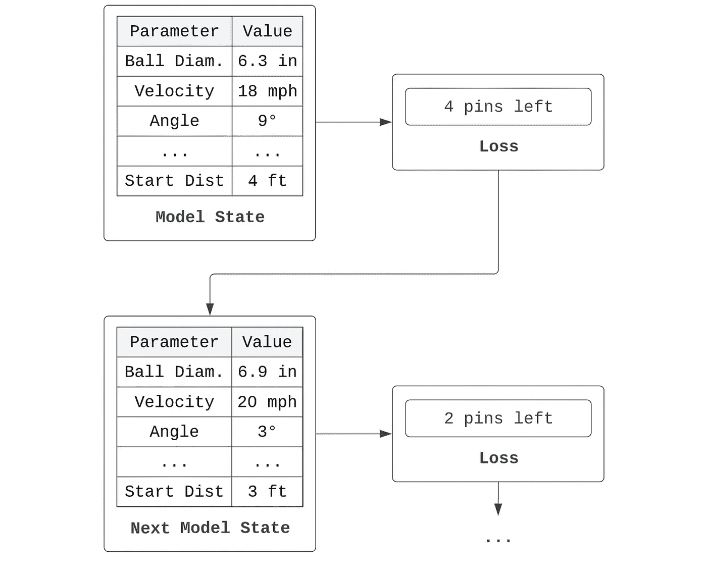

从算法的角度来说，状态通常是一组系数或标准，它们将输入转化为预测，而损失是模型预测与期望输出之间差异的数学量化。假设一个模型有*n*个参数，用`{x_1, x_2, ..., x_n}`表示。这些参数可能是线性回归模型的系数，*k*-均值模型中簇的中心，或是决策树模型中的分裂标准。我们可以推导出该模型在某些数据集上的误差——例如，均方误差。如果模型迭代地调整其参数集以改善损失，那么我们说它在*学习*。

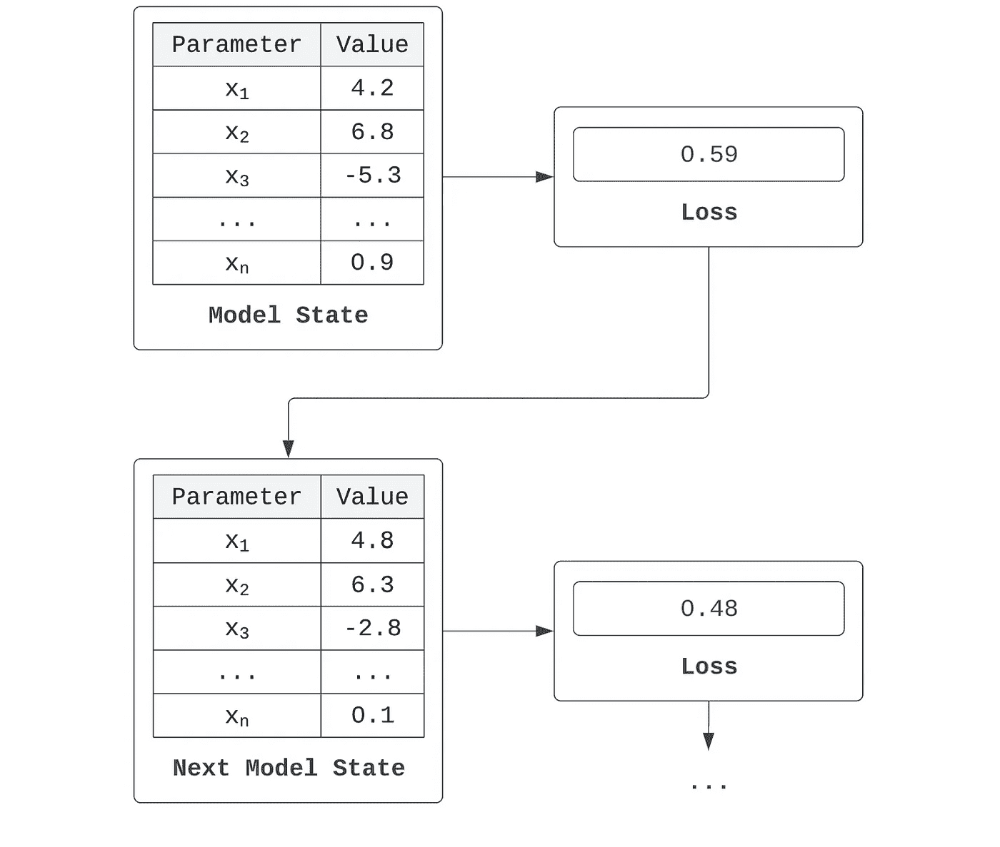

尽管我们可以大致称整个过程为学习，实际的学习*算法*发生在从损失到参数更新的转换过程中。当前状态的评估（即从参数到损失的转换或推导）可能被视为‘感知’或一种‘智能’过程。

一个心理学和进化学上受到启发的假设认为，我们作为人类不断地进行一种优化游戏，这种游戏在概念上类似于通过损失导向的参数更新范式进行学习的模型：我们不断观察状态的‘糟糕’程度，并通过调整状态来改进糟糕程度。然而，我们对糟糕程度的衡量比均方误差计算更复杂：我们同时处理各种信号，内部和外部，直观和计算的，并尝试将这些信号与我们当前可变特征集联系起来。例如，当你在保龄球时，你可能并不是直接尝试优化击倒的瓶数，即使你试图这样做。相反，你可能在尝试减少社交焦虑或最大化你约会对象或朋友的印象，这不一定会导致与最大化击倒瓶数相同的最优状态配置。

牢记这一点——我们可以将自己的行为视为对状态糟糕程度评估的响应中可变状态的不断更新——可以帮助我们更好地理解损失驱动的参数更新行为的问题和现象。例如，人们并不总是在改变他们的状态，即使他们不断地评估自己的状态。这展示了*收敛*——这些人已经达到了一个状态集，在这个状态集中，没有任何可行的状态变化会减少糟糕程度。

另外，一些人由于上瘾（对物质、赌博、社交媒体滚动等）或因严重的偏执（担心陷入经济困境、失去珍贵物品、失去尊重、大量人群等）而不幸陷入了重复的破坏性行为。在学习的技术语言中，我们将这些称为***局部最小值***。这些是代理人到达并“选择”不离开的汇聚点，要么是因为留在那里比立即采取任何步骤离开更容易（例如，摆脱上瘾），要么是因为，等效地，立即离开比留下来更糟（即担心因某些变化而损害或恶化自己的状态）。

算法通常表现出类似的行为，尽管当然在更少人性化的方式中。我们经常通过***损失景观***的概念，以几何和定量的方式来构思损失与状态之间的关系。在损失景观中，每个参数都有一个轴，额外还有一个损失轴。损失景观使我们能够将每组参数值映射到相应的损失值。

为了说明这个关键概念，假设你正在尝试学习测试的最佳学习策略。我们只考虑学习*一个参数*——你为测试学习的小时数。假设你之前参加过四次测试，那么——为了说明问题，假设这些测试在环境上是可比的——你有四个数据点可以学习。对于这四次测试中的每一次，你学习了不同的小时数，相应地获得了不同的表现：完全不学习时为 60%，学习 1.5 小时时大约为 75%，学习 4 小时时大约为 70%，学习 6 小时时大约为 60%。我们将这些数据绘制如下，显示损失——通常在损失较小时更为理想，因此在这种情况下将是*错误率*（表现的倒数）——如何随着优化参数的变化而变化。

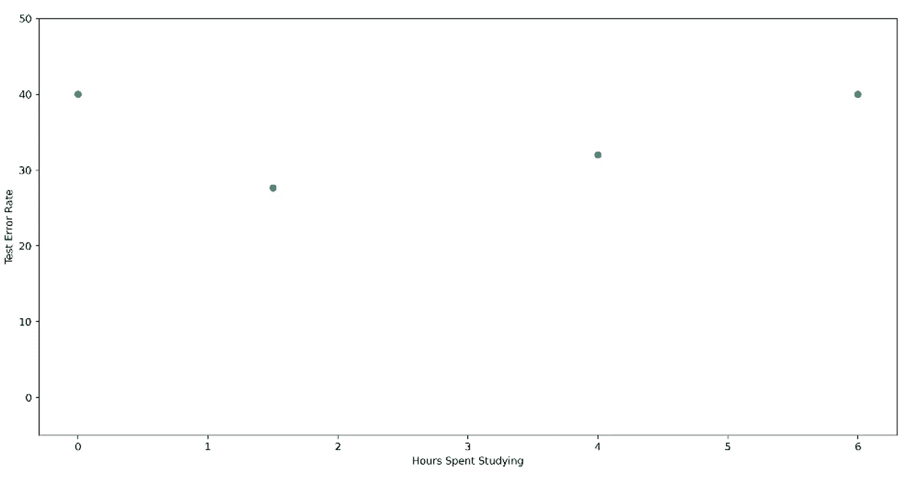

利用这些信息，我们想要找到最佳的学习小时数，以获得最小的错误率。从我们收集到的信息来看，最佳的参数值似乎在两小时左右。但我们如何确定？我们如何考虑接近的答案或远离的答案？我们如何描述查看数据和寻找最小损失的过程？

损失景观是一个概念工具，帮助我们以物理的、定量的方式思考学习。我们设想可以获取每个参数值及其对应错误率之间的确切关系。这使我们能够在参数-损失空间中绘制出一条曲线或“景观”。我们可以理解每一个已知点是从景观中“采样”得到的。应该重复强调的是，在实际操作中，我们无法获取这个景观。它只是一个理论模型，用于辅助推理和理解。

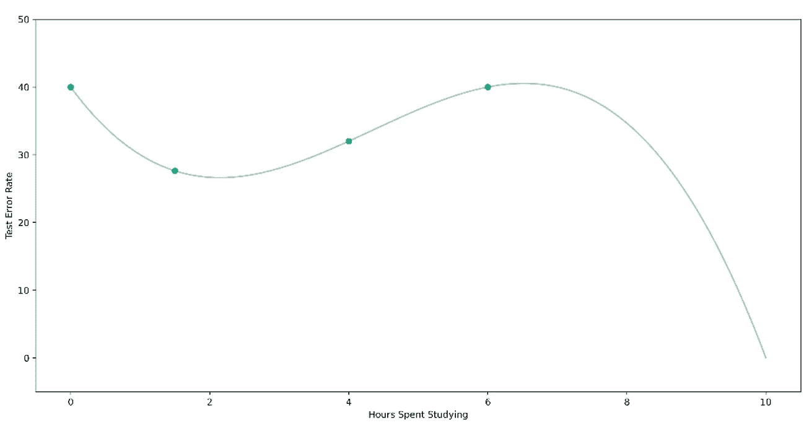

现在，想象你正在观察一个二维世界的山丘。假设你是一个小旅行者，站在这个山丘的表面，寻找最低的海拔位置。你可以随意移动——你可以使用传送器随机跳跃到处，或者慢慢走，也可以大步跳跃。当你探索这个山丘时，你可能会发现没有新的地方比你之前访问的最低点还低。在一些无果的探索之后，你可能决定就此停留在之前访问过的最低位置。这就表明了收敛。

算法可以通过它们如何利用和导航损失景观来区分。你可以将每个算法视为具有自己个性的旅行者。一种简单的学习算法是随机多次改变参数，然后恢复到表现最好的参数——随机搜索。这是一种表现不稳定的旅行者，可能喝醉了，随机跳跃在损失景观中。

另一种保守的学习算法是以某种粒度搜索每组参数值。这是一个非常勤奋但效率低下的旅行者，慢慢走过损失景观的每一“寸”，做笔记并进行细致的测量。

一个更聪明的旅行者可能会尝试设计某个决策带来的收益的度量，或者通过分析当前站立的地面的坡度来确定哪个方向能够最快下降。

损失景观还让我们考虑像局部最小值这样的现象，其中学习算法会收敛到一个相对于“附近”解来说似乎是最好的解决方案，但实际上却比其他一些“全局”最小值更差。在我们之前优化学习时间的例子中，我们会将两小时学习识别为局部最小值。这将产生比学习半小时或四小时更好的考试错误率。然而，真正的全局最小值是学习 10 小时，这样可以获得完美的考试错误率零。可以将局部最小值视为*视野*的问题：旅行者在崎岖的地形中行走，只能看到前方的山脉，而看不到可能位于更远处的深谷，并决定眼前的浅谷足够了。

考虑一个务实的例子。我们有一个非常简单的模型，只有一个参数*m*，它控制着直线*y = mx*，我们希望找到一个最适合数据集的*m*值（即最小化直线与点之间的平均差异）。

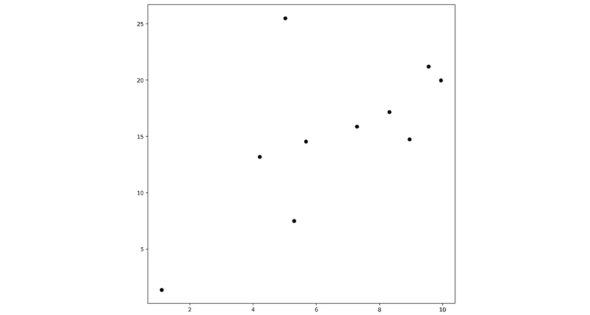

损失景观在坡度值从 0 到 4 时看起来如下。

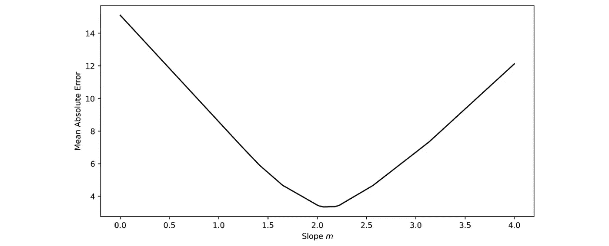

让我们考虑在这个损失景观上旅行的过程以及它对微调模型的影响。我们将从这个景观的高处开始，坡度值为 0.1316。这显然不适合我们的数据集，相应地我们处于损失景观的‘非常高地’。

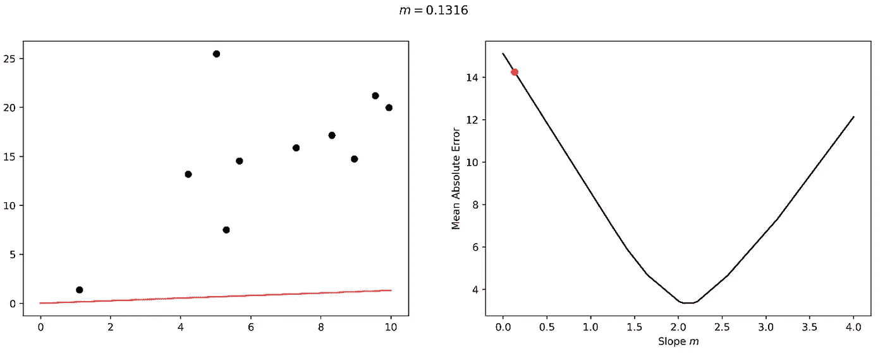

让我们“学习”一下。假设我们向‘右’看一点，相应地找到较低的地面。

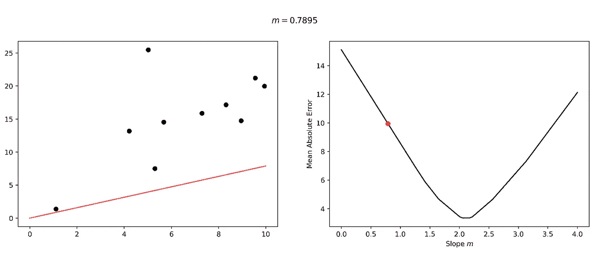

受到第一次成功阶段的鼓舞，我们将再次沿相同的方向迈进两步，使用坡度为 2.1053 的模型达到了最小错误。

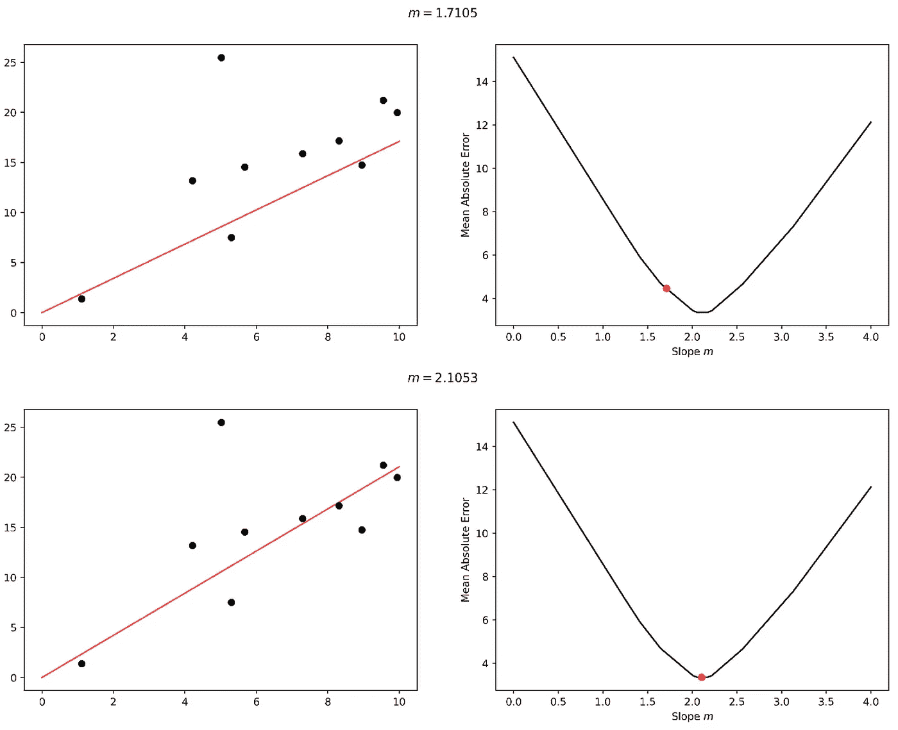

假设我们再进一步，结果却是爬升而不是下降我们的损失景观，导致模型更差。这就是我们的学习陷入错误的地方；我们可能要么继续探索（也许能找到更好的解决方案），要么回到之前的最佳解决方案。这就是学习过程中的错误和修正。

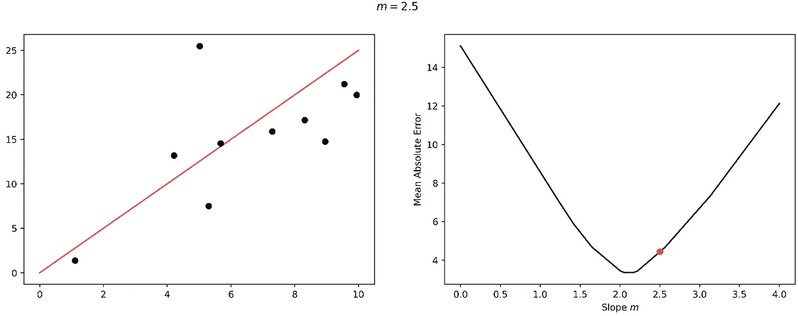

然而，实际情况是，机器学习模型的参数比一个参数多得多。即使是线性回归模型——最简单的模型之一——也大约有和数据集中变量数量一样多的参数。

我们可以将这个想法推广到更高维空间，尽管有点不直观。例如，考虑一个有两个参数的模型。损失景观将具有三个维度，展示了两个参数值的每种组合如何映射到特定的损失。现在我们有一个三维的‘景观’，可以想象在其中进行导航。

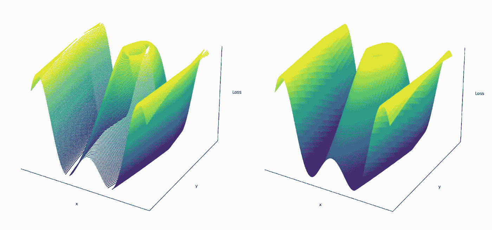

大多数现代机器学习模型有数十个、数百个，甚至在深度学习的情况下有数十亿个参数。我们可以概念性地理解它们的*学习*过程——即“机器学习”或“深度学习”中的‘学习’——作为在对应的几十维、几百维甚至几亿维的损失景观中进行导航，搜索‘最低地面的位置’，即最小化损失的参数值组合。

# 流形映射

指向损失的参数更新是理解学习的直观方式：我们根据反馈信号更新内部参数，这些反馈信号可以是内部或外部的（例如，通过环境）。损失景观的概念使我们能够将学习的抽象问题转化为更物理的空间，并提供了对学习过程中观察到现象的具体解释，比如收敛到较差状态（局部最小值）。

指向损失的参数更新是一种 *以模型为中心的学习解释*：损失景观空间由模型的组件（参数值轴）和这些组件的总体性能（损失轴）物理定义。另一方面，流形映射解释是 *以数据为中心的*。与其将学习定义为模型作为一个代理，不如将学习视为在数据中发生的过程。（当然，正如你将看到的，这两者是同一个硬币的两个方面）。

假设你是 Hal 9001 的看护者，Hal 9001 对于在 *2001: 太空漫游* 中被忽视而未能获得角色仍然心怀怨恨。作为 Hal 9001 的看护者，你的一个责任是预测 Hal 是否会对今天的温度感到满意。你有一些关于之前温度和 Hal 9001 相应满意度的数据。今天的温度是 64 华氏度。你能预测 Hal 9001 是否会满意吗？

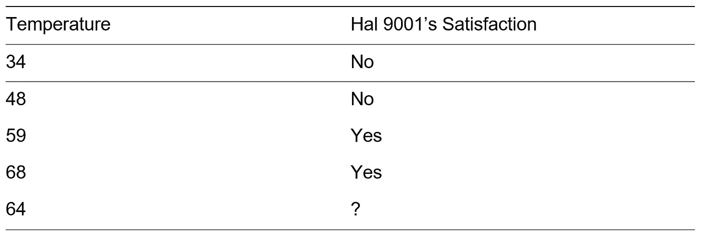

从数据中可以看出，Hal 9001 很可能会（幸运地）感到满意。你是如何得出这个结论的？你隐含地 *构建了一个* ***流形*** 在 *特征空间* 中。由于我们的数据只有一个特征，即温度（Hal 9001 的满意度是 *目标*，而不是特征），特征空间只有一个维度。这相当于一个数字线：

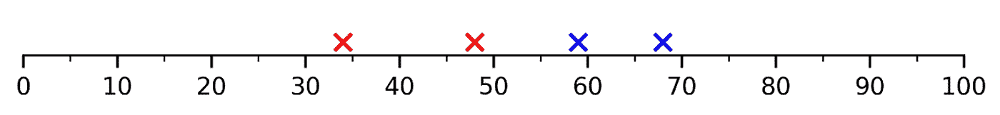

说得更宽泛一点，我们可以绘制一个 *流形* 来沿某一点分隔数据。在这种情况下，我们可以通过绘制以下流形来完美地分隔数据：

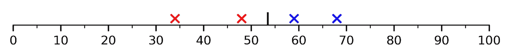

我们也可以将流形称为 **决策边界**，以便于理解。流形是分隔空间的边界，使我们能够决定将哪个类别与特征空间中的哪个点关联起来。

这里的关键见解是，流形不仅仅与它在特征空间中所占的那一小片空间相关：相反，它影响整个特征空间。它定义了哪些区域属于哪些类别。此外，它定义了你如何对未见过的点进行推断。如果我们在这个特征空间中标记出“64”这个点，我们会发现它属于满意度类别“是”。

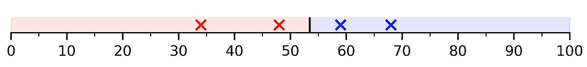

让我们考虑二维空间中的另一个例子。图 2-x 展示了一个二维特征空间（这代表了一个具有两个特征/列的数据集），点的颜色根据它们的类别进行着色。

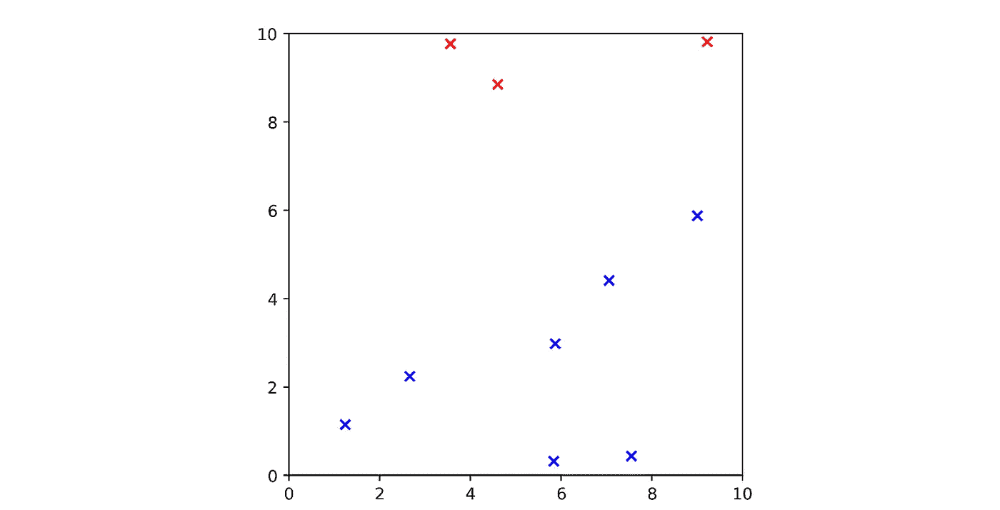

我们可以绘制如下流形来分隔数据。它完美地适应了数据集；也就是说，它完美地将数据分成了各自的类别。

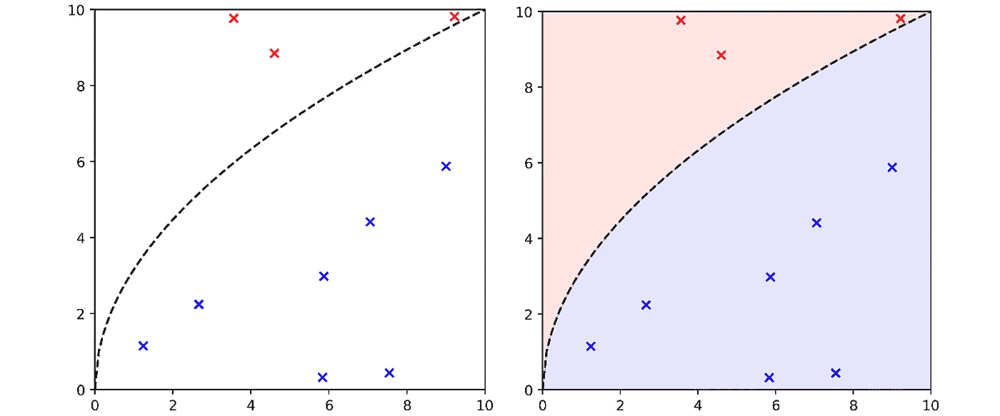

然而，我们也可以绘制许多其他有效的流形。这些流形也完美地分隔数据。

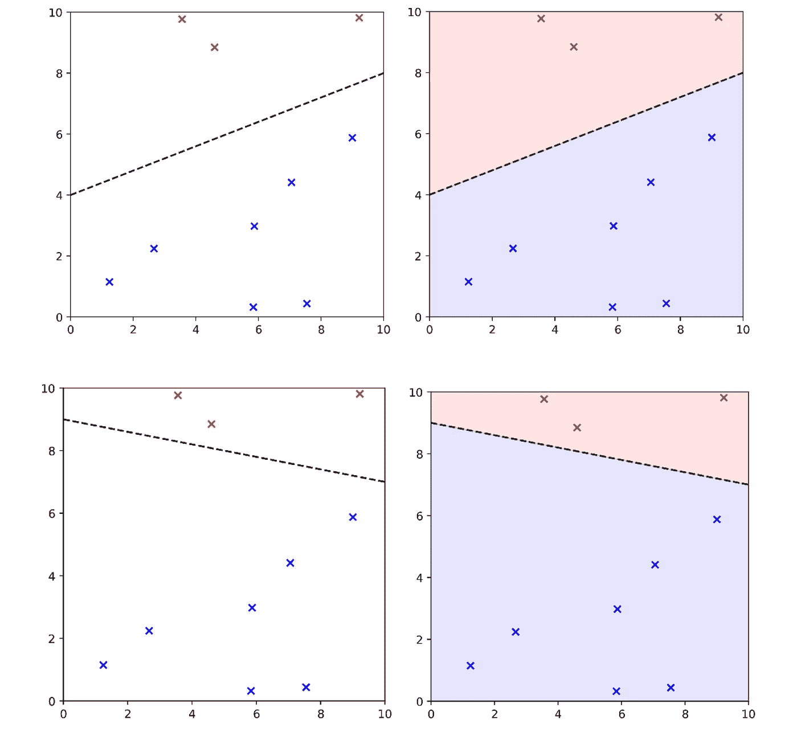

尽管这些流形在*训练集表现*上都是相同的，因为它们在特征空间中以等效的完美表现分隔不同类别的项目，但它们在如何影响整个特征空间方面却有显著不同。坐标（1，7）处的点在顶部映射中的分类将与底部映射中的不同，因为流形的方向不同。

同样地，回到我们的一个维度示例，我们也可以用不同的方式绘制边界，这些方式在分隔已知数据时同样有效。

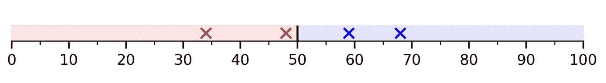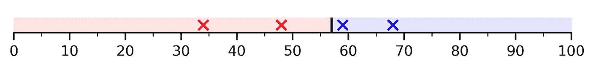

这也影响了我们对新数据的决策。假设气温为 55 度；顶部流形预测 Hal 9001 会满意，但底部流形预测 Hal 9001 不会满意。

这种随意性是需要考虑的重要问题。它表明对于系统可以学习的任何问题，有许多不同的同样好的解决方案。然而，通常情况下，我们希望模型学习一个‘真实流形’。这就是我们想象的‘真实流形’，它不仅完美（或至少最优地）分隔已知数据点，还分隔我们将来可能收集到的所有点。这个概念与我们从中收集数据的现象密不可分。

因此，学习的过程就是在特征空间中*泛化差异*；以一种有意义的方式绘制流形以分隔不同的数据点。在这个过程中，我们学习数据集中的一般规则。

关键是，流形映射的学习解释帮助我们强调学习如何‘影响’数据集。即使模型仅在有限数量的点上进行训练，我们确实理解它与特征空间中的每个点相关。因此，流形映射解释使我们能够理解模型如何*泛化*——它们如何学习我们希望它们学习的规则（‘真实流形’），而不是学习特征空间中那些便宜地分隔数据的捷径，这些捷径并不能准确反映真实的基本现象。

让我们考虑一个三维流形映射的例子：

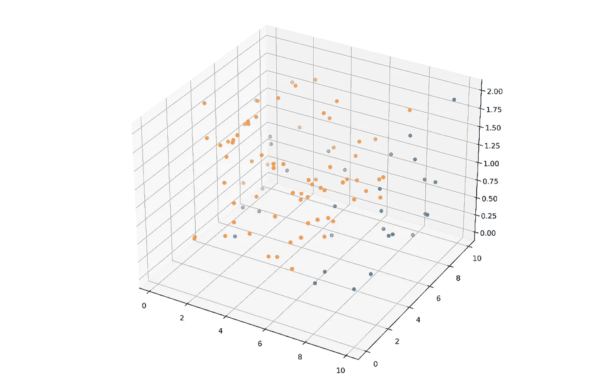

在三维空间中，分隔这些点的流形是一个‘表面’，在更熟悉的意义上；它像一条覆盖空间的毯子，特征之间的真实有意义的关系（理想情况下）在其在特征空间中的轨迹中的每个弧线和曲线中体现出来。

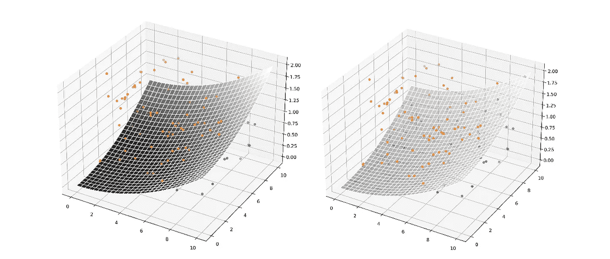

现在，考虑一个将 100×100 像素的图像——这是一张相当低质量的图像——分类为狗或猫的模型。假设这张图像是灰度的，那么这张图像中有 10,000 个唯一的像素。每一个像素都是这个特征空间中的一个维度。这种猫/狗分类器的目标是发现 10,000 维空间中的流形，这个流形在这个庞大的理论空间中弯曲和曲折，捕捉区分狗和猫图像的相关视觉关系，呈现在这个表面的拓扑形状中。

这是一个复杂的想法。它比基于损失导向的参数更新解释更不直观，但却是一个值得深入思考的重要概念。

## 心理学和哲学的贡献

损失导向的参数更新解释将学习描述为对损失或反馈信号的内部状态集的迭代更新，反馈信号描述了当前状态的糟糕程度。流形映射解释将学习描述为在特征空间中形成一个流形（决策边界、表面），它最佳地分隔不同的数据点，同时也显然在整个空间中进行‘预测’（泛化）。

这些似乎是合理的，甚至是自然的解释学习过程的方式。然而，即便这些是主要的数学、技术和抽象的‘学习’概念描述，也重要的是认识到这种描述仍然肯定或符合某种哲学视角或世界观。

关于‘学习’是什么，‘学习’意味着什么，有许多不同的哲学立场和理论。一个常见的误解是将数学和科学等领域表面上的内部一致性（实际上，经过更仔细的调查，发现并不是如此一致）与‘客观性’和‘真理’的隐含标签联系在一起。正如我们在后续章节中进一步探讨的那样，这种误解常常导致对像 AI 这样的计算或数学系统的信任错位或过度信任。

我们从一开始就开始识别 AI 的各种隐含哲学假设，通过简要了解‘学习’在哲学上是如何被处理的，以及损失导向的参数更新和流形映射解释符合哪些路径。

**联想主义**是一个有着悠久发展历史的学习理论，从十八世纪的洛克和休谟到现代与人工智能相关的意义。它建议生物体通过经历呈现给它们的世界，基于因果推理的历史学习：如果它们经常遇到某种现象与另一种现象之间有某种联系，它们就开始*联想*这些现象。

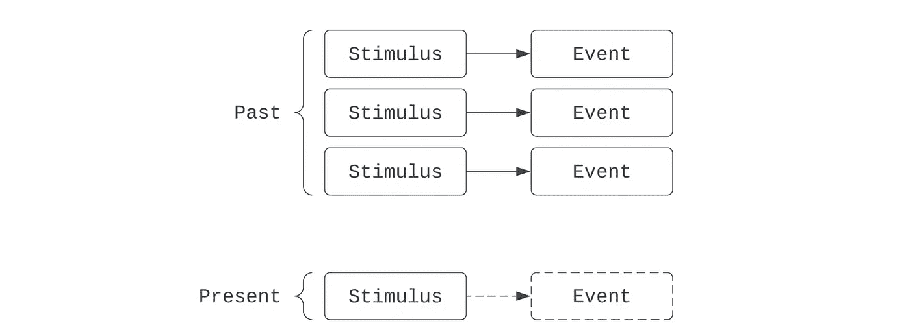

例如，每当艾萨克把一个苹果抛向空中，它就会落下来。从联想主义的角度看，艾萨克形成了一条学习知识：每次苹果被抛向空中时，它都会落下来。艾萨克可能会把一个橙子抛向空中几次，发现每次橙子也会落下来。在尝试了几个其他物体后，艾萨克会学会*概括这种联想*：物体在空中被抛下后落下的特性不是苹果固有的，而是一般物体的特性。

联想主义者认为，只有一个核心的心理过程：通过经验联想思想。伊万·帕夫洛夫在心理学领域的工作或许是最著名的联想学习证据。帕夫洛夫的狗在遇到肉的气味时自动分泌唾液，这是由于嗅到肉（在吃之前）和分泌唾液之间历史上建立的联想。

在更流行的文化中，吉姆在《办公室》里利用联想学习过程来对付德怀特。每当吉姆重新启动他的电脑——播放标志性的 Windows “解锁工作站”声音——吉姆就会给德怀特一颗薄荷糖。德怀特每次都会接受，以至于当他听到声音时会本能地伸出手。一天，吉姆重新启动电脑，德怀特伸出手，期待常规的薄荷糖。吉姆问德怀特在做什么，德怀特回答“我不知道”——然后皱起眉头，发出唾液声，并问为什么他的嘴巴突然味道如此难闻。

在帕夫洛夫之后，爱德华·桑代克于 1911 年提出了“效果法则”。这一理论表明，与满足感相关的行为将导致该行为的重复。效果法则超越了帕夫洛夫的被动联想学习，迈向了主动学习：生物体主动参与（或抑制）行为，以最大化满足感或奖励。这是训练狗良好行为的逻辑，例如：狗在表现出期望的行为时获得奖励（而对不良行为给予惩罚，惩罚可以被视为奖励的否定）。

损失导向的参数更新范式直接与这种联想学习理论相一致。通过强化哪些行为（即状态，参数的集合）是“好的”（低损失）和“坏的”（高损失），模型旨在向更好的行为靠拢，远离更差的行为。

心理学习理论中的两个额外概念是**区分**和**统一**。在区分中，受试者感知到以前被认为是单一属性的属性之间的差异；在统一中，受试者感知到一个以前被认为是多个属性的属性。这种分离与统一的双重系统有助于理解信息——能够发现区分表面上看似一致的现象的有意义的细微差别，并能够将表面上看起来不同但在某种程度上有意义的概念归为一类。

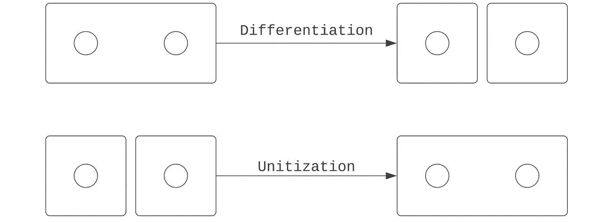

流形映射的学习解释与**区分**和**统一**的双重概念在数学上直接对应。流形的目标最明显的是分离空间，但也包括确定*不分离*哪些空间——也就是统一。

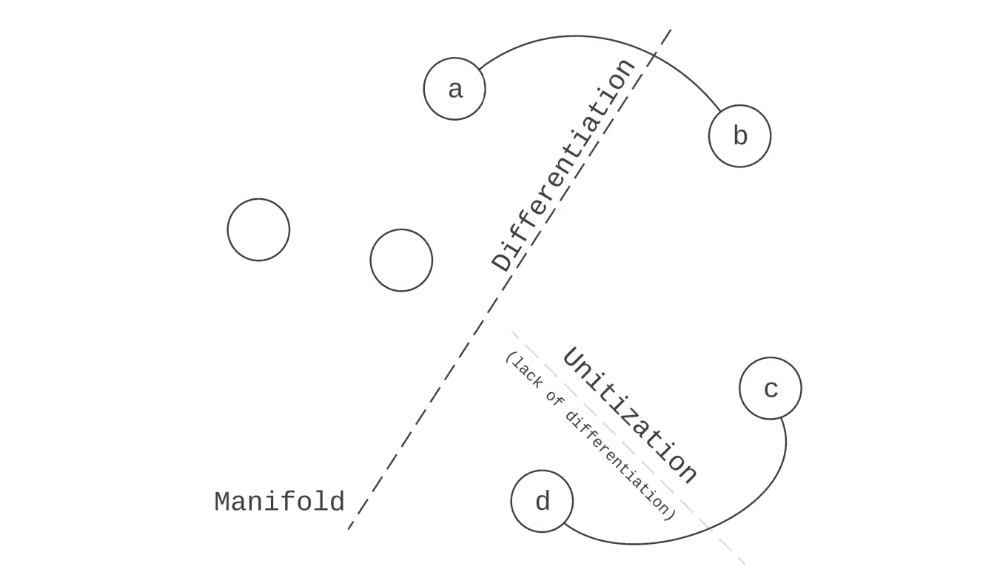

鉴于流形映射和*损失导向的参数更新*是同一枚硬币的两面——模型的参数决定了流形的绘制方式，而流形的形状则是为了通过最优的分离来最小化损失——我们也可以看到关联学习理论与**区分**-**统一**感知学习理论的联系。这是应用如何可以启发理论的一个例子。早期和现代人工智能发展的实质性工作也同样将技术 AI 进展应用于指导哲学、心理学和神经科学中的新研究探讨。

## 总之……

我们可以把学习看作是*损失导向的参数更新*——一个试图调整各种自由变量以最小化误差的代理——也可以看作是*流形映射*——发现适用于观察空间的普遍规则，从而分离一些样本，同时将其他样本统一。如我们所见，这两种解释是同一枚硬币的两面：一种是以模型为中心的，另一种是以数据为中心的。虽然这两者在机器学习中常常使用，但我们也可以在其他领域，如行为科学中找到它们的应用。

感谢阅读！

*所有图片均由作者创作。*
