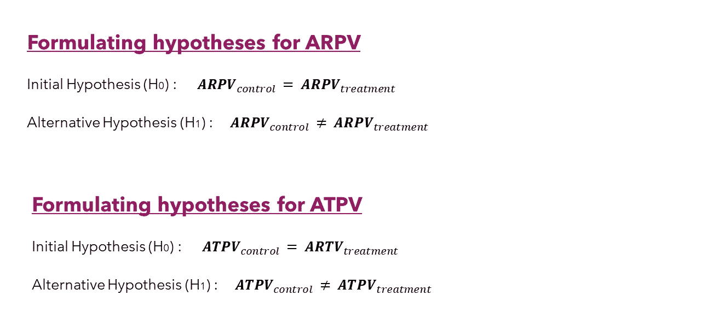
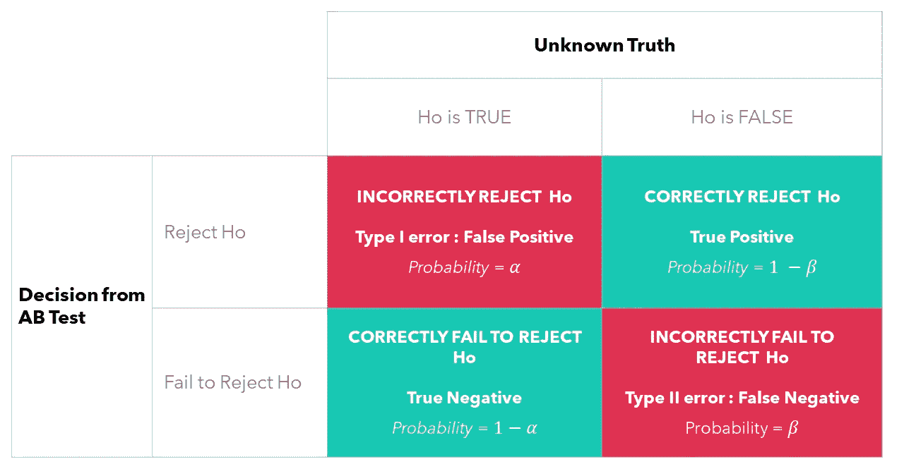
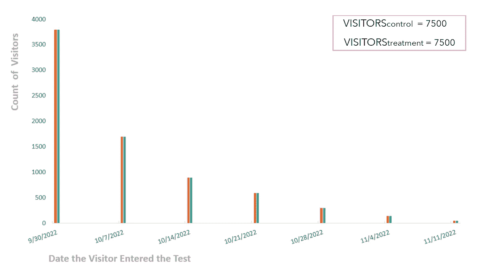
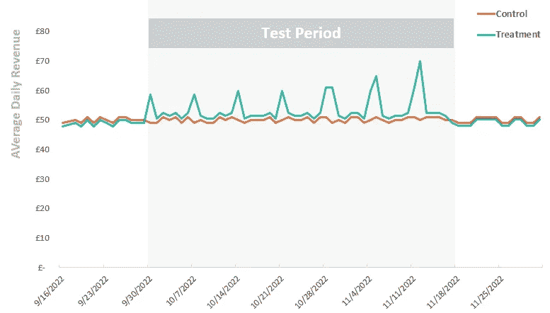
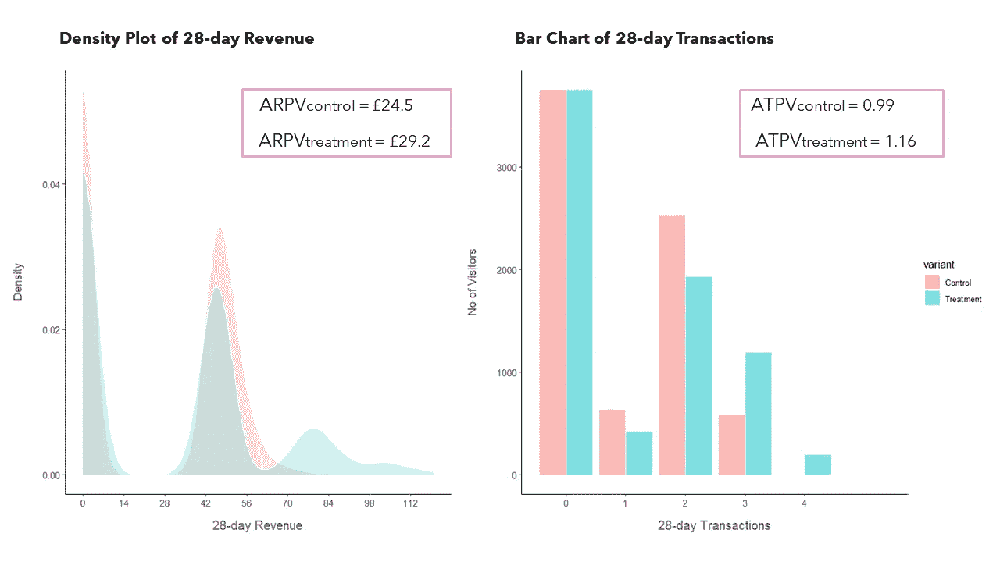
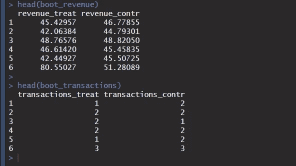
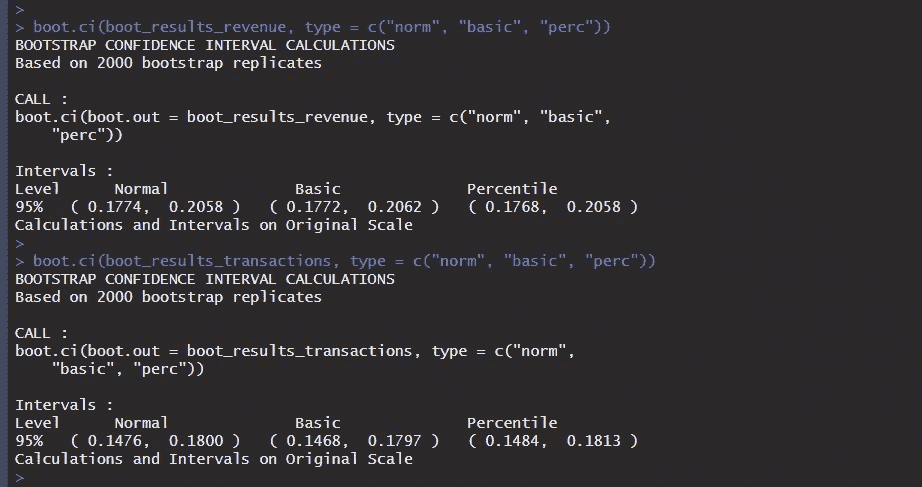
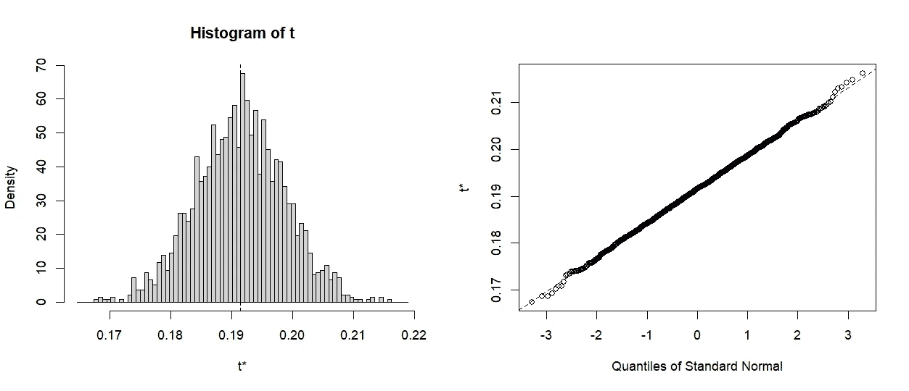

# 我作为数据科学家在进行了一年的 AB 测试后学到的东西——第二部分/2

> 原文：[`towardsdatascience.com/what-i-learned-after-running-ab-tests-for-one-year-as-a-data-scientist-part-2-2-4b30118fec26?source=collection_archive---------9-----------------------#2023-01-11`](https://towardsdatascience.com/what-i-learned-after-running-ab-tests-for-one-year-as-a-data-scientist-part-2-2-4b30118fec26?source=collection_archive---------9-----------------------#2023-01-11)

## 关于数据科学家如何处理和分析 AB 测试结果的真实案例研究

[](https://medium.com/@alex.vamvakaris.ds?source=post_page-----4b30118fec26--------------------------------)[](https://towardsdatascience.com/?source=post_page-----4b30118fec26--------------------------------) [Alex Vamvakaris](https://medium.com/@alex.vamvakaris.ds?source=post_page-----4b30118fec26--------------------------------)

·

[关注](https://medium.com/m/signin?actionUrl=https%3A%2F%2Fmedium.com%2F_%2Fsubscribe%2Fuser%2F8072260dd591&operation=register&redirect=https%3A%2F%2Ftowardsdatascience.com%2Fwhat-i-learned-after-running-ab-tests-for-one-year-as-a-data-scientist-part-2-2-4b30118fec26&user=Alex+Vamvakaris&userId=8072260dd591&source=post_page-8072260dd591----4b30118fec26---------------------post_header-----------) 发布于 [Towards Data Science](https://towardsdatascience.com/?source=post_page-----4b30118fec26--------------------------------) ·10 分钟阅读·2023 年 1 月 11 日[](https://medium.com/m/signin?actionUrl=https%3A%2F%2Fmedium.com%2F_%2Fvote%2Ftowards-data-science%2F4b30118fec26&operation=register&redirect=https%3A%2F%2Ftowardsdatascience.com%2Fwhat-i-learned-after-running-ab-tests-for-one-year-as-a-data-scientist-part-2-2-4b30118fec26&user=Alex+Vamvakaris&userId=8072260dd591&source=-----4b30118fec26---------------------clap_footer-----------)

--

[](https://medium.com/m/signin?actionUrl=https%3A%2F%2Fmedium.com%2F_%2Fbookmark%2Fp%2F4b30118fec26&operation=register&redirect=https%3A%2F%2Ftowardsdatascience.com%2Fwhat-i-learned-after-running-ab-tests-for-one-year-as-a-data-scientist-part-2-2-4b30118fec26&source=-----4b30118fec26---------------------bookmark_footer-----------)

图片由 [Luca Bravo](https://unsplash.com/@lucabravo?utm_source=unsplash&utm_medium=referral&utm_content=creditCopyText) 提供，来源于 [Unsplash](https://unsplash.com/photos/O453M2Liufs?utm_source=unsplash&utm_medium=referral&utm_content=creditCopyText)

# 介绍

欢迎来到本系列的第二部分也是最后一部分！在 [**第一部分**](https://medium.com/towards-data-science/what-i-learned-after-running-ab-tests-for-one-year-as-a-data-scientist-part-1-2-5277911e89ec) 中，我们讨论了实验设计和样本大小估算。在本部分中，我们将重点关注分析 AB 测试所需的知识和技能。这是数据科学家在业务中提供价值的核心。我们不再根据主观信念做决策，而是依靠数据和统计测试来引导公司朝着正确的方向前进。

# 第二部分

+   **理解基础知识：** 制定测试假设并探索 I 型和 II 型错误

+   **探索性数据分析（EDA）：** 招募进入测试、时间趋势和 KPI 的分布

+   **分析 AB 测试结果：** 解释中心极限定理、p 值、置信区间，并进行参数和非参数自助法

*我们将继续使用第一部分的案例研究。你可以在下面的链接中探索 AB 测试的两个版本和 KPI 的选择 👇*

[](/what-i-learned-after-running-ab-tests-for-one-year-as-a-data-scientist-part-1-2-5277911e89ec?source=post_page-----4b30118fec26--------------------------------) ## 我作为数据科学家运行 AB 测试一年后学到的东西 — 第 1/2 部分

### 通过以下这些简单步骤，像数据科学家一样设置你的 A/B 测试

towardsdatascience.com

# 1. 理解基础知识


图片由 [Stefan Steinbauer](https://unsplash.com/@usinglight?utm_source=unsplash&utm_medium=referral&utm_content=creditCopyText) 提供，来源于 [Unsplash](https://unsplash.com/photos/HK8IoD-5zpg?utm_source=unsplash&utm_medium=referral&utm_content=creditCopyText)

# 制定假设

在每个统计测试中，都有一个**初始假设**和**替代假设**。初始假设认为我们的两个 KPI 在控制组（£10 折扣）和处理组（20%折扣）之间没有差异，而替代假设认为存在显著差异。初始假设通常被称为零假设，因为它代表了默认或“正常”的状态（即没有差异）。



为我们的两个 KPI 制定初始假设和替代假设 [作者提供的图片]

数据科学面试中的一个棘手问题是如何表达你在这些假设中的目标。我们要么**拒绝**初始假设，要么**无法拒绝**初始假设。我们永远不能接受它。至于你如何向利益相关者传达结果，这不会有什么不同。但是对于数据科学家来说，这将有所不同！

让我们看看黑天鹅的例子。想象一个世界，我们只见过白天鹅。我们永远无法接受初始假设，即没有黑天鹅。我们可以收集无限的数据，但仍可能错过那只黑天鹅。因此，我们可以**未能拒绝假设**所有天鹅都是白色的**但永远无法接受它**！另一方面，如果我们看到一只黑天鹅，我们总是可以拒绝初始假设。现在，虽然黑天鹅代表罕见事件，我们在商业场景中几乎不会尝试测量（最小可检测效应，MDE，通常设为 2%），但这仍然是理解我们如何作为数据科学家进行 AB 测试的一个有用方式。

# 类型 I 和类型 II 错误

好吧，我们有了初始假设和备择假设，我们可以拒绝或未能拒绝初始假设。这会转化为下表中所示的四种可能性。



类型 I 和类型 II 错误 [作者提供的图片]

使用我们从实验中收集的数据，我们将要么接受（你看，我说的没错，记住是未能拒绝），要么拒绝零假设。但没有任何方法论是完美的，也就是说，不可能完全消除假阳性和假阴性（如上图中的红色框）。用 Neyman 和 Pearson（1933 年）的话说：

> ***我们倾向于认为，就某个特定假设而言，基于概率理论的任何测试本身都无法提供关于该假设真伪的有价值证据***

这听起来不太有希望，对吧？幸运的是，他们继续补充道：

> ***但我们可以从另一个角度来看待测试的目的。我们不必希望知道每个独立假设的真伪，而可以寻找规则来指导我们对这些假设的行为，从而确保在长期经验中，我们不会过于频繁地犯错***

上述内容是一个重要的理解点。在统计学中，我们不处理确定性。我们永远无法以 100%确定性做出推断。然而，我们拥有统计工具（如 p 值和置信区间，稍后会详细介绍），可以帮助我们做出决策。决策或规则，如果你愿意说是规则，长期来看会给我们一定的（可接受的）类型 I 或类型 II 错误概率。

## **类型 I 错误**

+   当我们得出存在差异的结论，即使实际上不存在时，这种情况就会发生。换句话说，即使零假设为真，我们仍然拒绝它。

+   这种错误的概率称为测试的**显著性水平**，用希腊字母**α**表示。测试的显著性水平通常设置为 5%。

## **类型 II 错误**

+   当我们得出没有差异的结论，即使实际上存在差异时，这种情况就会发生。换句话说，即使零假设是错误的，我们仍未能拒绝它。

+   这种错误的概率用希腊字母 **β** 表示。该概率的补充概率 (**1 — β)** 称为测试的 **效能**，通常设定为 80%

# 2\. 探索性数据分析（EDA）


照片由 [Scott Webb](https://unsplash.com/@scottwebb?utm_source=unsplash&utm_medium=referral&utm_content=creditCopyText) 提供，来源于 [Unsplash](https://unsplash.com/wallpapers/colors?utm_source=unsplash&utm_medium=referral&utm_content=creditCopyText)

尽管所有主要框架中都包含这一部分，但这是最常被匆忙完成或完全跳过的步骤。然而，进行 EDA 确实有实际好处，因为它回答了我们在开始分析结果之前需要知道的重要问题。

# 测试中的招募

在这一部分，我们只是想检查是否在控制组和处理组之间分配访客时没有出现问题：

+   招募仅发生在我们预定的星期五，控制组和处理组的访客招募量相同

+   大多数访客在第一次星期五进入测试，然后招募数量下降。这是一个众所周知的趋势。最活跃的（现有）访客会立即被招募，然后在两到三周后，我们将主要招募新访客



按变体划分的测试访客招募 [作者提供的图片]

# 时间序列

接下来，我们想检查一下我们关注的关键绩效指标（KPI）是否存在任何趋势或季节性变化。让我们看下面的图表，它展示了平均每日收入（作为 28 天 ARPV 的代理）：

+   两个版本之间没有测试前的差异。如果两个版本在测试开始前的几周有所不同，我们需要调整测试期内的 KPI，以纠正任何测试前的偏差

+   该指标波动性不大（日常波动不极端）

+   自从我们启动测试以来，每个星期五处理组的表现都高于控制组（明显的峰值）。随着时间的推移，提升效果在增加（最后两个星期五的提升效果最高）



平均每日收入的时间序列 [作者提供的图片]

# 分布

最后，我们想检查控制组和处理组的分布情况：

+   查看收入，没有极端异常值

+   我们可以清楚地看到处理组收入的第三个峰值（在£70 到£90 之间）。第一个峰值为£0，第二个为£50

+   处理组的 ARPV 比控制组高 19%（上涨了£4.70，£29.2–£24.5）

+   查看 ATPV，处理组也有明显的提升（更多访客进行 3 或 4 次交易）



按变体划分的 ARPV 和 ATPV 分布 [作者提供的图片]

# 3\. 分析 AB 测试结果


图片由 [Tim Stief](https://unsplash.com/@timstief?utm_source=unsplash&utm_medium=referral&utm_content=creditCopyText) 提供，来源于 [Unsplash](https://unsplash.com/photos/YFFGkE3y4F8?utm_source=unsplash&utm_medium=referral&utm_content=creditCopyText)

正如你可以想象的那样，如果我们取了相同大小的不同样本，我们会观察到不同的统计数据（ARPV 和 ATPV）。这意味着**（样本）统计量是一个随机变量**。像其他随机变量一样，统计量有一个称为**抽样分布**的分布。你可以把抽样分布看作是所有可能的统计量值的总体，如果我们从一个大小为 N 的总体中耗尽地抽取所有可能的大小为 n 的样本，并计算每一个样本的统计量。让我们看看抽样分布和自助法如何帮助我们分析 AB 测试的结果。

# 为什么要使用自助法？

让我们从大多数数据科学面试中的“英雄”——**p 值**开始。简而言之，p 值是指收集到数据后，让我们相信存在差异的概率，即使实际上没有差异。p 值越低，差异在统计上越显著。这是因为如果实际上没有差异，那么观察到给定的数据集将会更加不可能（仅仅由于运气）。如果 p 值低于我们可接受的统计显著性水平（**p 值** < **α**），我们就会拒绝原假设。

> **如果你可以将结果写成置信区间而不是 p 值，你应该这样做**

**置信区间**（CIs）可以回答与 p 值相同的问题，其优点在于它们提供了更多的信息，并且更容易解释。如果你想测试两个版本是否具有统计学上的差异，你可以构建一个 95% 的置信区间（1-**a%**）来查看它们的差异，并检查该区间是否包含零。在这个过程中，你还会额外获得关于你的估计值有多精确的洞察（区间越宽，表示不确定性越高）。

> **自助法是一种估计统计量抽样分布**并计算置信区间的方法

**普通自助法**，也称为简单自助法，是这种方法的基本版本，也是我们在分析中将使用的方法。它涉及对与原始样本大小相同的样本进行重复抽取（有放回），并计算每一个样本的感兴趣的统计量。然后，我们可以使用所有这些不同的样本（及其相应的统计量）来计算一个 95% 的置信区间。这可以是基于百分位数的非参数方法（在 0.025 和 0.975 百分位之间），或者我们可以采用参数方法计算正态置信区间。我们将两者都进行。

# 使用自助法置信区间分析 AB 结果

对于我们的目的，我们将使用 [**boot**](https://www.rdocumentation.org/packages/boot/versions/1.3-28.1/topics/boot) 包。首先，我们需要创建以下输入：

+   我们将在 boot 函数中使用的数据集（见下图）

+   计算每个样本中统计量百分比差异的函数

```py
##########################################
# Create bootstrap datasets
##########################################
boot_revenue <- data.frame(
    dataset %>% 
    filter(variant == "Treatment") %>% 
    select(revenue_treat = revenue_test),
    dataset %>% 
    filter(variant == "Control") %>% 
    select(revenue_contr = revenue_test)
  )

boot_transactions <- data.frame(
    dataset %>% 
    filter(variant == "Treatment") %>% 
    select(transactions_treat = transactions_test),
    dataset %>% 
    filter(variant == "Control") %>% 
    select(transactions_contr = transactions_test)
  )

##########################################
# Create function for bootstrap
##########################################
diff.means <- function(d, i) {    
  results <- 
    (mean(d[i,1]) - mean(d[i,2])) / mean(d[i,2])
  results
}
```



自助法输入数据集概述 [作者提供的图片]

我们将进行 2000 次取样，并分别计算对照组和治疗组之间的 ARPV 和 ATPV 百分比差异的 95%置信区间（使用[**boot.ci**](https://www.rdocumentation.org/packages/boot/versions/1.3-28.1/topics/boot.ci)函数，以 boot 函数的结果作为输入）。

```py
##########################################
# Run bootstrap for ARPV
##########################################
boot_results_revenue <- boot(boot_revenue, diff.means, R = 2000)
plot(boot_results_revenue)
boot.ci(
  boot_results_revenue, 
  type = c("norm", "basic", "perc"))

##########################################
# Run bootstrap for ATPV
##########################################
boot_results_transactions <- boot(boot_transactions, diff.means, R = 2000)
plot(boot_results_transactions)
boot.ci(
  boot_results_transactions, 
  type = c("norm", "basic", "perc"))
```



普通自助法的置信区间 [作者提供的图片]

那么我们来解读结果：

+   治疗组和对照组之间 ARPV 百分比差异的 95%置信区间在 17.7%和 20.6%之间，支持治疗组

+   治疗组和对照组之间的 ATPV 百分比差异的 95%置信区间在 14.7%和 18%之间，支持治疗组

+   两者差异显著，因为 95%区间远离零

如果你在想为什么正常的 95%置信区间如此接近非参数百分位区间，有一个非常著名的定理可以提供一些见解。

> 根据中心极限定理，给定来自总体的足够大样本量，样本均值的（抽样）分布将近似正态

当基础分布为正态时，中心极限定理自动适用于均值。不过在其他所有情况下会发生什么呢？好吧，偏离正态分布越远，我们需要的样本量就越大。boot 函数提供了一个很好的图来检查你的统计量的抽样分布，你可以在下图中看到我们的 ARPV 百分比差异的抽样分布。这两个图都表明抽样分布近似正态，这也解释了为什么非参数置信区间和正态置信区间几乎相同。



从普通自助法检查正态性假设 [作者提供的图片]

# 总结

到此，我们成功完成了 AB 测试！🚀🚀

✅ 我们解释了基本概念，如 I 型和 II 型错误、p 值、置信区间和中心极限定理

✅ 我们运行了 AB 测试的 EDA 检查表

✅ 我们使用参数和非参数自助法置信区间分析了实验结果

我希望上述内容对你获得你的第一个数据科学工作目标有所帮助。我试图涵盖你在数据科学面试中需要的理论，并且还教给你像数据科学家一样运行和分析你自己的实验的技能！

# 保持联系！

如果你喜欢阅读这篇文章并想了解更多，不要忘记[订阅](https://medium.com/@alex.vamvakaris.ds/subscribe)以便直接将我的故事发送到你的收件箱。

在下面的链接中，你还可以找到一个免费的 PDF 指南，介绍如何在真实的商业场景中使用数据科学技术和最佳实践来完成客户聚类分析。*👇*

[## 数据科学项目检查清单 - 有志数据科学家](https://www.aspiringdatascientist.net/community?source=post_page-----4b30118fec26--------------------------------)

### 我是一名拥有 7 年以上分析经验的数据科学家，目前在英国伦敦的一家游戏公司工作。我的……

[www.aspiringdatascientist.net](https://www.aspiringdatascientist.net/community?source=post_page-----4b30118fec26--------------------------------)
