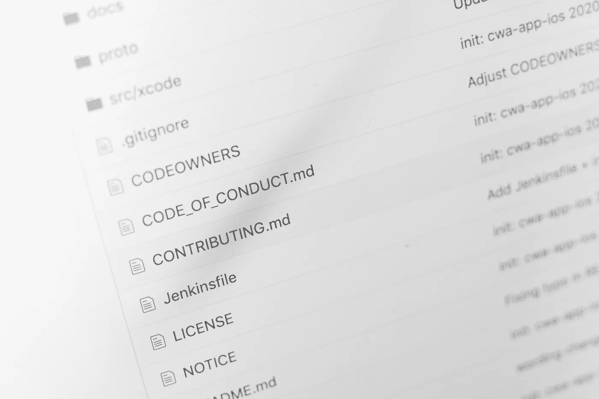

# 我在担任数据科学总监的第一年学到的东西

> 原文：[`towardsdatascience.com/what-i-learned-in-my-first-year-as-a-director-of-data-science-76b79f26b09c?source=collection_archive---------1-----------------------#2023-05-01`](https://towardsdatascience.com/what-i-learned-in-my-first-year-as-a-director-of-data-science-76b79f26b09c?source=collection_archive---------1-----------------------#2023-05-01)

## 关于管理数据科学团队的持续学习和不断进步

 [CJ Sullivan](https://medium.com/@cj2001?source=post_page-----76b79f26b09c--------------------------------)

·

[关注](https://medium.com/m/signin?actionUrl=https%3A%2F%2Fmedium.com%2F_%2Fsubscribe%2Fuser%2Fa9bc11f7a61b&operation=register&redirect=https%3A%2F%2Ftowardsdatascience.com%2Fwhat-i-learned-in-my-first-year-as-a-director-of-data-science-76b79f26b09c&user=CJ+Sullivan&userId=a9bc11f7a61b&source=post_page-a9bc11f7a61b----76b79f26b09c---------------------post_header-----------) 发表在 [Towards Data Science](https://towardsdatascience.com/?source=post_page-----76b79f26b09c--------------------------------) · 14 分钟阅读 · 2023 年 5 月 1 日 

--

图片由 [Brett Jordan](https://unsplash.com/@brett_jordan?utm_source=medium&utm_medium=referral) 拍摄，来源于 [Unsplash](https://unsplash.com/?utm_source=medium&utm_medium=referral)

六个月前，我注意到关于如何管理数据科学*团队*（与数据科学*项目*相比，后者有更多的内容）的帖子并不多。为了填补这一空白，我写了我的原创文章：[“我作为数据科学总监的前六个月所学到的东西。”](https://medium.com/towards-data-science/what-i-learned-in-my-first-6-months-as-a-director-of-data-science-d9b7b98a48f7) 这篇文章的反馈总体上是积极的，因此我决定，在我担任数据科学总监满 1 年后，根据接下来的 6 个月的经验更新原文。一些经验教训没有改变，尽管我观察到了一些新的情况或学习到了更多细节。其他的则随着科技界裁员情况的变化而有所改变。有关我自己以及我为什么开始写这些内容的更多背景信息，请参见我的原创文章。

照片由[若昂·费拉奥](https://unsplash.com/@joaoscferrao?utm_source=medium&utm_medium=referral)拍摄，发布于[Unsplash](https://unsplash.com/?utm_source=medium&utm_medium=referral)

# 招聘仍然是我最大的挑战

当我在 2022 年 11 月写下原文时，科技裁员刚刚开始加速。我开始对招聘市场的变化感到非常乐观。我的管理层也开始对数据科学家的薪资预期和报价的变化感到乐观。

简而言之，这种做法并没有取得预期效果。

我加入了几个旨在帮助被裁员的科技人员寻找新工作的在线论坛。然而，我很快注意到数据科学家和机器学习工程师并没有很多。我还发现我在这些公司的朋友们并没有被裁员。我的（轶事性的）结论是，数据科学家在科技界，包括 FAANG 公司中，仍然有相当程度的工作保障。我发现的那些被裁员的人员很快被其他科技公司录用。因此，在这方面，尽管科技界发生了变化，我的招聘情况在过去 6 个月里并没有改变。

话虽如此，我在招聘数据科学家方面又获得了 6 个月的经验和观察。我认为其中一些经验是值得分享的。

照片由[阿诺德·弗朗西斯卡](https://unsplash.com/@clark_fransa?utm_source=medium&utm_medium=referral)拍摄，发布于[Unsplash](https://unsplash.com/?utm_source=medium&utm_medium=referral)

## 面试设计：编码还是不编码？

这是软件行业内一个长期争论的问题。我们招聘的人是为了编写代码，那么我们难道不想看看他们的代码吗？我们是否希望给他们布置类似于我们公司日常工作中的任务？我们是否希望看到他们实时编程？

这是我在当前角色中处理过的事情。我确实重视观察人们编码的方式。我会查看代码及其整体组织结构。候选人是否使用了精心设计的类？函数是否清晰，并包括文档字符串、类型提示和其他有用的调试工具？是否实施了某种测试？整体文档是什么样的？他们是否只是从 scikit-learn 文档中复制粘贴，还是考虑了超参数并超越了文档的示例问题？

是的，这绝对是我可以在家庭编码挑战或实时编码练习中查看的内容。然而，这些是否公平地评估了一个人的能力？作为 IC，我经历过这两者，各有利弊。这些在各种场合中都被讨论过，但我将简要总结一下。

家庭编码挑战或作业假设候选人有时间去完成它们。它没有考虑到他们可能还在 9 到 5 的“日常工作”中，可能还有家庭或其他义务，这些义务不允许他们花费足够的时间来解决挑战。所以你可能会对那些在闲暇时间有育儿职责的在职父母产生偏见。

当然，你可以进行实时编码会话，例如配对编程或令人畏惧的“我们将观看你编码”或白板练习。毕竟，大多数人，包括那些在另一份工作中接受面试的人，通常会抽出一小时进行面试。但是，那些在公司提供的电脑上被监控且没有其他电脑的人怎么办？他们可能不希望老板看到他们在公司资源上做编码挑战。此外，许多人在这样的高压环境下不会发挥最佳水平。而且，实际上，他们是否会在日常工作中处于这样的环境？（旁注：如果你的团队通常在这种高压情况下运作，你也许应该检查一下你为团队创造的文化。）

到头来，我们团队里不会做这些。我们仍然进行技术面试，但这些更多是讨论，而不是编码。

图片由[Markus Winkler](https://unsplash.com/@markuswinkler?utm_source=medium&utm_medium=referral)拍摄，来源于[Unsplash](https://unsplash.com/?utm_source=medium&utm_medium=referral)

## 作品集的重要性

尽管如此，我仍希望能看到候选人编写的一些代码或分析。这可能与之前的观点相矛盾。我不需要一个带有华丽格式的个人网页，也不需要将内容部署到 Heroku。一个包含几个经过深思熟虑项目的 GitHub 账号就足够了。你的 GitHub 账号和这些代码应该在你的简历上提供。这些不应是他人仓库的克隆。（每次收到候选人克隆我的仓库的申请时，我总是觉得很有趣。）

再次强调，当你是一个工作中的父母，拥有有限的空闲时间，或者在工作以外没有计算机时，这种系统很难组建。这个系统并不完美。然而，以这种方式查看候选人的代码有一个（尽管是微小的）好处，就是候选人没有时间压力去整理代码。（尽管保持最新的包是个好主意，因为你永远不知道我什么时候会尝试运行你的代码！）

[Tim Mossholder](https://unsplash.com/@timmossholder?utm_source=medium&utm_medium=referral) 拍摄的照片，来源于 [Unsplash](https://unsplash.com/?utm_source=medium&utm_medium=referral)

## 阅读职位广告很重要！

我在之前的帖子中谈论过这个话题，但从那时起，根据申请者的数量和面试情况，我有了几个新的认识。

我们团队有两种不同类型的人：数据科学家和机器学习工程师。这些职位名称是在我加入公司之前创建的，为了保持一致性，我一直努力保持这些名称。然而，如果你在这个领域工作，你会知道这些术语可能会被过度使用。

为了尝试区分这两者，我在广告中（如果我这么说的话！）非常清楚地列出了每个职位的职责。再次说明，按照团队历史上的使用，团队中的数据科学家进行实验和模型创建，通常在笔记本中进行，可能还会有一些基本的 Python 脚本。机器学习工程师则将这些模型转化为生产代码和管道。在一些公司，这些可能被称为“数据工程师”或“MLOps”。在其他公司，机器学习工程师是编写模型的。

在过去的一年里，我学到，尝试招聘人员时使用这些模糊的职位名称时，明确日常职责非常重要。我在职位广告中越具体，匹配度就越高。

尽管如此，这仍然远非完美的解决方案。我常常对大量（我称之为）数据科学家申请（我称之为）机器学习工程师的职位感到惊讶。他们没有阅读职位广告。在数据科学的职位广告中，我已经指定了统计学、建模（传统机器学习、深度学习等）、探索性数据分析等经验。而在机器学习的广告中，我提到了 CI/CD、devops、Terraform 等等。也许我写的职位广告还是不对。根据申请机器学习职位的数据科学家的数量（我估计超过三分之二），问题一定出在我这里。肯定是这样，对吧？

这不仅仅涉及职位描述。包括我所在州在内的某些州有法律要求招聘经理披露职位的薪资范围。正如我们所讨论的，科技公司通常能支付比非科技公司更高的薪资，而我工作的是后者。这并不是说我们的工作问题不令人兴奋或有价值！这只是业务的本质。然而，申请者中有不少人声明他们期望的最低薪资完全超出了我所广告的范围，这一点非常显著。

作为招聘经理，鉴于以上情况，我只能得出结论，候选人没有阅读职位广告。这对候选人和招聘经理来说都很不幸。

图片由 [Farzad](https://unsplash.com/@euwars?utm_source=medium&utm_medium=referral) 提供，来源于 [Unsplash](https://unsplash.com/?utm_source=medium&utm_medium=referral)

# 在非科技领域工作的挑战

面对现实吧。我们有时不得不在公司中担任多个角色。然而，如果你在职业生涯中曾在科技公司和非科技公司工作过，你会知道，这在科技领域之外的意义更为重大。

在科技领域，你经常有机会真正专注于某一特定学科。例如，当我为某家雇主担任机器学习工程师时（在我当前的公司中，这意味着“数据科学家”），我开始深入参与图数据科学。这不仅在技术层面上吸引了我，还帮助公司解决了一些挑战。如果你关注过我在 Medium 上的其他文章，你可能已经注意到它们围绕图形展开，以至于我曾去一家图数据库公司工作过一段时间。

在科技行业之外，专业化的模式作为数据科学家变得更为困难。这一差异源于在非科技领域，你的工作是解决业务问题，而不是创造解决这些问题的技术。因此，你需要成为一个通才，而不是专家。

这不仅仅是知道你需要哪些 Python 包，并采用多样化的方式来解决这些问题。例如，我的团队对云基础设施非常熟悉。这是出于必要性。我们没有一支基础设施团队随时准备帮助我们完成这些工作。我们经常需要为公司提供关于这些基础设施的建议。我们不得不自学信息安全。这样做是否理想？不。但这就是非科技公司的人力资源运作方式。

从许多方面来看，这实际上非常有趣！如果你在一个通才角色中工作，你必须不断学习新事物。例如，我不期望我团队中的每个人都完全理解如何为我们的模型创建生产流水线。但每个人都在学习。我喜欢学习新事物。我认为这是数据科学家的一个要求。

图片由 Maklay62 提供，CC0，来自 Wikimedia Commons

## 管理有限预算

我这里有一个故事。当我在一家无名科技公司工作时，我们使用了一个非常受欢迎的云服务提供商。我的一个同事决定测试一下是否允许他们启动提供商提供的最先进的 GPU 实例，只是为了看看是否存在限制。他们让那个实例运行了一个多月而没有使用它进行计算。总账单达到了几万美元。没有人关心。

我目前角色中的一个责任是监控预算，特别是我们的云基础设施和 CI/CD 管道，我每周都会进行一次监控。我们有一个月度预算（远低于我之前的故事中花费的预算）。当预算设定时相当现实，因此我们通常不需要担心超支，但预算在那儿，我们会进行监控。有时我们会遇到对 CI/CD 运行时分钟数不太了解的人。例如，当我看到使用量激增并且可能超支时，我会要求团队中更资深的成员与那些在有问题的项目上工作的人员合作，以提高资源使用效率。正如我上面所说，每个人都在不断学习。

虽然这适用于我们的计算，但也适用于薪资。我之前提到过，科技行业的薪资通常高于非科技行业。看起来我应该能直接向管理层申请更多的薪资。不幸的是，企业的运作并非如此。我其中一个工作就是为我的团队争取尽可能好的薪资。团队中的另一个工作是保持公司内部薪资的公平一致，以及在更大的预算框架内。有时（总是？）这两者会发生冲突。考虑到数据科学家通常是公司中薪资最高的个体贡献者，去高级管理层争取更多薪资对我来说是个困难的挑战。这就是现实情况。

照片由[Jason Goodman](https://unsplash.com/ko/@jasongoodman_youxventures?utm_source=unsplash&utm_medium=referral&utm_content=creditCopyText)拍摄，来自[Unsplash](https://unsplash.com/photos/vbxyFxlgpjM?utm_source=unsplash&utm_medium=referral&utm_content=creditCopyText)

## 与非技术团队沟通

这是非技术公司面临的最大挑战之一。我的团队必须为业务生成解决方案。这些解决方案的质量如何衡量？一种方式是投资回报率（ROI）。企业的存在是为了赚钱。这是显而易见的。每个人都必须为这个使命做出贡献。那些不贡献的模型是不应该被开发的模型。

但是谁是这些模型的最终使用者？在我这种情况下，通常是营销团队。我愿意承认我不是营销人员。（尽管在我上面关于持续学习的声明之后，我正在回学校读 MBA，以了解营销的工作原理。）营销人员在一个不是数据科学的领域中非常擅长技术。因此，在我当前的角色中，学习如何与他们沟通非常重要。

那可能显而易见，但它真正意味着什么呢？首先，这意味着我不能简单地扔一堆数学和图表过去，尤其是没有解释它们的含义。在我的职业生涯中，我参加过许多数据科学会议，有些事情我在那里说的话不需要思考就能解释清楚。其中一个很好的例子是用于评估模型的各种性能指标。在营销角色中的人通常能理解"准确率"这样的术语。但一提到"精确率/召回率"、"F1 分数"或其他我们认为标准的指标，他们就会一脸茫然地看着我。老实说，这很正常，我们不应该期待他们去拿个统计学学位来理解。我们可能认为他们应该关心，但归根结底，他们希望我们能提供一个好模型。

照片由[Cytonn Photography](https://unsplash.com/@cytonn_photography?utm_source=unsplash&utm_medium=referral&utm_content=creditCopyText)拍摄，来自[Unsplash](https://unsplash.com/photos/n95VMLxqM2I?utm_source=unsplash&utm_medium=referral&utm_content=creditCopyText)

## 这种信任的重要性

然而，我工作中真正困难的一部分是向我们的营销团队传达模型不好的消息。希望这是团队自己发现的问题。如果团队错过了，他们发现了，那将是个糟糕的日子。

事实是，他们不会每天深入研究我们拥有的数据（或者更常见的情况是*没有*的数据）。观察模型的漂移不是他们应该担心的事情。最终，他们必须相信数据科学团队会处理好这些事情。

但是这种信任是如何获得的呢？

沟通是关键！在理想情况下，团队开发的每一个模型都应该是基于一个在数据科学人员动手之前已经广泛讨论过的业务问题。我努力让利益相关者聚在一起，详细说明业务需求。这通常无法在一次会议中完成，需要多次会议。有时，同一个会议需要重复多次，以便能够接触到那些日程安排无法参加原始会议的利益相关者。然后，还需要更多的会议来继续定义问题及解决方案的样子。

如果沟通是关键，那么文档就是钥匙链。我尽量在每次会议结束时总结所决定的内容。这些内容会被记录下来，并放在一个所有人都能访问的公共位置。这个位置在每次会议时都会共享。我在每次会议后都会请求对文档的反馈。我做得对吗？有没有需要修改、评论或问题？（专业提示：电子邮件*不是*记录这些讨论的好方法。需要放在更容易被发现的地方。）

然而，仍然会有模型表现不佳的情况。也许存在未被发现的 bug。也许没有数据来创建模型。可能是团队发现的，也可能是市场人员发现的。无论如何，信任通过诚实建立。这似乎是显而易见的，但我在职业生涯中见过太多数据科学家因为不想让团队或模型处于不利境地而默默掩盖问题的情况。

市场人员通常不是统计学家。当事情出现问题或他们不理解时，很容易将责任归咎于数学（或创建它的人）。而且，面对现实吧，机器学习的数学很容易被看作是一个黑箱，难以接受或相信。当存在诚实、开放、值得信任的关系时，团队或模型的信任缺失就不容易摧毁一切。

# 结论

如果我在这个角色的前六个月是适应从技术领域转变和学习数据科学招聘现状，那么我后六个月的工作则是尝试应对各自的挑战。挑战依然存在，我仍在学习。我如何才能让更多优质的候选人入门？我如何在非技术公司内工作，以为我的团队争取最好的资源，确保我们能够完成工作，并找出最有效的时间使用方法？

我每天都在继续学习。
