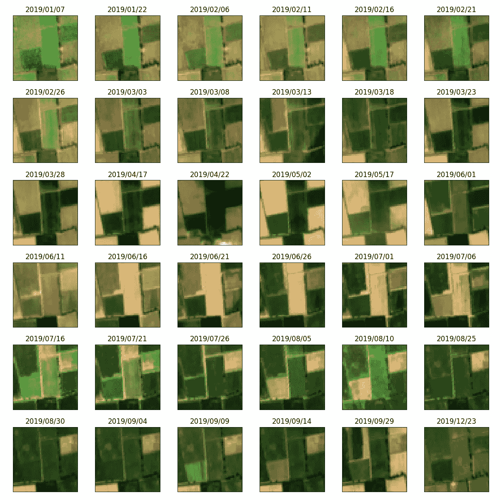
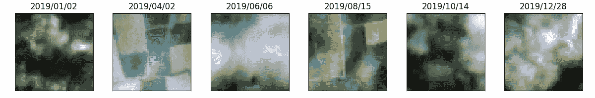
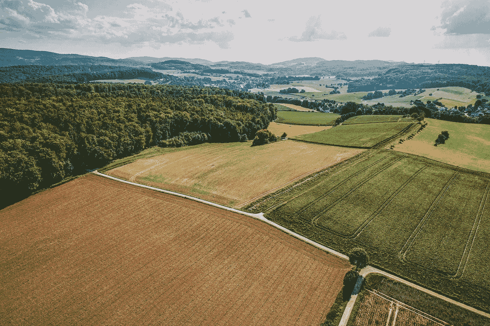
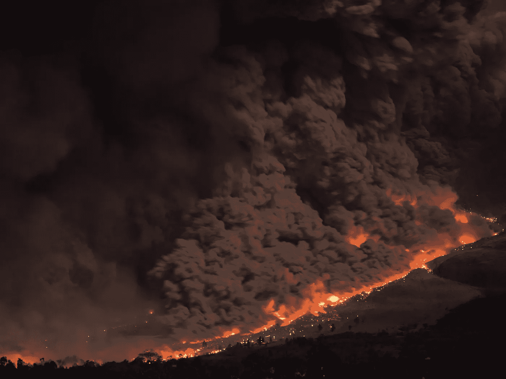
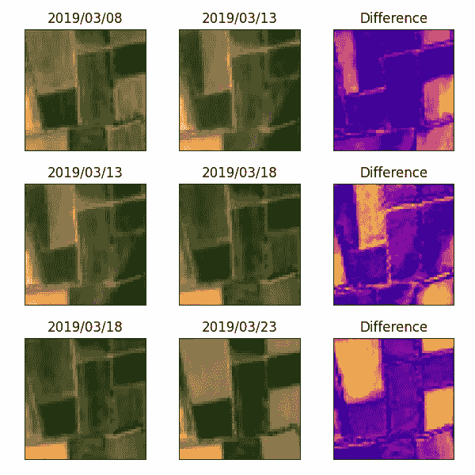
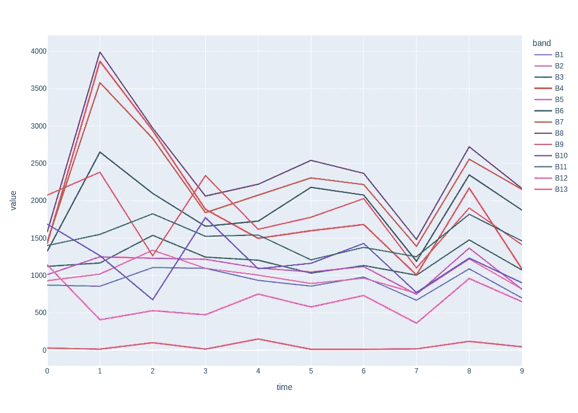
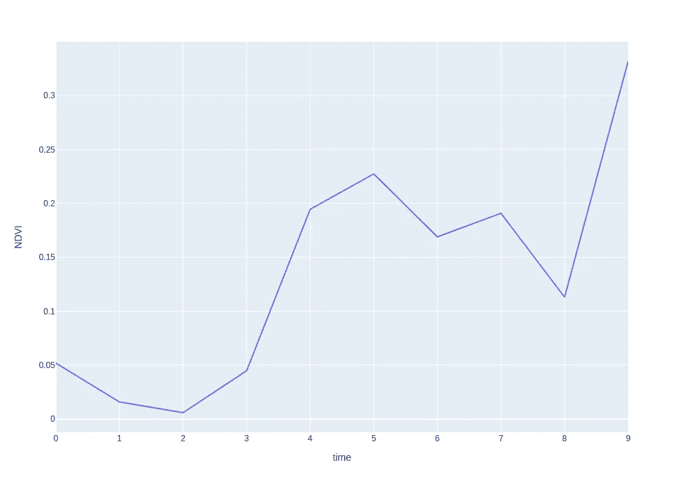
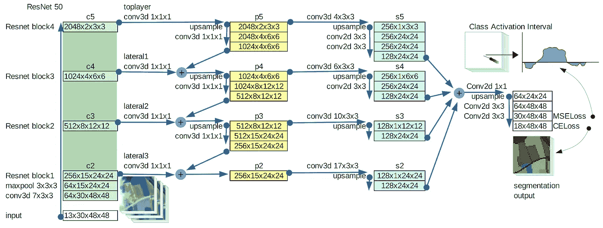

# 什么是卫星图像时间序列？

> 原文：[`towardsdatascience.com/what-is-a-satellite-image-time-series-c0516c534ba9`](https://towardsdatascience.com/what-is-a-satellite-image-time-series-c0516c534ba9)

## 解决当前和未来全球挑战的基础

[](https://mattiagatti.medium.com/?source=post_page-----c0516c534ba9--------------------------------)[](https://towardsdatascience.com/?source=post_page-----c0516c534ba9--------------------------------) [Mattia Gatti](https://mattiagatti.medium.com/?source=post_page-----c0516c534ba9--------------------------------)

·发表于 [Towards Data Science](https://towardsdatascience.com/?source=post_page-----c0516c534ba9--------------------------------) ·阅读时间 7 分钟·2023 年 3 月 2 日

--


图片由 [NASA](https://unsplash.com/@nasa?utm_source=medium&utm_medium=referral) 提供，来源于 [Unsplash](https://unsplash.com/?utm_source=medium&utm_medium=referral)

在上一篇 文章中，我详细讨论了有关处理地理空间栅格数据的所有内容。这种数据与特定地理区域相关。然而，仅分析一个栅格文件无法研究该区域随时间的变化。本指南旨在介绍卫星图像时间序列，并解释为什么这些数据在应对地球当前和未来面临的挑战中至关重要。

# 介绍

卫星图像时间序列（SITS）可能是研究某个区域随时间变化的最重要资源：

> SITS 是一组在不同时间从相同区域拍摄的卫星图像。

每张图像都存储为地理栅格文件。这些图像按日期排序，以便可以按顺序分析。这里展示的是一个作物区域的 SITS：



意大利伦巴第地区的作物区域卫星图像时间序列。图像来自 [Copernicus Open Access Hub](https://scihub.copernicus.eu/)。

SITS 图像通常按固定间隔拍摄。这有助于以恒定的速度监测变化。上面的时间序列由 Sentinel-2 卫星每 5 天拍摄的图像组成，但其中一些图像已被删除，因为它们包含云，例如：



一些被删除的图像。图像来自 [Copernicus Open Access Hub](https://scihub.copernicus.eu/)。

云层覆盖是卫星图像和 SITS 的一个严重问题，因为云层对 Sentinel-2 波段的反射效果很好。

Sentinel-2 捕获 13 个光谱波段，分为可见波段（较短波长）和红外波段（较长波长）。可见波段是我们能看到的，由红色、绿色和蓝色波段（可见波段）组成。其他波段可以获取有关下方区域的其他信息，但我们无法看到。这也是为什么 SITS 通常不是通过直接观察而是使用可以处理所有波段的不同算法进行分析的原因之一。

# 应用

卫星图像时间序列是未来全球挑战中广泛应用的宝贵信息来源。以下是一些例子：

## 农业

卫星图像时间序列在农业中极其有用，提供有关作物健康、生长和产量的信息。通过分析植被随时间的变化，农民可以做出关于灌溉、施肥和其他管理实践的明智决策。关键应用包括作物监测、产量预测、灌溉管理、病虫害检测和土地使用规划。



图片由 [Timon Reinhard](https://unsplash.com/pt-br/@timonreinhard?utm_source=medium&utm_medium=referral) 拍摄，发布在 [Unsplash](https://unsplash.com/?utm_source=medium&utm_medium=referral) 上

## 森林监测

卫星图像时间序列可以成为森林监测和管理的强大工具。通过追踪森林覆盖、健康和组成的变化，它们可以帮助识别关注区域并提供管理决策的信息。例如，SITS 可以用于跟踪森林覆盖的变化，帮助识别森林砍伐区域，并评估森林损失的范围和速度。因此，它们对于改善再造林、造林或森林恢复实践非常有用。


图片由 [Sebastian Unrau](https://unsplash.com/de/@sebastian_unrau?utm_source=medium&utm_medium=referral) 拍摄，发布在 [Unsplash](https://unsplash.com/?utm_source=medium&utm_medium=referral) 上

## 气候监测

卫星图像时间序列可用于监测可能与气候变化相关的模式，并为气候研究和政策提供宝贵信息。它们可以用于监测海平面、海冰和雪覆盖的变化，追踪冰川和冰盖的移动，以及监测气候变化引起的植被变化。


图片由 [Sophia Simoes](https://unsplash.com/de/@sophiasimoes?utm_source=medium&utm_medium=referral) 拍摄，发布在 [Unsplash](https://unsplash.com/?utm_source=medium&utm_medium=referral) 上

## 城市规划

卫星图像时间序列可用于监测土地使用和覆盖的变化，提供有关城市增长、扩张和土地使用变化的信息。这些信息可用于规划和管理城市发展、基础设施和服务。此外，SITS 还可用于监测交通基础设施，如道路、高速公路和铁路，并评估其在城市地区的表现和影响。这有助于规划新的交通基础设施，优化现有网络，并评估交通对环境的影响。


照片由[Andrea Cau](https://unsplash.com/@andreacau?utm_source=medium&utm_medium=referral)提供，来自[Unsplash](https://unsplash.com/?utm_source=medium&utm_medium=referral)

## 灾害响应

卫星图像可用于评估自然灾害如地震、洪水、飓风和野火造成的损害程度和严重性。SITS 可用于跟踪受影响地区的恢复情况，优先安排响应工作，并改善资源分配。



照片由[Marc Szeglat](https://unsplash.com/@marcszeglat?utm_source=medium&utm_medium=referral)提供，来自[Unsplash](https://unsplash.com/?utm_source=medium&utm_medium=referral)

每个应用程序背后的主要思想是，卫星观测提供了理解地球变化的机会，识别这些变化的原因，并预测未来的变化。随着技术的进步和数据的增多，利用卫星图像来理解和解决全球挑战的可能性几乎是无限的。

# SITS 分析

从非常实用的角度来看，SITS 通常以地理栅格文件的集合形式存储，其中文件名包含图像拍摄的日期。时间序列可以使用各种方法进行分析，具体取决于你想研究的变化。这些方法大多数需要使用 GIS 软件，如[ArcGIS](https://www.arcgis.com/index.html)或[QGIS](https://www.qgis.org/en/site/)，以及对相关领域的良好了解。尽管本指南是对 SITS 的介绍，但我可以简要介绍一些你可以尝试的技术：

## 图像差异

分析随时间变化的一种方法是减去不同时间拍摄的两张图像的像素值。这种技术称为图像差异，可以突出显示植被覆盖、土地使用和其他特征的变化。这是一种简单的技术，但可能足以完成一些简单的任务。然而，根据选择的波段进行差异计算时，图像差异可能会因为图像在不同条件下拍摄而突显变化，而不是真正的区域变化。减去属于同一时间序列的两个栅格的代码非常简单：

```py
import rasterio as rio

first = rio.open("lombardia3/data2019/1208/20190308.tiff").read()
second = rio.open("lombardia3/data2019/1208/20190313.tiff").read()
diff = first - second
```

结果将类似于这样：



与前一张图像的差异。

黄色阴影突出显示与时间序列前一张图像相比变化较大的栅格部分。根据任务的不同，你可以选择减去哪些波段。此外，可以设置阈值以防止小变化被显示，仅突出显示较大的变化。

## 绘制波段

地理栅格的每个像素覆盖一定的平方米面积。可以绘制给定像素的波段，以显示它们随时间的变化。这是有用的，因为可以通过结合波段来量化该区域的变化。以下代码处理时间序列中的所有图像。然后，从最旧的图像到最新的图像，绘制左上角像素的不同波段的值：

在我的案例中，最终的折线图显示了该像素的 13 个波段从时间序列中的第一张图像到第十张图像的变化：



绘制特定位置的波段。

此外，你还可以使用波段值计算各种指数（在 [这里](https://www.indexdatabase.de/db/i.php) 报告）。这些指数可以在时间序列中的每张图像上计算相同的像素。例如，归一化差异植被指数（NDVI）衡量卫星图像中植被的绿度和密度，其计算方式如下：


NDVI 公式。图像由 [CodeCogs](https://www.codecogs.com/latex/eqneditor.php) 生成。

在我的案例中（Sentinel-2 图像），NIR 波段是第 10 个波段，红色波段是第 4 个波段。我可以应用上述公式，并绘制 NDVI 随时间的变化：



绘制特定位置的 NVMI。

## 3D 神经网络

深度学习方法已成功应用于遥感应用。特别是，3D 神经网络（3D-NN）非常适合对卫星图像时间序列进行预测。3D-NN 是一种接受 3D 输入的神经网络，而 SITS 是一种三维输入，因为它是 2D 图像的集合。例如，I. Gallo 等人创建了一个 3D 特征金字塔网络模型，用于执行 Sentinel-2 图像时间序列的作物绘图[1]。他们制作的架构以 30 张图像作为输入，每张图像具有 48 × 48 像素和 13 个波段，并返回 48 × 48 的分割掩膜。输出的每个像素包含在该位置生长的作物类别。



3D 特征金字塔网络。图像来源于 [I. Gallo 等人](https://www.mdpi.com/2220-9964/10/7/483)

我最近的研究方向是使用深度学习模型分析 SITS。如果你有具体问题，请随时在评论中提问。

# 结论

卫星图像时间序列可以通过多种卫星平台获得，包括 Landsat、MODIS 和 Sentinel。这些图像通常按照定期的间隔获取，从每日到每月不等，具体取决于卫星平台和特定应用。生成的图像序列可以用于多种目的，包括改进作物管理、跟踪森林健康、监测气候变化对环境的影响、规划城市基础设施，以及协助受自然灾害影响的地区。SITS 可以通过不同的方式进行分析，具体取决于你希望突出的变化。

*除非另有说明，所有图像均为作者提供。*

[1] I. Gallo, R. La Grassa, N. Landro, M. Boschetti, [使用 3D 特征金字塔网络和时间域类别激活间隔进行作物映射的 Sentinel 2 时间序列分析](https://www.mdpi.com/2220-9964/10/7/483) (2021)
