# 什么是时间序列单位根？

> 原文：[`towardsdatascience.com/what-is-a-time-series-unit-root-dba24fa099f4`](https://towardsdatascience.com/what-is-a-time-series-unit-root-dba24fa099f4)

## 解答时间序列分析中的一个重要问题

 [Egor Howell](https://medium.com/@egorhowell?source=post_page-----dba24fa099f4--------------------------------)

·发布于[数据科学前沿](https://towardsdatascience.com/?source=post_page-----dba24fa099f4--------------------------------) ·阅读时间 7 分钟·2023 年 10 月 11 日

--

图片由[Icons8 Team](https://unsplash.com/@icons8?utm_source=medium&utm_medium=referral)提供，来源于[Unsplash](https://unsplash.com/?utm_source=medium&utm_medium=referral)

# 背景

[**单位根**](https://en.wikipedia.org/wiki/Unit_root)在时间序列和预测文献中时常出现（请原谅这个双关语）。

[维基百科](https://en.wikipedia.org/wiki/Unit_root)将单位根定义为：

> “在概率论和统计学中，**单位根**是某些随机过程（如随机游走）的一个特征，这可能会在涉及时间序列模型的统计推断中引发问题。如果 1 是过程特征方程的根，则该线性随机过程具有单位根。这种过程是非平稳的，但不总是有趋势。”

是的，这对我来说也没什么意义……

然而，上述陈述让问题变得过于复杂，实际上单位根并不是一个难以理解的概念。

# 什么是平稳性？

## 概述

为了理解单位根，我们首先必须清楚地理解[**平稳性**](https://www.youtube.com/watch?v=621MSxpYv60&t=4s)。我在之前的博客和 YouTube 视频中已经讲解过这个话题，但我们将快速回顾一下关键点。

 ## 时间序列平稳性简单解释

### 对时间序列建模中平稳性需求的简单直观解释。

[towardsdatascience.com

一个平稳时间序列具有以下特性：

+   *随时间的常数均值*

+   *随时间的常数方差（自协方差）*

+   *统计特性不变且一致*

换句话说，时间序列在长期内既没有上升也没有下降趋势，其波动也没有随着时间的推移而增加或减少。

## 示例

以下是一个 Python 中非平稳时间序列的例子，其中均值和方差不断增加：

> 数据[来源于 Kaggle](https://www.kaggle.com/datasets/ashfakyeafi/air-passenger-data-for-time-series-analysis)并具有 CC0 许可证。

作者的代码 GitHub Gist。

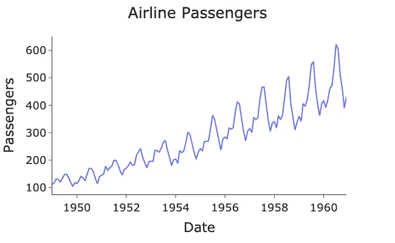

由作者在 Python 中生成的图表。

通过差分（稳定均值）和对数变换（稳定方差），时间序列被转换为平稳。

> 有关这些变换的更多信息，请参见上面的博客或视频：

作者的代码 GitHub Gist。

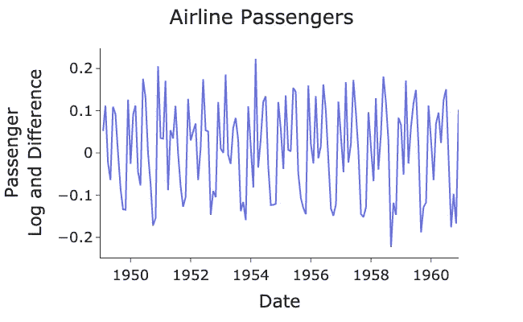

由作者在 Python 中生成的图表。

注意图表中的均值和方差大致保持不变，并且在整个图表中没有变化。

## 我们为什么需要它？

平稳性的要求来源于我们如何构建预测模型。大多数模型，如[**ARIMA**](https://medium.com/towards-data-science/how-to-forecast-with-arima-96b3d4db111a)，要求数据来自相同的分布，以便能够拟合参数到潜在的分布上。

如果时间序列是平稳的，则具有一致的统计属性。这意味着数据点之间的[**联合分布**](https://medium.com/towards-artificial-intelligence/conditional-probability-and-bayes-theorem-simply-explained-788a6361f333)不会改变，因此它们可以视为属于相同的分布。因此，这使我们能够拟合预测模型。

## 弱平稳与强平稳

我想讨论的最后一个概念是*弱平稳*和*强平稳*之间的区别。这不是非常重要，但对理解平稳性的概念非常有用。

+   ***弱平稳的：*** *如果均值和方差是恒定的，时间序列就是弱平稳的。*

+   ***强平稳的***：如果数据点的联合分布随时间不变，则时间序列是强平稳的。换句话说，它们属于相同的分布。*

起初，这个概念可能会让人感到困惑，但让我给你举个例子。如果我们的时间序列具有恒定的均值和方差，并且是从[**正态分布**](https://en.wikipedia.org/wiki/Normal_distribution)中生成的，那么它既是弱平稳的也是强平稳的。这是因为正态分布是两个参数的函数：均值和方差。

然而，有些情况下，均值和方差是恒定的，但数据点可能都属于不同的分布。第一个数据点可能是**泊松分布**，第二个可能是**指数分布**等。在这种情况下，它是弱平稳的但不是强平稳的。

> 如果你想了解更多关于弱平稳性与强平稳性的知识，可以查看 [这里](https://en.wikipedia.org/wiki/Stationary_process)

# 单位根解释

## 平稳性 — 单位根链接

平稳性如何与单位根相关？好吧，如果我们的时间序列 *包含单位根，那么它就是非平稳的*。

大多数平稳性统计检验都是单位根检验，因为它们寻找单位根以确定时间序列在给定的置信水平下是否平稳。检验包括[**增强型迪基-福勒**](https://en.wikipedia.org/wiki/Augmented_Dickey%E2%80%93Fuller_test)检验和[**菲利普斯-佩龙检验**](https://en.wikipedia.org/wiki/Phillips%E2%80%93Perron_test)**。**

## 一个简单的例子

展示单位根的最佳方法是通过简单的 AR(1) 模型，[**自回归模型**](https://medium.com/towards-data-science/how-to-forecast-time-series-using-autoregression-1d45db71683) 带有 1 个滞后：

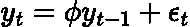

AR(1)。方程由作者在 LaTeX 中生成。

其中：

+   ***y****：是不同时间步的时间序列* ***t.***

+   ***φ****：是第一个滞后项的系数。*

+   ***ε*:** *是均值为* ***0*** *和方差为* ***σ²**** *的相同分布的随机变量的某种随机噪声。*

上述方程可以通过递归将 AR(1) 模型重写为 MA(∞) (**移动平均**%20model.)) 过程：

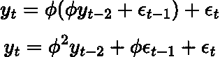

AR(1) 递归替代。方程由作者在 LaTeX 中生成。

继续这种替代，我们得到：

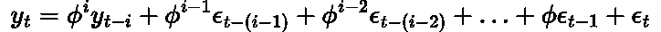

AR(1) 作为 MA(∞)。方程由作者在 LaTeX 中生成。

上述方程可以简化为：

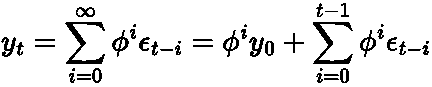

AR(1) 作为 MA(∞) 简化。方程由作者在 LaTeX 中生成。

现在，对于 AR(1) 方程，当 |***φ| = 1.***

> 对于具有更多滞后的模型，单位根变得更难定义，并依赖于[**特征方程**](https://en.wikipedia.org/wiki/Characteristic_equation_%28calculus%29)（记住我们在维基百科定义中看到过这个！）**。** 不用过于担心这个问题，因为它超出了本文的范围，并且不需要掌握单位根的直观理解。

所以，在单位根存在的情况下，方程变为：

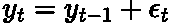

AR(1) 带单位根。方程由作者在 LaTeX 中生成。

你们中的一些人可能会将其视为著名的[**随机游走**](https://en.wikipedia.org/wiki/Random_walk)。上述方程可以递归形式重写为：

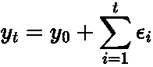

AR(1) 带单位根重写。方程由作者在 LaTeX 中生成。

现在，上述方程的均值（期望值）为：

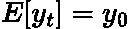

时间序列的期望值。由作者在 LaTeX 中生成的方程。

这是因为 ***ε*** 来自标准正态分布，其均值为 **0**，方差为 **σ²**。因此，***y_t*** 的期望值就是 ***y_0***。这是好的，因为均值是恒定的，我们满足了平稳性的具体要求。

*方差怎么样？*

好吧，从上述方程来看，***y_0*** 的值没有方差，但 ***ε*** 的方差是 ***σ²***。因此，方差为：

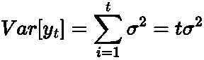

由作者在 LaTeX 中生成的方程。

> 见 [这里](https://rinterested.github.io/statistics/time_series_var_cov.html#:~:text=AUTOREGRESSIVE%20ORDER%20ONE%20(AR%20(1,%5BXt%E2%88%921%5D.) 以获取上述公式的全面证明。

我们可以看到，方差依赖于 ***t***。***Var(y_1)*** 是 ***σ²***，***Var(y_2)*** 是 ***2σ²*** 等等。所以，方差随着时间的推移变大。

> 方差随着时间的推移在增加，因此根据定义，时间序列是非平稳的！

因此，我们得出结论，时间序列中存在单位根使其变得非平稳。

## 直观解释

再次考虑 AR(1) 方程：

AR(1)。由作者在 LaTeX 中生成的方程。

***φ*** 告诉我们的是今天的值依赖于前一个值，加上一些来自标准正态分布的随机噪声。如果 ***φ < 1***，那么时间序列将自然*回归*原点，如果我们的起点是 ***0, y_0 = 0***。乘以一个小于 ***1*** 的数字会使其更小，最终趋向于 ***0***。因为它总是会*回归*，所以它是可预测的，其方差不会随时间变化。

在单位根情况下，|***φ| = 1***，那么时间序列不会回归原点。如果我们有一段良好的正值运行，时间序列将简单地停留在那里，因为下一个预测等于最后一个值。

例如，假设我们有两个不同的 AR(1) 模型：

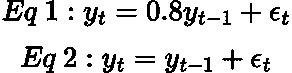

由作者在 LaTeX 中生成的方程。

*方程 1* 没有单位根，但 *方程 2* 有。假设这两个模型都从 ***y_0 = 0*** 开始。现在，经过一段时间，我们得到两个模型的 ***y_5 = 5***。那么，接下来会发生什么呢？

由于误差 ***ε*** 的均值是 ***0***，*方程 1* 将慢慢回归原点，因此 ***y_6 = 4***，***y_7 = 3.2*** 等等。然而，*方程 2* 将简单地保持在该水平上，***y_6 = 5***，***y_7 = 5*** 等等。

因此，单位根的存在使时间序列在长期内不可预测，并受到系统“冲击”的影响。这就是为什么我们认为它是非平稳的。

# 总结与进一步思考

单位根是时间序列分析的一个基本概念，可以说是平稳性的基础，而平稳性是构建许多预测模型时最基本的要求。如果时间序列的特征方程的任何解为 1，则该时间序列具有单位根。这导致方差随时间变化，从而破坏了平稳性的一个要求。因此，大多数平稳性统计测试都会寻找单位根，以决定时间序列是否平稳。重要的是，我们不需要记住所有有关单位根的数学，而是要理解关键概念以及为什么它会导致非平稳时间序列！

# 参考文献及进一步阅读

+   [*关于单位根的精彩视频*](https://www.youtube.com/watch?v=ugOvehrTRRw&t=667s)

+   [*维基百科文章提供了一些很好的见解*](https://en.wikipedia.org/wiki/Unit_root)

+   [*关于单位根的 Quora 讨论*](https://www.quora.com/What-is-unit-root-in-a-time-series)

# 另一个事项！

我有一个免费的新闻通讯，[**Dishing the Data**](https://dishingthedata.substack.com/)，在其中我分享每周的技巧，以帮助你成为更优秀的数据科学家。没有“空话”或“点击诱饵”，只有来自实际数据科学家的纯粹可操作的见解。

 [## Dishing The Data | Egor Howell | Substack

### 如何成为更优秀的数据科学家。点击阅读 Dishing The Data，由 Egor Howell 主办的 Substack 出版物...

[newsletter.egorhowell.com](https://newsletter.egorhowell.com/?source=post_page-----dba24fa099f4--------------------------------)

# 与我联系！

+   [**YouTube**](https://www.youtube.com/@egorhowell)

+   [**LinkedIn**](https://www.linkedin.com/in/egor-howell-092a721b3/)

+   [**Twitter**](https://twitter.com/EgorHowell)

+   [**GitHub**](https://github.com/egorhowell)
