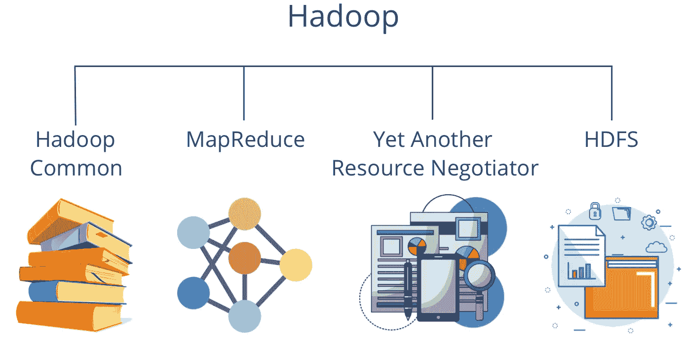
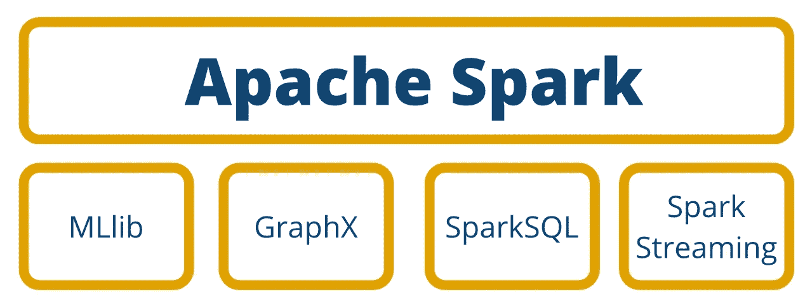

# 解锁 Presto 分布式 SQL 的力量：全面指南

> 原文：[`towardsdatascience.com/what-is-apache-presto-6986d1fbf951`](https://towardsdatascience.com/what-is-apache-presto-6986d1fbf951)

## 关于 Presto 及其在数据环境中的使用，你需要知道的一切

 [Niklas Lang](https://medium.com/@niklas_lang?source=post_page-----6986d1fbf951--------------------------------)

·发表于 [Towards Data Science](https://towardsdatascience.com/?source=post_page-----6986d1fbf951--------------------------------) ·7 分钟阅读·2023 年 1 月 6 日

--

图片由 [Anish Prajapati](https://unsplash.com/@anesprajapati?utm_source=medium&utm_medium=referral) 提供，来源于 [Unsplash](https://unsplash.com/?utm_source=medium&utm_medium=referral)

Presto 是一个开源的分布式 [SQL](https://databasecamp.de/daten/sql) 引擎，适用于查询大量数据。它由 Facebook 于 2012 年开发，并随后根据 Apache 许可证开源。该引擎不提供自己的数据库系统，因此通常与知名的数据库解决方案一起使用，例如 [Apache Hadoop](https://databasecamp.de/daten/hadoop-erklaert) 或 [MongoDB](https://databasecamp.de/daten/mongodb)。

# Presto 是如何构建的？

Presto 的结构类似于传统的数据库管理系统（DBMS），它们使用所谓的大规模并行处理（MPP）。这使用了执行不同任务的不同组件：

+   **客户端**：客户端是每个查询的起始点和结束点。它将 SQL 命令传递给协调器，并从工作节点接收最终结果。

+   **协调器**：协调器从客户端接收要执行的命令，并将其拆解以分析处理的复杂程度。他规划或协调多个命令的执行，并在调度员的帮助下监控它们的处理。根据执行计划，命令随后会传递给调度员。

+   **调度员**：调度员是协调器的一部分，最终负责将命令传递给工作节点。它根据协调器创建的计划监控命令的正确执行。

+   **工作节点**：工作节点负责实际执行命令，并通过连接器从数据源接收结果。最终结果会传回客户端。

+   **连接器**：连接器是支持的数据源的接口。它们了解不同[数据库](https://databasecamp.de/en/data/database)和系统的特殊性，因此可以调整命令。

# Presto 有哪些应用？

当连接存储大量数据的不同数据源时，可以使用此 SQL 引擎。这些数据源，即使是非关系型[数据库](https://databasecamp.de/en/data/database)，也可以使用经典 SQL 命令进行控制。Presto 通常用于[大数据](https://databasecamp.de/en/data/big-data-basics)领域，在那里低查询时间和高性能至关重要。它也可以用于对[数据仓库](https://databasecamp.de/en/data/data-warehouses)的查询。

在行业中，许多知名公司已经依赖于 Presto。除了发明该查询引擎的 Facebook 外，还包括例如：

+   Uber 使用 SQL 查询引擎处理其超过 59PB 的数据湖仓库。各种数据科学家以及普通用户需要能够在短时间内访问这些数据。

+   在 Twitter，数据量的急剧增加也成为了一个成本问题，因为 SQL 查询费用上升。因此，SQL 查询引擎被用来水平扩展系统。此外，还训练了一个[机器学习](https://databasecamp.de/en/machine-learning)模型，该模型可以在查询执行之前预测预期的查询时间。

+   阿里巴巴依靠 SQL 查询引擎构建其[数据湖](https://databasecamp.de/en/data/data-lakes)。

所有这些示例均取自[Presto 网站上的用例部分](https://prestodb.io/powered-by-presto.html)。

# 使用 Presto 有哪些优势？

Presto 在处理大量数据时提供了几个优势，包括：

## 开源

开源的可用性不仅提供了在没有许可费用的情况下使用该工具的可能性，而且源代码也可以查看，并且在有足够技术知识的情况下可以根据自身需求进行定制。

此外，开源程序通常还有一个大型活跃的社区，因此问题通常可以通过快速的互联网搜索解决。这些 Presto 的活跃用户也确保系统不断被开发和改进，从而使所有其他用户都受益。

## 高性能

由于其架构，这个 SQL 查询引擎也可以在几秒钟内查询大量数据，并且不会有较长的延迟。这种高性能得益于分布式架构，使系统能够进行水平扩展。

此外，Presto 可以在本地和云端运行，因此如果需要，将其迁移到云端可以进一步提升性能。

## 高兼容性

通过使用[结构化查询语言](https://databasecamp.de/en/data/sql-definition)，Presto 对许多用户来说非常易用，因为查询语言的处理已经熟悉，并且这一知识仍然可以使用。这使得即使是复杂的功能也能轻松实现。

兼容性通过各种可用的连接器进一步得到保证，这些连接器支持常见的数据库系统，如[MongoDB](https://databasecamp.de/en/data/mongodb-basics)、[MySQL](https://databasecamp.de/en/data/mysqls)或[Hadoop 分布式文件系统](https://databasecamp.de/en/data/apache-hdfs)。如果这些连接器不够，还可以配置或编写自定义连接器。

# 如何使用 Presto 查询数据？

使用 Presto 查询涉及连接到数据源并执行 SQL 查询。以下是使用 Presto 查询的基本步骤：

+   **安装**：在集群或单台机器上安装 Presto。你可以从官方网站下载最新版本。

+   **配置**：配置系统以连接到你想要查询的数据源。为此，你需要设置每个数据源的连接器，指定认证信息，并设置所需的参数。

+   **建立连接**：使用客户端连接到 Presto 集群或机器。Presto 客户端可以是命令行界面或像 Presto CLI 或 SQL Workbench 这样的 GUI 工具。

+   **执行 SQL 查询**：一旦连接成功，你可以对数据源执行 SQL 查询。这些查询可以是简单的 SELECT 语句，也可以是更复杂的查询，包括 JOIN、GROUP BY 和子查询。

+   **优化查询**：Presto 提供了多种优化查询的选项，如设置节点数量、配置内存限制，以及使用查询优化技术，如基于成本的优化和动态过滤。

+   **监控查询执行**：程序提供了多种监控查询执行的工具，如 CLI、Web 界面和查询日志。你可以使用这些工具跟踪查询的进展、监控资源使用情况并解决任何问题。

总之，使用 Presto 查询涉及连接数据源、执行 SQL 查询以及优化查询以提高性能。凭借其快速的查询执行和对多数据源的支持，该软件可以成为大数据处理和分析的宝贵工具。

# Presto 和 Hadoop 如何一起使用？

Presto 本身没有内置的数据源来存储信息。因此，它依赖于使用其他外部[数据库](https://databasecamp.de/en/data/database)。在实践中，通常会使用[Apache Hadoop](https://databasecamp.de/en/data/hadoop-explained)或[Hadoop 分布式文件系统](https://databasecamp.de/en/data/apache-hdfs) (HDFS)来实现这一目的。

Hadoop 组件概览 | 来源：作者

HDFS 和 Presto 之间的连接是通过 Hive Connector 建立的。主要优点是 Presto 可以轻松搜索不同的文件格式，因此可以搜索所有 HDFS 文件。由于 Presto 针对快速查询进行了优化，而 Hive 不能提供这种优化，因此 Presto 经常被用作 Hive 的替代方案。

# Presto 和 Spark 之间有什么区别？

Apache Spark 是一个分布式分析框架，可用于许多不同的 [大数据](https://databasecamp.de/en/data/big-data-basics) 应用。它依赖于内存数据存储和进程的并行执行，以确保高性能。它是市场上最全面的 [大数据](https://databasecamp.de/en/data/big-data-basics) 系统之一，提供批处理、图形数据库以及对 [机器学习](https://databasecamp.de/en/machine-learning) 的支持等功能。

Apache Spark 组件 | 来源：作者

它经常与 Presto 一起提及，甚至被理解为 Presto 的竞争对手。然而，这两个系统非常不同，相似之处不多。这两个程序都是在处理 [大数据](https://databasecamp.de/en/data/big-data-basics) 时可用的开源系统。由于它们的分布式架构和扩展能力，它们都可以提供良好的性能。因此，它们既可以在本地运行，也可以在云中运行。

然而，除了这些（尽管相当少的）相似之处外，Apache Spark 和 Presto 在一些基本特征上有所不同：

+   Spark Core 目前不支持 SQL 查询，您需要额外的 SparkSQL 组件。另一方面，Presto 是一个用于 SQL 查询的引擎。

+   Spark 提供了非常广泛的应用可能性，例如，还可以通过构建和部署完整的机器学习模型来实现。

+   另一方面，Presto 主要专注于对大数据量的快速查询处理。

# 这是你应该带走的内容

+   Presto 是一个开源的分布式 SQL 引擎，适用于查询大量数据。

+   该引擎可以用于需要快速响应时间和低延迟的分布式查询。

+   Presto 与 Apache Spark 的区别在于它主要专注于数据查询，而 Spark 提供了广泛的应用能力。

+   由于 Presto 没有自己的数据源，它通常与 Apache Hadoop 一起使用，作为它们 Hive Connector 的替代方案。

*如果你喜欢我的作品，请订阅* [*这里*](https://medium.com/subscribe/@niklas_lang) *或查看我的网站* [*Data Basecamp*](http://www.databasecamp.de/en/homepage)*！另外，medium 允许你每月免费阅读* ***3 篇文章*** *。如果你希望获得* ***无限*** *的访问权限，并查看我和其他许多精彩文章，请不要犹豫，通过点击我的推荐链接获取每月 $****5*** *的会员资格：* [`medium.com/@niklas_lang/membership`](https://medium.com/@niklas_lang/membership)

 ## 每个新数据科学家应该知道的 4 个基本 SQL 命令

### 结构化查询语言简介

towardsdatascience.com  ## 8 个每个新手数据科学家应该知道的机器学习算法

### 简要解释机器学习背后的算法

towardsdatascience.com  ## 数据库基础：ACID 事务

### 理解数据库的 ACID 属性

towardsdatascience.com
