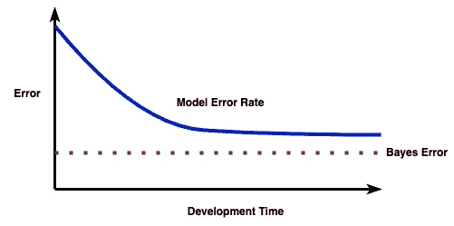

# 什么是贝叶斯误差？

> 原文：[`towardsdatascience.com/what-is-bayes-error-4bfadcc9c0ad?source=collection_archive---------5-----------------------#2023-06-06`](https://towardsdatascience.com/what-is-bayes-error-4bfadcc9c0ad?source=collection_archive---------5-----------------------#2023-06-06)

## 对机器学习基本概念的简单介绍

[](https://medium.com/@wanshunwong?source=post_page-----4bfadcc9c0ad--------------------------------)[](https://towardsdatascience.com/?source=post_page-----4bfadcc9c0ad--------------------------------) [Wanshun Wong](https://medium.com/@wanshunwong?source=post_page-----4bfadcc9c0ad--------------------------------)

·

[关注](https://medium.com/m/signin?actionUrl=https%3A%2F%2Fmedium.com%2F_%2Fsubscribe%2Fuser%2Fb145fb04b8bd&operation=register&redirect=https%3A%2F%2Ftowardsdatascience.com%2Fwhat-is-bayes-error-4bfadcc9c0ad&user=Wanshun+Wong&userId=b145fb04b8bd&source=post_page-b145fb04b8bd----4bfadcc9c0ad---------------------post_header-----------) 发表在 [Towards Data Science](https://towardsdatascience.com/?source=post_page-----4bfadcc9c0ad--------------------------------) ·6 分钟阅读·2023 年 6 月 6 日[](https://medium.com/m/signin?actionUrl=https%3A%2F%2Fmedium.com%2F_%2Fvote%2Ftowards-data-science%2F4bfadcc9c0ad&operation=register&redirect=https%3A%2F%2Ftowardsdatascience.com%2Fwhat-is-bayes-error-4bfadcc9c0ad&user=Wanshun+Wong&userId=b145fb04b8bd&source=-----4bfadcc9c0ad---------------------clap_footer-----------)

--

[](https://medium.com/m/signin?actionUrl=https%3A%2F%2Fmedium.com%2F_%2Fbookmark%2Fp%2F4bfadcc9c0ad&operation=register&redirect=https%3A%2F%2Ftowardsdatascience.com%2Fwhat-is-bayes-error-4bfadcc9c0ad&source=-----4bfadcc9c0ad---------------------bookmark_footer-----------)

作者提供的图片

在做出不同的决定和估计时，例如

+   决定是否开始或继续进行项目，

+   估计项目的业务影响，

+   选择提高模型性能的主要策略，

最重要的考虑因素之一是模型性能改善的空间有多大。例如，假设我们有一个二分类模型，其准确率为 85%。我们可能会认为仍然有很多改进的空间，并承诺在几周内提高至少 5% 的准确率。然而，这种从“85% 准确率”到“改进空间很大”的思维过程隐含假设了最佳模型性能是 100% 准确率。不幸的是，这种假设通常是不真实的，导致我们对项目有误解并做出错误决策。

在本文中，我们将重点关注二分类设置，并使用误差率（即 1 - 准确率）作为我们的模型性能指标。然后，为了对减少模型误差率的空间进行良好的估计，我们将使用一个被称为贝叶斯误差（也称为贝叶斯误差率）的概念。

# 贝叶斯误差的定义

数据集的贝叶斯误差是任何模型能够达到的最低可能误差率。特别是，如果贝叶斯误差非零，那么两个类别之间有一些重叠，即使是最好的模型也会有一些错误的预测。

数据集存在非零贝叶斯误差可能有很多原因。例如：

+   **数据质量差**：计算机视觉数据集中某些图像非常模糊。

+   **标记错误的数据**

+   **标记过程不一致**：在决定是否将求职者进入下一轮面试时，不同的面试官可能有不同的意见。

+   **数据生成过程本质上是随机的**：例如，从掷硬币中预测正面或反面。

+   **特征向量中缺少信息**：在预测婴儿是否具有某些遗传特征时，特征向量包含父亲的信息而没有母亲的信息。

通常情况下，无法计算贝叶斯误差的确切值。然而，存在几种估计方法。我们将介绍的方法是最简单的一种，它基于软标签。

# 软标签

首先，让我们用 0 和 1 表示数据集中的两个类别。我们数据集中每个实例的类别标签都在 {0, 1} 集合中，并且没有中间状态。在文献中，这被称为硬标签（以与软标签对比）。

软标签通过允许中间状态并结合我们对类别标签的信心（以及不确定性）来泛化硬标签。它定义为实例属于类别 1 的概率：

```py
*s_i = p*(*y* =1 *| x_i*)
```

特别是，*s_i* 取值范围在 [0, 1] 内。以下是一些示例：

+   *s_i* = 1 意味着我们 100% 确信该实例属于类别 1。

+   *s_i* = 0 意味着我们 100% 确信该实例属于类别 0，因为它属于类别 1 的概率为 0%。

+   *s_i* = 0.6 意味着我们认为实例更可能属于类别 1，但我们不是很确定。

注意我们总是可以通过检查*s_i* > 0.5 来将软标签转换为硬标签。

## 如何获得软标签

获取软标签的几种常见方法：

+   最明显的方法是要求我们的数据集标注者提供类别标签及其对标签的置信水平。

+   如果我们有多个标注者，我们可以要求他们为每个实例提供硬标签。然后我们可以将硬标签的比例作为软标签。例如，如果我们有 5 个标注者，其中 4 个认为*x_i*属于类别 1，剩下的一个认为*x_i*属于类别 0，那么*s_i* = 0.8

+   如果类别标签来源于某些数据源，那么我们可以使用相同的数据源来计算软标签。例如，我们想预测一个学生是否能通过考试。假设考试总分为 100，及格分数为 50 或更高。因此，硬标签通过检查*score* ≥ 50 获得。为了计算软标签，我们可以应用如 Platt 缩放之类的校准方法到*score*。

# 估计贝叶斯误差

从直观上讲，不难相信贝叶斯误差与软标签是相关的。毕竟，如果对类别标签存在不确定性，那么即使是最好的模型也会产生一些错误预测。使用软标签估计贝叶斯误差的公式非常简单：

```py
*β* = (1 / n) · ∑ min(s_i, 1 - s_i)
```

这是 min(*s_i*, 1 - *s_i*)的平均值。这个公式的简便性使其易于使用，并适用于许多数据集。

## 具体示例

+   首先，让我们考虑极端情况，其中软标签为 0 或 1。这意味着我们对类别标签 100%确定。术语 min(*s_i*, 1 - *s_i*)始终为 0，因此*β*也为 0。这与我们的直觉一致，即最好的模型能够避免对该数据集产生错误预测。

+   考虑一个更有趣的情况，我们有 10 个实例，软标签为 0.1、0.2、0.3、0.4、0.5、0.6、0.7、0.8、0.9、1。然后

```py
β = (1 / 10) · (0.1 + 0.2 + 0.3 + 0.4 + 0.5 + 0.4 + 0.3 + 0.2 + 0.1 + 0)
  = 0.25 
```

# 利用贝叶斯误差

对贝叶斯误差有一个良好的估计不仅可以让我们更好地理解数据集，还可以在以下方面帮助我们：

## 了解模型性能改进的空间

让我们回顾一下本文开头给出的例子。我们的模型准确率为 85%，这意味着错误率为 15%。假设贝叶斯误差估计为 13%。在这种情况下，改进的空间实际上只有 2%。最重要的是，我们不应该向老板承诺模型性能提高 5%。

## **确定我们是否需要新的数据集**

我们的机器学习项目通常有最低模型性能要求。例如，我们的模型误差率要求 ≤ 10%，以免客服团队过于繁忙。如果我们数据集的贝叶斯误差估计为 13%，那么我们应该寻找新的数据集，而不是改进模型。也许我们需要更好的相机和传感器来收集数据，或者需要新的数据源来增加特征向量中的独立变量。

## 理解偏差-方差权衡

假设我们的模型训练误差为 8%，测试误差为 10%。如果我们知道贝叶斯误差接近 0%，则可以得出结论，训练误差和测试误差都很大。因此，我们应该尝试减少模型的偏差。

另一方面，如果贝叶斯误差为 7%，则

```py
Training Error - Bayes Error = 1% < Test Error - Training Error = 2%
```

我们应当改进方差部分。

# 进一步阅读

1.  上述贝叶斯误差估计公式在[2]中介绍。我们参考那篇论文了解公式的各种理论属性，如收敛速率。

1.  Andrew Ng 的讲座 [应用深度学习的基本原理](https://www.youtube.com/watch?v=F1ka6a13S9I&t=3040s) 讨论了将人类水平的表现作为贝叶斯误差的代理。

1.  贝叶斯误差量化了给定任务的不可减少误差。模型误差的偏差、方差和不可减少误差的分解（包括零一损失函数和其他损失函数）在[1]中进行了研究。

1.  [3] 证明了训练于软标签上的分类器对样本外数据集的泛化能力更强，且对对抗攻击的抵抗力更强。

# 参考文献

1.  P. Domingos. [统一的偏差-方差分解及其应用](https://homes.cs.washington.edu/~pedrod/papers/mlc00a.pdf) (2000)，ICML 2000。

1.  T. Ishida、I. Yamane、N. Charoenphakdee、G. Niu 和 M. Sugiyama. [我的深度网络表现是否过于完美？一种直接估计二分类贝叶斯误差的方法](https://openreview.net/pdf?id=FZdJQgy05rz) (2023)，ICLR 2023。

1.  J.C. Peterson、R.M. Battleday、T.L. Griffiths 和 O. Russakovsky. [人类不确定性使分类更加稳健](https://openaccess.thecvf.com/content_ICCV_2019/papers/Peterson_Human_Uncertainty_Makes_Classification_More_Robust_ICCV_2019_paper.pdf) (2019)，ICCV 2019。
