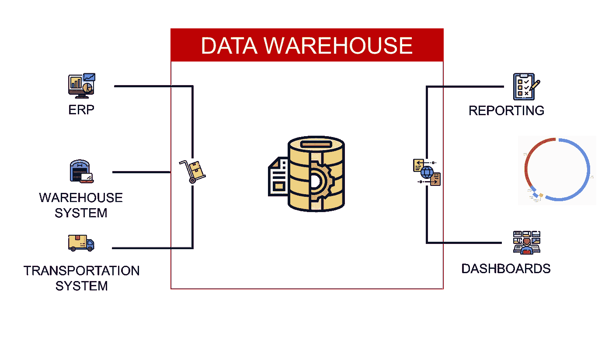
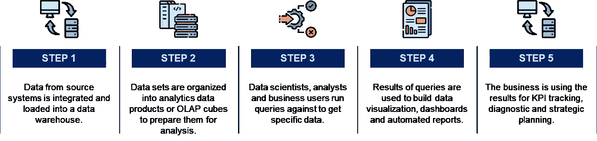
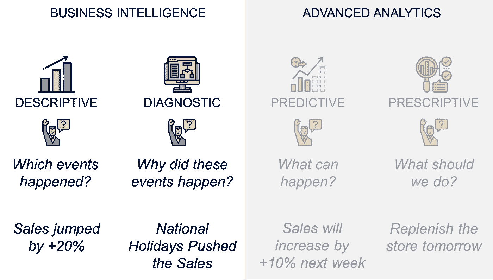
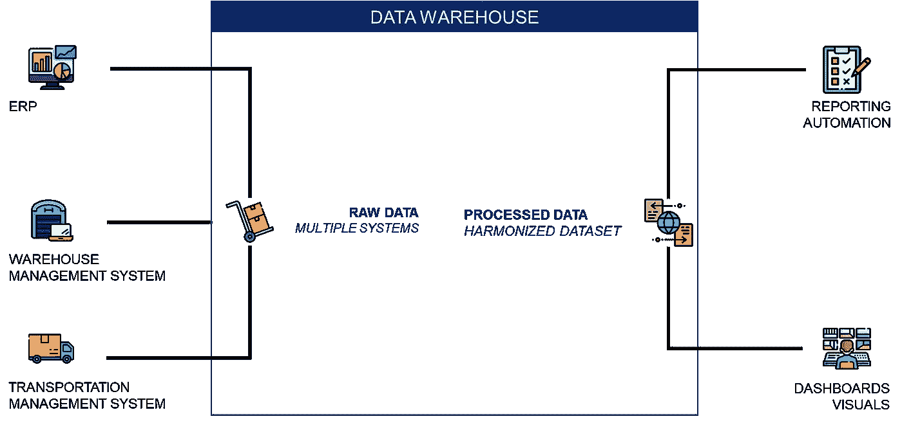
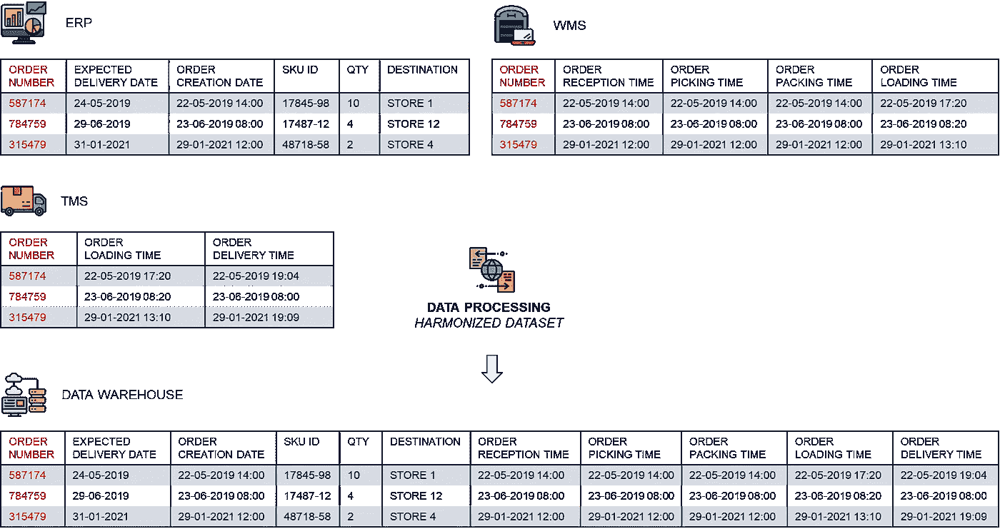
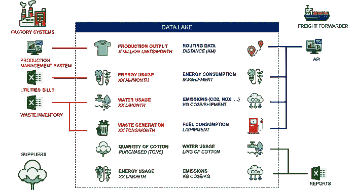
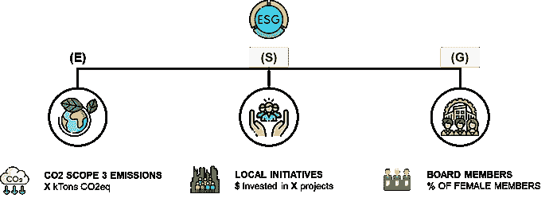
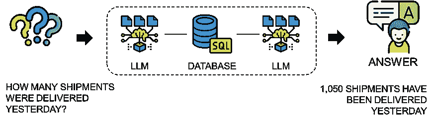

# 什么是商业智能？

> 原文：[`towardsdatascience.com/what-is-business-intelligence-bf1de730319c?source=collection_archive---------5-----------------------#2023-08-04`](https://towardsdatascience.com/what-is-business-intelligence-bf1de730319c?source=collection_archive---------5-----------------------#2023-08-04)

## 发现应用于供应链优化的数据驱动决策工具。

[](https://s-saci95.medium.com/?source=post_page-----bf1de730319c--------------------------------)[](https://towardsdatascience.com/?source=post_page-----bf1de730319c--------------------------------) [Samir Saci](https://s-saci95.medium.com/?source=post_page-----bf1de730319c--------------------------------)

·

[关注](https://medium.com/m/signin?actionUrl=https%3A%2F%2Fmedium.com%2F_%2Fsubscribe%2Fuser%2Fbb0f26d52754&operation=register&redirect=https%3A%2F%2Ftowardsdatascience.com%2Fwhat-is-business-intelligence-bf1de730319c&user=Samir+Saci&userId=bb0f26d52754&source=post_page-bb0f26d52754----bf1de730319c---------------------post_header-----------) 发布于 [Towards Data Science](https://towardsdatascience.com/?source=post_page-----bf1de730319c--------------------------------) ·11 分钟阅读·2023 年 8 月 4 日[](https://medium.com/m/signin?actionUrl=https%3A%2F%2Fmedium.com%2F_%2Fvote%2Ftowards-data-science%2Fbf1de730319c&operation=register&redirect=https%3A%2F%2Ftowardsdatascience.com%2Fwhat-is-business-intelligence-bf1de730319c&user=Samir+Saci&userId=bb0f26d52754&source=-----bf1de730319c---------------------clap_footer-----------)

--

[](https://medium.com/m/signin?actionUrl=https%3A%2F%2Fmedium.com%2F_%2Fbookmark%2Fp%2Fbf1de730319c&operation=register&redirect=https%3A%2F%2Ftowardsdatascience.com%2Fwhat-is-business-intelligence-bf1de730319c&source=-----bf1de730319c---------------------bookmark_footer-----------)

什么是商业智能？——（作者提供的图片）

商业智能是一个利用软件和服务将数据转化为支持决策的可操作情报的过程。

这种智能帮助企业洞察其运营情况，提高流程效率，并创造竞争市场优势。



商业智能过程的五个步骤——（作者提供的图片）

商业智能工具结合了多种应用，包括数据仓库、发现和可视化。

> 如何使用分析解决方案创建一个集中且和谐的数据源？

目标是通过将原始数据转换为总结性的洞察，以简化数据分析，从而进行战略决策。

在本文中，我们将探讨**商业智能**的概念，以理解它如何支持持续的运营改进，以实现**更高效和可持续的供应链**。

💌 免费订阅新文章直达你的收件箱：[新闻通讯](https://www.samirsaci.com/#/portal/signup)

📘 你的供应链分析完整指南：[分析备忘单](https://www.notion.so/Supply-Chain-Analytics-Cheat-Sheet-d449e3d53cfc45978aa889d3ef40f559)

```py
Summary
I. What is Business intelligence?
  1\. Distribution Operations for Fashion Retail
  2\. Business Intelligence for Operational Management
  3\. Business Intelligence is not Advanced Analytics
  4\. Supporting Operational Performance Improvement
II. The Mechanics of Business Intelligence
  1\. What is a Data Warehouse?
  2\. A central source of harmonized data for reporting
III. Why is Business Intelligence Significant?
  1\. Answering a simple business question
  2\. Become a data-driven green organization
  3\. Automate ESG Reporting
IV. Conclusion
  1\. Generative AI to boost Business Intelligence
```

# 什么是商业智能？

这可以定义为用于分析组织原始数据的一系列软件应用程序。

## 时尚零售的分销操作

我们可以用一个国际**服装集团**的例子来说明，该集团在全球范围内都有门店。


供应链网络 — （作者提供的图片）

**门店从本地仓库交付**，这些仓库由**在亚洲生产**服装的工厂补给。

作为**分销计划经理**，你会希望**测量交付门店的提前期**（*从订单创建到门店交付的时间*）。


系统架构 — （作者提供的图片）

多个 IT 系统协调整个分销过程。

+   在[**ERP**](https://www.youtube.com/shorts/v0_R8P6MLQ0)中，由分销计划员创建**交货单**。

+   计划员输入包含**项目**、**数量**、**门店**代码和**要求交货日期**的列表（参见[OTIF — 准时全额](https://youtu.be/qhLqu6M7lcA)绩效指标）。

+   该订单被传输到[**仓库管理系统（WMS）**](https://i.ytimg.com/vi/MW1QRJs3iuE/hq720_2.jpg?sqp=-oaymwEdCJUDENAFSFXyq4qpAw8IARUAAIhCcAHAAQbQAQE%3D&rs=AOn4CLBh96ac0eae_SGxdVL42_I7qtyWEQ)进行**准备**、**打包**和**装载**。

+   **装载**后，订单由[**运输管理系统（TMS）**](https://youtu.be/PYkN24PMKd8)跟踪，直到门店**交付**。

带有时间戳的交易数据会在这些系统的数据库中创建和存储。


分销过程时间戳 — （作者提供的图片）

+   在[ERP](https://www.youtube.com/shorts/v0_R8P6MLQ0)中创建订单后，第二个时间戳记录订单传输到[**WMS**](https://i.ytimg.com/vi/MW1QRJs3iuE/hq720_2.jpg?sqp=-oaymwEdCJUDENAFSFXyq4qpAw8IARUAAIhCcAHAAQbQAQE%3D&rs=AOn4CLBh96ac0eae_SGxdVL42_I7qtyWEQ)的时间。

+   然后，订单由[WMS](https://i.ytimg.com/vi/MW1QRJs3iuE/hq720_2.jpg?sqp=-oaymwEdCJUDENAFSFXyq4qpAw8IARUAAIhCcAHAAQbQAQE%3D&rs=AOn4CLBh96ac0eae_SGxdVL42_I7qtyWEQ)跟踪，从[准备](https://youtu.be/XejgbF2m_8g)到装载。

    *[从开始准备到卡车离开]*

+   [运输](https://youtu.be/PYkN24PMKd8)部分由**TMS**管理，时间戳跟踪货物直到商店交付

    *[从到达机场到商店交付]*

> 我们如何利用这些数据来分析过去的事件？

## 运营管理的商业智能

BI 可以帮助将这些数据转换为有意义的信息，以支持运营或战略决策的描述性和诊断性分析。

对于每个时间戳，BI 解决方案可以帮助**自动比较预计时间与实际时间**以检测**延迟**发生的地方。


两个货运示例（准时：顶部，延迟：底部）— （作者提供的图像）

目标是提供报告、仪表盘和数据可视化，自动向运营团队提供洞察。

让我们以跟踪交货订单为例

+   **订单创建时间：** 21–04–2020 11:00

+   **订单接收预计时间：** 21–04–2020 12:30

    **订单接收实际时间戳：** 21–04–2020 12:04 *[准时]*

+   **订单拣货预计时间：** 21–04–2020 14:30

    **订单拣货预计时间：** 21–04–2020 15:12 *[延迟]*

你可以继续这个过程直到商店交付。

基于这些时间戳，你可以创建自动化规则：

+   如果实际交货日期晚于预计日期，则为**迟交货**

+   对于每个过程，如果实际日期晚于预计日期，你可以将其添加到**原因代码**列表中

    *例如：由于[传输、装载、海关清关]导致的延迟交货*


延迟交付根本原因分析 — （作者提供的图像）

这个[甜甜圈图](https://youtu.be/eGH4ZQYT3-4)是一个显示迟到的商店交付不同根本原因的视觉示例

+   1,842 个运输订单已被延迟交付

+   37%的延迟仅由于订单传输问题

欲了解更多详细信息，可以查看这些简短的解释视频

> 为什么我们需要商业智能？

## 商业智能不是高级分析。

商业智能**并不是为了建议操作**最佳缓解计划或预测未来表现。


BI 与高级分析 — （作者提供的图像）

商业智能提供[**描述性和诊断性分析**](https://youtu.be/3d7C4pShykI)解决方案，专注于“理解过去的事件”。

+   **发生了什么？** *有多少订单存在延迟交付？*

+   **什么时候？** *订单 1878497 是否已在仓库装载？*

+   **谁？** *上周哪个承运商交付了 12 号商店？*

+   **为什么？** *为什么订单 1878497 在机场晚到 1 小时？*



商业智能与高级分析 — （作者提供的图像）

其他类型的分析，利用过去的数据提供预测和[建议](https://youtu.be/gF9ds3CH3N4)，更为先进，但仍需建立业务智能的基础。

## 支持操作绩效改进

然而，这种视觉辅助工具帮助计划经理更好地理解他们的数据，识别模式，并提取见解。

+   **37.8%的货物因传输问题而被耽搁**

    行动：“我应该联系 IT 团队解决这些问题。”

+   **3.3%的货物因装载延迟而被耽搁**

    行动：“与仓库运营对齐以增加[装载能力](https://youtu.be/KR_ziEiPcDk)“

通常，BI 解决方案包含在一个[**绩效管理过程**](https://www.samirsaci.com/tag/performance/)中，在该过程中数据被用来

+   **了解过去**：衡量绩效，检测问题

+   **实施缓解计划**：[优化流程](https://youtu.be/XXzOCbbXM7s)、[增加资源](https://youtu.be/OdLeRR4rvt0)，解决 IT 问题

+   **跟踪操作改进**：实施关键绩效指标（KPI），记录问题

在接下来的部分，我们将深入探讨业务智能的细节以及如何在您的公司中实施它。

💡 **关注我在 Medium** 上的文章，获取更多关于 🏭 供应链分析、🌳 可持续发展和 🕜 生产力的内容。

# 业务智能的机制

业务智能平台传统上基于一个数据仓库，该数据仓库将来自多个来源的数据汇聚到一个集中源中。

## 什么是数据仓库？

这种整合简化了业务分析和报告。



数据仓库将来自多个来源的数据进行合并 —— （图像由作者提供）

在我们的示例中，我们试图跟踪配送订单：

+   在[**ERP**](https://www.youtube.com/shorts/v0_R8P6MLQ0)中创建，包含创建日期、预期交货日期、目的地、SKU、数量等

+   传输到[**仓库管理系统（WMS）**](https://i.ytimg.com/vi/MW1QRJs3iuE/hq720_2.jpg?sqp=-oaymwEdCJUDENAFSFXyq4qpAw8IARUAAIhCcAHAAQbQAQE%3D&rs=AOn4CLBh96ac0eae_SGxdVL42_I7qtyWEQ)，该系统跟踪订单接收时间、订单拣选时间和订单发货时间。

+   由**运输管理系统（TMS）**管理，以跟踪从仓库装载到商店交付的运输过程。

BI 解决方案与这些系统互动，以：

+   处理并将获取的数据转换为一个统一的和谐源

+   创建用户友好的报告、图表和地图



数据处理的简单示例用于和谐化 —— （图像由作者提供）

在这个简单的示例中，

+   数据存储在三个不同的表中（来自[**WMS**](https://i.ytimg.com/vi/MW1QRJs3iuE/hq720_2.jpg?sqp=-oaymwEdCJUDENAFSFXyq4qpAw8IARUAAIhCcAHAAQbQAQE%3D&rs=AOn4CLBh96ac0eae_SGxdVL42_I7qtyWEQ)、[**ERP**](https://www.youtube.com/shorts/v0_R8P6MLQ0)和**TMS**），这些表有一个共同的键：**订单编号**

+   通过合并这三张表格创建的协调数据集，用于获取**从订单创建到店铺交付**的完整流程。

> 结果是什么？

## 报告的中央真实来源

利用这个协调表格，我们可以通过查看最后一个非空时间戳来按状态分类订单。

可以实施自动化规则来标记订单

+   **如果交货时间为空，我们有** *订单状态 = 运输中*

+   **最后一个非空时间戳用于标记状态**

    *例如，如果之前的非空时间戳是订单拣货时间：订单状态 = 拣货包装*


运输订单图表 — （作者提供的图像）

这个协调数据源是数据分析旅程的基石，因为它还可以提供支持

+   **机器学习** 模型用于[预测门店未来需求](https://www.samirsaci.com/machine-learning-for-retail-sales-forecasting-features-engineering/)、预测延误或估算运输交货时间

+   **规范模型** 用于优化订单分配，[改善路线](https://youtu.be/lhDBTlsGDVc) 或 [计划仓库资源](https://youtu.be/OdLeRR4rvt0)


四种分析类型 — （作者提供的图像）

这些解决方案虽然**超出了商业智能的范围**，但仍依赖于商业智能解决方案建立的协调清理数据集。

在下一部分，我们将了解为什么商业智能对公司数字化转型如此重要。

💡 **关注我在 Medium** 以获取更多关于 🏭 供应链分析、🌳 可持续性和 🕜 生产力的文章。

# 为什么商业智能如此重要？

商业智能使组织能够将**数据** 转化为 **可操作的洞察**。

公司**还可以开发**一个**实际操作问题**并寻求**商业智能团队的帮助**。

让我们通过[**绿色转型**](https://youtu.be/j85tA8WuiwA)的例子来说明这一点，这是我们**时尚零售公司**的实例。

## 回答一个简单的业务问题

公司的环境足迹的主要指标是生产、交付和销售产品过程中产生的二氧化碳排放量。

> 我们操作的环境影响是什么？

为了衡量这一点，BI 可以用于在供应链中创建单一的真实来源，并跟踪不同业务单元和时间段的排放。

> 什么是生命周期评估？

生命周期评估（LCA）是一种用于评估产品环境影响的方法。


生命周期评估 —（作者提供的图像）

它涵盖了从原材料提取到处置*(生命周期结束)*的整个生命周期。

正如你可以想象的，这种方法主要依赖于汇总和处理来自多个来源的数据。

## 成为一个数据驱动的绿色组织

我们的时尚零售商可以依靠 BI 成为一个绿色数据驱动的公司，通过在供应链中实施可持续性指标。

数据仓库可以集中来自多个来源的数据，以跟踪生命周期每一步的环境影响。



跟踪环境影响的数据架构 — （作者提供的图片）

+   通过连接到**工厂系统**来测量生产输出

+   从 Excel 文件中**收集工厂、仓库和供应商的公用事业和原材料数据使用情况**

+   通过**API**接收物流公司提供的二氧化碳排放、燃料消耗和路线数据

> 你无法管理你无法测量的事物。

数据处理结果将提供从产品角度的环境足迹的详细视图。

例如，

+   每件 T 恤的水消耗量为 3,500 升/单位

+   25%的二氧化碳排放来自海运

+   每件 T 恤的生产中排放 0.8 克 SOx 和 0.5 克 NOx


供应链中与 LCA 相关的 KPI 示例 — （作者提供的图片）

这些指标可用于制定可持续发展路线图：

+   提高制造设施的效率，考虑**每单位产品的水和能源使用**

+   挑战你的货运代理并跟踪他们的排放，以减少**运输的足迹**

+   改善原材料采购以减少**用水量**

💡 欲了解有关环境足迹可视化解决方案的更多详细信息，

[](/what-is-a-life-cycle-assessment-lca-e32a5078483a?source=post_page-----bf1de730319c--------------------------------) [## 什么是生命周期评估？LCA]

### 了解生命周期评估如何帮助企业评估产品在整个生命周期中的环境影响...

towardsdatascience.com](/what-is-a-life-cycle-assessment-lca-e32a5078483a?source=post_page-----bf1de730319c--------------------------------) [](/supply-chain-sustainability-reporting-with-python-161c1f63f267?source=post_page-----bf1de730319c--------------------------------) [## 使用 Python 进行供应链可持续性报告]

### 4 个步骤来建立关于分销网络二氧化碳排放的 ESG 报告。了解如何测量和减少碳...

towardsdatascience.com](/supply-chain-sustainability-reporting-with-python-161c1f63f267?source=post_page-----bf1de730319c--------------------------------)

> 提高贵公司的 ESG 评分。

## 支持公司 ESG 报告

商业智能可以大力支持 ESG 报告，因为它主要依赖于清晰和可信的数据。



报告类别示例 — （作者提供的图片）

组织利用这种非财务报告向利益相关者和金融机构传达其环境绩效（E）、社会责任（S）以及治理结构的**强度（G）**。

一家公司可能会报告

+   供应链的碳排放**（E）**

+   社区发展倡议**（S）**

+   董事会成员的多样性**（G）**

随着客户和投资者对可持续性认识的提高，企业将越来越多地投资于先进的商业智能能力，以自动化此类报告。

💡 有关 ESG 报告数据分析的更多细节，

[](/what-is-esg-reporting-d610535eed9c?source=post_page-----bf1de730319c--------------------------------) ## 什么是 ESG 报告？

### 利用数据分析实现公司环境、社会和治理的全面而有效的报告

towardsdatascience.com

# 结论

最有效的 BI 工具促进运营管理，发现问题并支持你的业务转型之旅。

连接到各种数据系统可以提供有价值的见解，并揭示隐藏的模式。

商业智能工具提供描述性分析（仪表板、报告）的解决方案，并创建一个值得信赖的数据中心，供更高级的预测或处方算法使用。

> 你听说过生成式 AI 吗？

2022 年 11 月，OpenAI 发布了 ChatGPT 的第一个版本。

生成式 AI 已成为利用大型语言模型提升任何分析产品用户体验的机会。

> 想象一下用一个连接到智能代理的提示替代一个静态的“无聊”提示。



使用 LangChain SQL 代理的供应链控制塔代理 [文章链接] — （作者图片）

在 [这个案例研究](https://s-saci95.medium.com/create-gpts-to-automate-supply-chain-analytics-5b44dec8e0f8) 中，我分享了我第一个使用 LLMs 来提升供应链分析的项目。

> 用户：昨天有多少订单延迟交付？
> 
> 代理：[SQL 查询] → 24 个订单昨天延迟交付

这个代理可以通过自动查询数据库回答任何用简单英语书写的问题。

这是商业智能的未来，将提升仪表板和报告的用户体验。

有关我如何实现这个解决方案的更多细节，请查看这篇文章，

[](/leveraging-llms-with-langchain-for-supply-chain-analytics-a-control-tower-powered-by-gpt-21e19b33b5f0?source=post_page-----bf1de730319c--------------------------------) ## 使用 LangChain 的 LLMs 进行供应链分析——一个由 GPT 驱动的控制塔

### 构建一个与运输数据库连接的 LangChain SQL 代理的自动化供应链控制塔……

[towardsdatascience.com

💡 **关注我在 Medium** 以获取更多关于 🏭 供应链分析，🌳 可持续性和 🕜 生产力的文章。

# 关于我

让我们在 [Linkedin](https://www.linkedin.com/in/samir-saci/) 和 [Twitter](https://twitter.com/Samir_Saci_) 上联系。我是一名供应链工程师，利用数据分析来改善物流操作和降低成本。

如果对数据分析和供应链感兴趣，可以查看我的网站。

[](http://samirsaci.com/?source=post_page-----bf1de730319c--------------------------------) [## Samir Saci | 数据科学与生产力]

### 一个专注于数据科学、个人生产力、自动化、运筹学和可持续性的技术博客……

[samirsaci.com](http://samirsaci.com/?source=post_page-----bf1de730319c--------------------------------)

# 参考文献

+   什么是供应链数字双胞胎？，[Samir Saci](https://medium.com/u/bb0f26d52754?source=post_page-----bf1de730319c--------------------------------)，数据科学前沿

+   什么是供应链分析？，[Samir Saci](https://medium.com/u/bb0f26d52754?source=post_page-----bf1de730319c--------------------------------)，数据科学前沿

+   什么是供应链控制塔？，[Samir Saci](https://medium.com/u/bb0f26d52754?source=post_page-----bf1de730319c--------------------------------)，数据科学前沿

+   什么是生命周期评估？，[Samir Saci](https://medium.com/u/bb0f26d52754?source=post_page-----bf1de730319c--------------------------------)，数据科学前沿

+   使用 Python 进行供应链可持续性报告，[Samir Saci](https://medium.com/u/bb0f26d52754?source=post_page-----bf1de730319c--------------------------------)，数据科学前沿
