# 什么是 dbt（数据构建工具）以及何时使用它？

> 原文：[`towardsdatascience.com/what-is-dbt-data-build-tool-and-when-should-you-use-it-9dc1566d960d`](https://towardsdatascience.com/what-is-dbt-data-build-tool-and-when-should-you-use-it-9dc1566d960d)

## 发现 dbt 的隐藏优点和缺点

[](https://khuyentran1476.medium.com/?source=post_page-----9dc1566d960d--------------------------------)[](https://towardsdatascience.com/?source=post_page-----9dc1566d960d--------------------------------) [Khuyen Tran](https://khuyentran1476.medium.com/?source=post_page-----9dc1566d960d--------------------------------)

·发表于 [Towards Data Science](https://towardsdatascience.com/?source=post_page-----9dc1566d960d--------------------------------) ·8 分钟阅读·2023 年 4 月 30 日

--

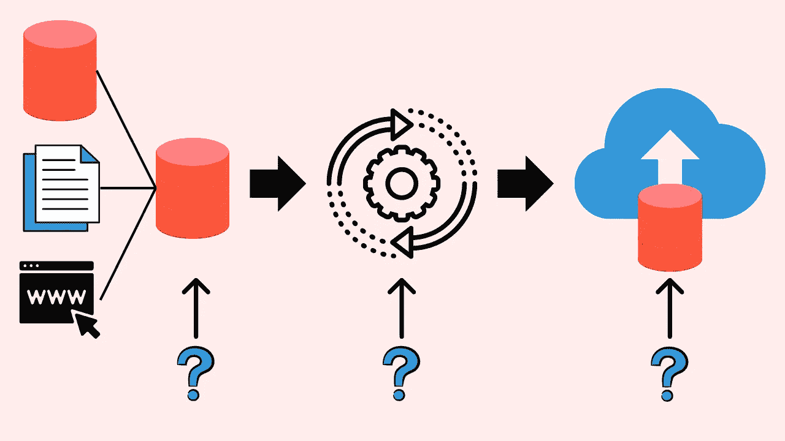

图片由作者提供

# 动机

如果您的组织正在寻求创建数据驱动的产品，您应该考虑拥有高效的数据管道，以：

1.  **保持竞争力：** 通过高效的数据管道快速访问数据及其分析加快决策过程，使您在竞争中保持领先。

1.  **降低成本：** 通过高效的数据管道，可以显著减少收集和转换数据所需的时间和精力，这可以降低成本，并使员工能够专注于需要人类智慧的更高层次任务。

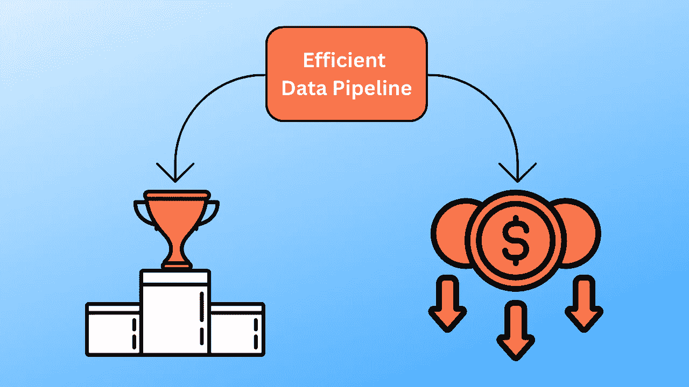

图片由作者提供

近年来，dbt（数据构建工具）在数据管道管理方面越来越受欢迎。

虽然 dbt 在管理和建模数据方面可以提供显著的好处，但它可能不是每种情况的最佳工具。在本文中，我们将探讨 dbt 的使用案例，以确定 dbt 是否适合您的组织。

随意播放并分叉本文的源代码：

[](https://github.com/khuyentran1401/dbt-demo?source=post_page-----9dc1566d960d--------------------------------) [## GitHub - khuyentran1401/dbt-demo: dbt 演示

### 目前您无法执行此操作。您在另一个标签或窗口中登录了。您在另一个标签或…

github.com](https://github.com/khuyentran1401/dbt-demo?source=post_page-----9dc1566d960d--------------------------------)

# 什么是 dbt？

dbt 是一个用于在数据仓库中转换数据的开源工具。通过 dbt，用户可以编写 SQL 查询以转换数据，并创建可重复的工作流程，这些工作流程可以轻松地进行测试和自动化。

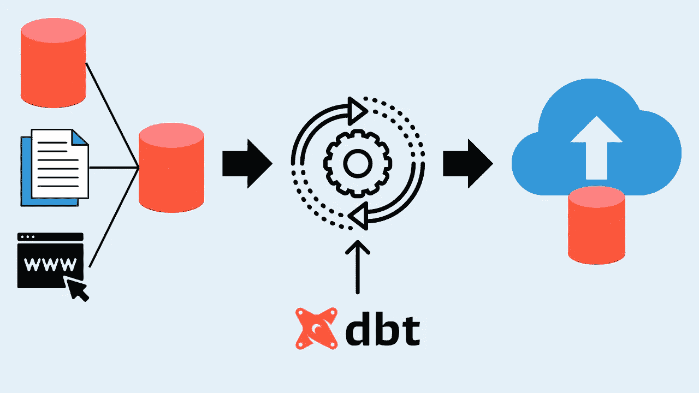

图片由作者提供

# 何时考虑使用 dbt

当您需要考虑使用 dbt 时：

1.  **你有一个数据仓库：** dbt 是一个有效的工具，用于在数据仓库环境中组织、转换和测试数据。

1.  **你的数据管道很复杂：** dbt 的模块化方法可以帮助将复杂的管道分解为更小的部分，使调试、测试和修改管道变得更容易。

1.  **你的数据经常变化：** dbt 的快照功能可以让你跟踪数据随时间的变化。

1.  **透明度对你的组织至关重要：** dbt 可以自动生成管道的文档。它还通过数据血缘提供对数据转换过程的洞察。

1.  **数据质量对你的组织至关重要：** dbt 可以测试你的模型，帮助你早期发现错误并确保数据准确。

在深入了解 dbt 的一些有用功能之前，我们需要先设置 dbt 环境。这将帮助你更轻松地跟随讨论。

# 设置 dbt

## 安装 dbt

本文使用 BigQuery 作为 dbt 的数据仓库，要安装 dbt 的 BigQuery 适配器，请输入：

```py
pip install dbt-bigquery
```

如果你想使用其他 dbt 适配器，请遵循[此说明](https://docs.getdbt.com/docs/core/pip-install)。

## 创建项目

要初始化一个名为`dbt_demo`的 dbt 项目，请输入以下内容：

```py
dbt init dbt_demo
```

以下是项目目录。

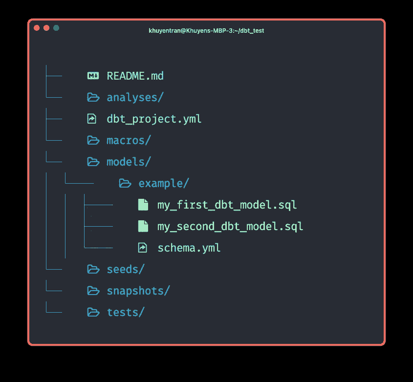

作者提供的图片

# 模块化

dbt 的模块化方法允许你将复杂的管道拆分为更小的部分。

为了演示这一点，我们将使用来自[BigQuery 公共数据集](https://cloud.google.com/bigquery/public-data)的`austin_bikeshare`数据集。

在`models`目录下创建一个名为`models/trips_per_property.sql`的新 SQL 文件，文件内容如下：

```py
-- models/trips_per_property.sql

WITH stations AS (
  SELECT
    station_id, council_district,
    CASE
      WHEN property_type IN ('parkland', 'sidewalk', 'nonmetered_parking') THEN 'free_parking'
      ELSE property_type
    END AS property_type,
  FROM
    `bigquery-public-data.austin_bikeshare.bikeshare_stations`
  WHERE
    property_type IN (
      'parkland',
      'sidewalk',
      'nonmetered_parking',
      'paid_parking'
    )
),
trips AS (
  SELECT
    start_station_id
  FROM
    `bigquery-public-data.austin_bikeshare.bikeshare_trips`
  WHERE
    start_station_id is NOT NULL
)
SELECT
  stations.property_type,
  COUNT(*) AS trips,
FROM
  trips
  JOIN stations ON trips.start_station_id = stations.station_id
GROUP BY
  stations.property_type
```

由于该模型包含多个数据转换，因此可能很难维护和测试。

我们可以通过以下方式将模型分成不同的模型：

+   在`models`目录下创建两个文件`stg_stations.sql`和`stg_trips.sql`。

+   用以下 SQL 代码替换现有的`stations` CTE 和`trips` CTE：

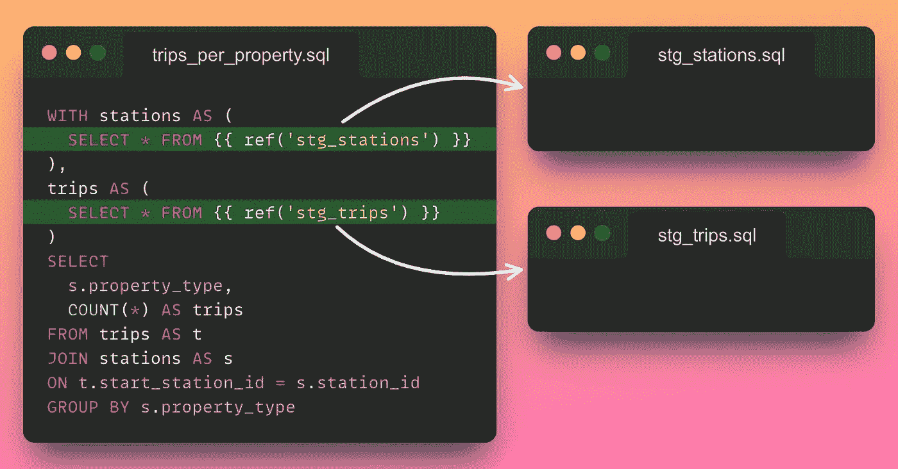

作者提供的图片

+   在`stg_trips.sql`文件中，编写原始模型中`trips` CTE 的 SQL 代码。

```py
-- models/stg_trips.sql

SELECT start_station_id
FROM `bigquery-public-data.austin_bikeshare.bikeshare_trips`
WHERE start_station_id is NOT NULL
```

+   在`stg_stations.sql`文件中，编写原始模型中`stations` CTE 的 SQL 代码。

```py
-- models/stg_stations.sql

SELECT
    station_id, council_district,
    CASE
        WHEN property_type IN ('parkland', 'sidewalk', 'nonmetered_parking') THEN 'free_parking'
        ELSE property_type
    END AS property_type,
FROM
    `bigquery-public-data.austin_bikeshare.bikeshare_stations`
WHERE
    property_type IN ('parkland', 'sidewalk', 'nonmetered_parking', 'paid_parking')
```

通过将模型拆分为多个模型，你现在可以在其他模型中重用这些数据模型：

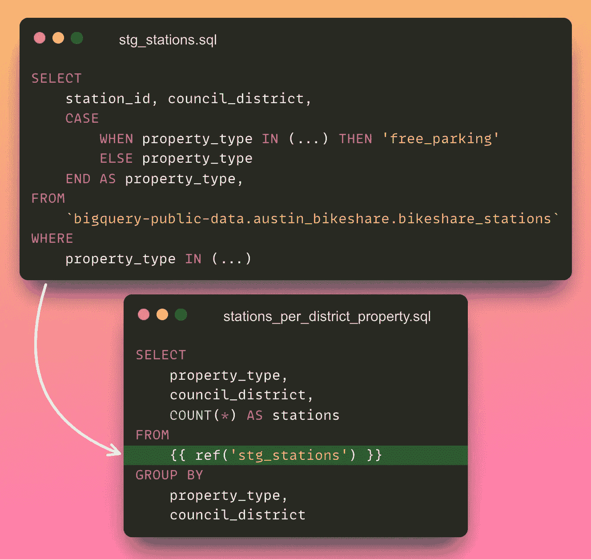

作者提供的图片

你的团队成员也可以同时在项目的不同部分工作。


作者提供的图片

因为每个模块都是自包含的，所以可以轻松进行测试和验证。

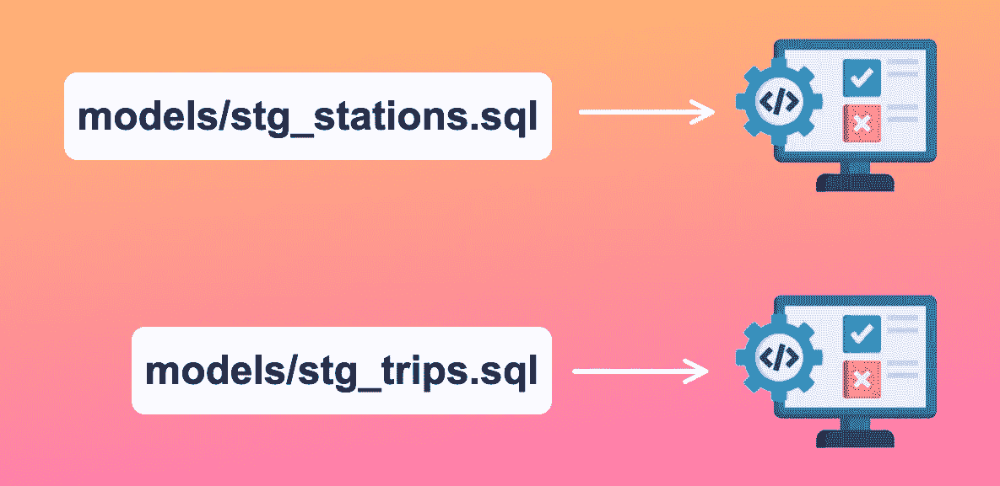

作者提供的图片

# 代码重用性

使用 dbt 中的宏可以简化在各种模型中重用 SQL 代码片段的过程。

为了演示，我们将在`macros/get_end_time.sql`文件中创建一个名为`get_end_time`的宏。这个宏基于开始时间和持续时间获取结束时间。

```py
# macros/get_end_time.sql

    (SELECT TIMESTAMP_ADD({{ start_time }}, INTERVAL {{ duration_minutes }} MINUTE) AS end_time)

```

将`get_end_time`宏视为一个可以重复使用的 Python 函数，用于根据提供的输入生成一个值。

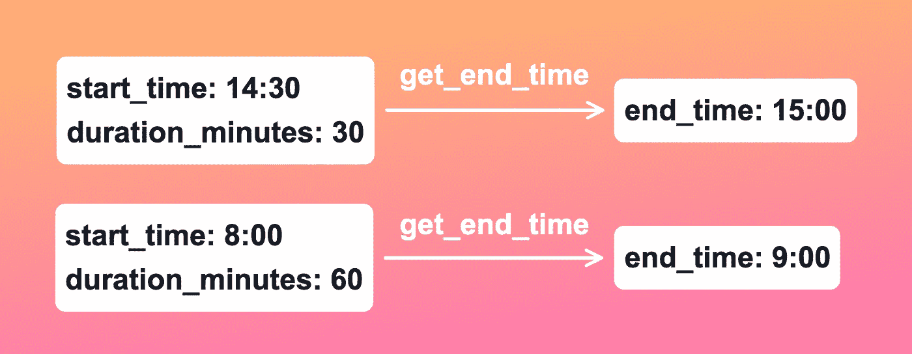

图片作者

现在，另一个模型可以使用这个宏，并指定`start_time`和`duration_minutes`的具体值：

```py
SELECT
    start_station_id,
    start_time,
    end_station_id,
    {{ get_end_time('start_time', 'duration_minutes') }} AS end_time
FROM
    `bigquery-public-data.austin_bikeshare.bikeshare_trips`
WHERE
    start_station_id IS NOT NULL AND end_station_id IS NOT NULL 
```

# 测试

使用 dbt，您可以轻松验证模型的正确性。例如，要确保`stg_stations`模型正确，您可能需要检查：

+   `station_id`列不能为空，并且具有唯一值。

+   `property_type`列仅有‘free_parking’或‘paid_parking’值。

要测试`stg_stations`模型，请在`models`目录中创建一个新的 YAML 文件，命名为`models/schema.yml`，并包含以下内容。

```py
version: 2

models:
  - name: stg_stations
    columns:
    - name: station_id
      tests: 
        # Should not contain null values.
        - not_null
        # Should be unique
        - unique
    - name: property_type
      tests:
        # Should be either 'free_parking' or 'paid_parking'.
        - accepted_values:
            values: ['free_parking', 'paid_parking']
```

然后运行`dbt test`以执行所有测试。

通过在转换过程中尽早捕捉潜在错误，测试可以降低下游应用程序和分析中的错误风险。

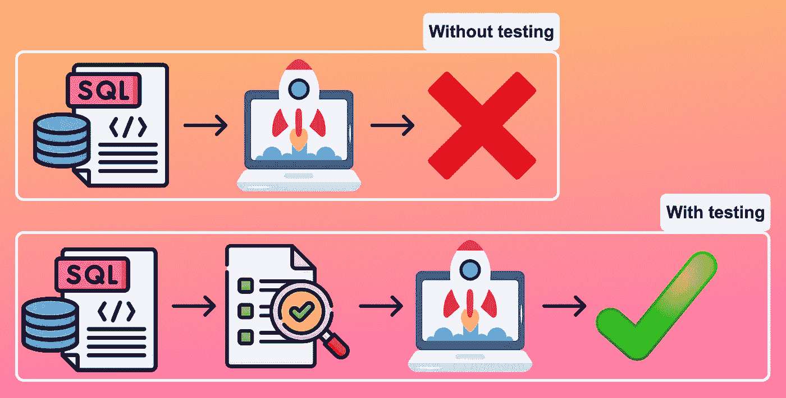

图片作者

此外，测试提供了一种跟踪数据随时间变化的方法，并确保在底层数据变化时转换逻辑保持正确。

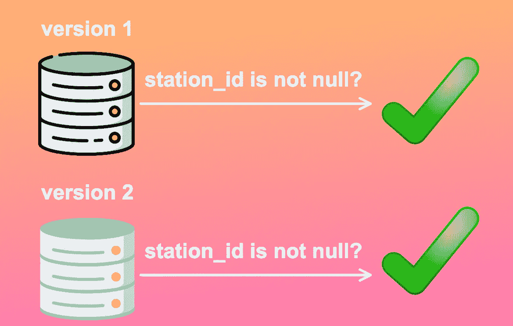

图片作者

# 文档

使用 dbt，您可以轻松地记录模型并与团队共享文档。

要为您的模型创建文档，请遵循以下步骤：

+   在您的`models/schema.yml`文件中添加描述。

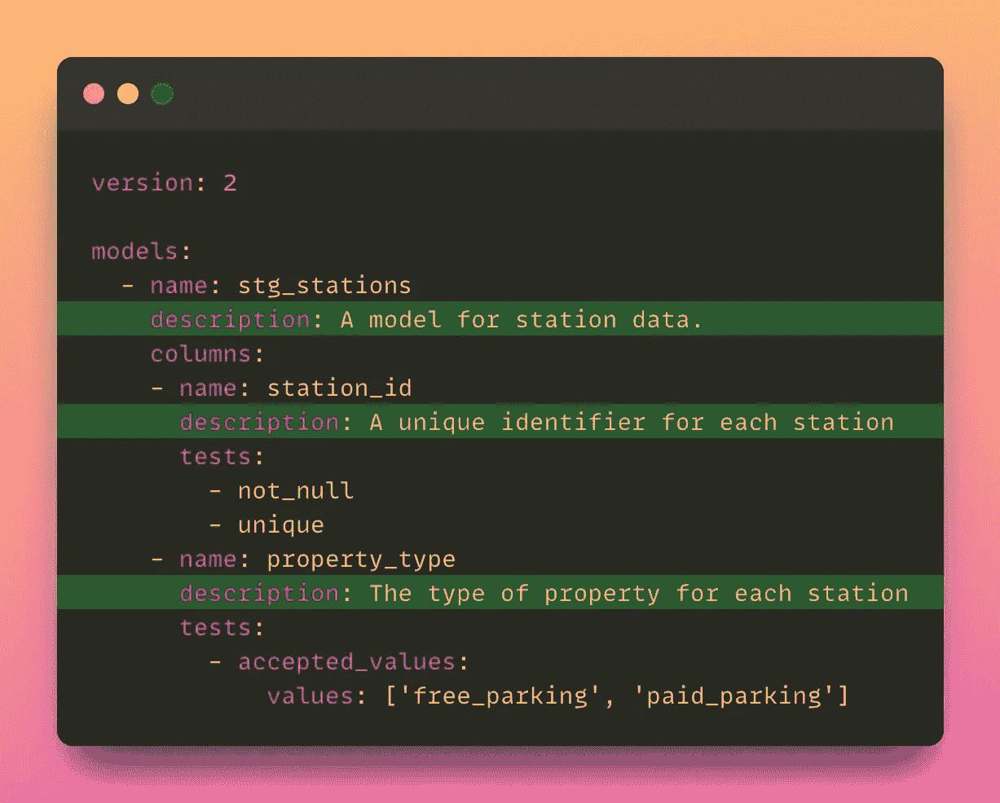

图片作者

> [查看完整文件。](https://github.com/khuyentran1401/dbt-demo/blob/main/models/schema.yml)

+   运行`dbt docs generate`以生成项目文档。

+   运行`dbt docs serve`命令以启动文档。

+   通过在您的网页浏览器中导航到[`localhost:8080`](http://localhost:8080/)来访问文档。

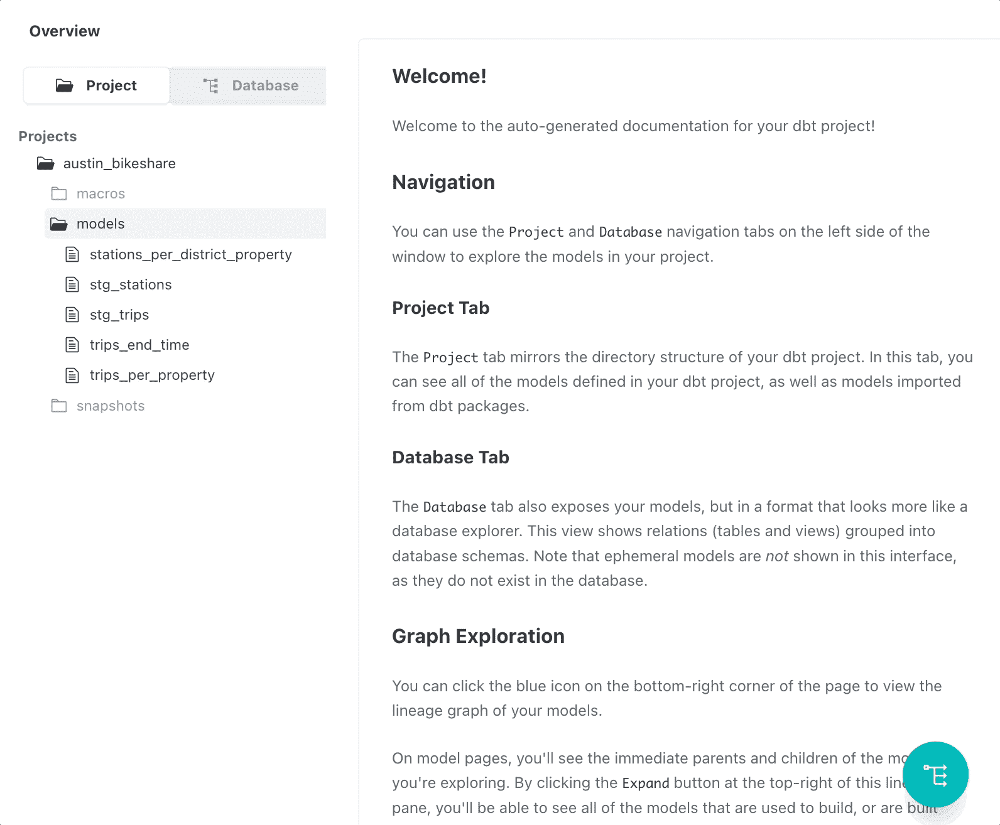

图片作者

记录您的数据模型有助于确保每个与模型工作的人都能理解其功能和目的。

您还可以通过点击“查看血缘图”来检查文档中的数据血缘。

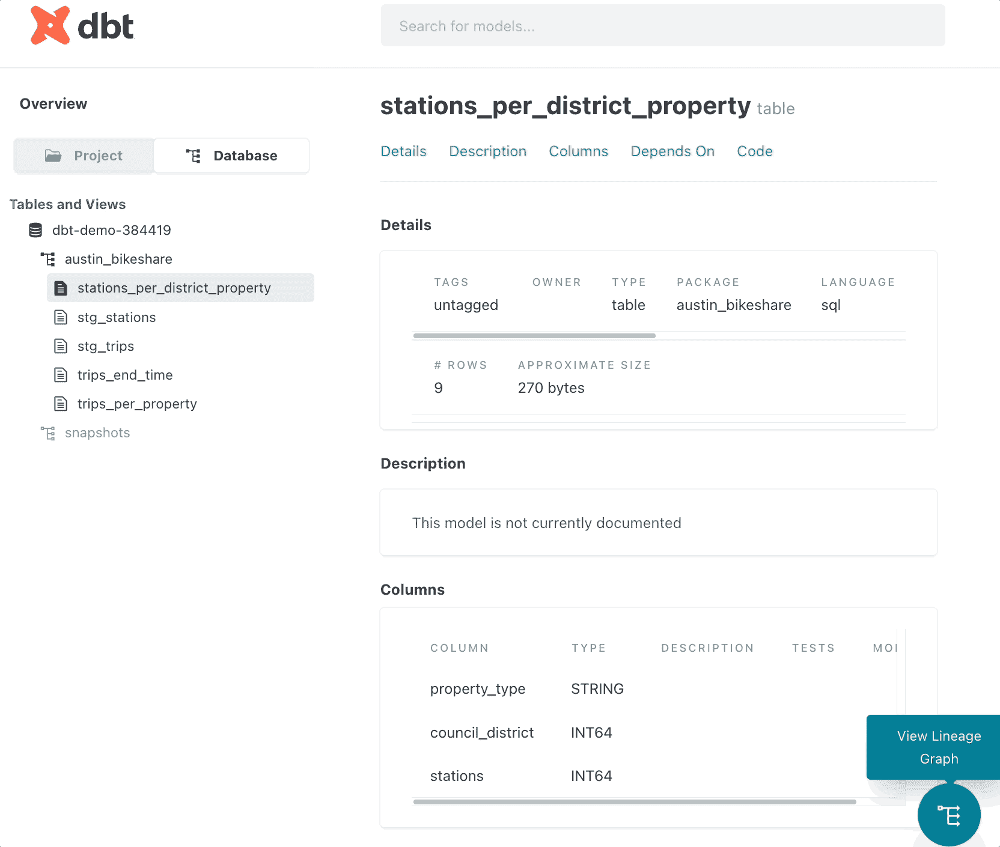

图片作者

# 跟踪数据变化

使用 dbt，您可以通过快照跟踪数据随时间的变化。

要了解这为何有用，请想象您有一个`subscriber_type`表，其中`subscriber_type`字段经常被覆盖，因为订阅者修改其会员状态。

如果用户将其会员资格从“试用”更改为“高级”，那么用户拥有“试用”会员资格的记录将丢失。

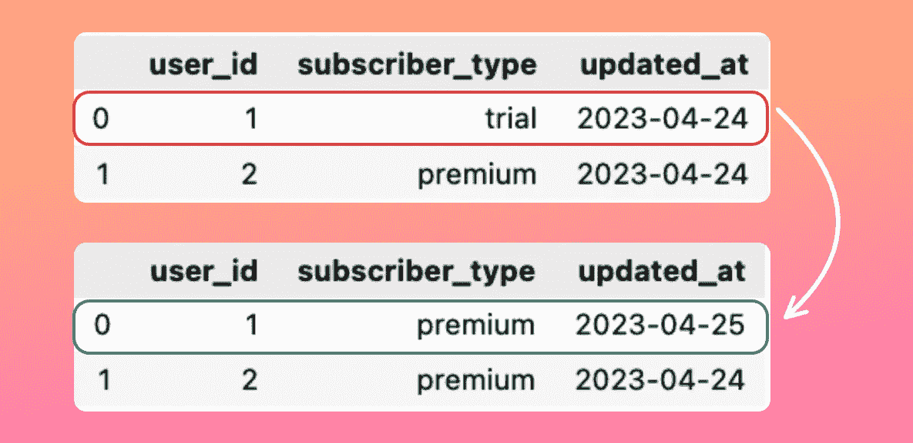

图片作者

如果我们想将这个记录用于其他评估，如计算用户更改订阅所需的平均时间，丢失这个记录可能会有问题。

dbt 可以快照这些更改，以帮助你了解行中值随时间的变化。以下是前面示例的快照表：

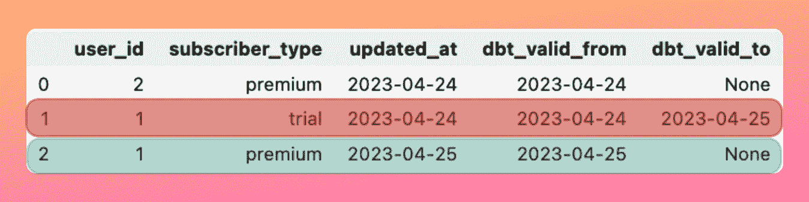

图片由作者提供

> [查看关于如何创建快照的教程。](https://docs.getdbt.com/docs/build/snapshots)

# 你不应该使用 dbt 的情况

虽然 dbt 在管理和建模数据方面可以提供显著的好处，但在以下情况下你不应使用 dbt：

1.  **你没有数据仓库：** dbt 专为数据仓库（如 Snowflake、Redshift 或 BigQuery）设计。如果你没有数据仓库，dbt 可能不是适合你的工具。

1.  **你想要一个一站式 ETL 解决方案：** 尽管 dbt 是一个出色的数据转换工具，但它并不提供完整的 ETL（提取、转换、加载）解决方案。数据提取、数据清洗和数据加载等任务需要其他工具。

1.  **你想可视化你的数据：** dbt 不是数据可视化工具。如果你想创建可视化，你需要使用其他工具或库，如 Tableau、Looker 或 PowerBI。

1.  **你想进行超出 SQL 语法限制的高级特征工程：** 由于 SQL 是 dbt 的主要语言，在特征工程方面存在一些限制。如果你需要执行超出 SQL 能力的高级特征工程任务，可能需要使用 Python 或 R 等其他工具或语言。

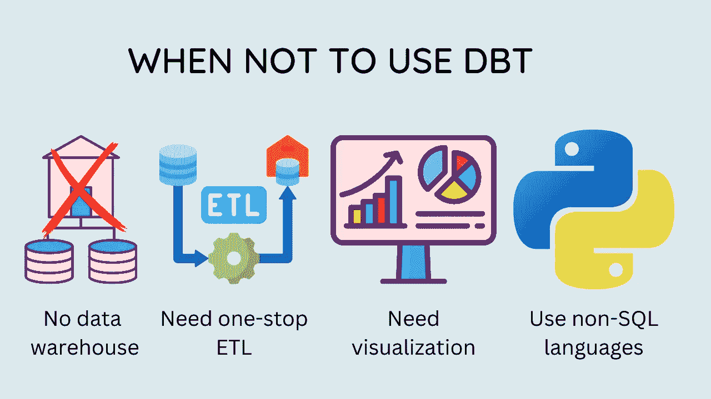

图片由作者提供

# 结论

在这篇文章中，我们介绍了 dbt 的一些有用功能，并学习了何时使用和不使用 dbt。希望这篇文章能提供足够的知识，帮助你决定 dbt 是否是你的数据管道的正确解决方案。

我喜欢写关于数据科学概念的文章，并玩弄不同的数据科学工具。你可以在[LinkedIn](https://www.linkedin.com/in/khuyen-tran-1401/)和[Twitter](https://twitter.com/KhuyenTran16)上与我联系。

如果你想查看我写的文章的代码，可以给这个[仓库](https://github.com/khuyentran1401/Data-science)点个星。关注我在 Medium 上的账号，以便获取最新的数据科学文章通知：

[](/introduction-to-dvc-data-version-control-tool-for-machine-learning-projects-7cb49c229fe0?source=post_page-----9dc1566d960d--------------------------------) ## DVC 简介：机器学习项目的数据版本控制工具

### 就像 Git 一样，但用于数据！

towardsdatascience.com [](/4-pre-commit-plugins-to-automate-code-reviewing-and-formatting-in-python-c80c6d2e9f5?source=post_page-----9dc1566d960d--------------------------------) [## 4 个预提交插件，用于自动化 Python 中的代码审查和格式化

### 使用 black、flake8、isort 和 interrogate 编写高质量的代码

[4 个预提交插件以自动化代码审查和格式化](https://towardsdatascience.com/4-pre-commit-plugins-to-automate-code-reviewing-and-formatting-in-python-c80c6d2e9f5?source=post_page-----9dc1566d960d--------------------------------) [## 使用 Pandera 验证您的 pandas DataFrame

### 确保您的数据符合预期

[使用 Pandera 验证您的 pandas DataFrame](https://towardsdatascience.com/validate-your-pandas-dataframe-with-pandera-2995910e564?source=post_page-----9dc1566d960d--------------------------------) [## pytest 为数据科学家

### pytest 为您的数据科学项目提供全面指南

[pytest 对数据科学家的指南](https://towardsdatascience.com/pytest-for-data-scientists-2990319e55e6?source=post_page-----9dc1566d960d--------------------------------)
