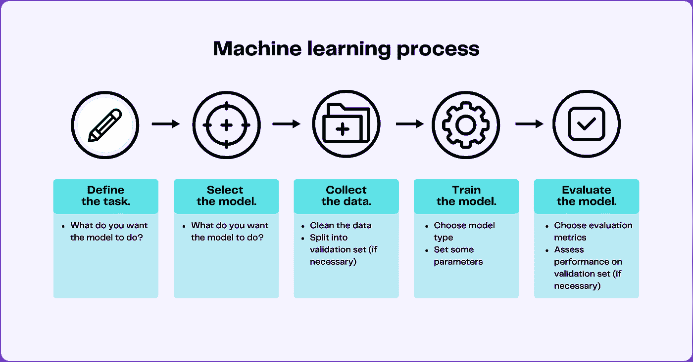
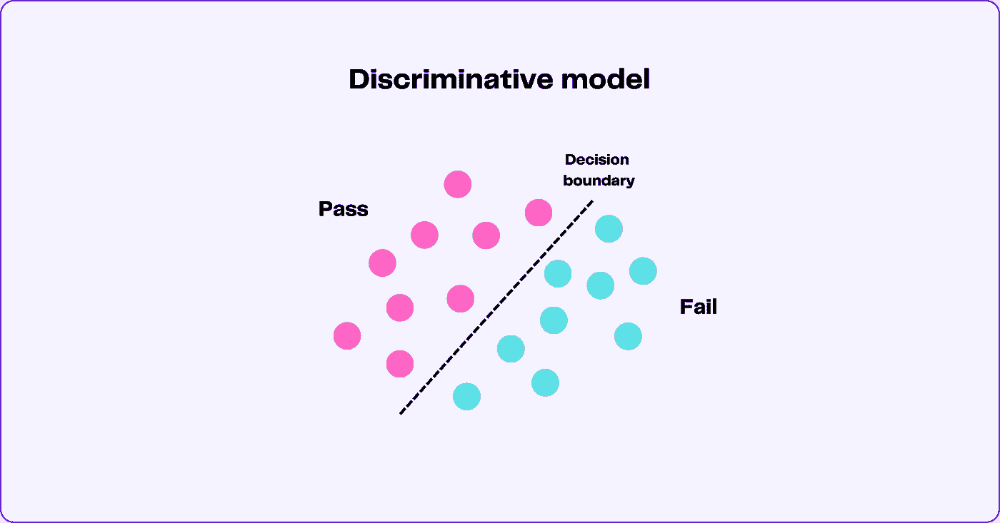
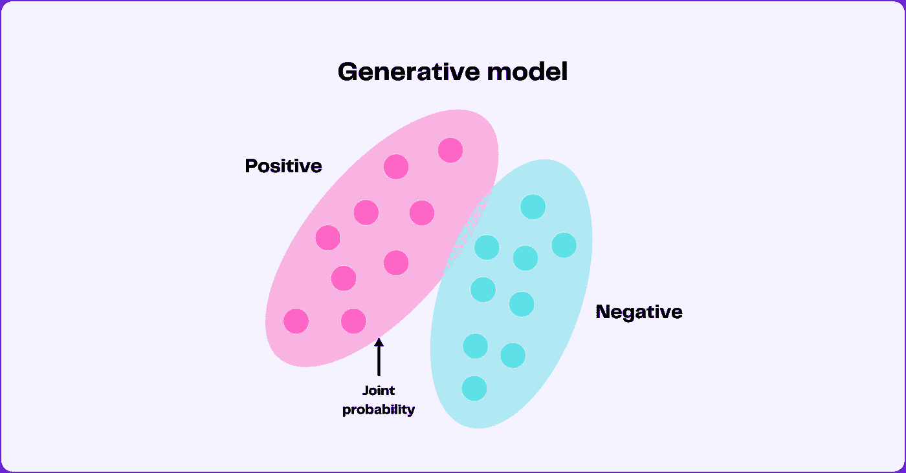
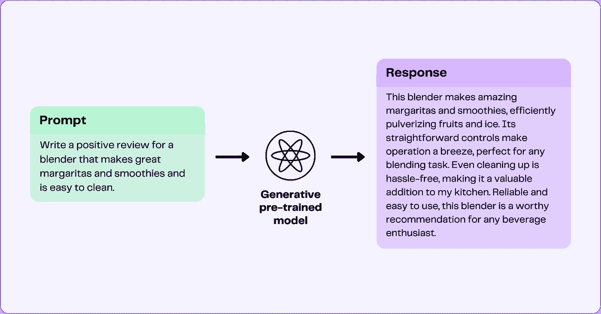
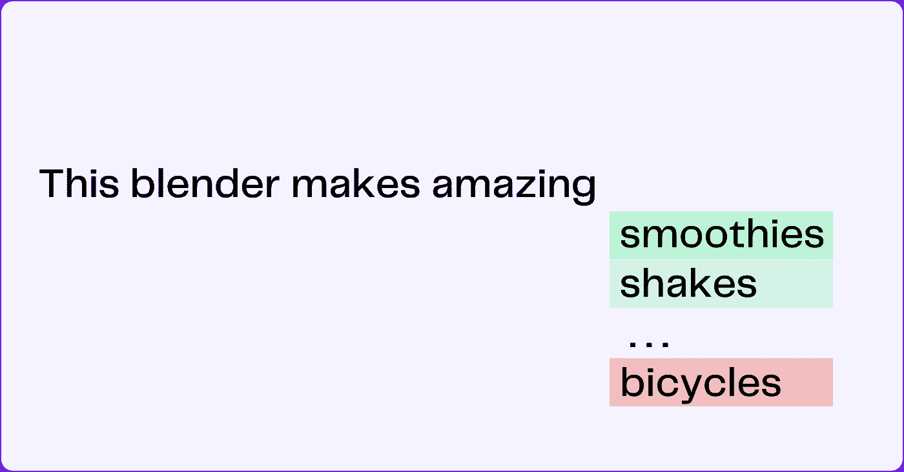

# 什么是生成性 AI？全面指南

> 原文：[`towardsdatascience.com/what-is-generative-ai-a-comprehensive-guide-for-everyone-8614c0d5860c`](https://towardsdatascience.com/what-is-generative-ai-a-comprehensive-guide-for-everyone-8614c0d5860c)

## 了解机器学习在生成性 AI 中的作用。

 [Mary Newhauser](https://medium.com/@mary.newhauser?source=post_page-----8614c0d5860c--------------------------------)

·发布于 [Towards Data Science](https://towardsdatascience.com/?source=post_page-----8614c0d5860c--------------------------------) ·15 分钟阅读·2023 年 10 月 3 日

--

图片由作者提供。

*本文最初发表于* [*GPTech*](https://www.gptechblog.com/what-is-generative-ai-comprehensive-guide-beginners/)*。*

乍一看，生成性 AI 看起来像纯粹的魔法。但一旦你开始揭开这个迷人技术背后的层层面纱，你会发现它本质上是一个统计过程，既有令人印象深刻的结果，也有关键的局限性。

从最广泛的意义上讲，*生成性 AI 是一种人工智能，它基于从现有数据中学习到的模式创建新内容*。也许生成性 AI 最明显的例子是预测搜索。谷歌在用户多年来输入的数十亿个搜索查询上训练了一个大型语言模型（LLM），然后尝试预测你自己搜索查询中的下一个词。

但与最近在生成性 AI 方面的进展相比，预测搜索显得有些过时，甚至原始。生成性 AI 现在可以用来编写从新的 [《宋飞传》剧集](https://www.theverge.com/23581186/ai-seinfeld-twitch-stream-chatgpt?ref=gptechblog.com) 到 [学术文章](https://www.sciencedaily.com/releases/2023/03/230323103316.htm?ref=gptechblog.com) 的一切，基于文本提示合成图像，甚至 [制作歌曲](https://www.nytimes.com/2023/04/19/arts/music/ai-drake-the-weeknd-fake.html?ref=gptechblog.com) 以著名艺术家的风格。

尽管有很多炒作，但仍然存在令人担忧的原因。由生成性 AI 驱动的聊天机器人可能产生不准确和有毒的回应，政治家和公众人物的深度伪造视频可能被用来传播虚假信息，而各种模型也可能被用来加深现有的人类偏见。

很明显，生成性 AI 将会影响劳动、工业、政府，甚至是人类的定义。为了与生成性 AI 共存，我们需要了解它是如何工作的以及它所带来的风险。本文将解释什么是机器学习模型，讨论判别模型与生成模型的区别，探索生成模型的一些实际应用，并涉及它们的风险和局限性。

# 机器学习模型

[人工智能](https://www.ibm.com/topics/artificial-intelligence?ref=gptechblog.com)是一个广泛的术语，描述了一种能够执行模仿人类智能的任务的技术，例如需要推理、问题解决、决策或语言理解的任务。

[机器学习](https://www.ibm.com/topics/machine-learning?ref=gptechblog.com)是 AI 的一个分支，其中“机器”（算法）从数据中“学习”模式和关联，以执行特定任务。这就是它的工作原理：

1.  **定义任务。** 我们需要做的第一件事是定义我们希望模型执行的任务。这可能是将来邮件分类为垃圾邮件或非垃圾邮件，基于销售数据预测未来收入，根据客户行为将客户分组，基于购买历史向客户推荐新产品，或者根据给定的文本提示创建图像。

1.  **选择模型。** 影响我们选择哪种类型模型的因素有很多。我们在前一步定义的任务，加上可用数据的性质和数量，以及模型在现实世界中的使用方式（以及使用者）都会影响我们选择的模型类型。

1.  **收集（和清理）数据。** 接下来，我们收集希望模型学习的数据。我们通过删除异常值和损坏的数据来清理数据，并将其组织成表格格式。

1.  **可选：拆分数据。** 在从数据中学习时，我们通常会留出一部分（通常是 80%）来构建我们的知识，这被称为**训练数据**。然后我们使用剩下的部分（通常是 20%），这被称为**验证数据**，来检查我们学习的效果。这个过程帮助我们查看我们对训练数据的理解是否能够适应新信息。

1.  **训练模型。** 接下来，我们将空模型投入使用，让它尽可能从训练数据中学习。这被称为**训练过程**，因为模型正在被**训练**（即学习、研究和分析数据中的关系）。我们可以通过选择**参数**来稍微指导模型，并在某些方向上推动它。

1.  **评估模型。** 在将模型发布到实际应用之前，我们希望通过查看它在某些指标上的得分，如准确率、精确率、召回率和 F1 分数，来了解它的表现。如果我们有验证集，我们可以要求模型在验证集上执行所选任务，并查看其准确性。

作者提供的图像。

机器学习是一个复杂的、迭代的、不断发展的过程。大多数关注集中在模型训练步骤上，但实际花费的大部分时间在于数据收集和清理步骤。就像石油和天然气等化石燃料通过复杂的管道系统从一个地方运输到另一个地方一样，数据也有自己的管道系统。一旦管道建立并运行，它们需要持续的监控和维护，但达到这一点需要大量的工作。

但是，为了本文的目的，我们将专注于机器学习模型本身。为了有效理解生成式 AI，我们必须了解生成式和判别式机器学习模型之间的区别。

# 判别模型与生成模型

模型的工作是利用从数据集中学到的关联和模式来预测其他数据点的结果。这些预测以介于 0 和 1 之间的概率形式出现。由于概率是对不确定性的测量，并且在现实世界的情况下总是存在一定程度的不确定性，因此预测的概率永远无法等于确切的 0 或 1。

机器学习模型在生成数据点的预测概率方面的方法各异。在生成式 AI 的背景下，理解判别模型和生成模型生成这些预测概率之间的区别是很重要的。

# 判别模型

*判别模型通过识别之前见过的例子之间的组或类别差异来学习预测数据的概率。*

例如，逻辑回归模型可以预测二元结果的概率，例如，基于出勤率、学习时间、以前的考试成绩以及过去学生的通过/未通过状态，预测学生通过课程的概率。

参考下图，其中每个点被可视化为来自去年每个学生的出勤率、学习时间、以前的考试成绩和最终通过/未通过状态。给定每个学生的个体特征和最终结果，模型绘制了一个**决策边界**。

作者提供的图像。

当面对新学生及其数据时，模型使用决策边界来预测他们是否会通过课程，该预测表示为 0（不及格）和 1（及格）之间的概率。数据点距离决策边界越远，模型对其预测的信心越大。

虽然判别模型在分类和回归等任务中可以很简单有效，但它们*仅在能够访问足够的标记结果数据时才表现良好*（过去学生的及格/不及格状态）。在现实任务中，这可能是一个严重的限制。这正是生成模型发挥作用的地方。

# 生成模型

*生成模型通过仅学习输入数据的基础结构来预测数据的概率。*

生成模型在研究和学习训练数据时非常出色，以至于它们不需要标记的结果数据，如上述示例所示。这意味着两件事：

1.  生成模型可以预测数据的概率（就像判别模型一样，只是使用不同的方法）。

1.  生成模型可以生成看起来与之前见过的数据（即训练数据）非常相似的新数据。

考虑一下确定一条亚马逊产品评论通常是正面还是负面的任务。在下面的插图中，每个点都被可视化为一个单独的评论，具有自己的风格、语气以及词汇和短语的独特组合。生成模型研究所有这些数据点，捕捉每条评论中的模式、结构和语言变化*以及它们之间的关系*。

图片来自作者。

给定所有评论中的词汇和模式，生成模型计算这些词汇和模式在正面评论与负面评论中出现的概率。这个概率称为**联合概率**，定义为一组特征在数据中一起出现的概率。例如，模型可能会学到“broken”和“disappointed”这两个词经常一起出现在负面评论中，而“highly recommend”和“very satisfied”这两个词则经常一起出现在正面评论中。

最终，模型将运用它从训练数据中学到的所有知识来确定新未见过的评论被分类为正面或负面的可能性。生成模型与判别模型的不同之处在于，它们不仅能执行分类任务，还能在被提示时生成全新的数据。这意味着我们的亚马逊评论模型不仅能分类现有评论，还能撰写新评论。

在进行生成任务时，模型需要被提示。在这种情况下，已经训练过的评论模型会收到一个文本提示，并被要求猜测接下来哪些词汇出现。

图片来自作者。

尽管在机器学习社区中仍有[争议](https://www.linkedin.com/pulse/chatgpt-simply-predicting-next-word-trung-ngo-ph-d-?ref=gptech.ghost.io)，解释模型生成新文本的最简单方式是说它*根据模型训练时的文本和提示中的文本预测下一个词*。在下面的例子中，模型预测“smoothies”是最有可能出现在回应中的词。这受到了模型从训练数据中学到的“smoothies”和“shakes”与“blender”相关的事实的影响，以及我们的提示要求模型在回应中提到“smoothies”。

图片来自作者。

鉴于在训练数据中“自行车”很少与“搅拌机”一起出现，并且我们的提示中没有提到“自行车”，模型可以安全地假设“自行车”不会是下一个词。

总结来说，生成式机器学习模型捕捉输入数据中的模式、结构和变化，这使得它们能够计算特征共同出现的联合概率。这使得它们能够预测现有数据属于某个类别（例如，正面或负面评论）的概率，并生成类似于训练数据的新数据。但这种“新数据”究竟是什么样的呢？事实是，机器学习模型生成的数据可以有多种形式，并服务于多种目的。

# 现实世界中的生成式 AI

自机器学习诞生以来，生成模型就被用于建模和预测数据。然而，近年来领域的进展，如 2014 年[变分自编码器](https://arxiv.org/abs/1312.6114?ref=gptechblog.com)（VAE）和[生成对抗网络](https://proceedings.neurips.cc/paper_files/paper/2014/file/5ca3e9b122f61f8f06494c97b1afccf3-Paper.pdf?ref=gptechblog.com)（GAN）模型的出现，将生成技术提升到了新的高度，使模型能够合成完全新颖的图像。同样，2017 年首个[生成预训练变换器](https://s3-us-west-2.amazonaws.com/openai-assets/research-covers/language-unsupervised/language_understanding_paper.pdf?ref=gptechblog.com)（GPT）模型的推出标志着语言生成能力的重大飞跃，导致了一系列不断改进的语言模型，能够生成与人类编写的文本难以区分的文本。

尽管像 Meta 和 Google 这样的主要科技公司早已投资于 AI 研究，并且不断尝试通过每个发布的大型语言模型超越彼此，初创公司界也见证了对探索 AI 潜力，特别是生成模型的浓厚兴趣。根据 Dealroom 的数据，生成式 AI 初创公司总共筹集了超过 170 亿美元的资金，Dealroom 维护了一个极佳的 [资金可视化图谱](https://app.dealroom.co/lists/33530?ref=gptechblog.com)。

让我们来看看这些公司如何通过生成文本、图像和音频的产品来利用 AI。

# 生成文本

生成文本是指使用 AI 模型生成连贯且上下文相关的句子。这些模型在大量文本数据上进行训练，能够模仿人类语言模式并生成新的文本。实际应用包括：

1.  **AI 聊天机器人**: OpenAI 的 [ChatGPT](https://openai.com/blog/chatgpt?ref=gptechblog.com) 是迄今为止最强大的个人助手聊天机器人。它可以用于多种任务，包括文档摘要、文本风格转移、语言翻译和内容生成。虽然它是一个出色的通用工具，但许多公司进一步优化了 ChatGPT 的底层模型，以创建在完成特定下游任务方面更好的产品。

1.  **内容生成**: [Jasper AI](https://www.jasper.ai/?ref=gptechblog.com) 提供了一个可定制的生成式 AI 平台，满足企业的特定需求，提供与公司品牌一致的量身定制内容，并支持在各种平台和应用程序中访问，包括将其技术直接集成到企业产品中的选项。

1.  **语言纠正**: [Grammarly](https://www.grammarly.com/?ref=gptechblog.com) 提供了一系列应用程序，提供跨许多应用和网站的集成写作辅助，特别强调确保无错误写作。他们的服务无缝集成到各种应用中，如 Microsoft Office、Google Docs 和 Gmail，通过其便捷的插件。

图片由作者提供。

# 生成图像

生成图像涉及通过 AI 模型创建新的、原创的图像，通常通过从现有图像的数据集中学习。这个艺术与技术的迷人交汇点有许多应用，包括：

1.  **艺术图像生成**: Adobe [Firefly](https://www.adobe.com/sensei/generative-ai/firefly.html?ref=gptechblog.com) 利用传统 Adobe 产品的能力，包括 Illustrator 和 Photoshop，通过简单的文本提示让用户创建、编辑和操控图像。Stability AI 提供了类似的图像编辑和生成产品 [Clipdrop](https://clipdrop.co/?ref=gptechblog.com)，该产品最近推出了令人着迷的 [Uncrop](https://clipdrop.co/uncrop?ref=gptechblog.com) 工具，它利用生成 AI 扩展照片的背景。

1.  **演示和视觉叙事**: [Tome](https://tome.app/?ref=gptechblog.com) 使你能够轻松制作引人入胜的现代演示文稿，顺畅地整合来自各种来源的文本和图像，如提示、创意简报，甚至不同的文档格式，如网站。

# 生成音频

生成声音是指使用 AI 模型生成新的音频元素，包括音乐、语音和音效。这些模型可以从现有的音频数据中学习并生成新的、独特的声音。以下是一些现实世界的应用案例：

1.  **音乐制作**: [Soundraw](https://soundraw.io/?ref=gptechblog.com) 是一个由 AI 驱动的音乐生成器，提供了一个免版税曲目库，让创作者能够为他们的内容项目制作原创歌曲，同时确保对他们的音乐作品拥有完全的所有权和许可控制。

1.  **语音合成**: [Wellsaid](https://wellsaidlabs.com/features/?ref=gptechblog.com) 允许你自动生成高质量的文本语音，并提供一个头像语音库以及创建你自己声音的机会。

图片由作者提供。

生成 AI，通过变分自编码器 (VAE) 和生成对抗网络 (GAN) 等模型显著进步，正在重塑多个领域，投资超过 170 亿美元。现实世界的应用包括文本生成，AI 可以生成类人语言模式，图像创建，提供生成新颖图像的能力，以及音频制作，新声音可以被合成。这些应用标志着生成 AI 在生产风格和质量日益接近人类生成内容的潜力不断扩展。尽管最近 AI 的进展确实令人兴奋，但同样重要的是要认识到其固有的风险和局限性。

# 生成 AI 的风险和局限性

尽管关于生成 AI 与原子武器一样危险甚至更危险的担忧被夸大和渲染，但这项新技术确实给公众带来了真实的危险，并且具有严重的伦理影响。一些最关键的问题包括数据隐私、模型准确性以及生成有害内容的倾向，和 LLM 及其他生成模型的不道德使用。

## 数据隐私

关于生成 AI 的主要关注点之一是数据隐私。这些 AI 模型是在大量数据上进行训练的，其中一些可能包括敏感或受版权保护的信息。尽管通常会采取措施在训练模型之前对数据进行匿名化和清理，但无意中泄露数据的潜在风险仍然是一个重大关注点。此外，生成 AI 几乎总是需要一个提示才能开始，而提示中包含的信息可能是敏感的或专有的。这令人担忧，因为一些 AI 工具如 ChatGPT 会将你的提示反馈到基础语言模型中。2023 年 4 月，三星[禁止](https://www.bloomberg.com/news/articles/2023-05-02/samsung-bans-chatgpt-and-other-generative-ai-use-by-staff-after-leak?ref=gptechblog.com)在公司内部使用 ChatGPT，因为发现几名员工不小心泄露了用于测量半导体设备的软件源代码。

[## 彭博社

### 编辑描述

www.bloomberg.com](https://www.bloomberg.com/news/articles/2023-05-02/samsung-bans-chatgpt-and-other-generative-ai-use-by-staff-after-leak?ref=gptechblog.com&leadSource=uverify+wall&source=post_page-----8614c0d5860c--------------------------------)

## 准确性与有害内容

关于生成模型实施的另一个关注点是模型的准确性。LLM（大型语言模型）有产生幻觉的倾向，这意味着它们以完全令人信服的方式提供虚假信息。这些幻觉有可能在全球范围内传播虚假信息，并削弱公众对人工智能系统的信任。由于开源模型通常经历的后期模型调整过程较少（如果有的话），它们尤其容易“脱轨”，不仅仅是产生幻觉，还可能生成彻底有害的内容。2023 年 3 月，国家饮食失调协会关闭了其人工操作的电话热线，并用一个聊天机器人替代，但该机器人在上线后给一位独立测试机器人的心理学家提供了[有问题的](https://www.nytimes.com/2023/06/08/us/ai-chatbot-tessa-eating-disorders-association.html?ref=gptechblog.com)减肥建议。

 [## 一款健康聊天机器人因其‘有害’的减肥焦点而下线

### 人工智能工具 Tessa 由国家饮食失调协会推出，旨在…

www.nytimes.com](https://www.nytimes.com/2023/06/08/us/ai-chatbot-tessa-eating-disorders-association.html?ref=gptechblog.com&source=post_page-----8614c0d5860c--------------------------------)

## 不道德使用

截至本文发布时，还没有通过任何重要的立法来规范 AI 的创建和应用。因此，恶意行为者在利用这些工具进行恶意行为时似乎拥有*完全自由*。

生成视频技术的滥用很快显现出来，当它被用于通过传播[深度伪造色情内容](https://www.teenvogue.com/story/deepfake-porn-victims-are-seeking-federal-protections-through-a-new-bill?ref=gptechblog.com)来骚扰和威胁女性时。在 2023 年 3 月，联邦贸易委员会发布了一份[声明](https://consumer.ftc.gov/consumer-alerts/2023/03/scammers-use-ai-enhance-their-family-emergency-schemes?ref=gptechblog.com)，提醒大家警惕，因“语音克隆”技术的出现，钓鱼骗局变得更加复杂。语音克隆是一种训练在短音频片段上的 AI，可以通过文本让其说几乎任何内容。

 [## 深度伪造色情内容给受害者带来了创伤，但大多数人无能为力

### 深度伪造色情内容的受害者正在发声，呼吁对施虐者缺乏保护。一项新法案可能会改变这种状况。

www.teenvogue.com](https://www.teenvogue.com/story/deepfake-porn-victims-are-seeking-federal-protections-through-a-new-bill?ref=gptechblog.com&source=post_page-----8614c0d5860c--------------------------------)

总之，尽管生成 AI 已经取得了令人惊叹的进展并充满了巨大潜力，但我们必须意识到其风险和局限性，特别是在目前缺乏立法监管其创建和使用的情况下。这意味着要花时间认真权衡使用生成 AI 的潜在好处与不良后果，考虑伦理问题。以下是一些[提示](https://resources.infosecinstitute.com/topic/ai-best-practices/?ref=gptechblog.com)，帮助你更安全、更谨慎、更加道德地使用生成 AI 产品：

+   阅读（或至少浏览）隐私政策。

+   不要上传任何私人内容（文本、图片、视频），以免这些内容被反馈到产品的基础模型中。

+   如果你在商业中使用预训练的生成模型，务必阅读模型的许可证。

+   验证聊天机器人的响应是否符合主要来源。

+   研究基础模型的特定偏见和局限性。

# 结论

在本文中，我们讨论了生成机器学习模型的关键方面，特别是它们区分各种数据类型的能力以及创建与现有数据非常相似的新数据的能力。生成模型的质量在过去十年中显著提高，导致对生成 AI 背后的公司和技术的投资激增，特别是在生成文本、图像和音频方面。

然而，随着这种兴起也带来了诸如数据隐私、模型准确性和创建有害内容等伦理问题。我们必须继续监控这些问题，并在使用生成式 AI 产品时保持个人警惕和意识。

*这篇文章最初发布在* [*GPTech*](https://www.gptechblog.com/what-is-generative-ai-comprehensive-guide-beginners/)*。*

*如果您想保持最新的数据科学趋势、技术和工具，考虑成为 Medium 会员。您将获得对像 Towards Data Science 这样的文章和博客的无限访问，并支持我的写作。 (每个会员我会获得小额佣金)。*

 [## 通过我的推荐链接加入 Medium - Mary Newhauser

### 作为 Medium 会员，您的会员费的一部分会分配给您阅读的作者，并且您可以完全访问每个故事……

medium.com](https://medium.com/@mary.newhauser/membership?source=post_page-----8614c0d5860c--------------------------------)

## **想要联系吗？**

+   📖 在 [Medium](https://medium.com/@mary.newhauser) 上关注我

+   💌 [订阅](https://medium.com/@mary.newhauser/subscribe) 以便每次我发布新内容时收到邮件

+   🖌️ 查看我关于生成式 AI 的新 [博客](http://gptech.ghost.io/)

+   🔗 查看我的 [作品集](https://www.datascienceportfol.io/marynewhauser)

+   👩‍🏫 我还是一名数据科学 [教练](https://www.datajump.co/)！

## 我还写过：

 ## 理解 ChatGPT 插件：优势、风险和未来发展

### 期待进步，而非完美。

towardsdatascience.com  ## 从数据分析师转变为数据科学家的指南 2023

### 您需要的技能和资源，以便从数据分析师转变为数据科学家职位。

towardsdatascience.com  ## 清洁 Pandas 代码的终极参考

### 清洁文本数据的简洁方法

towardsdatascience.com

## 参考文献

1.  Parrish, A. (2023 年 2 月 1 日). [这个 AI Seinfeld 直播到底是怎么回事？](https://www.theverge.com/23581186/ai-seinfeld-twitch-stream-chatgpt?ref=gptechblog.com) *The Verge.*

1.  Williams, A. (2023 年 3 月 23 日). [使用 ChatGPT 撰写的论文展示了 AI 在学术界的机遇和挑战](https://www.sciencedaily.com/releases/2023/03/230323103316.htm?ref=gptechblog.com)。*科学日报.*

1.  Coscarelli, J. (2023 年 4 月 19 日). [虚假的“Drake”和“The Weeknd”AI 音乐震撼音乐界](https://www.nytimes.com/2023/04/19/arts/music/ai-drake-the-weeknd-fake.html?ref=gptechblog.com)。*纽约时报.*

1.  IBM. (无日期). [什么是人工智能（AI）？](https://www.ibm.com/topics/artificial-intelligence?ref=gptechblog.com)。*IBM.*

1.  IBM. (无日期). [什么是机器学习？](https://www.ibm.com/topics/machine-learning?ref=gptechblog.com) *IBM.*

1.  Ngo, T. (2023 年 2 月 26 日). [ChatGPT 并不仅仅是“预测”下一个词](https://www.linkedin.com/pulse/chatgpt-simply-predicting-next-word-trung-ngo-ph-d-/?ref=gptech.ghost.io)。*LinkedIn.*

1.  Kingma, D. P., & Welling, M. (2014). [自编码变分贝叶斯](https://arxiv.org/abs/1312.6114?ref=gptechblog.com)。在*国际学习表征会议*中。

1.  Goodfellow, I., Pouget-Abadie, J., Mirza, M., Xu, B., Warde-Farley, D., Ozair, S., Courville, A., & Bengio, Y. (2014). [GAN（生成对抗网络）](https://proceedings.neurips.cc/paper_files/paper/2014/file/5ca3e9b122f61f8f06494c97b1afccf3-Paper.pdf?ref=gptechblog.com)。*日本模糊理论与智能信息学会期刊*, *29*(5), 177。

1.  Radford, A., Narasimhan, K., Salimans, T., & Sutskever, I. (2018). [通过生成预训练提高语言理解](https://s3-us-west-2.amazonaws.com/openai-assets/research-covers/language-unsupervised/language_understanding_paper.pdf?ref=gptechblog.com)。预印本。

1.  Ullmer, F. & Chiavarini, L. (2023 年 6 月 9 日). [生成性 AI 初创公司](https://app.dealroom.co/lists/33530?ref=gptechblog.com)。*Deal Room*。

1.  Gurman, M. (2023 年 5 月 2 日). [三星禁止员工使用 AI 后发现 ChatGPT 数据泄露](https://www.bloomberg.com/news/articles/2023-05-02/samsung-bans-chatgpt-and-other-generative-ai-use-by-staff-after-leak?leadSource=uverify+wall&ref=gptechblog.com)。*彭博社.*

1.  McCarthy, L. (2023 年 6 月 8 日). [一款健康聊天机器人因关注体重减轻而下线](https://www.nytimes.com/2023/06/08/us/ai-chatbot-tessa-eating-disorders-association.html?ref=gptechblog.com)。*纽约时报.*

1.  Latifi, F. (2023 年 6 月 7 日). [深度伪造色情受害者通过立法寻求联邦保护](https://www.teenvogue.com/story/deepfake-porn-victims-are-seeking-federal-protections-through-a-new-bill?ref=gptechblog.com)。*Teen Vogue.*

1.  Puig, A. (2023 年 3 月 20 日). [骗子利用 AI 提升他们的家庭紧急情况骗局](https://consumer.ftc.gov/consumer-alerts/2023/03/scammers-use-ai-enhance-their-family-emergency-schemes?ref=gptechblog.com)。*FTC 消费者建议。*

1.  Evans, K. (2023 年 5 月 10 日). [AI 最佳实践：如何安全使用像 ChatGPT 这样的工具](https://resources.infosecinstitute.com/topic/ai-best-practices/?ref=gptechblog.com)。*信息安全.*
