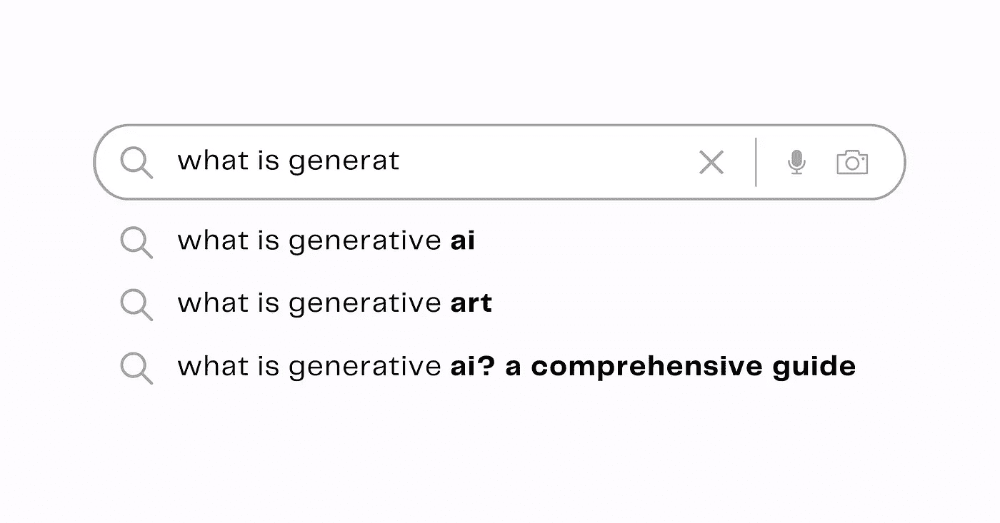

# 什么是生成式 AI？适用于所有人的全面指南

> 原文：[`towardsdatascience.com/what-is-generative-ai-a-comprehensive-guide-for-everyone-8614c0d5860c?source=collection_archive---------6-----------------------#2023-10-03`](https://towardsdatascience.com/what-is-generative-ai-a-comprehensive-guide-for-everyone-8614c0d5860c?source=collection_archive---------6-----------------------#2023-10-03)

## 理解机器学习在生成式 AI 中的作用。

 [Mary Newhauser](https://medium.com/@mary.newhauser?source=post_page-----8614c0d5860c--------------------------------)

·

[关注](https://medium.com/m/signin?actionUrl=https%3A%2F%2Fmedium.com%2F_%2Fsubscribe%2Fuser%2F6b27bdb820b9&operation=register&redirect=https%3A%2F%2Ftowardsdatascience.com%2Fwhat-is-generative-ai-a-comprehensive-guide-for-everyone-8614c0d5860c&user=Mary+Newhauser&userId=6b27bdb820b9&source=post_page-6b27bdb820b9----8614c0d5860c---------------------post_header-----------) 发表在 [Towards Data Science](https://towardsdatascience.com/?source=post_page-----8614c0d5860c--------------------------------) · 15 分钟阅读 · 2023 年 10 月 3 日 

--

作者提供的图片。

*本文最初发布于* [*GPTech*](https://www.gptechblog.com/what-is-generative-ai-comprehensive-guide-beginners/)*。*

初看之下，生成式 AI 似乎纯属魔法。但一旦你开始揭开这一迷人技术的层层面纱，你会发现它其实是一个统计过程，既有令人印象深刻的结果，也有严重的局限性。

从广义上讲，*生成性 AI 是一种基于从现有数据中学习到的模式创建新内容的人工智能类型*。生成性 AI 的最明显例子可能是预测搜索。谷歌在多年内通过用户的数十亿次搜索查询训练了一个大型语言模型（LLM），然后它尝试预测你自己搜索查询中的下一个词。

但与生成性 AI 的最新进展相比，预测搜索显得过时甚至原始。生成性 AI 现在可以用来撰写从新的[《宋飞传》剧集](https://www.theverge.com/23581186/ai-seinfeld-twitch-stream-chatgpt?ref=gptechblog.com)到[学术文章](https://www.sciencedaily.com/releases/2023/03/230323103316.htm?ref=gptechblog.com)的所有内容，基于文本提示合成图像，甚至[创作歌曲](https://www.nytimes.com/2023/04/19/arts/music/ai-drake-the-weeknd-fake.html?ref=gptechblog.com)，模仿著名艺术家。

尽管存在炒作，但仍然值得关注。由生成性 AI 驱动的聊天机器人可能会产生不准确和有害的回应，政治家和公众人物的深度伪造视频可能被用于…
