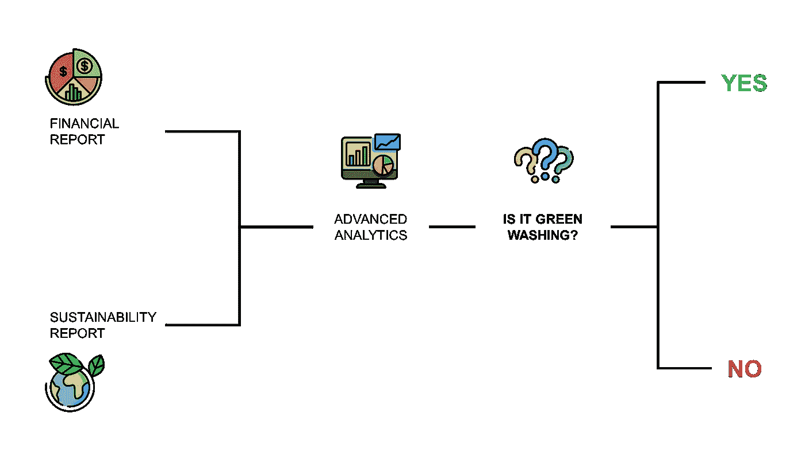
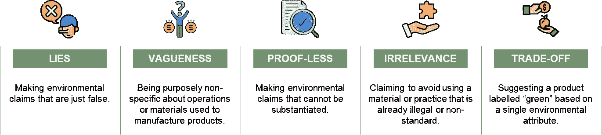
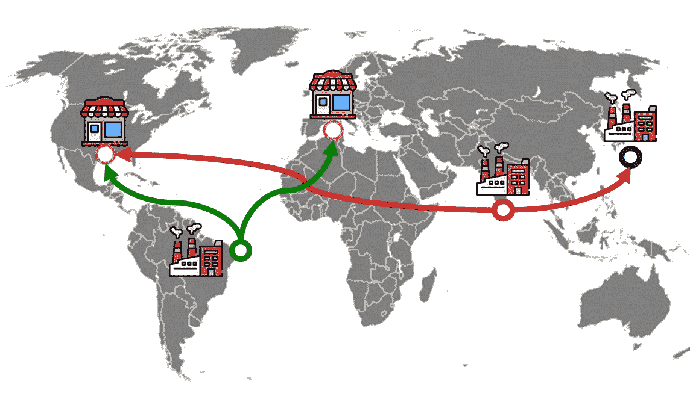
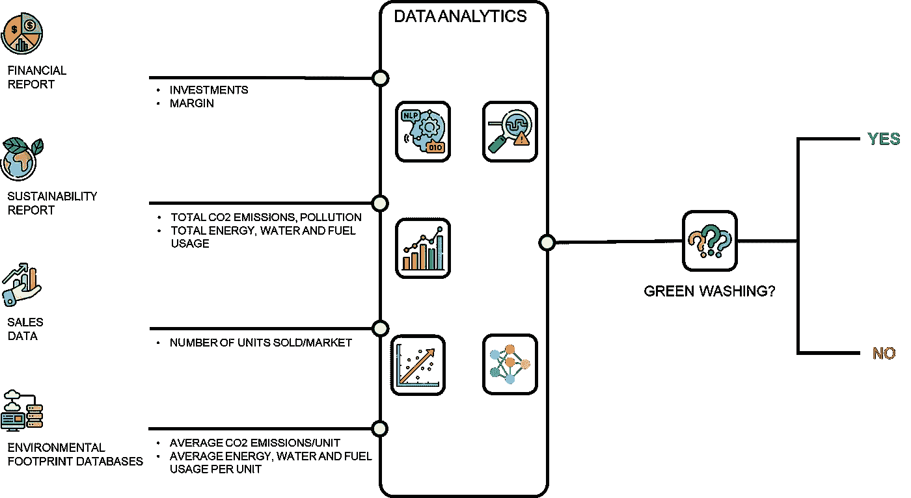
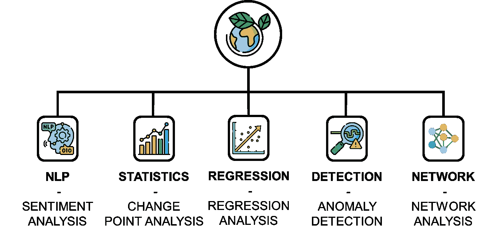
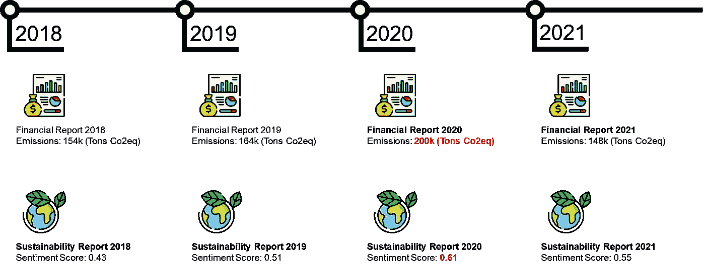
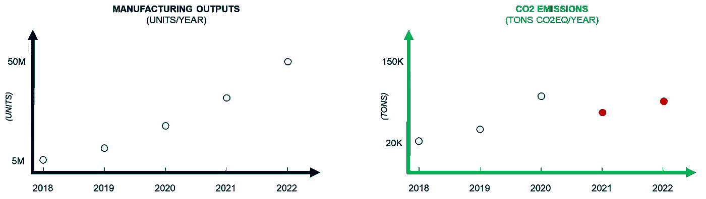
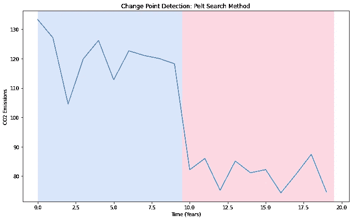

# 什么是绿色洗涤，我们如何利用分析检测它

> 原文：[`towardsdatascience.com/what-is-greenwashing-and-how-to-use-analytics-to-detect-it-15b8118031?source=collection_archive---------2-----------------------#2023-08-10`](https://towardsdatascience.com/what-is-greenwashing-and-how-to-use-analytics-to-detect-it-15b8118031?source=collection_archive---------2-----------------------#2023-08-10)

## 探索数据分析如何帮助我们检测和防止绿色洗涤，以促进真正的可持续发展。

[](https://s-saci95.medium.com/?source=post_page-----15b8118031--------------------------------)[](https://towardsdatascience.com/?source=post_page-----15b8118031--------------------------------) [Samir Saci](https://s-saci95.medium.com/?source=post_page-----15b8118031--------------------------------)

·

[关注](https://medium.com/m/signin?actionUrl=https%3A%2F%2Fmedium.com%2F_%2Fsubscribe%2Fuser%2Fbb0f26d52754&operation=register&redirect=https%3A%2F%2Ftowardsdatascience.com%2Fwhat-is-greenwashing-and-how-to-use-analytics-to-detect-it-15b8118031&user=Samir+Saci&userId=bb0f26d52754&source=post_page-bb0f26d52754----15b8118031---------------------post_header-----------) 发表在 [Towards Data Science](https://towardsdatascience.com/?source=post_page-----15b8118031--------------------------------) ·9 分钟阅读·2023 年 8 月 10 日[](https://medium.com/m/signin?actionUrl=https%3A%2F%2Fmedium.com%2F_%2Fvote%2Ftowards-data-science%2F15b8118031&operation=register&redirect=https%3A%2F%2Ftowardsdatascience.com%2Fwhat-is-greenwashing-and-how-to-use-analytics-to-detect-it-15b8118031&user=Samir+Saci&userId=bb0f26d52754&source=-----15b8118031---------------------clap_footer-----------)

--

[](https://medium.com/m/signin?actionUrl=https%3A%2F%2Fmedium.com%2F_%2Fbookmark%2Fp%2F15b8118031&operation=register&redirect=https%3A%2F%2Ftowardsdatascience.com%2Fwhat-is-greenwashing-and-how-to-use-analytics-to-detect-it-15b8118031&source=-----15b8118031---------------------bookmark_footer-----------)

使用数据检测绿色洗涤 — （图片由作者提供）

绿色洗涤是指对产品或服务的环境益处做出误导性声明，以传达虚假的可持续性形象。

> 我们如何利用分析帮助世界对抗绿色洗涤？

这种修饰或掩盖虚假信息的行为已经成为一个普遍的挑战，因为公司们寻求环保意识强的消费者的关注。



绿色洗涤的五大罪恶 — （图片由作者提供）

在这篇文章中，我们将深入探讨绿色洗涤及其表现形式。

我们将通过案例研究展示如何使用数据分析来检测和防止这些不道德的做法。

💌 免费直接发送到你的收件箱的新文章：[Newsletter](https://www.samirsaci.com/#/portal/signup)

📘 你的供应链分析完整指南：[Analytics Cheat Sheet](https://www.notion.so/Supply-Chain-Analytics-Cheat-Sheet-d449e3d53cfc45978aa889d3ef40f559)

```py
Summary
I. Understanding Greenwashing
1\. What is Greenwashing?
2\. Examples of Greenwashing
3\. Greenwashing x Data Analytics
II. Data Analytics for Greenwashing Detection
1\. The difficult task of detection
2\. Natural Language Processing (NLP)
3\. Change Point Analysis
4\. Regression Analysis
5\. Network Analysis
III. Conclusion
```

# 理解绿色洗涤

我在进行第一次 supply chain sustainability project.时发现了绿色洗涤。

作为供应链解决方案经理，我的任务是估算客户物流操作的环境足迹。

> 一家销售一次性塑料产品的公司怎么可能声称自己是碳中和的？

看到一些竞争对手的主张令人惊讶，因为他们生产和销售的产品类似。

这篇文章旨在展示分析工具如何帮助你检测这种虚假声明。

## 绿色洗涤是什么？

绿色洗涤是“绿色”和“粉饰”的合成词。

组织利用这种不诚实的做法来制造虚假的环保责任印象。

目标是利用客户和投资者对环保产品日益增长的需求。

最常见的绿色洗涤形式包括，

+   **模糊性**：使用没有明确定义或证据的未定义术语，如**“环保”**或**“全自然”**。

    *例如，一家公司将产品标记为“100%天然”，却没有透露这些天然材料是以不可持续的方式获取的。*

+   **无关性**：突出显示一种对产品环境影响不重要或无关的环保特性。

    *例如，一家公司强调其产品“无 CFC”，而氯氟烃已被禁止了几十年。*

+   **隐性权衡**：宣传产品的一个环保方面，同时忽视其他重大影响。

    *例如，一家纸业公司宣传其使用回收纸，但没有提到生产和物流过程中的能源消耗和碳排放。*


绿色洗涤是什么？ — (图片来源：作者)

当你看到广告宣传**天然**来源的**回收** T 恤时，请考虑：

+   获取这些“天然原材料”所使用的能源、电力和水的数量。

+   回收过程产生的额外二氧化碳排放和废物。

通过生命周期评估 (LCA)，你可以使用**数据驱动**的方法来评估这些影响，**通过考虑整个产品生命周期并避免**这种陷阱。


你的“100%天然”回收 T 恤的生命周期评估 — (图片来源：作者)

这个想法是估算特定产品或服务的采购、生产和使用的环境影响。

这需要使用商业智能工具从多个来源收集和处理数据。

**💡 更多详情，**

[](/what-is-a-life-cycle-assessment-lca-e32a5078483a?source=post_page-----15b8118031--------------------------------) ## 什么是生命周期评估？LCA

### 了解生命周期评估如何帮助企业评估产品在整个生命周期中的环境影响……

towardsdatascience.com

> 让我们分析一些实际的例子。

## 绿色洗白的例子

几个引人注目的案件将绿色洗白问题推到了风口浪尖。

+   一家大型汽车制造商被发现使用软件在其标榜为“环保”的车辆中作弊排放测试。

+   一家著名的水公司将其产品宣传为“碳负”而未承认从斐济岛运输瓶装水到全球市场的环境成本。

第二种情况可以通过基本的供应链分析和**公开可用的数据**轻松**揭穿**。



供应链流动分析 — （图片来源：作者）

**如何？**

1.  使用财务报告估算市场销售量

1.  使用温室气体协议计算每瓶的排放量，从制造工厂到市场

1.  将结果与公司发布的图表进行比较

**💡 有关如何使用分析来估算 CO2 排放的更多细节**

[](/supply-chain-sustainability-reporting-with-python-161c1f63f267?source=post_page-----15b8118031--------------------------------) ## 使用 Python 进行供应链可持续性报告

### 建立一个关于配送网络 CO2 排放的 ESG 报告的 4 个步骤。学习如何测量和减少你的碳……

towardsdatascience.com

> 除了报告之外，数据分析如何帮助我们检测这种欺诈行为？

## 绿色洗白与数据分析

了解绿色洗白的各种形式和影响，对于实施主动措施应对这一问题至关重要。

虽然监管机构和有意识的消费者在这场斗争中发挥了重要作用，但数据分析可以作为额外的推动力来自动化欺诈检测。



使用数据分析检测绿色洗白 — （图片来源：作者）

这个想法是利用……

+   **公开可用的数据**：财务和可持续性报告、足迹数据库、社交媒体

+   **高级分析模型**，包括 NLP、预测或统计模型以检测欺诈行为

以下部分将探讨如何使用这些工具来促进一个更透明和可持续的企业环境。

# 数据分析用于检测绿色洗白

## 检测的艰巨任务

鉴别绿色洗牌是一个复杂的任务，鉴于其表现的复杂性和可用信息的庞大量。

数据分析可以提供强大的工具，用于过滤大型数据集，识别模式和异常，以及提取有价值的见解。



数据分析用于绿色洗牌检测 — （作者提供的图像）

在接下来的章节中，我们将通过潜在欺诈的例子来探讨如何使用这些解决方案。

> 让我们开始文本分析。

## 自然语言处理（NLP）

NLP 在绿色洗牌检测中的主要应用是 **情感分析**。

让我们考虑主要石油公司的例子。

他们定期发布可持续性报告和新闻稿，突出他们对环境保护的承诺。

我们手头的数据包括这些在其网站上的 PDF 文档。



报告中的情感分析与二氧化碳排放 — （作者提供的图像）

一个 NLP 情感分析模型可以评估这些陈述背后的情感。

**💡 如何检测绿色洗牌？**

如果这些陈述传达了过于乐观的情感，而这些情感在实际环境表现指标中没有反映出来，这可能是绿色洗牌的迹象。

例如，上述例子

+   2020 年二氧化碳总排放量激增：**+26k 吨 CO2eq**

+   然而，情感评分却不断增加

实际的 [可持续性表现](https://www.samirsaci.com/tag/sustainability/) 和报告中出售的叙述之间存在矛盾。

> 那么，关于可持续性指标呢？我们可以利用它们的趋势。

## 变点分析

变点分析识别数据序列中统计属性变化的点。

例如，一家主要的汽车制造商报告了二氧化碳排放量的突然减少。



生产输出与排放的相关性潜在异常示例 — （作者提供的图像）

可用数据将包括公司报告的排放量和生产输出的时间序列。

**💡 如何检测绿色洗牌？** 变点分析可以检测这些减少是否与

+   合法且持续的可持续性努力

+   临时情况下这可能暗示绿色洗牌

我使用了一个二氧化碳排放虚拟数据集，并应用了 Python 库 [ruptures](https://centre-borelli.github.io/ruptures-docs/)：



变点检测示例 — （作者提供的图像）

它检测到了第 9 年的重大变化，我们应该对此进行调查。

这是一个初步评估，减少可能是由于实际举措的影响。

你可以在可持续性报告中共享的详细举措中验证这一点。

**💡 查看代码以获取此视觉效果，**

+   变点分析，[GitHub](https://github.com/samirsaci/greenwashing)

> 你听说过相关性吗？

## 回归分析

回归分析可以帮助确定不同变量之间的关系。

例如，一家主要时尚品牌报告了可持续发展支出（欧元）和废料生产水平（吨）。

**💡 如何检测绿色洗刷？** 回归模型可以识别可持续发展支出增加是否导致废料生产的相应减少。

如果没有，这可能是绿色洗刷的迹象，需进行深入调查

+   这**不是一个单变量问题，**因为废料可能受到许多其他参数的影响*(产品设计、原材料等)*

+   **以产品为中心的方法**（LCA）更适合追踪支出如何影响整个供应链的环境足迹

> 我们能否将公司与污染的供应商联系起来？

## 网络分析

网络分析有助于理解网络中实体之间的关系。

一家电子行业公司可能声称其产品来自可持续和道德的供应商。

**💡 如何检测绿色洗刷？** 数据应包括公司的供应商网络和第三方对供应商实践的报告。


使用 Python 的 Networkx 进行网络分析 — （图片来源：作者）

使用网络分析，我们可以审查供应商的可持续性关键绩效指标（例如 ESG 评分）及其连接。

如果网络中的节点有可疑的可持续性实践，这可能暗示潜在的绿色洗刷。

**💡 了解如何使用 Python 实现网络图的更多细节**

[](/transportation-network-analysis-with-graph-theory-55eceb7e4de4?source=post_page-----15b8118031--------------------------------) ## 交通网络分析与图论

### 利用图论来优化零售公司的公路运输网络

towardsdatascience.com

这让你初步了解如何利用先进分析自动检测绿色洗刷和欺诈，使用公开数据。

# 结论

## 绿色洗刷的终结？

随着我们考虑未来的 ESG 法规，绿色洗刷与数据分析之间的联系将显著加深。


报告类别示例 — （图片来源：作者）

这份非财务报告由组织使用，向利益相关者和金融机构传达其环境绩效（E）、社会责任（S）和治理结构的**强度（G）**。

> 为什么这很重要？

随着客户和投资者对可持续性认识的提高，公司将发现隐瞒模糊或误导性可持续性声明的风险加大。

因此，在一个日益数据驱动的世界里，绿色洗涤将面临重大挑战。

**💡 了解更多关于 ESG 报告的详细信息，**

[](/what-is-esg-reporting-d610535eed9c?source=post_page-----15b8118031--------------------------------) ## 什么是 ESG 报告？

### 利用数据分析进行全面且有效的公司环境、社会和治理报告

[towardsdatascience.com

> 我们能否利用数据实际支持绿色转型？

## 足迹减少的数据分析

企业可以利用先进的分析技术设计和实施具有实际效果的举措，而不是制造虚假的声明。

例如，**可持续供应链优化**是一种数据驱动的方法，结合了**成本减少**和**足迹减少**。


可持续供应链优化 — （图像来源：作者）

让我们假设你的公司正在全球范围内生产和销售商品。

> 工厂和配送中心应该设在哪里？

这是一个考虑了以下因素的优化模型，

+   **每个市场位置的需求**（单位/每月）

+   所有**潜在的制造地点**及其生产成本、环境足迹（CO2，资源）、ESG 评分

+   **环境足迹每单位的约束**，社会和治理评分

> 最可持续（且经济上可行）的组合是什么？

+   如果你想专注于盈利，如何最小化成本

    *我们能尊重环境目标吗？*

+   如果你想专注于可持续性，如何最小化 CO2 排放

    *我们能保持盈利水平吗？*

**💡 了解更多关于此应用程序的信息，**

[](/create-a-sustainable-supply-chain-optimization-web-app-20599b98cab6?source=post_page-----15b8118031--------------------------------) ## 创建可持续供应链优化网页应用

### 帮助你的组织将可持续采购与供应链优化相结合，以减少成本和环境影响……

[towardsdatascience.com

💡 在 Medium 上关注我，获取更多关于🏭供应链分析、🌳可持续性和🕜生产力的文章。

# 关于我

让我们在[Linkedin](https://www.linkedin.com/in/samir-saci/)和[Twitter](https://twitter.com/Samir_Saci_)上联系。我是一个利用数据分析改善物流运营和降低成本的供应链工程师。

如果你对数据分析和供应链感兴趣，请查看我的网站。

[](https://samirsaci.com/?source=post_page-----15b8118031--------------------------------) [## Samir Saci | 数据科学与生产力

### 一个专注于数据科学、个人生产力、自动化、运筹学和可持续发展的技术博客

[samirsaci.com](https://samirsaci.com/?source=post_page-----15b8118031--------------------------------)

# 参考文献

+   使用 Python 进行供应链可持续性报告，[Samir Saci](https://medium.com/u/bb0f26d52754?source=post_page-----15b8118031--------------------------------)，Towards Data Science

+   使用图论进行交通网络分析，[Samir Saci](https://medium.com/u/bb0f26d52754?source=post_page-----15b8118031--------------------------------)，Towards Data Science

+   创建可持续供应链优化的网页应用，[Samir Saci](https://medium.com/u/bb0f26d52754?source=post_page-----15b8118031--------------------------------)，Towards Data Science
