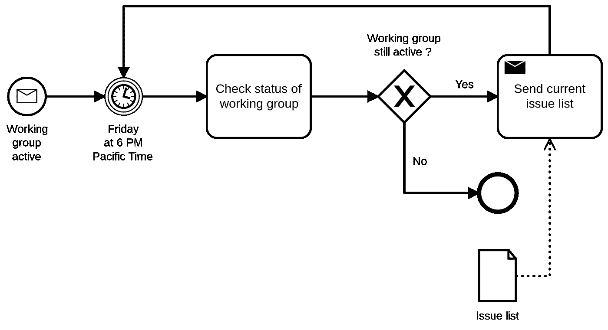

# 什么是智能过程自动化（IPA）？

> 原文：[`towardsdatascience.com/what-is-intelligent-process-automation-ipa-547d60df0590`](https://towardsdatascience.com/what-is-intelligent-process-automation-ipa-547d60df0590)

## 人工智能正在改变许多行业，现在也在自动化工具中改变游戏规则。

 [Patrick Meyer](https://pemey.medium.com/?source=post_page-----547d60df0590--------------------------------)

·发表于[Towards Data Science](https://towardsdatascience.com/?source=post_page-----547d60df0590--------------------------------) ·阅读时间 9 分钟·2023 年 2 月 11 日

--

图片来源：[克莱顿·卡尔迪纳利](https://unsplash.com/es/@clayton_cardinalli?utm_source=medium&utm_medium=referral)于[Unsplash](https://unsplash.com/?utm_source=medium&utm_medium=referral)

# 介绍

企业不能再忽视竞争对手和客户的数字化转型。这种数字化意味着掌握自己的流程及其优化状态。此外，人工智能是改变公司运营模式及其向客户提供产品和服务方式的新革命。

将不同的自动化技术与业务服务结合起来，再加上 AI 技术，已成为一种迫切的需求。IPA 解决方案的供应商已完全理解这一问题，因为他们在解决方案中整合了越来越多的 AI。为了理解通过 AI 实现自动化的价值，了解每种技术在自动化过程管道中的贡献至关重要。

# 内容

1.  一般的智能过程自动化（IPA）

1.  任务与过程挖掘（TM/PM）

1.  机器人过程自动化（RPA）

1.  业务流程管理（BPM）

1.  智能自动化（IA）

1.  智能虚拟助手（IVA）

1.  智能文档处理（IDP）

1.  一个例子！

1.  最终…

# 1\. 一般的智能过程自动化（IPA）

Quadrant Knowledge Solutions 将“智能过程自动化（IPA）定义为将机器人过程自动化（RPA）与过程挖掘、人工智能（AI）、智能字符识别（ICR）、光学字符识别（OCR）和高级分析等技术相结合的解决方案和服务。”

IPA 解决方案和服务也被称为超自动化、智能自动化和数字过程自动化（DPA）。

他们利用 RPA、BPM、人工智能、OCR、ICR 以及任务和过程挖掘，通过端到端自动化业务流程来改善业务运营。

IPA 的解决方案和服务通过能够自主学习和利用分析工具收集的上下文信息在正确的时间采取行动，为客户提供价值。

IPA 还提供了定制的数据挖掘、内容处理和决策模型组件，以实现更智能的业务流程。

# 2\. 任务与过程挖掘（TM/PM）

过程挖掘是一种方法，通过分析信息系统（ERP、CRM 等）生成的事件日志，来实现业务流程的发现、监控和优化。

任务挖掘允许执行与过程挖掘相同的操作，但通过记录任务在用户工作站上的执行，特别是借助人工智能（AI）。

这些技术将使公司流程和操作规则的自动发现成为可能。

其优点包括路径的自动化规范化、过程监控以及实施数字双胞胎的帮助。

这些任务挖掘技术可以通过启用用户操作的发现、规范化和监控，作为 RPA 的良好引导。人工智能在这一层面广泛应用于识别用户操作的元素。人工智能驱动的分析技术也被用来预测自动识别的改进工作流机会的时间和成本影响。

这些解决方案通过引用如用户名、文件夹 ID 等恒定标识符来收集数据（事件日志或屏幕截图）。然后分析这些数据，以生成关于用户行为的报告，并帮助生成过程图。

探索的用例：

+   过程发现，

+   合规检查，

+   过程改进，

+   变更模拟，

+   监督。

# 3\. 机器人过程自动化（RPA）

机器人过程自动化是一种用于自动化用户重复性活动的技术。

这些技术是非侵入性的，通常通过软件应用程序的用户界面进行交互。

RPA 场景范围从创建一个自动响应电子邮件，到部署数千个机器人，每个机器人都被编程以在一个或多个系统上自动化工作。

适用于 RPA 的过程包括那些涉及大量重复人工处理的任务，如分类电子邮件、下载附件、将文件中的值输入到业务应用程序中等。

适用性：

+   现有流程，

+   体积测量与持续时间，

+   手动输入，

+   标准与例外，

+   时间段。

RPA 解决方案通常配备图形工作室，用于记录用户在其工作站上的工作，录制过程的编辑器，以及用于启动和监督机器人的平台。

RPA 解决方案具有额外功能：规则引擎、文档理解（发票、订单等）、IDP 和智能自动化工具，如图像识别、电子邮件分类、语言检测等。

成熟的 RPA 解决方案已经发展成完整的 IPA 平台。

# 4\. 业务流程管理（BPM）

业务流程管理（BPM）提供了业务流程的概述：它们的组织及其相互作用，以尽可能优化和自动化这些流程。

BPM 通常与 BPMN 形式主义以及通过 BAM 监控流程相关联。

BPMN（业务流程模型和符号）是一种用于描述组织价值链和业务活动的业务流程建模方法，以图形化形式呈现。

BPMN 提供了一种所有自动化利益相关者都能理解的符号：业务分析师、设计师和负责实施自动化流程的开发人员。

业务活动监控（BAM）涉及与业务流程相关的数据的实时获取、汇总、分析和展示。

BAM 仪表板显示关键绩效指标，这些指标总结了关键业务活动的健康状况。

BPM 平台包括：

+   BPMN 和/或规则建模能力，

+   用于管理建模元数据的流程库，

+   流程执行引擎，

+   状态和/或规则管理引擎。

一个用于采购请求业务流程的 BPMN 图示，显示采购和会计部门之间的流程

BPM 允许信息传输自动化，并促进采购部门对请求的批准。

一种具有正常流程的业务流程模型和符号的示例（来源：维基百科 - [Mikelo Skarabo](https://commons.wikimedia.org/w/index.php?title=User%3AMikelo_Skarabo&action=edit&redlink=1) — CC BY6SA 4.0）

与 RPA 供应商类似，AI 驱动的工具现在也成为 BPM 解决方案的一部分。

# **5\. 智能自动化（IA）**

智能自动化（IA），有时也称为认知自动化，是利用机器学习（ML）技术和自然语言处理（NLP）技术来简化和调整组织中的决策过程。

机器学习和复杂算法可以用来分析结构化和非结构化数据。

这使得公司能够开发知识库并从现有数据中进行预测。

算法解释性和可持续性（绿色计算）的概念在基于 AI 的方法中需要考虑，特别是在 AI 涉及关键系统时。

使用案例的示例：

+   故障预测，

+   焊接视觉分析，

+   下一步最佳行动的推荐，

+   基于文档的维护协助，

+   自动回复电子邮件，

+   简历摘要，

+   应聘者通信，

+   需求预测，

+   诊断协助，

+   欺诈检测，

+   路径优化。

# 6\. 智能虚拟助手（IVA）

智能虚拟助手（IVA）是直接与用户互动的计算机程序。在这个类别中，有对话助手，它们是设计用于通过自然对话界面（如语音或文本）实时与用户互动的计算机系统。这些解决方案通常被称为聊天机器人。IVA 使用由机器学习和自然语言处理技术支持的 NLP 技术。目前讨论最多的对话助手是来自 OpenAI 的 ChatGPT。

对话助手可以用于执行各种任务，如回答问题、搜索互联网、安排预约、控制连接设备等。

对话助手通常基于不同的技术，如语音识别、语音生成、自然语言理解、神经网络和深度学习。

尤其是，它们可以在不同的渠道上部署：

+   移动应用程序，

+   社交网络，

+   网站，

+   连接盒，

+   接待终端，

+   元宇宙。

对话助手越来越多地用于改善用户体验、自动化重复的支持任务以及为用户提供自助服务解决方案。

到目前为止，有数百种解决方案允许用户配置自己的助手。

在互联网环境中，用户界面已变得相对标准化，方便用户访问。

对话助手的应用场景不仅限于客户服务，还包括人力资源支持、IT 帮助台、销售、市场营销以及供应链/采购等领域……

# 7\. 智能文档处理（IDP）

智能文档处理解决方案是任何从文档中捕获数据、对数据进行分类并提取相关数据以进行进一步处理的产品或软件解决方案。

文档的示例包括：

+   电子邮件，

+   商务文档，

+   合同，

+   发票，

+   订单，

+   简历……

处理基于计算机视觉、光学字符识别和自然语言处理。处理步骤包括对捕获的图像进行预处理（图像校正）、对文档进行分类、提取数据和验证提取的数据。处理结束后，产品或软件解决方案会返回结构化数据，这些数据可以被计算机程序、RPA 脚本、自动化过程等轻松处理。

处理可能需要人工干预来验证或纠正提取的信息。这种处理被称为“人机协作”。

# 8\. 一个示例！

照片由 [Alex Kotliarskyi](https://unsplash.com/@frantic?utm_source=medium&utm_medium=referral) 提供，来源于 [Unsplash](https://unsplash.com/?utm_source=medium&utm_medium=referral)

Chapati 每天接收数千封电子邮件。公司中有几个人负责分类这些邮件，处理订单，然后回答关于某些先前订单状态或产品的问题。这些员工会处理每封包含订单的电子邮件，打开完成的扫描表单，根据指定产品的列表进行检查，在公司的各种工具中提出请求，然后回应请求者。一些请求需要验证，员工会联系决策者以获得各种确认。

这家公司希望减轻员工的繁琐数据录入工作，以便他们能从事更有价值的活动，如帮助客户。因此，Chapati 公司启动了一个转型项目。由于他并未掌控各个流程的所有阶段，转型经理通过在负责分类和答复的工作站上放置代理，使用自动任务探索。生成的地图，利用任务挖掘（TM），随后被转化为包含活动和关联序列的图形表示（BPM）。由于公司内部应用程序没有 API，实施了 RPA 脚本来模拟员工的输入工作。根据订单产品的特征，系统自动向决策者请求验证（“人机互动”）。

在业务工作流中，使用电子邮件连接器来检索请求，基于 AI 的子程序用于对这些请求进行分类（请求分类）。根据排序结果，提取订单，并使用智能文档处理（IDP）提取扫描文档中的信息。最后，智能虚拟助手（IVA）自动回答客户的剩余问题。

原本的分类员工现在进行客户咨询操作，从而增强了他们对公司内部操作和产品知识的了解。

# 9\. 最后…

已经无法忽视消费者的数字化转型，并由此扩展到企业。对于公司而言，这种转型意味着对流程及其优化的控制。人工智能是当前正在深刻改变运营模式和产品及服务交付方式的革命。各种技术的结合，服务于公司，已经成为一种至关重要的需求。

然而，首先定义公司的目标是重要的：收入、成本和风险。这也需要对公司的流程、结构、优化水平以及在任何优化之前需要做出的修正有透彻的了解。

IPA 的贡献在于提供一个组织和技术框架，以汇集所有自动化技术来服务于业务流程。

# 结论

在考虑自动化时，重要的是首先了解业务流程，将这些流程分解为活动，然后确定哪些 IPA 组件最合适。

自动化解决方案提供商的格局正在发生变化，它们正逐渐成为 AI 丰富的套件。它们越来越多地融入基于机器学习的方法的模型。因此，不再仅仅以 RPA、BPM 等术语来思考，而是要理解 AI 的贡献以及这些技术带来的偏见。

# 要深入了解

 [## 对话 AI：2023 年的 7 个趋势和预测

### 我提出了七个关于对话助手市场演变的新趋势和预测（通常称为…）。

pub.towardsai.net](https://pub.towardsai.net/conversational-ai-7-trends-and-predictions-for-2023-9a644becb90b?source=post_page-----547d60df0590--------------------------------)  ## 14 个选择聊天机器人解决方案的标准

### 选择自然语言对话助手解决方案时，首先要考虑的标准是什么？

towardsdatascience.com  ## 2020 年全球聊天机器人解决方案市场概况

### 来自我对对话助手市场的积极观察，我给出了一些统计数据和信息…

towardsdatascience.com  [## 面向构建者的对话 AI：4 个复杂度等级

### 当你想要构建一个对话 AI 解决方案时，重要的是要记住对话通常遵循…

ai.plainenglish.io](https://ai.plainenglish.io/conversational-ai-for-builders-the-4-levels-of-complexity-scale-4eb482a862d9?source=post_page-----547d60df0590--------------------------------)
