# 什么是学习排名：学习排名方法的初学者指南

> 原文：[`towardsdatascience.com/what-is-learning-to-rank-a-beginners-guide-to-learning-to-rank-methods-23bbb99ef38c`](https://towardsdatascience.com/what-is-learning-to-rank-a-beginners-guide-to-learning-to-rank-methods-23bbb99ef38c)

## 关于如何处理机器学习中的 LTR 问题的指南

 [Ransaka Ravihara](https://ransakaravihara.medium.com/?source=post_page-----23bbb99ef38c--------------------------------)

·发表于 [Towards Data Science](https://towardsdatascience.com/?source=post_page-----23bbb99ef38c--------------------------------) ·7 分钟阅读·2023 年 1 月 17 日

--

图片来源于 Possessed Photography，来自 Unsplash

## 介绍

本文将讨论学习排名究竟是什么。在深入了解内部工作之前，让我们快速了解一下理解所需的基本概念。

首先，让我们探究学习排名的核心直觉。在机器学习中，学习排名（LTR）属于监督学习，我们需要历史数据集来训练模型。但当我开始了解学习排名的概念时，我的第一个困惑是如何区分传统机器学习和 LTR。因为如果我们构建分类或回归模型，我们的因变量和自变量都很简单且更有意义。如果我们需要预测给定客户的贷款违约情况，我们必须将特定的特征向量输入到模型学习的函数 *f(x)* 中。它会返回客户违约的单一值或类别概率。但在学习排名模型中，这完全不同且令人困惑。

让我们举个简单的例子。

用户 *A* 访问一个网站并输入查询 *q*。在这种情况下，我们的系统返回了一些文档，换句话说，就是搜索结果，如下所示。

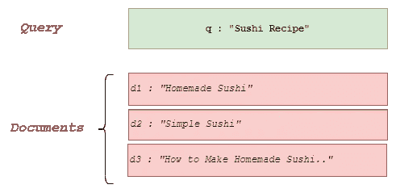

图片作者

如果我们有一个好的排序模型，这些结果的相关性*(r)*应该是 *r(d1) > r(d2) > r(d3)*。在幕后，我们的模型应该为每个与该查询相关的文档返回相关性分数。因此，我们的模型应该学习一个函数，该函数以查询和文档作为参数，并为特定的查询-文档对生成相关性分数。然后我们可以进行一些计算，并以这种方式对文档进行排序，使得高度相关的文档获得更高的排名。

## 逐点排序

让我们讨论一下实现这一点的一种方法。首先，我们需要数据。为了简化，假设一个假设场景，其中我们有两个查询，*q1, q2*，以及它们各自的文档列表 [*d1,d2,d3], [d5,d6,d7]*。

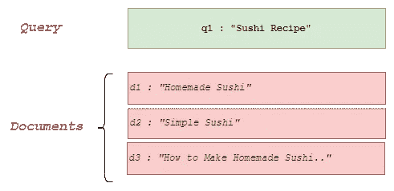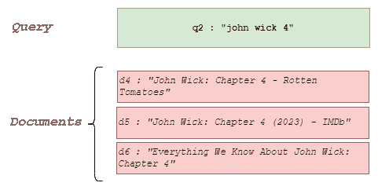

作者提供的图像

通常，我们知道 *d1,d2* 和 *d3* 文档对 *q1* 是相关的，但对 *q2* 不相关，反之亦然。因此我们可以按如下方式填充样本。

*示例 1: d1,q1; 标签 :1

示例 2: d2,q1; 标签 :1

示例 3: d3,q1; 标签 :1

示例 4: d4,q2; 标签 :1

示例 5: d5,q2; 标签 :1

示例 6: d6,q2; 标签 :1*

如果你查看上述数据，这个问题现在被简化为一个传统的分类/回归问题，其中输入（*查询*和*文档*对）与*标签*之间存在一对一的映射关系。

> 附加信息
> 
> 要使用机器学习解决这个问题，你可以对查询数据和文档数据进行特征工程，然后将其输入到模型中，最终得到预测。一些理想且简单的特征工程是获取 john 和 sushi 在查询和文档中出现的次数。

信不信由你，你刚刚学会了一种叫做***逐点排序***的学习排序方法。

> 逐点排序是找到一个函数，该函数在给定查询的情况下返回每个文档的相关性。之所以称为逐点排序，是因为每个文档都根据真实目标值独立评分，就像传统的回归和分类任务一样。

让我们讨论一下逐点排序方法的优缺点。一方面，它的优点是简单。但这种简单性也带来了显著的缺陷，例如，

1.  每个实例被视为一个孤立的点。

1.  显式的逐点标签是创建训练数据集所必需的。

为了克服这些挑战，我们可以使用***对偶排序***方法。

## 对偶排序

在这里，目标是定义一个排序函数，以根据给定的查询对每个文档进行评分。然后将文档按照这些分数的降序排列，表示文档与查询的相对相关性。

> 在学习过程中，提供多个查询，每个查询都有一对相关文档。使用这些训练数据创建一个排序函数，以便模型可以预测未来查询的相关文档。

让我们以之前的*sushi recipe* 示例为例。与*点对点排序*方法不同，我们现在考虑每个查询的两个文档。例如，我们知道*d1, d2* 和*d3* 与*q1*相关。在这种情况下，所有可能的查询文档对应如下。

*示例 1: q1, (d1,d2)

示例 2: q1, (d1,d3)

示例 3: q1, (d2,d3)*

其中*(di,dj)*表示文档*i*和*j*的顺序。如果我们对文档*i*和*j* 应该如何排序有明确的标签，我们可以推导出*(di,dj)*的标签。假设文档*j*的相关性评分为 3（高度相关），而文档*i*的相关性评分为 0（较少相关），对于查询*q*。在我们的最佳排名中，文档*i* 应该排在文档*j* 之前。再次，这被简化为传统的分类任务。但不同于***点对点排序***，这种方法考虑了排名位置。

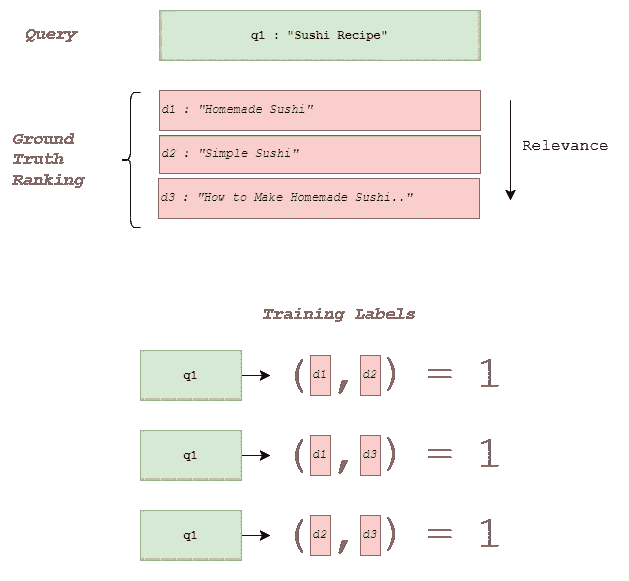

作者提供的图片

在 LightGBM 的 lambdarank 目标中使用的成对损失函数。使用 LightGBM 的 Python 库，我们可以用几行代码训练这种最先进的 LTR 方法。

由于我们可以将其简化为分类任务，因此可以使用已知的方法论。它还将文档顺序纳入模型中。这也有一些缺点。尽管学习考虑了文档对的顺序，但目标并没有明确设置为对文档进行排序；相反，它试图减少文档对的分类错误。此外，当数据集中包含大量文档和查询对时，训练可能非常昂贵。文档的数量因查询而异，这导致模型对具有大量文档对的查询存在偏差。

## 列表排序

研究人员引入了一种新颖的列表排序方法，以克服 LTR 中的一些显著缺点。

> 在这种方法中，我们考虑的是文档的排序列表及其相关性标签，而不是文档对。

为了获得每个查询中文档的相关性标签，我们可以使用人工标注者或某个文档收到的点击次数。

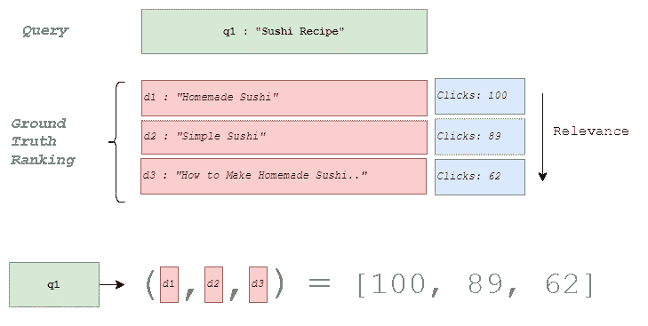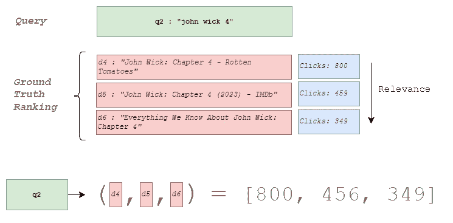

作者提供的图片

在学习阶段，我们必须根据查询和文档对添加特征。如果*i* 代表查询的索引，*j* 代表文档的索引，我们可以定义特征向量如下。

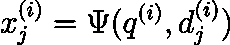

作者提供的图片

有了这个，我们可以定义每个文档-查询对的特征以及真实标签。

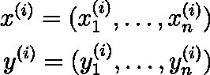

作者提供的图片

最后，我们可以将训练实例表示为，

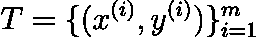

作者提供的图片

其中 *m* 是数据集中查询的数量。最后，创建一个排名函数 *f*，它为每个特征向量 *x_ij* 输出一个分数。然后获取一个分数列表 *z_i*，

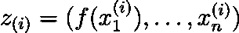

图片来源：作者

学习的目标是最小化相对于训练数据的总损失。当应用排名时，我们可以使用训练好的函数根据特征向量给新文档分配分数。然后按分数的降序对文档进行排序。

得益于这一学习过程，它可以学习列表中项目之间的关系，例如共现或依赖关系。凭借这一优点，它需要大量标记数据来学习列表中项目之间的关系；因此，训练和优化可能会计算量大。此外，listwise 方法在新领域或标记数据稀缺的细分领域中可能存在问题。

让我们总结一下我们在本文中学到的内容。

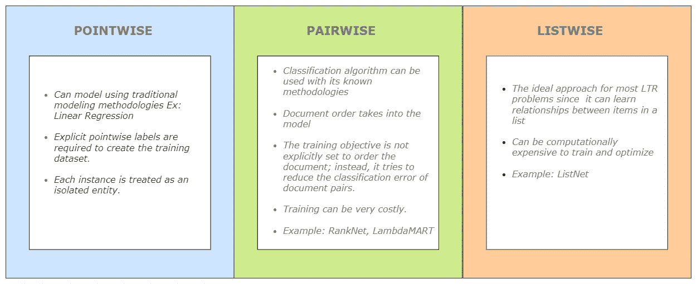

LTR 方法的比较 | 图片来源：作者

*系列中的下一篇文章：* [*如何评估学习排序模型*](https://medium.com/towards-data-science/how-to-evaluate-learning-to-rank-models-d12cadb99d47)

 ## 如何评估学习排序模型

### 关于如何评估机器学习中的 LTR 模型的实用指南

towardsdatascience.com

感谢阅读！

***参考文献：***

+   [*从 RankNet 到 LambdaRank 再到 LambdaMART*](https://www.microsoft.com/en-us/research/wp-content/uploads/2016/02/MSR-TR-2010-82.pdf)

+   [*从 RankNet 到 LambdaRank 再到 LambdaMART*](https://www.microsoft.com/en-us/research/wp-content/uploads/2016/02/tr-2007-40.pdf)
