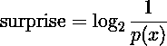
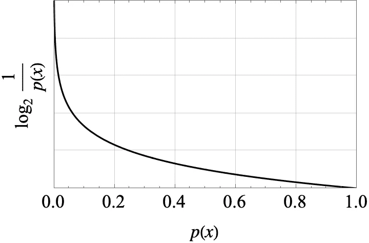
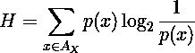
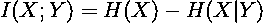
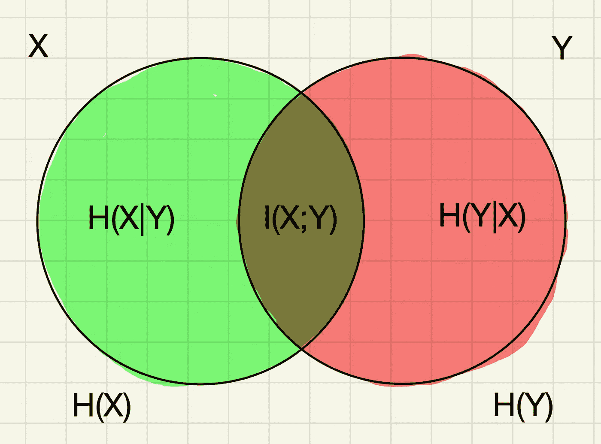
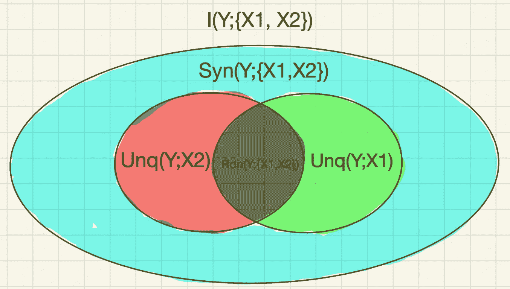
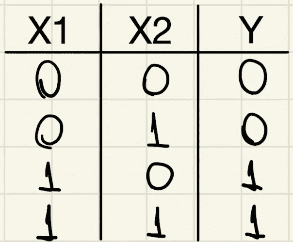
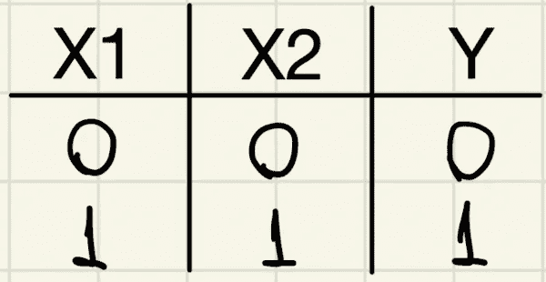
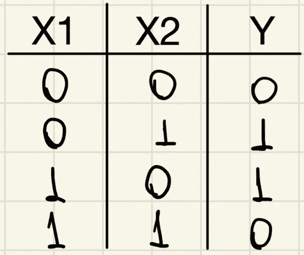

# 什么是部分信息分解及特征如何交互

> 原文：[`towardsdatascience.com/what-is-partial-information-decomposition-and-how-features-interact-a713456a1029?source=collection_archive---------3-----------------------#2023-12-08`](https://towardsdatascience.com/what-is-partial-information-decomposition-and-how-features-interact-a713456a1029?source=collection_archive---------3-----------------------#2023-12-08)

## 关于目标变量的信息如何在其多个特征中分布

[](https://medium.com/@rodrigopesilva?source=post_page-----a713456a1029--------------------------------)  [](https://towardsdatascience.com/?source=post_page-----a713456a1029--------------------------------)  [Rodrigo Silva](https://medium.com/@rodrigopesilva?source=post_page-----a713456a1029--------------------------------)

·

[关注](https://medium.com/m/signin?actionUrl=https%3A%2F%2Fmedium.com%2F_%2Fsubscribe%2Fuser%2F222e82adf972&operation=register&redirect=https%3A%2F%2Ftowardsdatascience.com%2Fwhat-is-partial-information-decomposition-and-how-features-interact-a713456a1029&user=Rodrigo+Silva&userId=222e82adf972&source=post_page-222e82adf972----a713456a1029---------------------post_header-----------) 发表在 [Towards Data Science](https://towardsdatascience.com/?source=post_page-----a713456a1029--------------------------------) · 10 分钟阅读 · 2023 年 12 月 8 日 []

--

 

图片来源：Alina Grubnyak，来自 [Unsplash](https://unsplash.com/photos/low-angle-photography-of-metal-structure-ZiQkhI7417A)。

当目标变量受到多个信息来源的影响时，理解每个来源对整体信息的贡献是至关重要的（虽然这并不简单）。

在这篇文章中，我将从惊讶的基本概念开始，然后解释熵如何由分布在随机变量上的平均惊讶量组成，这为我们定义互信息提供了条件。接下来，我将讨论在信息来源多个的情况下的部分信息分解。

# 惊讶与熵

也许从信息的角度定义熵最直观的方法是首先谈谈*惊讶*。惊讶的度量正如我们所期望的那样：不太可能发生的事件更令人惊讶，而更可能发生的事件则不那么令人惊讶。涵盖这些属性的数学定义如下：



从图 1 中的图表可以看出，这一定义与我们讨论的属性非常相关。当某些事件发生的概率很高（p 接近 1）时，惊讶度接近零。另一方面，如果事件发生的概率非常低，则其惊讶度会变得任意大。



图 1：惊讶的图示。作者提供的图像。

那么，熵与惊讶有什么关系呢？熵是随机变量所有值的平均惊讶。因此，如果我们有一个随机变量 X，且 X 的所有可能结果的集合称为 A_X（我们称之为 X 的“字母表”），那么熵 H 定义为：



很好。现在我们将熵与惊讶联系起来，可以理解熵的一个有用解释：

> 熵是无知的度量。

这怎么可能呢？我将通过一个简单的例子来解释。假设你需要参加一个期末物理考试。在我们目前所发展的语言中，我们可以将考试视为具有某些可能问题字母表的随机变量。现在假设两个场景：

1.  你为这次考试努力学习，你知道考试中会出现什么样的问题，所以*平均来说*，你不会对考试感到太惊讶。

1.  你没有认真学习，也不知道考试中会出现什么类型的问题，所以你在考试中的惊讶度会相当高。

所以，当你的平均惊讶度更大时，正好与信息较少的情况相吻合。

从技术角度来看，更尖峰的分布（例如某些值比其他值更可能发生的分布）具有比更分散的分布更低的熵，而后者中的每个事件发生的概率大致相同。这就是为什么我们说熵最高的分布是均匀分布，在这种分布中，任何值发生的机会都相同。

# 熵和（互）信息

现在我们已经建立了一个由随机变量描述的系统的平均惊讶度量（即熵），我们可以将熵与信息建立联系。

由于熵是对某个系统的无知的度量，它的缺乏代表着… *信息*。从这个意义上说，创建一个叫做互信息的度量是很自然的：它衡量的是当你知道系统的一些信息后，你获得的信息量。



这个定义是：取随机变量 X 的平均惊讶度，然后取随机变量 X 的平均惊讶度，但现在考虑我们知道另一个随机变量 Y 的结果。将前者减去后者，你就知道通过了解 Y，你从系统 X 中移除了多少 *无知*。

回到我们愚蠢的例子：假设你不知道考试中会问哪些问题，这就是 X。现在假设你的一个朋友在你考试前一周做了一个来自同一老师、关于同一科目的测试。他告诉你他的测试涵盖了哪些内容（这恰好是另一个随机变量 Y）。最可能的情况是，你对自己考试的无知减少了，这意味着你的测试 X 和你朋友的测试 Y 共享信息。

图 2 中有一个清晰易懂的维恩图，展示了两个变量 X 和 Y 之间的熵和共享信息的关系。



图 2：互信息方案。图像由作者提供，受到许多其他图像的启发。

# 但如果我们有多个信息来源呢？

到目前为止，我们只讨论了一个特征 X 和一个目标变量 Y 的情况，但显然这并不具有良好的普遍性。因此，现在设想我们有一个随机变量 Y（比如一个分类模型中的目标变量），我们想知道模型中每个特征 X_1, X_2, …, X_n 提供的信息量。可以说，只需计算 X_1 和 Y 之间的互信息，然后是 X_2 和 Y 之间的互信息，依此类推。然而，在现实世界中，我们的特征可能会相互作用并创建非平凡的关系，如果我们想要一个一致的框架，就必须考虑这些相互作用。

让我们考虑一个有两个输入信号 X_1 和 X_2 的情况，我们想要量化这两个特征和一个目标特征 Y 之间的互信息。也就是说，我们想要计算 I(Y; {X_1, X_2})。部分信息分解框架指出，这些信息可以分为四个非负成分：

1.  **Syn**(Y; {X_1, X_2})：两个特征的协同作用。这是两个特征共同提供的关于 Y 的信息量。

1.  **Rdn**(Y; {X_1, X_2})：两个特征的冗余度。这个量表示关于 Y 的信息，这些信息可以通过 X_1 或 X_2 单独解释。

1.  **Unq**(Y; X_1) 和 **Unq**(Y; X_2)：唯一信息，衡量的是只有 X_1 可以解释的关于 Y 的信息（对于 Unq(Y; X_1)）或只有 X_2 可以解释的关于 Y 的信息（对于 Unq(Y; X_2)）。

注意，只有**Unq**(Y; X_1)和**Unq**(Y; X_2)对应于特征之间没有交互的情景。因此，互信息**I**(Y; {X_1, X_2})可以分解为其四个组件：

**I**(Y; {X_1, X_2}) = **Syn**(Y; {X_1, X_2}) + **Rdn**(Y; {X_1, X_2}) + **Unq**(Y; X_1) + **Unq**(Y; X_2)

像之前一样，我们可以绘制一个漂亮的维恩图来总结这些量的依赖关系。



图 3：部分信息分解的维恩图。图像由作者提供，受[1]的强烈启发。

每个这些术语被称为*信息原子*。任何非原子信息都可以分解为原子部分，而原子部分不能再分解。

是威廉姆斯和比尔[1]首次提出了这一框架（并提出了一种计算部分信息的方法）。事实证明，计算这些量并不简单，值得专门写一篇文章。部分信息分解有不止一种测量方法，所有这些方法都遵循相同的过程：他们设想一种满足一系列理想特性并与我们期望的某个量称为“信息”的一致的测量方式。所有这些测量方法都有强项和弱项，它们在`dit`库中得到了很好的实现，并将在接下来的部分中简要介绍并用来给出一些例子。

## 部分信息分解示例和 dit 库

为了将这些概念结合起来，让我们看一些例子。`dit`库是进行信息理论概念实验的绝佳工具。它是一个创建自定义概率分布的库，然后对其进行测量。这个库有几个功能，可以在他们的[Github](https://github.com/dit/dit)或官方[文档页面](https://dit.readthedocs.io/en/latest/generalinfo.html)中找到。

对于接下来的所有例子，我们可以考虑两个特征 X_1 和 X_2，都是二进制的，目标变量 Y 是特征的一些布尔操作。所有测量部分信息的形式将基于威廉姆斯和比尔[1]，但其他作者提出的形式也在`dit`中实现。

## 独特信息

对于这个例子，假设目标变量 Y 如图 4 所示。注意输出总是等于特征 X_1，这使得特征 X_2 完全无关紧要。



图 4：与唯一信息源的 AND 门示意图。

因此，X_1 和 X_2 对 Y 提供的信息完全集中在 X_1 中。在到目前为止我们所开发的形式中，我们可以说关于 Y 的信息对 X_1 是*唯一*的。

在`dit`库中，我们可以这样创建：

```py
import dit                    # importing dit library
from dit.pid import PID_WB    # importing the PID measure we want to use

# creating a probability distribution of AND gate
dist_unique = dit.Distribution(["000", "010", "101", "111"], [1/4, 1/4, 1/4, 1/4])

print(PID_WB(dist_unique))

"""
Out:
+--------+--------+--------+
| I_min  |  I_r   |   pi   |
+--------+--------+--------+
| {0:1}  | 1.0000 | 0.0000 |
|  {0}   | 1.0000 | 1.0000 |
|  {1}   | 0.0000 | 0.0000 |
| {0}{1} | 0.0000 | 0.0000 |
+--------+--------+--------+
"""
```

`dit`库对信息的编码如下：

+   {0:1}: X_1 和 X_2 之间的协同信息

+   {0}: X_1 提供的独特信息

+   {1}: X_2 提供的唯一信息

+   {0}{1}: X_1 和 X_2 提供的冗余信息

从输出中我们可以看到，唯一的部分信息（“pi”列）来自 X_1。

## 冗余信息

下一个例子展示了冗余信息。在这里，X_1、X_2 和 Y 的值相等，如图 5 所示，因此 X_1 和 X_2 提供的关于 Y 的冗余信息是最大的。



图 5：完全冗余的信息。

使用`dit`代码如下：

```py
import dit                    # importing dit library
from dit.pid import PID_WB    # importing the PID measure we want to use

# creating a redundant probability distribution
dist_redundant = dit.Distribution(["000", "111"], [1/2, 1/2])
print(PID_WB(d_redundant))

"""
Out: 
+--------+--------+--------+
| I_min  |  I_r   |   pi   |
+--------+--------+--------+
| {0:1}  | 1.0000 | 0.0000 |
|  {0}   | 1.0000 | 0.0000 |
|  {1}   | 1.0000 | 0.0000 |
| {0}{1} | 1.0000 | 1.0000 |
+--------+--------+--------+
""" 
```

正如我们所见，X_1 和 X_2 提供的关于 Y 的唯一信息是冗余的，换句话说，由它们共同提供。

## 协同信息

协同信息的经典例子是 XOR 门。XOR 门的图示见图 6。



图 6：具有完全协同信息的 XOR 门

从这种分布中可以看出，只有在知道 X_1 和 X_2 的情况下，我们才能知道目标变量 Y。因为对于每个 X_1 的值，我们都有 Y 的两个值；同样的情况也适用于 X_2。`dit`中的代码如下：

```py
import dit                    # importing dit library
from dit.pid import PID_WB    # importing the PID measure we want to use

# creating a probability distribution of XOR gate
dist_syn = dit.Distribution(["000", "011", "101", "110"], [1/4]*4)
print(dist_syn)

"""
Out:
+--------+--------+--------+
| I_min  |  I_r   |   pi   |
+--------+--------+--------+
| {0:1}  | 1.0000 | 1.0000 |
|  {0}   | 0.0000 | 0.0000 |
|  {1}   | 0.0000 | 0.0000 |
| {0}{1} | 0.0000 | 0.0000 |
+--------+--------+--------+
""" 
```

正如预期的那样，X_1 和 X_2 传递的关于 Y 的唯一信息是{0:1}，这是协同信息。

# 最终评论和要点

最终，我们可以看到，当我们仅依赖互信息时，变量之间的互动可能会带来挑战。需要一些工具来测量来自多个源的信息（以及这些信息源之间的互动）。这是部分信息分解（PID）框架的理想场景。

通常，这一领域的测量方法较为复杂，涉及一些形式逻辑：这些内容可以留待另篇详细文章，但现在只需说明，这些工具不仅重要，而且它们的需求自然来源于信息方法。

# 参考文献

[1] P. L. Williams 和 R. D. Beer, [多变量信息的非负分解](https://arxiv.org/pdf/1004.2515.pdf)，*arXiv 预印本 arXiv:1004.2515*，2010 年

[2] Shujian Yu 等，[通过信息理论理解卷积神经网络：初步探索](https://arxiv.org/pdf/1804.06537.pdf)，*arXiv 预印本 arXiv:*1804.06537v5，2020 年

[3] A. J. Gutknecht, M. Wibral 和 A. Makkeh, [Bits and pieces: 理解从部分-整体关系和形式逻辑中的信息分解](https://arxiv.org/pdf/2008.09535.pdf)，*arXiv 预印本 arXiv:*2008.09535v2，2022 年

[4] James, R. G., Ellison, C. J. 和 Crutchfield, J. P., [dit: 用于离散信息理论的 Python 包](https://joss.theoj.org/papers/10.21105/joss.00738.pdf)，《开源软件期刊》，2018 年
