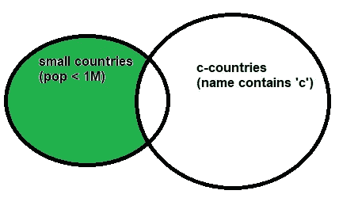
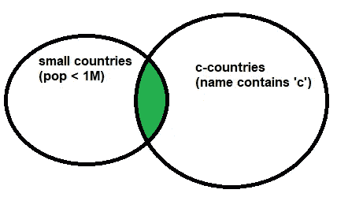
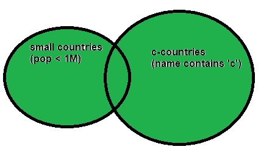
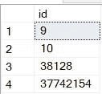
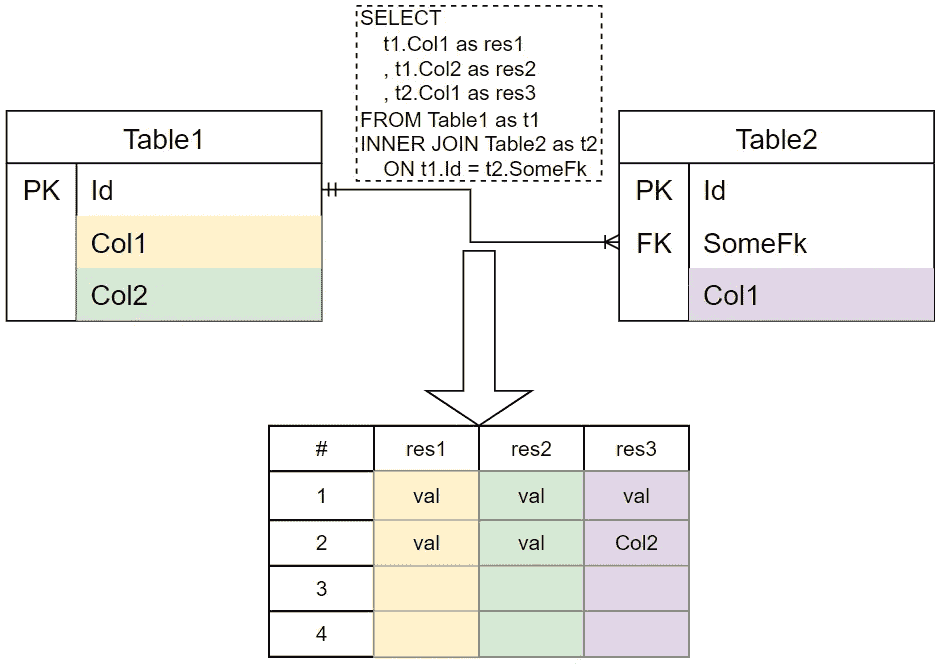
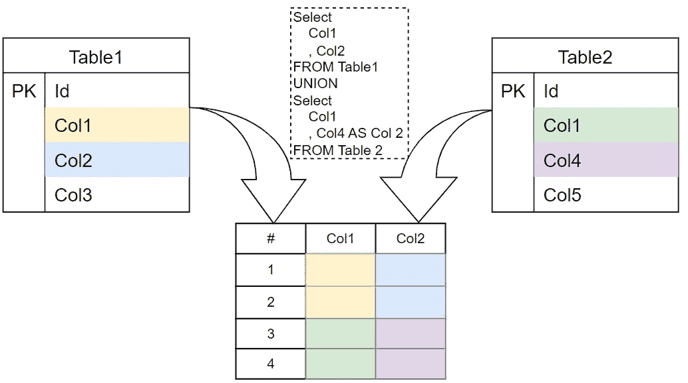

# SQL 中 UNION 和 JOIN 的区别是什么？

> 原文：[`towardsdatascience.com/what-is-the-difference-between-union-and-join-in-sql-c7cff3975ff4`](https://towardsdatascience.com/what-is-the-difference-between-union-and-join-in-sql-c7cff3975ff4)

## UNION、EXCEPT 和 INTERSECT 的 5 分钟指南

[](https://mikehuls.medium.com/?source=post_page-----c7cff3975ff4--------------------------------)[](https://towardsdatascience.com/?source=post_page-----c7cff3975ff4--------------------------------) [Mike Huls](https://mikehuls.medium.com/?source=post_page-----c7cff3975ff4--------------------------------)

·发表于 [Towards Data Science](https://towardsdatascience.com/?source=post_page-----c7cff3975ff4--------------------------------) ·7 分钟阅读·2023 年 5 月 1 日

--


我们有大量数据需要处理（图片由 [Simon Berger](https://unsplash.com/@8moments) 提供，来源于 [Unsplash](https://unsplash.com/photos/twukN12EN7c)）

在本文中，我们深入探讨了三个经常被忽视的 SQL 操作符：`EXCEPT`、`INTERSECT` 和 `UNION`。我们将：

1.  使用清晰的例子和视觉图像来彻底理解这些概念

1.  理解操作符的“规则”以真正掌握如何使用它们

1.  探索一个更复杂的例子

1.  理解与 `JOIN` 的区别，并讨论何时使用哪个

在本文结束时，你将掌握一些强大的 SQL 工具，所以让我们开始编程吧！

## 在我们开始之前...

在一些数据库中，如 SQL Server、PostgreSQL 和 SQLite，我们使用 `EXCEPT` 操作符。在其他数据库（例如 MySQL 和 Oracle）中，这个操作符被称为 `MINUS`。`MINUS` 和 `EXCEPT` 的工作方式完全相同。

> TL;DR: `*EXCEPT == MINUS*`

在本文的剩余部分，我们将使用 SQL Server 的 `EXCEPT` 示例；如果你使用其他数据库，只需在需要时将其替换为 `MINUS`。

[](/sql-insert-delete-and-update-in-one-statement-sync-your-tables-with-merge-14814215d32c?source=post_page-----c7cff3975ff4--------------------------------) ## SQL — 在一个语句中插入、删除和更新：使用 MERGE 同步你的表格

towardsdatascience.com

# 1\. 理解 EXCEPT、INTERSECT 和 UNION

让我们从一个非常简单的例子开始。我们将首先创建一个包含国家的表格：我们有一个 id、一个名称和一个人口。然后我们将插入 10 个国家：

```py
CREATE TABLE countries (
  id INT,
  name VARCHAR(50),
  population INTEGER,
);

INSERT INTO countries (id, name, population) VALUES
    (1, 'Armenia', 2978763),
    (2, 'Belgium', 11730997),
    (3, 'Canada', 37742154),
    (4, 'Denmark', 5792202),
    (5, 'Egypt', 102334404),
    (6, 'Ghana', 31072940),
    (7, 'Hungary', 9660351),
    (8, 'Iraq', 40222493),
    (9, 'Kiribati', 119449),
    (10, 'Liechtenstein', 38128);
```

现在我们将创建两个查询：

+   ***小国家***：选择人口少于 100 万的国家

+   ***c 国家***：选择名称中包含字母 'c' 的国家

```py
-- small countries (pop < 1M)
SELECT name FROM countries WHERE population < 1000000 
-->  Kiribati & Liechtenstein

-- c-countries (name contains a c)
SELECT name FROM countries WHERE NAME LIKE '%c%' 
--> Canada and Liechtenstein
```

接下来我们将展示如何比较和合并这些查询的结果到一个结果集中。

[SQL — 了解索引如何在底层工作以加速查询](https://towardsdatascience.com/sql-understand-how-indices-work-under-the-hood-to-speed-up-your-queries-a7f07eef4080?source=post_page-----c7cff3975ff4--------------------------------) [## SQL — Understand how indices work under the hood to speed up your queries.

### 不再等待缓慢的查询完成

[SQL — 理解索引如何在底层工作以加速查询](https://towardsdatascience.com/sql-understand-how-indices-work-under-the-hood-to-speed-up-your-queries-a7f07eef4080?source=post_page-----c7cff3975ff4--------------------------------)

## 1.1 除外

现在我们可以使用 `EXCEPT` 选择所有**小型国家**，`EXCEPT` 这些**名称中包含 ‘c’ 的国家：**

```py
SELECT name FROM countries WHERE population < 1000000 
EXCEPT
SELECT name FROM countries WHERE NAME LIKE '%c%' 
--> Kiribati
```



查询 1 的结果 EXCEPT 查询 2 的结果（图示：作者）

## 1.2 交集

使用 `INTERSECT` 找出重叠的部分：**小型 c 国家：**

```py
SELECT name FROM countries WHERE population < 1000000 
INTERSECT
SELECT name FROM countries WHERE NAME LIKE '%c%'
--> Liechtenstein
```



我们的两个查询之间的交集（图示：作者）

## 1.3 UNION（和 UNION ALL）

UNION 操作将两个查询的结果合并到一个结果集中：

```py
SELECT name FROM countries WHERE population < 1000000 
UNION
SELECT name FROM countries WHERE NAME LIKE '%c%'
--> Canada, Kiribati, Liechtenstein

SELECT name FROM countries WHERE population < 1000000 
UNION ALL
SELECT name FROM countries WHERE NAME LIKE '%c%'
--> Kiribati, Liechtenstein, Canada, Liechtenstein
```

在上面的示例代码中，`UNION ALL` 产生了另一个列支敦士登！这是因为常规的 `UNION` 去除重复项；`UNION ALL` 返回两个查询的所有行。



返回两个结果集的输出（图示：作者）

[Python 到 SQL — UPSERT 安全、简便且快速](https://towardsdatascience.com/python-to-sql-upsert-safely-easily-and-fast-17a854d4ec5a?source=post_page-----c7cff3975ff4--------------------------------) [## Python to SQL — UPSERT Safely, Easily and Fast

### 使用 Python 实现 lightning-fast 插入和/或更新

[Python 到 SQL — UPSERT 安全、简便且快速](https://towardsdatascience.com/python-to-sql-upsert-safely-easily-and-fast-17a854d4ec5a?source=post_page-----c7cff3975ff4--------------------------------)

# 2. 什么决定了重叠？规则

SQL 分析查询的结果，并基于**返回的列**来确定是否有交集。一般来说，有两个规则涉及到我们比较的查询：

1.  列必须是**可比较的**（相同数据类型）

1.  **列的数量**必须**相等**

## **规则 1：可比较的列**

以下代码将失败，因为我们不能比较 `id`（整数）和 `name`（字符串类型）。

```py
-- FAILS: Conversion failed when converting the varchar value 'Canada' to data type int.
SELECT id FROM countries WHERE population < 1000000 
EXCEPT
SELECT name FROM countries WHERE NAME LIKE '%c%'
```

## **规则 2：列的数量相等**

以下代码将失败，因为我们从查询 1 选择了两列，而从查询 2 选择了一列：

```py
-- All queries combined using a UNION, INTERSECT or EXCEPT operator must have an equal number of expressions in their target lists.
SELECT id, name FROM countries WHERE population < 1000000 
EXCEPT
SELECT name FROM countries WHERE NAME LIKE '%c%'
```

[SQL — 删除到另一个表](https://towardsdatascience.com/sql-delete-into-another-table-b5b946a42299?source=post_page-----c7cff3975ff4--------------------------------) [## SQL — DELETE INTO another table

[SQL — 删除到另一个表](https://towardsdatascience.com/sql-delete-into-another-table-b5b946a42299?source=post_page-----c7cff3975ff4--------------------------------)

## 遵循规则

当我们遵循这些规则时，我们也可以执行如下查询：匹配所有小型国家的 `id` 和‘c’国家的 `population`。虽然这是完全有效的语法，但它将不会返回任何记录。

```py
SELECT id FROM countries WHERE population < 1000000 
INTERSECT
SELECT population FROM countries WHERE NAME LIKE '%c%'
--> returns no rows (id and population match nowhere)
```

同样，我们可以`UNION`这些结果。

```py
SELECT id FROM countries WHERE population < 1000000
UNION
SELECT population FROM countries WHERE NAME LIKE '%c%'
```

将得到：



同时注意，列名不必匹配。如果名称冲突，将使用第一个查询的列名。

[](/dramatically-improve-your-database-inserts-with-a-simple-upgrade-6dfa672f1424?source=post_page-----c7cff3975ff4--------------------------------) ## 通过简单升级显著提升数据库插入速度

### 在 Python 中创建极速数据库连接的 4 个级别

towardsdatascience.com

# 3\. 不同表的`EXCEPT`、`INTERSECT`和`UNION`

当然，我们不必仅仅比较来自同一个表的数据，我们也可以使用不同的表，只要由`SELECT`语句产生的数据结构匹配即可。我已经准备了以下示例，参考了[这个语句](https://gist.github.com/mike-huls/12de512e770e4bc00897015c083226ec)。

## **1\. EXCEPT 示例：**

在这个示例中，我们比较`products`表中的记录和`sales`表中的记录：我们想知道是否有价格低于 100 美分的产品在荷兰以外的地方被销售过：

```py
SELECT id as product_id FROM products WHERE price < 100
EXCEPT
SELECT product_id FROM sales WHERE country = 'Netherlands'
--> Results in product_id 3
```

## **2\. INTERSECT 示例**

接下来，我们将选择在美国有`SALES`且有退货的任何产品：

```py
SELECT product_id FROM sales WHERE country = 'USA'
INTERSECT
SELECT product_id from returns
--> Results in product_id 2
```

## **3\. UNION 示例**

最后，我们将`UNION`三个查询的结果：便宜的产品，在荷兰有任何销售的产品，或任何被退货的产品：

```py
SELECT id as product_id FROM products WHERE price < 100
UNION
SELECT product_id FROM sales WHERE country = 'Netherlands'
UNION
SELECT product_id from returns
--> Returns product_id 1, 2, and 3
```

[](/the-easiest-way-to-upsert-with-sqlalchemy-9dae87a75c35?source=post_page-----c7cff3975ff4--------------------------------) ## 使用 SQLAlchemy 进行 UPSERT 的最简单方法

### 一个命令既可以`INSERT`新数据，又可以`UPDATE`数据库中现有记录

towardsdatascience.com

# 4\. 与连接的区别是什么？

我把`JOIN`看作是将来自两个或更多表的数据集的***列***结合在一起，使用它们之间的***相关列***。另一方面，`UNION`、`INTERSECT`和`EXCEPT`操作符则将来自两个或更多表的数据结合或比较，然后***附加***这些数据。

我喜欢把`JOIN`看作是“**水平**”操作，“**拉链式**”地将查询结果结合在一起。`UNION`、`INTERSECT`和`EXCEPT`操作符则是“**垂直**”地，“**堆叠**”结果集。让我们通过一些图像来演示：

## 可视化连接

下面是连接两个表的可视化表示：我们从 table1 中取出两列，并用 table2 中的一列通过相关列中的值进行组合（table1.Id <-> table2.SomeFk）：



五彩斑斓的连接（作者提供的图像）

从这个角度来看：使用`JOIN`我们“**拉链式**”地连接两个表。我们让表比之前更宽：我们**水平**地添加到表中。

## 可视化`UNION`

现在我们来看看一个`UNION`语句。注意结果彼此之间相当独立。它们没有相关列；我们只是“**将结果集堆叠在一起**”，垂直扩展表格。我们之所以能这样做，是因为两个查询输出的列数相同，并且所有列的数据类型匹配。



将结果集合并为单个数据堆栈（作者提供的图片）

在这种情况下，我们使用 UNION 操作符将记录堆叠在一起，但`INTERSECT`也以相同方式工作，只保留重叠部分。同样，`EXCEPT`则是从“堆栈”中“减去”一些记录。

[](/no-need-to-ever-write-sql-again-sqlalchemys-orm-for-absolute-beginners-107be0b3148f?source=post_page-----c7cff3975ff4--------------------------------) ## 再也不用写 SQL：SQLAlchemy 的 ORM 绝对初学者指南

### 使用这个 ORM，你可以创建表格、插入、读取、删除和更新数据，而无需编写一行 SQL 代码

towardsdatascience.com

# 结论

我希望已经澄清了这三种奇妙操作符的工作原理，也希望你在阅读这篇文章时感到愉快。

我希望这篇文章能如我所期望的那样清晰，如果不是，请告诉我我可以做些什么进一步澄清。同时，查看我关于各种编程相关主题的[其他文章](https://mikehuls.com/articles)：

+   [Git 绝对初学者：通过视频游戏理解 Git](https://mikehuls.medium.com/git-for-absolute-beginners-understanding-git-with-the-help-of-a-video-game-88826054459a)

+   [创建并发布你自己的 Python 包](https://mikehuls.medium.com/create-and-publish-your-own-python-package-ea45bee41cdc)

+   [在 5 行代码中使用 FastAPI 创建快速的自动文档、可维护且易于使用的 Python API](https://mikehuls.medium.com/create-a-fast-auto-documented-maintainable-and-easy-to-use-python-api-in-5-lines-of-code-with-4e574c00f70e)

编程愉快！

— Mike

*P.S: 喜欢我做的事吗？* [*关注我！*](https://mikehuls.medium.com/membership)

[](https://mikehuls.medium.com/membership?source=post_page-----c7cff3975ff4--------------------------------) [## 通过我的推荐链接加入 Medium - Mike Huls

### 阅读 Mike Huls（以及 Medium 上的其他成千上万名作家的每一个故事）。你的会员费用直接支持 Mike…

[mikehuls.medium.com](https://mikehuls.medium.com/membership?source=post_page-----c7cff3975ff4--------------------------------)
