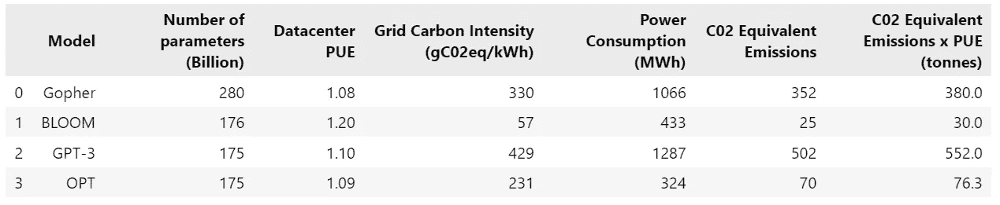
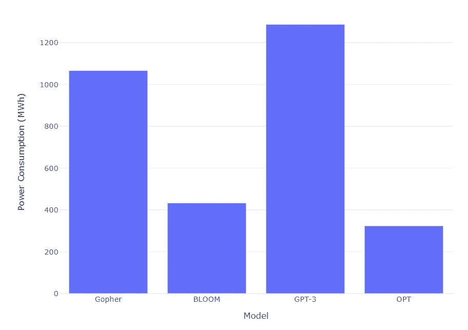
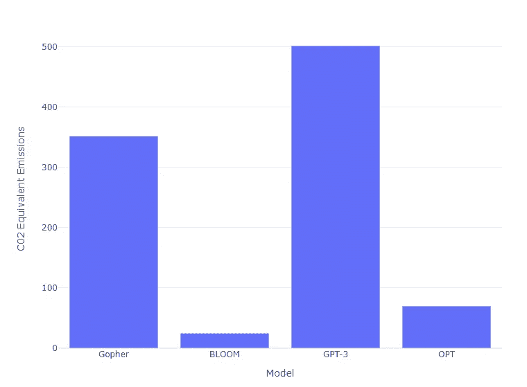
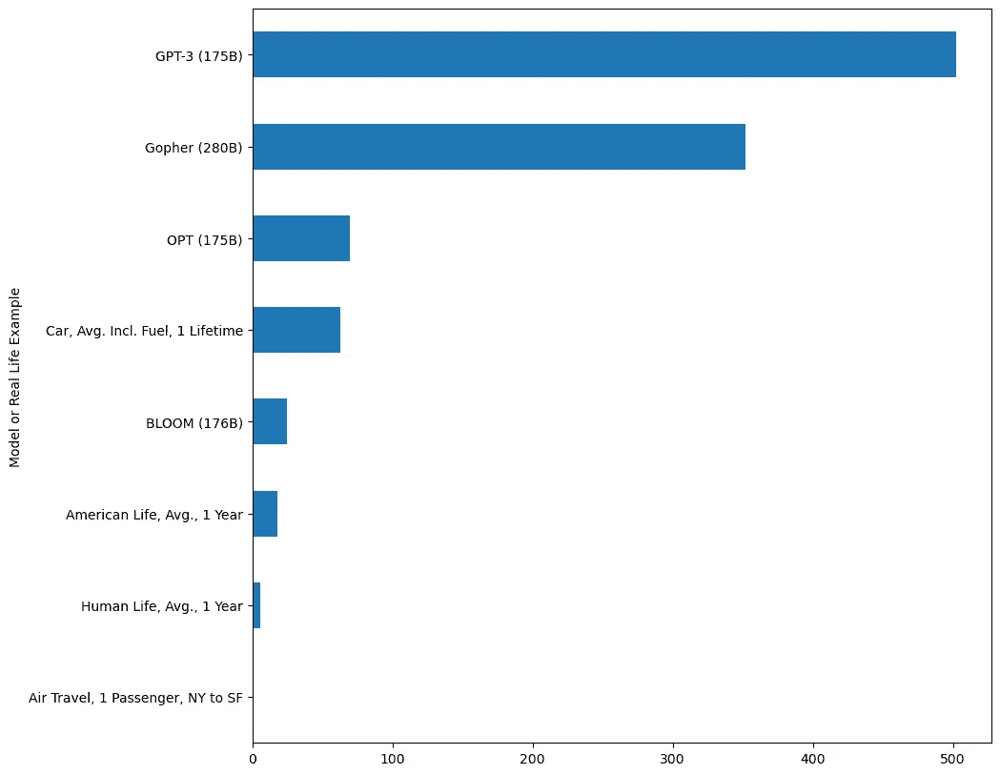
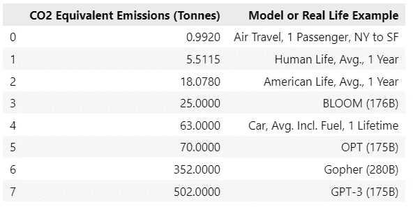
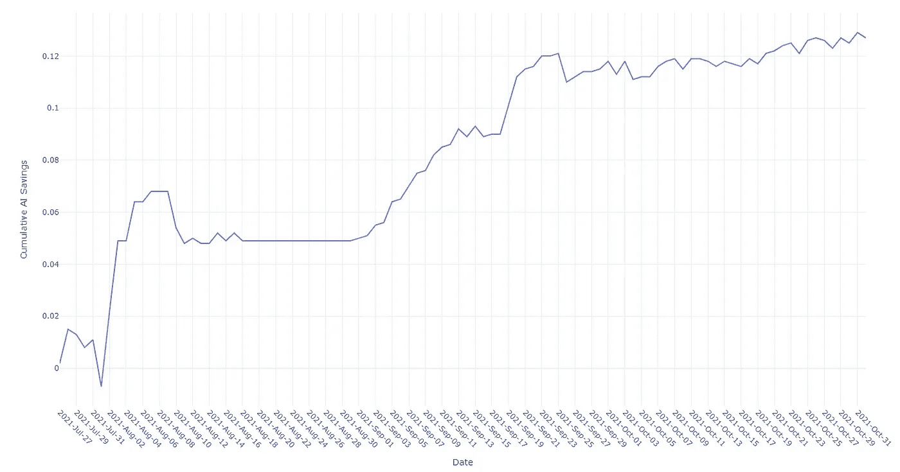

# AI 的环境影响是什么？

> 原文：[`towardsdatascience.com/what-is-the-environmental-impact-of-ai-b8af55ec169e`](https://towardsdatascience.com/what-is-the-environmental-impact-of-ai-b8af55ec169e)

## 新的 AI Index 报告指出了像 ChatGPT 这样的 AI 所需的巨大能量 — 尽管也有积极的一面。

 [Alan Jones](https://medium.com/@alan-jones?source=post_page-----b8af55ec169e--------------------------------)

·发表于 [Towards Data Science](https://towardsdatascience.com/?source=post_page-----b8af55ec169e--------------------------------) ·阅读时长 6 分钟·2023 年 4 月 7 日

--

图片由 [Jason Blackeye](https://unsplash.com/@jeisblack?utm_source=medium&utm_medium=referral) 提供，来源于 [Unsplash](https://unsplash.com/?utm_source=medium&utm_medium=referral)

2023¹ 年的*AI Index Report*中的一个小但重要的部分指出了对 AI 训练所需能耗的日益关注。

剧透警告：这确实是非常多。

目前没有用于追踪 AI 系统碳强度的标准基准，因此报告侧重于 Luccioni 等人，2022² 的一篇近期论文中的研究，该论文记录了包括 ChatGPT 在内的大型语言模型（LLMs）的能源需求。

下表显示了训练四种不同 AI 模型的能源需求以及相关的 CO2 排放。

图片来源：作者，数据来源：Luccioni 等人，2022²

数据包含了若干测量值，但关键点在于我在下方的图表中总结的电力消耗和 CO2 排放。

四种 AI 模型的电力消耗 — 图片来源：作者，数据来源：Luccioni 等人，2022²

各种模型之间存在相当大的差异，正如你所见，OpenAI 的 GPT-3 排名第一，消耗超过 1200 兆瓦时。根据美国能源信息署的数据，这大约是 120 个美国家庭一年所消耗的电量³。这确实看起来是非常大量的能源。

下图展示了 CO2 排放情况，其模式相似。

四种 AI 模型的 CO2 排放 — 图片来源：作者，数据来源：Luccioni 等人，2022²

论文的主要作者 Luccioni 是 Hugging Face Inc.的研究员，该工作的主要关注点是她公司开发的替代 ChatGPT 的模型 BLOOM。其他模型的数据是近似的，基于公开信息（[Bloomberg](https://www.bloomberg.com/news/articles/2023-03-09/how-much-energy-do-ai-and-chatgpt-use-no-one-knows-for-sure)报道 Lucciana 说没有关于 ChatGPT 的确切数据，可能只是“…三只穿着大衣的浣熊。”——这是否意味着 GPT-4 将会是四只浣熊？）。

> 训练 ChatGPT 的 CO2 排放量相当于约 500 次从纽约到旧金山的航班

人工智能指数报告对其他能源密集型活动及其 CO2 排放进行了比较（见下图）。例如，它发现训练 ChatGPT 产生的 CO2 排放量相当于一名乘客从纽约飞往旧金山约 500 次！或者相当于一个美国人 28 年的总能源消耗！

能源消耗比较：人工智能模型和现实生活中的例子。作者提供的图片，数据来源于人工智能指数报告¹

不足为奇的是，单个航空乘客并未如上图所示产生零排放（实际排放量接近 1 吨）。你可以在下表中更清楚地看到实际数字：

能源消耗比较：人工智能模型和现实生活中的例子。作者提供的图片，数据来源于人工智能指数报告¹

但这并不是全然坏消息。

## 人工智能也可以减少能源消耗

根据[Bloomberg](https://www.bloomberg.com/news/articles/2023-03-09/how-much-energy-do-ai-and-chatgpt-use-no-one-knows-for-sure)的报道，虽然人工智能模型变得越来越大（并且可能更具能源密集性），但创建这些模型的公司正在致力于提高效率。微软、谷歌和亚马逊——这些托管大部分工作的云公司——都在致力于实现碳负或碳中和运营。这当然是非常可取的。

此外，尽管训练人工智能系统是能源密集型的，但最近的研究表明，人工智能系统也可以用于优化能源消耗。2022 年 DeepMind 发布的一篇论文⁴详细介绍了 2021 年的一个实验，该实验训练了一个名为 BCOOLER 的人工智能，以优化 Google 数据中心的冷却。

BCOOLER 的节能。作者提供的图片，数据来源于人工智能指数报告¹

上图显示了 BCOOLER 实验的节能结果。经过三个月，大约节省了 12.7%的能源。

即使实现了碳中和，利用人工智能提高这些中心的效率也会使其运行成本降低。也许我们应该考虑将人工智能应用于其他能源密集型行业。

我怀疑我们目前是否能确切了解最终对环境的影响。像 ChatGPT 这样的 LLM 不会消失，因此训练它们所需的能源肯定会被消耗。另一方面，人们也不会停止从纽约飞往旧金山、给家里供暖或使用汽车。

但我们应该尝试将这些令人震惊的数据放在相对的视角中。虽然一次 ChatGPT 训练会消耗相当于一个美国人 28 年的能源（这听起来很多），但 330 万美国人——即美国人口——产生的 CO2 是单次 ChatGPT 会话的**1000 万倍**⁵。

从纽约到旧金山的航班每天大约有 20 班，假设每班服务 150 名乘客，这样每年产生超过 100 万吨的 CO2 排放——**超过 2000 个 ChatGPT⁵**。

对于单一实体，像 ChatGPT 这样的系统显然使用了大量能源（因此——至少目前——也产生了大量的 CO2 排放），但与其他人类活动的能源消耗和 CO2 排放相比，它们真的很重要吗（毕竟，人类的数量远远多于 LLM）？

此外，大型云托管公司旨在实现碳中和，这将减少 CO2 排放至零。因此，虽然能源使用可能仍然很高，但目标是使其环境影响达到中性。

此外，AI 可以用于减少数据中心的能源使用。也许类似的技术可以应用于航空公司和其他能源密集型行业。

然而，关键点是我们所有人都在产生比应有更多的 CO2，因此任何额外的能源使用（如果不是来自可再生能源）都是朝着错误的方向发展。

感谢阅读，希望你觉得这有用。如果你想查看我的更多作品，请访问我的[网站](http://alanjones2.github.io)。

你也可以通过订阅我偶尔发布的免费[Substack 通讯](https://technofile.substack.com)来获取更新。

如果你不是 Medium 会员，你可以使用我的[推荐链接](https://medium.com/@alan-jones/membership)注册，每月仅需$5 即可阅读任何 Medium 内容。

## 参考文献

1.  AI Index 2023 Annual Report

Nestor Maslej, Loredana Fattorini, Erik Brynjolfsson, John Etchemendy, Katrina Ligett, Terah Lyons, James Manyika, Helen Ngo, Juan Carlos Niebles, Vanessa Parli, Yoav Shoham, Russell Wald, Jack Clark, 和 Raymond Perrault，“*AI Index 2023 Annual Report*”，AI Index Steering Committee, Institute for Human-Centered AI, Stanford University, Stanford, CA, 2023 年 4 月。

斯坦福大学的*AI Index 2023 Annual Report*在[署名-禁止演绎 4.0 国际](https://creativecommons.org/licenses/by-nd/4.0/?ref=chooser-v1)许可下发布。

你可以在斯坦福大学的[AI Index](https://aiindex.stanford.edu/)页面找到完整报告。

2\. [*估算 BLOOM 的碳足迹，一个 176B 参数的语言模型*](https://arxiv.org/pdf/2211.02001.pdf)，Luccioni 等人，2022。

3\. [美国能源信息管理局](https://www.eia.gov/tools/faqs/faq.php?id=97&t=3#:~:text=In%202021,%20the%20average%20annual,about%20886%20kWh%20per%20month.) 估计 2021 年，美国住宅电力用户的年平均电力消耗为 10,632 千瓦时（kWh）。

4\. [使用强化学习控制商业冷却系统](https://www.deepmind.com/publications/controlling-commercial-cooling-systems-using-reinforcement-learning)，DeepMind，2022

5\. 来自其他来源的 CO2 排放（这些是粗略计算）：

3.3 亿美国人每年排放 18 吨 CO2，即 3.3 亿 x 18，5900 万吨 CO2——1000 万个 ChatGPT。

约 20 个航班（每天），从纽约到旧金山，每个航班大约有 150 名乘客，产生 20 x 150，即 3000 吨的 CO2。这相当于 3000 x 365，大约每年 1 百万吨的 CO2——2000 个 ChatGPT。
