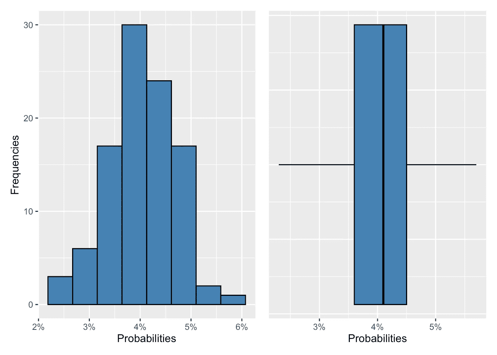
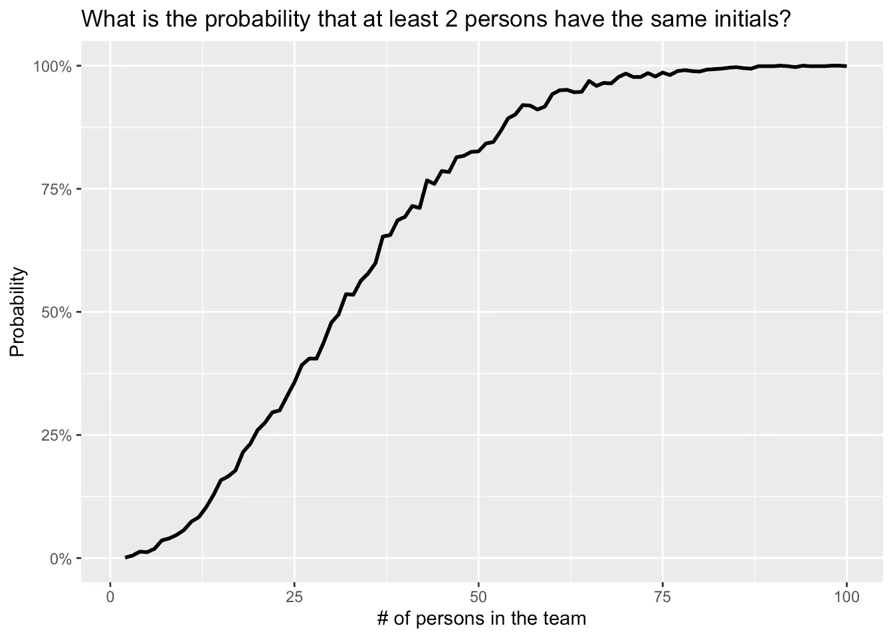
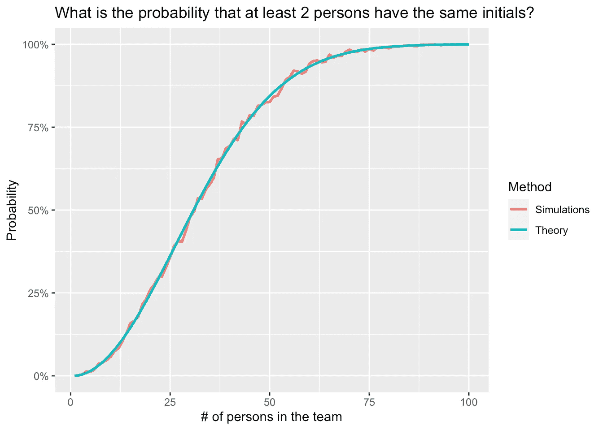

# 两个人拥有相同首字母的概率是多少？

> 原文：[`towardsdatascience.com/what-is-the-probability-that-two-persons-have-the-same-initials-0ea3bcb9bcf2`](https://towardsdatascience.com/what-is-the-probability-that-two-persons-have-the-same-initials-0ea3bcb9bcf2)

## 学习如何使用模拟、复制和 R 中的`for`循环来回答许多概率问题

[](https://antoinesoetewey.medium.com/?source=post_page-----0ea3bcb9bcf2--------------------------------)[](https://towardsdatascience.com/?source=post_page-----0ea3bcb9bcf2--------------------------------) [Antoine Soetewey](https://antoinesoetewey.medium.com/?source=post_page-----0ea3bcb9bcf2--------------------------------)

·发表于 [Towards Data Science](https://towardsdatascience.com/?source=post_page-----0ea3bcb9bcf2--------------------------------) ·14 min 阅读·2023 年 12 月 6 日

--


图片由 [Mario Gogh](https://unsplash.com/@mariogogh?utm_source=medium&utm_medium=referral) 提供

# 介绍

上周，我加入了一个团队，参与一个合作项目。这个团队已经建立了几个月，由几位科学家一起工作。为了简便起见，他们习惯用首字母（名字的第一个字母加上姓氏的第一个字母）签署文件、在邮件中提到同事等。

加入项目几天后，当我需要用我的首字母签署第一份文件时，我们意识到团队中另一人和我有完全相同的首字母。

这并不是真的问题，因为我们决定我将倒写我的名字首字母，也就是“SA”而不是“AS”，而另一个人会像往常一样继续签署“AS”。

本来可以到此为止。然而，当团队负责人在一次会议中声称：“你们两个有相同的首字母真是不幸！这种情况发生的几率有多大？！”时，我产生了写一篇关于这个相当平凡的趣事的想法。

我们花了几分钟尝试估计这个概率，最终这些估计大多基于我们的直觉，而不是正式的计算。这引起了我的好奇心。

鉴于我们正在进行的项目需要使用模拟，我决定通过 R 语言中的模拟来回答这个问题。也就是说，像大多数模拟一样，验证这些结果是一个良好的实践。这可以通过[概率论](https://statsandr.com/blog/the-9-concepts-and-formulas-in-probability-that-every-data-scientist-should-know/)来完成。这种比较将有助于评估通过模拟获得结果的真实性。

此外，我认为这将是一个很好的方式来说明在我的帖子中不常出现的方法：for 循环、重复和在 R 中编写函数。

# 这种情况的可能性有多大？

在回答团队负责人提出的问题之前，有三点需要注意：

1.  尽管团队负责人对*正好有两个人*拥有相同首字母的概率很感兴趣，但我们实际上更关心的是*至少有两个人*拥有相同首字母的概率（因为如果团队中有超过两个人拥有相同首字母，问题也会出现）。

1.  团队由 8 人组成。

1.  我们将首字母限制为两个字母（第一个字母是名字的第一个字母，第二个字母是姓氏的第一个字母）。这意味着中间名没有被考虑在内，并且对于复合名只考虑第一个字母。

在这篇文章中，我们将展示如何计算这个概率：

+   在我们的背景下，即对于一个 8 人团队，以及

+   为了完整起见，考虑所有从 2 人到 100 人不等的团队。

如引言中所述，我们将首先通过模拟来计算这些概率，然后通过概率论来计算。

# 对于我们的团队

我们首先创建一个大小为 8 的向量，对应于一个由 8 个人组成的团队的首字母，这些人是从 26 个拉丁字母中随机抽样的：

```py
# number of persons
n_persons <- 8
```

```py
# create vector of initials
initials <- replicate(
  n = n_persons, # number of replications
  paste0(sample(LETTERS, size = 1), sample(LETTERS, size = 1)) # sample letters
)# display initials
initials
```

```py
## [1] "UJ" "MN" "XD" "CY" "BB" "ZB" "CU" "HQ"
```

```py
# are there duplicates?
any(duplicated(initials))
```

```py
## [1] FALSE
```

正如我们所看到的，这支模拟的 8 人团队中每个人的首字母都不同，但这并不总是这样。

为了通过模拟估计至少有两个人拥有相同首字母的可能性，我们需要将这个 8 个采样首字母的向量重复大量次（比如 1000 次重复）：

```py
# number of replications
reps <- 1000
```

```py
# create and save replications
dat <- replicate(
  n = reps, # number of replications
  replicate(n_persons, paste0(sample(LETTERS, size = 1), sample(LETTERS, size = 1)))
)# dimensions
dim(dat)
```

```py
## [1]    8 1000
```

```py
# display first 4 simulated teams
dat[, 1:4]
```

```py
##      [,1] [,2] [,3] [,4]
## [1,] "VA" "BU" "LU" "PT"
## [2,] "JG" "SM" "HM" "OL"
## [3,] "BY" "NA" "VJ" "OT"
## [4,] "RT" "CM" "WT" "YT"
## [5,] "PS" "CT" "NB" "QJ"
## [6,] "MG" "KR" "SV" "US"
## [7,] "PL" "SN" "PN" "XW"
## [8,] "NJ" "BR" "DD" "ZC"
```

结果是一个 8 行 1000 列的矩阵，其中：

+   每一行对应于一个人的采样首字母，以及

+   每一列对应于一个模拟的 8 人团队。

为了更好地阅读，我们重新命名：

+   行名为`M1`到`M8`，对应于第 1 到第 8 个人，以及

+   列名为`T1`到`T1000`，对应于第 1 到第 1000 支团队。

```py
# rename rows
rownames(dat) <- paste0("M", 1:n_persons)
```

```py
# rename columns
colnames(dat) <- paste0("T", 1:reps)# display first 4 simulated teams
dat[, 1:4]
```

```py
##    T1   T2   T3   T4  
## M1 "VA" "BU" "LU" "PT"
## M2 "JG" "SM" "HM" "OL"
## M3 "BY" "NA" "VJ" "OT"
## M4 "RT" "CM" "WT" "YT"
## M5 "PS" "CT" "NB" "QJ"
## M6 "MG" "KR" "SV" "US"
## M7 "PL" "SN" "PN" "XW"
## M8 "NJ" "BR" "DD" "ZC"
```

我们现在需要计算，在模拟的 1000 支团队中，有多少支团队至少有两个人拥有相同的首字母：

```py
# transform to data frame
dat <- as.data.frame(dat)
```

```py
# save which teams have duplicates
duplicates <- rep(NA, reps) # create empty vector
for (i in 1:reps) { # for loop over i from 1 to 1,000
  duplicates[i] <- any(duplicated(dat[, i])) # save results TRUE/FALSE in duplicates vector
}# count how many teams have duplicates
sum(duplicates)
```

```py
## [1] 41
```

在这里，对于数据框`dat`的每一列（从第一列到第 1000 列），我们检查是否存在重复。这是通过 for 循环在所有列上重复进行的。对于每一列，如果存在重复，结果是`TRUE`，否则是`FALSE`。每次迭代的结果保存在`duplicates`向量中。由于在 R 中`TRUE = 1`和`FALSE = 0`，我们可以通过求和`duplicates`向量中的`TRUE`的数量来计算有多少列（即团队）存在重复。

从上面的输出可以看出，在 1000 个模拟的团队中，有 41 个团队存在重复，即 41 个团队中至少有两个人的首字母相同。

因此，根据模拟结果，我们可以预期在 8 人团队中至少有两个人的首字母相同的概率接近 4.1%。

这是一个很好的起点。不过，请注意，我写了接近 4.1%，因为这个概率在通过模拟计算时会有所变化。

例如，如果我们重复完全相同的过程第二次：

```py
# create and save replications
dat <- replicate(
  n = reps, # number of replications
  replicate(n_persons, paste0(sample(LETTERS, size = 1), sample(LETTERS, size = 1)))
)
```

```py
# transform to data frame
dat <- as.data.frame(dat)# save which teams have duplicates
duplicates <- rep(NA, reps) # create empty vector
for (i in 1:reps) { # for loop over i from 1 to 1,000
  duplicates[i] <- any(duplicated(dat[, i])) # save results in the duplicates vector (as TRUE/FALSE)
}# count how many teams have duplicates
sum(duplicates)
```

```py
## [1] 44
```

我们现在得到一个 4.4%的概率。这不是错误，而是由于在取样首字母时的随机性造成的。

幸运的是，我们可以通过重复计算使这个概率的计算更加稳健。直观地说，其工作原理如下。我们重复相同的计算多次，给出一个可能的概率范围。这使我们能够评估结果的不确定性，并了解由于取不同随机样本的首字母，概率可能会有所变化。

因此，目标是多次计算我们的概率（比如 100 次），并查看其分布。

要多次重复相同的计算，最好编写一个函数，以避免一遍又一遍地复制粘贴相同的代码。因此，我们首先编写一个函数（称为`initials`），该函数计算一个 n 人团队中至少有两个人的首字母相同的概率：

```py
initials <- function(n_persons, reps = 1000) {
  # simulate data
  dat <- as.data.frame(replicate(
    reps,
    replicate(n_persons, paste0(sample(LETTERS, size = 1), sample(LETTERS, size = 1)))
  ))
```

```py
 # save which teams have duplicates
  duplicates <- rep(NA, reps)
  for (i in 1:reps) {
    duplicates[i] <- any(duplicated(dat[, i]))
  } # proportion of teams with duplicates
  return(mean(duplicates))
}
```

R 中的一个函数需要包括：

+   `()` 内的参数，以及

+   `{}` 内的计算。

然后，我们可以使用我们的函数计算一个 8 人团队中至少有两个人的首字母相同的概率。我们将其与`replicate()`函数结合使用，以计算这个概率 100 次。

```py
# compute and save probabilities
probs <- replicate(100, initials(n_persons = 8))
```

```py
# display probabilities
probs
```

```py
##   [1] 0.032 0.037 0.040 0.043 0.033 0.042 0.039 0.047 0.045 0.038 0.052 0.042
##  [13] 0.042 0.040 0.023 0.044 0.041 0.039 0.036 0.048 0.041 0.037 0.027 0.030
##  [25] 0.052 0.038 0.043 0.035 0.038 0.045 0.047 0.044 0.030 0.036 0.036 0.048
##  [37] 0.038 0.045 0.044 0.034 0.031 0.043 0.045 0.034 0.049 0.047 0.051 0.036
##  [49] 0.051 0.040 0.043 0.044 0.038 0.049 0.043 0.050 0.035 0.043 0.048 0.038
##  [61] 0.041 0.044 0.039 0.045 0.033 0.057 0.036 0.043 0.041 0.041 0.041 0.041
##  [73] 0.038 0.044 0.031 0.034 0.049 0.041 0.040 0.034 0.032 0.036 0.049 0.047
##  [85] 0.048 0.038 0.038 0.037 0.036 0.037 0.043 0.040 0.026 0.049 0.046 0.044
##  [97] 0.048 0.038 0.026 0.029
```

最后，我们通过直方图和箱线图（使用[{ggplot2}包](https://statsandr.com/blog/graphics-in-r-with-ggplot2/)）可视化这 100 个概率的分布：

```py
# visualize distribution of the computed probabilities
# build and save plots
library(ggplot2)
```

```py
p1 <- ggplot(mapping = aes(x = probs)) +
  geom_histogram(color = "black", fill = "steelblue", bins = 8) +
  labs(
    x = "Probabilities",
    y = "Frequencies"
  ) +
  scale_x_continuous(labels = scales::percent) # format x-axis in %p2 <- ggplot(mapping = aes(x = probs)) +
  geom_boxplot(color = "black", fill = "steelblue") +
  labs(x = "Probabilities") +
  theme(
    axis.text.y = element_blank(),
    axis.ticks.y = element_blank()
  ) +
  scale_x_continuous(labels = scales::percent) # format x-axis in %# combine plots
library(patchwork)p1 + p2
```



作者绘图

这两幅图表明，在 8 人团队中，至少有两个人的首字母相同的概率最有可能在 3.5%和 4.5%之间。

作为记录，在这一切思考的源头会议中，我们大多数人认为这种情况的可能性要小得多。事实上，我相信我们曾经想计算的是某个加入团队的人首字母为“AS”的概率。这确实要小得多，因为概率只有 1/26 × 1/26 ≃ 0.15%。

然而，这并没有考虑到以下事实：

+   新来的员工可以与任何其他人有相同的首字母，并且

+   这不仅仅是新来的员工可能与其他人有相同的首字母（团队中已有的 2 个人也可能有相同的首字母）。

如果你对这一发现感到困惑，我建议你阅读一下[生日悖论](https://en.wikipedia.org/wiki/Birthday_problem)。生日悖论表明，在一个相对较小的群体中，两个人共享相同生日的概率会出奇地高。实际上，在一个只有 23 人的小组中，至少有两个人共享相同生日的概率超过 50%，这说明了我们对这种巧合的可能性的直观认知的反常。这个现象是由于群体中可能的生日对的数量众多，类似于团队中首字母对的数量。

# 针对不同规模的团队

我们现在有兴趣计算这个概率，不仅仅针对 8 人的团队，还针对不同规模的团队。我们可以借助之前定义的函数来实现。

为了说明，让我们计算至少有两个人拥有相同首字母的概率，针对从 2 人到 100 人的团队：

```py
# set lower and upper bounds of number of persons
min_persons <- 2
max_persons <- 100
```

```py
# create empty vector of probabilities
probs <- rep(NA, length(min_persons:max_persons))# compute and save probabilities for teams of size 2 to 100
for (i in min_persons:max_persons) {
  probs[i] <- initials(n_persons = i)
}# display probabilities
probs
```

```py
##   [1]    NA 0.001 0.005 0.013 0.012 0.019 0.036 0.040 0.047 0.057 0.074 0.083
##  [13] 0.103 0.128 0.158 0.166 0.178 0.215 0.232 0.260 0.275 0.296 0.300 0.329
##  [25] 0.357 0.392 0.405 0.405 0.439 0.478 0.495 0.536 0.535 0.563 0.578 0.599
##  [37] 0.653 0.656 0.686 0.693 0.715 0.711 0.767 0.760 0.786 0.784 0.814 0.817
##  [49] 0.825 0.826 0.842 0.845 0.867 0.893 0.901 0.920 0.919 0.911 0.917 0.942
##  [61] 0.950 0.951 0.946 0.947 0.969 0.959 0.965 0.964 0.977 0.984 0.977 0.977
##  [73] 0.985 0.978 0.986 0.981 0.989 0.991 0.989 0.988 0.992 0.993 0.994 0.996
##  [85] 0.997 0.995 0.994 0.999 0.999 0.999 1.000 0.999 0.997 1.000 0.999 0.999
##  [97] 0.999 1.000 1.000 0.999
```

我们将这些概率与团队人数一起存储在数据框中：

```py
# create data frame with saved probabilities and number of persons
dat_plot_sim <- data.frame(
  n_persons = (min_persons - 1):max_persons,
  prob = probs
)
```

```py
# display first 6 rows
head(dat_plot_sim)
```

```py
##   n_persons  prob
## 1         1    NA
## 2         2 0.001
## 3         3 0.005
## 4         4 0.013
## 5         5 0.012
## 6         6 0.019
```

当然，在一个 1 人的团队中（如果我们可以称之为团队的话），两个拥有相同首字母的人是不可能的。

一个不可能发生的事件，其概率等于 0。因此，我们在数据框的第一行中填入这个概率：

```py
# set proba = 1 when n_person = 1
dat_plot_sim[1, 2] <- 0
```

```py
# display first 6 rows
head(dat_plot_sim)
```

```py
##   n_persons  prob
## 1         1 0.000
## 2         2 0.001
## 3         3 0.005
## 4         4 0.013
## 5         5 0.012
## 6         6 0.019
```

最后，我们将这些概率根据团队人数进行可视化：

```py
# visualize probabilities
ggplot(dat_plot_sim) +
  aes(x = n_persons, y = probs) +
  geom_line(linewidth = 1) +
  labs(
    x = "# of persons in the team",
    y = "Probability",
    title = "What is the probability that at least 2 persons have the same initials?"
  ) +
  scale_y_continuous(labels = scales::percent) # format y-axis in %
```



作者绘制的图

从上面的图表中，我们看到，当团队人数超过 30 人时，至少有两个人拥有相同首字母的概率达到了 50%。

此外，请注意，当团队人数达到约 75 人时，这个概率接近 100%。

# 验证

为了完整性，我们现在将通过模拟得到的结果与通过概率理论得到的结果进行比较。

我们首先定义一个函数，用于比较上述找到的结果：

```py
# define function
have_same <- function(s, n) {
  sample_space <- s
  probability <- 1
  for (i in 0:(n - 1)) {
    probability <- probability * (sample_space - i) / sample_space
  }
  1 - probability
}
```

# 对于我们的团队

```py
# number of possible two-letter initials
n_initials <- 26²
```

```py
# apply function
have_same(n_initials, n_persons)
```

```py
## [1] 0.0407218
```

在 8 人的团队中，至少有两个人拥有相同首字母的概率为 4.07%。这接近于通过模拟得到的概率，并在 3.5% — 4.5%的范围内。

# 针对不同规模的团队

我们现在计算 1 到 100 人的团队之间的概率：

```py
# compute and save probabilities for teams between 1 and 100 persons
probs <- vector(length = max_persons)
for (i in 1:max_persons) {
  probs[i] <- have_same(n_initials, i)
}
```

```py
# create data frame with saved probabilities and number of persons
dat_plot_theory <- data.frame(
  n_persons = (min_persons - 1):max_persons,
  prob = probs
)# display first 6 rows
head(dat_plot_theory)
```

```py
##   n_persons        prob
## 1         1 0.000000000
## 2         2 0.001479290
## 3         3 0.004433493
## 4         4 0.008851688
## 5         5 0.014716471
## 6         6 0.022004071
```

最后，我们将这些概率根据团队人数进行可视化：

```py
# visualize probabilities
ggplot(dat_plot_theory) +
  aes(x = n_persons, y = probs) +
  geom_line(linewidth = 1) +
  labs(
    x = "# of persons in the team",
    y = "Probability",
    title = "What is the probability that at least 2 persons have the same initials?"
  ) +
  scale_y_continuous(labels = scales::percent) # format y-axis in %
```


作者绘制的图

为了便于比较，我们在同一图表上绘制了通过模拟和概率理论得到的概率：

```py
# combine the two data frames into one and add the method as variable
dat_plot_sim$Method <- "Simulations"
dat_plot_theory$Method <- "Theory"
dat_plot_all <- rbind(dat_plot_sim, dat_plot_theory)
```

```py
# visualize probabilities on same plot
ggplot(dat_plot_all) +
  aes(x = n_persons, y = prob, color = Method) +
  geom_line(linewidth = 1) +
  labs(
    x = "# of persons in the team",
    y = "Probability",
    title = "What is the probability that at least 2 persons have the same initials?"
  ) +
  scale_y_continuous(labels = scales::percent) # format y-axis in %
```



作者绘制的图

上图显示了使用概率理论得到的结果与通过模拟获得的结果相对类似，这表明模拟结果是可靠的。

# 结论

初始问题是在一次会议上提出的：“在我们由 8 个人组成的团队中，两个人有相同首字母的概率是多少？”

在这篇文章中，我们首先展示了如何通过 R 中的模拟来计算这个概率。其次，我们通过概率理论验证了模拟的真实性。此外，我们还说明了如何使用 for 循环、重复操作和编写函数来在 R 中解决概率问题。

顺便提一下，重要的是要记住在这篇文章中我们假设了以下内容：

+   所有字母出现的概率相同，这意味着所有的首字母组合的概率是相等的。这在现实中可能并非如此，因为两个名字都以 X 开头的概率不如一个名字以 M 开头另一个名字以 K 开头的概率大。可以通过指定不同的权重来限制这种偏差。

+   我们将自己限制在了两字母首字母。因此，对于复合的名字或姓氏，只考虑第一个字母。中间名也未被考虑。

最后但同样重要的是，即使你使用完全相同的代码，你可能会得到略微不同的结果。这是由于随机性造成的。要复制本文中所示的结果，请使用 `set.seed(6)`。

感谢阅读。

一如既往，如果你对本文讨论的主题有任何问题或建议，请添加评论，以便其他读者也能从讨论中受益。

1.  你总是可以使用更多的重复次数，但在我们的案例中，最终结果与更多的重复次数相似，文章的目的是展示开发过程而非最终答案。[↩︎](https://statsandr.com/blog/what-is-the-probability-that-two-persons-have-the-same-initials/#fnref1)

# 相关文章

+   [Google Analytics 在 R 中：2022 年回顾](https://statsandr.com/blog/review-of-2022/)

+   [如何保持自己跟上最新的 R 新闻？](https://statsandr.com/blog/how-to-keep-up-to-date-with-the-latest-r-news/)

+   [Koh-Lanta 2022：大使概率问题](https://statsandr.com/blog/koh-lanta-2022-ambassadors-probability-problem/)

+   [Stats 和 R 已满 2 周岁！](https://statsandr.com/blog/statsandr-is-2-years-old/)

+   [如何在 R 中跟踪你的博客表现？](https://statsandr.com/blog/track-blog-performance-in-r/)

*最初发布于* [*https://statsandr.com*](https://statsandr.com/blog/what-is-the-probability-that-two-persons-have-the-same-initials/) *于 2023 年 12 月 6 日。*
