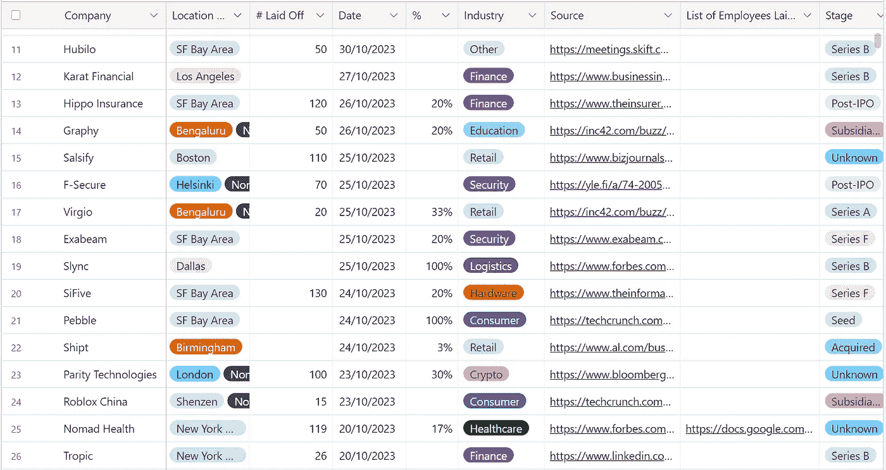
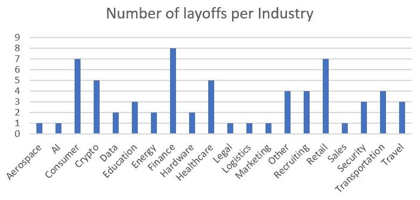

# AI 对裁员的真实影响是什么？深入分析

> 原文：[`towardsdatascience.com/what-is-the-real-impact-of-ai-on-job-cuts-7197ad1377f9`](https://towardsdatascience.com/what-is-the-real-impact-of-ai-on-job-cuts-7197ad1377f9)

[](https://medium.com/@AhmedF?source=post_page-----7197ad1377f9--------------------------------)[](https://towardsdatascience.com/?source=post_page-----7197ad1377f9--------------------------------) [Ahmed Fessi](https://medium.com/@AhmedF?source=post_page-----7197ad1377f9--------------------------------)

·发表于[Towards Data Science](https://towardsdatascience.com/?source=post_page-----7197ad1377f9--------------------------------) ·8 分钟阅读·2023 年 11 月 6 日

--


AI 替代人类，未来感，油画风格 — 作者使用 Dall-E 3 生成

自 ChatGPT 发布以来，考虑到生成 AI 的日益普及，许多问题出现了，涉及到 AI 对就业市场的影响。

多家公司宣布裁员，因为他们的团队采用了 AI，从而“需要更少的劳动力”。似乎没有任何行业或职能免受影响。

这些公告涵盖了像[英国电信](https://medium.com/@AhmedF/is-ai-already-massively-replacing-humans-british-telecom-ai-and-layoffs-8defaaf1b6b5)这样的大公司，也有像这家法国公关公司[用 AI 替换一半员工](https://www.ouest-france.fr/high-tech/intelligence-artificielle/cette-entreprise-francaise-vire-217-salaries-pour-les-remplacer-par-une-intelligence-artificielle-1dea7af2-560d-11ee-ba56-a7ce59b686ce)这样的小公司。

这显然引发了对**工作安全**的担忧，因为不同规模、不同领域和不同职能的公司似乎都在大规模地用 AI 替代人类。

这些担忧甚至引起了拜登政府的关注，在拜登总统签署的关于安全、可靠和可信人工智能的[行政命令](https://www.whitehouse.gov/briefing-room/statements-releases/2023/10/30/fact-sheet-president-biden-issues-executive-order-on-safe-secure-and-trustworthy-artificial-intelligence/)中，声明中提到，“*产生一份关于 AI 的* ***潜在劳动市场影响****的报告，并研究和识别加强对* ***面临劳动冲击的工人，包括 AI 造成的***联邦支持的选项”。

因此，作为数据分析师，我希望通过数据和数字评估 AI 对裁员和失业的真实影响。

# 方法论

## **数据来源**

作为数据来源，我使用了[layoffs.fyi](https://layoffs.fyi/)，它跟踪初创公司和科技公司的裁员情况。Layoffs.fyi 自 Covid 时期以来一直在跟踪裁员情况。然后，对于每次裁员，我使用了 Layoffs.fyi 中的参考链接以及互联网上的其他来源（新闻稿、Tech Crunch、Bloomberg 等文章）。



layoffs.fyi，筛选视图——关注 2023 年 10 月的裁员——作者的打印屏幕

## 选择标准

我分析了 2023 年**10 月**的所有裁员。

参考了 76 次裁员的数据。

通过重复分析发现，有一行是重复的（涉及 Convoy，Logistics）。因此，我们剩下 75 次裁员。

从这些裁员中，我删除了所有与“完全停业”相关的记录，共计 10 条。这可以讨论，但所有这 10 次停业与 AI 无关，而是由于各种原因（市场调整、不可行的商业模式等）导致公司破产。

我们需要分析 65 次裁员。这将是我们考虑的数据集。

## 分析

(*关于限制，* *请参见限制部分*)

对于 2023 年 10 月：

+   裁员总数：列出的公司中共有 6,841 名员工被裁员（未考虑缺失的数据点——参见限制）。

+   平均每家公司裁员数：平均而言，每家公司约有 163 名员工被裁员。

+   按国家裁员情况：美国的裁员数量最高，总共有 5,395 名员工被裁员，其次是印度的 510 名裁员，加拿大有 271 名裁员，法国报告了 230 名裁员，德国有 215 名裁员。其他国家的裁员较少。

看一下各行业的裁员情况：



2023 年 10 月裁员——按行业分类

金融、零售、消费、医疗保健和加密货币领域面临着最高数量的裁员（不是按员工数量，而是按裁员次数计算）。

# AI 的影响

下一步是检查有多少次裁员是**与 AI 相关**的。在分析了这 65 次裁员的总数据集后，**仅有 2 次裁员**被报告为由于 AI 采用所导致。

## 第一个案例：LinkedIn

LinkedIn 决定裁员[668 个职位](https://techcrunch.com/2023/10/16/linkedin-layoffs-2/)。此次裁员是在今年早些时候宣布的另一轮裁员之后，前者裁员[716 个职位](https://techcrunch.com/2023/05/08/linkedin-layoffs/)。LinkedIn 正在寻求通过 AI 来自动化日常任务、集成新的 AI 驱动工具，同时利用生成 AI 提供新功能，例如[LinkedIn 协作文章](https://medium.com/illumination/how-i-got-my-linkedin-top-voice-badge-6757142c9f73)，这些是 AI 生成的文章，据 LinkedIn 称，这些文章似乎带来了大量流量。此次裁员特别影响了研发部门。

## 第二个案例：Stack Overflow

Stack Overflow 决定[用生成式 AI 替代其大量员工（28%）](https://www.theverge.com/2023/10/16/23919004/stack-overflow-layoff-ai-profitability)，这表明其战略转向利用人工智能提高效率，寻求盈利，并可能改善其平台上提供的服务质量。值得一提的是，Stack Overflow 起初禁止使用 AI 技术，但后来转向更平衡的立场，理解 AI 产生的真实影响。更简单地说，Stack Overflow 作为知识管理工具的业务受到（如果不是被打乱的话）AI 采用所带来的竞争的直接影响。

## 分析要点

在 LinkedIn 和 Stack Overflow 的案例中，AI 和自动化显著影响了劳动力结构。LinkedIn 和 Stack Overflow 的这些举措似乎与科技行业的更广泛趋势一致，即 AI 和自动化正在取代传统工作，尤其是在 AI 技术蓬勃发展的背景下。然而，这一趋势并不那么庞大。**在这项研究中，它仅影响了 65 次裁员中的 2 次**（裁员数量的 3%；受影响员工数量的 ~7%）。

其余裁员的主要原因（65 次中的 63 次）包括实现盈利的努力、重组、财务困难和收购的影响。经济衰退、商业策略的转变和市场动态的变化也促成了这些裁员。此外，一些裁员与特定行业情况有关，例如加密市场在过度炒作后自我修正和“回归现实”的过程。

## **局限性**

+   缺失的数据点：23 家公司未报告裁员人数。29 家公司未报告裁员占其员工总数的百分比。

+   数据来源：Layoffs.fyi 无疑是一个优秀的裁员来源和跟踪器，但它可能未列出市场上的所有裁员情况。

+   新闻稿和文章的透明度：一些裁员可能与 AI 相关，或部分与 AI 相关，但公司可能选择不透明地沟通这一点。

+   研究时间范围：仅覆盖 1 个月（2023 年 10 月），这可能在采样有效性方面不是一个具有代表性的月份（如果你认为研究应该覆盖更长的时间段，请随时评论）。

考虑到所有这些局限性，我仍然相信它们不会对结果和分析的主要要点产生重大影响。

# 结语

根据这项分析，AI 对裁员的影响（至少目前）仍然非常有限。它影响了 LinkedIn 和 Stack Overflow 的 2 次裁员中的 65 次。这并未显示市场上出现大规模的运动。

然而，AI 已经存在，并且 AI 将继续存在，准备迎接即将到来的变化是关键。

关于人工智能的一个关键问题是确保每个人，无论其背景或资源如何，都能平等地接触到持续的技术进步并从中受益。这对于确保每个人能够“顺利过渡”并适应这些变化至关重要。

展望未来，人工智能驱动的自动化趋势可能会加剧，从而可能导致更多的裁员。**然而，这也为技能提升和以人工智能与数据科学为中心的新角色打开了大门**。与人工智能技能相关的职位需求在过去四年中[增长了 75%](https://medium.com/towards-artificial-intelligence/top-7-ai-trends-to-watch-out-for-in-2023-and-2024-805a99e64227)。此外，公司可能需要在利用人工智能提高效率和通过重新培训员工以适应不断变化的角色之间取得平衡。

## 附录 — 数据集

这是用于本次分析的数据集。

```py
#  |Company            |Laid Off |Date       |%    |AI Impact?|Industry   |Country       
---|-------------------|---------|-----------|-----|----------|-----------|--------------
1  |StepStone          |215      |30/10/2023 |5%   |No        |Recruiting |Germany       
2  |Hubilo             |50       |30/10/2023 |5%   |No        |Other      |United States 
3  |Karat Financial    |         |27/10/2023 |     |No        |Finance    |United States 
4  |Hippo Insurance    |120      |26/10/2023 |20%  |No        |Finance    |United States 
5  |Graphy             |50       |26/10/2023 |20%  |No        |Education  |India         
6  |Salsify            |110      |25/10/2023 |     |No        |Retail     |United States 
7  |F-Secure           |70       |25/10/2023 |     |No        |Security   |Finland       
8  |Virgio             |20       |25/10/2023 |33%  |No        |Retail     |India         
9  |Exabeam            |         |25/10/2023 |20%  |No        |Security   |United States 
10 |SiFive             |130      |24/10/2023 |20%  |No        |Hardware   |United States 
11 |Shipt              |         |24/10/2023 |3%   |No        |Retail     |United States 
12 |Parity Tech        |100      |23/10/2023 |30%  |No        |Crypto     |United Kingdom
13 |Roblox China       |15       |23/10/2023 |     |No        |Consumer   |China         
14 |Nomad Health       |119      |20/10/2023 |17%  |No        |Healthcare |United States 
15 |Tropic             |26       |20/10/2023 |     |No        |Finance    |United States 
16 |Nomad Health       |         |20/10/2023 |25%  |No        |Healthcare |United States 
17 |Bullhorn           |140      |19/10/2023 |9%   |No        |Sales      |United States 
18 |LegalZoom          |100      |19/10/2023 |     |No        |Legal      |United States 
19 |StellarAlgo        |21       |19/10/2023 |28%  |No        |Data       |Canada        
20 |ManoMano           |230      |18/10/2023 |25%  |No        |Retail     |France        
21 |Google             |         |18/10/2023 |     |No        |Consumer   |United States 
22 |WeTransfer         |35       |18/10/2023 |10%  |No        |Other      |Netherlands   
23 |Plume              |24       |18/10/2023 |     |No        |Healthcare |United States 
24 |Expedia            |100      |17/10/2023 |     |No        |Travel     |United States 
25 |Waymo              |         |17/10/2023 |     |No        |Transport  |United States 
26 |LinkedIn           |660      |16/10/2023 |3%   |Yes       |Recruiting |United States 
27 |CityMall           |90       |16/10/2023 |     |No        |Retail     |India         
28 |C2FO               |80       |16/10/2023 |3%   |No        |Finance    |United States 
29 |Kayak/OpenTable    |80       |16/10/2023 |     |No        |Travel     |United States 
30 |Bandcamp           |58       |16/10/2023 |50%  |No        |Other      |United States 
31 |Stack Overflow     |         |16/10/2023 |28%  |Yes       |Recruiting |United States 
32 |PokerStars         |         |15/10/2023 |     |No        |Consumer   |United Kingdom
33 |Adda247            |300      |14/10/2023 |     |No        |Education  |India         
34 |Flexport           |         |13/10/2023 |20%  |No        |Logistics  |United States 
35 |Uno Health         |         |13/10/2023 |     |No        |Healthcare |United States 
36 |Qualcomm           |1258     |12/10/2023 |12%  |No        |Hardware   |United States 
37 |Lending Club       |172      |12/10/2023 |14%  |No        |Finance    |United States 
38 |MariaDB            |84       |12/10/2023 |     |No        |Data       |United States 
39 |Deepgram           |20       |11/10/2023 |20%  |No        |AI         |United States 
40 |Acronis            |         |11/10/2023 |     |No        |Security   |Switzerland   
41 |Stitch Fix         |558      |09/10/2023 |     |No        |Retail     |United States 
42 |Carbon Health      |114      |09/10/2023 |5%   |No        |Healthcare |United States 
43 |Blue Origin        |40       |09/10/2023 |     |No        |Aerospace  |United States 
44 |Product Hunt       |         |09/10/2023 |60%  |No        |Consumer   |United States 
45 |InvestCloud        |80       |06/10/2023 |5%   |No        |Finance    |United States 
46 |Brave              |         |06/10/2023 |9%   |No        |Consumer   |United States 
47 |Yuga Labs          |         |06/10/2023 |     |No        |Crypto     |United States 
48 |Enoivix            |185      |05/10/2023 |     |No        |Energy     |United States 
49 |Bizongo            |50       |05/10/2023 |     |No        |Retail     |India         
50 |SchoolMint         |29       |05/10/2023 |14%  |No        |Education  |United States 
51 |SeekOut            |16       |05/10/2023 |7%   |No        |Recruiting |United States 
52 |Arrival            |         |05/10/2023 |25%  |No        |Transport  |United Kingdom
53 |Ledger             |         |05/10/2023 |12%  |No        |Crypto     |France        
54 |Qualtrics          |780      |04/10/2023 |14%  |No        |Other      |United States 
55 |Hopper             |250      |04/10/2023 |30%  |No        |Travel     |Canada        
56 |Bird               |         |04/10/2023 |     |No        |Transport  |United States 
57 |Block              |         |04/10/2023 |     |No        |Finance    |United States 
58 |Meta               |         |04/10/2023 |     |No        |Consumer   |United States 
59 |Dare               |         |03/10/2023 |     |No        |Energy     |United Kingdom
60 |Sendoso            |         |03/10/2023 |     |No        |Marketing  |United States 
61 |Twitch             |         |03/10/2023 |     |No        |Consumer   |United States 
62 |Chainalysis        |150      |02/10/2023 |15%  |No        |Crypto     |United States 
63 |Synapse            |86       |02/10/2023 |40%  |No        |Finance    |United States 
64 |Chia Network       |26       |02/10/2023 |37%  |No        |Crypto     |United States 
65 |Sono Motors        |         |02/10/2023 |     |No        |Transport  |Germany
```

*随时分享你的想法！你的工作是否受到人工智能的影响？*

*如果你想要* [*了解人工智能，请加入我的课程*](https://www.udemy.com/course/how-to-use-artificial-intelligence-a-guide-for-everyone/?referralCode=6BB2A7F514C3B08FD867)*！*
