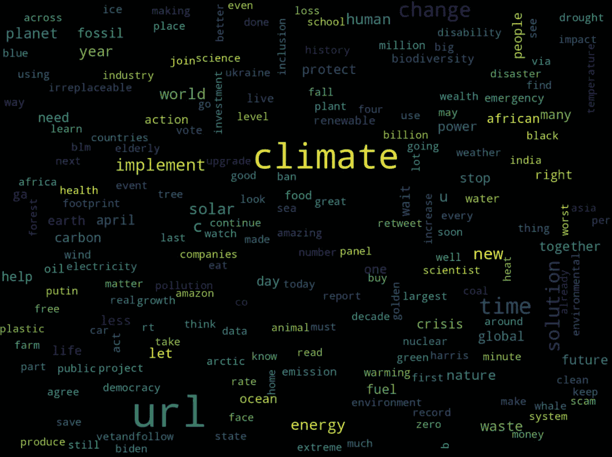
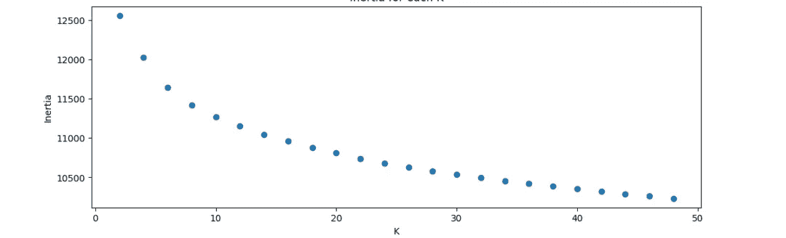

# 关于气候的言论：Twitter 数据的 Python 聚类

> 原文：[`towardsdatascience.com/what-people-write-about-climate-twitter-data-clustering-in-python-2fbbd2b95906`](https://towardsdatascience.com/what-people-write-about-climate-twitter-data-clustering-in-python-2fbbd2b95906)

## 使用 K-Means、TF-IDF、Word2Vec 和 Sentence-BERT 对 Twitter 数据进行聚类

[](https://dmitryelj.medium.com/?source=post_page-----2fbbd2b95906--------------------------------)[](https://towardsdatascience.com/?source=post_page-----2fbbd2b95906--------------------------------) [Dmitrii Eliuseev](https://dmitryelj.medium.com/?source=post_page-----2fbbd2b95906--------------------------------)

·发布于 [Towards Data Science](https://towardsdatascience.com/?source=post_page-----2fbbd2b95906--------------------------------) ·阅读时间 21 分钟·2023 年 5 月 15 日

--


推文集群可视化，作者提供的图片

人们对气候、疫情、战争或其他紧迫问题的看法和言论是什么？从社会学角度看，这些问题非常有趣；了解人们意见的当前趋势对科学家、记者或政治家也很有意义。但我们如何获得答案呢？过去，收集数百万人的回应可能是一个昂贵的过程，但今天我们可以从社交网络帖子中获得这些答案。现在有许多社交平台；我选择 Twitter 进行分析基于几个原因：

+   Twitter 最初设计用于发布简短的帖子，这可能更容易分析。至少我希望在文字长度有限的情况下，人们尝试以更简洁的方式分享他们的想法。

+   Twitter 是一个大型社交网络；它成立已近 20 年。到本文撰写时，活跃用户约为 4.5 亿，因此很容易获取大量数据进行分析。

+   Twitter 有一个官方 API，其许可证允许我们将数据用于研究目的。

整个分析可能相当复杂，为了使过程更清晰，我们先描述一下需要实施的步骤。

# 方法论

我们的数据处理管道将包括几个步骤。

+   收集推文并将其保存到 CSV 文件中。

+   清理数据。

+   将文本数据转换为数字形式。我将使用 3 种方法（TF-IDF、Word2Vec 和 Sentence-BERT）来获取文本嵌入，我们将看到哪一种更好。

+   使用 K-Means 算法对数值数据进行聚类，并分析结果。为了数据可视化，我将使用 t-SNE（t-分布随机邻域嵌入）方法，我们还将为最有趣的聚类构建一个词云。

不再赘述，让我们直接开始吧。

# 1\. 加载数据

从 Twitter 收集数据很简单。Twitter 有一个官方 API 和一个[开发者门户](https://developer.twitter.com/en/portal/dashboard)；一个免费账户限制为一个项目，这对于这项任务已经足够。免费账户允许我们获取最近 7 天的推文。我在一个月内收集了数据，每周运行一次代码没有问题。可以手动完成，也可以使用 Apache Airflow、Cron、GitHub Actions 或其他工具进行自动化。如果*历史*数据确实需要，Twitter 还提供了一个特别的[学术研究访问](https://developer.twitter.com/en/products/twitter-api/academic-research)程序。

在[门户](https://developer.twitter.com/)中免费注册后，我们可以为我们的项目获取 API“key”和“secret”。为了访问数据，我使用了一个“[tweepy](https://docs.tweepy.org/en/stable/api.html)”Python 库。该代码允许我们获取所有带有“#climate”标签的推文并将其保存到 CSV 文件中：

```py
import tweepy

api_key = "YjKdgxk..."
api_key_secret = "Qa6ZnPs0vdp4X...."

auth = tweepy.OAuth2AppHandler(api_key, api_key_secret)
api = tweepy.API(auth, wait_on_rate_limit=True)

hashtag = "#climate"

def text_filter(s_data: str) -> str:
    """ Remove extra characters from text """
    return s_data.replace("&amp;", "and").replace(";", " ").replace(",", " ") \
                 .replace('"', " ").replace("\n", " ").replace("  ", " ")

def get_hashtags(tweet) -> str:
    """ Parse retweeted data """
    hash_tags = ""
    if 'hashtags' in tweet.entities:
        hash_tags = ','.join(map(lambda x: x["text"], tweet.entities['hashtags']))
    return hash_tags

def get_csv_header() -> str:
    """ CSV header """
    return "id;created_at;user_name;user_location;user_followers_count;user_friends_count;retweets_count;favorites_count;retweet_orig_id;retweet_orig_user;hash_tags;full_text"

def tweet_to_csv(tweet):
    """ Convert a tweet data to the CSV string """
    if not hasattr(tweet, 'retweeted_status'):
        full_text = text_filter(tweet.full_text)
        hasgtags = get_hashtags(tweet)
        retweet_orig_id = ""
        retweet_orig_user = ""
        favs, retweets = tweet.favorite_count, tweet.retweet_count
    else:
        retweet = tweet.retweeted_status
        retweet_orig_id = retweet.id
        retweet_orig_user = retweet.user.screen_name
        full_text = text_filter(retweet.full_text)
        hasgtags = get_hashtags(retweet)
        favs, retweets = retweet.favorite_count, retweet.retweet_count
    s_out = f"{tweet.id};{tweet.created_at};{tweet.user.screen_name};{addr_filter(tweet.user.location)};{tweet.user.followers_count};{tweet.user.friends_count};{retweets};{favs};{retweet_orig_id};{retweet_orig_user};{hasgtags};{full_text}"
    return s_out

pages = tweepy.Cursor(api.search_tweets, q=hashtag, tweet_mode='extended',
                      result_type="recent",
                      count=100,
                      lang="en").pages(limit)

with open("tweets.csv", "a", encoding="utf-8") as f_log:
    f_log.write(get_csv_header() + "\n")
    for ind, page in enumerate(pages):
        for tweet in page:
            # Get data per tweet
            str_line = tweet_to_csv(tweet)
            # Save to CSV
            f_log.write(str_line + "\n")
```

如我们所见，我们可以获取每条推文的文本正文、标签和用户 ID，但如果推文被转发，我们需要从原始推文中获取数据。其他字段，如点赞数、转发数、地理坐标等，都是可选的，但对未来的分析也可能有趣。一个“wait_on_rate_limit”参数很重要；它允许库在达到 API 调用的免费限制时自动暂停。

运行此代码后，我收到了大约 50,000 条带有“#climate”标签的推文，都是在最近 7 天内发布的。

# 2\. 文本清理和转换

清理数据是自然语言处理中的一个挑战，尤其是在解析社交网络帖子时。有趣的是，没有“唯一正确”的方法。例如，标签可能包含重要信息，但有时用户只是将相同的标签复制粘贴到他们所有的消息中，因此标签与消息正文的相关性可能会有所不同。Unicode 表情符号也可以被清理，但将其转换为文本可能更好，等等。经过一些实验，我开发了一个转换管道，虽然可能不完美，但对这项任务足够有效。

## URLs 和提及的用户名

许多用户只是发布带有 URLs 的推文，通常没有任何评论。保持记录 URL 的事实是很好的，因此我将所有 URLs 转换为虚拟的“#url”标签：

```py
import re

output = re.sub(r"https?://\S+", "#url", s_text)  # Replace links with '#url'
```

Twitter 用户经常在文本中使用“@”标签提及其他人。用户名与文本上下文无关，而且像“@AngryBeaver2021”这样的名字只会增加数据噪声，因此我将它们全部删除：

```py
output = re.sub(r'@\w+', '', output)  # Remove mentioned user names @... 
```

## 标签

转换标签更具挑战性。首先，我使用 NLTK [TweetTokenizer](https://www.nltk.org/api/nltk.tokenize.casual.html) 将句子转换为标记：

```py
from nltk.tokenize import TweetTokenizer

s = "This system combines #solar with #wind turbines. #ActOnClimate now. #Capitalism #climate #economics"
tokens = TweetTokenizer().tokenize(s)
print(tokens)
# > ['This', 'system', 'combines', '#solar', 'with', '#wind', 'turbines', '.', '#ActOnClimate', 'now', '.', '#capitalism', '#climate', '#economics']
```

它有效，但还不够。人们常常在句子中间使用标签，例如“*important #news about the climate*”。在这种情况下，词语“*news*”很重要，需要保留。同时，用户常常在每条消息的末尾添加一堆标签，在大多数情况下，这些标签只是复制和粘贴的，与文本本身并不直接相关。因此，我决定只在句子的末尾移除标签：

```py
while len(tokens) > 0 and tokens[-1].startswith("#"):
    tokens = tokens[:-1]
# Convert array of tokens back to the phrase
s = ' '.join(tokens)
```

这更好，但仍然不够好。人们经常在一个标签中组合几个词，例如上一个例子中的“#ActOnClimate”。我们可以将这个标签拆分为三个词：

```py
tag = "#ActOnClimate"
res = re.findall('[A-Z]+[^A-Z]*', tag)
s = ' '.join(res) if len(res) > 0 else tag[1:]
print(s)
# > Act On Climate
```

作为这一阶段的最终结果，短语“*This system combines #solar with #wind turbines. #ActOnClimate now. #Capitalism #climate #economics*”将被转换为“*This system combines #solar with #wind turbines. Act On Climate now.*”。

## 移除短推文

许多用户经常发布没有任何文本的图片或视频。在这种情况下，消息体几乎是空的。这些帖子在分析中大多无用，因此我只保留长度超过 32 个字符的句子在数据框中。

## 词形还原

词形还原是将单词转换为其原始规范形式的过程。

```py
import spacy
nlp = spacy.load('en_core_web_sm')

s = "I saw two mice today!"

print(" ".join([token.lemma_ for token in nlp(s)]))
# > I see two mouse today !
```

对文本进行词形还原可以减少文本中的单词数量，聚类算法可能会更有效。一个 [spaCy 词形还原器](https://spacy.io/api/lemmatizer) 正在分析整个句子；例如，“I saw a mouse”和“cut wood with a saw”这两个短语将为“saw”提供不同的结果。因此，词形还原器应该在清理停用词之前调用。

这些步骤足以清理推文。当然，没有什么是完美的，但对我们的任务来说，这看起来已经足够好了。对于希望自行实验的读者，完整的代码如下：

```py
import re
import pandas as pd
from nltk.tokenize import TweetTokenizer

from nltk.corpus import stopwords
stop = set(stopwords.words("english"))

import spacy
nlp = spacy.load('en_core_web_sm')

def remove_stopwords(text) -> str:
    """ Remove stopwords from text """
    filtered_words = [word for word in text.split() if word.lower() not in stop]
    return " ".join(filtered_words)

def expand_hashtag(tag: str):
    """ Convert #HashTag to separated words.
    '#ActOnClimate' => 'Act On Climate'
    '#climate' => 'climate' """
    res = re.findall('[A-Z]+[^A-Z]*', tag)
    return ' '.join(res) if len(res) > 0 else tag[1:]

def expand_hashtags(s: str):
    """ Convert string with hashtags.
    '#ActOnClimate now' => 'Act On Climate now' """
    res = re.findall(r'#\w+', s) 
    s_out = s
    for tag in re.findall(r'#\w+', s):
        s_out = s_out.replace(tag, expand_hashtag(tag))
    return s_out

def remove_last_hashtags(s: str):
    """ Remove all hashtags at the end of the text except #url """
    # "Change in #mind AP #News #Environment" => "Change in #mind AP"
    tokens = TweetTokenizer().tokenize(s)
    # If the URL was added, keep it
    url = "#url" if "#url" in tokens else None
    # Remove hashtags
    while len(tokens) > 0 and tokens[-1].startswith("#"):
        tokens = tokens[:-1]
    # Restore 'url' if it was added
    if url is not None:
        tokens.append(url)
    return ' '.join(tokens) 

def lemmatize(sentence: str) -> str:
    """ Convert all words in sentence to lemmatized form """
    return " ".join([token.lemma_ for token in nlp(sentence)])

def text_clean(s_text: str) -> str:
    """ Text clean """
    try:
        output = re.sub(r"https?://\S+", "#url", s_text)  # Replace hyperlinks with '#url'
        output = re.sub(r'@\w+', '', output)  # Remove mentioned user names @... 
        output = remove_last_hashtags(output)  # Remove hashtags from the end of a string
        output = expand_hashtags(output)  # Expand hashtags to words
        output = re.sub("[^a-zA-Z]+", " ", output) # Filter
        output = re.sub(r"\s+", " ", output)  # Remove multiple spaces
        output = remove_stopwords(output)  # Remove stopwords
        return output.lower().strip()
    except:
        return ""

def text_len(s_text: str) -> int:
    """ Length of the text """
    return len(s_text)

df = pd.read_csv("tweets.csv", sep=';', dtype={'id': object, 'retweet_orig_id': object, 'full_text': str, 'hash_tags': str}, lineterminator='\n')
df['text_clean'] = df['full_text'].map(text_clean)

df['text_len'] = df['text_clean'].map(text_len)
df = df[df['text_len'] > 32]

display(df)
```

作为额外收获，使用干净的文本，我们可以轻松绘制词云：

```py
from wordcloud import WordCloud
import matplotlib.pyplot as plt  

def draw_cloud(column: pd.Series, stopwords=None):
    all_words = ' '.join([text for text in column]) 

    wordcloud = WordCloud(width=1600, height=1200, random_state=21, max_font_size=110, collocations=False, stopwords=stopwords).generate(all_words) 
    plt.figure(figsize=(16, 12)) 
    plt.imshow(wordcloud, interpolation="bilinear") 
    plt.axis('off')
    plt.show()

draw_cloud(df['text_clean'])
```

结果如下：



从清理后的文本中生成的词云，图片由作者提供

这还不是实际的分析，但这张图片已经能提供一些关于人们讨论气候的见解。例如，我们可以看到人们经常发布链接（“URL”是云图中最大的词），以及“energy”、“waste”、“fossil”或“crisis”等词也是相关且重要的。

# 3\. 向量化

文本向量化是将文本数据转换为数值表示的过程。大多数算法，包括 K-Means 聚类，都需要向量而不是纯文本。而且转换本身并不简单。挑战不仅仅是*以某种方式*为所有单词分配一些随机向量；理想情况下，单词到向量的转换应该保持这些单词在原始语言中的关系。

我将测试三种不同的方法，我们可以看到每种方法的优缺点。

## TF-IDF

[TF-IDF](https://en.wikipedia.org/wiki/Tf%E2%80%93idf)（词频-逆文档频率）是一个相当古老的算法；早在 1970 年代就提出了一个称为 IDF 的术语加权函数。TF-IDF 的结果基于数字统计，其中 TF（词频）是单词在文档中出现的次数（在我们的例子中是推文中），而 IDF（逆文档频率）显示了相同单词在文本语料库（文档全集）中出现的频率。特定单词的得分越高，该词在特定推文中的重要性就越大。

在处理真实数据集之前，让我们考虑一个简单的例子。两个去除停用词的推文，第一个关于气候，第二个关于猫：

```py
from sklearn.feature_extraction.text import TfidfVectorizer

docs = ["climate change . information about climate important", 
        "my cat cute . love cat"]

tfidf = TfidfVectorizer()
vectorized_docs = tfidf.fit_transform(docs).todense()

print("Shape:", vectorized_docs.shape)
display(pd.DataFrame(vectorized_docs, columns=tfidf.get_feature_names_out()))
```

结果如下所示：


如我们所见，我们从两个推文中得到了两个向量。向量中的每个数字与特定推文中单词的“重要性”成正比。例如，“climate”一词在第一条推文中出现了两次，因此在第一条推文中它的值很高，而在第二条推文中它的值为零（显然，“cat”一词的输出则相反）。

让我们在之前收集的真实数据集上尝试相同的方法：

```py
docs = df["text_clean"].values

tfidf = TfidfVectorizer()
vectorized_docs = np.asarray(tfidf.fit_transform(docs).todense())

print("Shape:", vectorized_docs.shape)
# > Shape: (19197, 22735)
```

TfidfVectorizer 完成了任务；它将每条推文转换为一个向量。向量的维度等于语料库中*单词的总数*，这相当庞大。在我的案例中，19,197 条推文有 22,735 个唯一的标记，最终得到了一个 19,197x22,735 的矩阵！使用这样一个矩阵可能会很具挑战性，即使对于现代计算机也是如此。

我们将在下一步对这些数据进行聚类，但在此之前，让我们测试其他向量化方法。

## Word2Vec

Word2Vec 是另一种词向量化方法；有关此方法的第一篇论文是 [Tomas Mikolov 于 2013 年在 Google 介绍的](https://arxiv.org/pdf/1310.4546.pdf)。实现中提供了不同的算法（[Skip-gram 和 CBOW 模型](https://radimrehurek.com/gensim/models/word2vec.html)）；一般思想是对大型文本语料库进行模型训练，从而获得准确的词到向量的表示。该模型能够学习不同单词之间的关系，如原始论文中所示：


PCA 投影的国家和首都向量，来源 © [`arxiv.org/pdf/1310.4546.pdf`](https://arxiv.org/pdf/1310.4546.pdf)

可能最著名的使用此模型的例子是“king”、“man”和“queen”之间的关系。那些对细节感兴趣的人可以阅读 这篇很好的文章。

对于我们的任务，我将使用一个[预训练向量](https://code.google.com/archive/p/word2vec/)文件。这个模型是用 Google 新闻数据集训练的；文件包含 300 万词和短语的向量。在使用真实数据集之前，我们先考虑一个玩具示例：

```py
from gensim.models import Word2Vec, KeyedVectors
from gensim.models.doc2vec import Doc2Vec, TaggedDocument

word_vectors = KeyedVectors.load_word2vec_format('GoogleNews-vectors-negative300.bin', binary=True)

print("Shape:", word_vectors["climate"].shape)
display(word_vectors["climate"])
```

结果如下所示：


正如我们所看到的，单词“climate”被转换成了一个 300 位长度的数组。

使用 Word2Vec，我们可以为每个词获得嵌入，但我们需要整个推文的嵌入。作为最简单的方法，我们可以使用词嵌入的算术运算并获取所有向量的均值：

```py
from nltk import word_tokenize

def word2vec_vectorize(text: str):
    """ Convert text document to the embedding vector """    
    vectors = []
    tokens = word_tokenize(text)
    for token in tokens:
        if token in word_vectors:
            vectors.append(word_vectors[token])

    return np.asarray(vectors).mean(axis=0) if len(vectors) > 0 else np.zeros(word_vectors.vector_size)
```

这是因为具有相似意义的词被转换成接近的向量，反之亦然。通过这种方法，我们可以将所有的推文转换成嵌入向量：

```py
docs = df["text_clean"].values

vectorized_docs = list(map(word2vec_vectorize, docs))
print("Shape:", vectorized_docs.shape)

# > Shape: (22535, 300)
```

正如我们所看到的，与 TF-IDF 方法相比，Word2Vec 的输出在内存使用上要高效得多。我们为每条推文有 300 维的向量，输出矩阵的形状是 19,197x300，而不是 19,197x22,735——内存占用差异为 75 倍！

[Doc2Vec](https://radimrehurek.com/gensim/models/doc2vec.html)是另一种模型，相比“简单”平均方法，它在生成文档嵌入方面可能更有效；它特别为文档的向量表示设计的。但在写这篇文章时，我没有找到预训练的 Doc2Vec 模型。读者可以自行尝试。

## Sentence-BERT

在前一步中，我们使用 Word2Vec 获得了词嵌入。它有效，但这种方法有一个明显的缺点。Word2Vec 不考虑词的上下文；例如，“bank”这个词在句子“the river bank”和“the bank of England”中会得到相同的嵌入。为了解决这个问题并获得更准确的嵌入，我们可以尝试另一种方法。BERT（Bidirectional Encoder Representations from Transformer）语言模型于[2018 年推出](https://arxiv.org/abs/1810.04805)。它是在被遮蔽的文本句子上训练的，其中每个词的位置和上下文确实很重要。BERT 最初并不是为了计算嵌入而设计的，但事实证明，从 BERT 层中提取嵌入是一种有效的方法（2019 年和 2020 年的那些 TDS 文章提供了更多细节：[1](https://medium.com/towards-data-science/nlp-extract-contextualized-word-embeddings-from-bert-keras-tf-67ef29f60a7b)，[2](https://medium.com/towards-data-science/text-classification-with-no-model-training-935fe0e42180)）。

如今，几年后，情况已有所改善，我们不需要手动从 BERT 中提取原始嵌入；像[Sentence Transformers](https://github.com/UKPLab/sentence-transformers)这样的特别项目专门为此设计。在处理真实数据集之前，我们先考虑一个玩具示例：

```py
from sentence_transformers import SentenceTransformer

docs = ['the influence of human activity on the warming of the climate system has evolved from theory to established fact', 
        'cats can jump 5 times their own height']

model = SentenceTransformer('all-MiniLM-L6-v2')
vectorized_docs = model.encode(np.asarray(docs))

print("Shape:", vectorized_docs.shape)
# > Shape: (2, 384)
```

作为输出，我们得到了两个 384 维度的向量用于我们的句子。如我们所见，使用模型很简单，甚至不需要移除停用词；该库会自动处理所有这些。

现在让我们获取推文的嵌入。由于 BERT 词嵌入对词语上下文敏感，并且该库具有自己的清理和标记化，我不会像之前那样使用“text_clean”列。相反，我只会将推文 URL 和标签转换为文本。“partial_clean”方法使用了本文开头“text_clean”函数的部分代码：

```py
def partial_clean(s_text: str) -> str:
    """ Convert tweet to a plain text sentence """
    output = re.sub(r"https?://\S+", "#url", s_text)  # Replace hyperlinks with '#url'
    output = re.sub(r'@\w+', '', output)  # Remove mentioned user names @... 
    output = remove_last_hashtags(output)  # Remove hashtags from the end of a string
    output = expand_hashtags(output)  # Expand hashtags to words
    output = re.sub(r"\s+", " ", output)  # Remove multiple spaces
    return output

docs = df['full_text'].map(partial_clean).values
vectorized_docs = model.encode(np.asarray(docs))
print("Shape:", vectorized_docs.shape)

# > Shape: (19197, 384)
```

作为句子变换器的输出，我们得到了一个 19,197x384 维度的数组。

附带说明一下，BERT 模型在计算上比 Word2Vec 要“重”得多。计算 19,197 条推文的向量在一个 12 核 CPU 上花费了大约 80 秒，而 Word2Vec 只需 1.8 秒。这在进行这种测试时不是问题，但在云环境中使用可能会更昂贵。

# 4\. 聚类与可视化

最后，我们接近本文的最后部分。在之前的步骤中，我们获得了 3 个“vectorized_docs”数组的版本，这些版本通过使用 3 种方法生成：TF-IDF、Word2Vec 和 Sentence-BERT。让我们将这些嵌入进行分组，并查看可以提取哪些信息。

为此，让我们首先创建几个辅助函数：

```py
from sklearn.cluster import KMeans
from sklearn.metrics import silhouette_score

def make_clustered_dataframe(x: np.array, k: int) -> pd.DataFrame:
    """ Create a new dataframe with original docs and assigned clusters """
    ids = df["id"].values
    user_names = df["user_name"].values
    docs = df["text_clean"].values
    tokenized_docs = df["text_clean"].map(text_to_tokens).values

    km = KMeans(n_clusters=k).fit(x)
    s_score = silhouette_score(x, km.labels_)
    print(f"K={k}: Silhouette coefficient {s_score:0.2f}, inertia:{km.inertia_}")

    # Create new DataFrame
    data_len = x.shape[0]
    df_clusters = pd.DataFrame({
        "id": ids[:data_len],
        "user": user_names[:data_len],
        "text": docs[:data_len],
        "tokens": tokenized_docs[:data_len],
        "cluster": km.labels_,
    })
    return df_clusters

def text_to_tokens(text: str) -> List[str]:
    """ Generate tokens from the sentence """
    # "this is text" => ['this', 'is' 'text']
    tokens = word_tokenize(text)  # Get tokens from text
    tokens = [t for t in tokens if len(t) > 1]  # Remove short tokens
    return tokens

# Make clustered dataframe
k = 30
df_clusters = make_clustered_dataframe(vectorized_docs, k)
with pd.option_context('display.max_colwidth', None):
    display(df_clusters)
```

我正在使用 [SciKit-learn KMeans](https://scikit-learn.org/stable/modules/generated/sklearn.cluster.KMeans.html) 进行 **K-Means 聚类**。一个“make_clustered_dataframe”方法创建了一个包含原始推文和一个新“cluster”列的数据框。在使用 K-Means 时，我们还有两个指标可以帮助我们评估结果。**惯性**可以用来衡量聚类质量。它是通过测量所有聚类点与聚类中心之间的距离来计算的，值越低越好。另一个有用的指标是 **轮廓系数**；该值的范围为 [-1, 1]。如果值接近 1，则聚类分离良好；如果值接近 0，则距离不显著；如果值为负，则表示聚类重叠。

“make_clustered_dataframe”的输出如下所示：


这确实有效，但仅使用这些信息，很难判断聚类是否足够好。让我们添加另一个辅助方法来显示 **最佳聚类**，按轮廓系数排序。我使用 [SciKit-learn silhouette_samples](https://scikit-learn.org/stable/modules/generated/sklearn.metrics.silhouette_samples.html) 方法来计算这个。我还会使用 **词云** 来可视化每个聚类：

```py
from sklearn.metrics import silhouette_samples

def show_clusters_info(x: np.array, k: int, cdf: pd.DataFrame):
    """ Print clusters info and top clusters """
    labels = cdf["cluster"].values
    sample_silhouette_values = silhouette_samples(x, labels)

    # Get silhouette values per cluster    
    silhouette_values = []
    for i in range(k):
        cluster_values = sample_silhouette_values[labels == i]
        silhouette_values.append((i, 
                                  cluster_values.shape[0], 
                                  cluster_values.mean(), 
                                  cluster_values.min(), 
                                  cluster_values.max()))
    # Sort
    silhouette_values = sorted(silhouette_values, 
                               key=lambda tup: tup[2], 
                               reverse=True)

    # Show clusters, sorted by silhouette values
    for s in silhouette_values:
        print(f"Cluster {s[0]}: Size:{s[1]}, avg:{s[2]:.2f}, min:{s[3]:.2f}, max: {s[4]:.2f}")

    # Show top 7 clusters
    top_clusters = []
    for cl in silhouette_values[:7]:
        df_c = cdf[cdf['cluster'] == cl[0]]

        # Show cluster
        with pd.option_context('display.max_colwidth', None):
            display(df_c[["id", "user", "text", "cluster"]])

        # Show words cloud
        s_all = ""
        for tokens_list in df_c['tokens'].values:
            s_all += ' '.join([text for text in tokens_list]) + " "            
        draw_cloud_from_words(s_all, stopwords=["url"])

        # Show most popular words
        vocab = Counter()
        for token in df_c["tokens"].values:
            vocab.update(token)
        display(vocab.most_common(10))

def draw_cloud_from_words(all_words: str, stopwords=None):
    """ Show the word cloud from the list of words """
    wordcloud = WordCloud(width=1600, height=1200, random_state=21, max_font_size=110, collocations=False, stopwords=stopwords).generate(all_words) 
    plt.figure(figsize=(16, 12)) 
    plt.imshow(wordcloud, interpolation="bilinear") 
    plt.axis('off')
    plt.show()

show_clusters_info(vectorized_docs, k, df_clusters)
```

在使用 K-Means 方法之前，下一步重要的问题是选择“**K**”，即最佳簇数。[**肘部法**](https://en.wikipedia.org/wiki/Elbow_method_(clustering))是一种流行的技术；其思路是构建不同 K 值的惯性值图。图中的“肘部”点（至少理论上）是最佳 K 值。实际上，它很少如预期般工作，尤其是对于结构不佳的数据集，如向量化的推文，但该图可以提供一些见解。让我们制作一个辅助方法来绘制肘部图：

```py
import matplotlib.pyplot as plt  
%matplotlib inline

def graw_elbow_graph(x: np.array, k1: int, k2: int, k3: int):
    k_values, inertia_values = [], []
    for k in range(k1, k2, k3):
        print("Processing:", k)
        km = KMeans(n_clusters=k).fit(x)
        k_values.append(k)
        inertia_values.append(km.inertia_)

    plt.figure(figsize=(12,4))
    plt.plot(k_values, inertia_values, 'o')
    plt.title('Inertia for each K')
    plt.xlabel('K')
    plt.ylabel('Inertia')

graw_elbow_graph(vectorized_docs, 2, 50, 2)
```

## 可视化

作为一个额外的点，让我们添加最后一个（我保证这是最后一个:) 辅助方法，将所有簇绘制在 2D 平面上。我想大多数读者还不能在脑海中可视化 300 维的向量 ;) 所以我将使用[**t-SNE**](https://scikit-learn.org/stable/modules/generated/sklearn.manifold.TSNE.html)（T-分布随机邻域嵌入）降维方法将维度减少到 2，并使用[Bokeh](https://github.com/bokeh/bokeh)绘制结果：

```py
from sklearn.decomposition import PCA
from sklearn.manifold import TSNE

from bokeh.io import show, output_notebook, export_png
from bokeh.plotting import figure, output_file
from bokeh.models import ColumnDataSource, LabelSet, Label, Whisker, FactorRange
from bokeh.transform import factor_cmap, factor_mark, cumsum
from bokeh.palettes import *
from bokeh.layouts import row, column
output_notebook()

def draw_clusters_tsne(docs: List, cdf: pd.DataFrame):
    """ Draw clusters using TSNE """
    cluster_labels = cdf["cluster"].values
    cluster_names = [str(c) for c in cluster_labels]

    tsne = TSNE(n_components=2, verbose=1, perplexity=50, n_iter=300, 
                init='pca', learning_rate='auto')
    tsne_results = tsne.fit_transform(vectorized_docs)

    # Plot output
    x, y = tsne_results[:, 0], tsne_results[:, 1]
    source = ColumnDataSource(dict(x=x, 
                                   y=y, 
                                   labels=cluster_labels,
                                   colors=cluster_names))
    palette = (RdYlBu11 + BrBG11 + Viridis11 + Plasma11 + Cividis11 + RdGy11)[:len(cluster_names)]

    p = figure(width=1600, height=900, title="")
    p.scatter("x", "y",
              source=source, fill_alpha=0.8, size=4,
              legend_group='labels',
              color=factor_cmap('colors', palette, cluster_names)
              )
    show(p)

draw_clusters_tsne(vectorized_docs, df_clusters)
```

现在我们准备好查看结果了，让我们看看可以得到什么。

# 结果

我使用了三种不同的（TF-IDF、Word2Vec 和 Sentence-BERT）算法将文本转换为嵌入向量，它们在架构上差异很大。它们是否都能在所有推文中找到有趣的模式？让我们检查一下结果。

## TF-IDF

在 TF-IDF 嵌入中寻找簇的主要缺点是数据量大。在我的例子中，矩阵大小为 19,197x22,735，因为文本语料库包含 19,197 条推文和 22,735 个唯一标记。即使对于现代 PC，在如此大的矩阵中寻找簇也并不快。

一般来说，TF-IDF 向量化没有提供特别出色的结果，但 K-Means 仍然能够找到一些有趣的簇。例如，从所有 19,197 条推文中，检测到一个包含 200 条推文的簇，其中人们在发帖关于国际在线论坛：


文本簇词云，图片由作者提供

K-Means 也能够找到一些发布了大量类似帖子用户：


在这种情况下，昵称为“**mickel**”的用户可能在尝试推广他的在线书籍（顺便说一句，显示消息 ID 对调试很有用；我们可以随时在浏览器中打开原始推文），并且他发布了很多类似的帖子。这些帖子并不完全相似，但算法能够将它们聚类在一起。这种方法在检测用于发布垃圾邮件的账户时可能会很有用。

在 TF-IDF 向量中发现了一些有趣的簇，但大多数其他簇的轮廓值接近零。t-SNE 可视化显示了相同的结果。图中有一些局部群体，但大多数点相互重叠：


t-SNE 对 TF-IDF 生成的向量的可视化，图片由作者提供

我看到一些文章中，作者使用 TF-IDF 嵌入取得了良好的结果，主要是在文本属于不同领域的情况下。例如，关于“政治”、“体育”和“宗教”的帖子可能会形成更多隔离的聚类，并具有较高的轮廓系数值。但在我们的案例中，*所有文本*都关于气候，因此任务更具挑战性。

## Word2Vec

使用 Word2Vec 得到的第一个有趣的结果是——肘部方法能够产生一个相对明显的“肘部”点：



Word2Vec 嵌入的肘部图，图片由作者提供

使用 K=8，t-SNE 可视化得到了这个结果：


t-SNE 对 Word2Vec 生成的向量的可视化，图片由作者提供

大多数聚类仍然重叠，并且轮廓系数值普遍较低。但可以发现一些有趣的模式。

“气候变化”。这个聚类包含了最流行的词汇“气候”、“变化”、“行动”和“全球”：


很多人显然对气候变化感到担忧，所以有这个聚类是显而易见的。

“燃料”。这个聚类包含了诸如“能源”、“碳”、“排放”、“化石”或“太阳能”等流行词汇：


“环境”。这里我们可以看到如“温度”、“海洋”、“海”、“冰”等词汇。


## Sentence-BERT

理论上，这些嵌入应该提供最准确的结果；让我们看看实际情况如何。t-SNE 的聚类可视化如下：


t-SNE 对 Sentence-BERT 生成的向量的可视化，图片由作者提供

如我们所见，可以找到许多本地聚类，我将展示其中一些最有趣的聚类。

“冰川融化”。一个包含了最流行词汇“气候”、“冰”、“融化”、“冰川”和“北极”的聚类：


“地球日”。这一天在数据收集时是四月庆祝的，存在一个包含“地球”、“日”、“星球”、“快乐”或“行动”等词汇的消息聚类：


“全球国际论坛”：


这个结果有两个有趣的原因。首先，我们之前见过这个聚类；K-Means 算法在 TF-IDF 嵌入中发现了它。其次，“Word2Vec”模型的词典中没有“thereisa”这个词，因此它被跳过了。BERT 有更好的分词方案，其中未知词被拆分成更小的标记。我们可以很容易地看到它是如何工作的：

```py
model = SentenceTransformer('all-MiniLM-L6-v2')

inputs = model.tokenizer(["thereisa online forum"])
tokens = [e.tokens for e in inputs.encodings]

print(tokens)
# > [['[CLS]', 'there', '##isa', 'online', 'forum', '[SEP]']]
```

我们可以看到，“online”和“forum”这些词被转换成了单一的标记，但“thereisa”被分解成了两个词“there”和“##isa”。这不仅使 BERT 能处理未知词汇，而且实际上更接近我们作为人类的做法：当我们遇到未知词汇时，我们常常试图“拆分”它们并猜测其含义。

但让我们进一步探讨。另一个明显的组与抗议有关；我们可以看到如“protest”，“change”，“action”，“activism”等词汇：


最后但同样重要的是，另一个受欢迎的气候相关话题是电动交通。我们可以看到像“new”，“electric”，“car”或“emission”等词：


# 结论

通过文本聚类，我们能够处理来自社交网络的原始和非结构化文本（在我们的案例中是 Twitter，但这种方法也适用于其他平台），并发现数万用户帖子的有趣和独特的模式。这不仅对于像文化人类学或社会学研究这样的纯学术原因重要，也对像检测机器人或发布垃圾信息的用户这样的“实用”案例至关重要。

从自然语言处理的角度来看，社交媒体数据的聚类是一个有趣且富有挑战性的课题。它具有挑战性的原因在于数据清洗和转换的方法多种多样，没有一种方法是完美的。在我们的案例中，BERT 嵌入毫无悬念地提供了比早期的 TF-IDF 和 Word2Vec 模型更好的结果。BERT 不仅能提供良好的结果，而且在处理未知词汇方面也表现得更好，而这可能是 Word2Vec 的一个问题。就我而言，TF-IDF 嵌入并未展示出任何卓越的结果，但这种方法仍然有其优势。TF-IDF 基于纯粹的统计数据，不需要预训练的语言模型。因此，在那些没有可用预训练模型的稀有语言情况下，可以使用 TF-IDF。

本文提供了一种“低级别”的方法，这种方法更适合理解事物的工作原理，我鼓励读者自己做一些实验；文章中的源代码应该足够进行这些实验。同时，那些只想在 10 行代码中获得结果而不想考虑“底层”实现的人，可以尝试像 [BERTopic](https://github.com/MaartenGr/BERTopic) 这样的现成库。

如果你喜欢这个故事，可以随时 [订阅](https://medium.com/@dmitryelj/membership) Medium，你将会在我的新文章发布时收到通知，并且可以全面访问其他作者的成千上万篇故事。

感谢阅读。
