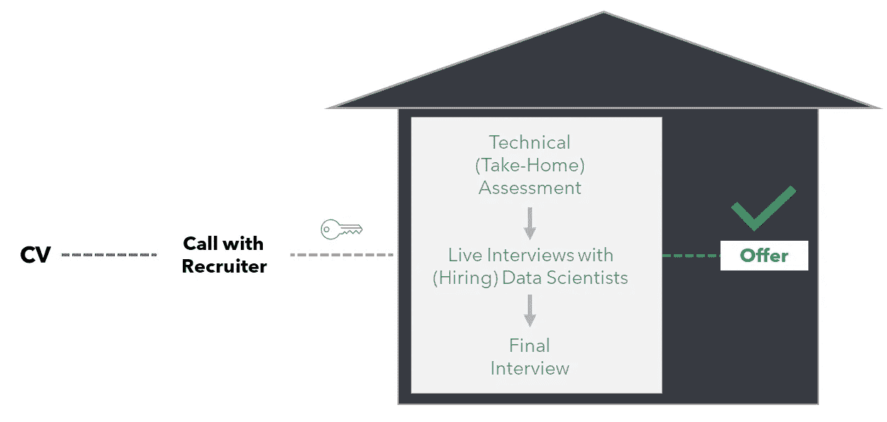

# 什么阻碍了你获得第一个数据科学工作？

> 原文：[`towardsdatascience.com/what-stops-you-from-getting-your-first-data-science-job-ccf93e4187d4?source=collection_archive---------8-----------------------#2023-03-23`](https://towardsdatascience.com/what-stops-you-from-getting-your-first-data-science-job-ccf93e4187d4?source=collection_archive---------8-----------------------#2023-03-23)

## 数据科学面试流程和获得第一个工作机会的步骤

 [亚历克斯·瓦姆瓦卡里斯](https://medium.com/@alex.vamvakaris.ds?source=post_page-----ccf93e4187d4--------------------------------)

·

[关注](https://medium.com/m/signin?actionUrl=https%3A%2F%2Fmedium.com%2F_%2Fsubscribe%2Fuser%2F8072260dd591&operation=register&redirect=https%3A%2F%2Ftowardsdatascience.com%2Fwhat-stops-you-from-getting-your-first-data-science-job-ccf93e4187d4&user=Alex+Vamvakaris&userId=8072260dd591&source=post_page-8072260dd591----ccf93e4187d4---------------------post_header-----------) 发表在 [迈向数据科学](https://towardsdatascience.com/?source=post_page-----ccf93e4187d4--------------------------------) ·12 分钟阅读·2023 年 3 月 23 日

--

图片由 [Rod Long](https://unsplash.com/@rodlong?utm_source=unsplash&utm_medium=referral&utm_content=creditCopyText) 提供，来源于 [Unsplash](https://unsplash.com/photos/7oGqlI-edAU?utm_source=unsplash&utm_medium=referral&utm_content=creditCopyText)

尽管有很多关于如何成为数据科学家的博客、视频和教程，但许多资源都存在我所称之为“知识的诅咒”。那是什么呢？大多数这些资源都是由那些已经当了很长时间数据科学家的人创建的，因此他们已经忘记了获得第一份数据科学家工作的瓶颈和困难。

我记得当我开始申请伦敦的数据科学职位时（那时我作为数据分析师已有两年多的经验），在几乎所有阶段都遭遇了很多拒绝。我可能提交了数百份申请，才能让只有几个进入下一阶段。即使是那些通过筛选过程的申请，也经历了很多拒绝，才最终获得了第一份 offer。实际上，有时候我决定完全放弃（有时甚至几个月），因为我相信成为数据科学家的梦想无法实现。有时我希望能回到过去，帮助自己导航数据科学面试流程中的复杂性和未知，并挽回一些失去的时间。

鉴于这一点，我想以稍微不同的方式构建这篇文章。我们不会完全忽略技术要求如统计学、编程和机器学习（别担心，我们还是会涵盖这些内容），而是希望创建一个专注于面试过程各个阶段以及如何集中精力以获得你的第一个 offer 的指南。具体来说，文章将按以下结构展开：

1.  **绘制数据科学面试流程图**

1.  **用你的简历打开大门**

1.  **技术（回家）评估**

1.  **与招聘数据科学家的现场面试**

1.  **从错误中学习**

# 1\. 数据科学面试流程图

由 [Brett Zeck](https://unsplash.com/@iambrettzeck?utm_source=unsplash&utm_medium=referral&utm_content=creditCopyText) 拍摄，来源于 [Unsplash](https://unsplash.com/photos/eyfMgGvo9PA?utm_source=unsplash&utm_medium=referral&utm_content=creditCopyText)

大多数入门级数据科学职位的面试过程通常包括三到五个阶段。虽然这些阶段会根据你希望成为的数据科学家的类型和你申请的公司有所不同，但基本构成是相同的。

前两个阶段是筛选过程的一部分。这些是你的 **简历（CV）** 和 **与招聘人员的初步电话**。此时，你仍在敲打公司的大门。目的是将候选人池缩小到一个较小的群体，这些人将被邀请“进入屋内”。

一旦进入公司，你仍然需要证明自己具备足够的资格。换句话说，你需要展示你拥有合适的态度和技能组合，使他们愿意雇佣你，同时能够对这一选择做出合理的解释。这可以分为以下三个阶段（注意，并非所有阶段都出现在每个面试过程中）：

+   **技术（家庭作业）评估：** 这一阶段旨在测试你的逻辑思维能力和统计与编程（SQL、R 或 Python）的水平。本质上，他们希望评估你的基础知识是否足够，能够进一步进入公司。

+   **与（招聘）数据科学家的现场面试**：这一阶段涉及视频通话（在 Covid 后），高级或首席数据科学家将要求你解决问题并回答基于你在被雇佣后需要完成的日常任务的问题。此时，你已经完全进入了公司。

+   **最终面试：** 这一阶段并非总是存在，但在成熟的数据科学团队中，作为最后的关卡，你将与数据科学团队的高级领导（负责人或总监）进行简短的通话。目的是让他们了解你并给出“绿灯”或发现任何红旗。

数据科学面试流程 [作者提供的图像]

现在我们对各个阶段有了更好的理解，让我们深入探讨每一个阶段，以便你更好地理解它们的结构以及如何应对，以获得你的第一份数据科学角色。

# 2\. 用你的简历打开大门

照片由 [João Ferrão](https://unsplash.com/@joaoscferrao?utm_source=unsplash&utm_medium=referral&utm_content=creditCopyText) 在 [Unsplash](https://unsplash.com/photos/4YzrcDNcRVg?utm_source=unsplash&utm_medium=referral&utm_content=creditCopyText) 提供

在创建简历时，仔细考虑你想成为哪种类型的数据科学家。如果你想打造合适的钥匙，首先应考虑你希望它打开哪种类型的门。有两种主要类型的（入门）数据科学家职位（即门）：

+   **分析数据科学家：** 主要职责是 AB 测试、对广告活动、优惠或产品进行临时分析，并构建简单（主要是探索性）的机器学习模型，例如聚类。

+   **核心数据科学家：** 主要职责是构建可以投入生产环境的预测模型（具有最高的准确性）。

如果你想了解更多关于不同类型的数据科学家角色及其日常任务，你还可以查看下面的视频。

虽然典型的钥匙是一个小块形状金属，上面有切口以适配特定锁的钥匙孔，但你的简历将包含 **关键词** 和 **工作经验**。

不幸的是，即使你打造了正确的“钥匙”，在这个阶段的成功率仍将是整个面试过程中最低的。这主要是由于这个阶段的随机性和匆忙性（你可能听说过，大多数简历在做出决定之前只会被查看 2 到 3 秒）。

尽管申请后没有回应可能会让人感到沮丧，但另一方面，你也获得了所有需要的“弹药”来打造合适的“钥匙”。大多数职位描述通常会列出这些关键词，因此你需要做的是 a) 确定哪些职位适合你，b) 收集常见的关键词和所需的技能，并 c) 确保它们在你的简历中得到清晰的体现。相信这个简单的过程，凭借适当数量的申请，你将进入下一个阶段（这只是由于大数法则的一个简单情况）。

如前所述，筛选过程的第二部分是与招聘人员的电话面试。这通常持续 15 到 20 分钟，招聘人员首先会给你介绍公司的背景和职位情况。之后，招聘人员会询问你的工作经历、通知期、签证要求、薪资预期以及一些关于职位的问题。常见的问题包括：

+   你能快速介绍一下你的简历/工作经历吗？

+   你对我们公司这个职位感兴趣的地方是什么？

+   在寻找新职位时，你期望得到什么？或者换句话说，你看重哪些任务或职责？

+   你在当前或之前的工作中使用了哪些工具和技术？

尽管这些问题看起来很简单，我建议你练习几次。正如**亚伯拉罕·林肯**所说：“给我六个小时砍树，我会用前四个小时磨快斧子。”

# 3\. 技术（家庭作业）评估

图片由 [Nguyen Dang Hoang Nhu](https://unsplash.com/@nguyendhn?utm_source=unsplash&utm_medium=referral&utm_content=creditCopyText) 提供，来源于 [Unsplash](https://unsplash.com/photos/qDgTQOYk6B8?utm_source=unsplash&utm_medium=referral&utm_content=creditCopyText)

技术性家庭作业通常以一系列问题的形式呈现。这些问题通常包括以下内容：

+   编写一个函数来解决一个简单的问题（比如计算大于 1000 的前 10 个斐波那契数），使用 R 或 Python。

+   给定一个或多个表（通常不超过两个），你需要用 SQL 编写代码来提取或操作数据。这些问题通常从简单开始，例如计算符合某些条件的行总数，最后的问题则需要使用不同类型的连接和窗口函数。

+   给定一个图表或小表格，你需要利用统计学来得出正确的结论。最常见的问题涉及偏斜分布、平均值和中心极限定理。

+   给定一个特定的业务问题，你将被要求写一个简要的提案，说明你会选择哪些 KPI 和分析方法来实现预期结果。

我无法过于强调双重（或三重）检查你的答案和验证代码的重要性。我还建议尽可能将这些检查加入到你的解决方案或代码中。你可以在下面的文章中找到有关 SQL 语句和测试代码的更多信息。

 ## 如何将你的 SQL 从零提升到数据科学家水平 — 第 2/3 部分

### SQL 完全指南：学习数据科学家常用的基础和高级 SQL 查询

[towardsdatascience.com

或者，你可能会被给予一个数据挑战。更具体地说，你将获得一个数据集和一个任务或问题的概述。例如，在我为 Deliveroo 完成的家庭作业中，任务是分析他们的“骑手推荐骑手”项目与其他营销渠道的表现。任务的最后一步涉及向高级非技术利益相关者展示信息摘要，并建议可能的下一步。如果你在这一步需要更多帮助，我推荐阅读下面的指南。

 ## 如何将家庭作业转化为数据科学职位

### 如何从数据集中创建一个引人注目的故事的逐步指南

[towardsdatascience.com

# 4\. **与招聘数据科学家的现场面试**

照片由 [GR Stocks](https://unsplash.com/@grstocks?utm_source=unsplash&utm_medium=referral&utm_content=creditCopyText) 提供，照片来源于 [Unsplash](https://unsplash.com/photos/Iq9SaJezkOE?utm_source=unsplash&utm_medium=referral&utm_content=creditCopyText)

这将是面试过程中最具挑战性的部分。它不仅是一次现场面试，而且难度也是整个流程中最高的。话虽如此，你可以期待得到公平的评价，因为在视频通话期间，你将获得面试官的全部注意力。

在 COVID-19 之前，大多数技术面试都在公司现场（实际上是在‘公司内部’）进行。然而，如今绝大多数面试都是通过 Zoom 或其他视频会议工具进行的。这些面试由一位或两位数据科学家进行，通常包括以下三个部分：

## 4.1 行为/态度评估

在这一部分，问题主要是非技术性的，旨在评估你的软技能和个人特点。常见问题包括：

+   你能描述一个你遇到问题的情况并解释你采取的步骤来解决它吗？

+   讲述一个你引以为豪的项目及其对业务的影响。

在准备你的回答时（遵循我们朋友亚伯拉罕·林肯的建议），重要的是始终记住这些类型的问题没有正确答案。相反，他们寻找的是理解在任何环境中你都会遇到障碍，而真正重要的是展现出毅力和提供价值的能力。**STAR**方法是一个很好的框架，讨论具体的情况、任务、行动和结果。

## 4.2 经验评估

在这一部分，你将被给出一个面试官提出的具体问题，通常基于如果你被录用后需要完成的任务。典型场景包括以下几种：

+   我们最近启动了一个活动或优惠，并希望评估其表现。描述你会如何从头到尾处理这个问题（与业务相关者沟通，理解目标，获取所需数据，分析和展示结果）。

+   描述你将如何为特定功能或倡议设计 AB 测试。

+   如果 AB 测试显示期望的指标在下降，而另一个指标在上升，你会如何决定是否发布或放弃这个功能？

不要害怕向面试官提出澄清问题，并将你的思路阐明给他们。面试官会根据你对模糊描述的理解能力（因为这些描述大多出现在实际环境中）以及你解决问题的方法来评估你。同时，不要犹豫向面试官请求几分钟时间来整理问题后再回答。最后，记住他们在寻找新员工时关注的是为业务提供价值的能力，因此始终以这个北极星为目标来组织你的回答。

## 4.3 技术技能评估

在这一部分，你将被评估在统计学、AB 测试和机器学习方面的技术技能。示例问题包括：

+   你将如何向一个 5 岁的小孩描述 p 值和置信区间？

+   你能解释什么是引导法以及它是如何使用的吗？

+   你将如何在启动 AB 测试前估计样本大小？

+   你将如何分析 AB 测试结果中异常值和测试前的不平衡？

如果你需要复习或了解上述问题，可以在下面的链接中找到关于商业环境中 AB 测试的完整指南。

 [## 我作为数据科学家运行 AB 测试一年的经验——第 1/2 部分]

### 像数据科学家一样设置你的 A/B 测试，按照这些简单的步骤操作。

towardsdatascience.com

我还强烈推荐免费书籍[《统计学习导论：R 语言应用》（An Introduction to Statistical Learning: With Applications in R）](https://www.statlearning.com/)以了解统计学习中的关键主题。书中还涵盖了以下问题：

+   你能解释一下机器学习中的偏差-方差权衡吗？

+   你能描述一下什么是过拟合以及在构建预测模型时如何解决它吗？

+   你能描述一下监督建模和非监督建模之间的区别吗？

+   你能描述一下什么是交叉验证以及它如何用于模型评估吗？

# **5\. 从错误中学习**

由[Patrick Tomasso](https://unsplash.com/@impatrickt?utm_source=unsplash&utm_medium=referral&utm_content=creditCopyText)拍摄的照片，来自[Unsplash](https://unsplash.com/photos/1NTFSnV-KLs?utm_source=unsplash&utm_medium=referral&utm_content=creditCopyText)

面试过程中最被忽视的部分之一是请求反馈。这是可以理解的，因为大多数情况下，你不会得到答案，或者得到的是自动化（没有用的）回复。

我的建议是把获取反馈看作是一个焦点小组。你需要大约十个好的回复，以确定你需要改进的共同领域，但同样重要的是，找出什么做得好，什么应该保持不变。

另一个我想强调的点是，根据公司面试过程的质量进行自我评估的重要性。是否对不同阶段投入了足够的努力，还是看起来像是匆忙完成的？他们是否根据你预期的标准评估你？他们是否花时间和精力给你反馈？即使今天你没有获得那个职位，你也可以在公司上标记一个星号，以便在未来的申请中指示一个需要避免或值得关注的地方。

最后，不要把拒绝看作是失败。你参加的面试越多，你就会越了解目标职位的要求，同样重要的是，你会越发准备好！就像其他任何事情一样，**唯一的提高方式就是通过练习**。就像你第一次骑自行车时一样，你不会期望第一次就成功，也不会因为失败而感到尴尬而放弃。

# 总结

🚀🚀 完成最后一步，我们已经到达了指南的终点。下面，你还可以找到步骤的快速总结：

✅ 确保你对第一个角色的任务和职责有清晰的理解，并使用相关职位描述中的关键词来打造合适的简历（CV）。

✅ 始终以提供业务价值为主要目标来构建你的回答。记住，公司并不单纯寻找统计学或编程的从业者，而是寻找能够从大数据中提供价值的个人。

✅ 练习可能看起来枯燥或重复，但它将对你获得第一个数据科学职位至关重要。

✅ 尽可能地请求反馈，以确定哪些做法有效，哪些需要改进。

# **保持联系！**

如果你喜欢阅读这篇文章并想了解更多内容，不要忘记 [订阅](https://medium.com/@alex.vamvakaris.ds/subscribe)，以便直接将我的故事发送到你的收件箱。

在下面的链接中，你还可以找到一个免费的 PDF 指南，介绍如何使用数据科学技术和最佳实践在实际商业场景中完成客户群体分析。

[## 数据科学项目检查清单 - 有志数据科学家](https://www.aspiringdatascientist.net/community?source=post_page-----ccf93e4187d4--------------------------------)

### 我是一名拥有 7 年以上分析经验的数据科学家，目前在英国伦敦的一家游戏公司工作。我的…

[www.aspiringdatascientist.net](https://www.aspiringdatascientist.net/community?source=post_page-----ccf93e4187d4--------------------------------)
