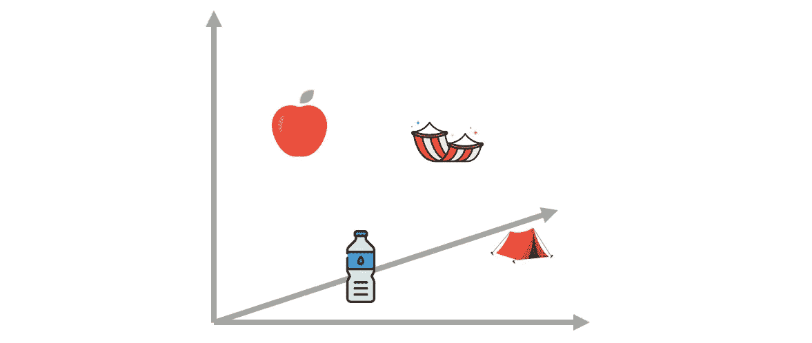
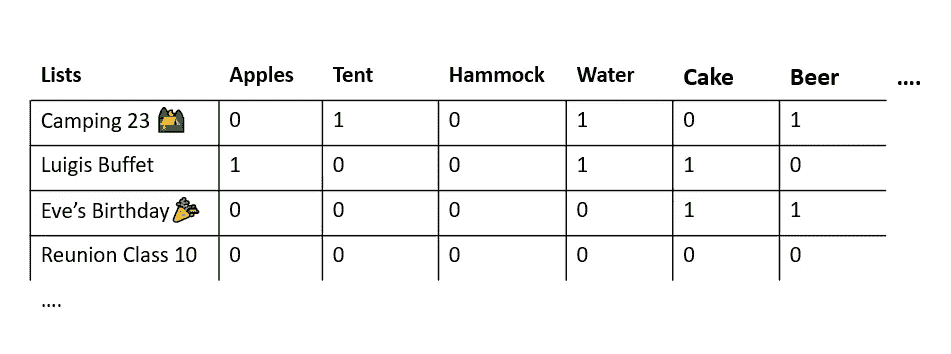
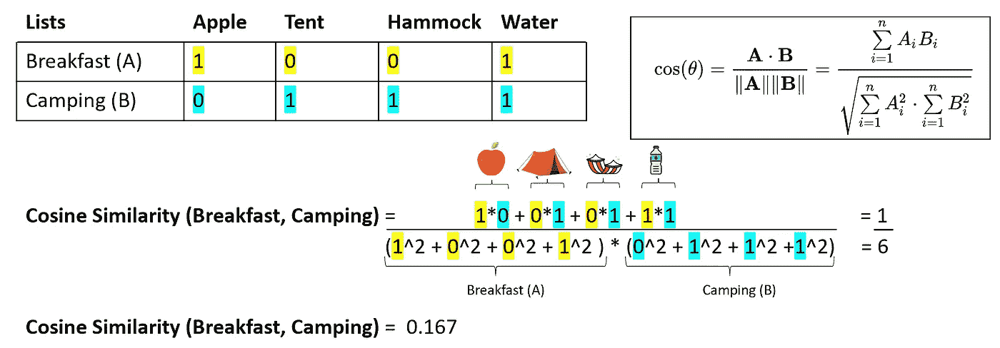
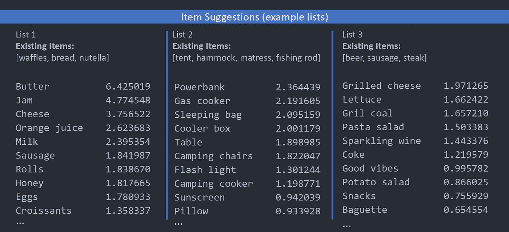

# 带什么？——基于协同过滤的物品建议

> 原文：[`towardsdatascience.com/what-to-bring-item-suggestions-with-collaborative-filtering-6cd260984330?source=collection_archive---------11-----------------------#2023-10-03`](https://towardsdatascience.com/what-to-bring-item-suggestions-with-collaborative-filtering-6cd260984330?source=collection_archive---------11-----------------------#2023-10-03)

## 个性化物品建议基于实际数据和真实案例

[](https://medium.com/@malte.?source=post_page-----6cd260984330--------------------------------)[](https://towardsdatascience.com/?source=post_page-----6cd260984330--------------------------------) [Malte Bleeker](https://medium.com/@malte.?source=post_page-----6cd260984330--------------------------------)

·

[关注](https://medium.com/m/signin?actionUrl=https%3A%2F%2Fmedium.com%2F_%2Fsubscribe%2Fuser%2Fb3f789fe994b&operation=register&redirect=https%3A%2F%2Ftowardsdatascience.com%2Fwhat-to-bring-item-suggestions-with-collaborative-filtering-6cd260984330&user=Malte+Bleeker&userId=b3f789fe994b&source=post_page-b3f789fe994b----6cd260984330---------------------post_header-----------) 发表在 [Towards Data Science](https://towardsdatascience.com/?source=post_page-----6cd260984330--------------------------------) · 7 min 阅读 · 2023 年 10 月 3 日[](https://medium.com/m/signin?actionUrl=https%3A%2F%2Fmedium.com%2F_%2Fvote%2Ftowards-data-science%2F6cd260984330&operation=register&redirect=https%3A%2F%2Ftowardsdatascience.com%2Fwhat-to-bring-item-suggestions-with-collaborative-filtering-6cd260984330&user=Malte+Bleeker&userId=b3f789fe994b&source=-----6cd260984330---------------------clap_footer-----------)

--

[](https://medium.com/m/signin?actionUrl=https%3A%2F%2Fmedium.com%2F_%2Fbookmark%2Fp%2F6cd260984330&operation=register&redirect=https%3A%2F%2Ftowardsdatascience.com%2Fwhat-to-bring-item-suggestions-with-collaborative-filtering-6cd260984330&source=-----6cd260984330---------------------bookmark_footer-----------)

物品建议（作者提供的图片）

生日聚会、共同旅行或与本地运动俱乐部的夏季聚会——像这些事件很美好，直到你需要自己为准备工作做出贡献。通常，这始于一个非常投入的人，他主动开始并推动事情的进展，但迟早，当已经承诺的项目数量不断增加时，你也不得不问这个问题：我将带什么？

各种类型的活动中常见的物品列表已被大量创建，但总是很难想到一个合适的主意来至少免除你一定的社交义务（通常通过默认的“灵丹妙药”，一瓶酒）。由于我们的网络应用提供了数以万计的此类列表，我们能够通过将其转化为基于已存在列表中的项目来建议有前景的项目，从而应对这一挑战。

我们通过利用数据库中约 10 万份列表与用户当前感兴趣的列表之间的相似性来应对这个挑战。利用这种列表与列表之间的相似性，进而推荐合适的项目，也被称为协同过滤，因为目标是将数据库中可能推荐的海量不同项目过滤成仅几个最合适的（实际上在我们的情况下大约是 10 万种不同的项目）。类似的情况通常可以在如书籍或电影推荐系统中找到，通过利用用户已经观看的内容（在我们的例子中是已添加到列表中的项目）来推荐用户可能错过的电影，这些电影被类似用户观看过（在我们的例子中是已被添加到类似列表中的项目）。

**它是如何工作的？ — 一个简单的解释**

第一步是创建一个表格，行是列表（ID），列是所有项目名称。当我们的所有列表仅包含 20 个唯一单词时，我们只需要 20 列，行数等于列表的数量。每当一个单词出现在列表中时，我们就在相应的列和行中添加值“1”，如果一个单词不在列表中则添加“0”（在文本分析中也称为词袋模型）。我们对要进行建议的列表做相同的操作。



列表-项目矩阵的简单示意图（作者提供的图片）

*对于电影或书籍推荐，采用相同的程序，但列会包含数据库中不同的电影或书籍，行会包含不同的用户（ID），值可以指示一本书是否已被阅读，或者它是否以及如何被评分。*

可选：相应的 Python 代码（步骤 1）

```py
# Create the list-item matrix
matrix = df.pivot_table(index='id', columns='what', values='value')

# Matrix Dimensions (126.252 x 179.674) 
# Number of unique listIDs:  126252
# Number of unique items ("what"):  179674
```

这将我们的数据转换为合适的格式，为第二步做好准备——计算数据库中列表与我们希望建议项目的列表之间的相似度。衡量两个行（向量）相似度的最常用方法之一是“余弦距离”或“余弦相似度”。它通过两个行的点积计算，除以两个向量的大小的常规乘积。下面的图形应该使这个计算更易于理解，但这里的重点是对余弦距离的直观理解，对于任何数学上的细节，请参阅[这篇文章](https://cmry.github.io/notes/euclidean-v-cosine)。请也将下面的代码块视为一个可选但补充的附加部分。



计算两个列表/向量之间的余弦相似度（图像由作者提供）

例如，如果两个列表完全相似，它们的余弦相似度为 1，完全没有共同词的列表相似度为 0，而至少有一些共同词的相似度为 0 < x < 1。**余弦相似度值越高，数据库中的列表与我们关注的列表越相似。** 有了这一点，我们可以计算我们列表与表中所有其他列表的相似度，为每一行获取一个相似度分数。接下来，我们对这些行进行排序，并提取最相似的行，可以基于预定义的数量（例如最相似的 50 个列表）或相似度阈值（例如 > 0.6）。在我们的案例中，相似度分数的变化很大，取决于关注列表的项目数量及其具体用途，因此我们为了简化操作选择了最相似的 100 个列表（一个经验法则：我们在这里选择的列表越多，我们的建议将越稳定，但也更通用）。我们现在可以创建一个包含原始列表-单词表副本的新表，只包含这 100 个最相似的列表。

可选：对应的 Python 代码（步骤 2）

```py
# Find the index of the listID "TestList" in the matrix
# (the TestList is the list we would like to get suggestions for)
list_index = matrix.index.get_loc(listID)

# Extract the row of the listID "TestList" from the matrix
list_row = matrix.iloc[list_index]

# Calculate the similarity between the listID "TestList" and all other listIDs
similarities = cosine_similarity([list_row], matrix)[0]

# Return the indices of all lists with a similarity greater than 0.6 and store them with the similarities in a list
#similar_list_indices = np.where(similarities > 0.5)[0]

# Return the indices of the 100 most similar lists
similar_list_indices = np.argsort(similarities)[-100:]

# Extract the corresponding similarities
similarity_scores = similarities[similar_list_indices]

# Create a list of tuples with the listID and the similarity
similar_lists = [(listid_dict[i], similarity) for i, similarity in zip(similar_list_indices, similarity_scores)]

# Convert the indices to listIDs
similar_list_ids = [listid_dict[i] for i in similar_list_indices]

# Extract the rows of similar lists from the matrix
recommendation_matrix = matrix[matrix.index.isin(similar_list_ids)]
```

完成后，接下来是识别这些相似列表中最有前景的条目。首先，我们检查感兴趣列表中已存在的条目，并从表格中删除相应的条目（列）（我们假设在这种情况下用户不希望得到已包含的条目建议）。接下来，最简单的方法是检查这些相似列表中出现频率最高的词，并按降序建议这些词。然而，这样做会对第 99 个最相似列表中的词和最相似列表中的词给予相同的权重。为了解决这个问题，行会乘以之前计算的相似度分数。因此，第 99 个最相似行的值（现在介于 0 和 1 之间）相比最相似行显著较小。基于此，可以计算每列（条目）的加权总和，并建议得分最高的条目。

可选：对应的 Python 代码（步骤 3）

```py
# Find columns with a value of 1 in the 'TestList' row (Items that are already in the list)
columns_to_remove = recommendation_matrix.columns[recommendation_matrix.loc[listID] == 1]

# Drop the identified columns (Do not recommend items already in the list)
recommendation_matrix.drop(columns_to_remove, axis=1, inplace=True)

# Create a dictionary to map listIDs to similarity scores
listid_to_similarity = {listID: similarity for listID, similarity in similar_lists}

# Multiply each row in the recommendation matrix by the corresponding similarity score
recommendation_matrix = recommendation_matrix.apply(lambda row: row * listid_to_similarity.get(row.name, 1), axis=1)

# calculate the sum of each column and sort the values in descending order
recommendations = recommendation_matrix.sum().sort_values(ascending=False)

# Print out the Items with the highest Scores (the most suitable item suggestions)
top_item_recommendations = recommendations.head(10)
print(top_item_recommendations)
```

就这样了——结合少量数据和简单而强大的计算，如余弦相似度，可以生成合适的个性化建议和推荐。接下来，我将向你展示三次建议模拟的结果，列表中条目还很少（条目和列表大多是从德语翻译过来的……如果有些条目选择对你来说感觉怪异，请见谅）。



三个列表的个性化条目建议模拟（图片作者）

如你所见，几个条目就足以生成反映列表基础主题的个性化建议——一旦处理了特定事件类型的最常见条目，建议会变得更加具体。

一些额外说明：为了防止推荐非常具体的条目名称或可能包含个人信息的条目，我们仅包括在至少 20 个不同列表中出现的条目（列）。我们还排除了包含少于 3 个条目的列表。列表建议功能尚未部署到生产环境中，而只是模拟并在本文描述和测试的 Jupyter Notebook 中测试过。

感谢你对这篇文章的关注，我非常感激所有类型的反馈——祝你一切顺利，保持好奇。
