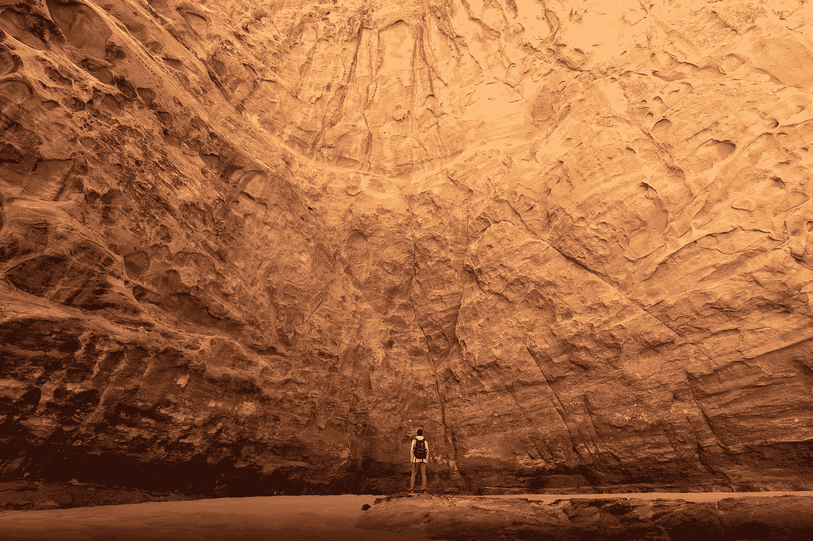

# 当 AI 走入歧途：现实世界中的高调机器学习失误

> 原文：[`towardsdatascience.com/when-ai-goes-astray-high-profile-machine-learning-mishaps-in-the-real-world-26bd58692195?source=collection_archive---------2-----------------------#2023-08-19`](https://towardsdatascience.com/when-ai-goes-astray-high-profile-machine-learning-mishaps-in-the-real-world-26bd58692195?source=collection_archive---------2-----------------------#2023-08-19)

## 一场关于引起世界关注的机器学习失误和失败的导览

 [Kenneth Leung](https://kennethleungty.medium.com/?source=post_page-----26bd58692195--------------------------------)

·

[关注](https://medium.com/m/signin?actionUrl=https%3A%2F%2Fmedium.com%2F_%2Fsubscribe%2Fuser%2Fdcd08e36f2d0&operation=register&redirect=https%3A%2F%2Ftowardsdatascience.com%2Fwhen-ai-goes-astray-high-profile-machine-learning-mishaps-in-the-real-world-26bd58692195&user=Kenneth+Leung&userId=dcd08e36f2d0&source=post_page-dcd08e36f2d0----26bd58692195---------------------post_header-----------) 发表在 [Towards Data Science](https://towardsdatascience.com/?source=post_page-----26bd58692195--------------------------------) ·6 分钟阅读·2023 年 8 月 19 日

--

由 [NEOM](https://unsplash.com/@neom?utm_source=unsplash&utm_medium=referral&utm_content=creditCopyText) 在 [Unsplash](https://unsplash.com/photos/AdkJ-LgpTrE?utm_source=unsplash&utm_medium=referral&utm_content=creditCopyText) 拍摄的照片

人工智能 (AI) 和机器学习的变革潜力经常成为新闻头条，有大量报道显示其在从医疗保健到金融等多个领域的正面影响。

然而，没有任何技术能够完全避免失误。虽然成功的故事展示了机器学习的美好前景，但同样重要的是指出它的缺陷，以便全面理解其影响。

在这篇文章中，我们将探讨许多高知名度的机器学习失误，以便从中吸取教训，为未来更明智的实施提供参考。

# 目录

特别是，我们将考察以下类别中的一个显著案例：

> ***(1)*** *经典机器学习****(2)*** *计算机视觉****(3)*** *预测****(4)*** *图像生成****(5)*** *自然语言处理****(6)*** *推荐系统*

***高端机器学习失误的综合汇编可以在以下名为 Failed-ML 的 GitHub 仓库中找到：***
