# 创作歌手何时最成功？

> 原文：[`towardsdatascience.com/when-are-songwriters-most-successful-9fdf90708e77`](https://towardsdatascience.com/when-are-songwriters-most-successful-9fdf90708e77)

## 让我们用 KDE 图来找出答案。

[](https://medium.com/@lee_vaughan?source=post_page-----9fdf90708e77--------------------------------)[](https://towardsdatascience.com/?source=post_page-----9fdf90708e77--------------------------------) [Lee Vaughan](https://medium.com/@lee_vaughan?source=post_page-----9fdf90708e77--------------------------------)

·发表在 [Towards Data Science](https://towardsdatascience.com/?source=post_page-----9fdf90708e77--------------------------------) ·阅读时间 11 分钟·2023 年 8 月 22 日

--


一位歌手在五彩纸屑飞舞中接受格莱美奖（由 DALL-E2 协助创建）

创作歌手在什么年龄段最成功？我前几天听到一首老歌时就想到了这个问题。我*印象中*，像数学家一样，创作歌手的巅峰期在 20 岁中期到晚期。但*数据*显示了什么？

在这个*快速成功数据科学*项目中，我们将使用 Python、pandas 和 Seaborn 绘图库来调查这个问题。我们将查看 16 位著名创作歌手的职业生涯，他们合计有超过 500 首热门歌曲。我们还将在分析中加入一种被称为*核密度估计*的迷人图形。

# 方法论

为了确定创作歌手何时最成功，我们需要一些指南。计划是检查：

+   **包括那些与合作者合作的创作歌手。**

+   **职业生涯长达数十年的创作歌手。**

+   **各种风格的创作歌手和音乐流派。**

+   **《Billboard Hot 100》排行榜上的创作歌手。**

[*Hot 100*](https://www.billboard.com/charts/hot-100/) 是《*Billboard*》杂志每周发布的排行榜，列出美国表现最佳的歌曲。这些排名基于实体和数字销售、广播播放以及在线流媒体。我们将使用它作为一种*一致*和*客观*的方式来判断成功。

# 数据

我们将使用以下高成功率艺术家的歌曲：

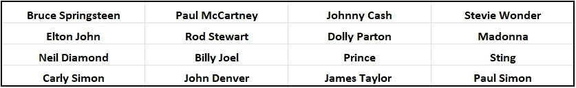

本项目中使用的创作歌手名单（所有剩余的图片均由作者提供）。

我记录了每位艺术人在每首热门歌曲时的年龄，并将其保存为 CSV 文件，存储在这个 [Gist](https://gist.github.com/rlvaugh/c3bd6aa921e7a7d930a220f565c25208) 上。如果他们在同一年有多首热门歌曲，他们的年龄条目会为每首歌曲重复一次。这里是文件顶部的一个快照：

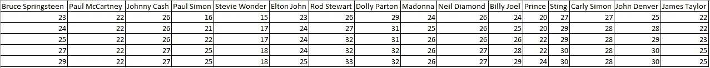

CSV 文件的前几行。

交叉参考这些信息是繁琐的（ChatGPT 拒绝这么做！）。因此，一些由这些艺术家创作但由其他人表演的作品可能不小心被遗漏了。

# 核密度估计图

*核密度估计图*是一种类似于直方图的数据点分布可视化方法。虽然直方图对观察值进行分箱和计数，KDE 图则使用高斯核对观察值进行*平滑*。这产生了一个*连续的密度估计*，其中 y 值被归一化，使得曲线下的总面积等于一。

下图比较了这两种方法。它们对底层数据的捕捉效果取决于直方图的分箱方式和 KDE 图的平滑方式。

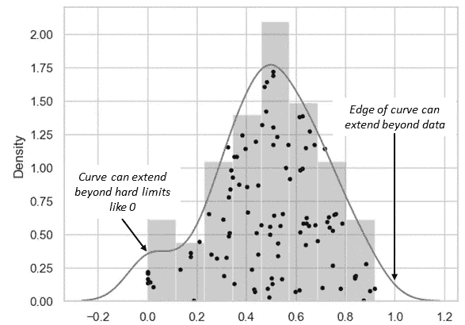

KDE 图（曲线）与直方图（条形）用于一系列观察值（点）的对比。

与直方图不同，直方图无法区分样本在某个区间内的具体位置，而 KDE 图会在每个单独的样本上绘制一个小的高斯钟形曲线。这些钟形曲线会被叠加在一起形成最终的曲线。这使得 KDE 图比直方图更宽，假设数据会平滑地扩展到极端值。因此，即使数据的硬限制为零，KDE 图也不会突然停在零处。

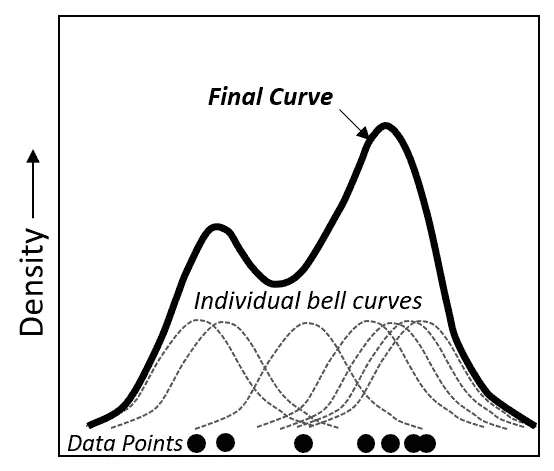

最终的 KDE 曲线是由每个单独数据点上的钟形曲线构建而成。

KDE 图使用*带宽*进行核平滑处理。选择*合适*的带宽既重要又具有一定的艺术性。带宽越小，KDE 图越能忠实于底层数据。带宽越大，数据被平均和平滑的程度越高。

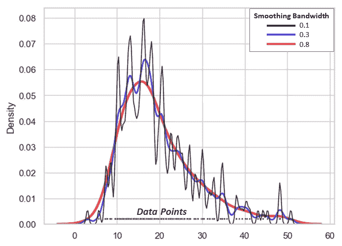

带宽平滑在 KDE 图中的示例。

狭窄的带宽会产生粗糙的曲线，这违背了使用 KDE 图的初衷。它们还可能引入随机噪声伪影。另一方面，宽带宽（如 2）可能会过度平滑，导致数据分布的重要特征（如双峰性）丢失。

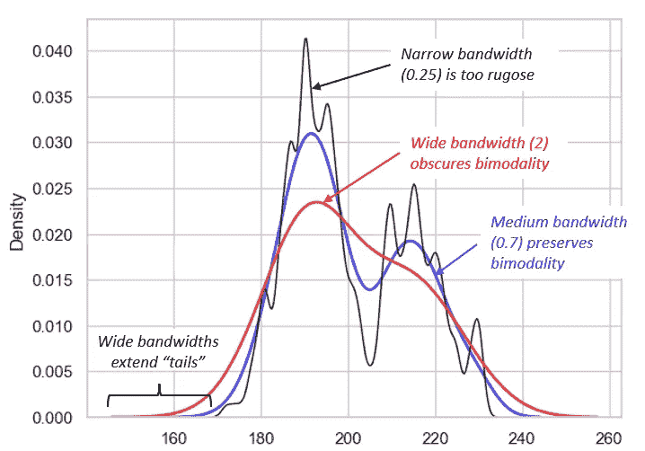

应用不同带宽调整对最终曲线的影响。

虽然 seaborn 库的`kdeplot()`方法使用了良好的默认值来生成图表，但你可能需要调整`bw_adjust`参数，以便将 KDE 图调整到你想要讲述的故事。

那么，为什么在已经有一个完美的直方图的情况下还要使用 KDE 图呢？以下是一些原因：

+   KDE 图比直方图更简洁，当在单个图中叠加多个分布时可读性更强。

+   KDE 图可以让你看到数据中的模式（如集中趋势、双峰性和偏斜），这些在直方图视图中可能会被遮蔽。

+   类似于 [sparklines](https://en.wikipedia.org/wiki/Sparkline)，KDE 图形适合于“快速查看”和质量控制。

+   KDE 图形在视觉上可能比直方图更具吸引力，更适合面向大众的信息图表。

+   KDE 图形便于在数据子集之间进行轻松比较。

关于 KDE 图形的更多信息，请参阅 `kdeplot()` 的 [文档](http://seaborn.pydata.org/generated/seaborn.kdeplot.html) 和 seaborn 可视化指南的 [*Kernel density estimation* 部分](http://seaborn.pydata.org/tutorial/distributions.html#tutorial-kde)。

# 安装库

对于这个项目，我们需要安装 seaborn 用于绘图，pandas 用于数据分析。你可以按如下方式安装这些库：

使用 conda: `conda install pandas seaborn`

使用 pip: `pip install pandas seaborn`

# 代码

以下代码在 JupyterLab 中编写，并*按单元格*描述。

## 导入库和加载数据

导入库后，我们将选择 seaborn 的“whitegrid”样式，以确保我们的图表具有一致的外观。然后我们将使用 pandas 读取 CSV 文件。

> 如果你使用虚拟环境，请注意 NumPy 和 Matplotlib 是 pandas 的*依赖项*，因此无需单独安装它们。

由于一些艺术家的热门歌曲比其他艺术家多，而 DataFrames 需要是矩形的，因此一些列将被分配缺失值。我们将使用 `fillna()` 方法将这些 `NaN` 值替换为零。

```py
import numpy as np
import matplotlib.pyplot as plt
import seaborn as sns
import pandas as pd

sns.set(style='whitegrid')

# Load the data and set NaN values to zero:
df = pd.read_csv('https://bit.ly/3E8Q1BO').fillna(0)
df.head(3)
```

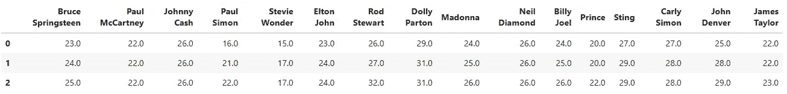

初始 DataFrame 的前几行。

## 融化 DataFrame

我们的 DataFrame 目前是“宽格式”的。每个艺术家的名字是列的*标题*，他们的年龄是列的*值*。Python 的绘图库更喜欢“长格式”。这意味着艺术家的名字应该是*行*的值，并且应该为每个对应的年龄重复。

为了方便，pandas 提供了一个名为 `melt()` 的方法，可以将数据从宽格式转换为长格式。`var_name` 参数用于设置一个名为“Name”的新列，以存放之前的列名。`value_name` 参数表示之前的列值现在应该放在名为“Age”的列下。

此外，我们将添加一个名为“Color”的新列，并将其设置为“红色”。这是一种方便的方式，用于后续绘图时分组数据。我们还将过滤出 `Age` 值为零的记录，以准确统计每位艺术家的热门歌曲数量。

```py
# Melt the DataFrame to a long format for plotting by artist name:
melted_df = pd.melt(df, var_name='Name', value_name='Age')

# Make a column for the plotting color:
melted_df['Color'] = 'red'

# Filter out zero values:
melted_df = melted_df[melted_df['Age'] != 0]

melted_df.tail(3)
```

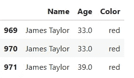

长格式融化的 DataFrame 的尾部。

## 绘制每位艺术家的热门歌曲数量

接下来，我们将使用 pandas 的 `value_counts()` 方法来计算每位艺术家的 *Hot 100* 热门歌曲数量。作为过程的一部分，我们将按降序排序数据。

```py
# Calculate the order of the bars by counts:
order = melted_df['Name'].value_counts().index

# Plot a bar chart of the number of hits by each artist:
ax = sns.countplot(data=melted_df, 
                   x='Name', 
                   color='red', 
                   order=order)
ax.set_xticklabels(ax.get_xticklabels(), 
                   rotation=55, 
                   fontsize=10, 
                   ha='right')
ax.set_title('Number of Billboard Hot 100 Hits');
```

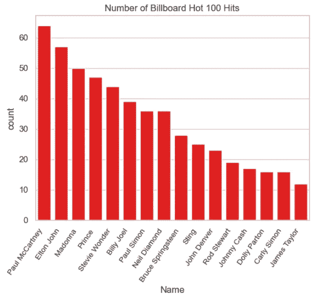

每位艺术家在其职业生涯中的*Hot 100* 热门歌曲数量。

## 绘制最后一次热门歌曲时的年龄和歌曲之间的总时间

接下来，我们将绘制每位艺术人在其最后一次*Hot 100*热门歌曲时的年龄，以及首次和最后一次出现在榜单上的时间跨度。

由于我们需要找出每位艺术家的最小年龄，我们首先将`df` DataFrame 中的 0 值设置为`NaN`，这样它们将被忽略。否则，0 会被选为最小年龄。我们不会对结果进行排序，因为我们希望将图表并排比较，因此希望艺术家名称保持相同的顺序。

```py
# Replace 0 values with NaN in order to find minimum age statistic:
df = df.replace(0, np.NaN)

# Calculate maximum age for each column
max_age = df.max()

# Calculate age span (maximum age - minimum age) for each column
age_span =df.max() - df.min()

# Create subplots for two bar charts
fig, axes = plt.subplots(nrows=1, ncols=2, 
                         figsize=(8, 6))

# Plot artist's age at time of last hit:
sns.barplot(x=max_age.values, 
            y=max_age.index, 
            ax=axes[0], 
            color='red', 
            orient='h')
axes[0].set_title('Artist Age at Time of Last Hit')
axes[0].set_xlabel('Age at Last Hit')
axes[0].set_ylabel('Artist')

# Plot age span between hits:
sns.barplot(x=age_span.values, 
            y=age_span.index, 
            ax=axes[1], 
            color='red', 
            orient='h')
axes[1].set_title("Years Between Artist's First & Last Hits")
axes[1].set_xlabel('Years Between First & Last Hit')
axes[1].set_ylabel('')

plt.tight_layout();
```

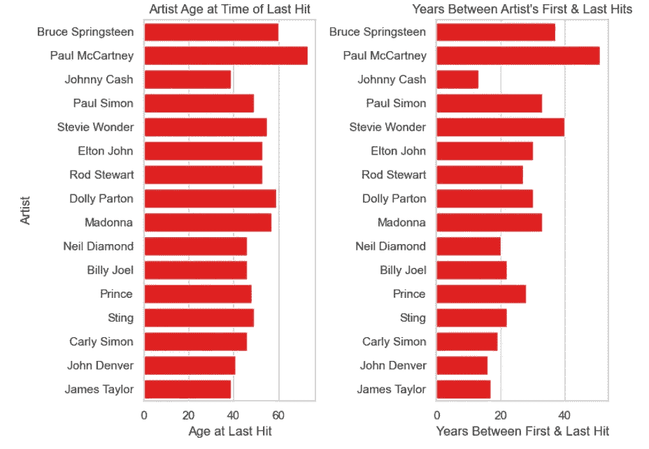

比较每位艺术家最后一次热门歌曲的年龄与歌曲之间的时间跨度。

从这些图表中可以得出结论，超过一半的艺术家在 50 岁之前就登上了所有热门榜单，并且这些热门歌曲的时间跨度为 30 年或更短。

## 计算年龄统计数据

现在，让我们找出艺术家们最成功的年龄。由于单一统计数据无法完全捕捉这一点，我们将使用 pandas 的`mean()`、`median()`和`mode()`方法。

```py
# Calculate the statistics:
mean_age = round(melted_df.mean(numeric_only=True).mean(), 1)
median_age = round(melted_df.median(numeric_only=True).median(), 1)
mode_age = round(melted_df.mode(numeric_only=True).mode(), 1)

print(f"Mean age = {mean_age}")
print(f"Median age = {median_age}")
print(f"Mode age = {mode_age}")
```

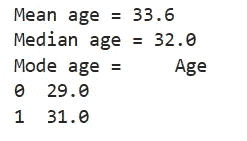

在调查的 16 位创作歌手中，成功的“甜点”似乎在 29 至 33 岁之间。

> 注意：本分析的假设是歌曲是在其出现在*Hot 100*榜单的同一年创作的。由于歌曲创作和出现在榜单之间会有时间滞后，我们的统计数据可能会对*年长*的年龄有所偏倚。

## 使用 KDE 图找到成功的甜点

寻找甜点的可视化方式是使用 KDE 图。我们将使用 seaborn 的`kdeplot()`方法，并传递融化的 DataFrame。我们还将`hue`参数设置为“颜色”列，这意味着它将忽略艺术家的名字，并将所有年龄值绘制为一个组。

```py
# Create a KDE plot for complete dataset:
ax = sns.kdeplot(data=melted_df, 
                 x='Age', 
                 hue='Color', 
                 fill=True, 
                 palette='dark:red_r', 
                 legend=False)

# Set x-axis tick positions:
ax.set_xticks(range(0, 85, 5))  

ax.set_title('KDE Plot of Billboard Hot 100 Hits by Age For All Artists',
             fontsize=14);
```

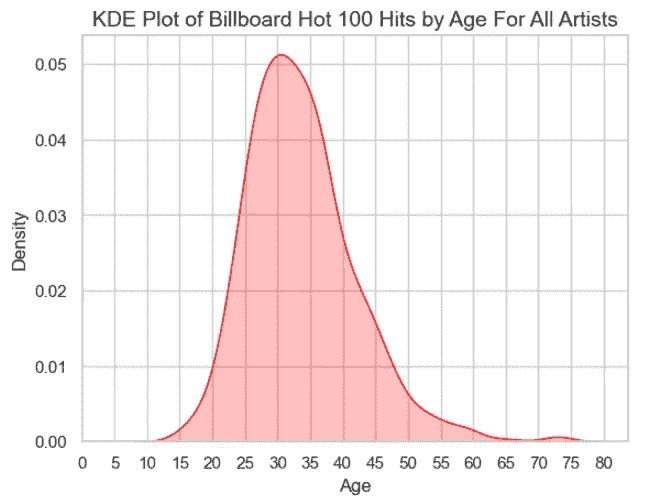

所有艺术家的“年龄”列的 KDE 图。

该图确认了我们之前学到的，最大成功通常在 30 岁左右。70 岁后的高峰代表了保罗·麦卡特尼在 2015 年与坎耶·维斯特的合作，当时麦卡特尼 73 岁。

## 使用 Facet Grid 比较职业生涯

*Facet grids*是创建*多个*具有*共享*坐标轴的图表的方法，这些图表显示数据集的*不同*子集。我们将制作一个 facet grid，使用 KDE 图来比较每位艺术家的热门分布。

我们将首先调用 seaborn 的`FacetGrid()`方法，并将其应用于融化的 DataFrame 及其“名称”列。为了在没有干扰的情况下比较*所有*艺术家，我们将为每条曲线使用相同的颜色，由`hue`参数指定。通过将`col_wrap`参数设置为`2`，我们将显示分成 2 列，每列 8 条曲线。

定义好 facet grid 后，我们将调用`kdeplot()`方法，并将其映射到 facet grid 中，指定为`g`变量。我们将带宽调整（`bw_adjust`）设置为`0.4`，以避免平滑掉数据中的所有变异性。

```py
# Plot a Facet Grid of each artist's hits vs. age as a KDE chart:
g = sns.FacetGrid(data=melted_df, 
                  col='Name', 
                  hue='Color', 
                  aspect=3, 
                  height=1.00, 
                  col_wrap=2, 
                  palette='dark:red_r')

g.map(sns.kdeplot, 'Age',
      fill=True, 
      alpha=0.7, 
      lw=2, 
      bw_adjust=0.4)

g.set_axis_labels('Age', 'Density')
g.set_titles(col_template='{col_name}')
g.tight_layout()

# Loop through each subplot to set custom x-axis tick labels:
for ax in g.axes.flat:
    ax.set_xticks(range(0, 80, 10))
    ax.set_xticklabels(range(0, 80, 10))

# Add a title to the FacetGrid
g.fig.suptitle('Billboard Hot 100 Hits vs. Age', 
               y=1.03,
               fontsize=16);
```

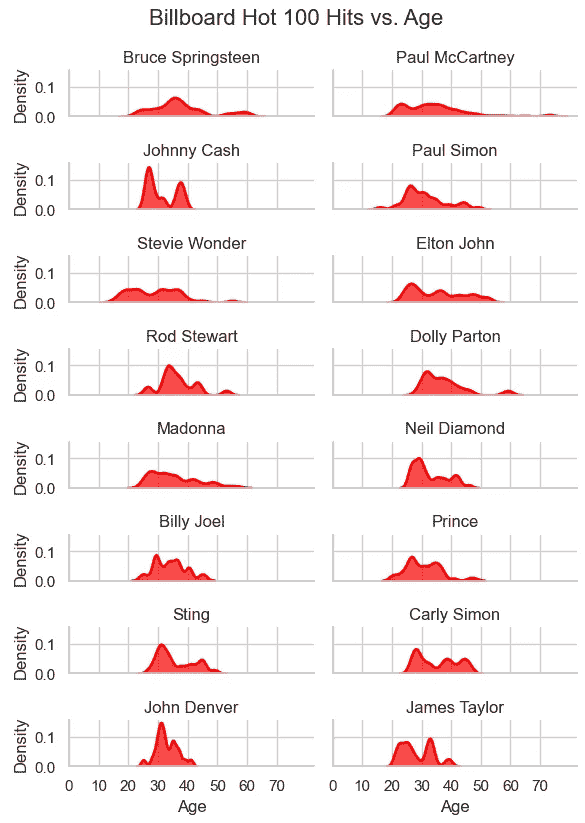

每位艺术家的 KDE 图的 facet grid。

多么美妙的图表！简洁而信息丰富。这就是 KDE 图发挥作用的地方。

只需一眼，你就可以看到斯汀在*警察乐队*的早期成功，随后是成功的个人生涯。约翰尼·卡什的双峰分布反映了他与药物成瘾的斗争。保罗·西蒙在*格拉斯兰*专辑中的后期职业成功在 45 岁时显得只是一个短暂的高峰。正如我们在早期分析中所见，大多数峰值趋向于集中在 29 到 34 岁之间。

## 绘制堆叠 KDE 图

另一种用 KDE 图讲故事的方法是将它们堆叠在同一面板中。这总是比堆叠直方图效果更好。

对于我们当前的项目，有太多艺术家使得在*个人*层面上这种方法效果不佳。但由于我们的目标是突出*所有*艺术家的“成功甜点”，它做得还算不错。

要堆叠 KDE 图，我们只需调用 `kdeplot()` 方法，而不使用 facet grid。这里一个重要的参数是 `common_norm`，它代表“公共归一化”。

> 根据 seaborn 的[文档](https://seaborn.pydata.org/generated/seaborn.kdeplot.html)，"当 `common_norm` 设置为 `True` 时，所有 KDE 曲线将使用相同的尺度进行归一化。这在你想比较不同组的整体分布形状时非常有用。当你有多个样本量不同或值范围不同的组时，尤其有帮助，因为这可以确保曲线在形状上直接可比。"

我们每位艺术家的样本量确实不同，并且希望比较曲线，所以我们将 `common_norm` 设置为 `True`。

```py
# Create a stacked KDE plot:
fig, ax = plt.subplots(figsize=(10, 6))
ax = sns.kdeplot(data=melted_df, 
                 x='Age', 
                 hue='Name', 
                 fill=True, 
                 palette='dark:red_r', 
                 common_norm=True)
ax.set_xticks(range(0, 85, 5))
ax.set_title('Stacked KDE Plot by Artist')
ax.set_xlabel('Age')
ax.set_ylabel('Density');
```

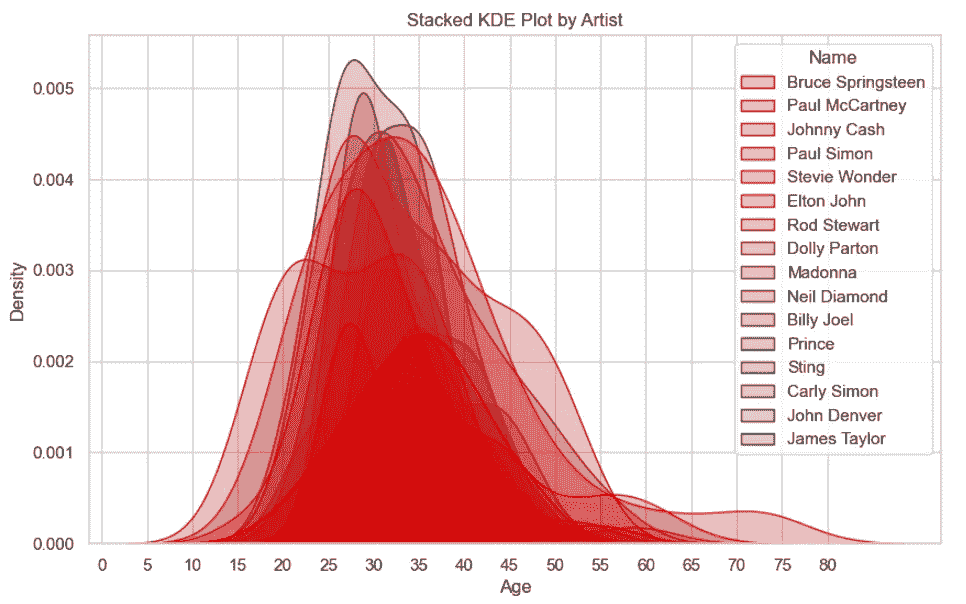

每位艺术家的堆叠 KDE 图，公共归一化设置为“True”。

虽然很难甚至不可能识别特定艺术家的曲线（即使你为每位艺术家使用不同的颜色），但很明显最佳年龄在 30 岁左右。

如果你感兴趣的话，这里是 `common_norm` 设置为 `False` 时的图：

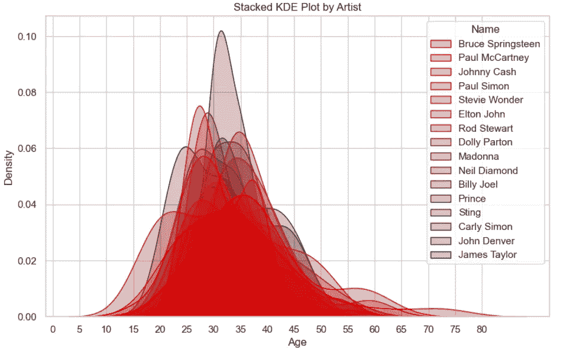

每位艺术家的堆叠 KDE 图，公共归一化设置为“False”。

## 绘制分布图

最后，让我们将数据可视化为*分布图*。seaborn 的 `displot()` 方法提供了一个图形级别的接口，用于在 seaborn `FacetGrid` 上绘制分布图。它允许你选择多种图类型，例如 KDE 和直方图，通过 `kind` 参数。

另一个不错的功能是添加了“rug 图”，通过 `rug` 参数实现。rug 图标记了数据点在轴上的位置。这让你能够看到实际数据的范围，这些数据可能被 KDE 图的“尾部”遮掩。

```py
# Plot the distribution of hits vs age:
sns.displot(data=melted_df,
            x='Age', hue='Name',
            kind='kde', height=6,
            multiple='fill', clip=(0, None),
            palette='dark:red_r', 
            common_norm=True, rug=True);
```

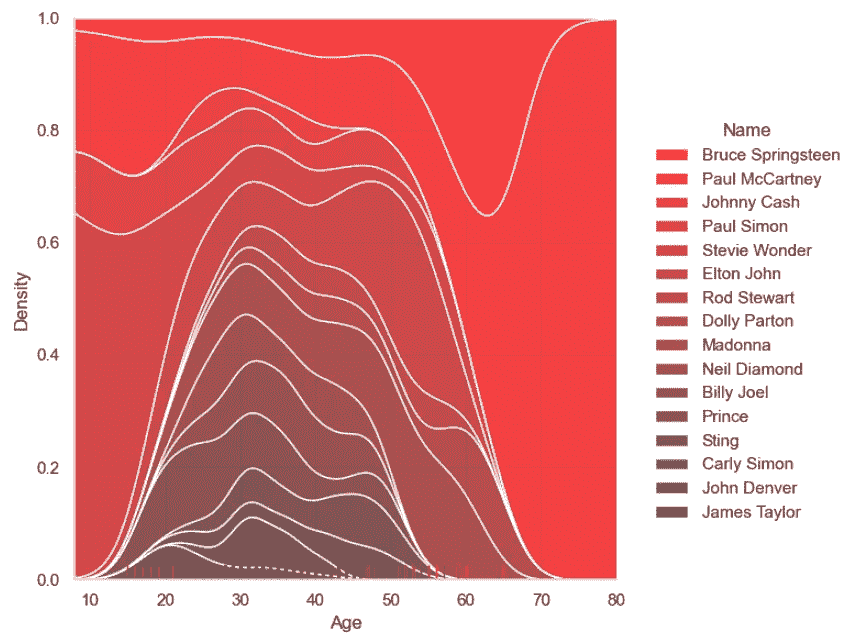

包含 KDE 和 rug 图的分布图（图像由作者提供）

我个人发现这个图很难解读，但它确实突出了 30 岁左右的高峰成功年。

# 结论

KDE 曲线图以其平滑、令人愉悦的形状，是可视化单变量数据的绝佳方式。虽然功能上类似于直方图，但它们更容易展示数据中的模式，并在同一图形中堆叠和比较多个分布。

借助 KDE 曲线图，我们能够展示出创作歌手在大约 30 岁时最为成功。因此，如果你想开始创作歌手的职业生涯，千万不要拖延！

# 谢谢！

感谢阅读，请关注我，以便未来了解更多*快速成功的数据科学*项目。
