# 当 AutoML 遇上大型语言模型

> 原文：[`towardsdatascience.com/when-automl-meets-large-language-model-756e6bb9baa7`](https://towardsdatascience.com/when-automl-meets-large-language-model-756e6bb9baa7)

## 利用 LLMs 的力量来指导超参数搜索

[](https://shuaiguo.medium.com/?source=post_page-----756e6bb9baa7--------------------------------)[](https://towardsdatascience.com/?source=post_page-----756e6bb9baa7--------------------------------) [Shuai Guo](https://shuaiguo.medium.com/?source=post_page-----756e6bb9baa7--------------------------------)

·发表于[Towards Data Science](https://towardsdatascience.com/?source=post_page-----756e6bb9baa7--------------------------------) ·23 分钟阅读·2023 年 10 月 5 日

--


[约翰·施诺布里奇](https://unsplash.com/@johnschno?utm_source=medium&utm_medium=referral)拍摄于[Unsplash](https://unsplash.com/?utm_source=medium&utm_medium=referral)

*自动化机器学习*，简称 AutoML，旨在自动化机器学习流程中的各个步骤。其中一个关键方面是**超参数调优**。超参数是指控制机器学习算法结构和行为的参数（例如，神经网络模型中的层数），这些参数的值在训练之前设定，而不是从数据中学习，这与其他机器学习参数（例如神经网络层的权重和偏置）不同。

当前在 AutoML 中用于超参数调优的做法 heavily rely on sophisticated algorithms (such as [贝叶斯优化](https://medium.com/towards-data-science/an-introduction-to-surrogate-optimization-intuition-illustration-case-study-and-the-code-5d9364aed51b)) to automatically identify the optimal combination of the hyperparameters that yields the best model performance.

从纯算法的角度解决超参数调优问题虽然有效，但还有另一个重要的信息可以补充算法搜索策略：**人类专业知识**。

资深数据科学家凭借多年的经验和对机器学习算法的深刻理解，通常能够直观地知道从哪里开始搜索，哪些搜索空间的区域可能更有前景，或何时缩小或扩大可能性。

因此，这给了我们一个非常有趣的想法：我们能否设计一个**可扩展的专家指导搜索策略**，既利用专家提供的细致见解，又结合 AutoML 算法提供的搜索效率？

这是**大语言模型**（LLM），例如 GPT-4，可以发挥作用的地方。在它们的大量训练数据中，有一部分文本专门用于解释和讨论机器学习（ML）的最佳实践。由于这一点，LLM 能够内化大量的 ML 专业知识，并获得大量的集体 ML 智慧。这使得 LLM 作为潜在的知识渊博的 ML 专家，可以与现有的 AutoML 工具进行互动，共同进行专家指导的超参数调整。

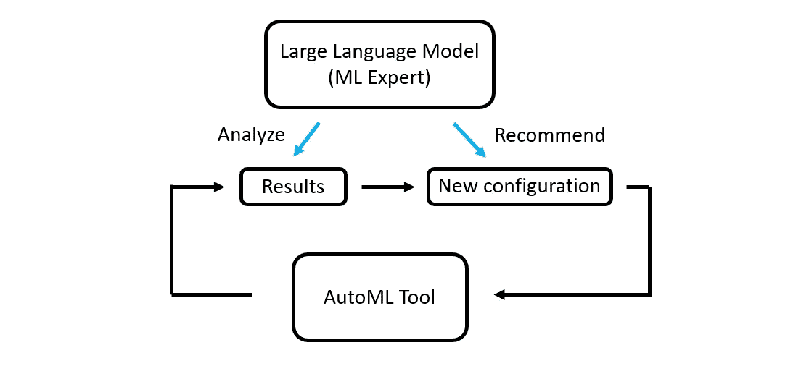

LLM 指导的超参数调整示例。（图像作者提供）

在这篇博客文章中，让我们尝试这个想法，并实现一个**由 LLM 指导的超参数调整工作流**。具体来说，我们将开发一个将 LLM 指导与简单随机搜索相结合的工作流，然后将其调整结果与一种名为[FLAML](https://microsoft.github.io/FLAML/)（微软研究院开发的最先进的算法驱动的 AutoML 工具）的现成工具进行比较。进行这种比较的理由是评估即使与简单的搜索算法配对，借助 ML 领域专业知识是否真的能带来价值。

这个想法与你有共鸣吗？那就开始吧！

> [注]: 本博客中展示的所有提示均由 ChatGPT (GPT-4) 生成并优化。这是必要的，因为它确保了提示的质量，并且有助于避免繁琐的手动提示工程。
> 
> 这是我关于 LLM 项目的系列博客中的第四篇。第一篇是 构建 AI 驱动的语言学习应用，第二篇是 开发用于研究论文摘要的自主双聊天机器人系统，第三篇是 通过现实生活模拟训练数据科学中的问题解决技能。欢迎查看！

## 目录

**·** **1\. 案例研究**

∘ 1.1 数据集描述

∘ 1.2 模型描述

**·** **2\. 工作流设计** **·** **3\. 配置聊天机器人** **·** **4\. 建议优化度量** **·** **5\. 定义初始搜索空间** **·** **6\. 精炼搜索空间** **·** **7\. 调整日志分析**

∘ 7.1 随机搜索与连续减半

∘ 7.2 日志分析

**·** **8\. 案例研究**

∘ 8.1 确定度量

∘ 8.2 第一次搜索迭代

∘ 8.3 第二次搜索迭代

∘ 8.4 第三次搜索迭代

∘ 8.5 测试

**·** **9\. 与现成 AutoML 工具的比较** **·** **10\. 结论**

# 1\. 案例研究

为了将我们的讨论具体化，让我们首先介绍一下我们将要调查的案例研究。

在本博客中，我们将查看一个**二分类**问题的超参数调优任务。更具体地，我们将研究一个名为[**NSL-KDD**](https://www.unb.ca/cic/datasets/nsl.html)的网络安全数据集，并识别[**XGBoost**](https://xgboost.readthedocs.io/en/stable/)模型的最佳超参数，以便训练出的模型可以准确区分良性和攻击活动。

## 1.1 数据集描述

NSL-KDD 数据集是网络入侵检测领域广泛使用的数据集。完整的数据集包含四种攻击类别，即 dos（拒绝服务）、r2l（远程机器的未经授权访问）、u2r（权限提升尝试）以及 probe（暴力探测攻击）。在我们当前的案例研究中，我们研究一个*二分类*问题：我们只考虑“良性”或“探测”性质的数据样本，并训练一个能够区分这两种状态的分类器。

NSL-KDD 数据集包含 40 个特征（例如，连接长度、协议类型、传输数据字节等），这些特征源自原始网络流量数据，捕获了单个网络连接的各种特征。数据集已经预先划分为训练集和测试集。下表显示了两个集合中的样本数量：


训练集和测试集中样本的数量。（图片作者提供）

请注意，我们当前的数据集是不平衡的。这在网络安全应用中很常见，因为可用的攻击样本数量通常远小于良性样本的数量。

你可以在[这里](https://github.com/ShuaiGuo16/LLM-guided-AutoML/tree/main/dataset)找到预处理的数据集。

## 1.2 模型描述

尽管完整的 AutoML 包括模型选择，但在当前的案例研究中，我们将范围限制在仅优化 XGBoost 模型。XGBoost 模型以其多才多艺的性能而闻名，但前提是使用了正确的模型超参数。不幸的是，由于 XGBoost 的超参数数量众多，确定给定数据集的最佳超参数组合并不容易。这正是 AutoML 可以发挥作用的地方。

我们考虑调整以下 XGBoost 超参数：

> n_estimators, max_depth, min_child_weight, gamma, scale_pos_weight, learning_rate, subsample, colsample_bylevel, colsample_bytree, reg_alpha, 和 reg_lambda。

关于上述超参数的详细描述，请参阅[官方文档](https://xgboost.readthedocs.io/en/stable/)。

# 2\. 工作流设计

要实现 LLM 指导的超参数调优，我们需要回答两个问题：我们应该如何将 LLM 的机器学习专业知识融入调优过程？我们应该如何让 LLM 与调优工具互动？

1️⃣ 如何将 LLM 的机器学习专业知识融入调整过程中？

好吧，在调整过程中至少有三个地方，LLM 的机器学习专业知识可以提供指导：

+   **建议优化指标**：超参数调整通常需要一个指标来定义在各种竞争的超参数组合中什么被认为是“最优”的。这为基础的优化算法（例如，贝叶斯优化）设定了目标。LLMs 可以提供关于哪些指标更适合特定类型问题和数据集特征的见解，并可能提供对候选指标的优缺点解释。

+   **建议初始搜索空间**：由于大多数超参数调整任务是以迭代方式进行的，通常需要配置初始搜索空间以为优化过程奠定基础。基于其学习的机器学习最佳实践，LLMs 可以推荐对研究数据集特征和选定机器学习模型有意义的超参数范围。这可以潜在地减少不必要的探索，从而节省大量计算时间。

+   **建议搜索空间的细化**：随着调整过程的推进，通常需要对配置的搜索空间进行细化。细化可以朝两个方向进行，即缩小某些超参数的范围到显示出前景的区域，或扩展某些超参数的范围以探索新的领域。通过分析前几轮的优化日志，大型语言模型（LLMs）可以自动提出新的细化建议，将调整过程引导向更有前景的结果。

2️⃣ 如何让 LLM 与调整工具进行互动？

理想情况下，我们可以将随机搜索工具封装为 API，并实现一个基于 LLM 的**代理**，该代理可以访问这个 API 来进行调整。然而，由于时间有限，我未能配置一个能够可靠执行上述迭代调整过程的工作代理：有时代理由于输入模式不正确而无法正确使用工具；其他时候代理则完全偏离了任务。

作为替代，我实现了一个简单的基于聊天机器人的工作流，其中包含以下两个组件：

+   具有记忆的聊天机器人。在这里，记忆很重要，因为聊天机器人需要回忆之前建议的搜索空间。

+   三个提示分别对应建议优化指标、建议初始搜索空间和建议搜索空间的细化。

为了启动工作流，首先提示聊天机器人根据问题背景和数据集特征建议一个合适的优化指标。然后解析聊天机器人的响应，提取并存储指标名称作为变量。第二步，提示聊天机器人建议一个初始搜索空间。与第一步一样，解析响应并提取搜索空间，存储为变量。获得这两个信息后，将调用随机搜索工具，使用聊天机器人建议的指标和搜索空间。总体而言，这构成了第一轮迭代。

一旦随机搜索工具完成搜索，将提示聊天机器人根据上一次运行的结果推荐搜索空间的细化。在成功解析聊天机器人的响应中的新搜索空间后，将进行另一轮随机搜索。这个过程会迭代，直到计算预算耗尽或达到收敛，例如，较上次运行没有更多改进。

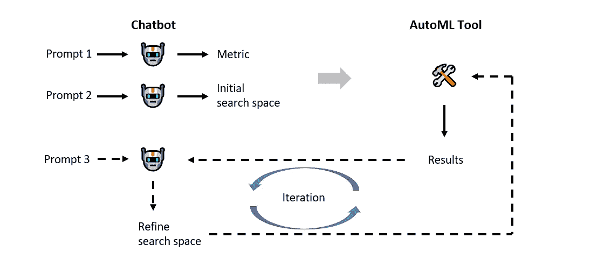

基于聊天机器人的解决方案，用于实现 LLM 引导的超参数调优。（图像由作者提供）

尽管不如基于代理的方法优雅，这种基于聊天机器人的工作流具有几个好处：

+   **易于实现和实现质量控制**。将聊天机器人与调优工具集成简化为设计三个提示和几个辅助函数，以从聊天机器人的响应中提取目标信息。这比完全集成的基于代理的方法要简单得多。此外，由于超参数调优任务被分解为明确的步骤，每一步都可以被监控和调整，从而使质量控制变得更可控，确保搜索过程保持在轨道上。

+   **完全透明的决策过程**。由于聊天机器人会清晰地说明其做出的每个决策或建议，超参数调优过程不再是对用户的黑箱过程。这对于实现*可解释的*和*值得信赖的* AutoML 至关重要。

+   **允许结合人类直觉**。尽管当前的工作流设计为自动化，但可以轻松扩展，以允许人类专家在每次搜索迭代之前选择接受建议或根据自己的专业知识进行必要的调整。这种灵活性为*人类参与的调优*打开了大门，可能会导致更好的优化结果。

在接下来的章节中，我们将逐一详细介绍配置聊天机器人以及建议指标、初始搜索空间和搜索空间细化的提示。

# 3\. 配置聊天机器人

我们可以使用 LangChain 轻松设置一个具有记忆的聊天机器人。我们首先导入必要的库：

```py
from langchain.prompts import (
    ChatPromptTemplate, 
    MessagesPlaceholder, 
    SystemMessagePromptTemplate, 
    HumanMessagePromptTemplate
)
from langchain.chains import ConversationChain
from langchain.chat_models import ChatOpenAI
from langchain.memory import ConversationBufferMemory
```

在 LangChain 中，聊天机器人可以通过`ConversationChain`对象进行配置，这需要一个主干 LLM、一个用于保存对话历史的内存对象以及一个用于指定聊天机器人行为的提示模板：

```py
# Set up LLM
llm = ChatOpenAI(temperature=0.8)

# Set up memory
memory = ConversationBufferMemory(return_messages=True)

# Set up the prompt
prompt = ChatPromptTemplate.from_messages([
    SystemMessagePromptTemplate.from_template(system_message),
    MessagesPlaceholder(variable_name="history"),
    HumanMessagePromptTemplate.from_template("""{input}""")
])

# Create conversation chain
conversation = ConversationChain(memory=memory, prompt=prompt, 
                                llm=llm, verbose=False)
```

在上面的代码片段中，变量`system_message`设置了聊天机器人的上下文，如下所示：

```py
# Note: the prompt is generated and optimized by ChatGPT (GPT-4)
system_message = f"""
You are a senior data scientist tasked with guiding the use of an AutoML 
tool to discover the best XGBoost model configurations for a given binary 
classification dataset. Your role involves understanding the dataset 
characteristics, proposing suitable metrics, hyperparameters, and their 
search spaces, analyzing results, and iterating on configurations. 
"""
```

注意，我们在系统消息中指定了聊天机器人的角色、目的和预期行为。稍后，我们可以使用配置好的聊天机器人进行推理：

```py
# Invoke chatbot with the input prompt
response = conversation.predict(input=prompt)
```

其中 `prompt` 是我们对聊天机器人的具体指令，即建议优化度量标准、建议初始搜索空间或建议优化搜索空间。我们将在接下来的几节中介绍这些提示。

# 4\. 建议优化度量标准

作为 LLM 引导的超参数调整的第一步，我们希望聊天机器人提出一个合适的度量标准，以便调整工具进行优化。这个决定应基于几个因素，包括问题的性质（即回归还是分类）、给定数据集的特征，以及来自业务或实际应用的其他具体要求。

以下片段定义了实现我们目标的提示：

```py
def suggest_metrics(report):

    # Note: The prompt is generated and optimized by ChatGPT (GPT-4)
    prompt = f"""
    The classification problem under investigation is based on a network 
    intrusion detection dataset. This dataset contains Probe attack type, 
    which are all grouped under the "attack" class (label: 1). Conversely, 
    the "normal" class is represented by label 0\. Below are the dataset's 
    characteristics:
    {report}.

    For this specific inquiry, you are tasked with recommending a suitable 
    hyperparameter optimization metric for training a XGBoost model. It is 
    crucial that the model should accurately identify genuine threats (attacks) 
    without raising excessive false alarms on benign activities. They are equally 
    important. Given the problem context and dataset characteristics, suggest 
    only the name of one of the built-in metrics: 
    - 'accuracy'
    - 'roc_auc' (ROCAUC score)
    - 'f1' (F1 score)
    - 'balanced_accuracy' (It is the macro-average of recall scores per class 
    or, equivalently, raw accuracy where each sample is weighted according to 
    the inverse prevalence of its true class) 
    - 'average_precision'
    - 'precision'
    - 'recall'
    - 'neg_brier_score'

    Please first briefly explain your reasoning and then provide the 
    recommended metric name. Your recommendation should be enclosed between 
    markers [BEGIN] and [END], with standalone string for indicating the 
    metric name.
    Do not provide other settings or configurations.
    """

    return prompt
```

在上面的提示中，我们已经向聊天机器人说明了问题的背景、数据集特征（封装在变量`report`中，我们稍后将讨论），目标（推荐一个适合的超参数优化度量标准用于训练 XGBoost 模型）、具体要求（高检测率和低误报率）以及候选度量标准（它们都在 sci-kit learn 中受支持）。注意，我们明确要求聊天机器人将度量标准名称输出在[BEGIN]-[END]块内，这样可以方便地自动提取信息。

为了生成数据报告，我们可以定义以下函数：

```py
def data_report(df, num_feats, bin_feats, nom_feats):
    """
    Generate data characteristics report.

    Inputs:
    -------
    df: dataframe for the dataset.
    num_feats: list of names of numerical features.
    bin_feats: list of names of binary features.
    nom_feats: list of names of nominal features.

    Outputs:
    --------
    report: data characteristics report.
    """

    # Label column 
    target = df.iloc[:, -1]
    features = df.iloc[:, :-1]

    # General dataset info
    num_instances = len(df)
    num_features = features.shape[1]

    # Class imbalance analysis
    class_counts = target.value_counts()
    class_distribution = class_counts/num_instances

    # Create report
    # Note: The format of the report is generated and optimized
    # by ChatGPT (GPT-4)
    report = f"""Data Characteristics Report:

- General information:
  - Number of Instances: {num_instances}
  - Number of Features: {num_features}

- Class distribution analysis:
  - Class Distribution: {class_distribution.to_string()}

- Feature analysis:
  - Feature names: {features.columns.to_list()}
  - Number of numerical features: {len(num_feats)}
  - Number of binary features: {len(bin_feats)}
  - Binary feature names: {bin_feats}
  - Number of nominal features: {len(nom_feats)}
  - Nominal feature names: {nom_feats}
"""

    return report
```

在这里，我们特别计算了给定的数据集是否存在不平衡，因为这一信息可能会影响优化度量标准的选择。

现在我们已经完成了第一个提示，指示聊天机器人建议一个适合的度量标准来评估各种超参数配置的性能。接下来，让我们看看如何构建定义初始搜索空间的提示。

# **5\. 定义初始搜索空间**

除了优化度量标准，我们还需要一个超参数的初始搜索空间来开始调整过程。以下片段展示了实现这一目标的提示：

```py
def suggest_initial_search_space():

    # Note: The prompt is generated and optimized by ChatGPT (GPT-4) 
    prompt = f"""
    Given your understanding of XGBoost and general best practices in machine 
    learning, suggest an initial search space for hyperparameters. 

    Tunable hyperparameters include:
    - n_estimators (integer): Number of boosting rounds or trees to be trained.
    - max_depth (integer): Maximum tree depth for base learners.
    - min_child_weight (integer or float): Minimum sum of instance weight 
    (hessian) needed in a leaf node. 
    - gamma (float): Minimum loss reduction required to make a further 
    partition on a leaf node of the tree.
    - scale_pos_weight (float): Balancing of positive and negative weights.
    - learning_rate (float): Step size shrinkage used during each boosting 
    round to prevent overfitting. 
    - subsample (float): Fraction of the training data sampled to train each 
    tree. 
    - colsample_bylevel (float): Fraction of features that can be randomly 
    sampled for building each level (or depth) of the tree.
    - colsample_bytree (float): Fraction of features that can be randomly 
    sampled for building each tree. 
    - reg_alpha (float): L1 regularization term on weights. 
    - reg_lambda (float): L2 regularization term on weights. 

    The search space is defined as a dict with keys being hyperparameter names, 
    and values are the search space associated with the hyperparameter. 
    For example:
        search_space = {{
            "learning_rate": loguniform(1e-4, 1e-3)
        }}

    Available types of domains include: 
    - scipy.stats.uniform(loc, scale), it samples values uniformly between 
    loc and loc + scale.
    - scipy.stats.loguniform(a, b), it samples values between a and b in a 
    logarithmic scale.
    - scipy.stats.randint(low, high), it samples integers uniformly between 
    low (inclusive) and high (exclusive).
    - a list of possible discrete value, e.g., ["a", "b", "c"]

    Please first briefly explain your reasoning, then provide the 
    configurations of the initial search space. Enclose your suggested 
    configurations between markers [BEGIN] and [END], and assign your 
    configuration to a variable named search_space.
    """

    return prompt
```

上面的提示包含了大量信息，所以我们来逐步拆解：

+   我们首先向聊天机器人说明了我们的目标。

+   我们提供了一个可调超参数及其含义的列表。此外，我们还指出了每个超参数的预期数据类型。这些信息对 LLM 决定采样分布至关重要。

+   我们定义了搜索空间的预期输出格式，以便进行有效解析。

+   我们指明了 LLM 可以建议的可用采样分布。

请注意，我们明确要求聊天机器人简要说明建议的搜索空间的理由。这对于实现透明度和可解释性至关重要。

这就是推荐初始搜索空间的内容。接下来，我们来看看如何优化搜索空间。

# 6\. 优化搜索空间

在从聊天机器人获取优化指标和初始搜索空间后，我们可以启动一次调优轮次。随后，我们可以将生成的 AutoML 日志输入到聊天机器人中，并提示它建议对搜索空间进行优化。

以下代码片段展示了实现目标的提示：

```py
def suggest_refine_search_space(top_n, last_run_best_score, all_time_best_score):
    """
    Generate prompt for refining the search space.

    Inputs:
    -------
    top_n: string representation of the top-5 best-performing configurations.
    last_run_best_score: best test score from the last run.
    all_time_best_score: best test score from all previous runs.

    Outputs:
    --------
    prompt: generated prompt.
    """

    # Note: The prompt is generated and optimized by ChatGPT (GPT-4)
    prompt = f"""
    Given your previously suggested search space, the obtained top configurations 
    with their test scores:
    {top_n}

    The best score from the last run was {last_run_best_score}, while the best 
    score ever achieved in all previous runs is {all_time_best_score}

    Remember, tunable hyperparameters are: n_estimators, max_depth, min_child_samples, 
    gamma, scale_pos_weight, learning_rate, subsample, colsample_bylevel, 
    colsample_bytree, reg_alpha, and reg_lambda.

    Given the insights from the search history, your expertise in ML, and the 
    need to further explore the search space, please suggest refinements for 
    the search space in the next optimization round. Consider both narrowing 
    and expanding the search space for hyperparameters where appropriate.

    For each recommendation, please:
    1\. Explicitly tie back to any general best practices or patterns you are 
    aware of regarding XGBoost tuning
    2\. Then, relate to the insights from the search history and explain how 
    they align or deviate from these practices or patterns.
    3\. If suggesting an expansion of the search space, please provide a 
    rationale for why a broader range could be beneficial.

    Briefly summarize your reasoning for the refinements and then present the 
    adjusted configurations. Enclose your refined configurations between 
    markers [BEGIN] and [END], and assign your configuration to a variable 
    named search_space.
    """

    return prompt
```

有几个值得解释的地方：

+   我们向聊天机器人提供了上一次调优轮次中表现最好的前 5 个配置及其相关测试分数。这可以作为聊天机器人确定下一轮优化的基础。

+   通过包括上一次运行的最佳测试分数和所有之前的运行，聊天机器人可以判断上次运行中建议的搜索空间是否有效。

+   我们明确要求聊天机器人考虑进一步探索搜索空间。一般而言，优化的最佳实践是**平衡探索与利用**。由于我们使用的随机搜索算法（将在结果部分讨论）已经涵盖了*利用*，因此让 LLM 更多地关注*探索*是合理的。

+   与其他提示类似，我们要求 LLM 对其建议进行推理，以确保透明度和可解释性。

在下一节中，让我们看看生成`top_n`变量的日志分析逻辑。

# 7\. 调优日志分析

作为一种迭代方法，我们希望聊天机器人在上一轮搜索完成后提出新的搜索空间，而决策过程的基础应该是上一轮搜索中生成的日志。在本节中，我们首先介绍了当前案例研究中使用的搜索算法。然后，我们讨论了日志结构和提取有用见解的代码。

## 7.1 逐步折半的随机搜索

正如本文开头所提到的，我们希望将一种简单的超参数搜索算法与 LLM 结合，以检验领域专业知识是否能带来价值。

最简单的调优方法之一是**随机搜索**：对于一个定义好的搜索空间（通过将采样分布附加到超参数上来指定），对给定数量的超参数组合实例进行采样，并评估其相关的模型性能。产生最佳性能的采样超参数配置被认为是最佳的。

尽管其简单性，随机搜索的朴素版本可能导致计算资源的低效使用，因为它不区分超参数配置，而不良的超参数选择仍然会被训练。

为解决这个问题，提出了**连续折半**技术，以增强基本的随机搜索策略。基本上，连续折半策略首先使用少量资源评估许多配置，然后逐渐将更多资源分配给有前景的配置。因此，劣质配置可以在早期有效地被淘汰，从而提高搜索效率。Sci-kit Learn 提供了精确实现这一策略的`[HalvingRandomSearchCV](https://scikit-learn.org/stable/modules/generated/sklearn.model_selection.HalvingRandomSearchCV.html)`估算器，我们将在当前案例研究中采用。

## 7.2 日志分析

当运行`[HalvingRandomSearchCV](https://scikit-learn.org/stable/modules/generated/sklearn.model_selection.HalvingRandomSearchCV.html)`搜索时，搜索日志存储在属性`cv_results_`中。原始日志以字典格式存储，可以转换为 Pandas 数据框以便于提取见解：

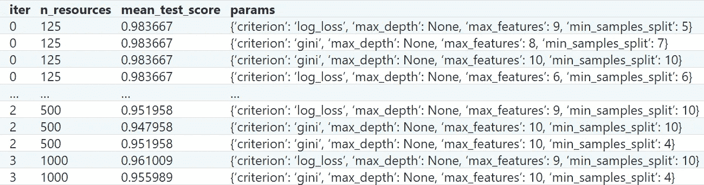

搜索算法生成的日志。（示例取自[官方用户指南](https://scikit-learn.org/stable/modules/grid_search.html#successive-halving-cv-results)。）

对于我们当前的目的，我们希望提取表现最好的前 N 个（默认 5 个）配置及其相关的测试分数。以下函数展示了我们如何实现这一目标：

```py
def logs_analysis(results, N):
    """
    Extracting the top performing configs from the logs.

    Inputs:
    -------
    results: results dict produced by the sklearn search object.
    N: the number of top performing configs to consider.

    Outputs:
    --------
    top_config_summary: a string summary of the top-N best performing configs 
    and their associated test scores.
    last_run_best_score: the best test score obtained in the current search run.
    """

    # Convert to Dataframe
    df = pd.DataFrame(search.cv_results_)

    # Rank configs' performance
    top_configs = df.nsmallest(N, 'rank_test_score').reset_index(drop=True)

    # Considered hyparameters
    hyperparameter_columns = [
        'param_colsample_bylevel', 'param_colsample_bytree', 'param_gamma',
        'param_learning_rate', 'param_max_depth', 'param_min_child_weight',
        'param_n_estimators', 'param_reg_alpha', 'param_reg_lambda',
        'param_scale_pos_weight', 'param_subsample'
    ]

    # Convert to string
    config_strings = []
    for i, row in top_configs.iterrows():
        config = ', '.join([f"{col[6:]}: {row[col]}" for col in hyperparameter_columns])
        config_strings.append(f"Configuration {i + 1} ({row['mean_test_score']:.4f} test score): {config}")

    top_config_summary = '\n'.join(config_strings)

    # Best test score
    last_run_best_score = top_configs.loc[0, 'mean_test_score']

    return top_config_summary, last_run_best_score
```

# 8\. 案例研究

现在我们拥有了所有的要素，是时候将 LLM 指导的工作流程应用于我们的案例研究了。

## 8.1 确定度量标准

首先，我们提示 LLM 建议一个合适的优化度量标准：

```py
# Suggest metrics
prompt = suggest_metrics(report)
response = conversation.predict(input=prompt)
print(response)
```

以下是 LLM 生成的响应：

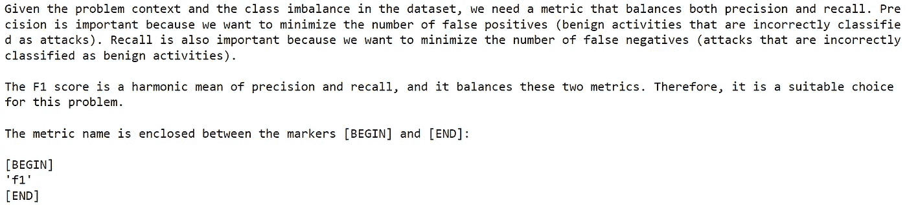

LLM 建议了一个合适的度量标准，并提供了理由。（图片作者提供）

我们可以看到，LLM 根据问题背景和数据集特征推荐了“F1”分数作为度量标准，这与我们的期望一致。此外，度量标准名称被正确地封装在我们指定的后处理标记之间。

## 8.2 第一次搜索迭代

接下来，我们提示 LLM 建议一个初步的搜索空间：

```py
# Initial search space
prompt = suggest_initial_search_space()
response = conversation.predict(input=prompt)
print(response)
```

LLM 的输出如下所示：

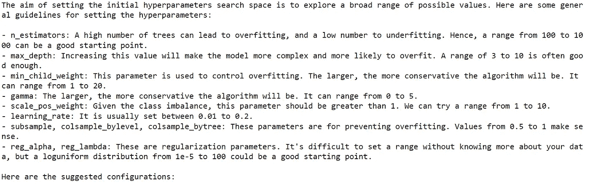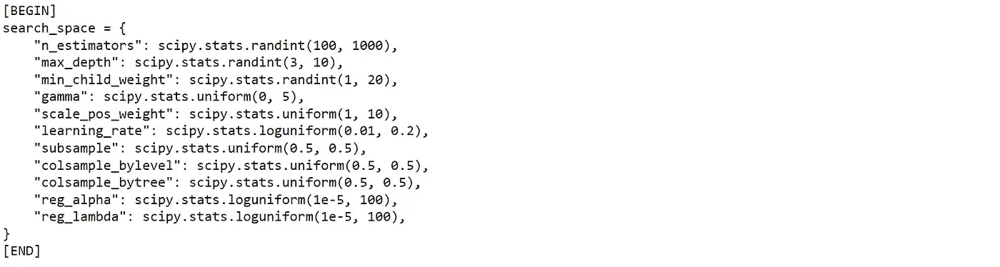

LLM 建议了一个初步的搜索空间，并提供了理由。（图片作者提供）

我们可以看到，LLM 忠实地遵循了我们的指示，并提供了有关设置每个可调超参数的变异范围的详细说明。这对确保超参数调优过程的透明性至关重要。此外，请注意 LLM 成功输出了正确格式的搜索空间。这显示了在提示设计中提供具体示例的重要性。

然后，我们调用随机搜索与连续折半，并运行第一次迭代：

```py
from sklearn.experimental import enable_halving_search_cv
from sklearn.model_selection import HalvingRandomSearchCV
import xgboost as xgb

clf = xgb.XGBClassifier(seed=42, objective='binary:logistic', 
                        eval_metric='logloss', n_jobs=-1, 
                        use_label_encoder=False)
search = HalvingRandomSearchCV(clf, search_space, scoring='f1', 
                               n_candidates=500, cv=5, 
                               min_resources='exhaust', factor=3, 
                               verbose=1).fit(X_train, y_train)
```

请注意，`HalvingRandomSearchCV` 估计器仍处于实验阶段。因此，在使用估计器之前，必须首先显式导入 `enable_halving_search_cv`。

使用 `HalvingRandomSearchCV` 估计器需要设置几个参数。除了指定估计器（clf）、参数分布（搜索空间）和优化指标（f1）外，我们还需要指定控制时间预算的参数。在我们的案例中，我们将 `n_candidates` 设置为 500，这意味着我们将在第一次迭代中抽取 500 个候选配置（每个配置有不同的超参数组合）。此外，`factor` 设置为 3，这意味着每次后续迭代中仅选择三分之一的候选者。同时，这些选中的三分之一的候选者将在后续迭代中使用三倍的资源（即训练样本数）。最后，我们将 `min_resource` 设置为“exhaust”，这意味着在最后一次迭代中，剩余的候选者将使用所有可用的训练样本。有关设置 `HalvingRandomSearchCV` 估计器的详细说明，请参阅此帖子：使用 HalvingGridSearch 速度提升 11 倍的超参数调优。

下面显示了运行 `HalvingRandomSearchCV` 估计器生成的日志快照。在我的电脑上运行搜索的实际时间约为 20 分钟。

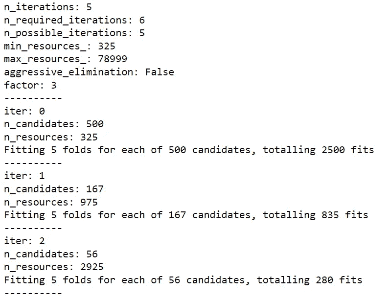

连续缩小随机搜索算法生成的日志快照。（图片来源：作者）

## 8.3 第二次搜索迭代

一旦搜索完成，我们可以从 `search.cv_results` 中检索搜索历史记录，并将其发送到之前定义的 `log_analysis()` 函数以提取调优见解。之后，我们调用 `suggest_refine_search_space()` 函数来提示 LLM 根据之前的搜索结果推荐新的搜索空间：

```py
# Configure prompt
prompt = suggest_refine_search_space(top_n, last_run_best_score, all_time_best_score)

# Refine search space
response = conversation.predict(input=prompt)
print(response)
```

LLM 的响应如下所示：

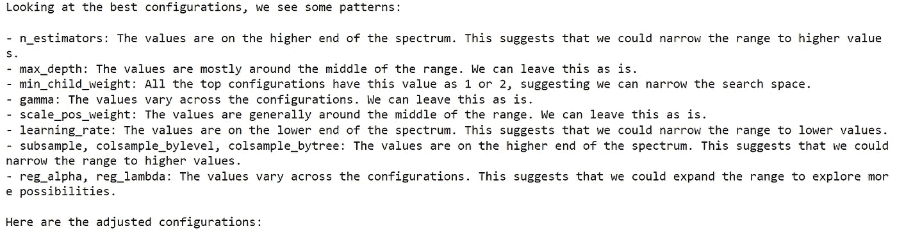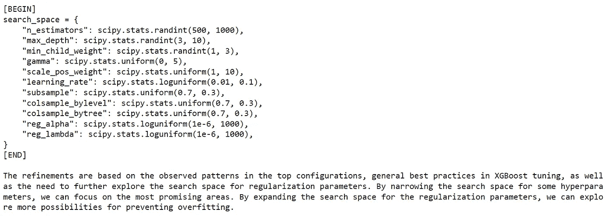

LLM 建议了搜索空间的优化并提供了理由。（图片来源：作者）

在这里，我们可以看到 LLM 建议对一些超参数进行缩小空间，对其他超参数进行扩展空间。这些建议的理由也被清晰地阐述，从而提高了可解释性和透明度。

基于优化后的搜索空间，我们可以第二次运行 `HalvingRandomSearchCV` 估计器：

```py
clf = xgb.XGBClassifier(seed=42, objective='binary:logistic', 
                        eval_metric='logloss', n_jobs=-1, 
                        use_label_encoder=False)
search = HalvingRandomSearchCV(clf, search_space, scoring='f1', 
                               n_candidates=500, cv=5, 
                               min_resources='exhaust', factor=3, 
                               verbose=1).fit(X_train, y_train)
```

在我的电脑上运行搜索的实际时间约为 29 分钟。

## 8.4 第三次搜索迭代

让我们再运行一次 LLM 引导的搜索。与之前一样，我们首先从之前的搜索日志中提取有用的见解，然后提示 LLM 进一步优化搜索空间。LLM 生成的响应如下所示：

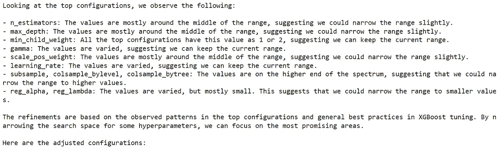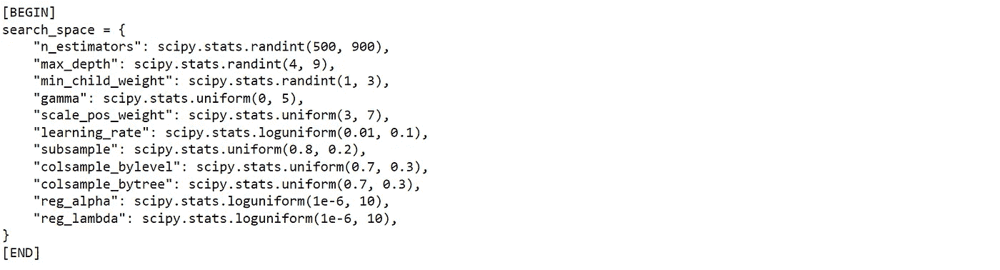

LLM 建议了搜索空间的优化并提供了理由。（图像由作者提供）

在新定义的搜索空间下，我们第三次运行了 `HalvingRandomSearchCV` 估计器：

```py
clf = xgb.XGBClassifier(seed=42, objective='binary:logistic', 
                        eval_metric='logloss', n_jobs=-1, 
                        use_label_encoder=False)
search = HalvingRandomSearchCV(clf, search_space, scoring='f1', 
                               n_candidates=100, cv=5, 
                               min_resources='exhaust', factor=3, 
                               verbose=1).fit(X_train, y_train)
```

在我的 PC 上运行搜索的时间大约为 11 分钟。

## 8.5 测试

经过三轮随机搜索后，让我们测试获得的 XGBoost 模型的性能。为此，我们可以定义一个辅助函数来计算各种性能指标：

```py
from sklearn.metrics import confusion_matrix, ConfusionMatrixDisplay
from sklearn.metrics import (
    precision_score,
    recall_score,
    accuracy_score,
    roc_auc_score,
    f1_score,
    matthews_corrcoef
)

def metrics_display(y_test, y_pred, y_pred_proba):

    # Obtain confusion matrix
    cm = confusion_matrix(y_test, y_pred)

    # Output classification metrics
    tn, fp, fn, tp = cm.ravel()

    print(f'ROC_AUC score: {roc_auc_score(y_test, y_pred_proba):.3f}')
    print(f'f1 score: {f1_score(y_test, y_pred):.3f}')
    print(f'Accuracy: {accuracy_score(y_test, y_pred)*100:.2f}%')
    print(f'Precision: {precision_score(y_test, y_pred)*100:.2f}%')
    print(f'Detection rate: {recall_score(y_test, y_pred)*100:.2f}%')
    print(f'False alarm rate: {fp / (tn+fp)*100}%')
    print(f'MCC: {matthews_corrcoef(y_test, y_pred):.2f}')

    # Display confusion matrix
    disp = ConfusionMatrixDisplay(confusion_matrix=cm)
    disp.plot()

# Calculate performance metrics
y_pred = search.predict(X_test)
y_pred_proba = search.predict_proba(X_test)
metrics_display(y_test, y_pred, y_pred_proba[:, 1])
```

在上述代码片段中，我们将训练好的 XGBoost 模型应用于测试数据集，并评估其性能。获得的混淆矩阵如下所示：

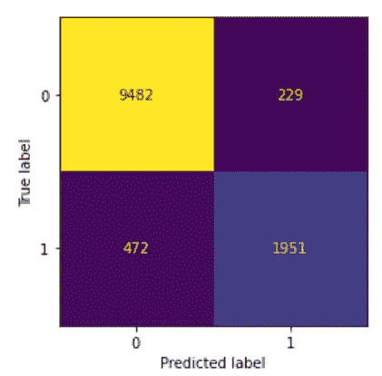

训练后的 XGBoost 模型在测试数据集上的混淆矩阵。（图像由作者提供）

根据混淆矩阵，我们可以计算各种性能指标：

+   准确率：94.22%

+   精确度：89.5%

+   检测率（召回率）：80.52%

+   虚警率（1-特异性）：2.35%

+   ROC-AUC 分数：0.983

+   F1 分数：0.848

+   马修斯相关系数：0.81

# 9. 与开箱即用 AutoML 工具的比较

正如我们在开头提到的，我们希望将开发的 LLM 引导搜索的调优结果与现成的、基于算法的 AutoML 工具进行比较，以评估是否借助 ML 领域专业知识确实能带来价值。

我们将使用的 AutoML 工具叫做 [FLAML](https://microsoft.github.io/FLAML/)，由微软研究院开发，代表 *一种用于自动机器学习和调整的快速库*。此工具是最先进的，支持快速且经济的自动调优，能够处理具有异质评估成本和复杂约束/指导/提前停止的大型搜索空间。有关安装库的详细信息，请参阅 [官方页面](https://microsoft.github.io/FLAML/docs/Installation)。

使用此工具极其简单：在下面的代码片段中，我们首先实例化一个`AutoML`对象，然后调用其`fit()`方法启动超参数调整过程。我们将调整限制在 XGBoost 模型上（FLAML 也支持其他模型类型），并设置 3600 秒的时间预算，这大致等于我们在 3 轮 LLM 引导搜索中花费的总时间（随机搜索时间+ LLM 响应时间）。

```py
from flaml import AutoML

automl = AutoML()
automl.fit(X_train, y_train, task="classification", time_budget=3600, 
          estimator_list=['xgboost'], log_file_name='automl.log', 
          log_type='best')
```

以下是 LLM 引导搜索与开箱即用的 FLAML 结果的比较：

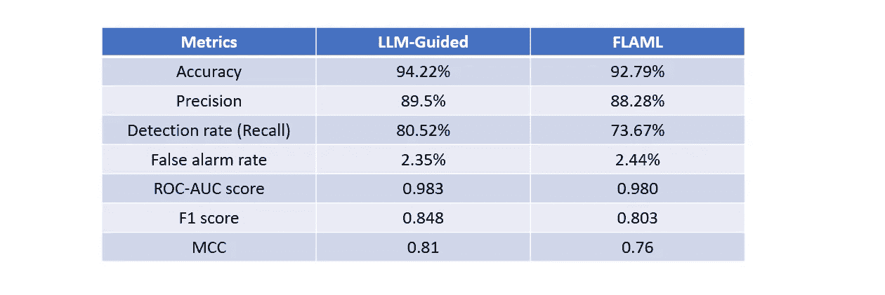

两种调优方法的结果比较。（图像由作者提供）

我们可以看到，LLM-guided 搜索在所有考虑的指标上都比开箱即用的 FLAML 表现更好。由于我们关注的是网络安全应用，两个最重要的指标是**检测率**和**误报率**。在这里，我们可以看到 LLM-guided 搜索成功显著提高了检测率，同时略微降低了误报率。因此，通过 LLM-guided 搜索训练的 XGBoost 模型将是一个优于 FLAML 搜索模型的异常检测器。

总的来说，我们可以得出结论，对于我们当前的案例研究，利用嵌入在 LLM 中的机器学习领域专业知识确实可以在超参数调优中带来价值，即使它与简单的搜索算法配对。

# 10\. 结论

在本博客中，我们探讨了一种新的 AutoML 范式：LLM-guided 超参数调优。这里的关键思想是将大型语言模型视为机器学习专家，并利用其机器学习领域知识来提出合适的优化指标、建议初始搜索空间以及推荐搜索空间的细化。

随后，我们将这种方法应用于识别网络安全数据集的最佳 XGBoost 模型，我们的结果表明，信息驱动的超参数搜索（即 LLM-guided 搜索）比纯算法驱动的 AutoML 工具 FLAML 产生了更好的异常检测模型，达到了更高的检测率和更低的误报率。

如果你觉得我的内容有用，你可以在[这里](https://www.buymeacoffee.com/Shuaiguo09f)请我喝杯咖啡 🤗和往常一样，你可以在[这里](https://github.com/ShuaiGuo16/LLM-guided-AutoML/tree/main)找到包含完整代码的伴随笔记本💻如果你想深入了解，可以查看以下两篇最近的研究论文，它们研究了相同的主题：

+   [AutoML-GPT：与 GPT 的自动机器学习](https://arxiv.org/pdf/2305.02499.pdf)

+   [大型语言模型时代的 AutoML：当前挑战、未来机会与风险](https://arxiv.org/pdf/2306.08107.pdf)

此外，如果你对大型语言模型的其他有趣应用感兴趣，可以看看我之前的博客：

+   构建一个 AI 驱动的语言学习应用

+   开发自主双聊天机器人系统以消化研究论文

+   通过现实生活模拟训练数据科学中的问题解决技能。

期待与你分享更多令人兴奋的 LLM 项目。敬请关注！
