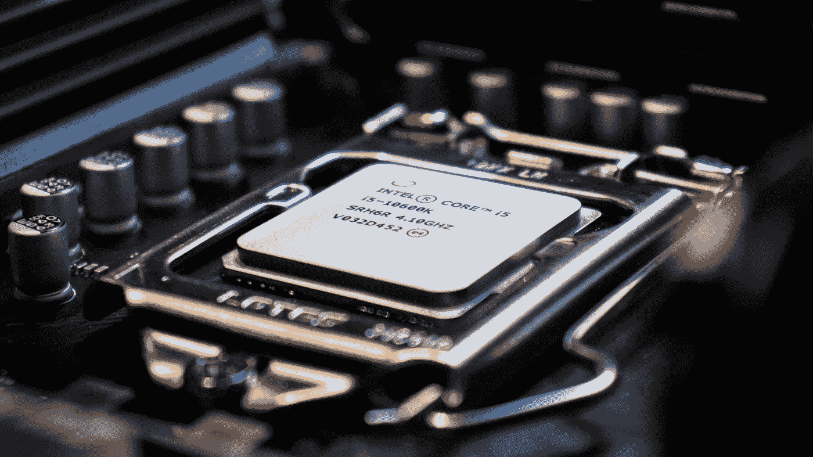

# 何时在 CPU 上运行代码而不是 GPU：典型案例

> 原文：[`towardsdatascience.com/when-cpu-is-faster-than-gpu-typical-cases-bc7c64ee3c66?source=collection_archive---------2-----------------------#2023-05-21`](https://towardsdatascience.com/when-cpu-is-faster-than-gpu-typical-cases-bc7c64ee3c66?source=collection_archive---------2-----------------------#2023-05-21)

## 如何选择硬件以优化特定使用案例的计算

 [Robert Kwiatkowski](https://robertkwiatkowski01.medium.com/?source=post_page-----bc7c64ee3c66--------------------------------)

·

[关注](https://medium.com/m/signin?actionUrl=https%3A%2F%2Fmedium.com%2F_%2Fsubscribe%2Fuser%2F9f55d2ee5cad&operation=register&redirect=https%3A%2F%2Ftowardsdatascience.com%2Fwhen-cpu-is-faster-than-gpu-typical-cases-bc7c64ee3c66&user=Robert+Kwiatkowski&userId=9f55d2ee5cad&source=post_page-9f55d2ee5cad----bc7c64ee3c66---------------------post_header-----------) 发表在 [Towards Data Science](https://towardsdatascience.com/?source=post_page-----bc7c64ee3c66--------------------------------) ·6 分钟阅读·2023 年 5 月 21 日

--

图片来源：[Francesco Vantini](https://unsplash.com/@brostvarta?utm_source=medium&utm_medium=referral) 由 [Unsplash](https://unsplash.com/?utm_source=medium&utm_medium=referral) 提供

随着人工智能（AI）、机器学习（ML）、物联网（IoT）、虚拟现实（VR）以及复杂的数值模拟技术的快速发展，对计算能力的需求达到了前所未有的高度。在大多数现实情况下，不仅计算能力很重要，还有硬件的大小和功耗等因素。

当你根据业务和技术要求设计系统时，可以从各种计算组件中进行选择，例如：

+   集成电路（ICs）

+   微控制器（MCs）

+   中央处理单元（CPU）

+   图形处理单元（GPU）

+   专用芯片，如张量处理单元（TPU）。

尽管这是一个不断发展的计算领域，但有两个关键组件彻底改变了我们处理数据和执行复杂任务的方式。这些组件是中央处理单元（CPU）和图形处理单元（GPU）。这两大计算强者在推动各个领域的进步方面起着至关重要的作用：

+   人工智能（例如 ChatGPT）

+   科学模拟（例如有限元方法、计算流体力学）

+   游戏

+   视觉效果

因此，理解 CPU 和 GPU 的独特能力和性能特征对于充分发挥它们的潜力以及优化整个系统以满足业务需求至关重要。

当谈到降低计算运行成本时，你应该考虑以下方面：

+   硬件成本

+   功耗

+   性能效率

+   维护和升级

关于购买成本，CPU 比中高端 GPU 更实惠。然而，由于 GPU 具有更高的核心数量和内存带宽，它们的能耗比 CPU 高。因此，如果你设计的是一个由 5V 电池供电的简单物联网设备，你可能会关注功耗和低硬件成本——那么 CPU（甚至 IC 或 MC）将是最佳选择。

另外，还有一个选项是使用来自例如 Google、Amazon 或 Azure 等公共云资源，只为使用时间付费。如果你设计的是一个 Web 服务，或者你的硬件需要高计算能力但受限于尺寸或需要远程访问和控制，那么这将是最佳选择。然而，在像智能手机或智能手表这样的量产设备中，硬件成本和功耗仍然发挥着决定性作用。

现在，当考虑计算成本时，总体费用通常是完成任务端到端所需时间的函数。一个好的例子是神经网络（NN）的训练。这本身就是一个计算密集型任务。从端到端的角度来看，还包括数据准备和实验跟踪（用于超参数优化）等额外步骤。这带来了额外的开销。然而，在开发阶段，训练仍然是瓶颈，因此大多数流行的 ML 框架（如 pytorch、Keras）支持 GPU 计算来解决这个问题。这是利用 GPU 能力的经典案例——NN 的训练非常适合大规模并行化。这是由于其底层实现。然而，推理本身（在模型训练之后）通常可以在 CPU 或甚至微控制器上完成。训练之后的瓶颈可能在数据准备方面（内存方面）或 I/O 操作方面。对于这两者，CPU 通常更为适合。这就是为什么有些专用微处理器用于这种任务（如 Intel Atom® Processors x7000E）。所以最终，我们来到了两种不同的最佳解决方案，取决于环境：开发（GPU）和生产（CPU）。

正如你所见，虽然 GPU 在重度并行处理上表现出色，但在一些情况下 CPU 从端到端的角度来看超越它们。这取决于算法的性质和业务需求。如果你是软件开发人员或系统设计师/架构师，了解这些情况对于提供最佳解决方案至关重要。

在本文中，我们将探讨一些此类场景。

**单线程递归算法**

有些算法本身设计上不适合并行化——递归算法。在递归中，当前值依赖于先前的值——一个简单但明确的例子是计算斐波那契数的算法。一个示例实现如下。在这种情况下，无法打破计算链并并行运行它们。

另一个此类算法的例子是递归计算阶乘（见下文）。

**内存密集型任务**

有些任务的瓶颈在于内存访问时间，而不是计算本身。CPU 通常具有比 GPU 更大的缓存大小（快速内存访问元素）以及更快的内存子系统，使其在操作频繁访问的数据时表现出色。一个简单的例子是对大型数组的逐元素加法。

然而，在许多情况下，流行的框架（如 Pytorch）会通过将对象移动到 GPU 的内存中并在后台并行化操作，使这些计算在 GPU 上更快。

我们可以创建一个过程，其中初始化 RAM 中的数组并将它们移动到 GPU 进行计算。传输数据的额外开销导致端到端处理时间比直接在 CPU 上运行要长。

这时我们通常使用所谓的 CUDA 支持数组——在这种情况下，使用 Pytorch。你必须确保你的 GPU 能够处理这种数据大小。给你一个概述——典型的流行 GPU 的内存大小为 2–6GB VRAM，而高端的则有高达 24GB VRAM（GeForce RTX 4090）。

**其他不可并行化算法**

有一类算法虽然不是递归的，但仍然无法并行化。一些示例如下：

+   梯度下降法 — 用于优化任务和机器学习

+   Hash-chaining — 用于加密

梯度下降法在其基础形式中无法并行化，因为它是一个顺序算法。每次迭代（称为一步）依赖于前一次的结果。不过，已经有一些关于如何以并行方式实现此算法的研究。欲了解更多，请查看：

+   [HOGWILD!: A Lock-Free Approach to Parallelizing Stochastic Gradient Descent](https://arxiv.org/abs/1106.5730)

+   [Parallel Stochastic Gradient Descent with Sound Combiners](https://arxiv.org/pdf/1705.08030.pdf)

你可以在这里找到 Hash-chaining 算法的示例：[`www.geeksforgeeks.org/c-program-hashing-chaining/`](https://www.geeksforgeeks.org/c-program-hashing-chaining/)

**小任务**

另一个 CPU 更好的选择是数据量非常小的情况。在这种情况下，RAM 和 GPU 内存（VRAM）之间传输数据的开销可能会超过 GPU 并行处理的好处。这是因为 CPU 缓存的访问速度非常快。这在与内存密集型任务相关的部分中提到过。

此外，一些任务实在太小，尽管计算可以并行运行，但对最终用户的好处不明显。在这种情况下，在 GPU 上运行仅会产生额外的硬件相关成本。

这就是为什么在物联网中，GPU 不常被使用。典型的物联网任务有：

+   捕获一些传感器数据并发送出去

+   在检测到信号后激活其他设备（灯光、警报、马达等）

然而，在这个领域，GPU 仍然用于所谓的边缘计算任务。这些是你必须直接在数据源处获取和处理数据的情况，而不是将其发送到互联网上进行重处理。一个好的例子是宝马开发的[iFACTORY](https://www.bmwgroup.com/en/news/general/2023/BMWGroupIT)。

**小规模并行化任务**

有许多使用场景需要并行运行代码，但由于 CPU 的速度，足以使用多核 CPU 并行化过程。GPU 在需要大规模并行化（数百或数千个并行操作）的情况下表现出色。在你发现例如 4 倍或 6 倍加速已经足够的情况下，你可以通过在 CPU 上运行代码、每个进程在不同核心上来降低成本。如今，CPU 制造商提供的 CPU 核心数在 2 到 18 个之间（例如，Intel Core i9–9980XE Extreme Edition Processor）。

**总结**

总体来说，选择 CPU 和 GPU 的经验法则是回答以下主要问题：

1.  CPU 是否能够在要求的时间内完成整个任务？

1.  我的代码可以并行处理吗？

1.  我能将所有数据放入 GPU 吗？如果不能，这是否会引入较大的开销？

要回答这些问题，关键在于深入理解你的算法是如何工作的，以及当前的业务需求是什么，这些需求未来可能会如何变化。
