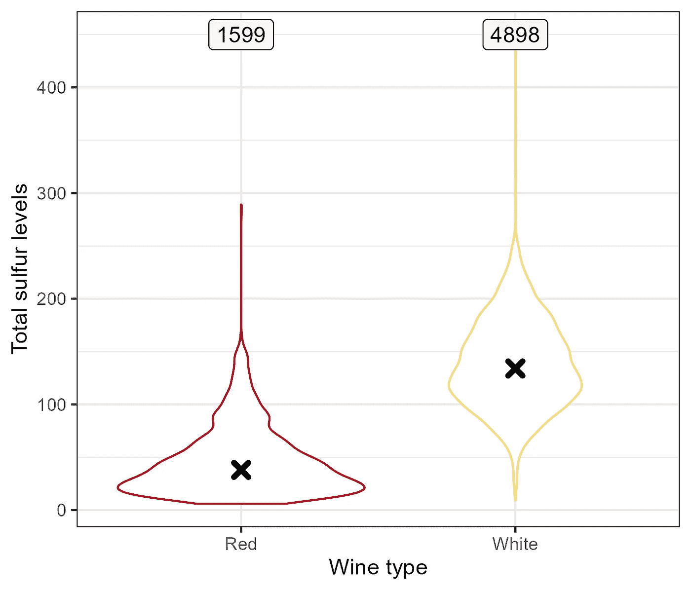

# 何时使用条形图是不正确的？

> 原文：[`towardsdatascience.com/when-is-it-wrong-to-use-bar-charts-70f55a3fb1a2?source=collection_archive---------9-----------------------#2023-05-31`](https://towardsdatascience.com/when-is-it-wrong-to-use-bar-charts-70f55a3fb1a2?source=collection_archive---------9-----------------------#2023-05-31)

## …以及可能的解决办法

[](https://medium.com/@zvonimir.boban.mef?source=post_page-----70f55a3fb1a2--------------------------------)[](https://towardsdatascience.com/?source=post_page-----70f55a3fb1a2--------------------------------) [Zvonimir Boban](https://medium.com/@zvonimir.boban.mef?source=post_page-----70f55a3fb1a2--------------------------------)

·

[关注](https://medium.com/m/signin?actionUrl=https%3A%2F%2Fmedium.com%2F_%2Fsubscribe%2Fuser%2Fe31978768a4e&operation=register&redirect=https%3A%2F%2Ftowardsdatascience.com%2Fwhen-is-it-wrong-to-use-bar-charts-70f55a3fb1a2&user=Zvonimir+Boban&userId=e31978768a4e&source=post_page-e31978768a4e----70f55a3fb1a2---------------------post_header-----------) 发表在 [Towards Data Science](https://towardsdatascience.com/?source=post_page-----70f55a3fb1a2--------------------------------) ·8 分钟阅读·2023 年 5 月 31 日[](https://medium.com/m/signin?actionUrl=https%3A%2F%2Fmedium.com%2F_%2Fvote%2Ftowards-data-science%2F70f55a3fb1a2&operation=register&redirect=https%3A%2F%2Ftowardsdatascience.com%2Fwhen-is-it-wrong-to-use-bar-charts-70f55a3fb1a2&user=Zvonimir+Boban&userId=e31978768a4e&source=-----70f55a3fb1a2---------------------clap_footer-----------)

--

[](https://medium.com/m/signin?actionUrl=https%3A%2F%2Fmedium.com%2F_%2Fbookmark%2Fp%2F70f55a3fb1a2&operation=register&redirect=https%3A%2F%2Ftowardsdatascience.com%2Fwhen-is-it-wrong-to-use-bar-charts-70f55a3fb1a2&source=-----70f55a3fb1a2---------------------bookmark_footer-----------)

由 Canva 文本转图片工具生成的图像

别误解我的意思，条形图可以是数据可视化的一个很好的工具，尤其是在展示计数、总数或比例时。然而，不正确地使用条形图可能会导致无意的（甚至更糟的是，故意的）数据误解。我今天要讨论的具体问题是使用条形图来展示汇总统计数据，如均值或中位数。

这里最大的问题是细节的丧失，因为条形图可能过于简化，遗漏了重要信息，如方差、分布、异常值和趋势。在这篇文章中，我将通过一系列示例来说明这个问题，并提出潜在的解决方案。为了不干扰文章的流程，图表的代码将在末尾指定，供感兴趣的读者参考 :)

## 葡萄酒质量数据集


图片由[Kym Ellis](https://unsplash.com/@kymellis?utm_source=unsplash&utm_medium=referral&utm_content=creditCopyText)提供，来源于[Unsplash](https://unsplash.com/s/photos/wine?utm_source=unsplash&utm_medium=referral&utm_content=creditCopyText)

对于这篇文章，我将使用葡萄酒质量数据集¹，该数据集可通过[UCI ML 数据库](https://archive.ics.uci.edu/ml/datasets/wine+quality)获取。虽然数据集中包含许多葡萄酒属性，但我们将重点关注总二氧化硫测量值。

二氧化硫通常作为二氧化硫添加到葡萄酒中，由于其防腐特性，它在酿酒中发挥着关键作用。作为抗氧化剂，它帮助防止葡萄酒氧化，保护其免受变色和不希望的风味变化。它的抗菌特性还保护葡萄酒免受细菌和酵母的腐败，保持了预期的口味和质量。

# 问题

让我们通过绘制一个简单的条形图来比较红葡萄酒和白葡萄酒的总二氧化硫水平，从而说明这个问题。


图片由作者提供

好吧，也许用上面的例子来批评条形图并不公平，因为基本的图表看起来如此丑陋，没必要进一步论证就让人反感。让我们先通过调整一些美学属性来让它变得更漂亮。


图片由作者提供

好得多。现在，回到手头的问题。这张图表告诉我们什么？显然，白葡萄酒的二氧化硫水平似乎要高得多。这是由于红葡萄酒和白葡萄酒的酿造过程不同而可以预期的。

红葡萄酒在发酵过程中与葡萄皮一起发酵，这提供了天然的抗氧化剂，有助于保护葡萄酒免受氧化。相比之下，白葡萄酒通常通过压榨葡萄并在发酵前去除葡萄皮来制作。这使得白葡萄酒更容易受到氧化，需要额外的保护，例如二氧化硫。

尽管平均效果是明显的，但条形图没有提供关于每组值的分布信息，也没有显示每组的观察数量。

通过在条形上方添加观察数量和添加误差条来显示每组的标准差，可以部分解决这个问题。


图片由作者提供

如果基础值的分布是对称的，这种方法可能足够，但实际情况不一定如此，这使得标准差作为离散统计量并不理想。在条形图中，无法通过添加更多内容来解决这个问题，而不使其更接近完全不同类型的图表。这表明条形图并不适合呈现这种数据类型。

那么，可能的替代方案有哪些？我将在剩下的帖子中讨论几个。

# 修正方案

在这里，我提供了四种可能的替代方案，我认为它们是更好且更透明的解决方案。

## 1\. 抖动点

第一个可能性是将实际的单个观察值添加到图表中。


作者提供的图片

如果观察数量相对较少，这可能是一个很好的替代方案。然而，在这种特定情况下，由于数据集中有大量的葡萄酒，它本身感觉相当繁琐。

## 2\. 带有指定均值的箱形图

第二种替代方案是使用箱形图，并添加指定均值和中位数的功能（默认情况下，中位数由中央箱中的平坦线显示）。尽管箱形图通过指定四分位数给我们提供了底层分布的概念，但我喜欢均值提供的额外信息。这是因为均值和中位数之间的大而明显的差异能立刻告诉我们分布是否偏斜以及偏斜的方向。


作者提供的图片

## 3\. 带有中位数的小提琴图

小提琴图非常好，因为它们让我们了解底层分布的形状，使得容易检测到异常现象，如双峰性或数据偏斜。有人可能会争辩说箱形图也隐含地做到这一点。虽然我在一定程度上同意这一点，但我们也必须考虑到，读懂箱形图需要特定的培训，而小提琴图则不需要。

我还喜欢添加中位数的信息，因为小提琴图留有很多未使用的空间，何乐而不为呢 :)



作者提供的图片

## 4\. 带有抖动点的小提琴图

好吧，这实际上不是一个独立的选项，而是选项 1 和 3 的组合。对于我们的具体情况，这将是我的选择，但这并不意味着它适用于所有可能的场景，因为这取决于问题的具体情况，如比较组的数量、点的总数、组的离散程度等。

注意，我没有尝试将箱形图与特定点结合起来。这是有意的，因为我认为这种结合会违背箱形图的目的。即，箱形图仅在数据点高于中央箱的上边界 1.5 倍四分位范围时显示特定点。这可以作为一种简单的异常值检测方法，而添加过多其他点会使其不清晰。


图片来源：作者

# 结论

本文讨论了使用条形图呈现聚合组统计数据的具体问题，利用葡萄酒质量数据集提供实际示例。在阐述问题后，提出了四种可能的替代方案，并讨论了它们的优缺点。

最后，请记住，任何数据可视化的主要目标是准确有效地传达信息。始终选择最适合数据和你想传达的信息的可视化类型。

我希望你会觉得这篇文章有用。如果你有任何评论，欢迎在帖子下方留言。当然，如果你喜欢你所阅读的内容，请点赞并关注我，以获取更多类似内容。

## 脚注

¹P. Cortez, A. Cerdeira, F. Almeida, T. Matos 和 J. Reis。

通过物理化学属性的数据挖掘建模葡萄酒偏好。载于《决策支持系统》，Elsevier，47(4)：547–553，2009\. (CC BY 4.0)

## 生成图表的代码

```py
library(tidyverse)

wine <- read_delim("winequality-red.csv", 
                    delim = ";", escape_double = FALSE, trim_ws = TRUE) %>%
  mutate(Type = "Red") %>%
  bind_rows(read_delim("winequality-white.csv", 
                        delim = ";", escape_double = FALSE, trim_ws = TRUE) %>%
              mutate(Type = "White")) %>%
  mutate(Type = factor(Type)) %>%
  pivot_longer(`fixed acidity`:`quality`, 
                names_to = "Parameter", values_to = "Value") %>%
  filter(Parameter == "total sulfur dioxide") %>%
  select(-Parameter)

wine_summary <- wine %>%
  group_by(Type) %>%
  summarise(Median = median(Value), Mean = mean(Value), 
            SD = sd(Value), N = n())
#basic bar chart
wine_summary %>%
  ggplot(aes(Type, Mean)) +
  geom_col() +
  labs(x = "Wine type", y = "Total sulfur levels")

#aesthetically pleasing bar chart
wine_summary %>%
  ggplot(aes(Type, Mean)) +
  geom_col(aes(fill = Type), width = 0.8) +
  labs(x = "Wine type", y = "Total sulfur levels") +
  scale_fill_manual(values = c("#b11226", "#F4E076")) +
  labs(x = "Wine type", y = "Total sulfur levels") +
  theme_bw() +
  theme(legend.position = "none")

#bar chart with errorbars and specified number of observations per group
wine_summary %>%
  ggplot(aes(Type, Mean)) +
  geom_col(aes(fill = Type), width = 0.8) +
  geom_errorbar(aes(ymin = Mean - SD, ymax = Mean + SD), width = 0.15) +
  geom_label(aes(y = 200, label = N), fill = "gray97") +
  scale_fill_manual(values = c("#b11226", "#F4E076")) +
  labs(x = "Wine type", y = "Total sulfur levels") +
  theme_bw() +
  theme(legend.position = "none")

#jittered points chart
wine_summary %>%
  ggplot(aes(Type, Mean)) +
  geom_jitter(data = wine, aes(x = Type, y = Value, col = Type), alpha = 0.4) +
  geom_errorbar(aes(ymin = Mean - SD, ymax = Mean + SD), width = 0.15) +
  geom_point(shape = 4, size = 2, stroke = 2) +
  geom_label(aes(y = 450, label = N), fill = "gray97") +
  scale_color_manual(values = c("#b11226", "#F4E076")) +
  labs(x = "Wine type", y = "Total sulfur levels") +
  theme_bw() +
  theme(legend.position = "none")

#boxplot with added information about the mean
wine_summary %>%
  ggplot(aes(Type, Mean)) +
  geom_boxplot(data = wine, aes(x = Type, y = Value, col = Type)) +
  geom_point(shape = 4, size = 2, stroke = 2) +
  geom_label(aes(y = 450, label = N), fill = "gray97") +
  scale_color_manual(values = c("#b11226", "#F4E076")) +
  labs(x = "Wine type", y = "Total sulfur levels") +
  theme_bw() +
  theme(legend.position = "none")

#violin plot with information about the median
wine_summary %>%
  ggplot(aes(Type, Median)) +
  geom_violin(data = wine, aes(x = Type, y = Value, col = Type)) +
  geom_point(shape = 4, size = 2, stroke = 2) +
  geom_label(aes(y = 450, label = N), fill = "gray97") +
  scale_color_manual(values = c("#b11226", "#F4E076")) +
  labs(x = "Wine type", y = "Total sulfur levels") +
  theme_bw() +
  theme(legend.position = "none")

#violin plot with added jittered points
wine_summary %>%
  ggplot(aes(Type, Median)) +
  geom_violin(data = wine, aes(x = Type, y = Value), fill = "gray92") +
  geom_jitter(data = wine, aes(x = Type, y = Value, col = Type), alpha = 0.1) +
  geom_point(shape = 4, size = 2, stroke = 2) +
  geom_label(aes(y = 450, label = N), fill = "gray97") +
  scale_color_manual(values = c("#b11226", "#F4E076")) +
  labs(x = "Wine type", y = "Total sulfur levels") +
  theme_bw() +
  theme(legend.position = "none")
```
