# 当点预测完全无用时

> 原文：[`towardsdatascience.com/when-point-forecasts-are-completely-useless-79cd27d0b1e5`](https://towardsdatascience.com/when-point-forecasts-are-completely-useless-79cd27d0b1e5)

## 虽然点预测非常流行，但要注意一些不幸的陷阱

 [Sarem Seitz](https://sarem-seitz.medium.com/?source=post_page-----79cd27d0b1e5--------------------------------)

·发表于 [Towards Data Science](https://towardsdatascience.com/?source=post_page-----79cd27d0b1e5--------------------------------) ·11 min read·2023 年 1 月 1 日

--

图片由 [Kai Pilger](https://unsplash.com/@kaip?utm_source=unsplash&utm_medium=referral&utm_content=creditCopyText) 提供，来源于 [Unsplash](https://unsplash.com/photos/1k3vsv7iIIc?utm_source=unsplash&utm_medium=referral&utm_content=creditCopyText)

# 介绍

在[上一篇文章](https://www.sarem-seitz.com/why-i-prefer-probabilistic-forecasts-hitting-time-probabilities/)中，我们讨论了概率预测相对于点预测的一个优势——即处理超越时间问题。在这篇文章中，我们将探讨点预测的另一个局限性：高阶统计属性。

对于具有数学或统计学背景的人来说，这些思想将非常熟悉。因此，没有正式训练的读者可能会从这篇文章中获得最多的益处。

在本文结束时，你将对高阶统计属性如何影响预测性能有更好的了解。特别是，我们将看到点预测如何在没有进一步调整的情况下完全失败。

# 点预测失败的两个示例

为了让你对点预测的问题有更深的认识，我们将继续介绍两个非常简单的例子。这两个时间序列都可以用相当简单的自回归数据生成过程来描述。

我们将生成足够的数据，以使自回归梯度提升模型具有合理性。这样，我们避免了使用过于僵化的模型和由于数据不足导致的过拟合。

## 示例 1 — 自回归方差（GARCH）

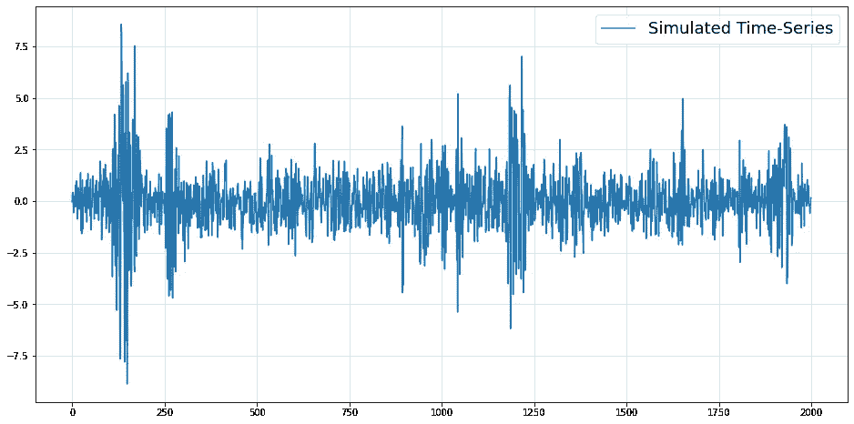

带有自回归方差的模拟时间序列。（图像由作者提供）

这是一个标准的[ARCH](https://en.wikipedia.org/wiki/Autoregressive_conditional_heteroskedasticity)时间序列，这在计量经济学中经常遇到。如果你想了解如何处理这样的数据，我还写了一些文章：

+   [用于 ARCH 类波动率预测的随机森林和提升方法](https://www.sarem-seitz.com/random-forests-and-boosting-for-arch-like-volatility-forecasts/)

+   [使用 Python 和 Tensorflow 进行多元 GARCH](https://www.sarem-seitz.com/multivariate-garch-with-python-and-tensorflow/)

+   [让 GARCH 通过正规化流动变得更灵活](https://www.sarem-seitz.com/lets-make-garch-more-flexible-with-normalizing-flows/)

无论如何，让我们暂时使用时间序列的机器学习模板方法。即，我们使用[Nixtla 的 mlforecast 包](https://github.com/Nixtla/mlforecast)为我们构建一个自回归的提升模型。（这并不是想要批评 Nixtla 包。事实上，如果你知道自己在做什么，它确实非常有用和方便。）

结果如下所示：

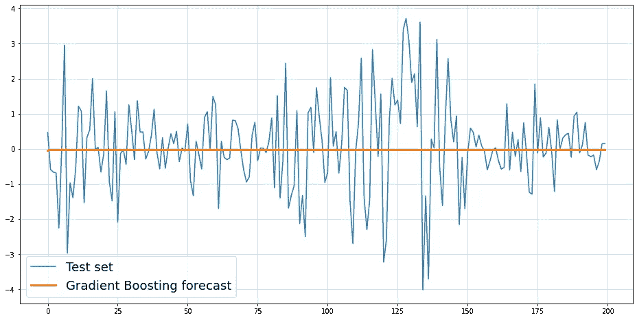

梯度提升对自回归方差的时间序列预测。（图片由作者提供）

不幸的是，结果完全无助。尽管我们提供了实际的滞后数，预测结果实际上毫无用处。

## 示例 2 — 自回归的非高斯数据

下一个示例遵循了一个更复杂的数据生成过程。然而，这并不排除某些实际时间序列也遵循类似的逻辑：

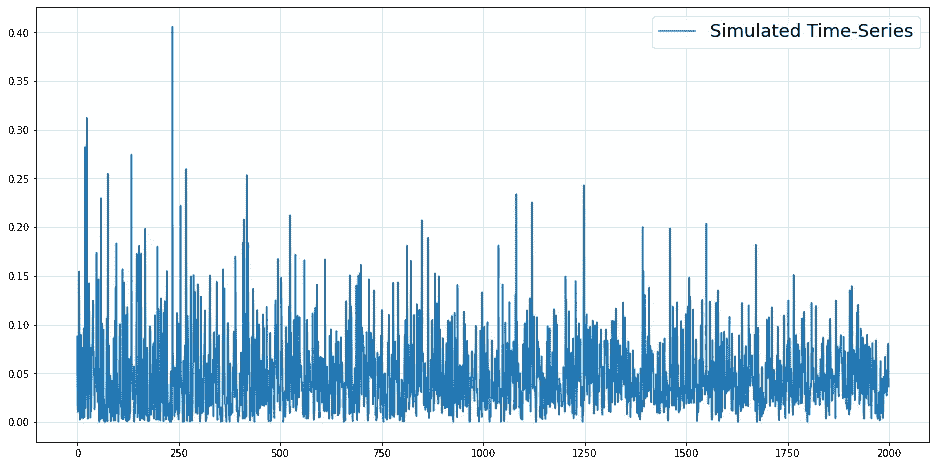

自回归 Beta 分布的模拟时间序列。（图片由作者提供）

让我们检查一下梯度提升模型在这种情况下的表现：

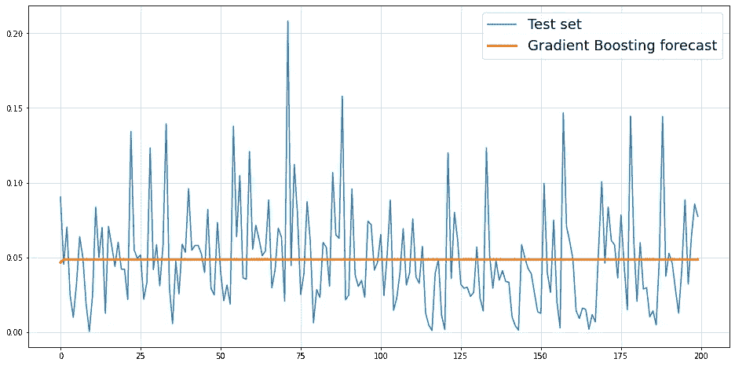

梯度提升对自回归 Beta 分布时间序列的预测。（图片由作者提供）

再次强调，预测结果完全无用。

# 我们的点预测出了什么问题？

如你所知，`sklearn.ensemble.GradientBoostingRegressor`默认情况下最小化**均方误差**（**MSE**）。以下是 MSE 最小化的一个众所周知的属性：

> ***一个分布的均值最小化其均方误差。***

从数学上讲：

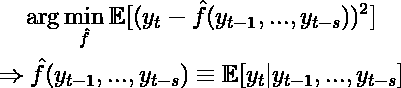

（图片由作者提供）

我们假设一个任意大的可接受函数集合。此外，我们隐含需要假设条件均值实际上存在。这对于大多数表现良好的预测问题是合理的。

因此，上述两个模型都旨在预测我们观察值的条件分布的均值。问题在于，条件均值实际上是按构造设定为常数的。

对于第一个示例来说，这是显而易见的——每个观察值的条件均值为零。对于第二个示例，我们需要做一些数学计算，正式证明留给感兴趣的读者。

现在，虽然条件均值在时间上保持不变，但我们的时间序列仍远非纯粹的噪声。通过均方误差（MSE）最小化来预测均值，在描述未来时显得相当不足。

我们可以进一步声明：

> ***即使是完美的（点）预测模型，如果预测量无信息，也可能是无用的。***

我们可以通过绘制条件密度与条件均值的图来可视化我们的例子：

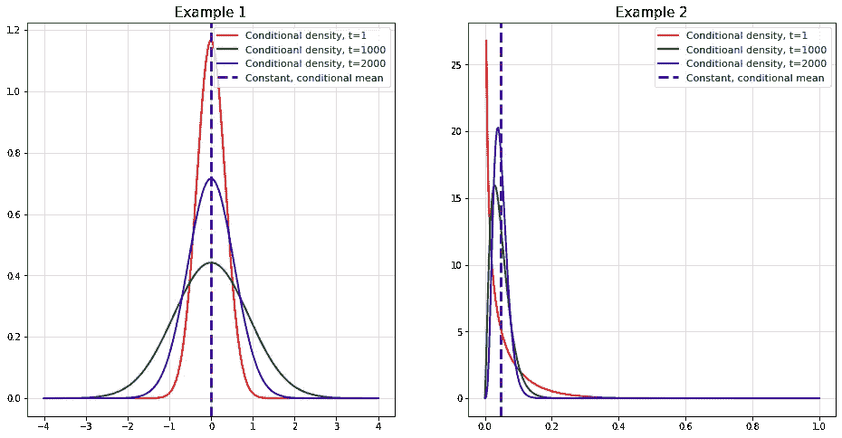

条件密度与（恒定的）条件均值。（图片作者提供）

一方面，条件分布是变化的，可以通过历史数据来预测。然而，条件均值是恒定的，并不能告诉我们未来分布的任何信息。

# 我们能做些什么？

乍一看，上述问题对原始点预测的能力描绘了一个相当严峻的图景。像往常一样，情况当然要复杂得多。

因此，让我们讨论一下如果你的点预测效果不佳，该如何处理的大致思路。

## 评估一下你是否真的有问题——点预测仍然可能有效

正如我们刚才看到的，点预测可能会惨遭失败。然而，既然它们被广泛使用，这表明它们可能会对你的问题造成麻烦。许多预测问题可以通过标准方法合理解决。

有时，你只需要对你的模型投入更多的努力。仅仅使用另一种损失函数或对特征进行另一种非线性变换可能就足够了。然而，一旦你观察到点预测确实无法胜任，可能就该转向概率性方法了。

两种情况可能是很好的指示器：

**1) 你的点预测显示出很少的变化，几乎是恒定的。**

从数学上讲：

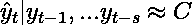

（图片作者提供）

这在我们的例子中确实发生了，并且应该在你的模型验证步骤中可见。正如我们所看到的，目前还没有理由得出模型或数据有问题的结论。

**2) 偶尔的大离群值经常使你的点预测无用。**

这个问题将我们引入了[极值理论](https://en.wikipedia.org/wiki/Extreme_value_theory)的领域，可能值得开一系列博客来讨论。因此，我们将仅简要查看这里发生了什么。

作为一个夸张但具有说明性的例子，考虑以下时间序列：

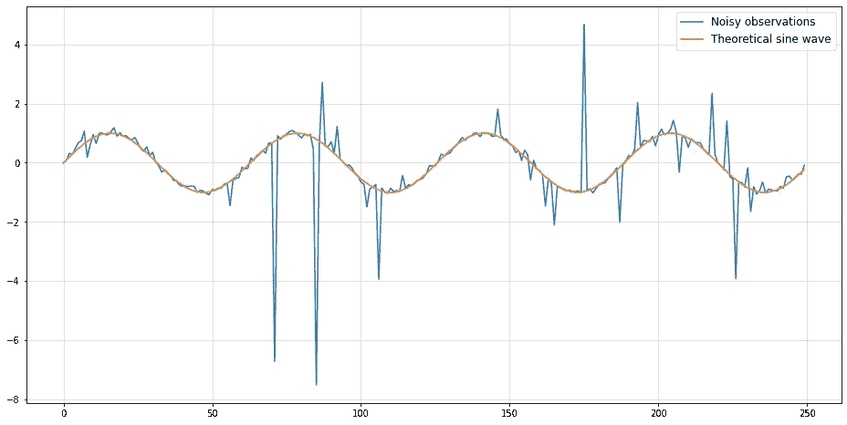

这仅仅是从一个[Cauchy 分布](https://en.wikipedia.org/wiki/Cauchy_distribution)中抽样，该分布的位置由正弦函数决定。现在，让我们看看如果我们的（点）预测只是底层正弦函数的延续，随着样本大小的增加，MSE 如何变化：

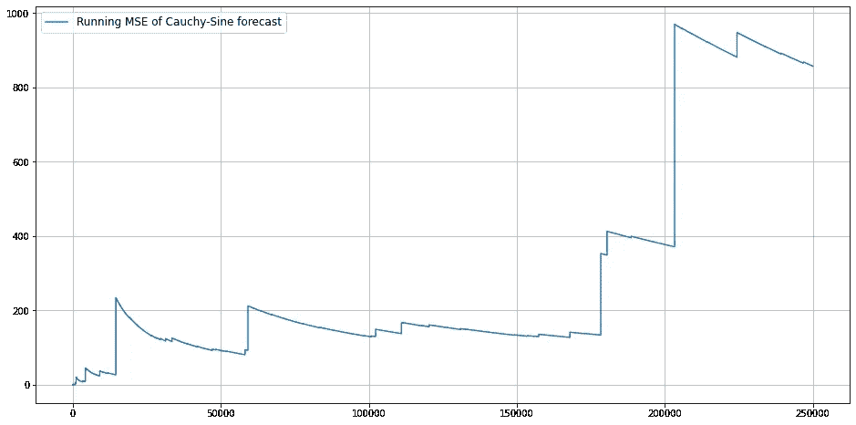

正弦-柯西预测模型的均方误差运行情况。（图片作者提供）

令人惊讶的是，MSE 在**250.000**（**!**）次观察后甚至都没有收敛。无论你观察到多少数据，你的**平均（!）**平方误差仍在增长。这是某些概率分布家族的特性，而柯西分布就是其中之一。

你在日常生活中可能永远不会观察到这样的怪异现象。几乎所有的现实世界时间序列都有某些限制，使得无限的 MSE 不太可能。

然而，了解你观察到大型异常值的可能性至少会有所帮助。例如，想象一下在 2019 年，如果你能得到一个关于旅游业极端崩溃的粗略概率会有多么有价值。

## 调整你对“有用”预测的定义

当然，说服你的利益相关者接受上述点预测问题可能非常困难。对于商业人士来说，概率方法可能看起来像是不必要的火箭科学。

相反，我们通常通过预测与未来观察的匹配程度来衡量预测的成功。如果出了问题，只需增加更多的数据，希望下次会更好。然而，请考虑大多数时间序列系统的基础复杂性。你有多大的机会收集到所有相关数据？

这就像试图收集和处理所有相关因素以预测轮盘赌游戏的确切结果。虽然理论上可能，但巨大的粒度使得实践中几乎不可能实现。

然而，你可能会发现轮盘赌桌上存在一些物理缺陷。如果这些缺陷使赔率向某个方向偏斜，按此做出你的投注可能在长远中让你发财。

如果我们将这个类比转移到一般预测问题上，这就引导我们到一个范式转变：

> ***与其尽可能精确地预测未来，不如让预测模型优化我们在未来结果上的投注几率。***

将这个投注隐喻进一步扩展，我们得出三点关于预测的结论：

**1) 现实世界的决策几乎总是在不确定性下做出**

考虑以下问题：

你是一名冰淇淋供应商，想要优化你的每日库存。为了简单起见，我们假设每天你要么

+   以`90%`的机会出售确切的`10`磅冰淇淋，或者

+   以`10%`的机会出售`0`磅（因为天气实在太差了，你知道的）

此外，假设

+   你可以在每天开始时以`1`金钱购买`1`磅冰淇淋

+   以`1.2`金钱出售`1`磅

+   你的冰淇淋库存每天结束时归零（没有过夜仓储）

+   如果你的总损失超过`-10`金钱，你就会破产

想象一下，你正在为这个问题建立一个需求预测模型，以决定你要出售多少冰淇淋。如果你走点预测+均方误差（MSE）路线，你的结果将如下：

期望需求为`0.9*10+0.1*0 = 9`，因此最小化 MSE 的预测每天也是`9`。你打算每天购买`9`磅冰淇淋吗？如果你连续多次没有销售任何东西，破产的风险怎么办？

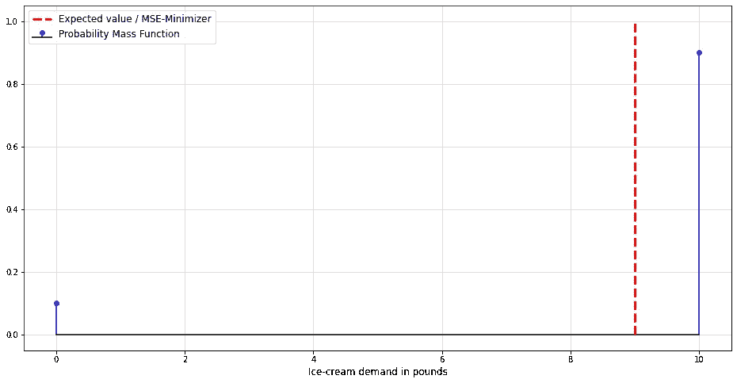

冰淇淋供应商问题的概率质量函数和期望值。（作者提供的图像）

这是不确定性发挥作用的地方，你需要决定你愿意承担多少风险。像生活中的许多情况一样，这也是利润与风险之间的权衡。

不幸的是，仅凭点预测无法考虑任何不确定性。

现在假设我们有一个能够预测相应**概率质量函数**（pmf）的概率预测模型。从这里，我们可以推导出在给定库存`x`的情况下，第`t`天的收益`R`作为一个随机变量：

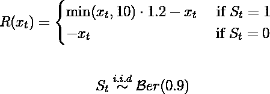

（作者提供的图像）

这些信息可以用在[随机规划](https://en.wikipedia.org/wiki/Stochastic_programming#:~:text=A%20stochastic%20program%20is%20an,assumed%20to%20be%20known%20exactly.)中。后者可以视为对确定性优化的概率扩展。在这里，我们也可以考虑并优化在面对现实世界不确定性时的风险。

事实上，现实世界的复杂性远远超出了我们的小冰淇淋例子。考虑一下这对现实与点预测偏离的可能性意味着什么。

**2) 许多小下注比少数大下注更安全**

回到有缺陷的轮盘赌桌上，假设`0`的概率比预期稍高。你会在一次下注中把所有筹码都押在`0`上，还是在多个回合中小额下注？

如果你运气不好，即使是最小的下注额也可能导致破产。然而，如果你在单次游戏中全押，发生这种情况的概率则要大得多。虽然讨论合适的下注大小超出了本文的范围，但[凯利准则](https://en.wikipedia.org/wiki/Kelly_criterion)可能是一个有用的起点。

在实践中，这可能意味着从每月预测改为每日预测。当然，这只是一个非常简单的建议。受其他因素影响，每日预测可能仍然不够准确或完全无用。在这一点上，你和你的利益相关者的专业知识对于找到正确的平衡是必要的。

**3) 有时候，根本不玩游戏更好**

让我们面对现实吧，总有一些情况下你只能在长期中遭遇损失。如果你的时间序列的信噪比过低，可能会无法提供有用的预测。

资金雄厚的对冲基金正在[为替代数据支付天价](https://edition.cnn.com/2019/07/10/investing/hedge-fund-drones-alternative-data/index.html)。所有这些只是为了使他们的预测比竞争对手的稍微准确一些。除非你能获得相同的数据（即使数据真的很有用），否则你不太可能在相同的投注上持续超越他们。

如果你已经到了这一步，你可能需要寻找新的数据来改善你的预测。如果这样仍然没有帮助，完全依赖于相应的预测也可能有意义。

## 创建多个相关汇总统计的点预测

不再通过 MSE 最小化（或通过 MAE 最小化中位数）来关注均值预测，

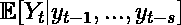

（作者提供的图像）

你还可以预测描述你分布的其他量。

在**示例 1**中，最明显的选择是条件方差，

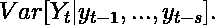

（作者提供的图像）

你可以在[这篇文章](https://www.sarem-seitz.com/random-forests-and-boosting-for-arch-like-volatility-forecasts/#:~:text=Estimating%20Variance%20directly)中找到如何预测条件方差的简要概述。

一旦你的模型预测出高波动期，你可以决定采取更安全的策略。“采取更安全的策略”的含义显然取决于你的预测问题的背景。

**示例 2** 可能也会受益于条件方差预测。然而，请注意[条件偏度](https://en.wikipedia.org/wiki/Skewness)在这里也发挥作用。处理这种情况的一种方法可能是预测条件分位数，即

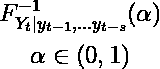

（作者提供的图像）

这被称为[**分位数回归**](https://en.wikipedia.org/wiki/Quantile_regression)，例如，sklearn 的 GradientBoostingRegressor 实际上实现了相应的损失函数。

你应该选择哪些量最终将取决于你的具体问题。这里最大的优势是你不对底层分布做任何假设。而是让你的模型“学习”你关心的分布的重要方面。

另一方面，采用这种方法进行随机优化将是困难的。毕竟，你只是将最相关的信息压缩成几个点预测。如果你想根据某些预测计算正式的最佳决策，你可能会需要

## 将你的点预测替换为概率预测

这是最具挑战性但也最全面的方法。正如我们所见，概率方法的成功往往依赖于你选择的概率分布。

从技术上讲，[非参数](https://en.wikipedia.org/wiki/Nonparametric_statistics)和机器学习方法也可以从数据中学习概率分布。不过，请记住，时间序列问题通常涉及的观测量远少于典型的机器学习用例。因此，这些方法在这里很容易过拟合。

尤其是如果你是 Python 用户，你可能需要自己实现许多模型。与 R 不同，Python 的预测生态系统似乎更加专注于点预测。然而，如果你只需要类似于 SARIMAX 的解决方案，`statsmodel` 将是你的朋友。

下面，我还总结了我们到目前为止讨论的三种不同的预测方法。请记住，这三种方法各有优缺点。

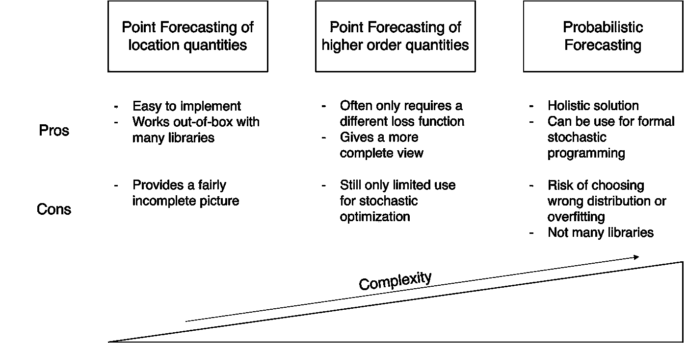

比较不同的预测风格。（图片由作者提供）

# 结论

希望你现在对点预测的陷阱有了更好的了解。虽然点预测本身并不是坏事，但它们只展示了不确定世界中正在发生的事情的不完整图景。

另一方面，概率预测提供了对给定时间序列未来的更丰富视角。如果你需要一个可靠的方法来处理现实世界复杂系统的各种不确定性，这就是最佳选择。不过，请记住，这条路径在很多情况下会需要更多的手动工作。

# 参考文献

**[1]** 汉密尔顿，詹姆斯·道格拉斯。*时间序列分析*。普林斯顿大学出版社，2020 年。

**[2]** 亨德曼，罗布·J.，& 阿塔纳索普洛斯，乔治。*预测：原则与实践*。OTexts，2018 年。

*最初发布于* [*https://www.sarem-seitz.com*](https://www.sarem-seitz.com/when-point-forecasts-are-completely-useless/) *2023 年 1 月 1 日。*
