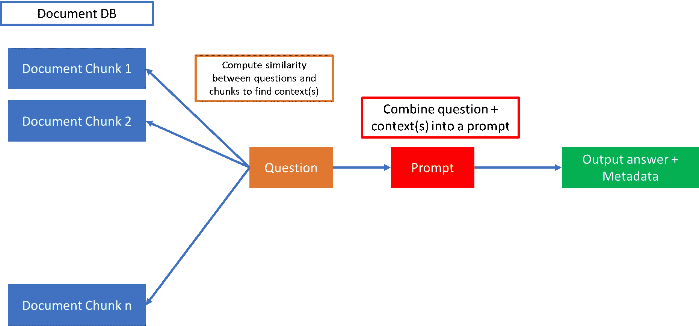

# 你什么时候应该微调 LLM？

> 原文：[`towardsdatascience.com/when-should-you-fine-tune-llms-2dddc09a404a`](https://towardsdatascience.com/when-should-you-fine-tune-llms-2dddc09a404a)

## 最近有一波令人兴奋的开源 LLM 可以进行微调。但这与使用闭源 API 比较如何呢？

[](https://skanda-vivek.medium.com/?source=post_page-----2dddc09a404a--------------------------------)[](https://towardsdatascience.com/?source=post_page-----2dddc09a404a--------------------------------) [Skanda Vivek](https://skanda-vivek.medium.com/?source=post_page-----2dddc09a404a--------------------------------)

·发表于 [Towards Data Science](https://towardsdatascience.com/?source=post_page-----2dddc09a404a--------------------------------) ·7 分钟阅读·2023 年 5 月 15 日

--

我经常被问到这个问题——LinkedIn 上的朋友们问我如何微调开源模型如 LLaMA，企业们试图弄清楚销售 LLM 托管和部署解决方案的商业案例，还有一些公司试图利用 AI 和 LLM 应用于他们的产品。但当我问他们为什么不想使用像 ChatGPT 这样的闭源模型时，他们并没有真正的答案。所以我决定以一个每天应用 LLM 解决业务问题的人的身份来写这篇文章。

# 闭源 API 的案例

你尝试过为你的用例实现 ChatGPT API 吗？也许你想总结文档或回答问题，或者只是想在你的网站上拥有一个聊天机器人。往往你会发现 ChatGPT 在多种语言任务上表现得相当不错。

一个普遍的看法是这些模型太贵了。但以 $0.002/1K tokens 的价格，我敢打赌你至少可以在几百个样本上尝试一下，评估一下 LLM 是否适合你的具体应用。事实上，以每天数千次 API 调用的频率，ChatGPT API 比托管自定义开源模型的基础设施便宜得多正如我在这篇博客中所写的。

一个论点是，假设你想回答成千上万份文档中的问题。在这种情况下，是否不如直接在这些数据上训练或微调一个开源模型，然后让微调后的模型回答关于这些数据的问题更简单？事实证明，这并不像听起来那么简单（由于各种原因，我将在下文的微调数据标注部分讨论）。

但是，ChatGPT 可以通过上下文回答包含数千份文档的问题，这里有一个简单的解决方案。基本上是将所有这些文档作为小块文本存储在数据库中。



将文档卸载到数据库中以进行大规模 LLM 查询 | Skanda Vivek

将所有必要信息提供给模型以回答问题的任务现在从模型架构转移到了包含文档块的数据库中。

相关的文档可以通过计算问题和文档块之间的相似性来找到。这通常通过将文档块和问题转换为词嵌入向量，计算块与问题之间的余弦相似度，最后只选择那些高于某个余弦相似度的块作为相关背景来完成。

最后，问题和背景可以组合成一个如下的提示，并输入到像 ChatGPT 这样的 LLM API 中：

```py
prompt=f"Answer the question. Context: {context}\n Question: {question}"
```

你可能会问——为什么不将整个文档和问题一起放入提示中，而是将其分成块？我们将文档分成块而不是将所有文档组合成一个提示的原因是 LLMs 对最大输入和输出长度有一定的限制。对于 ChatGPT，这个限制是 4096 个令牌，或大约 6-7 页的文本。

将文档卸载到数据库并使用封闭的 LLM API 查询可能在答案显然存在于这些文档中的情况下效果很好。但也有一些情况可能会产生次优结果，例如，如果你希望 ChatGPT 提供关于某个小众话题的专家观点——例如，预测美国经济的财务前景。

# 领域特定的 LLMs

好吧，你试过 ChatGPT 或 BARD——但你不喜欢。答案有些偏差。例如，你问了 ChatGPT：

> “美国经济可能会持续多久的通货膨胀？”

**然后它返回：**

> 作为一个 AI 语言模型，我不能确定地预测未来，特别是涉及复杂经济系统时。然而，我可以提供一些信息和观点，可能有助于你理解当前的情况。
> 
> 通货膨胀是一个复杂的现象，可能由多种因素引起，例如需求增加、供应限制等……

不幸的是，这对你来说还不够好。当然，你可以给 ChatGPT 提供一些关于美联储主席杰罗姆·鲍威尔最近声明的新闻。但这并不能给你与——嗯，杰罗姆·鲍威尔，其他人也可以！或其他专家交流时获得的丰富领域经验。

想一想成为某个领域专家所需的条件。虽然一部分是阅读相关书籍，但更多的是与领域内的专家互动，并从经验中学习。虽然 ChatGPT 已经接受了大量金融书籍的训练，但它可能没有经过顶级金融专家或其他特定领域专家的训练。那么，如何使 LLM 成为金融领域的“专家”呢？这就是微调发挥作用的地方。

# 微调 LLMs

在讨论微调 LLMs 之前，我们先聊聊像 BERT 这样的较小语言模型的微调，这在 LLMs 之前是很常见的。对于像 BERT 和 RoBERTa 这样的模型，微调就是传递一些上下文和标签。任务定义明确，比如从上下文中提取答案，或将电子邮件分类为垃圾邮件或非垃圾邮件。如果你对微调语言模型感兴趣，我写了一些可能对你有用的博客文章：

[## 微调 Transformer 模型以进行自定义数据上的问答](https://towardsdatascience.com/fine-tune-transformer-models-for-question-answering-on-custom-data-513eaac37a80?source=post_page-----2dddc09a404a--------------------------------) [## 微调 Transformer 模型以进行自定义数据上的问答](https://towardsdatascience.com/fine-tune-transformer-models-for-question-answering-on-custom-data-513eaac37a80?source=post_page-----2dddc09a404a--------------------------------)

### 关于如何在自定义数据上微调 Hugging Face RoBERTa QA 模型并获得显著性能提升的教程

[## 通过微调定制文本分类的 Transformer 模型](https://towardsdatascience.com/fine-tune-transformer-models-for-question-answering-on-custom-data-513eaac37a80?source=post_page-----2dddc09a404a--------------------------------) [## 微调 Transformer 模型以进行自定义文本分类](https://towardsdatascience.com/transformer-models-for-custom-text-classification-through-fine-tuning-3b065cc08da1?source=post_page-----2dddc09a404a--------------------------------)

### 关于如何通过微调 DistilBERT 模型来构建垃圾邮件分类器（或其他分类器）的教程

[## 通过微调定制文本分类的 Transformer 模型](https://towardsdatascience.com/transformer-models-for-custom-text-classification-through-fine-tuning-3b065cc08da1?source=post_page-----2dddc09a404a--------------------------------)

然而，大型语言模型（LLMs）之所以备受关注，是因为它们能够通过改变提示的方式无缝地执行多个任务，你的体验类似于与另一端的人对话。我们现在希望的是将这些 LLM 微调为某个特定领域的专家，并像“人类”一样进行对话。这与在特定任务上微调像 BERT 这样的模型截然不同。

最早的开源突破之一是由一组斯坦福研究人员完成的，他们微调了一个 7B LLaMa 模型（Meta 早些时候发布）并称之为 [Alpaca](https://crfm.stanford.edu/2023/03/13/alpaca.html)，花费不到 600 美元进行 52K 指令的训练。随后，Vicuna 团队发布了一个 130 亿参数的模型，达到了 [ChatGPT 90% 的质量](https://lmsys.org/blog/2023-03-30-vicuna/)。

最近，[MPT-7B transformer](https://www.mosaicml.com/blog/mpt-7b)被发布，它能够处理 65k 个 token，是 ChatGPT 输入大小的 16 倍！这次训练从零开始，耗时 9.5 天，成本为 200k$。作为领域特定 LLM 的一个例子，Bloomberg 发布了一个类似 GPT 的模型[BloombergGPT](https://www.bloomberg.com/company/press/bloomberggpt-50-billion-parameter-llm-tuned-finance/)，专为金融领域设计，也是在从零开始训练的情况下构建的。

最近在训练和微调开源模型方面的进展只是小型和中型公司通过定制化 LLM 丰富其产品的开始。那么，你如何决定何时进行微调或训练整个领域特定的 LLM 呢？

首先，重要的是要清楚地确定闭源 LLM API 在你领域中的局限性，并说明让客户以更低成本与领域专家对话的必要性。对大约十万条指令进行微调并不昂贵——但获取正确的指令需要仔细思考。这也是你需要有一点大胆的地方——我目前还没想到很多领域中微调模型在领域特定任务上比 ChatGPT 表现得更好的情况，但我相信这很快就会出现，任何做得好的公司都将获得回报。

这就引出了从头开始训练 LLM 的理由。是的，这可能需要花费数十万美元，但如果你能提供充分的理由，投资者会很乐意出资。在最近的[IBM 采访中，Hugging Face 首席执行官 Clem Delangue](https://research.ibm.com/blog/generative-ai-dario-gil-think?sf177843602=1)评论说，定制化 LLM 很快可能像专有代码库一样普遍，并成为在行业中具有竞争力的关键组成部分。

# 关键要点

应用于特定领域的大型语言模型（LLMs）在行业中可以非常有价值。它们有**3 个逐步增加的成本和定制化水平**：

1.  **闭源 API + 文档嵌入数据库：** 这一解决方案可能是最容易上手的，并且考虑到 ChatGPT API 的高质量——可能会提供足够好（如果不是最好的）性能。而且成本低廉！

1.  **微调 LLMs：** 最近对类似 LLaMA 模型的微调进展表明，这样的微调成本大约为**~500$**，可以在某些领域获得类似于 ChatGPT 的基线性能。如果你有一个包含~50–100k 条指令或对话的数据库，微调一个基线模型可能是值得的。

1.  **从零开始训练：** 如 LLaMA 和最近的 MPT-7B 模型所示，这种方式的成本大约为**~100–200k**，需要一到两周的时间。

既然你已经掌握了这些知识——那就去构建你的定制领域特定的 LLM 应用吧！

*如果你喜欢这篇文章，关注我——我写关于在实际应用中应用最先进的自然语言处理（NLP）技术的话题，更广泛地说，也涉及数据与社会之间的交集。*

*随时在* [*LinkedIn*](https://www.linkedin.com/in/skanda-vivek-01619311b/)*上与我联系！*

*如果你还不是 Medium 会员，并且想要支持像我这样的作者，请通过我的推荐链接注册：* [*https://skanda-vivek.medium.com/membership*](https://skanda-vivek.medium.com/membership)

**以下是一些相关的文章：**

[LLM 经济学：ChatGPT 与开源](https://medium.com/towards-data-science/llm-economics-chatgpt-vs-open-source-dfc29f69fec1)

[如何构建一个基于 ChatGPT 的应用？](https://medium.com/geekculture/how-do-you-build-a-chatgpt-powered-app-89c83f3e2143)

[提取式与生成式问答——哪种更适合你的业务？](https://medium.com/towards-data-science/extractive-vs-generative-q-a-which-is-better-for-your-business-5a8a1faab59a)

[为定制数据微调 Transformer 模型以进行问答](https://medium.com/towards-data-science/fine-tune-transformer-models-for-question-answering-on-custom-data-513eaac37a80)

[释放生成式 AI 为你的客户带来的力量](https://medium.com/geekculture/unleashing-the-power-of-generative-ai-for-your-customers-70297f1c9698)
