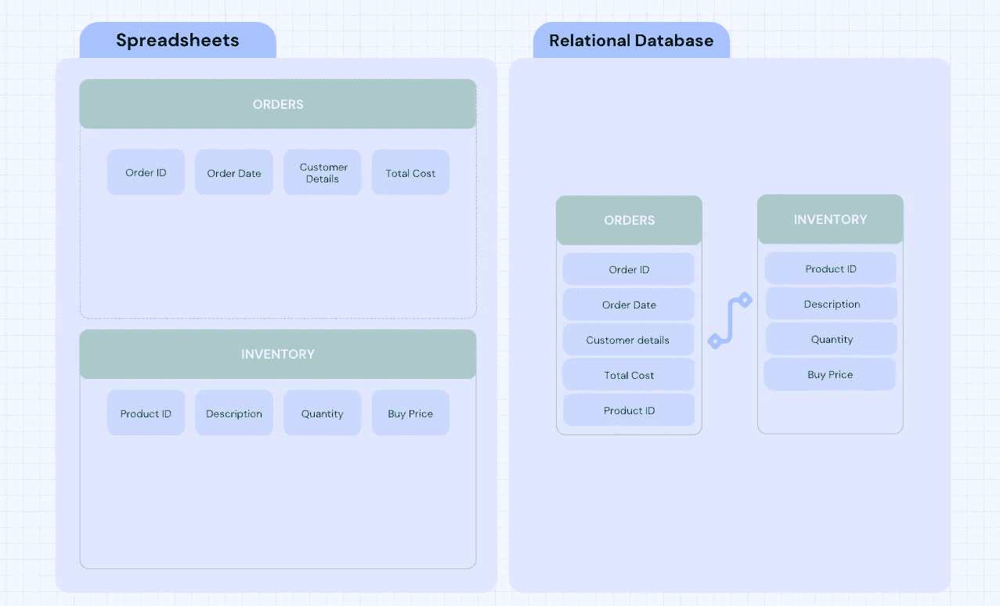
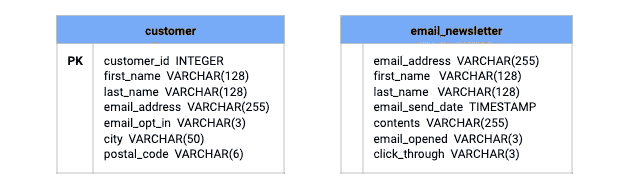
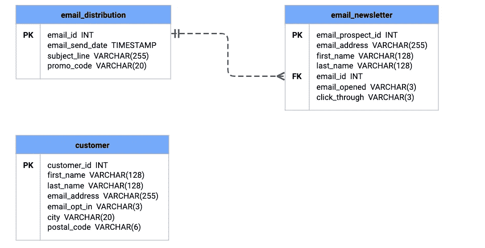
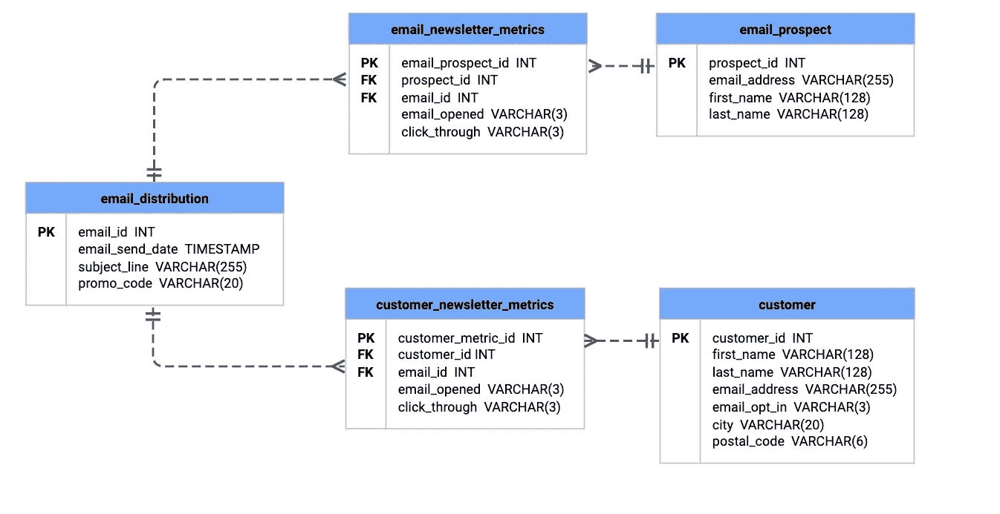
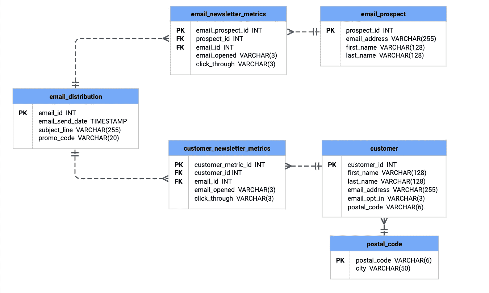
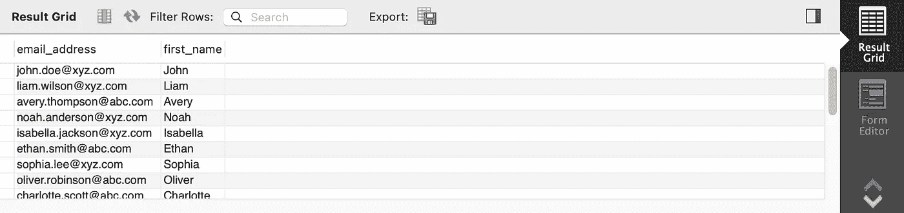

# 当电子表格不够用时：关系数据库的课程

> 原文：[`towardsdatascience.com/when-spreadsheets-arent-good-enough-a-lesson-in-relational-databases-2e5b0b847f5a?source=collection_archive---------8-----------------------#2023-05-12`](https://towardsdatascience.com/when-spreadsheets-arent-good-enough-a-lesson-in-relational-databases-2e5b0b847f5a?source=collection_archive---------8-----------------------#2023-05-12)

## SQL 教程

## 数据库规范化、关系数据库以及你为何需要它们

 [Stephanie Lo](https://medium.com/@stephanie_lo?source=post_page-----2e5b0b847f5a--------------------------------)

·

[关注](https://medium.com/m/signin?actionUrl=https%3A%2F%2Fmedium.com%2F_%2Fsubscribe%2Fuser%2Ff4309a31ceee&operation=register&redirect=https%3A%2F%2Ftowardsdatascience.com%2Fwhen-spreadsheets-arent-good-enough-a-lesson-in-relational-databases-2e5b0b847f5a&user=Stephanie+Lo&userId=f4309a31ceee&source=post_page-f4309a31ceee----2e5b0b847f5a---------------------post_header-----------) 发表在 [Towards Data Science](https://towardsdatascience.com/?source=post_page-----2e5b0b847f5a--------------------------------) ·11 分钟阅读·2023 年 5 月 12 日

--

图片由 [Ivan Liu Hu](https://unsplash.com/ko/@ivanliuhu?utm_source=medium&utm_medium=referral) 提供，发布于 [Unsplash](https://unsplash.com/?utm_source=medium&utm_medium=referral)

你是否曾经等待几分钟才能完全加载和打开一个 Excel 电子表格？在编辑电子表格并尝试提取一些见解时，它是否不断滞后和冻结？对于任何持续在线收集数据的组织来说，这种情况并不少见。但你可以通过实施结构化的关系型数据库来更快地获得结果。

那么关系型数据库到底是什么？它是一组表。可以将每个表视作存储业务不同信息的 Excel 电子表格，但想象一下，如果你可以将这些 Excel 电子表格连接在一起。

电子表格存在于孤岛中，而关系型数据库在表之间建立了关系。

像 MySQL 或 Oracle 这样的关系型数据库非常有用，因为它们设计用来组织大量数据，这可以帮助你更高效地管理数据。如果设计得当，它们可以节省你在任务和分析上的大量时间。

因此，如果你在公司工作并且预期数据量将增长——无论是与订单、客户、采购历史还是营销互动相关——本文旨在解释如何开始思考重组当前的数据实践，以转换为关系型数据库。

## **关系型数据库的优势是什么？**

这里是实施关系型数据库的一些优势以及业务可能克服的挑战：

+   **高效分析：** 关系型数据库允许更快速地检索信息，然后使用 SQL（结构化查询语言）进行分析，以便运行查询。

+   **集中数据管理：** 由于关系型数据库通常要求每个表的每一列输入特定类型或格式的数据，因此不太可能出现重复或不一致的数据。

+   **可扩展性：** 如果你的业务正在经历高速增长，这意味着数据库将扩展，而关系型数据库可以容纳增加的数据量。

你可能仍在考虑关系型数据库是否适合你的公司。让我们通过一个例子来将这一点放入背景中。

## **示例：高速增长的电子商务零售商**

照片由 [Iga Palacz](https://unsplash.com/@igapalacz?utm_source=medium&utm_medium=referral) 拍摄，来源于 [Unsplash](https://unsplash.com/?utm_source=medium&utm_medium=referral)

你为一个本地的二手家具电子商务零售商工作，每周你会向团队提供一份总结销售数据的报告，这有助于采购团队了解他们应该采购更多的商品。

目前，由于库存数据已经输入到 Excel 中，你大部分的分析都是在电子表格上进行的。你很可能使用数据透视表或 vlookup 来计算某些产品或品牌的周度、月度或年度销售百分比变化。最近，你注意到由于销售的库存增加，打开电子表格和进行简单分析都需要很长时间。

在公司处于增长阶段，记录了更多的采购、客户和库存时，Excel 可能无法再有效地完成你的常规任务。这时，关系型数据库可以通过能够大规模存储信息并通过 SQL 提取数据来提供帮助。

如果你对这些情况有共鸣，那么你可能会想知道如何将当前的数据设置转变为关系型数据库。考虑如何结构化你的数据库的一个好方法是进行一个称为**数据库规范化**的过程。

## 数据库规范化的基础

数据库规范化是修改现有数据模式的过程，以使其符合一系列渐进的规范形式。简单来说，就是确保数据以结构化的方式组织。这给你一套规则，帮助你开始对数据进行分类，并形成一个适合你的布局。

通过在数据库中建立结构，你能够帮助建立几个重要的事物：数据完整性和可扩展性。数据完整性确保数据的输入正确和准确，而可扩展性则确保你以一种更具计算效率的方式组织数据，以便在运行 SQL 查询时更为高效。

但是，当我们谈到规范形式时，我们到底在说什么呢？

## **规范化过程的快速概述**

组织过程的每个阶段都被称为“规范形式”。

> *爱德华·C·科德首次提出了这一概念* [*在这里*](https://www.seas.upenn.edu/~zives/03f/cis550/codd.pdf)*，最初描述了七种规范形式。* *然而，为了使本文简洁，我们将解释并讲解前三种规范形式，特别是因为数据库通常被认为“规范化”，如果它符合第三范式。更全面的形式概述和很好的教程可以在* *这里**找到。*

**第一范式 (1NF)**

+   每个表中每一列的值必须简化为最基本的值，也称为原子值。原子值是指列中没有值集合的情况。

+   数据库中没有重复的列或行。

+   每个表应有一个主键，这可以定义为一个非空的、唯一的值，以标识每一行的插入。

**第二范式 (2NF)**

+   符合第一范式规则。

+   调整列，使每个表只包含与主键相关的数据。

+   外键用于建立表之间的关系。

**第三范式（3NF）**

+   符合第一范式和第二范式的规则。

+   需要移动或删除那些传递依赖的列（属性），即那些依赖于其他列的列，而这些列不是外键或主键。

现在我们已经掌握了一些定义，让我们在一个实际的例子中应用这些规范形式规则，以便这些概念能够深入理解。

## **教程：在加拿大零售商中进行受众分割**

由 [charlesdeluvio](https://unsplash.com/@charlesdeluvio?utm_source=medium&utm_medium=referral) 在 [Unsplash](https://unsplash.com/?utm_source=medium&utm_medium=referral) 提供的照片

在这个例子中，我使用了 MySQL 来执行查询，如果你想在其他 SQL 服务器（如 PostgreSQL 或 Oracle）中跟随操作，每个脚本都应进行相应的调整。如果你对 MySQL 不太熟悉，我建议你阅读这些文章 [这里](https://dev.mysql.com/doc/mysql-getting-started/en/) 以获取安装说明，以及 这里 以开始使用。请注意，跟随代码假设你具备一些基础的 SQL 知识。

> 以下数据并非基于实际的电子商务/订阅数据，仅供演示目的使用。合成数据已被创建，以便探索本文讨论的概念（在实际企业中，你将处理数千行数据，而不仅仅是二十行）。要跟随本教程，请查看我的 Github 仓库 [这里](https://github.com/stephrlo/mySQL_database_normalization)，其中包含了数据的完整转换过程，包括数据创建、数据转换和查询。

## **数据库规范化实践**

假设你刚刚被聘为一家电子商务零售商的分析师。你的公司正在进行一次重要的促销活动，你被分配了以下任务：

> 将我们当前的客户和电子邮件订阅者分开，以便我们可以向每个细分市场发送不同的电子邮件优惠，从而推动销售期间的购买。

当你访问数据库时，有几件事会立即引起注意。最显著的是，电子邮件订阅和客户信息被存储在不同的表格中，并且没有建立任何关系，这在执行分配任务时带来了挑战。然而，值得庆幸的是，你拥有相对完整的数据，并且通过一些调整可以在两者之间建立关系以完成任务。以下是当前数据库的详细信息：

上述表格包含了与客户和电子邮件订阅者相关的众多变量，包括他们的地理位置、他们以前收到的电子邮件以及相关的电子邮件指标。

## 第一范式（1NF）

我们可以做的第一件事是查看每列中包含的数据和数据类型，在将每个文件上传到 SQL 服务器之后。我们可以通过执行以下查询来完成此操作：

看起来我们还有很长的路要走才能符合第一范式！回顾一下，达到第一范式的要求涉及正确的行标识和正确分组数据。我们当前的设置违反了第一范式的所有三条规则，这主要集中在`email_newsletter`表中：

+   目前`email_newsletter`没有主键。这迫使数据库用户通过电子邮件地址搜索每个订阅者，这并不被认为是好的实践，因为用户可能会更新他们的电子邮件地址以及隐私问题。

+   `email_newsletter`中的数据还没有达到最简化的形式。经过进一步分析，列内容可以分为两个列，如`subject_line`和`promo_code`。

+   在`email_newsletter`中，重复的组是电子邮件发送和内容。一个用户可以收到很多电子邮件，因此最好的办法是将其从表格中分离出来。

为了解决第一个问题，我们可以在表格的第一列中添加一个唯一的主键到`email_newsletter`，并运行以下查询，其中`email_sign_up_id`是列名，数据类型是`INTEGER`：

通过这个查询，我们添加了一个唯一标识的主键，它会随着每条新数据记录的增加而自动递增。

对于第二次修订，我们需要将`contents`拆分为各自的`subject_line`和`promo_code`字段，我们发现每个字段通常由逗号分隔，我们可以用它来拆分每个字段：

我们的结果是将每列分隔到最简化的形式，以便更清晰地看到每列的类别。

最后，我们可以通过将所有与电子邮件内容相关的数据组织到一个新的表格`email_distribution`中来去除重复的组，别忘了将原表中的数据添加进去！（查看 GitHub [here](https://github.com/stephrlo/mySQL_database_normalization) 获取完整的 SQL，包括数据加载）：

通过上面的查询，我们将电子邮件内容拆分到一个单独的表中，以确保我们不会丢失任何信息。现在我们需要使用以下查询将其与`email_newsletter`表连接起来，使用外键：

这有助于我们遵守第一范式，作为最终步骤，我们可以删除任何冗余的列，并查看我们的布局，然后再进入第二范式：

## 第二范式（2NF）

为了遵守第二范式的规则，我们需要实现第一范式的合规性✓，建立表之间的关系，并确保非键列依赖于主键。以下是我们如何将设置转换为第二范式的步骤：

+   `customer`表目前与其他两个表没有连接，存在在`email_opt_in`列中已经同意提供其电子邮件的客户未被联系的情况。

+   在`email_newsletter`中存在与主键不相关的列，例如`email_open`和`click_through`，这些与其个人信息不是非常相关，因此我们可以考虑将它们分离出来。

我们希望在`customer`和`email_distribution`表之间建立关系，以便拥有我们的两个电子邮件前景和当前客户的两个部分。但是，如果按照目前的情况来连接可能会显得混乱，因为一个客户可能会收到多封电子邮件并干扰主键。因此，一个逻辑的中间步骤是创建一个新表，可以放置在两者之间，我们将其命名为`customer_newsletter_metrics`，以允许这些属性存储在自己的表中：

该表有助于连接我们整个数据库的链接，因为我们在创建表时已经说明了外键，表中的每列都与主键相关且依赖。

我们现在的设置几乎完成了，但有点不平衡——因为我们为客户建立了一个已建立的指标表，但没有为电子邮件前景建立一个表。通过对这一组应用相同的处理，可以帮助减轻未来的问题，因为如果前景的电子邮件更改，则在单独的表中存储这些信息会减少修订（请在 GitHub 上的完整代码[这里](https://github.com/stephrlo/mySQL_database_normalization)进行跟踪）。

将`email_newsletter`重命名为`email_newsletter_metrics`并创建我们的`email_prospect`表后，我们的数据库经过了 2NF 转换：

## 第三范式（3NF）

我们示例的最后一步是遵循第三范式规则，其中包括完成第一和第二范式规则 ✓，最后，分离出彼此依赖的非关键列。

总体而言，我们到目前为止做得很好，以减少非关键列之间的相互依赖，尽管如果我们更仔细地查看客户表，我们会发现城市和邮政编码是相互依赖的，因为邮政编码与客户居住地有关，但也与客户居住的城市有关。在客户搬迁时，这可能会在长期运行中出现问题，一个列可能会被更新，但可能不会更新另一个列。

鉴于此，我们可以创建一个名为`postal_code`的新表，从`customer`表中分离出`postal_code`和`city`，并在这两个表之间建立连接：

上述代码块的最后完成了我们的规范化过程（耶！），我们最终转换后的数据库如下所示：

## **我们重新访问的初始请求：使用关系数据库**

所以我们通过符合第一、第二和第三范式的关系数据库已经准备好了，为什么不检查一下最初给我们的要求：

> 将我们当前的客户和邮件订阅者分开，以便我们可以向每个数据段发送不同的邮件优惠，以推动销售期间的购买。

让我们形成两个简单的查询语句来获取每个数据段的信息：

查询将产生两个表，输出如下所示：

现在你可以自信地发送下一封销售邮件了，确保表格之间没有重复或遗漏的联系人。更重要的是，我们已经按照这样的结构组织了数据库，使数据分析变得更容易，并且为更多客户做好了准备。

## 一些结束语

通过识别日常工作中诸如数据库缓慢或复杂等痛点，本文旨在提供实施关系数据库作为解决方案的方法。通过使用从第一到第三范式的技术，你可以将数据拆分为易于处理和减少错误的可管理块。

> 作为友好的最后提醒，关于所用代码的完整解析，请访问我的 GitHub 仓库 [这里](https://github.com/stephrlo/mySQL_database_normalization)。希望这篇文章能够激发你对关系数据库的新兴趣✨。感谢阅读和关注！

除非另有说明，所有图片均由作者提供。

## **参考文献**

1.  E.F.Codd, [大规模共享数据银行的关系模型](https://www.seas.upenn.edu/~zives/03f/cis550/codd.pdf)，1970 年 6 月，《ACM 通讯》。

1.  E.burns, SQL 数据库规范化完整指南，2021 年 2 月，Medium。

1.  C.Andreou, SQL 介绍，2019 年 8 月，Medium。
