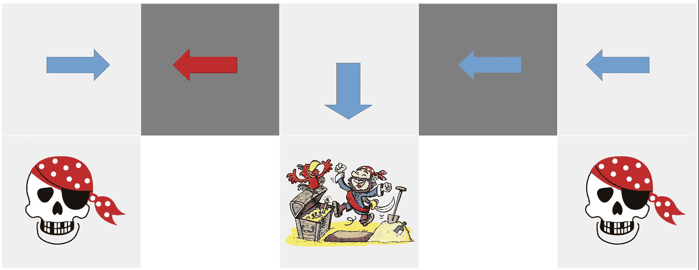
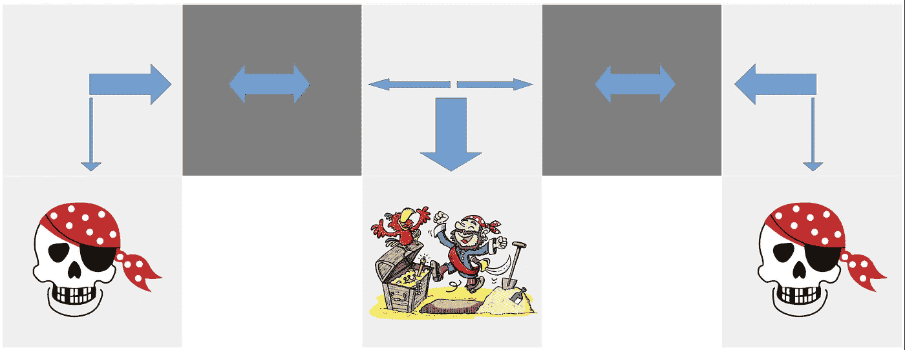
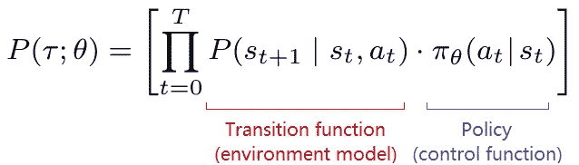
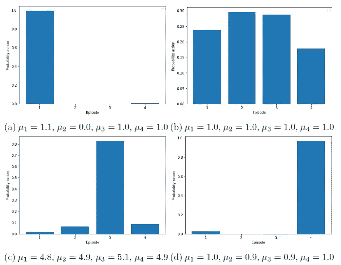

# 随机策略何时优于确定性策略

> 原文：[`towardsdatascience.com/when-stochastic-policies-are-better-than-deterministic-ones-b950cd0d60f4`](https://towardsdatascience.com/when-stochastic-policies-are-better-than-deterministic-ones-b950cd0d60f4)

## 为什么我们让随机性决定强化学习中的动作选择

 [Wouter van Heeswijk, PhD](https://wvheeswijk.medium.com/?source=post_page-----b950cd0d60f4--------------------------------)

·发表于 [Towards Data Science](https://towardsdatascience.com/?source=post_page-----b950cd0d60f4--------------------------------) ·6 分钟阅读·2023 年 2 月 18 日

--

如果使用确定性策略进行石头剪刀布游戏将变得非常无聊 [照片来源： [Marcus Wallis](https://unsplash.com/@marcus_wallis?utm_source=medium&utm_medium=referral) 在 [Unsplash](https://unsplash.com/?utm_source=medium&utm_medium=referral)]

如果你习惯于确定性决策策略（例如，[Deep Q-learning](https://medium.com/towards-data-science/deep-q-learning-for-the-cliff-walking-problem-b54835409046)），你可能会忽视随机策略的必要性和使用。毕竟，**确定性策略**提供了一个方便的状态-动作映射 *π:s ↦ a*，理想情况下甚至是最佳映射（即，如果所有贝尔曼方程都被完美地学习了）。

相比之下，**随机策略 —** 通过给定状态下的动作的条件概率分布表示，*π:P(a|s)* — 看起来相当不方便且不精确。我们为什么要让随机性来指导我们的行动，为什么要将最佳已知决策的选择留给偶然？

实际上，从现有的演员-评论家算法数量来看，大量的强化学习（RL）算法确实使用了随机策略。显然，这种方法必然有其好处。本文讨论了四种情况下，随机策略优于其确定性对手的情况。

 ## 强化学习的四种策略类别

towardsdatascience.com

# **I. 多智能体环境**

可预测性并不总是好事。

从**剪刀石头布**的游戏中可以清楚地看到，确定性策略会惨遭失败。对手会很快发现你*总是*玩石头，并据此选择反制动作。显然，纳什均衡是一个均匀分布的策略，以概率 1/3 选择每个动作。如何学习它？你猜对了：随机策略。

尤其是在对抗性环境中——对手有不同的目标并尝试预测你的决策——在策略中引入一定程度的随机性通常是有益的。毕竟，博弈论规定通常没有纯策略能够始终对对手做出单一的最佳回应，而是将**混合策略**作为许多游戏的最佳动作选择机制。

不可预测性是一个强大的竞争工具，如果需要这种特质，随机策略显然是最佳选择。

面对一个值得的对手时，总是玩相同的游戏会很快适得其反。[照片由 [Christian Tenguan](https://unsplash.com/@christiantenguan?utm_source=medium&utm_medium=referral) 提供，来源 [Unsplash](https://unsplash.com/?utm_source=medium&utm_medium=referral)]

# II. 部分观察（POMDP）

在许多情况下，我们对真实问题状态的了解并不完美，而是试图从**不完美的观察**中推测。部分观察马尔可夫决策过程（POMDPs）领域就是围绕这种状态和观察之间的差异建立的。当我们通过**特征**来表示状态时，这种不完美同样适用，因为在处理大状态空间时通常需要这样做。

考虑大卫·银的著名*别名* *GridWorld*。在这里，状态通过*观察*周围的墙来表示。在下面的插图中，在两个阴影状态中，智能体观察到上方和下方都有墙。尽管**真实状态是不同的**并且需要不同的动作，但它们在**观察中是相同的**。

基于不完美的观察，智能体必须做出决策。**价值函数近似**（例如，[Q-learning](https://medium.com/towards-data-science/walking-off-the-cliff-with-off-policy-reinforcement-learning-7fdbcdfe31ff)）可能很容易陷入困境，总是选择相同的动作（例如，总是向左），从而永远无法获得奖励。ϵ-贪婪奖励可能会缓解这种情况，但仍然大多数时候会陷入困境。

相对而言，策略梯度算法将**以 0.5 的概率学会向左或向右走**，因此可以更快地找到宝藏。通过认识到智能体对环境的感知不完美，它故意采取概率性行动以对抗固有的不确定性。

Aliased GridWorld 中的确定性策略。代理只能观察墙壁，因此无法区分阴影状态。确定性策略将在两个状态中做出相同的决策，这通常会将代理困在左上角。[图片由作者提供，基于 David Silver 的示例，剪贴画来自[GDJ](https://openclipart.org/artist/GDJ) [[1](https://openclipart.org/detail/221913/pirate-paraphernalia), [2](https://openclipart.org/detail/314002/pirate-finds-treasure-by-richardsdrawings)]，通过[OpenClipArt.org](https://openclipart.org/)]

Aliased GridWorld 中的随机策略。代理只能观察墙壁，因此无法区分阴影状态。一个最佳的随机策略将在别名状态中以相等的概率选择左和右，从而更有可能找到宝藏。[图片由作者提供，基于 David Silver 的示例，剪贴画来自[GDJ](https://openclipart.org/artist/GDJ) [[1](https://openclipart.org/detail/221913/pirate-paraphernalia), [2](https://openclipart.org/detail/314002/pirate-finds-treasure-by-richardsdrawings)]，通过[OpenClipArt.org](https://openclipart.org/)]

# III. 随机环境

大多数环境——尤其是现实生活中的环境——都表现出**显著的不确定性**。即使我们在完全相同的状态下做出完全相同的决策，相应的奖励轨迹也可能大相径庭。在我们对期望的下游值有一个合理的估计之前，我们可能需要进行许多训练迭代。

如果我们在环境本身中遇到如此巨大的**不确定性**——如其[转移函数](https://medium.com/towards-data-science/the-five-building-blocks-of-markov-decision-processes-997dc1ab48a7)所反映的——随机策略通常有助于发现这些不确定性。策略梯度方法提供了一种强大且固有的探索机制，这在基于价值的方法的普通实现中是不存在的。

在这种情况下，我们不一定要将固有的概率策略作为最终目标，但在探索环境时它确实有帮助。概率性动作选择和策略梯度更新的结合引导我们在不确定环境中改进，即使这种搜索最终将我们引导到一个**接近确定性的策略**。

在部署随机策略时，控制和环境之间的相互作用生成了强大的探索动态[图片由作者提供]

> 说实话，如果我们抛开价值函数逼近中的标准ϵ-贪婪算法，还有许多强大的探索策略在学习确定性策略时效果非常好：

 ## 你应该知道的七种强化学习探索策略

### 纯探索与**利用**、ϵ-贪心、玻尔兹曼探索、乐观初始化、置信区间……

towardsdatascience.com

# IV. 连续动作空间

虽然有一些变通方法，但在连续空间中应用基于价值的方法通常需要**离散化动作空间**。离散化越精细，原始问题的逼近程度就越高。然而，这会增加计算复杂性。

以自驾车为例。踩油门的力度、踩刹车的力度、加油的程度——这些都是**内在的连续动作**。在连续动作空间中，它们可以通过三个变量来表示，每个变量都可以在一定范围内取值。

假设我们为油门和刹车定义了 100 个强度级别，为方向盘定义了 360 度。这样有 100*100*360=3.6M 种组合，我们有一个相当大的动作空间，但仍然缺乏连续控制的细腻触感。显然，**高维度和连续变量的组合**通过离散化处理起来特别困难。

相比之下，策略梯度方法完全能够**从代表性概率分布中抽取连续动作**，使其成为连续控制问题的默认选择。例如，我们可以通过三个参数化的高斯分布来表示策略，学习均值和标准差。

驾驶汽车是一个固有的连续控制的例子。动作空间离散化得越细致，基于价值的学习就变得越繁琐 [照片来源 [Nathan Van Egmond](https://unsplash.com/@thevanegmond?utm_source=medium&utm_medium=referral) 在 [Unsplash](https://unsplash.com/?utm_source=medium&utm_medium=referral)]

# 向近乎确定性策略的收敛

在结束本文之前，重要的是要强调一个随机策略并不意味着我们会一直做半随机决策直到时间的尽头。

在某些情况下（例如上述的石头剪子布或别名网格世界），**最佳策略需要混合动作选择**（分别为 30%/30%/30%和 50%/50%）。

在其他情况下（例如，[识别最佳老虎机](https://medium.com/towards-data-science/a-minimal-working-example-for-discrete-policy-gradients-in-tensorflow-2-0-d6a0d6b1a6d7)），最佳响应实际上可能是确定性的。在这种情况下，随机策略将收敛到一个**近乎确定性的**策略，例如，以 99.999%的概率选择某个特定动作。对于连续动作空间，策略将收敛到非常小的标准差。

也就是说，政策将永远不会是*完全*确定性的。对于撰写**收敛性证明**的数学家来说，这实际上是一个不错的特性，确保在极限情况下无限探索。现实世界的从业者可能需要稍微务实，以避免偶尔的愚蠢行为。

根据问题的不同，随机政策可能会收敛为接近确定性的政策，几乎总是选择产生最高预期奖励的行动 [图片来源于作者]

# 总结

这里有四种情况下，随机政策比确定性政策更可取：

+   **多智能体环境**：我们的可预测性会被其他智能体惩罚。对我们的行动添加随机性使得对手难以预判。

+   **随机环境**：不确定的环境需要较高的探索程度，而基于确定性政策的算法并未固有地提供这种探索。随机政策会自动探索环境。

+   **部分可观察环境**：由于观察（例如，状态的特征表示）是不完美的真实系统状态的表示，我们难以区分需要不同操作的状态。混合我们的决策可能会解决这个问题。

+   **连续动作空间**：否则，我们必须对动作空间进行精细离散化以学习价值函数。相反，基于政策的方法通过从相应的概率密度函数中抽样优雅地探索连续动作空间。

# 参考文献

[`www.davidsilver.uk/wp-content/uploads/2020/03/pg.pdf`](https://www.davidsilver.uk/wp-content/uploads/2020/03/pg.pdf)

[`www.freecodecamp.org/news/an-introduction-to-policy-gradients-with-cartpole-and-doom-495b5ef2207f/`](https://www.freecodecamp.org/news/an-introduction-to-policy-gradients-with-cartpole-and-doom-495b5ef2207f/#:~:text=On%20the%20other%20hand%2C%20a,when%20the%20environment%20is%20uncertain)

[`en.wikipedia.org/wiki/Strategy_(game_theory)`](https://en.wikipedia.org/wiki/Strategy_(game_theory))
