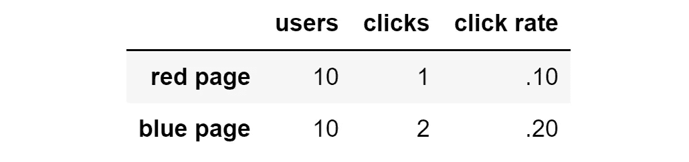
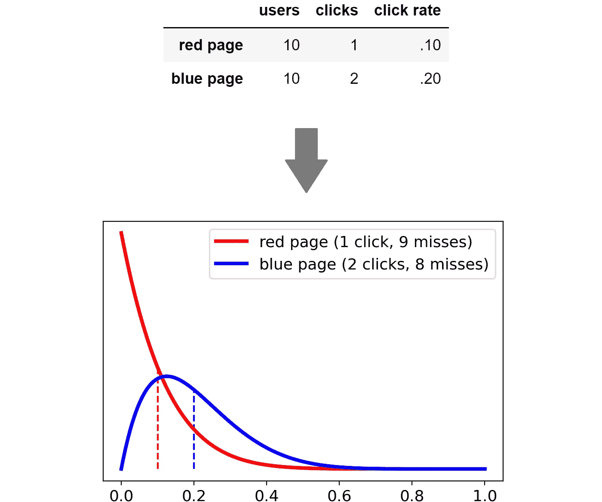
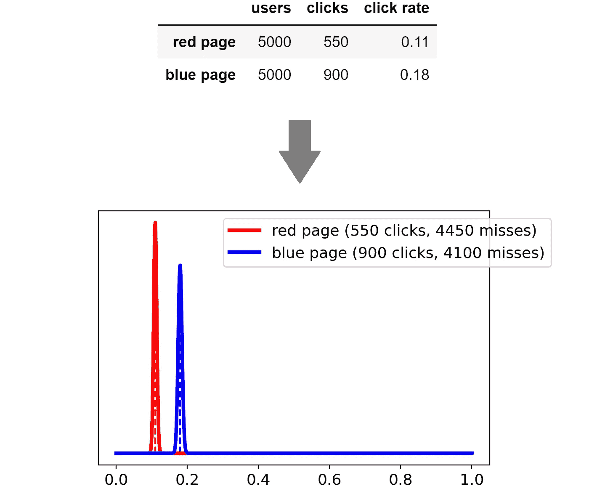
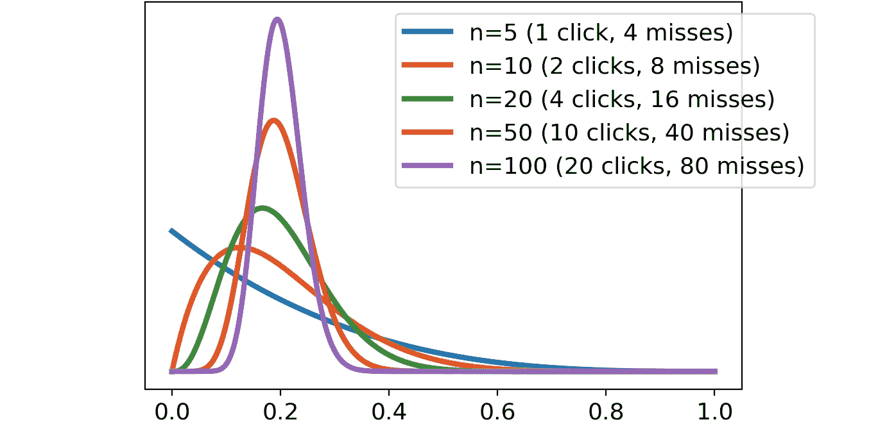
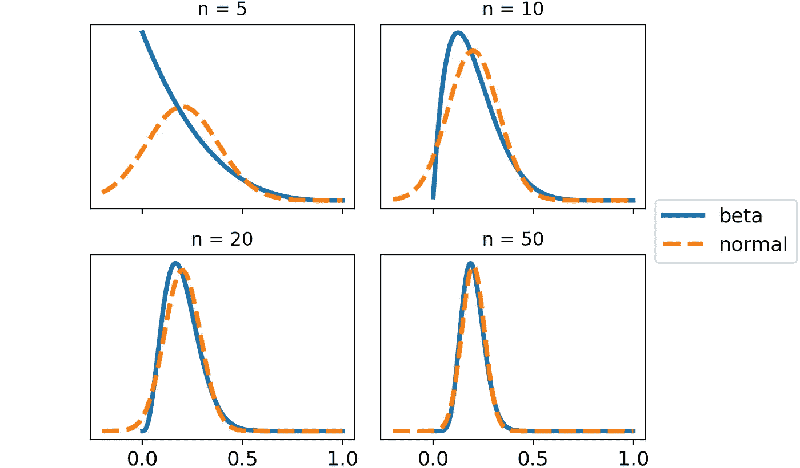
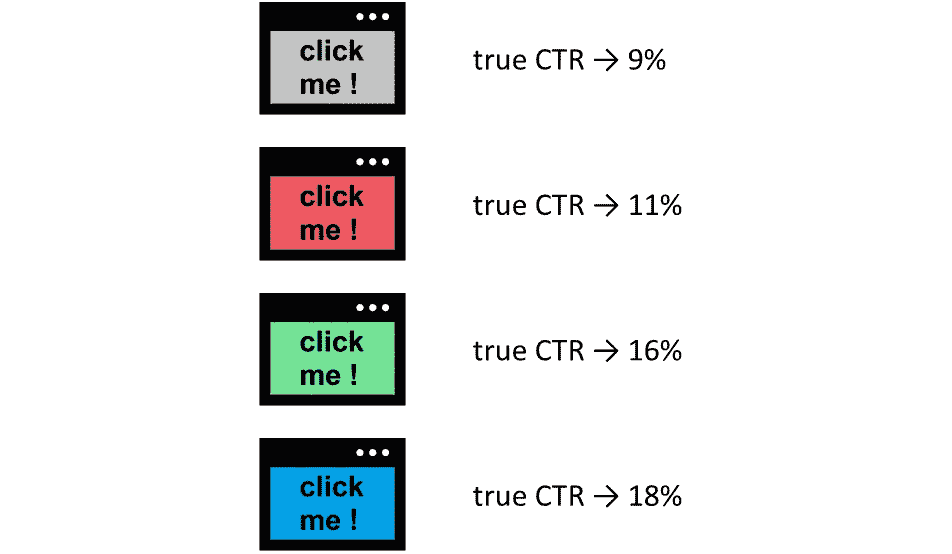
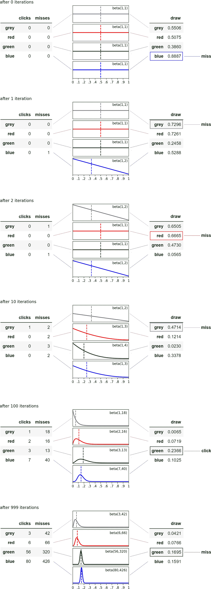
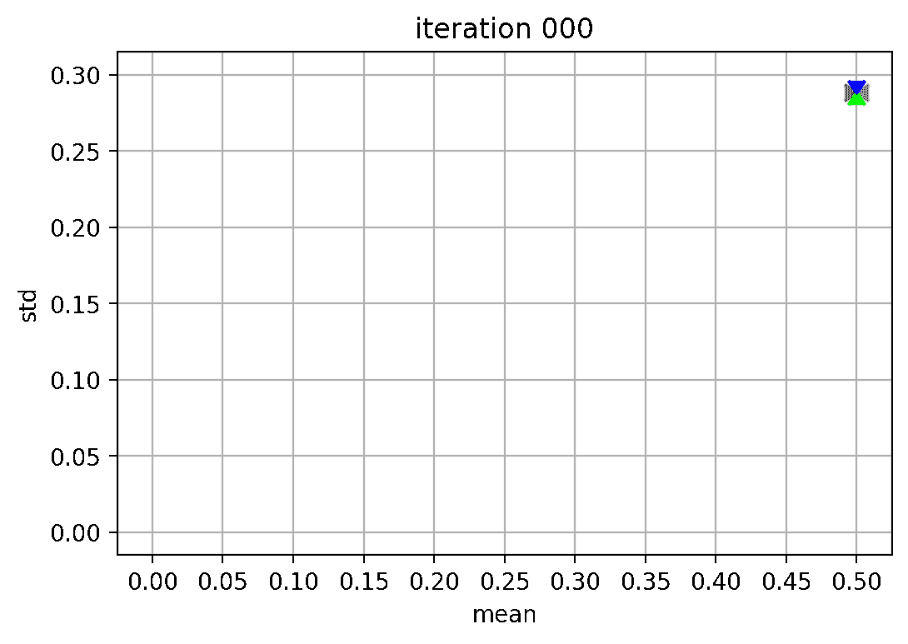
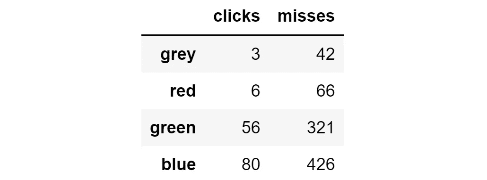
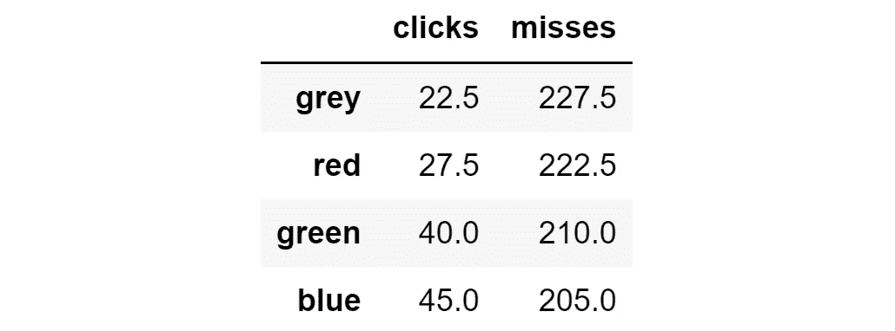

# 你应该何时更喜欢“汤普森采样”而不是 A/B 测试

> 原文：[`towardsdatascience.com/when-you-should-prefer-thompson-sampling-over-a-b-tests-5e789b480458`](https://towardsdatascience.com/when-you-should-prefer-thompson-sampling-over-a-b-tests-5e789b480458)

## 对“汤普森采样”的深入解释，这是一种比 A/B 测试更高效的在线学习替代方法。

[](https://medium.com/@mazzanti.sam?source=post_page-----5e789b480458--------------------------------)[](https://towardsdatascience.com/?source=post_page-----5e789b480458--------------------------------) [Samuele Mazzanti](https://medium.com/@mazzanti.sam?source=post_page-----5e789b480458--------------------------------)

·发布于 [Towards Data Science](https://towardsdatascience.com/?source=post_page-----5e789b480458--------------------------------) ·阅读时长 8 分钟·2023 年 6 月 13 日

--


[图片由作者提供]

想象一下你有两个广告可以选择：红色的和蓝色的。显然，你希望向用户展示点击率最高的广告。


该给用户展示红色广告还是蓝色广告？[图片由作者提供]

但你如何找出哪个广告的点击率最高呢？

回答这个问题最常见的方法是进行 A/B 测试。这意味着将一些用户分开，一半用户看到第一个广告，另一半用户看到第二个广告。最后，你可以计算每个选项的点击率，并选择最佳的广告。

假设在 A/B 测试结束时，你得到了以下结果：


A/B 测试在 10,000 次展示后的结果。[图片由作者提供]

蓝色版本显然优于红色版本：点击率为 18%，而红色版本的点击率为 11%。但**这意味着我们错失了许多机会：我们本可以向更多用户展示蓝色广告，从而获得更多点击**。

另一方面，如果我们非常早地停止实验，比如在只有 20 个用户之后，会怎么样呢？



A/B 测试在 20 次展示后的结果。[图片由作者提供]

我们直观地知道，在 20 个用户之后，结果不够可靠，无法将表现最佳的变体推荐给所有用户。

一般来说，**A/B 测试的问题**是：

+   **如果我们设置了太多用户，我们在表现较差的变体上就会失去机会**；

+   **如果我们只设置了太少的用户，测试结果是不确定的**。

换句话说，A/B 测试效率低，因为它们过于静态。理想情况下，我们需要一个能够随着数据的增加而动态学习的智能系统。

这个系统应该：

+   当结果太小而不可靠时，探索不同的备选方案；

+   当结果开始变得足够可靠时，通过将更多流量发送到表现最好的备选方案来利用这些结果。

好消息是：这样的系统存在，称为 Thompson Sampling。

# 使用概率分布而不是数字

我们上面看到的方法尝试用一个数字来评估每个备选方案：它的点击率。这个方法的问题在于，单一数字无法表达估计本身的相关不确定性。

为了解决这个问题，Thompson Sampling 提出了使用完整的概率分布而不是单一数字。

> 概率分布的目标是表达对指标估计的不确定性。

一旦我们拥有了每个备选方案的分布，Thompson Sampling 就通过从每个分布中抽取一个随机数字来工作。然后，将显示给用户与最高数字相关联的备选方案。

这样做的意义是什么？实际上，思想是，如果分布表达了高度的不确定性，那么结果在很大程度上取决于运气。

换句话说，我们对信念的信心越小，系统就会探索更多的不同备选方案。相反，信心增加时，系统会越来越多地利用表现最好的备选方案。

让我们看看从上述结果中可以得到的两个概率分布。



20 次印象后的概率分布。[图片来自作者]

如果你尝试从这两个分布中提取随机数字，你会发现从红色分布中抽取的数字比从蓝色分布中抽取的数字大 24% 的时间。这在数字上证明了我们的直觉：差异仍然在统计上不显著。

但是 10,000 次印象之后呢？



10,000 次印象后的概率分布。[图片来自作者]

现在我们非常确信蓝色页面的表现优于红色页面。事实上，从红色分布中抽取的数字大于从蓝色分布中抽取的数字几乎是不可能的。

# 我应该使用什么分布？

在我们的例子中，由于我们有一个二元结果（点击或未点击），首选分布是 Beta 分布。Beta 分布的有趣之处在于，它完全基于两个参数 `a` 和 `b`，这些参数可以以非常直观的方式解释：

+   `a`：成功的次数（在我们的情况下是点击的次数）。

+   `b`：失败的次数（在我们的情况下是未点击的次数）。

分布的期望值为 `a / (a + b)`，这是我们关注的量：点击率。

Beta 分布在 Scipy 中也可用，因此很容易计算：

```py
import numpy as np
from scipy import stats

# input: number of clicks and number of misses
clicks = 1
misses = 4

# get 1000 equally spaced points between 0 and 1 for plotting purposes
x = np.linspace(start = 0, stop = 1, num = 1_000)

# calculate probability distribution function of beta
beta_pdf = stats.beta(a = clicks, b = misses).pdf(x = x)
```

让我们绘制一些例子。以 20% 的点击率为例：当印象次数增加时，Beta 分布会发生什么变化？



当点击和未点击的数量成比例增加时，Beta 分布如何变化。[图片由作者提供]

正如我们预期的那样，随着用户数量的增加，结果变得越来越确定：这意味着分布越来越集中在期望值 20% 周围。

换句话说，**与概率分布一起工作使我们能够为定性评估分配定量的确定性度量**。

# 为什么不使用 Normal 分布？

如果你修过统计学 101，你可能会问：“等等。根据中心极限定理，如果我们有独立的试验，我们应该使用 Normal 分布。那么为什么我们使用 Beta 分布？”

的确，这是一个好点子。让我们看看如何在 Python 中计算 Beta 和 Normal 概率分布函数。

```py
import numpy as np
from scipy import stats

# input: number of clicks and number of misses
clicks = 1
misses = 4

# compute n and click rate
n = clicks + misses
click_rate = clicks / n

# get 1000 equally spaced points between 0 and 1 for plotting purposes
x = np.linspace(start = 0, stop = 1, num = 1_000)

# calculate the probability distribution function of beta
beta_pdf = stats.beta(a = clicks, b = misses).pdf(x = x)

# calculate the probability distribution function of normal
normal_pdf = stats.norm(
  loc = click_rate, 
  scale = np.sqrt(click_rate * (1 - click_rate) / n)
).pdf(x = x)
```

对不同数量的用户重复这个过程，并比较这两个分布：



当观察数量增加时，Beta 和 Normal 分布几乎是相同的。[图片由作者提供]

正如你所见，Beta 分布和 Normal 分布随着印象次数的增加变得越来越相似。在仅 50 次迭代后，它们几乎变成了一回事。

因此，使用 Beta 分布或 Normal 分布不会有太大区别。这是一个好消息，因为这意味着——得益于 CLT——无论选择哪种指标，我们总是可以使用 Normal 分布。

# **Thompson Sampling 实际应用**

让我们做一个例子来看看 Thompson Sampling 的实际应用。

我们想测试 4 个广告版本：灰色、红色、绿色和蓝色。假设我们还知道每个版本的真实点击率。



4 个不同广告及其真实点击率。[图片由作者提供]

与前一段一样，我们将使用 Beta 分布。但我们需要做一点小调整。由于 Beta 的参数（`a` 和 `b`）必须严格大于 0，所以如果 `a` 和 `b` 之间至少有一个为 0，我们将分别加 1。

```py
import numpy as np

def draw_from_beta(clicks, misses):
  """Draw a random number from Beta."""

  if min(clicks, misses) == 0:
    clicks += 1
    misses += 1

  return np.random.beta(a=clicks, b=misses)
```

对于每个新用户，我们必须做以下操作：

1.  根据每个变体当前的点击和未点击数量，获取相应的 Beta 分布。

1.  从在第 1 点获得的每个变体的分布中抽取一个数字。

1.  向用户展示与最高数字相关的变体。

1.  用当前用户获得的结果（点击或未点击）更新计数器。

让我们看看前 1,000 个用户的这个过程的图形表示：



Thompson Sampling 算法在前 1,000 个用户上的工作。[图片由作者提供]

如你所见，经过 100 次迭代后，我们的信念仍然与真实情况不符：绿色变体的预期值大于蓝色。但这只是由于偶然。随着经验的积累，我们的估计将会趋近于真实。这意味着：

+   分布的均值将更接近真实率；

+   分布的标准差将越来越接近于零。

让我们看看这两个量在前 400 次迭代中的演变情况。



算法的前 400 次迭代。标准差和均值如何随迭代次数的增加而变化。[作者提供的图片]

正如我们所见，经过 1,000 次展示后，结果如下：



通过托普森采样获得的点击次数和漏失次数。[作者提供的图片]

托普森采样非常有效，仅仅经过 1,000 次迭代，它已经将 50.6%的展示集中在最佳替代方案（蓝色）上，将 37.7%集中在第二好的（绿色）上。

相反，如果我们采用 A/B 测试方法，将每个广告分别展示给相同数量的用户，会发生什么呢？将每个广告展示给 250 名用户将产生以下结果：



如果我们以纯随机方式分配变体（A/B 测试方法），预期的点击次数和漏失次数。[作者提供的图片]

使用托普森采样我们获得了 145 次点击，而 A/B 测试则得到 135 次点击。这意味着托普森采样比 A/B 测试多出 7.4%的点击！如果我们进行更多的迭代，差异将会更大。

# 结论

托普森采样非常适合在线学习，因为它有效解决了探索/利用的困境。

它通过为每个变体分配一个概率分布来做到这一点。这个分布用于表达与估计相关的不确定性。

托普森采样通过动态适应来自之前迭代的知识，使其比 A/B 测试更高效。

例如，我们已经看到一个例子，其中有 4 个变体——在仅仅 1,000 次迭代中——托普森采样能够比 A/B 测试多获得 7%的点击。

*用于本文的所有代码可以在* [*此笔记本中找到*](https://github.com/smazzanti/tds_thompson_sampling/blob/main/tds_thompson_sampling.ipynb)*。*

*感谢阅读！*

*如果你觉得我的工作有用，你可以订阅* [***每次我发布新文章时收到电子邮件***](https://medium.com/@mazzanti.sam/subscribe) *(通常每月一次)。*

*如果你想支持我的工作，你可以* [***请我喝咖啡***](https://ko-fi.com/samuelemazzanti)*。*

*如果你愿意，* [***在 Linkedin 上添加我***](https://www.linkedin.com/in/samuelemazzanti/)*！*
