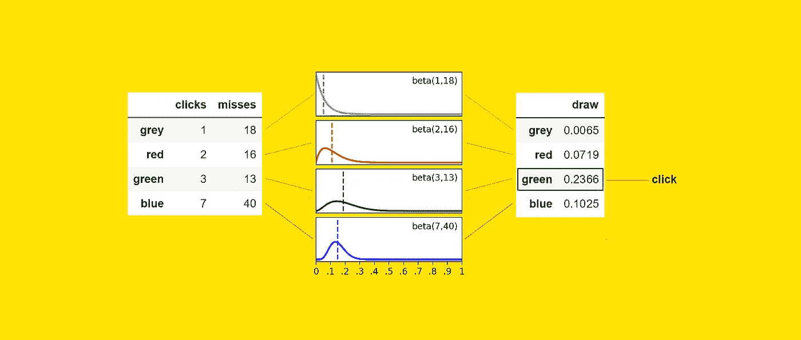
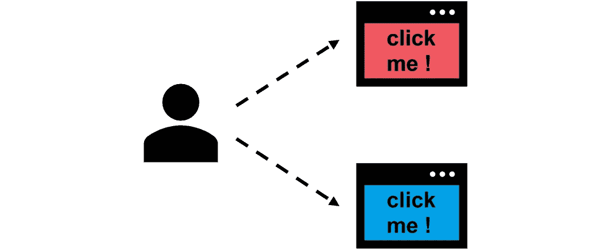
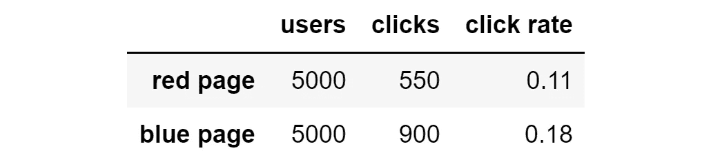

# 何时应优先选择“汤普森采样”而不是 A/B 测试

> 原文：[`towardsdatascience.com/when-you-should-prefer-thompson-sampling-over-a-b-tests-5e789b480458?source=collection_archive---------0-----------------------#2023-06-13`](https://towardsdatascience.com/when-you-should-prefer-thompson-sampling-over-a-b-tests-5e789b480458?source=collection_archive---------0-----------------------#2023-06-13)

## 对“汤普森采样”的深入解释，这是一种比 A/B 测试更高效的在线学习替代方案

 [Samuele Mazzanti](https://medium.com/@mazzanti.sam?source=post_page-----5e789b480458--------------------------------)

·

[关注](https://medium.com/m/signin?actionUrl=https%3A%2F%2Fmedium.com%2F_%2Fsubscribe%2Fuser%2Fe16f3bb86e03&operation=register&redirect=https%3A%2F%2Ftowardsdatascience.com%2Fwhen-you-should-prefer-thompson-sampling-over-a-b-tests-5e789b480458&user=Samuele+Mazzanti&userId=e16f3bb86e03&source=post_page-e16f3bb86e03----5e789b480458---------------------post_header-----------) 发表在 [Towards Data Science](https://towardsdatascience.com/?source=post_page-----5e789b480458--------------------------------) · 8 分钟阅读 · 2023 年 6 月 13 日

--

[图片来源：作者]

想象一下，你有两个广告可以选择：红色的和蓝色的。当然，你希望向用户展示点击率最高的广告。

展示给用户的是红色广告还是蓝色广告？ [图片来源：作者]

那么你如何找出哪个广告的点击率最高呢？

回答这个问题最常见的方法是进行 A/B 测试。这意味着将一些用户分开，向一半用户展示第一个广告，向另一半用户展示第二个广告。最后，你可以计算每个版本的点击率，并选择最佳的广告。

假设在 A/B 测试结束时，你得到了以下结果：

A/B 测试在 10,000 次展示后的结果。[图片由作者提供]

蓝色版本明显优于红色版本：点击率为 18%，而红色版本的点击率为 11%。但**这意味着我们错过了许多机会：我们本可以展示**…
