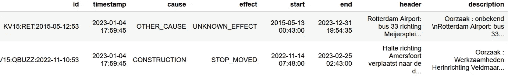

# 公交车在哪里？GTFS 将告诉我们！

> 原文：[`towardsdatascience.com/where-is-the-bus-gtfs-will-tell-us-f8adc18a2f8e`](https://towardsdatascience.com/where-is-the-bus-gtfs-will-tell-us-f8adc18a2f8e)

## 基于 GTFS 实时数据，显示荷兰公共交通车辆的实时位置

[](https://leo-vander-meulen.medium.com/?source=post_page-----f8adc18a2f8e--------------------------------)[](https://towardsdatascience.com/?source=post_page-----f8adc18a2f8e--------------------------------) [Leo van der Meulen](https://leo-vander-meulen.medium.com/?source=post_page-----f8adc18a2f8e--------------------------------)

·发布于 [Towards Data Science](https://towardsdatascience.com/?source=post_page-----f8adc18a2f8e--------------------------------) ·阅读时间 15 分钟·2023 年 1 月 19 日

--


乌得勒支公共交通车辆的实际位置地图（图片由作者提供）

公共交通和开放数据的结合具有巨大的潜力。时间表、干扰、路线，所有这些都在公共领域，随时可以用于各种应用。此次我们将查看荷兰的实时信息。实时数据以 GTFS Realtime 格式提供，并在 [ovapi.nl](https://ovapi.nl) 上（针对荷兰）。

警告：将其启动并实现第一个用例需要一些工作。

## 通用交通信息规范

GTFS 是一个用于共享公共交通时间表的标准，包括相关的地理信息。它由两个部分组成。首先是关于运输服务的计划信息的静态规范（GTFS Static），其次是实时状态信息（GTFS Realtime）。

该标准起源于 2005 年，当时为了将公共交通服务整合到 Google Maps 中。那时没有用于共享时间表信息的标准格式。最初，GTFS 中的 G 代表 *Google*，但为了增加采用率，它被更改为 *General*。

GTFS 标准的所有细节可以在 [Google Transit](https://developers.google.com/transit) 页面和 [gtfs.org](https://gtfs.org/) 找到。

## GTFS Static

静态信息的最新版本可以从 OVapi [这里](https://gtfs.ovapi.nl/nl/) 获得，文件名始终为 `gtfs-nl.zip`。它平均每三到四天更改一次。‘`archive`’ 文件夹中还有以前版本的 GTFS 文件的归档。

压缩文件包含以下数据文件：

+   **agency.txt** — 提供交通数据的机构列表

+   **routes.txt** — 所有的公共交通路线。一个路线是一组行程，客户视之为一种服务。例如，阿姆斯特丹的公交线路 5 到*Westergasfabriek*，或火车服务（系列 3300 是*Hoorn Kersenboogerd* 和*Den Haag Central*之间的快车）。

+   **trips.txt** — 所有的公共交通行程。一个行程是沿着路线行驶的一辆公交车/火车，连接两个或多个停靠点位置。每个行程的停靠点可能不同（例如，跳过特定车站）。一个行程属于一个路线。

+   **calendar_dates.txt** — 将日期与服务关联的表格。每个日期都有一个条目，包含当天运行的所有行程的 ID。GTFS 标准使用此文件作为可选文件*calendar.txt*中服务模式（例如每周模式）的异常文件。此 GTFS 提供商仅使用 calendar_dates 将服务映射到日期。服务是一项或多项行程，由行程规范中的服务 ID 定义。

+   **stops.txt** — 所有的停靠点位置。这可以是一个公交车站或火车站。停靠点在平台级别上定义，并组合成停靠区域的形式。一个火车站每个平台有一个停靠点和一个停靠区域（车站）。

+   **feed_info.txt** — 通用的源信息，如源、版本和有效期。

+   **shapes.txt** — 每条路线的地理位置列表（纬度，经度），用于在地图上绘制公共交通服务。一个行程与一个形状相关联，因为路线上的个别行程可能有不同的路径。

+   **stop_times.txt** — 每个行程每个停靠点的到达和离开时间。数据集中最大文件（1 GB 数据）。

+   **transfers.txt** — 列出所有可能的转乘点之间的转乘，例如在同一车站的一个平台到另一个平台。

下面的图片展示了 GTFS Static 标准的使用部分及其关系：


GTFS Static for dutch public transport（图片由作者提供）

## GTFS Realtime

标准的第二部分规定了实时信息的提供方式。规范使用了[Protocol Buffers](https://developers.google.com/protocol-buffers/docs/overview)，这是一种语言和平台独立的结构化数据序列化机制。它是谷歌标准，支持多种语言如 C#、Go、Java 和 Python。GTFS Realtime 标准的详细信息可以在[Google Transit](https://developers.google.com/transit/gtfs-realtime)网站上找到。

荷兰的 GTFS Realtime 使用了 GTFS 定义的三种源类型，并增加了一个用于火车更新的源：

+   **Trip Update** — 行程更新。每个活跃行程有且仅有一个更新可用。如果没有针对特定行程的更新消息，则假设该行程没有运行。

+   **车辆位置** — 如果可用（取决于车辆），车辆在行程中的当前位置。它提供了关于下一站点和当前延误的信息。

+   **服务警报** — 每次网络中出现中断时，都会生成服务警报。如果中断导致了取消和/或延误，这些信息会以*行程更新*和*车辆位置*的形式传达。

+   **列车更新** — 关于列车的更新，与行程更新类似，但仅适用于列车。此信息源不是默认的 GTFS Realtime 规范的一部分。它提供到达和出发时间以及计划轨道的更新。每次行程中的每一站，更新都是消息的一部分。

## 解码协议缓冲区

要开始使用协议缓冲区，我们需要从 Github 获取`protoc`工具。最新版本可以在[这里](https://github.com/protocolbuffers/protobuf/releases/)找到。找到`protoc-<release>-<platform>.zip`并下载。

从[OVapi](http://gtfs.ovapi.nl/nl/)下载协议缓冲区定义。你需要`gtfs-realtime.proto`和`gtfs-realtime-OVapi.proto`两个文件。最后一个文件包含特定的 OVapi 扩展。


来自 OVapi 的 GTFS Realtime 数据（来自 OVapi 网站的截图）

你还可以从此位置下载最新的协议缓冲区，文件名为`tripUpdates.pb`、`vehiclePositions.pb`、`alerts.pb`和`trainUpdates.pb`。

当所有文件都放在同一目录中时，可以使用 protoc 工具解码协议缓冲消息：

```py
protoc --decode=transit_realtime.FeedMessage *.proto < vehiclePositions.pb
```

这将解码`vehiclePositions.pb`中的内容：

```py
header {
  gtfs_realtime_version: "1.0"
  incrementality: FULL_DATASET
  timestamp: 1672668285
  1000 {
    1: 1193795
    2: 60
  }
}
entity {
  id: "2023-01-02:QBUZZ:g309:8149"
  vehicle {
    trip {
      trip_id: "161300003"
      start_time: "14:38:00"
      start_date: "20230102"
      schedule_relationship: SCHEDULED
      route_id: "2626"
      direction_id: 0
      [transit_realtime.ovapi_tripdescriptor] {
        realtime_trip_id: "QBUZZ:g309:8149"
      }
    }
    position {
      latitude: 53.1998672
      longitude: 6.56498432
    }
    current_stop_sequence: 7
    current_status: IN_TRANSIT_TO
    timestamp: 1672668264
    stop_id: "2464829"
    vehicle {
      label: "7602"
    }
    [transit_realtime.ovapi_vehicle_position] {
      delay: 38
    }
  }
}
...
```

在头部信息之后，每个实体都有一个条目（这里只显示了一个，文件中大约有 3200 个条目），其中包含特定车辆的更新信息，类似于 JSON 格式。`transit_realtime.ovapi*`字段是 OVapi 特定的数据字段。头部信息指定了文件是增量更新还是完整数据集。该源始终返回完整数据集。这个数据流包含了所有公共交通工具的信息，列车除外。

每个活动行程被返回为一个`entity`。在行程中，所有站点都列出了一个`stop_time_update`（这里只显示了一个，但对于行程中的所有站点都有重复）。每个更新包含大约 1600 个实体（根据时间、星期几和假期季节有所不同），总共有 50,000 个停靠时间更新。这个数据流包含列车更新，但不在车辆更新中，且缺乏当前的地理位置。

上面的数字显示我们正在处理一些在大小和频率上都非常庞大的数据流（完整更新每分钟发布一次）。

# 使用 Python 读取协议缓冲区

下一步是用 Python 读取协议缓冲区。在阅读了不同的博客和网站之后，这似乎是一个简单的过程，但实际上并非如此简单。需要多次尝试，结合不同版本的 Python 和软件包。以下组合对我有效：

```py
python                        3.8.5
protobuf                      3.20.1
protobuf3-to-dict             0.1.5
gtfs-realtime-bindings        0.0.7
```

本文中使用的完整软件包安装包含：

```py
pip install protobuf==3.20.1 \
            gtfs-realtime-bindings=0.0.7 \
            protobuf3-to-dict==0.1.5 \
            requests simplejson pandas geopandas folium urllib3 libprotobuf
```

现在我们可以将协议缓冲区定义编译为所需的 python 文件：

```py
protoc --python_out=. *.proto
```

这将生成两个文件；`gtfs_realtime_pb2.py` 和 `gtfs_realtime_OVapi_pb2.py`。

如果你在使用 Anaconda 环境中的 Jupyter notebooks，可能需要通过 `conda` 安装 `protobuf`：

```py
conda install protobuf
ipython kernel install --user
```

Linux 环境更简单，但需要安装 `libprotobuf`

```py
sudo apt install python3-protobuf
```

这一部分需要一些麻烦，并且并不总是可预测的，但一旦它运行起来，你就可以继续了！

## 解析协议缓冲区消息

现在我们能够在 Python 中解码协议缓冲区：

```py
import requests
import gtfs_realtime_OVapi_pb2  # Required for finding additional fields
import gtfs_realtime_pb2
from protobuf_to_dict import protobuf_to_dict

feed = gtfs_realtime_pb2.FeedMessage()

response = requests.get('https://gtfs.ovapi.nl/nl/vehiclePositions.pb', 
                        allow_redirects=True)
feed.ParseFromString(response.content)
vehiclePositions = protobuf_to_dict(feed)
print("Vehicle positions : {}".format(len(vehiclePositions['entity'])))

response = requests.get('https://gtfs.ovapi.nl/nl/trainUpdates.pb', 
                        allow_redirects=True)
feed.ParseFromString(response.content)
trainUpdates = protobuf_to_dict(feed)
print("Train updates     : {}".format(len(trainUpdates['entity'])))

response = requests.get('https://gtfs.ovapi.nl/nl/tripUpdates.pb', 
                        allow_redirects=True)
feed.ParseFromString(response.content)
tripUpdates = protobuf_to_dict(feed)
print("Trip updates      : {}".format(len(tripUpdates['entity'])))

response = requests.get('https://gtfs.ovapi.nl/nl/alerts.pb', 
                        allow_redirects=True)
feed.ParseFromString(response.content)
alerts = protobuf_to_dict(feed)
print("Alerts            : {}".format(len(alerts['entity'])))
```

这将生成四个 Python 字典，包含来自四个不同协议缓冲流的实时更新。

## 将数据解析为数据框

Panda 数据框具有内置于构造函数中的字典转换器，但这仅对具有一级数据且没有嵌套结构的字典效果良好。像 `flatten_jon` 这样的工具可以帮助处理，但实现起来复杂且执行速度慢。

文件具有以下结构：

```py
{
    "header": {
        "...": "...",
    },
    "entity": [
        {
            "A": "A1",
            "B": "B1",
            "C": [
                {"C_A": "CA1"},
                {"C_A": "CA2 "}
            ]
         },
         {
            "A": "A2",
            "B": "B2",
            "C": [
                {"C_A": "CA3"},
                {"C_A": "CA4 "}
            ]
         },
    ]
}
```

这将被转换为：

```py
 A |    B | C_A |
 -------------------
   A1 |  B1  | CA1 |
   A1 |  B1  | CA2 |
   A2 |  B2  | CA3 |
   A2 |  B2  | CA4 | 
```

经过一些实验后，似乎手动编写代码将嵌套字典转换为新的单层字典并将其转换为数据框是最好的。`protobuf3-to-dict` 包（[源代码](https://pypi.org/project/protobuf3-to-dict/0.1.5/)）用于首先将协议缓冲区转换为 Python 字典。此字典具有与原始协议缓冲区相同的嵌套结构。

## 警报

最简单的缓冲区是警报缓冲区（转换为字典后）：

```py
{
    "header": {
        "gtfs_realtime_version": "1.0",
        "incrementality": 0,
        "timestamp": 1672851585,
    },
    "enity": [
        {
            "id": "KV15:RET:2015-05-12:53",
            "alert": {
                "active_period": [{"start": 1431470580, "end": 1704048875}],
                "informed_entity": [{"stop_id": "1541226"}],
                "cause": 1,
                "effect": 7,
                "header_text": {
                    "translation": [
                        {
                            "text": "Rotterdam Airport: bus 33 richting Meijersplein - bus 33 direction Meijersplein.",
                            "language": "nl",
                        }
                    ]
                },
                "description_text": {
                    "translation": [
                        {
                            "text": "Oorzaak : onbekend \nRotterdam Airport: bus 33 richting Meijersplein - bus 33 direction Meijersplein.\n",
                            "language": "nl",
                        }
                    ]
                },
            },
        }
    ],
}
```

从结构上看，实体数组需要被展平，以便每个警报有一行一个有效期。在数据层面，需要将 UNIX 时间戳（头部的 `timestamp` 字段以及 `active_period` 中的 `start` 和 `stop` 字段）转换。因果字段是 [GTFS 规范](https://developers.google.com/transit/gtfs-realtime/reference) 中规定的枚举。

编写了一个实用函数，将时间戳列转换为 `datetime` 对象列。所有 UNIX 时间戳均为 UTC，因此需要转换为荷兰当地时间：

```py
def convert_times(df, columns):
    for c in columns:
        df[c] = pd.to_datetime(df[c], unit='s', utc=True). \
                        map(lambda x: x.tz_convert('Europe/Amsterdam'))
        df[c] = df[c].apply(lambda x: x.replace(tzinfo=None))
    return df
```

现在是将警报字典转换为每个活动周期每行一个警报的 dataframe 的时候了：

```py
updates=[]
timestamp = alerts['header']['timestamp']
causes = {0: 'UNKNOWN_CAUSE', ...}
effects = ...}
for al in alerts['entity'] :
    aid = al['id']
    alert = al['alert']
    cause = int(alert['cause']) if 'cause' in alert else 0
    effect = int(alert['effect']) if 'effect' in alert else -1
    header_text = alert['header_text']['translation'][0]['text']
    description_text = alert['description_text']['translation'][0]['text']
    for ap in alert['active_period']:
        start = ap['start']
        end = ap['end']
        updates.append({'id': aid, 'timestamp': timestamp, 
                       'cause': causes[cause], 'effect': effects[effect], 
                       'start': start, 'end': end, 
                       'header': header_text, 'description': description_text})
df_alerts = pd.DataFrame(updates)
df_alerts = convert_times(df_alerts, ['timestamp', 'period_start', 
                                     'period_end'])
```

结果是以下数据框：



警报数据框（图片来源于作者）

因果关系字段是可选的，因此需要检查它们是否是字典的一部分。这个警报概述需要与警报影响的停靠点和路线相关联。创建两个单独的表来将路线和停靠点与警报关联：

```py
routemapping = []
stopmapping = []
...
    for ap in alert['active_period']:
        start = ap['start']
        end = ap['end']
        if 'informed_entity' in alert:
            for inf in alert['informed_entity']:
                informed_stop = inf['stop_id']
                stopmapping.append({'alert_id': aid, 'stop_id': informed_stop,
                                    'start': start, 'end': end})
                if 'route_id' in inf:
                    informed_route = inf['route_id']
                    routemapping.append({'alert_id': aid, 
                                         'route_id': informed_route, 
                                         'start': start, 'end': end})
        update.append(.....

df_alerts_to_stops = pd.DataFrame(stopmapping)
df_alerts_to_stops = convert_times(df_alerts_to_stops, ['start', 'end'])
df_alerts_to_routes = pd.DataFrame(routemapping)
df_alerts_to_routes = convert_times(df_alerts_to_routes, ['start', 'end'])
```

结果为：


警报在停靠点和路线上的映射（图片来源于作者）

## 行程更新

下一步是转换 trip updates。有些可选字段，如到达和离开时间、一些时间戳、一些额外字段以及与行程开始时间相关的特别内容，即所谓的业务日。小时字段不是从 00 到 23，而是从 00 到 27。公共交通的业务日为 28 小时，运行至早上 4:00。如果行程技术上属于前一天，则小时数延长至 27。如果行程属于当天，则小时数为 00 到 04。

对于我们的目的，我们将业务日重新计算为正常的 24 小时制。这意味着当小时大于 23 时，我们从小时中减去 24，并将日期加一天，将其移动到一天的前四小时：

```py
def businessday_to_datetime(date: str, time: str):
    try:
        res = datetime.strptime(date, '%Y%m%d')
        hr = int(time[:2])
        if hr >= 24:
            res = res + timedelta(days = 1)
            hr -= 24
        res = res + timedelta(hours=hr, minutes=int(time[3:5]), 
                              seconds=int(time[6:8]))
        return res
    except:
        return None
```

该方法将日期（字符串格式‘20230131’）和时间（字符串格式‘13:23:45’）转换为`datetime`对象，并使用‘正常’的 24 小时制日期和时间。

OVapi 添加的额外字段由 Protocol Buffer 代码解析，但不会被替换成人类可读的名称。我无法解析缓冲区并获取字段…

```py
[transit_realtime.ovapi_tripdescriptor] {
        realtime_trip_id: "ARR:26004:1125"
      }
```

…用它们的名称进行解析。结果总是：

```py
'___X': {'1003': {'realtime_trip_id': 'KEOLIS:4062:40462'}}},
```

必须使用这些键在字典中查找`realtime_trip_id`。

现在可以将 Trip Update 转换为数据框：

```py
rtid_keys  = ['___X','1003']
updates=[]
timestamp = tripUpdates['header']['timestamp']
for tu in tripUpdates['entity']:
#     print(tu)
    uid = tu['id']
    trip_update = tu['trip_update']
    vehicle = trip_update['vehicle']['label'] if 'vehicle' in trip_update \
                                              else None
    trip = trip_update['trip']
    trip_id = trip['trip_id']
    start_time = trip['start_time'] if 'start_time' in trip else None
    start_date = trip['start_date']
    start_time = businessday_to_datetime(start_date, start_time)
    route_id = trip['route_id']
    direction_id = int(trip['direction_id']) if 'direction_id' in trip \
                                             else None
    rt_id = trip[rtid_keys[0]][rtid_keys[1]]['realtime_trip_id'] \
                   if rtid_keys[0] in trip else None
    for stu in trip_update['stop_time_update'] \
               if 'stop_time_update' in trip_update else []:
        stop_sequence = stu['stop_sequence']
        if 'arrival' in stu:
            arr = stu['arrival']
            arrival_time = arr['time'] if 'time' in arr else None
            arrival_delay = arr['delay'] if 'delay' in arr else None
        else:
            arrival_time = None
            arrival_delay = None
        if 'departure' in stu:
            dep = stu['departure']
            departure_time = dep['time'] if 'time' in dep else None
            departure_delay = dep['delay'] if 'delay' in dep else None
        else:
            departure_time = None
            departure_delay = None
        updates.append({'id': uid, 'RT_id': rt_id, 'trip_id': trip_id, 
                        'start_time': start_time, 'route_id': route_id, 
                        'direction_id': direction_id, 'vehicle': vehicle,
                        'stop_sequence': stop_sequence,
                        'arrival_time': arrival_time, 
                        'arrival_delay': arrival_delay,
                        'departure_time': arrival_time, 
                        'departure_delay': departure_delay,
                        'timestamp': timestamp})     
df_trip_updates = pd.DataFrame(updates)
df_trip_updates = convert_times(df_trip_updates, ['departure_time', 
                                                  'arrival_time', 'timestamp'])
df_trip_updates.head(2)
```

以及结果数据框：


Trip updates 数据框（没有 id 列，作者提供的图片）

## 性能

创建数据框是一项昂贵的任务。创建字典数组效率较高，但 DataFrame 构造函数需要相当长的时间。简化形式下，数据框的创建格式如下：

```py
pd.DataFrame([{'a': 1, 'b': 2, 'c': 'c1'}, 
              {'a': 11, 'b': 12, 'c': 'c2'}
             ])
```

创建每列单独的数组并将其传递给构造函数的速度更快：

```py
pd.DataFrame({'a': [1, 11], 
              'b': [2, 22],
              'c': ['c1', 'c2']}
            )
```

两种实现结果相同。在第一种实现中，每行添加的列需要按列名匹配。替代版本避免了这种情况。虽然需要编写更多代码，但数据框的创建速度快约 10 到 20 倍。GitHub 上的实现使用了替代形式。

GitHub 上的实现还确保所有 ID 都是整数，而不是字符串，以提高查找和合并性能。

## 数据模型

车辆位置和列车更新的解析或多或少是相同的，查看 GitHub 上的源代码以获取代码。GTFS 实时数据引用 GTFS 静态数据中的行程、路线和站点。它们之间的关系如下（白色为静态，橙色为实时）：


GTFS 实时数据与 GTFS 静态数据之间的关系（作者提供的图片）

为了保持图像清晰，`calendar`、`shapes` 和 `transfers` 未显示。

Github 上的代码包括一个 `GTFS` 类和一个包含一些示例用法的笔记本。GTFS 类包含静态和实时信息，且可以独立更新。增加了一些缓存机制以防止不必要的输入文件解析。这对于静态数据尤其有用，因为解析停靠时间是耗时的，因为它包含超过 1400 万条记录。缓存版本针对特定日期进行了过滤，包含大约 200 万条记录。

该类的使用方式如下：

```py
from GTFS import GTFS

gtfs = GTFS()
gtfs.update_static()
gtfs.update_realtime(5)
```

静态 GTFS 文件的缓存周期为一周。解析内容的缓存周期为几小时至最多一天。协议缓冲文件也会缓存几分钟，以提高开发期间的性能。最后一个缓存可以通过在 `update_realtime` 方法的参数中指定最大年龄来覆盖。

下载并解析的数据存储在该类中：

```py
class GTFS:
    stops = ...
    routes = ...
    trips = ...
    calendar = ...
    stoptimes = ...
    trip_updates =...
    train_updates = ...
    vehicle_positions = ...
    alerts = ...
    alerts_to_routes = ...
    alerts_to_stops = ...
```

其中的一些将用于以下示例。其他用例可能需要其他信息。

# 绘制站点和实际位置

数据集包含荷兰所有的公共交通站点。它可以用来生成国家范围内的站点热力图。`folium` 包与插件一起用于生成热力图。

```py
from folium import plugins

heat_data = [[point.xy[1][0], point.xy[0][0]] for point in gtfs.stops.geometry]

map = folium.Map(location=[52.0, 5.1], zoom_start=8, 
                 width=1000, height=1500, tiles="Cartodb dark_matter")
plugins.HeatMap(heat_data, radius=3, blur=1).add_to(map)
map
```


公共交通站点热力图（作者提供的图像）

请注意，此热力图仅显示站点的数量以及它们在全国范围内的分布。在此图中，每日仅有一辆车停靠的站点与每 5 分钟就有一辆车停靠的站点权重相同。这是对可达性的一个指示，而不是实际的可达性。

利用 GTFS 实时信息，可以添加所有车辆的位置（除火车外，火车更新不包含位置）。为此，我们缩放到一个区域，这里以城市乌特勒支为例。

```py
bbox=((4.99, 52.05), (5.26, 52.15)) # Utrecht

gdf_veh = gtfs.vehicle_positions.cx[bbox[0][0]:bbox[1][0], bbox[0][1]:bbox[1][1]] 
gdf_halte = gtfs.stops.cx[bbox[0][0]:bbox[1][0], bbox[0][1]:bbox[1][1]] 

map = folium.Map(location=[(bbox[0][1] + bbox[1][1])/2, 
                           (bbox[0][0] + bbox[1][0])/2], 
                 zoom_start=12)

for _, h in gdf_halte.iterrows():
    marker = folium.CircleMarker(location=[h["stop_lat"], h["stop_lon"]], 
                                 popup=veh["stop_name"],
                                 radius=1, color='blue')
    map.add_child(marker)
for _, v in gdf_veh.iterrows():
    marker = folium.CircleMarker(location=[v["latitude"], v["longitude"]], 
                                 popup=veh['route_short_name'] + " to " + \
                                       veh['trip_headsign'],
                                 radius=5, color='red')
    map.add_child(marker)

map_osm
```

首先，定义该区域的边界框。`stops` 数据框和 `vehicle_position` 数据框是 geopandas 对象，因此可以使用 `cx` 方法在边界框上进行过滤。此方法过滤数据框，以确保所有行都在指定的边界框内。

在边界框中心创建一个 folium 地图，缩放因子仅显示边界框区域。然后，为所有站点在地图上绘制一个小蓝圈，为所有车辆绘制一个红圈。每个站点都有一个弹出框，显示站点名称，每辆车则显示线路号和方向。这会生成以下地图：


乌特勒支公共交通车辆实际位置地图（作者提供的图像）

这张地图是在工作日的下午创建的。周末晚上的同一地图显示了道路上的车辆较少：


乌特勒支公共交通车辆实际位置地图（作者提供的图像）

通过将实际数据与静态站点、站点时间、行程和路线合并，所有信息都可以在地图上的每个项目中查看。

## 最后的话

达到这篇文章的目标，制作一个包含公共交通车辆当前位置的地图，确实花费了不少努力。我们需要解析所有静态信息，解码协议缓冲区并将所有这些信息结合起来。最终地图的制作则相对轻松。

但所有这些辛勤工作可以用于其他目的；例如，为一个站点创建动态出发列表、一个最新的旅行规划器、在出现中断时帮助我们的工具等等。

说实话，这项工作并不总是令人愉快，特别是让协议缓冲区正常工作花费了不少努力，而且性能也需要大量的调整。不过我对最终的结果感到满意。最终的[class](https://github.com/lmeulen/GTFS-Visuals/blob/main/GTFS.py)和[Notebook](https://github.com/lmeulen/GTFS-Visuals/blob/main/GTFS%20Protobuf.ipynb)可以在[Github](https://github.com/lmeulen/GTFS-Visuals)上找到。

希望你喜欢这篇文章。欲获取更多灵感，请查看我其他的一些文章：

+   [用 Python 总结文本 — 续篇](https://medium.com/towards-data-science/summarize-a-text-with-python-continued-bbbbb5d37adb)

+   使用 Python 处理 Eurostat 欧洲统计数据

+   太阳能电池板发电分析

+   [对 CSV 文件中的列执行函数](https://towardsdev.com/perform-a-function-on-columns-in-a-csv-file-a889ef02ca03)

+   从活动跟踪器日志中创建热图

+   用 Python 进行并行网络请求

如果你喜欢这个故事，请点击关注按钮！

*免责声明：本文中的观点和意见仅代表作者本人。*
