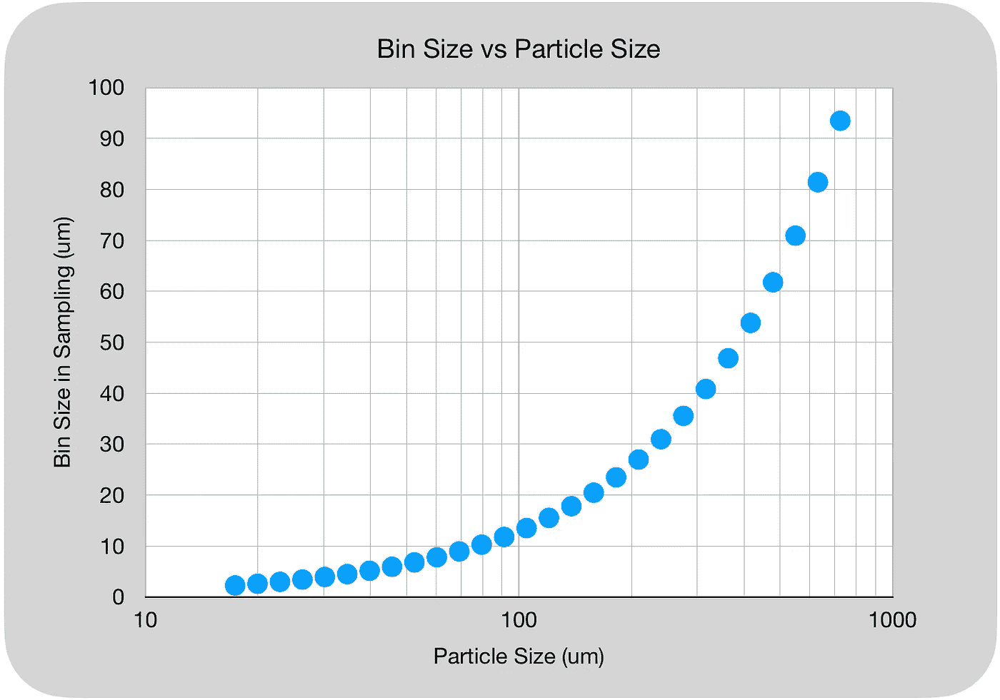

# 咖啡的激光粒子分析何处出错

> 原文：[`towardsdatascience.com/where-laser-particle-analysis-went-wrong-for-coffee-3467b2e38685?source=collection_archive---------8-----------------------#2023-05-05`](https://towardsdatascience.com/where-laser-particle-analysis-went-wrong-for-coffee-3467b2e38685?source=collection_archive---------8-----------------------#2023-05-05)

## 咖啡数据科学

## 让我们做得更好

 [Robert McKeon Aloe](https://rmckeon.medium.com/?source=post_page-----3467b2e38685--------------------------------)

·

[关注](https://medium.com/m/signin?actionUrl=https%3A%2F%2Fmedium.com%2F_%2Fsubscribe%2Fuser%2Fae592466d35f&operation=register&redirect=https%3A%2F%2Ftowardsdatascience.com%2Fwhere-laser-particle-analysis-went-wrong-for-coffee-3467b2e38685&user=Robert+McKeon+Aloe&userId=ae592466d35f&source=post_page-ae592466d35f----3467b2e38685---------------------post_header-----------) 发布在[Towards Data Science](https://towardsdatascience.com/?source=post_page-----3467b2e38685--------------------------------) ·4 分钟阅读·2023 年 5 月 5 日

--

几周前，关于咖啡中的细粉讨论，另一位[咖啡爱好者](https://www.instagram.com/quantitativecafe)注意到直径小于 100um 的颗粒存在异常。我开始更深入地研究我的一些数据，并发现了他所看到的趋势。然而，我发现了另一个问题：分箱。

粒子分布通过分箱粒子并形成直方图来完成。90um 和 100um 大小的粒子有多少？这些粒子的总百分比是多少？或者这些粒子的总体积百分比是多少？这些都是粒子分布回答的问题类型。

这是使用与激光颗粒分析仪相同的分-bin 的样本颗粒分布图。测量颗粒时，你计算每个分-bin 内的颗粒数量，每个分-bin 有一个范围。这形成了一个直方图，通常直方图有相等的分-bin 大小。在我的领域，它们在讨论图像中的颜色值变化时非常普遍。

使用与激光颗粒分析仪相同的分-bin 进行成像的样本分布。所有图像均由作者提供。

然而，激光颗粒分析仪似乎使用对数刻度来表示分-bin 大小。这非常成问题，因为它改变了曲线的外观以及我们对数据的解读。这张图展示了不同颗粒尺寸的分-bin 大小。

我从之前的工作中取得了一次测量，并将其放入 1、2、5、10 和 20 um 的分-bin 中，以查看它对信号的影响。

这很难进行比较，所以我对所有曲线进行了归一化处理。在 1um 处，有很多噪声，因为样本数量的变化很大。我可以通过多次测量来测试和减少噪声，或者对于激光衍射，可以通过更多的颗粒来进行测试。

让我们放大到小于 200 um。

当你达到 20 um 的分-bin 时，某种模式会消失。在 10 um 的分-bin 中，这种模式仍然存在。

如果我们进一步降低到 100um，分-bin 大小就变得很重要：

我们可以看到 100 um 以下有三个峰值。通常，我们会看到 100 um 以下有第二个峰值。

# 按分-bin 大小归一化？

另一种查看数据的方法是按分-bin 大小归一化。在原始图像中，似乎有两个 100um 以下的峰值和一个微小的隆起，一旦归一化，第三个峰值更加明显。

回顾实际的激光 PSD 数据，我们可以看到，当按分-bin 大小（宽度）归一化时，信息更清晰：

原本，很难看到大约 40 um 的情况，这张第二张图展示了那些细节，而无需放大左侧的图表。

这告诉我，我们在颗粒分布上有一个分-bin 问题。如果目标是利用这些数据来了解咖啡，我们需要从现有设备中获得更好的分-bin。

另外，为什么会有这么多峰值？这是信号还是噪声？需要更多数据。

如果你喜欢，可以在 [Twitter](https://mobile.twitter.com/espressofun)、[YouTube](https://m.youtube.com/channel/UClgcmAtBMTmVVGANjtntXTw) 和 [Instagram](https://www.instagram.com/espressofun/) 上关注我，我会发布不同机器上的浓缩咖啡视频以及与浓缩咖啡相关的内容。你也可以在 [LinkedIn](https://www.linkedin.com/in/dr-robert-mckeon-aloe-01581595) 找到我。你还可以在 [Medium](https://towardsdatascience.com/@rmckeon/follow) 和 [订阅](https://rmckeon.medium.com/subscribe) 上关注我。

# [我进一步的阅读](https://rmckeon.medium.com/story-collection-splash-page-e15025710347)：

[我的书](https://www.kickstarter.com/projects/espressofun/engineering-better-espresso-data-driven-coffee)

[我的链接](https://rmckeon.medium.com/my-links-5de9eb69c26b)

[浓缩咖啡文章合集](https://rmckeon.medium.com/a-collection-of-espresso-articles-de8a3abf9917?postPublishedType=repub)

[工作与学校故事合集](https://rmckeon.medium.com/a-collection-of-work-and-school-stories-6b7ca5a58318)
