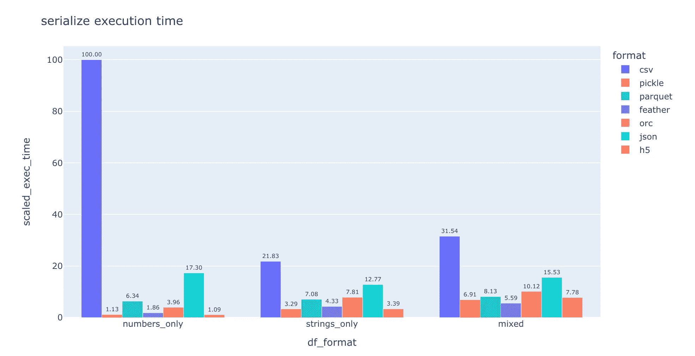
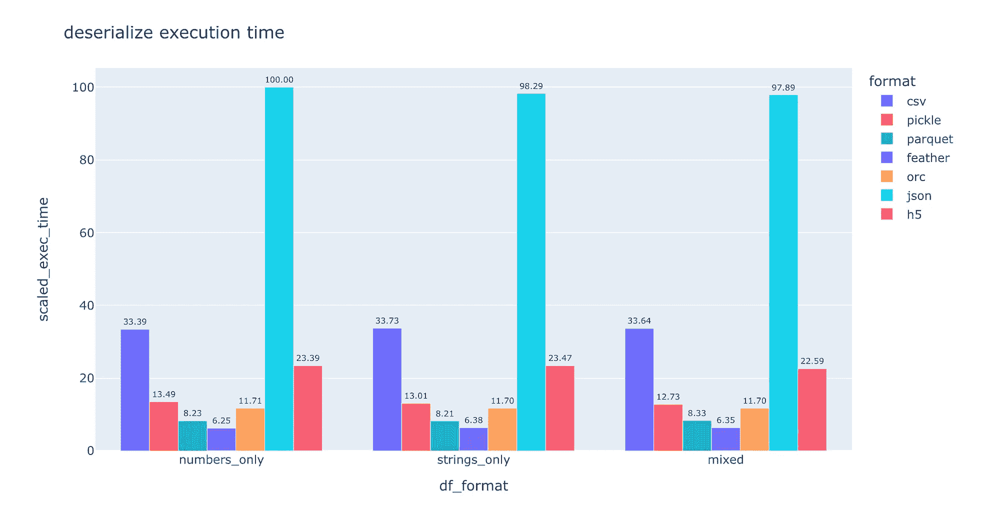
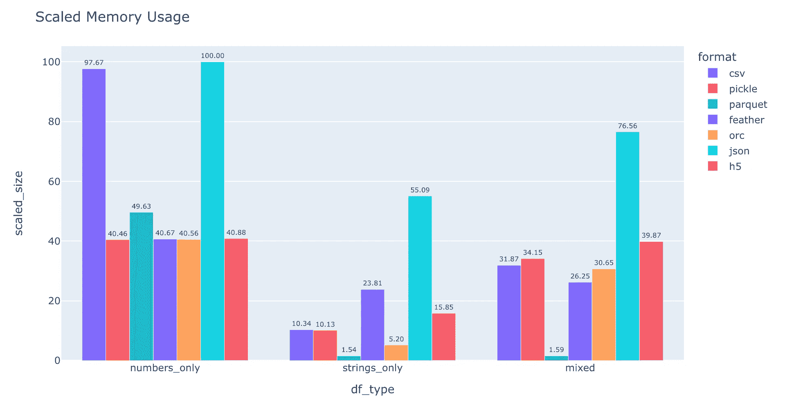

# 针对你的大数据项目，应该使用哪个数据格式？

> 原文：[`towardsdatascience.com/which-data-format-to-use-for-your-big-data-project-837a48d3661d`](https://towardsdatascience.com/which-data-format-to-use-for-your-big-data-project-837a48d3661d)

## Pickle、Parquet、CSV、Feather、HDF5、ORC、JSON：你应该使用哪个格式，为什么？

[](https://armandsauzay.medium.com/?source=post_page-----837a48d3661d--------------------------------)[](https://towardsdatascience.com/?source=post_page-----837a48d3661d--------------------------------) [Armand Sauzay](https://armandsauzay.medium.com/?source=post_page-----837a48d3661d--------------------------------)

·发表于[Towards Data Science](https://towardsdatascience.com/?source=post_page-----837a48d3661d--------------------------------) ·6 分钟阅读·2023 年 10 月 26 日

--


图片来源于 Maarten van den Heuvel — [Unsplash](https://unsplash.com/photos/assorted-color-book-lot-8EzNkvLQosk)

选择正确的数据格式在数据科学项目中至关重要，影响从数据读写速度到内存消耗和互操作性等各个方面。本文探讨了 Python 中七种流行的序列化/反序列化格式，重点关注它们的速度和内存使用影响。

通过分析，我们还将看到如何在 Python 中使用性能分析（使用`cProfile`内置模块），以及如何获取文件系统中特定文件的内存使用统计（使用`os` Python 模块）。

当然，每个项目都有其特定性，除了速度和内存使用之外。我们将总结一些趋势，希望能为选择适合的格式提供一些启示。

## 理解序列化和反序列化

> 序列化是将对象（例如 Python 中的 pandas DataFrame）保存为可以保存到文件中以供后续检索的格式的过程。反序列化是这个过程的逆过程。

数据框是一个 Python 对象，不能直接持久化。它需要被转换成文件，以便在后续阶段加载该对象。

当你保存数据框时，你是在“序列化”数据。当你将其加载回时，你是在“反序列化”或将其转换回可读的（此处为 Python 可读）格式。

某些格式因其可读性广泛使用，如 JSON 或 CSV。这两种格式还因其语言无关性而被使用。就像[协议缓冲区](https://protobuf.dev/)，最初由 Google 开发。JSON 和协议缓冲区在 API 中也很受欢迎，使得不同语言编写的服务之间能够传递数据。

另一方面，一些格式，如 Python 的 pickle，是特定于语言的，不适合在不同编程语言的服务之间传输数据。例如，对于机器学习用例，如果一个仓库训练了一个模型并用 pickle 序列化，那么这个文件只能被 Python 读取。因此，如果提供该机器学习模型的 API 是用 Java 编写的，则必须进行一些转换才能使用。

但对于存储大型数据文件，CSV、JSON 和 Protocol Buffers 等格式在性能上不如更专业的格式，如 [HDF5](https://www.hdfgroup.org/solutions/hdf5/)、[Parquet](https://www.databricks.com/glossary/what-is-parquet)、[Feather](https://arrow.apache.org/docs/python/feather.html) 或 [ORC](https://cwiki.apache.org/confluence/display/hive/languagemanual+orc)。

在 Python 中处理数据时，[pandas](https://pandas.pydata.org/) 提供了一个方便的 API 用于提取、转换和加载数据。Pandas 支持多种格式（所有支持的格式可以在 [这里](https://pandas.pydata.org/docs/user_guide/io.html) 找到），其中我们选择了使用最广泛的七种格式并比较了它们的性能：JSON、CSV、Parquet、Pickle、Feather、HDF5 和 ORC。

reproducing 分析的代码可以在 [这里](https://www.kaggle.com/code/armandsauzay/save-load-speed-vs-format-csv-feat-pkl-pqt/edit/run/134172694) 找到。

## 实验方法

**速度** 和 **内存使用** 是选择项目合适数据格式时需要关注的两个关键因素。但这些因素会根据数据的大小和使用的数据类型而有所不同。

为了进行分析，我们创建了 3 个数据集，这些数据集应涵盖大多数用例：仅包含数字的数据框、仅包含字符串的数据框和包含数字和字符串的数据框。每个数据框有 10,000 行和 100 列，代码定义如下：

```py
df_numbers_only = pd.DataFrame(np.random.rand(10000, 100), columns=[f'col{i}' for i in range(100)])
df_strings_only = pd.DataFrame(np.random.choice(['a', 'b', 'c'], (10000, 100)), columns=[f'col{i}' for i in range(100)])
df_mixed = pd.DataFrame(np.random.choice(['a', 'b', 'c', np.random.rand()], (10000, 100)), columns=[f'col{i}' for i in range(100)])
```

对于内存使用情况，我们只需查看保存数据集时的大小。为了测量内存使用情况，我们将使用 Python 的 `os` 模块，特别是 `os.stat`。

```py
df_numbers_only.to_csv('df.csv')
file_stats = os.stat('df.csv')
print(file_stats)
print(f'File Size in Bytes is {file_stats.st_size}') #this is in Bytes
print(f'File Size in MegaBytes is {file_stats.st_size / (1024 * 1024)}') #here we convert bytes to Mb
```

对于速度，我们使用 Python 的 [cProfile](https://docs.python.org/3/library/profile.html) 库来分析函数执行所需的时间。在这里，我们选择了 10 秒的时间窗口，并查看函数执行了多少次。实质上：

```py
def serialize_csv(df):
    """Serialize df to csv."""
    df.to_csv('test.csv')

func = serialize_csv
args = df_numbers_only

timer = pytool.time.Timer()
duration = datetime.timedelta(seconds=10)
with cProfile.Profile() as profile:
    while timer.elapsed < duration:
        func(*args)
    time_results[(df_name, file_format, operation)] = profile
```

## 评估速度：不同格式的速度有多快？

直接进入分析核心，让我们看看用于评估序列化/反序列化速度的图表。请注意，我们对所花费的时间进行了缩放，因此您可以在下面的图表中看到，仅包含数字的 CSV 处理过程最慢，而仅包含数字的 HDF5 处理过程最快，占 CSV 处理时间的 1.09%（大约 1/100）。



作者提供的图像：按格式保存时间



作者提供的图像：按格式加载时间

在上述图表中，我们可以观察到几个有趣的速度要点：

+   **Pickle/HDF5** 是保存纯数字数据的最快格式。

+   **Feather** 是加载数据的最快格式。

+   人类可读格式如 **JSON** 或 **CSV** 比其他格式要慢得多，特别是在保存/加载仅包含数字的数据时（例如，比 pickle 慢近 100 倍）。

+   **HDF5** 在保存数据方面表现得非常高效（与 feather、parquet、pickle 持平），但在加载数据时稍逊一些。

## 内存使用情况：哪个格式消耗的空间更少？



作者提供的图片：缩放内存使用情况

我们可以观察到：

+   再次强调，人类可读格式如 **CSV 或 JSON** 是内存效率最低的格式。而 JSON 的表现甚至比 CSV 更差。

+   **parquet** 是在给定数据大小（10,000x100）下内存效率最高的格式，这也符合 parquet 是列式数据格式的特点。你可以在[这里](https://www.databricks.com/glossary/what-is-parquet)了解更多信息。

+   再次强调，当仅处理数值数据时，**pickle** 是最有效的格式。[Pickle](https://docs.python.org/3/library/pickle.html) 作为 Python 的原生序列化包，这一点并不令人惊讶。

+   尽管速度更快，**feather** 数据相比 parquet 占用的内存要多得多。

结果可以在下表中总结（相较于上面的分析略显简单）：

作者的概要

## 结论

选择合适的格式始终取决于你项目的独特需求。但我们仍然可以从上述分析中得出一些一般性的结论。例如，除非互操作性至关重要，并且你需要直观地查看原始数据的样子，否则你最好不要使用诸如 **CSV 或 JSON** 的人类可读格式。

总的来说，**parquet** 似乎是一个非常可靠的选择，因为它在内存使用方面表现更佳，同时速度仍然相对较快。

了解每种格式的具体特点也是至关重要的。例如，pickle 是 Python 特有的格式，因此你无法从其他语言读取它。但是对于专注于数值数据处理的 Python 项目来说，**pickle** 似乎是最佳选择（无论是在速度还是内存方面）。

如果你正在处理大量数据并希望最小化写入磁盘的 GB 数量，**parquet** 是不错的选择。但如果速度是你的主要关注点，你可能要尝试 **feather**，但它会占用更多内存。

总而言之，只有你的项目具体需求才能指导你选择合适的格式。但你可以从上述内容中获得一些见解，以便了解哪种格式在你的特定情况下更好。祝编程愉快！
