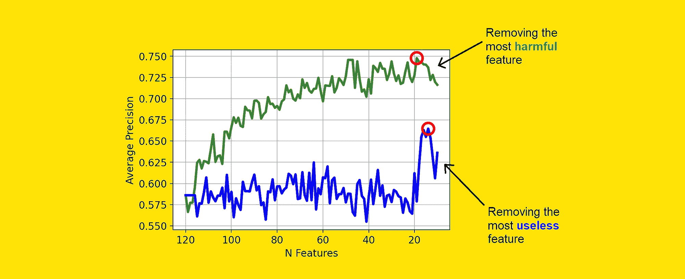

# 哪些特征对你的分类模型有害？

> 原文：[`towardsdatascience.com/which-features-are-harmful-for-your-classification-model-6227859a44a6?source=collection_archive---------2-----------------------#2023-09-12`](https://towardsdatascience.com/which-features-are-harmful-for-your-classification-model-6227859a44a6?source=collection_archive---------2-----------------------#2023-09-12)

## 如何计算分类器特征的错误贡献，以理解和改进模型

 [Samuele Mazzanti](https://medium.com/@mazzanti.sam?source=post_page-----6227859a44a6--------------------------------)

·

[Follow](https://medium.com/m/signin?actionUrl=https%3A%2F%2Fmedium.com%2F_%2Fsubscribe%2Fuser%2Fe16f3bb86e03&operation=register&redirect=https%3A%2F%2Ftowardsdatascience.com%2Fwhich-features-are-harmful-for-your-classification-model-6227859a44a6&user=Samuele+Mazzanti&userId=e16f3bb86e03&source=post_page-e16f3bb86e03----6227859a44a6---------------------post_header-----------) 发表在 [Towards Data Science](https://towardsdatascience.com/?source=post_page-----6227859a44a6--------------------------------) ·14 min read·Sep 12, 2023

--

[Image by Author]

特征重要性是解释机器学习模型的最常用工具。它如此受欢迎，以至于许多数据科学家最终相信特征重要性等于特征优良性。

事实并非如此。

**当一个特征很重要时，这只是意味着模型在训练集上发现了它的用处。然而，这并不说明该特征在新数据上的泛化能力！**

为了考虑这一点，我们需要区分两个概念：

+   **预测贡献**：模型在预测中赋予变量的权重。这由模型在训练集上找到的模式决定。这相当于特征重要性。

+   **误差贡献**：变量在模型在留存数据集上产生误差中的权重。这更好地代表了特征在新数据上的表现。

在本文中，我将解释这两个量在分类模型上计算背后的逻辑。我还将展示一个示例在……
