# 哪些特征对你的分类模型有害？

> 原文：[`towardsdatascience.com/which-features-are-harmful-for-your-classification-model-6227859a44a6`](https://towardsdatascience.com/which-features-are-harmful-for-your-classification-model-6227859a44a6)

## 如何计算分类器特征的误差贡献，以便理解和改进模型

[](https://medium.com/@mazzanti.sam?source=post_page-----6227859a44a6--------------------------------)[](https://towardsdatascience.com/?source=post_page-----6227859a44a6--------------------------------) [Samuele Mazzanti](https://medium.com/@mazzanti.sam?source=post_page-----6227859a44a6--------------------------------)

·发表于[Towards Data Science](https://towardsdatascience.com/?source=post_page-----6227859a44a6--------------------------------) ·14 min read·2023 年 9 月 12 日

--


[作者图片]

特征重要性是解释机器学习模型的最常用工具。它如此受欢迎，以至于许多数据科学家最终相信特征重要性等于特征优越性。

事实并非如此。

**当一个特征重要时，这仅仅意味着模型在训练集上发现它是有用的。然而，这并不能说明该特征在新数据上推广的能力！**

为了说明这一点，我们需要区分两个概念：

+   **预测贡献**：一个变量在模型预测中所占的权重。这是由模型在训练集上发现的模式决定的。这等同于特征重要性。

+   **误差贡献**：一个变量在模型在保留数据集上的错误中所占的权重。这是特征在新数据上表现的更好代理。

在这篇文章中，我将解释计算这两个量在分类模型中的逻辑。我还将展示一个例子，说明使用误差贡献进行特征选择相比使用预测贡献能够得到更好的结果。

> 如果你对回归比分类更感兴趣，可以阅读我之前的文章“你的特征重要吗？这并不意味着它们是好的。”

# 目录

1.  **从一个简单的例子开始**

1.  **我们应该为分类模型使用哪种“误差”？**

1.  **我们应该如何管理分类模型中的 SHAP 值？**

1.  **计算“预测贡献”**

1.  **计算“误差贡献”**

1.  **一个真实数据集的例子**

1.  **证明其有效性：使用“错误贡献”的递归特征消除**

1.  **结论**

# 1\. 从一个玩具示例开始

假设我们有一个分类问题，我们要预测一个人的收入是否高于或低于$ 100k。假设我们已经有模型做出的预测：

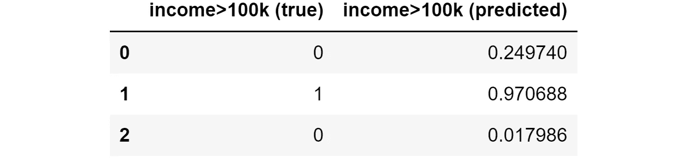

真实值和模型预测。[作者提供的图片]

预测和错误贡献的计算主要基于模型在每个个体上的错误以及每个个体的 SHAP 值。因此，我们需要花时间讨论两个相关点：

+   我们应该在分类模型中使用哪种“错误”？

+   我们如何在分类模型中管理 SHAP 值？

我将在接下来的两个段落中讨论这些点。

# **2\. 我们应该在分类模型中使用哪种“错误”？**

我们的主要目标是计算模型每个特征的错误贡献。因此，最重要的问题是：我们如何定义分类模型中的“错误”？

注意**我们需要一个可以在个体层面计算的错误，然后可以在整个样本上聚合以获得“平均错误”**（就像我们对回归模型使用绝对错误一样）。

对于分类模型，最常见的损失函数是对数损失（即交叉熵）。让我们看看它是否适合我们。

这是对数损失的数学公式：

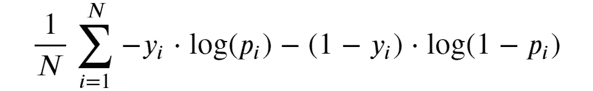

对数损失（即交叉熵）。[作者提供的图片]

对数损失似乎是对我们最合适的选择，因为：

+   **公式的外部部分只是一个简单的平均值**；

+   如其名称所示，**这是一种“损失”，意味着数值越低越好（就像“错误”一样）**。

让我们尝试理解为什么我们实际上可以称这个为“错误”。为了简化，让我们专注于和中量：

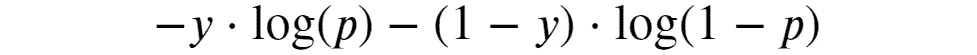

个体对数损失。[作者提供的图片]

这是单个个体对全局对数损失的贡献，因此我们可以称之为“个体对数损失”。

这个公式可能仍然看起来很可怕，但如果我们考虑到——在二分类问题中——*y*只能是 0 或 1，我们可能会得到一个更简单的版本：

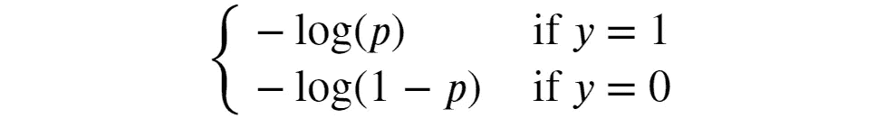

个体对数损失，替代版本（等同于之前的版本）。[作者提供的图片]

借助图表，现在很容易理解对数损失的主要思想。

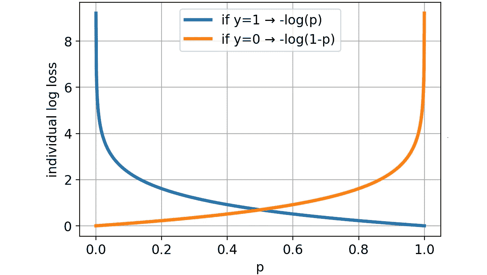

个体对数损失的可视化。[作者提供的图片]

预测概率与真实值的距离越远（无论是 0 还是 1），损失越大。此外，如果预测远离真实值（例如，*p*=.2 且*y*=1 或*p*=.8 且*y*=0），那么损失会比比例更严重。现在应该更清楚为什么对数损失实际上是一种错误。

我们准备将个体对数损失的公式翻译成 Python 函数。

为了避免处理无限值（当*y_pred*恰好为 0 或 1 时会发生），我们将采用一个小技巧：如果*y_pred*距离 0 或 1 的距离小于*ε*，我们将分别将其设置为*ε*或 1-*ε*。对于*ε*，我们将使用 1^-15（这也是 Scikit-learn 使用的默认值）。

```py
def individual_log_loss(y_true, y_pred, eps=1e-15):
  """Compute log-loss for each individual of the sample."""

  y_pred = np.clip(y_pred, eps, 1 - eps)
  return - y_true * np.log(y_pred) - (1 - y_true) * np.log(1 - y_pred)
```

我们可以使用这个函数来计算数据集中每一行的个体对数损失：

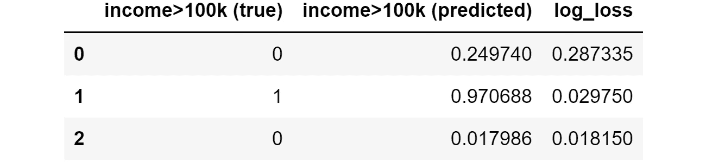

目标变量、模型预测以及结果的个体对数损失。[图片来自作者]

如你所见，个体 1 和 2 的对数损失（或误差）非常小，因为预测值都非常接近实际观察值，而个体 0 的对数损失较高。

# **3\. 我们应该如何在分类模型中管理 SHAP 值？**

最流行的模型是基于树的模型，如 XGBoost、LightGBM 和 Catboost。获取树模型分类器在数据集上的 SHAP 值是非常简单的：

```py
from shap import TreeExplainer

shap_explainer = TreeExplainer(model)
shap_values = shap_explainer.shap_values(X)
```

例如，假设我们计算了玩具问题的 SHAP 值，并得到如下结果：

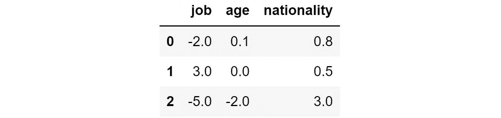

我们模型预测的 SHAP 值。[图片来自作者]

如果你不清楚 SHAP 值的工作原理，可以阅读我的文章：SHAP 值解释：正如你希望有人向你解释的那样。不过，就本文而言，了解以下内容就足够了：

+   一个正的 SHAP 值意味着：该特征导致该个体的概率增加；

+   一个负的 SHAP 值意味着：该特征导致该个体的概率减小。

因此，应该清楚的是**某个个体的 SHAP 值总和与模型的预测之间存在直接关系**。

然而，由于 SHAP 值可以假设任何实际值（正值或负值），我们不能期望它等于该个体的预测概率（这是一个介于 0 和 1 之间的数字）。那么 SHAP 总和与预测概率之间有什么关系？

由于 SHAP 值可以假设任何负值或正值，我们需要一个函数来将 SHAP 总和转换为概率。这个函数必须具有两个特性：

+   它应该将任何实际值“挤压”到区间[0,1]中；

+   它应该是严格递增的（因为更高的 SHAP 总和必须总是与更高的预测相关联）。

满足这些要求的函数是 Sigmoid 函数。因此，**模型对给定行的预测概率等于该个体 SHAP 值的 Sigmoid 函数**。

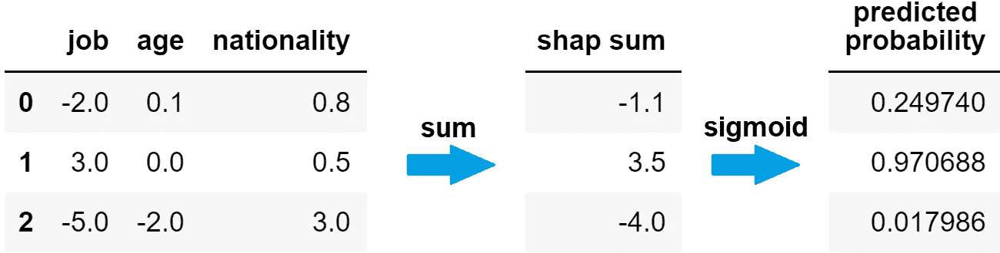

从 SHAP 值到预测概率。[图片来自作者]

这是 Sigmoid 函数的样子：

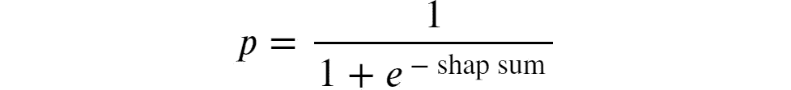

Sigmoid 函数：shap 和与预测概率之间的关系。[作者提供的图片]

所以，让我们把这个公式转换成一个 Python 函数：

```py
def shap_sum2proba(shap_sum):
  """Compute sigmoid function of the Shap sum to get predicted probability."""

  return 1 / (1 + np.exp(-shap_sum))
```

我们还可以通过图形展示，查看我们的个体在曲线上的位置：

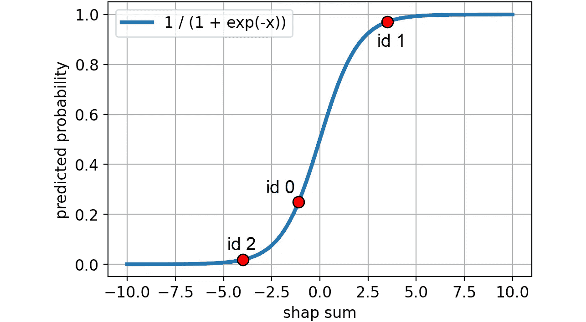

Sigmoid 函数：shap 和与预测概率之间的关系。[作者提供的图片]

现在我们已经了解了应该使用哪个误差以及如何在分类问题中处理 SHAP 值，我们准备好计算预测和误差贡献了。

# 4\. 计算“预测贡献”

正如我们所见，当 SHAP 值高度正（高度负）时，预测值将比没有该特征时高（低）很多。换句话说，**如果 SHAP 值在绝对值上很大，那么该特征对最终预测的影响很大**。

这就是为什么我们可以通过取该特征的绝对 SHAP 值的均值来衡量特征的预测贡献。

```py
prediction_contribution = shap_values.abs().mean()
```

对于我们的玩具数据集，这就是我们得到的结果：

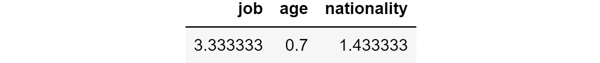

预测贡献。[作者提供的图片]

因此，在特征重要性方面，*职位*是主要特征，其次是*国籍*，然后是*年龄*。

那么误差贡献呢？

# 5\. 计算“误差贡献”

误差贡献的想法是计算如果我们移除一个给定特征，模型的误差会是什么。

多亏了 SHAP 值，我们可以轻松回答这个问题：如果我们从 SHAP 和中排除一个特征，我们就能得到模型在不知道该特征的情况下的预测。但这还不够：正如我们所见，要获得预测概率，我们首先需要应用 sigmoid 函数。

因此，我们首先需要从 SHAP 值中减去一个特征的 SHAP 值，然后我们必须应用 sigmoid 函数。在这里，我们得到了如果模型不知道这些特征时的预测概率。

在 Python 中，我们可以一次性处理所有特征：

```py
y_pred_wo_feature = shap_values.apply(lambda feature: shap_values.sum(axis=1) - feature).applymap(shap_sum2proba)
```

这是我们数据集上的结果：

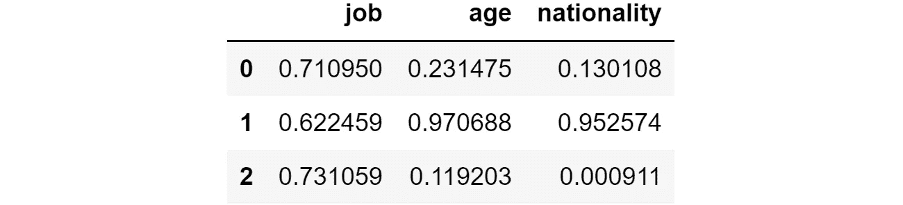

如果我们移除了相应的特征，我们将获得的预测值。[作者提供的图片]

这意味着，如果我们没有特征*职位*，模型将为第一个个体预测 71%的概率，为第二个个体预测 62%，为第三个个体预测 73%。相反，如果我们没有特征*国籍*，预测值将分别为 13%、95%和 0%。

如你所见，根据我们移除哪个特征，预测的概率差异很大。因此，结果误差（个体对数损失）也会非常不同。

我们可以使用上面定义的函数（`individual_log_loss`）来计算没有相应特征时的个体对数损失：

```py
ind_log_loss_wo_feature = y_pred_wo_feature.apply(lambda feature: individual_log_loss(y_true=y_true, y_pred=feature))
```

这是结果：

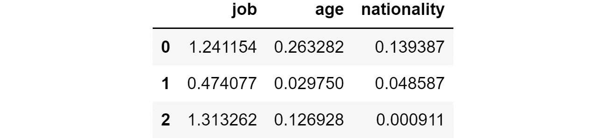

如果移除相应特征，我们会得到的单独 log-loss。[作者图片]

例如，如果我们看第一行，我们可以看到在没有特征*job*的情况下，log-loss 为 1.24，而在没有特征*nationality*的情况下，log-loss 只有 0.13。因为我们希望最小化损失，在这种情况下，最好移除特征*nationality*。

现在，**要了解模型在有无该特征时的效果如何，我们可以计算完整模型的个别 log-loss 与去掉特征后的个别 log-loss 之间的差异**：

```py
ind_log_loss = individual_log_loss(y_true=y_true, y_pred=y_pred)
ind_log_loss_diff = ind_log_loss_wo_feature.apply(lambda feature: ind_log_loss - feature)
```

这是结果：


模型错误与去掉该特征后的错误之间的差异。[作者图片]

**如果这个数字是：**

+   **负数，则特征的存在会导致预测错误减少，因此该特征在该观察中表现良好。**

+   **正数，则特征的存在会导致预测错误增加，因此该特征在该观察中表现不佳。**

我们可以最终通过列计算每个特征的错误贡献值，这些值的均值如下：

```py
error_contribution = ind_log_loss_diff.mean()
```

这是结果：

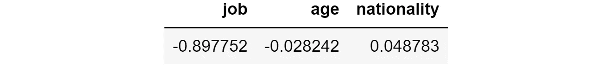

错误贡献。[作者图片]

一般来说，如果这个数字是负数，则特征具有正面效果；相反，**如果这个数字是正数，则该特征对模型有害，因为它倾向于增加模型的平均错误**。

在这种情况下，我们可以看到特征*job*的存在使得个别 log-loss 平均减少了-0.897，而特征*nationality*的存在使得个别 log-loss 平均增加了 0.049。因此，虽然*nationality*是第二重要的特征，但它的表现不佳，因为它使平均个别 log-loss 增加了 0.049。

让我们尝试将这些概念应用到实际数据集中。

# **6\. 真实数据集示例**

下面，我将使用一个来自[Pycaret](https://github.com/pycaret/pycaret)（一个在[MIT 许可](https://github.com/pycaret/pycaret/blob/master/LICENSE)下的 Python 库）的数据集。数据集叫做“Gold”，包含一些金融数据的时间序列。

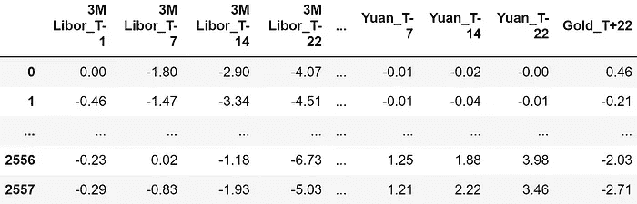

数据集样本。特征都以百分比表示，所以-4.07 意味着回报为-4.07%。[作者图片]

特征包括金融资产在观察时刻之前分别 22、14、7 和 1 天的回报（“T-22”、“T-14”、“T-7”、“T-1”）。这是所有用作预测特征的金融资产的详尽列表：

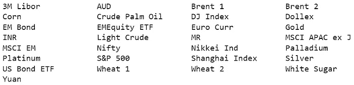

可用资产的列表。每个资产在时间-22、-14、-7 和-1 被观察到。[作者图片]

总共有 120 个特征。

目标是预测黄金回报在 22 天后是否会超过 5%。换句话说，目标变量是二元的：

+   如果 22 天后的黄金回报小于 5%，则为 0；

+   如果 22 天后的黄金回报大于 5%，则为 1。

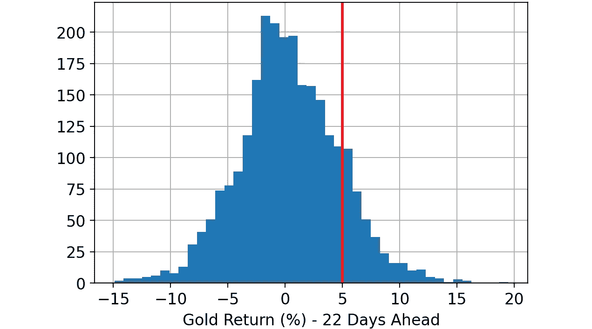

黄金回报 22 天后的直方图。红色标记的阈值用于定义我们的目标变量：回报是否大于 5%。[图片来源]

一旦加载了数据集，这些是我执行的步骤：

1.  随机拆分完整数据集：33% 的行用于训练数据集，另 33% 用于验证数据集，其余 33% 用于测试数据集。

1.  在训练数据集上训练一个 LightGBM 分类器。

1.  使用上一步骤训练的模型对训练、验证和测试数据集进行预测。

1.  使用 Python 库 “shap” 计算训练、验证和测试数据集的 SHAP 值。

1.  使用我们在上一段中看到的代码，计算每个特征在每个数据集（训练集、验证集和测试集）上的预测贡献和误差贡献。

目前，我们既有预测贡献也有误差贡献，因此我们可以最终进行比较：

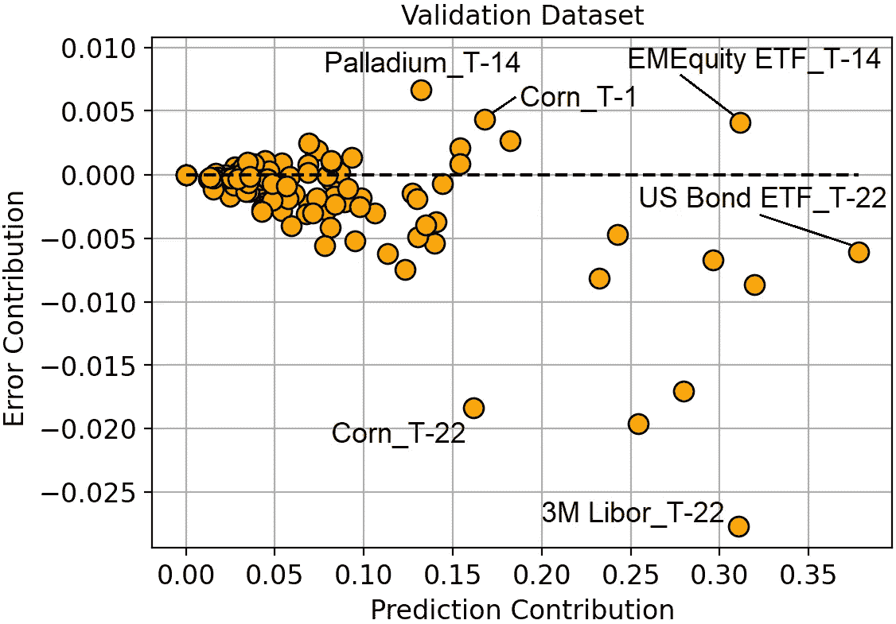

预测贡献与误差贡献（在验证数据集上）。[图片来源]

查看这个图表可以为我们提供关于模型的宝贵洞察。

最重要的特征是 T-22 天的美国债券 ETF，但它并没有带来如此显著的误差减少。最佳特征是 T-22 的 3M Libor，因为它能最大程度地减少误差。

玉米价格有一些非常有趣的特点。T-1 和 T-22 的回报率都是最重要的特征之一，然而其中一个（T-1）存在过拟合（因为它加剧了预测误差）。

一般来说，我们可以观察到，所有具有较高误差贡献的特征都与 T-1 或 T-14（观察时刻前 1 天或 14 天）相关，而所有具有较小误差贡献的特征都与 T-22（观察时刻前 22 天）相关。这似乎表明**最新特征容易过拟合，而指向较旧回报的特征更容易泛化**。

除了获得关于模型的洞察，考虑使用误差贡献进行特征选择是很自然的。这也是我们将在下一段中要做的。

# **7\. 证明其有效性：使用“误差贡献”的递归特征消除**

递归特征消除（RFE）是一个逐步从数据集中删除特征的过程，目的是获得更好的模型。

RFE 的算法非常简单明了：

1.  初始化特征列表；

1.  在训练集上训练一个模型，使用当前特征列表作为预测器；

1.  从特征列表中移除“最差”的特征；

1.  返回第 2 步（直到特征列表为空）。

在传统方法中，“最差”= 最不重要。然而，根据我们看到的，**我们可能会反对，首先去除最有害的特征更有意义**。

换句话说，

+   **传统 RFE：首先去除最无用的特征**（最无用 = 验证集上的预测贡献最低）。

+   **我们的 RFE：首先去除最有害的** **特征** **（最有害 = 验证集上的误差贡献最高）**。

为了验证这个直觉是否正确，我使用了两种方法进行模拟。

这是验证集上的对数损失结果：

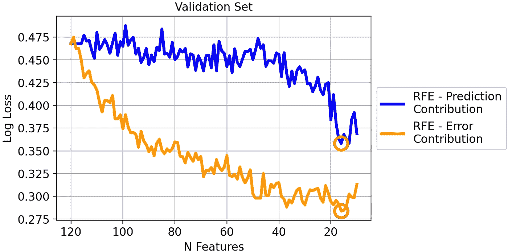

两种策略在验证集上的对数损失。[作者提供的图像]

由于对数损失是“越低越好”的度量，我们可以看到我们的 RFE 版本在验证数据集上明显优于经典 RFE。

然而，你可能会怀疑查看验证集是否公平，因为误差贡献是基于它计算的。所以，让我们查看测试集。

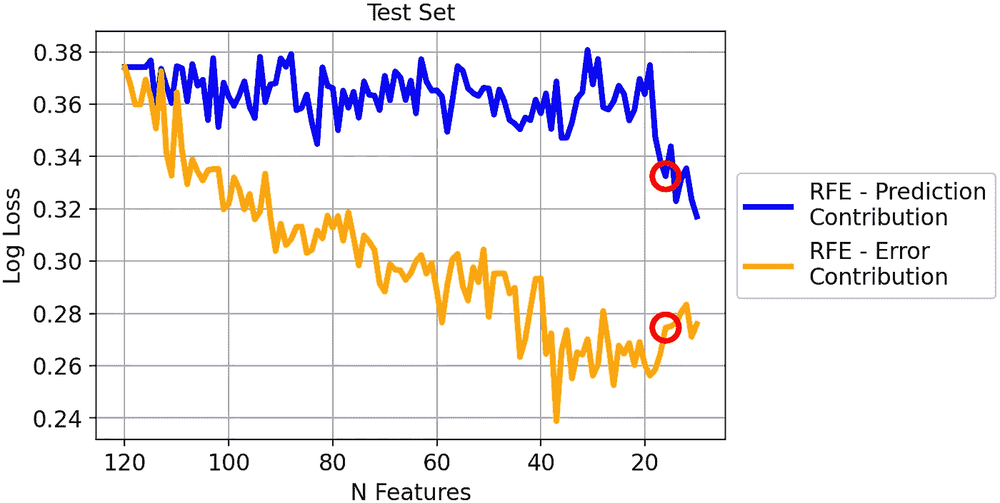

两种策略在测试集上的对数损失。[作者提供的图像]

即使现在两种方法之间的差异较小，我们仍然可以看到它仍然很大，并且足以得出结论：基于误差贡献的 RFE 在这个数据集上显著优于基于预测贡献的 RFE。

除了对数损失之外，考虑一个更具实际价值的度量会很有趣。例如，让我们看看验证集上的平均精度：

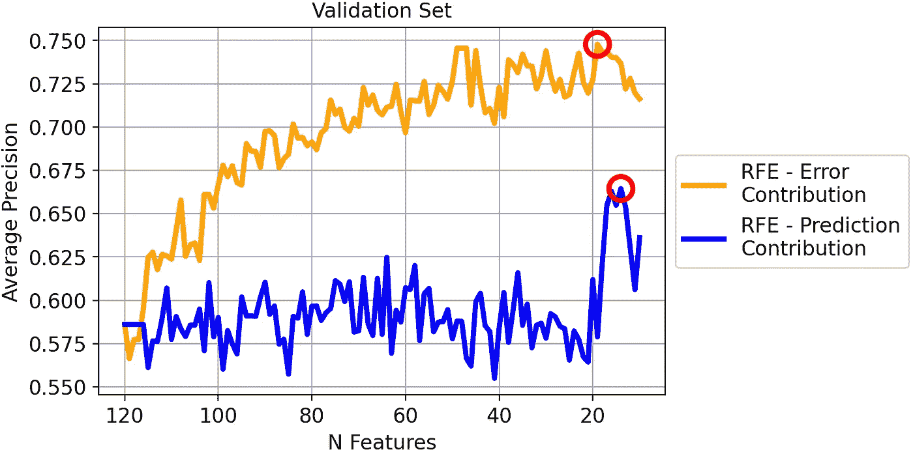

两种策略在验证集上的平均精度。[作者提供的图像]

有趣的是，尽管贡献误差是基于对数损失的，我们在平均精度上也取得了优异的结果。

如果我们想基于平均精度做出决策，那么我们将选择在验证集上具有最高平均精度的模型。这意味着：

+   基于误差贡献的 RFE：具有 19 个特征的模型；

+   基于预测贡献的 RFE：具有 14 个特征的模型；

如果我们这样做，我们在新数据上会观察到什么样的表现？回答这个问题的最佳代理是测试集：

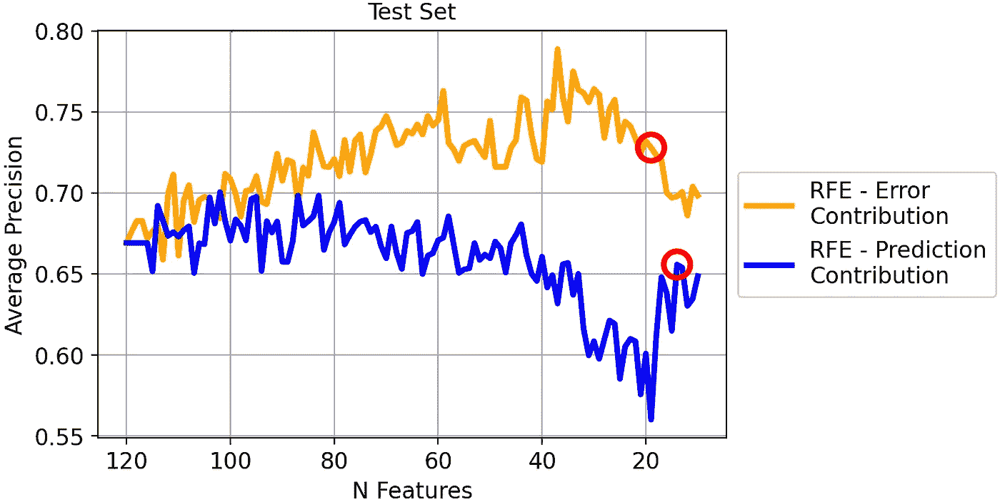

两种策略在验证集上的平均精度。[作者提供的图像]

在这种情况下，基于误差贡献的 RFE 的表现通常优于基于预测贡献的 RFE。特别是，根据我们之前的决定：

+   基于误差贡献的 RFE（具有 19 个特征的模型）：72.8% 平均精度；

+   基于预测贡献的 RFE（具有 14 个特征的模型）：65.6% 平均精度。

因此，通过使用基于误差贡献的 RFE，而不是传统的基于预测贡献的 RFE，我们将在平均精度上获得额外的 7.2%优秀结果！

# 8\. 结论

特征重要性概念在机器学习中起着基础性作用。然而，“重要性”的概念常常被误解为“好处”。

为了区分这两个方面，我们引入了两个概念：预测贡献和误差贡献。这两个概念都基于验证数据集的 SHAP 值，文章中我们展示了计算这些值的 Python 代码。

我们还在一个真实的金融数据集上进行了试验（任务是预测黄金价格），并证明基于误差贡献的递归特征消除比基于预测贡献的传统 RFE 提高了平均精度 7%。

*你可以在* [*这个笔记本*](https://github.com/smazzanti/tds_features_important_doesnt_mean_good/blob/main/classification.ipynb)*找到本文所用的所有代码。*

*感谢阅读！*

*如果你觉得我的工作有用，你可以订阅* [***每次我发布新文章时都会收到邮件***](https://medium.com/@mazzanti.sam/subscribe) *(通常是每月一次)。*

*如果你想支持我的工作，你可以* [***请我喝咖啡***](https://ko-fi.com/samuelemazzanti)*。*

*如果你愿意，* [***可以加我 Linkedin***](https://www.linkedin.com/in/samuelemazzanti/)*！*
