# 哪些 GPT 类似模型工程技术适用于系统日志？

> 原文：[`towardsdatascience.com/which-gpt-like-engineering-strategies-work-on-system-logs-6b0a3a1ebcad?source=collection_archive---------4-----------------------#2023-04-21`](https://towardsdatascience.com/which-gpt-like-engineering-strategies-work-on-system-logs-6b0a3a1ebcad?source=collection_archive---------4-----------------------#2023-04-21)

## 对行为恶意软件痕迹应用的变换器神经网络建模方法的评估

 [Dmitrijs Trizna](https://ditrizna.medium.com/?source=post_page-----6b0a3a1ebcad--------------------------------)

·

[关注](https://medium.com/m/signin?actionUrl=https%3A%2F%2Fmedium.com%2F_%2Fsubscribe%2Fuser%2F2fbea2ebee7a&operation=register&redirect=https%3A%2F%2Ftowardsdatascience.com%2Fwhich-gpt-like-engineering-strategies-work-on-system-logs-6b0a3a1ebcad&user=Dmitrijs+Trizna&userId=2fbea2ebee7a&source=post_page-2fbea2ebee7a----6b0a3a1ebcad---------------------post_header-----------) 发表在 [Towards Data Science](https://towardsdatascience.com/?source=post_page-----6b0a3a1ebcad--------------------------------) ·11 分钟阅读·2023 年 4 月 21 日

--

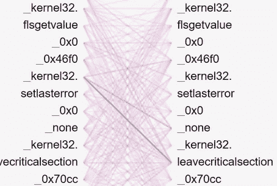

图 1. 从训练于恶意软件仿真报告的变换器模型中提取的自注意力激活。图像由作者提供。

本文评估了应用于机器数据（即来自[Speakeasy 模拟器](https://github.com/mandiant/speakeasy)的恶意软件行为日志）的各种 Transformer 神经网络（GPT 的 AI 模型）工程方法。这些实验中使用的数据自发布以来一直可以自由获取，作为[混合恶意软件分析 [Trizna]](https://dl.acm.org/doi/10.1145/3560830.3563726)的一部分，档案可以[在这里](https://github.com/dtrizna/quo.vadis/tree/main/data/emulation.dataset)下载。您可以访问这些数据，随意复制或推进结果！

最初，Transformer 被提出作为一种适用于序列到序列任务（如自然语言翻译）的编码器/解码器架构。后来它被调整以适应其他任务，如 GPT 的掩码解码器模型，以便擅长文本生成。由于我们将使用 Transformer 进行推理，*模型*仅包含*编码器层*（[模型的 PyTorch 代码](https://github.com/dtrizna/nebula/blob/dev/nebula/models/attention.py#L165)），类似于例如 BERT [[Devlin et al.](https://arxiv.org/abs/1810.04805)]中使用的架构。

推测地，本文得出的关于 Transformer 工程方法的相同结论可以扩展到任何系统日志集，例如 Windows 上的操作系统遥测如 Sysmon，或对应的 Linux 框架如*auditd*，应用级日志如来自 Kubernetes API 服务器的*kube-audit*事件，或 HTTP 服务器的访问日志及计数。

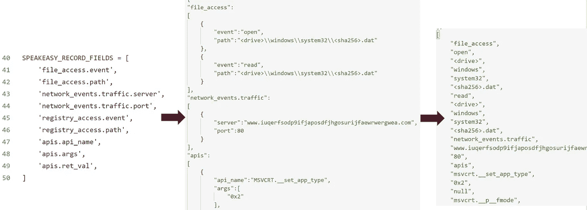

图 2\. 预处理过滤后的 JSON 事件到令牌序列的示意图和简化视图，包括过滤器和归一化。图片由作者提供。

虽然是正在进行的研究的一部分，本文*避免了更广泛的讨论*关于数据和架构组合，而是专注于 Transformer 建模技术的方法论和 PyTorch 代码，以评估**相对**的*实用性*和*工程策略*，而非绝对性能。评估的配置列表：

+   三角形、余弦、阶梯和一周期学习率调度器；

+   累积梯度；

+   梯度裁剪；

+   注意力块的预归一化与后归一化；

+   数据优化；

+   学习率对模型大小的依赖。

对于所有配置选项，我进行三次交叉验证运行，并报告验证集和测试集的平均 ROC 曲线以及训练损失。本文*不涵盖*模型的*自监督预训练*，而是*专注于*恶意软件分类的*下游任务*（即监督学习）。

许多出版物已经系统地分析了 Transformer 在*自然语言*方面的工程进展，我们将在*机器数据*上探讨这些进展。考虑到进一步研究这里提出的观点，我建议学习，例如，[“临时性”论文 [Geiping and Goldstein]](https://arxiv.org/abs/2212.14034)。

# 优化数据集

数据由 ~120k 恶意软件和良性软件样本的 JSON 报告组成，恶意样本涵盖了如勒索软件、木马、后门等七种恶意软件类型。然而，我将实验限制为二分类，*Clean* 标签表示良性类，所有其他标签表示恶意样本。值得注意的是，测试集是在训练集收集后三个月收集的，以引入概念漂移下的评估。

由于模拟是一种不完美的方式来获取回避型恶意软件样本的行为，进一步 [过滤和规范化](https://github.com/dtrizna/nebula/blob/dev/nebula/preprocessing/pe.py#L90) 被应用于上述报告，以剔除失败或不完整的模拟，从而在训练集中得到 **76126** 个样本，在测试集中得到 **17407** 个样本。

## 序列长度减少的字段过滤器

根据我们的观察，存储在机器数据中的任何语义逻辑都跨越了*非常*长的标记序列，包括无数次的元数据和环境特定信息，这些信息对于建模任务几乎没有相关性。可以说，这是自然语言和机器语言之间最显著的差异之一。前者在相对较短的句子中具有简洁的语义，没有或很少有无用的组件。

对自注意力模型来说，这很不幸，因为其在输入长度上的复杂度是**平方**的，这意味着较长的序列训练成本指数增长。这是因为自注意力中的每个元素都必须关注同一序列中的每个其他成员——请参见上面的图 1 标题以获取可视化。

因此，在处理机器数据时应用基于领域知识的过滤器是*必不可少*的。在我们的案例中，JSON 事件 [会被过滤](https://github.com/dtrizna/nebula/blob/dev/nebula/constants.py#L40)，过滤依据包括（1）文件，（2）注册表，（3）网络访问，以及（4）API 调用名称、参数和返回值。这显著提高了知识密度（即每个标记的相关知识比率）和数据质量。

序列长度在下面的实验中限制为**512**个标记，以便更快地迭代配置组合，但为了最终性能评估或生产实现，建议保留较长的序列。有证据表明，任务相关的性能从更长的序列中受益，如下图的热图所示：

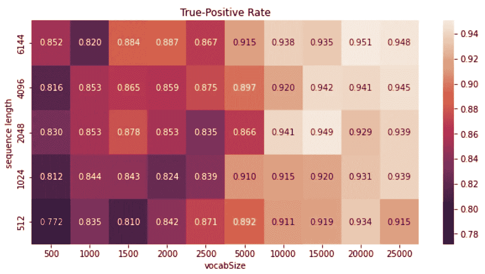

图 3\. 在假阳性率为 0.001（每 1000 次检测一个假警报）下的平均真正率，取决于变量序列长度和词汇大小。图片由作者提供。

## 标记化

> 机器数据的词汇量可能比自然语言大得多，因为通常没有明确的词汇边界或语法规则来定义所使用的语言。

在系统日志中，常见的任意字符组合如*/tmp/83afba/setup.bin*或*jre1.8.0_311*，由于处理不当，会导致词汇量爆炸。例如，我观察到大约有 3000 个独特的 API 名称，其中约 1000 个在训练数据中仅出现一次。

因此，您为模型分析包含的每一个额外字段都会显著增加词汇量。请参见下面的对数图，显示了不同 JSON 字段过滤器设置下的训练集标记的频率分布：

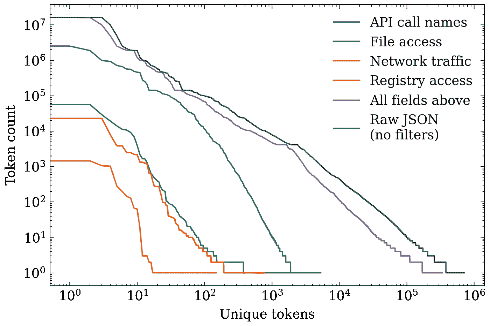

图 4\. 针对训练集应用不同 JSON 字段过滤器的标记频率分布。图片由作者提供。

例如，给定一个使用 API 调用、文件、网络和注册表记录的字段过滤器，总词汇量大约为 25 万标记。假如没有应用过滤器，这个数字会接近 80 万标记，词汇量爆炸超过三倍，并显著降低数据的认知密度（每个标记的有价值信息）。这强调了合适的领域知识影响的过滤器对提高模型接收的数据质量的重要性。

对于任意值字段如哈希值和 IP 地址的归一化也是一样的。例如，将哈希值不处理会极大地扩展词汇量，而使用下面的函数将其归一化为像*<sha256>*和*<md5>*这样的值，则会得到一些易于解释的占位符，模型可以利用这些占位符：

这只是一个简单的例子，而我管道中实现的所有归一化可以在[这里](https://github.com/dtrizna/nebula/blob/main/nebula/preprocessing/normalization.py)找到。

然而，另一个关键技巧是改进标记化本身，以便技术数据中的变异不会无限期地创建新标记。自然语言已经提供了适合机器数据的解决方案。

我定义了一个基于 Google 的[SentencePiece](https://github.com/google/sentencepiece/)的自定义 JSON Byte Pair Encoding (BPE)标记器（[代码](https://github.com/dtrizna/nebula/blob/dev/nebula/preprocessing/json.py#L253)），它分析字节的相对共现方式。这样，标记并不代表技术语言中的独立值，而是较长值序列的一部分，如下面的例子所示：

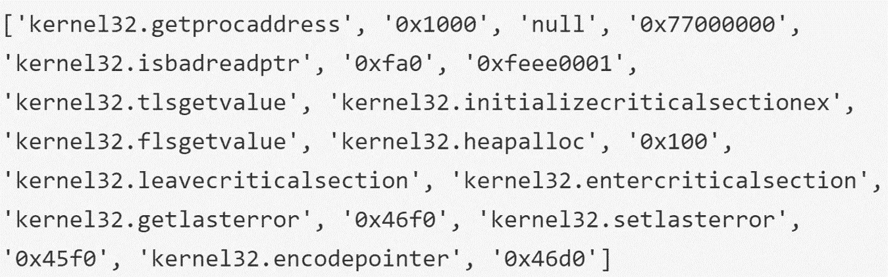

图 5\. 空白标记示例。图片由作者提供。

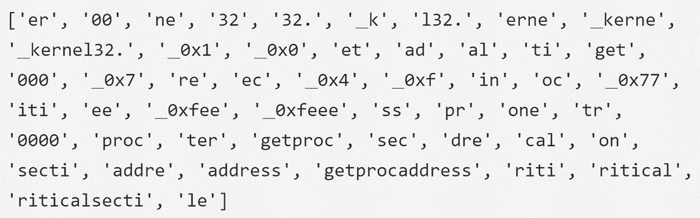

图 6\. SentencePiece 的 BPE 标记示例。图片由作者提供。

我将进一步的实验限制在**50k** BPE 标记的词汇量内。

# 模型大小和学习率

学习率（LR）的选择很直接，对任何深度学习从业者来说都是已知的。然而，我想强调的是，对于 Transformer 架构，选择适合的学习率范围对于特定模型大小尤其重要。

请参阅 [GPT-3 论文 [Brown et al.]](https://arxiv.org/pdf/2005.14165.pdf)中的此表格，该表格报告了不同模型的配置以及使用的学习率的变化：

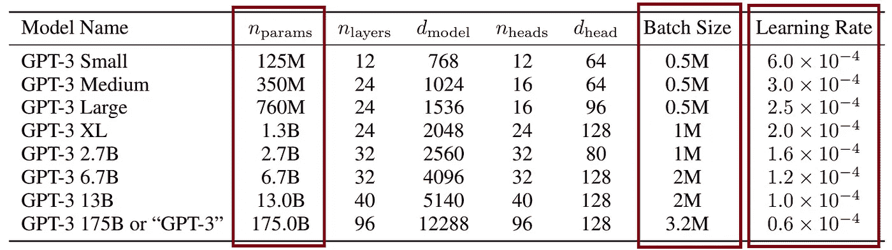

表格 1 来自 [GPT-3 论文 [Brown et al.]](https://arxiv.org/pdf/2005.14165.pdf)。注意学习率和批量大小如何根据可训练模型参数的数量而变化。

注意到模型增长后的学习率减少的意义，模型大小增加 ~1000 倍时，学习率降低 ~10 倍。

由于硬件设置（单个消费级 GPU），我使用了一个具有 ~5–6 M 参数的适中大小的模型。由于本文评估的是*相对配置效用*而不是达到最先进的绝对值，因此这是一个适合快速迭代多种配置的良好大小，为更大模型的行为提供了良好的基准。行业数据显示，模型大小（非嵌入层中的参数数量）强烈预测性能 [[Kaplan et al.](https://arxiv.org/abs/2001.08361)]——这一特性被称为“规模定律”。因此，模型的大小和数据集的增加应在生产发布时产生必要的检测率。

我决定循环测试从 0.003 到 0.0001 的一系列学习率，每次降低约 ~3 倍。结果如下：

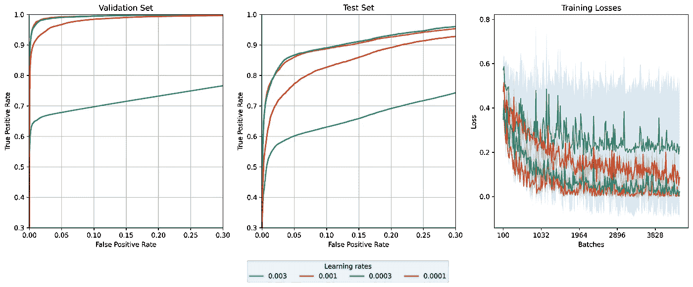

图 7\. 在三个交叉验证折叠中，变量学习率下的验证集和测试集 ROC 曲线的平均值以及训练损失。图像由作者提供。

可以明显看出，0.003 太大，而 0.0001 太小，最佳值在 0.0003–0.001 之间。我选择了接近底线 ~0.0003 的学习率进行进一步测试。

# 学习率调度器

一旦为给定模型选择了适当的最大学习率，我探索了各种学习率值的调度器。调度器是指在训练过程中修改学习率值的函数。

我 [定义了多种调度器](https://github.com/dtrizna/nebula/blob/main/nebula/optimization.py)，这些调度器基于最有前景的出版物中报告的调度器，具体为：（1）阶梯型，（2）三角形，（3）单周期，以及（4）余弦型，学习率随训练时间的变化如下面所示：

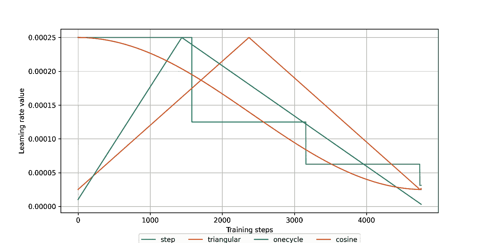

图 8\. 不同调度器下的训练步骤中的学习率变化。图像由作者提供。

实验结果（包括一个完全不使用任何调度器的运行）如下所示：

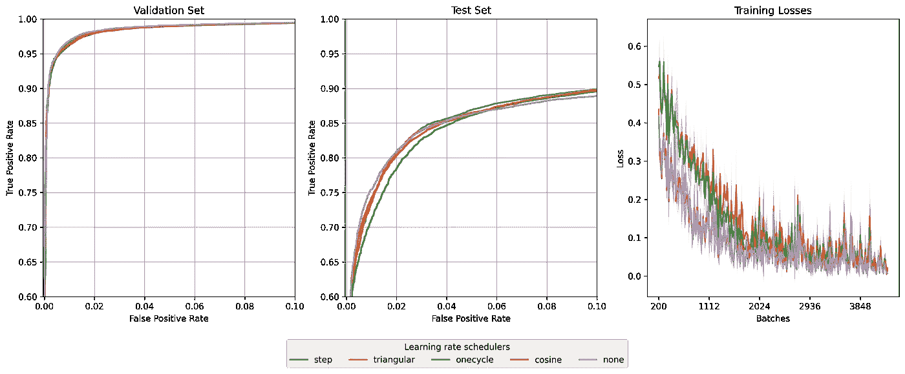

图 9\. 各种调度器应用的结果。图像由作者提供。

我们可以清楚地看到，具有“预热”阶段的调度器——即不从最大 LR 值停止（“三角形”型和“一周期”型），在前~2000 次更新期间具有更高的训练损失。从测试集上的 ROC 来看，我们可能会得出“一周期”表现最差的结论，没有调度器在低假阳性率（FPR）要求下可能会有更高的真正率（TPR，即检测率）。

为了消除歧义，这里是测试集中在最低 0.0001（意味着每 10,000 次分析中出现一个假警报）假阳性率下的精确 AUC 和 TPR 值：

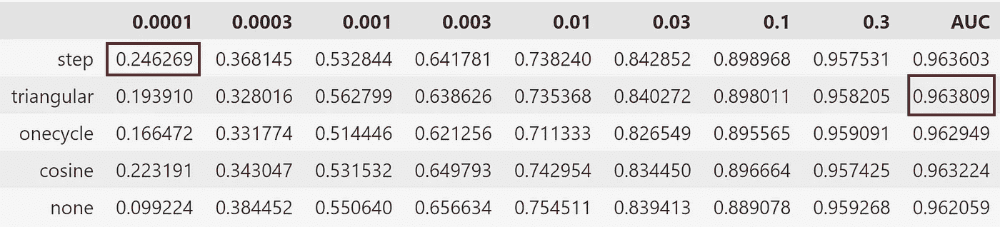

表 1\. 在特定假阳性率（列）下的平均真正率（值）以及在测试集上的 AUC，基于 3 次交叉验证折叠。表格由作者提供。

这表明，在特别低的假阳性要求下，使用“步进”调度器的训练效果最好，而整体最佳 AUC 则使用了“三角形”调度器。确实，[有证据](https://twitter.com/giffmana/status/1608568411855937536?s=20)表明“预热”可能很重要，特别是对于自监督预训练。

值得注意的是，没有调度器的训练在最低 FPR 下表现较差。这可能表明“冷却”（即在结束时逐渐减少 LR 值）对找到最佳模型的局部最小值尤为重要。对于信息安全应用来说，使用具有“冷却”阶段的调度器可能至关重要，因为假阳性会消耗人工分析师的警报预算，并且成本较高。

如果你对深入探讨 LR 调度器的话题感兴趣，以下的 TDS 文章可能会引起你的兴趣。

# 累积梯度

一位好奇的读者在我们讨论模型大小对学习率变化的影响时，注意到了 GPT-3 表 1 中的批量大小差异。不同的模型大小需要不同数量的样本来生成最佳的梯度更新。对于最小的模型，GPT 作者使用了 500k 样本的批量大小，而对于最大的模型，包括 GPT-3 本身，他们每次权重更新处理了 3.2M 样本。

鉴于资源有限的训练，适合单个 GPU 的批量大小是不理想的。从 64 或 96 个样本计算出的梯度向量可能有偏差，导致收敛缓慢。因此，讨论有限约束下训练的资源会提到在更新权重之前累积梯度的技术（即在 PyTorch 中调用`optimizer.step()`）。使用梯度累积的训练循环如下：

关键点在于，`accumulation_steps`的不同配置下训练速度有所不同。例如，每步更新梯度的速度比每 16 步更新一次要慢。因此，我设置了每次训练运行的相同时间预算为十分钟——以评估每种配置在相同计算资源下的效率。这使得更新率较低的运行能够在相同的时间内处理更多的批次（因此，训练损失的长度不同）。结果如下：

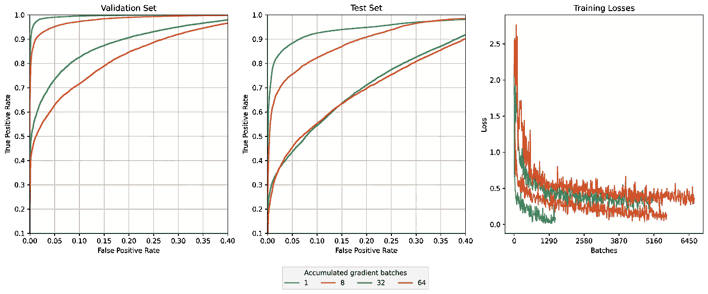

图 10\. 不同累计梯度批次值在三次交叉验证折叠中的验证集和测试集 ROC 曲线均值及训练损失。图片由作者提供。

出于某种原因，我们发现这种技术显著降低了最终模型的性能。无论是使用本地 PyTorch 实现梯度累积，如上所示，还是[使用 HuggingFace 的 accelerate](https://huggingface.co/docs/accelerate/usage_guides/gradient_accumulation)，都有相同的模式。因此，这不应该是实现中的 bug。即使具有累积循环的模型在相同训练预算内处理的批次数明显更多，经典实现的数据量减少约 5 倍仍然能达到更高的检测率。

# 梯度裁剪

梯度裁剪是一种在参数更新过程中设置梯度值上限的方法。梯度爆炸是递归神经网络（RNN）的一个显著缺陷，而梯度裁剪被引入作为解决 RNN 梯度爆炸的问题的方法。然而，实际上，所有近期关注 Transformer 的论文也都实现了这一技术。它通过没有明显缺陷的方式稳定训练过程。PyTorch 提供了一个专门的[clip_grad_norm_](https://pytorch.org/docs/stable/generated/torch.nn.utils.clip_grad_norm_.html)函数，用一行代码在训练循环中实现这一逻辑（例如，在`optimizer.step()`调用之前，[参见](https://github.com/dtrizna/nebula/blob/dev/nebula/__init__.py#L189)）。变量值在 0 到 1 范围内的结果如下：

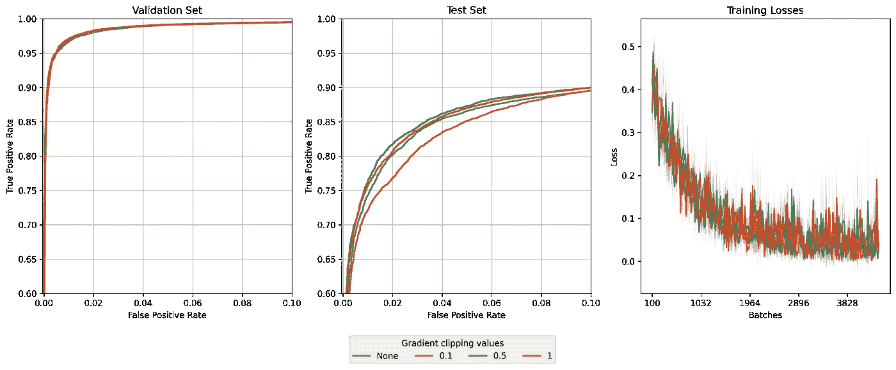

图 11\. 不同梯度裁剪限制在三次交叉验证折叠中的验证集和测试集 ROC 曲线均值及训练损失。图片由作者提供。

我们清楚地看到，0.1 的裁剪值是次优的，而其他三个选项的曲线没有得出明确结论。因此，如前所述，查看下表中特定 FPR 和 AUC 值的 TPR 是非常有帮助的：

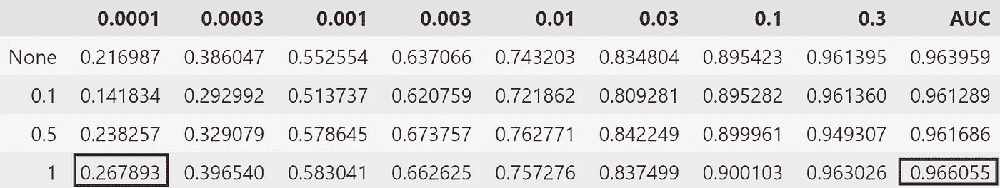

表 2\. 在 3 次交叉验证折叠中的特定假阳性率（列）下的平均真正率（值）和测试集上的 AUC。表格由作者提供。

在这里，很明显 `1.0` 的梯度裁剪提供了最佳的指标，在极低的 FP 条件下具有最高的整体 AUC，并且至少比其他选项多出 3% 的好处。

# 层归一化 — 输入或输出

原始 Transformer 实现将 [层归一化](https://arxiv.org/abs/1607.06450) 应用于自注意力块的输出。然而，现代文献一致认为输入归一化优于经典设置（有关更多细节，请参见 *PreNorm vs. PostNorm* 讨论，如 [[1](https://arxiv.org/abs/2002.04745)]、[[2](https://sh-tsang.medium.com/review-pre-ln-transformer-on-layer-normalization-in-the-transformer-architecture-b6c91a89e9ab)]）。

值得注意的是，PyTorch 的默认行为仍然是经典的 *PostNorm*，但通过修改 Transformer Encoder 块中的一个 [norm_first](https://github.com/pytorch/pytorch/blob/master/torch/nn/modules/transformer.py#L38) 布尔值可以轻松更改。我们的结果证实了公众的观点，输入归一化优于经典实现。

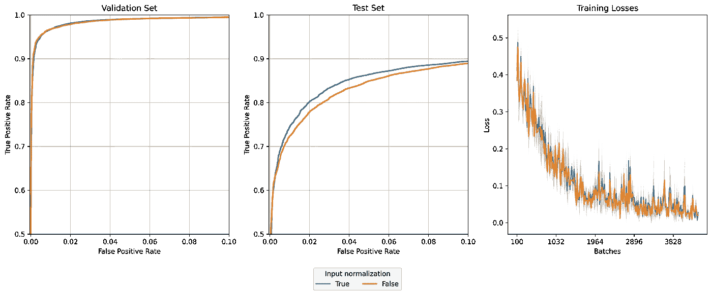

图 12\. 预归一化和后归一化配置的验证集和测试集 ROC 曲线以及训练损失的均值。图片由作者提供。

一个持续的争论是 [RMSNorm](https://arxiv.org/abs/1910.07467) 是否优于传统的 LayerNorm，其中 [LLaMa](https://ai.facebook.com/blog/large-language-model-llama-meta-ai/) 等实现使用 RMSNorm，而 [其他实验](https://arxiv.org/abs/2212.14034) 则显示没有明显的好处。我们将其排除在我们的分析之外。

# 总结

通过实验，我们发现某些配置，如 (1) 输入归一化、(2) “三角形”或“阶梯”学习率调度器，以及 (3) 大约 `1.0` 的梯度裁剪，有效地提高了模型性能。另一方面，梯度累积没有改善性能，这需要进一步探索。

此外，我们讨论了为机器数据工程化 Transformer 模型时的重要注意事项，如 (1) 领域知识影响的过滤、归一化和分词以减少词汇表和 (2) 关于模型大小的学习率选择。

如上所述，推测性地，可以将关于 Transformer 工程方法的相同结论扩展到其他类型的系统日志，如操作系统遥测或 HTTP 服务器的访问日志，希望本文能为将现代 AI 技术应用于减轻行业专业人士日常任务的挑战性工作做出贡献。
