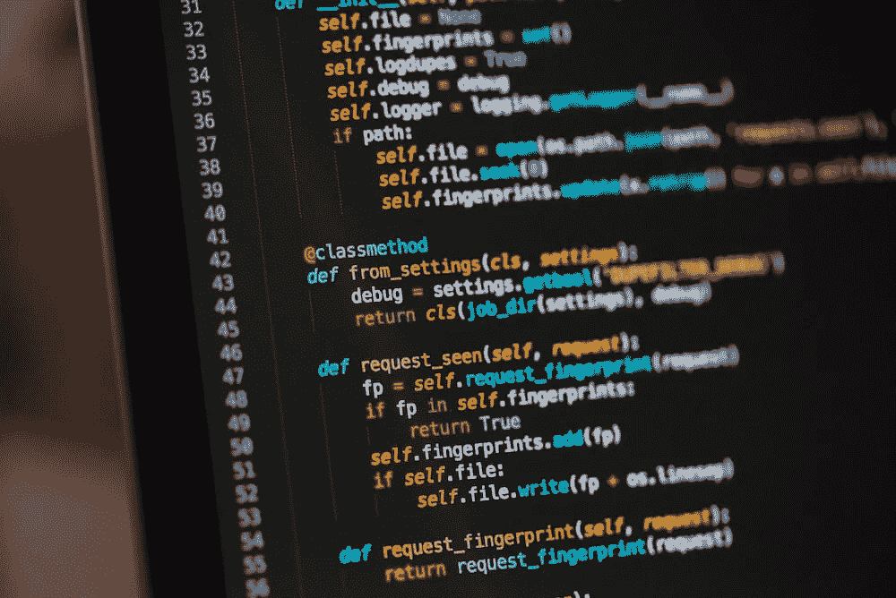

# 我应该选择哪个在线数据科学课程？

> 原文：[`towardsdatascience.com/which-online-data-science-course-should-i-do-5a73c0b2c9c2`](https://towardsdatascience.com/which-online-data-science-course-should-i-do-5a73c0b2c9c2)

## 提示：从免费的资源开始

 [Matt Chapman](https://medium.com/@mattchapmanmsc?source=post_page-----5a73c0b2c9c2--------------------------------)

·发表于 [Towards Data Science](https://towardsdatascience.com/?source=post_page-----5a73c0b2c9c2--------------------------------) ·阅读时间 7 分钟·2023 年 7 月 11 日

--

图片来自 [Headway](https://unsplash.com/@headwayio) 在 [Unsplash](https://unsplash.com/photos/5QgIuuBxKwM)

如果你想学习数据科学中的一项新技能，决定选哪个课程确实很困难。

当我在 2019 年寻找我的第一个在线数据科学编码课程时，我陷入了 ***分析瘫痪*** 的困境，花了太长时间在不同选项之间做决定。然后，当我终于做出决定并花了 20 英镑购买一个课程时，我很快发现这并不适合我，甚至没有完成它。

根据研究，我不是唯一的一个——开放大学（[2015](https://oro.open.ac.uk/43566/)）和 ResearchGate（[2018](https://www.researchgate.net/publication/330316898_The_MOOC_pivot)）的研究估计，在线课程的完成率低至 3%。

*没错，3%。*

自从 2019 年那次糟糕的第一次尝试以来，我已经参加了（并完成了！）许多其他课程，并学到了如何挑选合适课程和最大化其价值的重要经验。在这篇文章中，我将分享一些我上过的最佳课程，并介绍我用来帮助我在课程之间做出决定的 5 个关键考虑因素。这是我希望在 2019 年时听到的建议，如果对你有帮助，点击我的“关注”按钮将对我意义重大——只有 1%的读者这么做！

# 1. 从免费的资源开始

我在数据科学学习者中遇到的最大误解之一是 *$$$ 课程 = 更好的课程*。

说实话，一些最好的资源是完全免费的。像 YouTube、freeCodeCamp 和 Towards Data Science 这样的免费平台提供了成千上万的高质量在线课程，涵盖了几乎所有的数据技能，每当我需要学习新东西时，它们总是我的首选。因为这些课程是免费的，所以“试用后再购买”非常容易，这意味着在你决定花钱或开始整个课程之前，它们是测试课程适用性的绝佳方式。

例如，当我在 2021 年需要学习 git/GitHub 时，我尝试了 YouTube 上的多个免费课程，最终决定使用 Tech With Tim 的这个 [课程](https://www.youtube.com/watch?v=DVRQoVRzMIY&t=1739s&pp=ygUJbGVhcm4gZ2l0)。它时间短（40 分钟）、免费，而且有大量的社会证明（高观看次数/评分），涵盖了我需要的一切。如果你从零开始学习一个新主题，尝试一个小课程（比如 YouTube 上的课程）要比直接投入一个完整的长期课程要好得多。你可以随时转向付费课程（如果需要），但如果你没有先检查过免费选项的质量，为什么要一开始就选择付费课程呢？

这里有一些我可以彻底推荐的优秀免费课程（这些不是附属链接，也没有其他类似的东西，它们只是我参加过并且喜欢的免费课程）：

+   **Pandas / 使用 Python 进行数据分析**：开放大学的 [数据分析编程学习课程](https://www.open.edu/openlearn/science-maths-technology/learn-code-data-analysis/content-section-overview-0?active-tab=description-tab)

+   **机器学习**：Kaggle 的 [机器学习入门课程](https://www.kaggle.com/learn/intro-to-machine-learning)

+   **自然语言处理（NLP）**：[HuggingFace 课程](https://huggingface.co/learn/nlp-course/chapter1/1)（高级）

+   **SQL**：[SQL 教程 — 初学者的完整数据库课程](https://www.youtube.com/watch?v=HXV3zeQKqGY)

+   **数据科学（一般）**：[IBM 数据科学专业证书](https://www.coursera.org/professional-certificates/ibm-data-science)（你可以免费注册，只有在你需要证书时才需要付费）

+   **Git/GitHub**：[Git 初学者教程](https://www.youtube.com/watch?v=DVRQoVRzMIY&t=1739s&pp=ygUJbGVhcm4gZ2l0)

# 2\. 选择一个符合你具体目标的课程

我参加的第一个在线课程是一个通用的 Python 课程。虽然这是一个很好的课程，但它并没有特别专注于 *数据科学* 方面的 Python 应用（这是我的学习目标），而且我被迫完成了一些我不感兴趣的模块（例如，网页应用开发、地理空间分析）。这很快变得无聊/无效，不久之后我就放弃了。

为了避免犯这种错误，我建议你从一个针对小而具体目标的课程开始，然后再逐步深入。

例如，与其设定一个宏大的目标如“学会编程”，不如将其拆解为一个更小的目标如“像数据科学家一样编程”。然后，再进一步拆解为一个更小的目标，选择一种具体的语言（例如 Python），再选择一个专注于特定技能（如数据分析）的 Python 课程（例如，像这样的[课程](https://www.open.edu/openlearn/science-maths-technology/learn-code-data-analysis/content-section-overview-0?active-tab=description-tab)）或机器学习（例如，像这样的[课程](https://www.kaggle.com/learn/intro-to-machine-learning)）。

这是我在学习 Python 时效果最好的方法：我开始时是为了一个非常具体的目的（数据分析）学习 Python，并在此基础上扩展到其他领域（如网络开发或机器学习），根据需要逐步学习。

# 3\. 这个课程是否有内置的代码编辑器，还是需要你在自己的电脑上本地运行代码？

图片由[Chris Ried](https://unsplash.com/@cdr6934)提供，来源于[Unsplash](https://unsplash.com/photos/ieic5Tq8YMk)

很多电子学习平台内置了代码编辑器，允许你在浏览器/应用程序中编写和执行代码。这种方式的好处是，你可以非常轻松地开始编码，无需任何安装或设置。如果你选择像 Enki 这样的移动友好平台/应用程序上的课程，你甚至可以在通勤时或坐在厕所上时进行编码。

这类课程的*缺点*是，你不一定会学会如何在“实际环境”中运行代码，超出那个特定的电子学习平台。

如果你的目标只是学习语法并“试用一下”，那么带有内置编码编辑器的课程是一个很好的解决方案。像 CodeAcademy、DataCamp 和 freeCodeCamp 这样的网站上的课程在这方面非常棒。

如果你想在真实系统中学习，尝试寻找鼓励你自己“边编码边学习”的课程。例如，在我提到的课程中，像[SQL 教程——初学者完整数据库课程](https://www.youtube.com/watch?v=HXV3zeQKqGY)这样的课程非常适合。

# 4\. 找一个能够让你每天坚持学习的课程（“小量、多次”比临时抱佛脚要好）

图片由[Christine](https://unsplash.com/@studio_cj)提供，来源于[Unsplash](https://unsplash.com/photos/I3sr5PNUCoA)

坚持学习是建立课程惯性的#1 最佳方式。

我目前在 Duolingo 上已经坚持了 324 天学习阿拉伯语，虽然还有很长的路要走，但我现在的阿拉伯语水平比 324 天前要好很多。有时我会在 Duolingo 上花 30 分钟，有时则花 2 分钟。但是，通过专注于坚持，帮助我保持一致性，并确保即使在动力不足的日子里也能做*一些*事情。

编程课程也是一样的道理。

如果你在工作或大学期间学习在线课程，你的动力和可用时间可能会波动很大。通过坚持保持一个连续的学习习惯，你可以确保即使在繁忙的日子里也能保持一致。从长远来看，这也比“临时突击学习”要可持续得多。记忆曲线意味着我们很容易忘记一天内学习的内容，只有当我们定期回顾这些话题时，学习才会深入。

因此，当你在选择课程时，尝试找一个能让你建立小的学习习惯的课程。如果课程是一个 10 小时的非互动讲座，在忙碌的日子里可能很难进行“2 分钟的学习”，你也可能会倾向于放弃。相反，如果课程包含许多示例问题和小练习，那么在短时间内进行快速学习并保持学习习惯会容易得多。

如果每天坚持不现实，那为何不尝试每周坚持一次？你能否在接下来的 52 周内每周做一点？

# 5\. 通过将大课程拆分为“迷你课程”来创建自己的“课程”

当我的奶奶在 1960 年代尝试戒烟时，她给自己立了个承诺：如果她连续三个月不吸烟，她将用她原本用于购买香烟的钱买一块新手表。

我一直喜欢那个故事，虽然发生在 60 年前，但我认为它在 2023 年仍然对我们有很多智慧。

如果你唯一的目标是“完成”整个课程，你会给自己设置一个漫长而艰难的任务。如果你将目标拆分为*迷你*目标（例如，“完成这一章”），并不断奖励自己以达到这些迷你目标，你会发现保持动力变得容易得多。

例如，当我参加[IBM 数据科学专业证书](https://www.coursera.org/professional-certificates/ibm-data-science)时，我会在每章结束时用一小块甜点奖励自己，并将刚刚学到的内容应用到我的在线作品集上。这些看似微不足道的奖励实际上真的帮助我保持了动力，因为总是有一些短期内可以实现的具体目标。

就这样！我选择好课程的顶级技巧，以及一些对我帮助最大的课程。

# 哦，还有一件事 —

我启动了一个免费的通讯《[AI in Five](https://aiinfive.substack.com/)》，每周分享 5 个要点，涵盖最新的 AI 新闻、编程技巧以及数据科学家/分析师的职业故事。没有炒作，没有“数据是新的石油”的废话，也没有埃隆的推文——只有实用的技巧和见解，帮助你在职业发展中前进。如果这对你有吸引力，[点击这里订阅](https://aiinfive.substack.com/)！

 [## AI in Five | Matt Chapman | Substack

### 最新的新闻、职业故事和编码技巧，来自数据科学和 AI 的世界，以 5 个要点总结…

[aiinfive.substack.com](https://aiinfive.substack.com/?source=post_page-----5a73c0b2c9c2--------------------------------)
