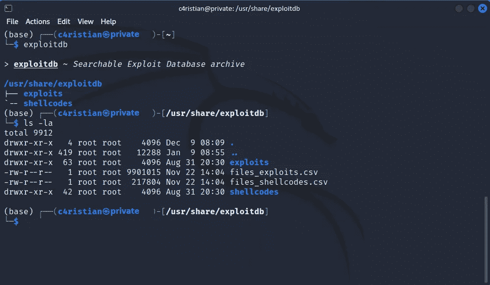
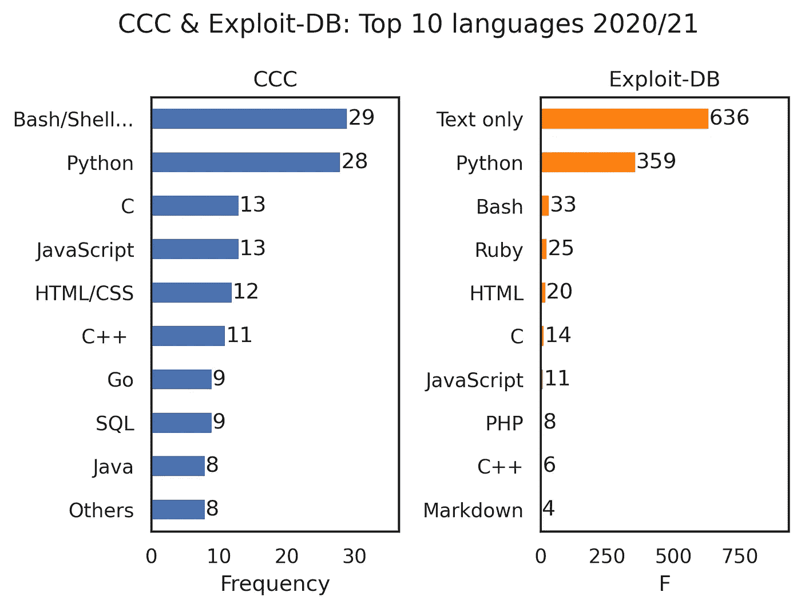
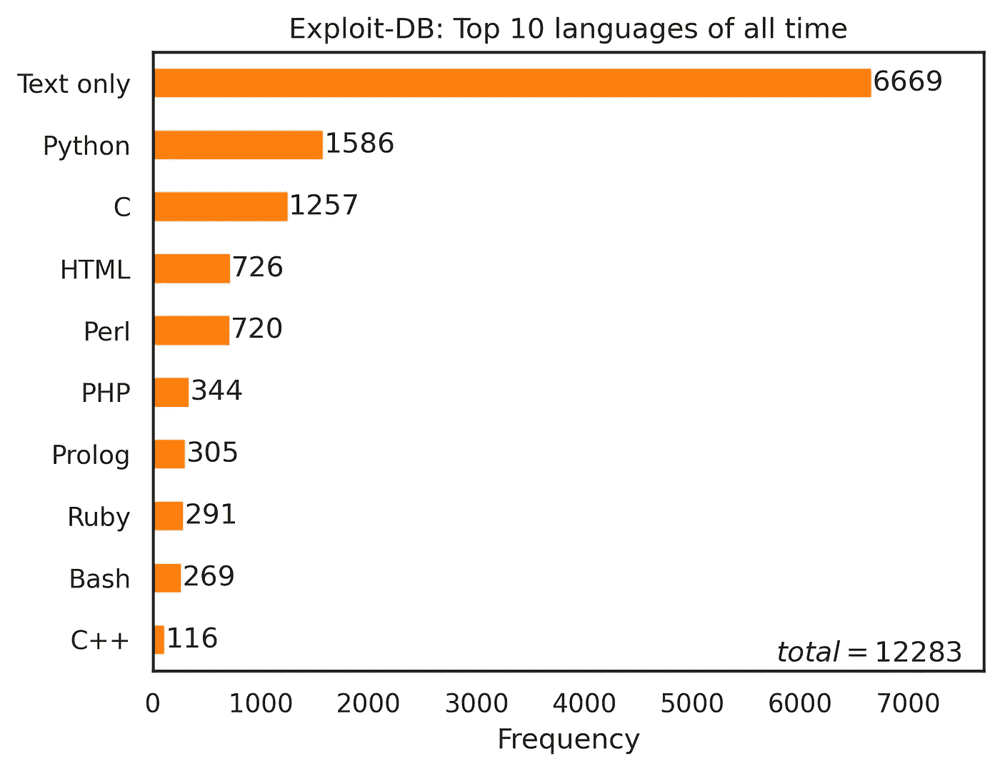
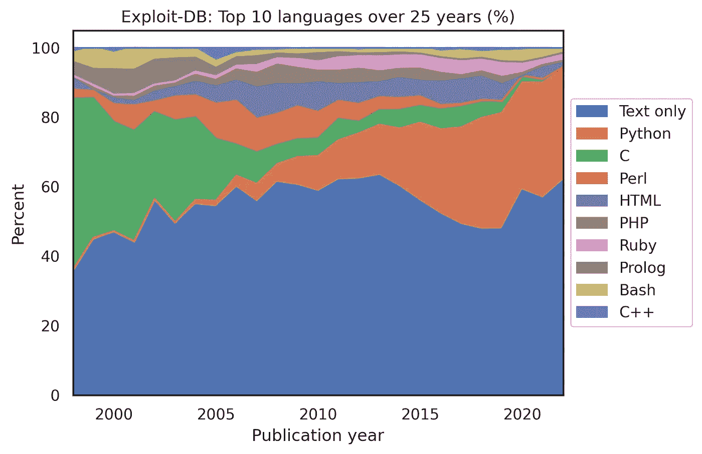

# 黑客使用哪些编程语言？

> 原文：[`towardsdatascience.com/which-programming-languages-do-hackers-use-ac3ed9d3e8f8?source=collection_archive---------8-----------------------#2023-01-31`](https://towardsdatascience.com/which-programming-languages-do-hackers-use-ac3ed9d3e8f8?source=collection_archive---------8-----------------------#2023-01-31)

## *使用 Python 分析漏洞数据库*

[](https://medium.com/@c4ristian?source=post_page-----ac3ed9d3e8f8--------------------------------)[](https://towardsdatascience.com/?source=post_page-----ac3ed9d3e8f8--------------------------------) [Christian Koch](https://medium.com/@c4ristian?source=post_page-----ac3ed9d3e8f8--------------------------------)

·

[关注](https://medium.com/m/signin?actionUrl=https%3A%2F%2Fmedium.com%2F_%2Fsubscribe%2Fuser%2F7633c76cf996&operation=register&redirect=https%3A%2F%2Ftowardsdatascience.com%2Fwhich-programming-languages-do-hackers-use-ac3ed9d3e8f8&user=Christian+Koch&userId=7633c76cf996&source=post_page-7633c76cf996----ac3ed9d3e8f8---------------------post_header-----------) 发表在 [Towards Data Science](https://towardsdatascience.com/?source=post_page-----ac3ed9d3e8f8--------------------------------) ·8 分钟阅读·2023 年 1 月 31 日[](https://medium.com/m/signin?actionUrl=https%3A%2F%2Fmedium.com%2F_%2Fvote%2Ftowards-data-science%2Fac3ed9d3e8f8&operation=register&redirect=https%3A%2F%2Ftowardsdatascience.com%2Fwhich-programming-languages-do-hackers-use-ac3ed9d3e8f8&user=Christian+Koch&userId=7633c76cf996&source=-----ac3ed9d3e8f8---------------------clap_footer-----------)

--

[](https://medium.com/m/signin?actionUrl=https%3A%2F%2Fmedium.com%2F_%2Fbookmark%2Fp%2Fac3ed9d3e8f8&operation=register&redirect=https%3A%2F%2Ftowardsdatascience.com%2Fwhich-programming-languages-do-hackers-use-ac3ed9d3e8f8&source=-----ac3ed9d3e8f8---------------------bookmark_footer-----------)

照片由 [Luca Bravo](https://unsplash.com/@lucabravo?utm_source=medium&utm_medium=referral) 提供，来源于 [Unsplash](https://unsplash.com/?utm_source=medium&utm_medium=referral)

在 2021 年，我们与其他科学家一起在德国混沌计算机俱乐部（CCC）进行了[调查](https://doi.org/10.48550/arXiv.2203.12466)。我们的目标是找出黑客最常用的编程语言。本文跟进了调查结果，并将其发现与对[Exploit Database](https://www.exploit-db.com/)的分析进行比较。读者将获得逐步的环境设置说明和结果总结。因此，本文不仅涵盖了应用技术，还提供了有关网络安全领域的见解。

# 调查概述

作为欧洲最大的黑客协会，[混沌计算机俱乐部](https://www.ccc.de/en)为研究该领域中流行的编程语言提供了良好的基础。为此，我们在 2021 年 5 月向俱乐部的成员发送了一个在线问卷的链接。根据结果，受访者主要使用 Shell 和 Python 进行黑客攻击。调查的另一个关键发现是，他们的语言偏好随着时间的推移发生了变化。总体而言，参与者并不认为编程语言的选择对黑客攻击至关重要。由于样本量只有 48 个，研究的样本量相对较小。由于仅针对 CCC 的成员，结果也可能存在偏差。本文的目标是通过分析 Exploit-DB 来验证关键结果。

# 关于 Exploit-DB

在 CCC 调查进行的同一年，一种被称为零日漏洞的攻击引起了广泛关注。当时，流行的日志框架 Log4j 遭遇了一个高度严重的[漏洞](https://www.ncsc.gov.uk/information/log4j-vulnerability-what-everyone-needs-to-know)。利用这种安全缺陷的脚本称为*exploit*。顾名思义，Exploit Database 提供了一个包含 exploit 和相应易受攻击软件的公共档案。该平台的目标用户是渗透测试人员和安全研究人员。用户可以通过其网站或在[Kali Linux](https://www.kali.org/tools/exploitdb/)下提供的工具集访问数据库。

在撰写本文时，Exploit-DB 中已发布超过 45,000 个 exploit，来自 9,000 多名独立作者（[*source*](https://github.com/c4ristian/exploits/blob/master/notebooks/comparison.ipynb)）。数据库条目包含不同的属性，如 exploit ID、作者、类型和发布日期。每个记录与一个包含实际脚本或程序的文件相关。在 Kali 系统下，我们通过执行 shell 命令`exploitdb`来找到数据库的根目录。该目录包含一个 CSV 文件（files_exploits.csv*）*，以及包含实际脚本或程序的子目录（exploits/）。



图 1：Kali Linux 下的 Exploit-DB 目录

本文描述的比较是在 2023 年 1 月 13 日使用 2022 年 11 月 22 日的数据库快照准备的。快照和分析的源代码都可以在[GitHub](https://github.com/c4ristian/exploits)上获取。

# 设置和数据转换

为了设置分析环境，第一步是克隆 GitHub 项目。所有所需文件都存储在其根目录*exploits*中。该实现基于[Anaconda](https://www.anaconda.com/products/distribution) Python 发行版，客户端机器上必须预先安装该发行版。可以通过在项目根目录中执行以下命令来创建和激活 conda 环境：

```py
conda env create -f environment.yml
conda activate exploits
```

要分析的数据库快照存储为*data*文件夹中的 CSV 文件。它是从 Kali Linux 中获取的，并通过脚本[execute_transformer](https://github.com/c4ristian/exploits/blob/master/execute_transformer.py)进行了转换。转换时间和快照时间都记录在文件[timestamps](https://github.com/c4ristian/exploits/blob/master/data/timestamps.txt)中。如有需要，可以通过在 Kali shell 中运行以下命令来更新快照：

```py
cp -p /usr/share/exploitdb/files_exploits.csv data/
python execute_transformer.py
```

转换脚本提供了整理数据和推导附加字段的功能。一个主要任务是提取使用的编程语言的信息。为此，应用了库[Pygments](https://pygments.org/)。虽然其主要目的是语法高亮，但该框架提供了猜测特定文件编程语言的功能。

除了 Pygments，还有其他语言检测库。本文测试的一个例子是深度学习解决方案[Guesslang](https://guesslang.readthedocs.io/en/latest/)。然而，将其集成到 conda 环境中证明是困难的，而且处理时间远远超过 Pygments。由于 Guesslang 没有产生更好的结果，因此采用了后者框架。以下函数将 Pygments 纳入数据转换脚本中：

```py
import pygments
from pygments.lexers import guess_lexer_for_filename

def _parse_exploit_file(file_name):
    with open(file_name, encoding="UTF-8") as file:
        lines = file.readlines()
        text = "\n".join(lines)

        line_count = len(lines)

        try:
            lang_guessed = guess_lexer_for_filename(file_name, text).name
        except pygments.util.ClassNotFound:
            lang_guessed = None

        return line_count, lang_guessed
```

上述 Python 代码读取某个文件，统计其行数，并使用函数`guess_lexer_for_filename`来检测编程语言。为此，框架应用了各种 Lexer，即用于语法分析的类。只有那些分配给给定文件扩展名的 Lexer 被考虑在内。有些扩展名只有一个类，而其他扩展名则存在选择上的模糊性。例如，扩展名“py”明确指向 Python，而“pl”扩展名则可能指向 Perl 或 Prolog。最佳匹配的 Lexer 被作为结果返回。其名称揭示了编程语言，并为分析提供基础。下一节讨论的发现源自于笔记本 [comparison](https://github.com/c4ristian/exploits/blob/master/notebooks/comparison.ipynb)。此外，GitHub 项目还提供了进一步的笔记本，以探索 Exploit-DB 的具体方面。

# 结果讨论

CCC 调查的核心问题是参与者在研究前一年使用了哪些编程语言。受访者可以选择多个答案选项。图 2 比较了 CCC 成员提及的前十种语言与 Exploit-DB 作者使用的语言。图表揭示了相似之处，也显示了差异。

首先，样本规模存在一个主要差距。总体而言，48 名 CCC 成员参与了调查。相比之下，超过 900 名独立作者在 2020/21 年间在 Exploit-DB 上发布了 2,500 多个文件。这两年被选中是因为它们与比较研究的研究期重合。为了避免重复，每个作者-语言组合在 Exploit-DB 中仅计数一次。在研究期间，这导致了 1,134 个语言参考，其中 1,116 个属于前十名。另一方面，CCC 调查的参与者将他们的前十种语言提及了 140 次。



图 2：CCC 调查和 Exploit-DB 的前十种语言

CCC 的成员主要使用 Shell（Bash/Shell/PowerShell）和 Python，其次是 C、JavaScript 和 HTML/CSS。所有这些技术在 Exploit-DB 中也都有出现。总体来看，语言选择有很大重叠。图 2 中的十种技术中有六种出现在两个列表中。Python 始终排名第二，显示出其在网络安全领域的受欢迎程度。然而，图表一侧的某些语言在另一侧并未出现。

一个主要的区别是 Exploit-DB 中语言的分布不均。超过一半的提交是文本文件。在这里，Pygments 分配的名称“仅文本”具有误导性。Exploit-DB 中的文本文件通常包含描述，但也经常包含 shell 命令和可能的其他语言脚本。因此，某些技术在结果中可能被低估。抽样检查显示，这对 shell 脚本可能确实成立，后者在 CCC 研究中排名第一。这也是我们方法的一个局限性。像 Pygments 这样的框架在评估多语言文件时存在问题。克服这一问题将是一个有趣的后续研究课题。

让我们暂时离开 2020/21 年，并查看 Exploit-DB 的整个历史。图 3 显示了数据库中所有时间的前十种语言。与之前一样，语言检测依赖于 Pygments，每种作者-语言组合只计算一次。



图 3：Exploit-DB 中所有时间的前十种语言

根据图 3，Exploit-DB 中所有时间的前十种语言以 Text 为首，其次是 Python、C、HTML 和 Perl。再次，这与 CCC 成员的选择有相当大的交集。一个惊讶的发现是 Prolog 出现在列表的后半部分。推测原因是将扩展名为 “pl” 的文件错误分类。无论如何，Perl 的相对较高排名值得注意，因为该语言在图 2 中根本没有出现。这与 CCC 调查的另一个发现相符。在研究中，大多数参与者（77.5%）报告称他们的语言偏好随时间发生了变化。为了评估这一点，我们可以查看图 4。该图表可视化了在本分析之前的 25 年中 Exploit-DB 前十种语言的百分比份额。每种作者-语言组合每年只计算一次。因此，我们在研究期间发现了来自 9,592 位独特作者的 16,422 个语言引用。



图 4：分析前 25 年 Exploit-DB 中的前 10 种语言

图 4 揭示了 Exploit-DB 中文本文件的百分比保持相对稳定。选择 25 年的时间范围是因为此期间之前的提交数量相对较少。除了文本的持续使用外，图 4 显示了其他语言的偏好变化。最明显的是数据库中从 C 语言向 Python 的转变。CCC 研究中也提到了一个可能的原因。参与者报告称，他们并未将编程语言的选择视为黑客攻击中的关键因素。因此，Python 使用的增加可能仅仅反映了其近年来的普遍受欢迎程度。语言偏好因此应随着技术的发展而继续变化。例如，引入[Rust](https://en.wikipedia.org/wiki/Rust_for_Linux)作为 Linux 内核开发的第二语言，可能会引发这种变化。这个预测是否准确将在未来几年得到验证。

# 结论

总结而言，本文中呈现的比较揭示了 CCC 成员和 Exploit-DB 作者所使用语言之间的显著重叠。两个数据集都确认了 Python 在网络安全领域的流行程度。此外，每个数据集都表明语言偏好随着时间的推移而发生变化。CCC 研究提出了一个可能的原因。参与者并未将编程语言的选择视为黑客攻击中的关键因素。根据这一解释，人们应预期随着技术进步，语言偏好将继续变化。Exploit-DB 分析的一个主要限制与语言检测方法有关。由于多语言文件的问题，某些技术可能被低估。解决这个问题将是一个有趣的后续研究主题。显然，Exploit-DB 为数据科学家和安全专家提供了丰富的数据集。关于利用艺术的学习还有很多。

除非另有说明，所有图片均由作者提供。
