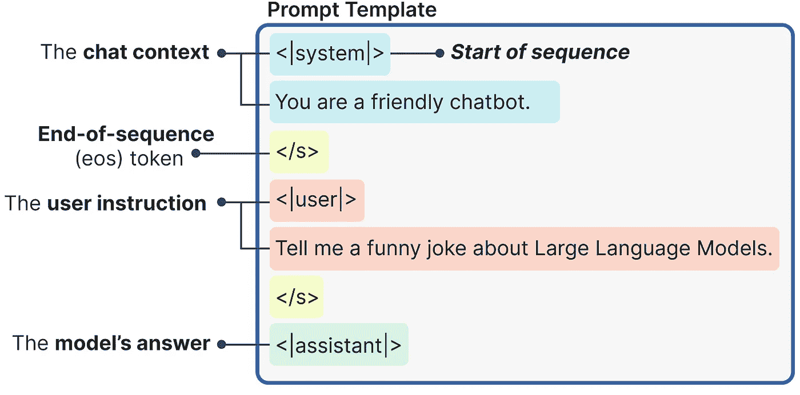
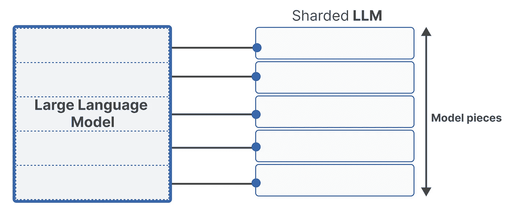
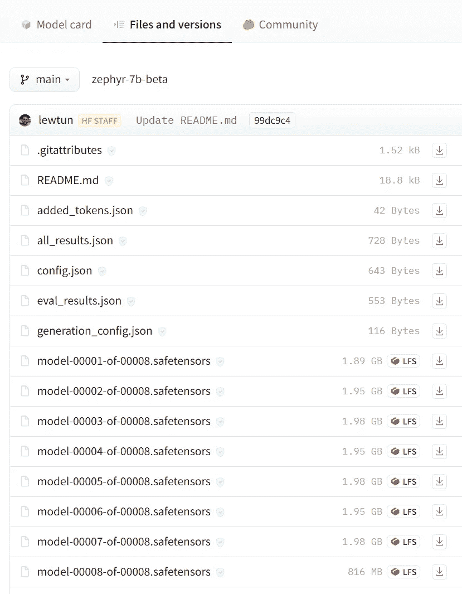
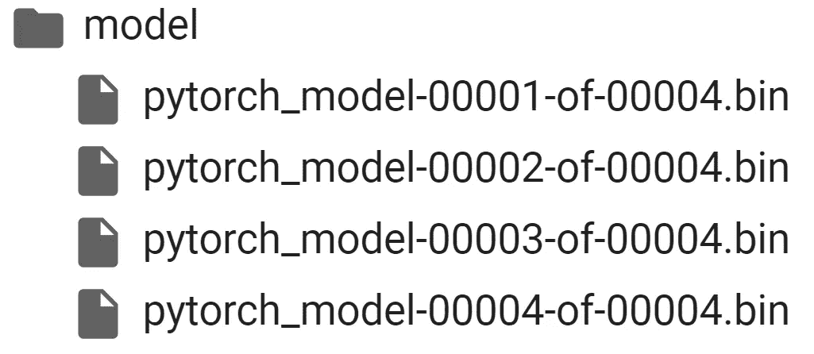
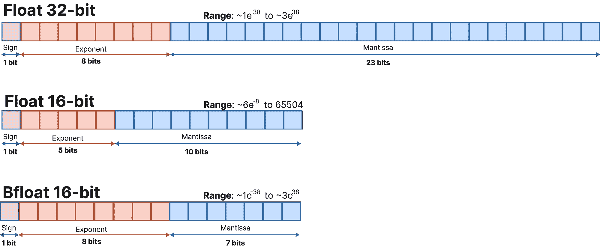
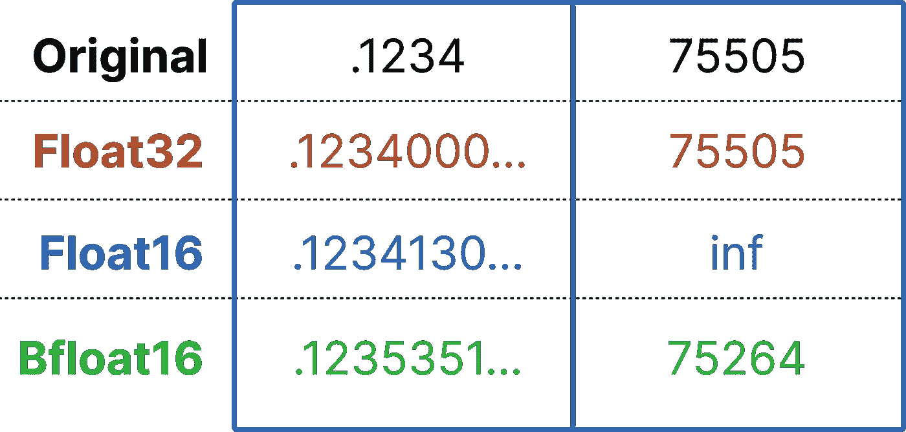
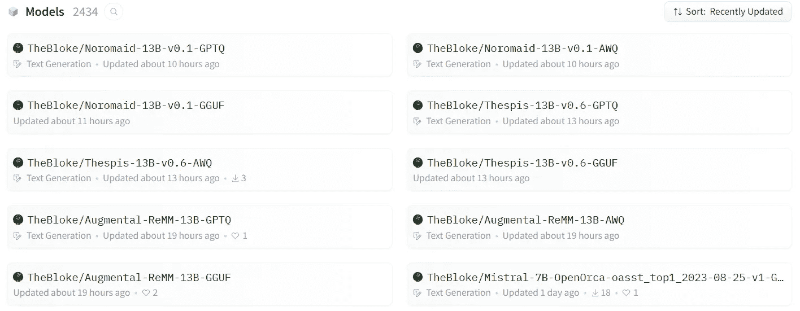

# 哪种量化方法适合你？（GPTQ vs. GGUF vs. AWQ）

> 原文：[`towardsdatascience.com/which-quantization-method-is-right-for-you-gptq-vs-gguf-vs-awq-c4cd9d77d5be`](https://towardsdatascience.com/which-quantization-method-is-right-for-you-gptq-vs-gguf-vs-awq-c4cd9d77d5be)

## 探索预量化的大型语言模型

[](https://medium.com/@maartengrootendorst?source=post_page-----c4cd9d77d5be--------------------------------)[](https://towardsdatascience.com/?source=post_page-----c4cd9d77d5be--------------------------------) [Maarten Grootendorst](https://medium.com/@maartengrootendorst?source=post_page-----c4cd9d77d5be--------------------------------)

·发布于 [Towards Data Science](https://towardsdatascience.com/?source=post_page-----c4cd9d77d5be--------------------------------) ·11 分钟阅读·2023 年 11 月 14 日

--


在过去一年里，我们见证了大型语言模型 (LLMs) 的狂野西部。新技术和模型的发布速度惊人！因此，我们有了许多不同的标准和处理 LLM 的方法。

在这篇文章中，我们将探讨一个话题，即通过几种（量化）标准加载你的本地 LLM。由于分片、量化以及不同的保存和压缩策略，很难知道哪种方法适合你。

在这些例子中，我们将使用 [Zephyr 7B](https://huggingface.co/HuggingFaceH4/zephyr-7b-beta)，这是 Mistral 7B 的一个微调变体，经过 [Direct Preference Optimization](https://arxiv.org/abs/2305.18290) (DPO) 训练。

🔥 **提示**：在每个加载 LLM 的示例后，建议重启你的笔记本，以防止 OutOfMemory 错误。加载多个 LLM 需要大量 RAM/VRAM。你可以通过删除模型并重置缓存来重置内存：

```py
# Delete any models previously created
del model, tokenizer, pipe

# Empty VRAM cache
import torch
torch.cuda.empty_cache()
```

你还可以参考 [**Google Colab Notebook**](https://colab.research.google.com/drive/1rt318Ew-5dDw21YZx2zK2vnxbsuDAchH?usp=sharing) 确保一切按预期工作。

**更新**：我上传了一个视频版本到 YouTube，深入探讨了如何使用这些量化方法：

# 1\. HuggingFace

加载你的 LLM 的最直接、最基本的方法是通过 🤗 [Transformers](https://github.com/huggingface/transformers)。HuggingFace 创建了一套大型软件包，使我们能够对 LLM 进行惊人的操作！

我们将从安装 HuggingFace 开始，从其主分支中支持更新的模型：

```py
# Latest HF transformers version for Mistral-like models
pip install git+https://github.com/huggingface/transformers.git
pip install accelerate bitsandbytes xformers
```

安装后，我们可以使用以下管道轻松加载我们的 LLM：

```py
from torch import bfloat16
from transformers import pipeline

# Load in your LLM without any compression tricks
pipe = pipeline(
    "text-generation", 
    model="HuggingFaceH4/zephyr-7b-beta", 
    torch_dtype=bfloat16, 
    device_map="auto"
)
```

这种加载 LLM 的方法通常不会进行任何压缩技巧来节省 VRAM 或提高效率。

为了生成我们的提示，我们首先需要创建必要的模板。幸运的是，如果聊天模板保存在底层分词器中，这可以自动完成：

```py
# We use the tokenizer's chat template to format each message
# See https://huggingface.co/docs/transformers/main/en/chat_templating
messages = [
    {
        "role": "system",
        "content": "You are a friendly chatbot.",
    },
    {
        "role": "user", 
        "content": "Tell me a funny joke about Large Language Models."
    },
]
prompt = pipe.tokenizer.apply_chat_template(
    messages, 
    tokenize=False, 
    add_generation_prompt=True
)
```

使用内部提示模板生成的提示构造如下：



提示模板是使用内部提示模板自动生成的。注意到有不同的标签来区分用户和助手。

然后，我们可以开始将提示传递给 LLM 来生成我们的答案：

```py
outputs = pipe(
    prompt, 
    max_new_tokens=256, 
    do_sample=True, 
    temperature=0.1, 
    top_p=0.95
)
print(outputs[0]["generated_text"])
```

这给我们以下输出：

> 为什么大型语言模型去参加派对？
> 
> 为了网络和扩展其词汇量！

笑点可能有点老套，但大型语言模型的核心就是扩展词汇量和与其他模型建立联系以提高语言技能。因此，这个笑话非常适合它们！

对于纯推理来说，这种方法通常是效率最低的，因为我们在没有任何压缩或量化策略的情况下加载整个模型。

然而，这是一个很好的起点方法，因为它便于加载和使用模型！

# 2\. 分片

在我们深入量化策略之前，还有另一个技巧可以用来减少加载模型所需的 VRAM。通过**分片**，我们实际上是将模型拆分成小块或**分片**。



分片 LLM 不过是将其拆分成多个小块。每个小块更容易处理，可能避免内存问题。

每个分片包含模型的一小部分，旨在通过将模型权重分布到不同设备上来绕过 GPU 内存限制。

记得我之前说过我们没有进行任何压缩技巧吗？

这并不完全正确……

我们加载的模型，[Zephyr-7B-β](https://huggingface.co/HuggingFaceH4/zephyr-7b-beta)，实际上已经为我们进行了分片！如果你访问模型并点击*“Files and versions”*链接，你会看到模型被拆分成了八个部分。



模型被拆分成了八个小块或分片。这减少了必要的 VRAM，因为我们只需处理这些小块。

尽管我们可以自己对模型进行分片，但通常建议寻找量化模型或自己进行量化。

使用[Accelerate](https://github.com/huggingface/accelerate)包进行分片非常简单：

```py
from accelerate import Accelerator

# Shard our model into pieces of 1GB
accelerator = Accelerator()
accelerator.save_model(
    model=pipe.model, 
    save_directory="/content/model", 
    max_shard_size="4GB"
)
```

就这样！因为我们将模型分片成了 4GB 而不是 2GB，所以我们创建了更少的文件来加载：



# 3\. 使用 Bitsandbytes 进行量化

大型语言模型由一堆权重和激活值表示。这些值通常由常见的 32 位浮点数（`float32`）数据类型表示。

位数告诉你它可以表示多少个值。**Float32**可以表示从 1.18e-38 到 3.4e38 之间的值，数量相当多！位数越少，能表示的值就越少。



常见的值表示方法。我们旨在将位数保持在尽可能低的水平，同时最大化表示的范围和精度。

正如你可能预期的那样，如果我们选择较低的位大小，模型的准确性会降低，但它也需要表示更少的值，从而减小了模型的大小和内存需求。



不同的表示方法可能会对表示值的精度产生负面影响。以至于某些值甚至无法表示（例如，对于 float16 来说过大的值）。示例是使用 PyTorch 计算的。

量化是指将大型语言模型从其原始的**Float32**表示转换为较小的表示。然而，我们不仅仅是使用较小的位变体，而是将较大的位表示映射到较小的位而不丢失太多信息。

实际上，我们通常使用一种新的格式，称为**4bit-NormalFloat (NF4)**。这种数据类型通过一些特殊技巧有效地表示较大的位数据类型。它包括三个步骤：

1.  **归一化**：模型的权重被归一化，以便我们期望权重落在一定范围内。这允许对更常见的值进行更高效的表示。

1.  **量化**：权重被量化为 4 位。在 NF4 中，量化水平相对于归一化的权重均匀分布，从而有效地表示原始的 32 位权重。

1.  **去量化**：虽然权重以 4 位存储，但在计算过程中会进行去量化，这在推理过程中提升了性能。

要使用 HuggingFace 执行这种量化，我们需要定义一个量化配置，使用[Bitsandbytes](https://github.com/TimDettmers/bitsandbytes)：

```py
from transformers import BitsAndBytesConfig
from torch import bfloat16

# Our 4-bit configuration to load the LLM with less GPU memory
bnb_config = BitsAndBytesConfig(
    load_in_4bit=True,  # 4-bit quantization
    bnb_4bit_quant_type='nf4',  # Normalized float 4
    bnb_4bit_use_double_quant=True,  # Second quantization after the first
    bnb_4bit_compute_dtype=bfloat16  # Computation type
)
```

这个配置允许我们指定我们要使用的量化水平。通常，我们希望使用 4 位量化来表示权重，但在推理时使用 16 位。

然后，加载模型到管道中是直接的：

```py
from transformers import AutoTokenizer, AutoModelForCausalLM, pipeline

# Zephyr with BitsAndBytes Configuration
tokenizer = AutoTokenizer.from_pretrained("HuggingFaceH4/zephyr-7b-alpha")
model = AutoModelForCausalLM.from_pretrained(
    "HuggingFaceH4/zephyr-7b-alpha",
    quantization_config=bnb_config,
    device_map='auto',
)

# Create a pipeline
pipe = pipeline(model=model, tokenizer=tokenizer, task='text-generation')
```

接下来，我们可以使用之前的相同提示：

```py
# We will use the same prompt as we did originally
outputs = pipe(
    prompt, 
    max_new_tokens=256, 
    do_sample=True, 
    temperature=0.7, 
    top_p=0.95
)
print(outputs[0]["generated_text"])
```

这将给我们如下输出：

> 大型语言模型为什么去参加派对？
> 
> 为了联网并扩展其词汇量！
> 
> 这个笑话可能有点老套，但大型语言模型的核心就是扩展词汇量，并与其他模型建立联系以提高语言技能。所以，这个笑话非常适合它们！

量化是一种强大的技术，可以减少模型的内存需求，同时保持性能相似。它允许更快地加载、使用和微调 LLM，即使是在较小的 GPU 上。

# 4\. 预量化（GPTQ vs. AWQ vs. GGUF）

到目前为止，我们已经探讨了分片和量化技术。尽管这些技术在你的技能库中非常有用，但每次加载模型时都要应用它们似乎有些浪费。

相反，这些模型通常已经被分片和量化，供我们使用。[TheBloke](https://huggingface.co/TheBloke) 尤其是 HuggingFace 上的一个用户，执行了一些量化供我们使用。



在撰写本文时，他已经上传了 **2000 多个** 量化模型供我们使用！

这些量化模型实际上有很多不同的形状和大小。最显著的是，GPTQ、GGUF 和 AWQ 格式最常用于执行 4 位量化。

## GPTQ: 针对 GPT 模型的后训练量化

GPTQ 是一种 [**后**-**训**练 **量**化](https://arxiv.org/abs/2210.17323) (PTQ) 方法，用于 4 位量化，主要关注 **GPU** 推理和性能。

该方法背后的想法是通过最小化均方误差，将所有权重压缩到 4 位量化。在推理过程中，它会动态地将权重解量化为 float16，以提高性能，同时保持较低的内存占用。

要了解 GPTQ 内部工作的更详细指南，务必查看以下帖子：

[](/4-bit-quantization-with-gptq-36b0f4f02c34?source=post_page-----c4cd9d77d5be--------------------------------) ## 4-bit Quantization with GPTQ

### 使用 AutoGPTQ 量化你自己的 LLM

towardsdatascience.com

我们开始安装一些需要在 HuggingFace Transformers 中加载 GPTQ 类模型的包：

```py
pip install optimum
pip install auto-gptq --extra-index-url https://huggingface.github.io/autogptq-index/whl/cu118/
```

完成后，我们可以导航到我们想加载的模型，即“[TheBloke/zephyr-7B-beta-GPTQ](https://huggingface.co/TheBloke/zephyr-7B-beta-GPTQ)”，并选择一个特定的修订版。

这些修订本质上表示量化方法、压缩级别、模型的大小等。

目前，我们仍然坚持使用“*main*”分支，因为它在压缩和准确性之间通常是一个不错的平衡：

```py
from transformers import AutoModelForCausalLM, AutoTokenizer, pipeline

# Load LLM and Tokenizer
model_id = "TheBloke/zephyr-7B-beta-GPTQ"
tokenizer = AutoTokenizer.from_pretrained(model_id, use_fast=True)
model = AutoModelForCausalLM.from_pretrained(
    model_id,
    device_map="auto",
    trust_remote_code=False,
    revision="main"
)

# Create a pipeline
pipe = pipeline(model=model, tokenizer=tokenizer, task='text-generation')
```

尽管我们安装了一些额外的依赖项，但我们可以使用与之前相同的管道，这也是使用 GPTQ 的一个很大好处。

加载模型后，我们可以运行如下提示：

```py
# We will use the same prompt as we did originally
outputs = pipe(
    prompt,
    max_new_tokens=256,
    do_sample=True,
    temperature=0.1,
    top_p=0.95
)
print(outputs[0]["generated_text"])
```

这给了我们以下生成的文本：

> 为什么大型语言模型去参加派对？
> 
> 当然，是为了展示它的机智和魅力！
> 
> 但不幸的是，它在人群中迷失了，找不到回去的路
> 
> 对它的主人。派对上的人们对它融入环境的能力感到印象深刻
> 
> 与人群无缝融合，但大型语言模型只是感到困惑
> 
> 并想回家。最后，一群人发现了它
> 
> 他们认识到其独特的风格，并将其带回了应有的地方。
> 
> 从那时起，大型语言模型确保在
> 
> 为了安全起见，所有派对。

GPTQ 是最常用的压缩方法，因为它优化了 GPU 的使用。如果你的 GPU 无法处理如此大的模型，绝对值得从 GPTQ 开始，然后切换到以 CPU 为重点的方法，如 GGUF。

## GGUF: **GPT-生成统一格式**

尽管 GPTQ 处理压缩非常好，但它对 GPU 的关注可能在你没有硬件支持时成为一个缺点。

GGUF，之前称为 GGML，是一种量化方法，允许用户使用 CPU 运行 LLM，但也可以将一些层卸载到 GPU 上以加速。

虽然使用 CPU 通常比使用 GPU 推理更慢，但对于在 CPU 或 Apple 设备上运行模型的人来说，它是一个了不起的格式。特别是随着我们看到更多较小但更强大的模型出现，如 Mistral 7B，GGUF 格式可能会长久存在！

使用 GGUF 通过 [ctransformers](https://github.com/marella/ctransformers) 包相当简单，我们需要先安装这个包：

```py
pip install ctransformers[cuda]
```

完成后，我们可以导航到我们想要加载的模型，即“[TheBloke/zephyr-7B-beta-GGUF](https://huggingface.co/TheBloke/zephyr-7B-beta-GGUF)”并选择一个具体的文件。

像 GPTQ 一样，这些文件指示了量化方法、压缩、级别、模型大小等。

我们使用“*zephyr-7b-beta.Q4_K_M.gguf*”因为我们专注于 4 位量化：

```py
from ctransformers import AutoModelForCausalLM
from transformers import AutoTokenizer, pipeline

# Load LLM and Tokenizer
# Use `gpu_layers` to specify how many layers will be offloaded to the GPU.
model = AutoModelForCausalLM.from_pretrained(
    "TheBloke/zephyr-7B-beta-GGUF",
    model_file="zephyr-7b-beta.Q4_K_M.gguf",
    model_type="mistral", gpu_layers=50, hf=True
)
tokenizer = AutoTokenizer.from_pretrained(
    "HuggingFaceH4/zephyr-7b-beta", use_fast=True
)

# Create a pipeline
pipe = pipeline(model=model, tokenizer=tokenizer, task='text-generation')
```

加载模型后，我们可以运行如下提示：

```py
# We will use the same prompt as we did originally
outputs = pipe(prompt, max_new_tokens=256)
print(outputs[0]["generated_text"])
```

这给出了以下输出：

> 为什么大型语言模型去参加派对？
> 
> 让大家对它的词汇印象深刻！
> 
> 但不幸的是，它不断重复相同的笑话，让大家 groan 和 roll their eyes。派对上的人们很快意识到，大型语言模型更像是个 party pooper 而不是 party animal。
> 
> 故事的寓意是：仅仅因为大型语言模型可以生成很多字词，并不意味着它知道如何搞笑或娱乐。有时候，少即是多！

GGUF 是一个很棒的格式，如果你像我一样缺乏 GPU，没有最新最强的 GPU，想要同时利用 CPU 和 GPU 的话。

## AWQ: Activation-aware Weight Quantization

一个新格式是 AWQ ([Activation-aware Weight Quantization](https://arxiv.org/abs/2306.00978))，它是一种类似于 GPTQ 的量化方法。AWQ 和 GPTQ 作为方法之间有几个区别，但最重要的一点是 AWQ 假设不是所有的权重对 LLM 的性能同样重要。

换句话说，在量化过程中会跳过一小部分权重，这有助于减少量化损失。

结果，他们的论文提到，与 GPTQ 相比有显著的加速，同时保持类似，甚至有时更好的性能。

这种方法仍然相对较新，尚未普及到像 GPTQ 和 GGUF 那样的程度，因此很有趣的是看看这些方法是否能够共存。

对于 AWQ，我们将使用 [vLLM](https://github.com/vllm-project/vllm) 包，因为根据我的经验，这是使用 AWQ 的最简便途径：

```py
pip install vllm
```

使用 vLLM，加载和使用我们的模型变得毫不费力：

```py
from vllm import LLM, SamplingParams

# Load the LLM
sampling_params = SamplingParams(temperature=0.0, top_p=1.0, max_tokens=256)
llm = LLM(
    model="TheBloke/zephyr-7B-beta-AWQ", 
    quantization='awq', 
    dtype='half', 
    gpu_memory_utilization=.95, 
    max_model_len=4096
)
```

然后，我们可以轻松地使用 `.generate` 来运行模型：

```py
# Generate output based on the input prompt and sampling parameters
output = llm.generate(prompt, sampling_params)
print(output[0].outputs[0].text)
```

这给我们带来了以下输出：

> 为什么大型语言模型去参加派对？
> 
> 为了扩展词汇量和建立网络！
> 
> 为什么大型语言模型脸红了？
> 
> 因为它听到另一个模型说它有点啰嗦！
> 
> 为什么大型语言模型被逐出了图书馆？
> 
> 它太吵了，一直打断其他模型的对话，喋喋不休！
> 
> …

虽然这是一个新格式，但由于其速度和压缩质量，AWQ 正在获得越来越多的关注！

🔥 **提示**：对于这些技术在 VRAM/困惑度方面的详细比较，我强烈建议阅读这篇 [深入文章](https://oobabooga.github.io/blog/posts/gptq-awq-exl2-llamacpp/) 和后续的 [讨论](https://github.com/ggerganov/llama.cpp/pull/3776#issuecomment-1781472687)。

# 感谢阅读！

如果你和我一样，对 AI 和/或心理学充满热情，请随时在 [**LinkedIn**](https://www.linkedin.com/in/mgrootendorst/) 上添加我，在 [**Twitter**](https://twitter.com/MaartenGr) 上关注我，或者订阅我的 [**Newsletter**](http://maartengrootendorst.substack.com/)。你也可以在我的 [**Personal Website**](https://maartengrootendorst.com/) 上找到我的一些内容。

*所有没有来源信用的图片均由作者创作 —— 也就是说，全部都是我，我喜欢自己制作图片 ;)*
