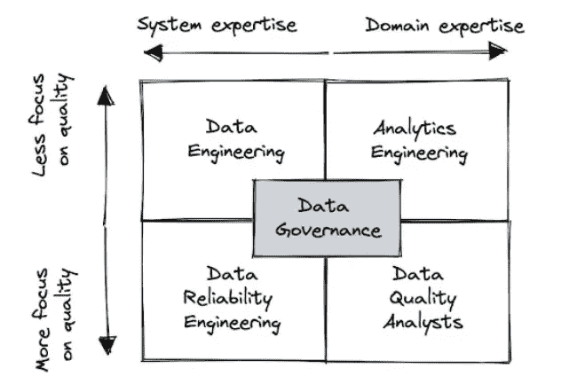
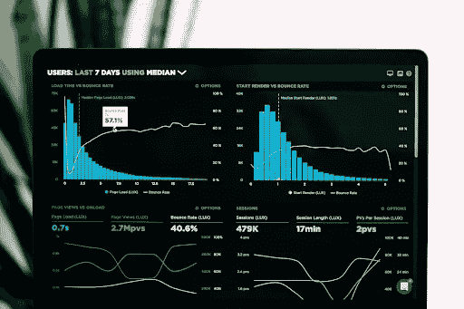
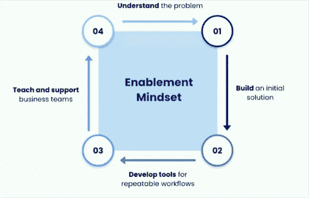
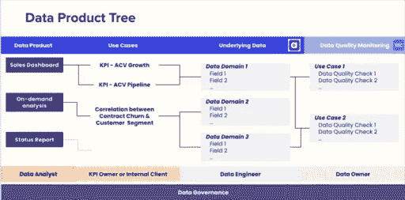

# 哪个团队应该负责数据质量？

> 原文：[`towardsdatascience.com/which-team-should-own-data-quality-44f1d6996eb8?source=collection_archive---------3-----------------------#2023-06-09`](https://towardsdatascience.com/which-team-should-own-data-quality-44f1d6996eb8?source=collection_archive---------3-----------------------#2023-06-09)

## 专家还是全能型人才？工程师还是分析师？我们探讨了哪些团队结构最适合有效提升数据质量。

 [shane murray](https://medium.com/@shane.murray5?source=post_page-----44f1d6996eb8--------------------------------)

·

[关注](https://medium.com/m/signin?actionUrl=https%3A%2F%2Fmedium.com%2F_%2Fsubscribe%2Fuser%2F8aa0d9ae3ebd&operation=register&redirect=https%3A%2F%2Ftowardsdatascience.com%2Fwhich-team-should-own-data-quality-44f1d6996eb8&user=shane+murray&userId=8aa0d9ae3ebd&source=post_page-8aa0d9ae3ebd----44f1d6996eb8---------------------post_header-----------) 发布于 [Towards Data Science](https://towardsdatascience.com/?source=post_page-----44f1d6996eb8--------------------------------) ·8 分钟阅读·2023 年 6 月 9 日

--

图片来源：Shane Murray。

当然，数据质量是每个人的问题。但谁来负责解决方案呢？

鉴于方法的多样性和成功的参差不齐，我们有许多自然实验可以借鉴。

一些组织会尝试将责任广泛分配给数据管理员、数据所有者、数据工程和治理委员会，每个人负责数据价值链的一部分。而另一些组织则将责任集中在少数几个专家身上，期望他们能够跨越整个平台。一些团队将数据质量主要视为技术挑战，而另一些团队则将其视为业务或流程问题。

我在过去一年中与几十位数据领导者交谈，以了解他们如何将数据质量作为整体组织目标的一部分来处理。我们还调查了 200 名数据专业人士，询问他们的内部团队中哪个负责数据质量等问题。

本文将关注最常见的团队所有权模型，包括：数据工程、数据可靠性工程、分析工程、数据质量分析师和数据治理团队。

# 为什么数据质量的所有权很重要？

但在深入探讨之前，回答这个常见的跟进问题很重要。它通常以“只要完成了就好，谁负责数据质量又有什么关系？”的形式提出。

这种表述中有一点诡辩，因为“只要完成了就好”远未确定，坦率地说，这也是整个工作的目的所在。关于明确的[问责制](https://hbr.org/2017/02/how-spotify-balances-employee-autonomy-and-accountability)、[所有权](https://www.gallup.com/workplace/236366/right-culture-not-employee-satisfaction.aspx)和[目标设定](https://psycnet.apa.org/record/1990-97846-000)的积极影响有很多研究，很难只引用其中一个。

现实是，解决数据质量问题不太可能是团队*想*要优先考虑的工作，而是通常是团队*需要*优先考虑的工作，以保持信任或扩大团队和平台。没有问责制的话，推进数据质量的低可见性任务，如单元测试或文档，将无法按应有的程度完成。

此外，当责任分散时，你通常会得到碎片化的解决方案、协调不一致的优先级和沟通差距，最终导致数据产品的停机时间增加。

虽然我见过所有类型的团队成功实施数据质量解决方案，但每种所有权结构都有独特的优势和需要缓解的劣势。

数据领导者需要理解每个团队和能力如何契合在一起。如果你还要派一个笨重的中锋，那么拥有一个快速的控球后卫并喜欢过渡进攻就没有意义了。整体需要大于各部分之和。

现在，让我们更详细地了解最流行的数据质量团队结构的优缺点。

# 数据工程

[Luke Chesser](https://unsplash.com/@lukechesser?utm_source=unsplash&utm_medium=referral&utm_content=creditCopyText) 摄影，来源于 [Unsplash](https://unsplash.com/s/photos/data-engineering?utm_source=unsplash&utm_medium=referral&utm_content=creditCopyText)

让数据工程团队主导数据质量响应是最常见的模式。大约一半使用现代数据堆栈的组织都采取了这种方式。

通常，这种方法伴随着“你构建了管道，你就拥有它”的心态。

这种方法的优势在于责任归属于高度技术化、系统性思维的人员，他们能够解决影响基础设施、代码或数据的系统级问题。

数据工程师在对数据质量影响较大的系统中工作。如果一个 Airflow 作业、dbt 模型或 Fivetran 同步失败，他们可能是第一个发现问题的人，并且通过数据血缘等功能，他们能够了解下游的影响范围，以便进行适当的处理。

然而，这种方法也有其缺点。例如，数据工程师往往供不应求，因此他们专注于系统和管道，可能没有深入的数据领域知识。例如，他们可能知道一个数据集源于 Salesforce 以及将数据传送到数据仓库的管道动态，但他们可能不知道这个数据集中的*client_currency_exchange_rate 字段*永远不能为负。

尽管让管道构建者和维护者为同一个人是高效的，但这也可能造成部落知识的孤岛，当人员离开和其他人尝试上手时，这些知识可能会丧失。

解决这些挑战的有效方法可以是强调文档的重要性以确保知识转移，以及嵌入团队或将工程师与嵌入的分析师配对，以更好地获取领域知识。

BlaBlaCar 是一个数据工程负责数据质量的组织的例子。他们经历了瓶颈和容量挑战，直到他们转向数据网格，并利用数据可观察性来减少进行根本原因分析所需的时间。

# 分析工程

经许可使用：[source**.**](https://resources.montecarlodata.com/impact-2022-on-demand/765881513?lx=a1gE1S)

分析工程团队通常拥有技术专长与深厚领域知识的结合，使他们在数据质量方面成为有效的领导者。

他们通常作为扩大数据转换和访问的方式进行部署，常使用 dbt 或类似工具，而集中式数据工程团队则专注于基础设施、企业数据管理或共享服务。

这种方法的优势在于典型分析工程师的强大领域专长。他们能够有效处理管道可靠性和领域级质量。

不过，这种方法的缺点可能是他们在解决基础设施问题或协调上游数据生产团队和系统方面的能力有限。数据质量问题中的一部分起源于转换层，因此分析工程师需要与产品和平台工程团队建立强有力的合作伙伴关系，以有效处理源系统和数据摄取层中的问题。

Upside 的分析工程团队通过将自己定位为不同团队之间的卓越中心，成功掌控了组织中的数据质量。当我的同事[与](https://resources.montecarlodata.com/impact-2022-on-demand/765881513?lx=a1gE1S&_ga=2.258796426.186013647.1685973516-1023222756.1681146267)高级分析工程师 Jack Willis 交谈时，他提到：

> “我们的分析工程师应该是加速者，而不一定是领域专家。所以我们将他们置于所有这些不同专业团队的中间。这使他们能够成为卓越中心，并能够与这些团队紧密合作，获得跨职能的专业知识。”

分析工程团队发现，当他们建立自定义数据管道监控器并与系统健康团队一起培训时，他们的数据质量倡议变得更加可持续。通过将系统健康团队纳入设计和创建过程，他们获得了支持，并使系统健康团队能够设置监控器，从而创造出有意义的见解。

# 数据治理

Contentsquare 如何将数据质量作为其数据治理倡议的一部分来处理。经许可使用：[来源](https://www.montecarlodata.com/blog-how-contentsquare-reduced-time-to-data-incident-detection-by-17-percent-with-monte-carlo/)。

数据治理团队通常在数据质量方面发挥领导作用，同时肩负数据安全、隐私和访问的更大任务。

强项在于制定全面的战略，考虑数据的整个价值链，影响数据生产者、工程师和数据消费者的行为。我们经常看到治理团队拥有一系列解决方案，包括数据可观察性、数据目录和访问管理。

数据治理团队通过技术标准、政策和业务流程推动其他团队的变革。但如果没有安全或隐私倡议的合规性要求，采用总是更具挑战性。

在大规模操作中，治理团队创建质量数据的全球标准至关重要，例如文档、监控和服务水平协议的最低要求，然后在各种数据拥有者之间分配责任，无论他们是按领域组织还是按数据团队组织。

Contentsquare 的数据治理团队负责数据的访问和应用。数据质量也在他们的职责范围内。

治理团队将每个团队输出视为数据产品。每个数据产品都与使用案例相关联，使用案例又与基础数据相关联。数据质量监控支撑着所有这些基础数据，数据团队定期检查以确保每个数据产品按设计运行。我的同事与他们的前数据治理负责人 Octávio Bastos 交谈过，[他讨论了](https://www.montecarlodata.com/blog-how-contentsquare-reduced-time-to-data-incident-detection-by-17-percent-with-monte-carlo/)如何设计这一点以帮助团队扩展。

> “有时当我们进展太快时，我们往往只关注价值创造：新的仪表板、新的模型、新的数据探索相关性，”他们的前全球数据治理负责人说。“我们忘记了建立良好的数据工程、良好的数据治理和高效的数据分析团队。这在长期内非常重要，以确保我们能够扩展，并且未来能够用同一个团队做更多的事情。”

# 数据可靠性

数据可靠性工程是数据工程的一个专门子集，专注于响应性和预防性实践，以提高数据系统的质量和可靠性。虽然这种结构不如其他结构常见，但正在迅速获得关注（我们提到它们和[数据团队的专业化](https://www.montecarlodata.com/blog-13-data-engineering-trends-for-2023/)作为我们 2023 年数据工程趋势的重点之一）。

在数据产品面向外部和/或需要满足严格的[数据服务水平协议（SLA）](https://www.montecarlodata.com/blog-how-to-make-your-data-pipelines-more-reliable-with-slas/)的情况下，专门的数据可靠性工程师团队可以将所需的关注点集中于事件响应和主动措施，以解决可靠性问题。

我们在 Monte Carlo 的产品遥测中看到，采用这种方法的团队在数据可靠性方面的操作指标有所改善，包括事件状态更新明显增加。

然而，团队和数据环境需要足够大，以从专业化中获得适当的效率。

Mercari 使用数据可靠性工程团队结构。他们成功的关键在于设定明确的目标和责任，例如：

+   入职和支持最重要的管道

+   现代化数据管道基础设施

+   扩展的数据操作和监控实践

+   确保对客户数据的安全访问

他们的专注还使他们能够在何时解决和进行更多渐进式修复与何时需要进行更大规模现代化之间做出明智的决策。

# 数据质量分析师

最后，一些组织，尤其是较大的组织，将利用数据分析师或专门的数据质量分析师。

这种结构的优势在于，这些分析师通常非常接近业务，并且能够很好地定义所需的质量标准，制定量身定制的测试或监控以执行这些标准。

然而，这些团队通常需要与数据工程有强连接，以便有效地处理和解决上游的问题。

PayJoy 是一个成功拥有数据质量的组织的例子，其中数据分析师和分析主管 Trish Pham 扮演了重要角色。他们拥有超过 2,000 个表格，主要利用数据来提高对业务表现的可见性，并推动跨职能的数据驱动决策。

# 只要完成即可

无论你的组织和数据团队决定谁来主导数据质量的响应，明确所有权和责任至关重要。

首先评估操作性、分析性和面向客户的数据使用案例以及所需的数据可靠性水平。然后，在这些关键使用案例中，确定对数据价值链具有最大杠杆作用的团队——他们应该能够掌握响应性和预防性解决方案，并且需要与数据生产者和消费者有一定影响力。

这不是一个单独的项目。你能多大程度上赋能团队并促进跨部门协作，你成功的可能性就有多大。

关注我 在 Medium 上，获取更多关于数据领导力、数据科学应用及相关话题的故事。订阅 以便将我的故事送到你的邮箱。
