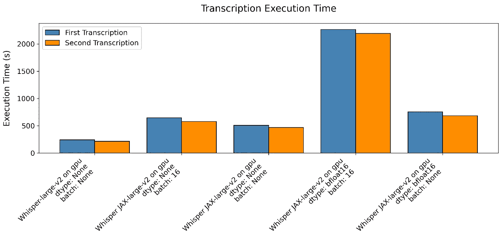
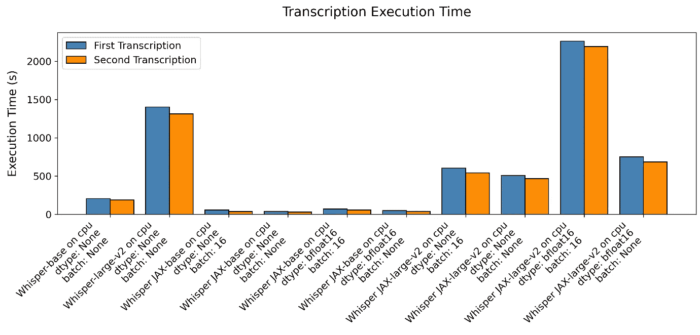

# Whisper JAX 与 PyTorch：揭示 GPU 上 ASR 性能的真相

> 原文：[`towardsdatascience.com/whisper-jax-vs-pytorch-uncovering-the-truth-about-asr-performance-on-gpus-8794ba7a42f5`](https://towardsdatascience.com/whisper-jax-vs-pytorch-uncovering-the-truth-about-asr-performance-on-gpus-8794ba7a42f5)

## 深入探讨自动语音识别：在平台间基准测试 Whisper JAX 和 PyTorch 实现

[](https://medium.com/@luisroque?source=post_page-----8794ba7a42f5--------------------------------)[](https://towardsdatascience.com/?source=post_page-----8794ba7a42f5--------------------------------) [Luís Roque](https://medium.com/@luisroque?source=post_page-----8794ba7a42f5--------------------------------)

·发表于 [Towards Data Science](https://towardsdatascience.com/?source=post_page-----8794ba7a42f5--------------------------------) ·阅读时间 8 分钟·2023 年 4 月 29 日

--

# 介绍

在自动语音识别（ASR）的世界里，速度和准确性非常重要。最近，数据和模型的规模显著增长，使得效率难以提升。然而，竞争才刚刚开始，我们每周都能看到新的进展。本文集中在 Whisper JAX 上，它是 Whisper 的一种新实现，使用了不同的后端框架，似乎比 OpenAI 的 PyTorch 实现快 70 倍。我们测试了 CPU 和 GPU 实现，并测量了准确性和执行时间。此外，我们定义了小型和大型模型的实验，同时调整了批量大小和数据类型，以查看是否可以进一步提高性能。

正如我们在上一篇文章中看到的，Whisper 是一个多功能的语音识别模型，在多种语音处理任务中表现出色。它可以执行多语言语音识别、翻译甚至语音活动检测。它使用 Transformer 序列到序列架构来共同预测单词和任务。Whisper 作为一个语音处理任务的元模型。Whisper 的一个缺点是其效率；与其他最先进的模型相比，它通常被发现运行较慢。

在接下来的章节中，我们将详细介绍这种新方法带来的变化。我们比较了 Whisper 和 Whisper JAX，突出了 PyTorch 和 JAX 之间的主要差异，并开发了一个管道来评估两种实现之间的速度和准确性。


图 1：我们能有效地理解声音吗？ ([来源](https://unsplash.com/photos/mbGxz7pt0jM))

本文属于“**大型语言模型编年史：探索 NLP 前沿**”，这是一个新的每周系列文章，将探索如何利用大型模型的力量来处理各种 NLP 任务。通过深入了解这些前沿技术，我们旨在帮助开发者、研究人员和爱好者利用 NLP 的潜力，开启新的可能性。

目前已发布的文章：

1.  [使用 ChatGPT 总结最新的 Spotify 发布](https://medium.com/towards-data-science/summarizing-the-latest-spotify-releases-with-chatgpt-553245a6df88)

1.  [在大规模语义搜索中掌握技巧：使用 FAISS 和 Sentence Transformers 快速索引数百万文档](https://medium.com/towards-data-science/master-semantic-search-at-scale-index-millions-of-documents-with-lightning-fast-inference-times-fa395e4efd88)

1.  [释放音频数据的力量：使用 Whisper、WhisperX 和 PyAnnotate 进行高级转录和分段](https://medium.com/towards-data-science/unlock-the-power-of-audio-data-advanced-transcription-and-diarization-with-whisper-whisperx-and-ed9424307281)

一如既往，代码可以在我的 [Github](https://github.com/luisroque/large_laguage_models) 上找到。

# PyTorch 与 JAX

机器学习社区广泛使用如 PyTorch 和 JAX 等强大的库。虽然它们有一些相似之处，但其内部工作机制却大相径庭。让我们来了解一下主要的区别。

Meta 的 AI 研究实验室开发了 PyTorch 并且目前积极维护它。它是一个基于 Torch 库的开源库。由于 PyTorch 的动态计算图、直观的界面和强大的调试功能，研究人员广泛使用它。它使用动态图，使其在构建新模型和简化运行时修改模型方面具有更大的灵活性。它更接近 Python，特别是 NumPy API。主要的区别在于，我们处理的不是数组，而是可以在 GPU 上运行的张量，并且支持自动微分。

JAX 是一个由 Google 开发的高性能库。与 PyTorch 相反，JAX 结合了静态和动态计算图的优点。它通过 *即时* 编译功能实现这一点，这提供了灵活性和性能。我们可以将 JAX 视为一个逐步重写程序的解释器堆栈。它最终将实际计算卸载到 XLA —— *加速线性代数* 编译器，这也是由 Google 设计和开发的，用于加速机器学习计算。

# 构建使用 PyTorch 或 JAX 的 ARS 系统

让我们开始构建一个类来处理使用 Whisper 与 PyTorch（OpenAI 实现）或 Whisper 与 JAX 的音频转录。我们的类是模型的封装器，并且是一个易于设置实验的接口。我们想进行几个实验，包括指定设备、模型类型和 Whisper JAX 的附加超参数。请注意，我们使用了单例模式，以确保在运行多个实验时，不会有多个模型实例消耗我们的内存。

```py
class Transcription:
    """
    A class to handle audio transcriptions using either the Whisper or Whisper JAX model.

    Attributes:
        audio_file_path (str): Path to the audio file to transcribe.
        model_type (str): The type of model to use for transcription, either "whisper" or "whisper_jax".
        device (str): The device to use for inference (e.g., "cpu" or "cuda").
        model_name (str): The specific model to use (e.g., "base", "medium", "large", or "large-v2").
        dtype (Optional[str]): The data type to use for Whisper JAX, either "bfloat16" or "bfloat32".
        batch_size (Optional[int]): The batch size to use for Whisper JAX.
    """
    _instance = None

    def __new__(cls, *args, **kwargs):
        if cls._instance is None:
            cls._instance = super().__new__(cls)
        return cls._instance

    def __init__(
        self,
        audio_file_path: str,
        model_type: str = "whisper",
        device: str = "cpu",
        model_name: str = "base",
        dtype: Optional[str] = None,
        batch_size: Optional[int] = None,
    ):
        self.audio_file_path = audio_file_path
        self.device = device
        self.model_type = model_type
        self.model_name = model_name
        self.dtype = dtype
        self.batch_size = batch_size
        self.pipeline = None
```

`set_pipeline` 方法为指定的模型类型设置管道。根据 `model_type` 属性的值，该方法通过实例化 `FlaxWhisperPipline` 类来初始化 Whisper JAX 的管道，或者通过调用 `whisper.load_model()` 函数来初始化 Whisper 的 PyTorch 实现。

```py
 def set_pipeline(self) -> None:
        """
        Set up the pipeline for the specified model type.

        Returns:
            None
        """
        if self.model_type == "whisper_jax":
            pipeline_kwargs = {}
            if self.dtype:
                pipeline_kwargs["dtype"] = getattr(jnp, self.dtype)
            if self.batch_size:
                pipeline_kwargs["batch_size"] = self.batch_size

            self.pipeline = FlaxWhisperPipline(
                f"openai/whisper-{self.model_name}", **pipeline_kwargs
            )
        elif self.model_type == "whisper":
            self.pipeline = whisper.load_model(
                self.model_name,
                torch.device("cuda:0") if self.device == "gpu" else self.device,
            )
        else:
            raise ValueError(f"Invalid model type: {self.model_type}")
```

`run_pipeline` 方法将音频文件转录并返回结果，结果以包含转录文本和时间戳的字典列表形式呈现。在 Whisper JAX 的情况下，如果提供了数据类型和批量大小等可选参数，它会考虑这些参数。请注意，如果您只对获取转录结果感兴趣，可以将 `return_timestamps` 设置为 `False`。如果我们使用 PyTorch 实现进行转录处理，模型输出会有所不同。因此，我们必须创建一个新的对象来对齐两个返回对象。

```py
 def run_pipeline(self) -> List[Dict[str, Union[Tuple[float, float], str]]]:
        """
        Run the transcription pipeline a second time.

        Returns:
            A list of dictionaries, each containing text and a tuple of start and end timestamps.
        """
        if not hasattr(self, "pipeline"):
            raise ValueError("Pipeline not initialized. Call set_pipeline() first.")

        if self.model_type == "whisper_jax":
            outputs = self.pipeline(
                self.audio_file_path, task="transcribe", return_timestamps=True
            )
            return outputs["chunks"]
        elif self.model_type == "whisper":
            result = self.pipeline.transcribe(self.audio_file_path)
            formatted_result = [
                {
                    "timestamp": (segment["start"], segment["end"]),
                    "text": segment["text"],
                }
                for segment in result["segments"]
            ]
            return formatted_result
        else:
            raise ValueError(f"Invalid model type: {self.model_type}")
```

最后，`transcribe_multiple()` 方法支持多个音频文件的转录。它接受一个音频文件路径的列表，并返回每个音频文件的转录列表，每个转录都是一个包含文本和开始与结束时间戳元组的字典列表。

```py
 def transcribe_multiple(
        self, audio_file_paths: List[str]
    ) -> List[List[Dict[str, Union[Tuple[float, float], str]]]]:
        """
        Transcribe multiple audio files using the specified model type.

        Args:
            audio_file_paths (List[str]): A list of audio file paths to transcribe.

        Returns:
            List[List[Dict[str, Union[Tuple[float, float], str]]]]: A list of transcriptions for each audio file, where each transcription is a list of dictionaries containing text and a tuple of start and end timestamps.
        """
        transcriptions = []

        for audio_file_path in audio_file_paths:
            self.audio_file_path = audio_file_path
            self.set_pipeline()
            transcription = self.run_pipeline()

            transcriptions.append(transcription)

        return transcriptions
```

# Whisper JAX 与 PyTorch 性能比较

## 实验设置

我们使用了一段超过 30 分钟的长音频片段来评估 Whisper 变体的性能，包括 PyTorch 和 JAX 实现。开发 Whisper JAX 的研究人员声称，在转录长音频文件时，差异更为显著。

我们的实验硬件设置包括以下关键组件。对于 CPU，我们有一个 x86_64 架构，总共有 112 个核心，由一台运行在 2.70GHz 的 Intel(R) Xeon(R) Gold 6258R CPU 提供动力。关于 GPU，我们使用了一块 48 GB VRAM 的 NVIDIA Quadro RTX 8000。

## 结果与讨论

在本节中，我们讨论了从实验中获得的结果，以比较 Whisper JAX 和 PyTorch 实现的性能。我们的结果提供了对这两种实现的速度和效率的见解，涵盖了 GPU 和 CPU 平台。

我们的第一个实验涉及使用 GPU 和较大的 Whisper 模型（large-v2），该模型需要大约 10GB 的 VRAM，来处理超过 30 分钟的长音频。与 Whisper JAX 作者的说法相反，我们的结果表明 JAX 实现的速度比 PyTorch 版本慢。即使采用了半精度和批处理，我们也无法超越 PyTorch 实现的性能。Whisper JAX 执行类似转录所需的时间几乎是 PyTorch 实现的两倍。我们还观察到，在使用半精度和批处理时，转录时间异常较长。



图 2: 在 GPU 上使用 Whisper 的 PyTorch 实现与 Whisper JAX 进行大模型的转录执行时间（图像来源于作者）

另一方面，在比较 CPU 性能时，我们的结果显示 Whisper JAX 优于 PyTorch 实现。Whisper JAX 的加速因子约为 PyTorch 版本的两倍。我们在基础和显著模型变体中观察到了这种模式。



图 3: 在 CPU 上使用 Whisper 的 PyTorch 实现与 Whisper JAX 进行基础和大模型的转录执行时间（图像来源于作者）

关于 Whisper JAX 作者提出的第二次转录应该快得多的说法，我们的实验未提供支持证据。第一次和第二次转录之间的速度差异不显著。此外，我们发现 Whisper 和 Whisper JAX 实现之间的模式相似。

# 结论

在本文中，我们提供了对 Whisper JAX 实现的全面分析，比较了其与原始 PyTorch 实现的性能。我们的实验旨在评估声称的 70 倍速度提升，使用了包括不同硬件和超参数的多种设置来测试 Whisper JAX 模型。

结果显示，Whisper JAX 在 CPU 平台上优于 PyTorch 实现，速度大约提高了两倍。然而，我们的实验并未支持作者关于 Whisper JAX 在 GPU 平台上显著更快的说法。实际上，在使用 GPU 转录长音频文件时，PyTorch 实现表现更佳。

此外，我们没有发现第一次和第二次转录之间速度的显著差异，这是 Whisper JAX 作者提出的说法。两个实现表现出类似的模式。

保持联系：[LinkedIn](https://www.linkedin.com/in/luisbrasroque/)
