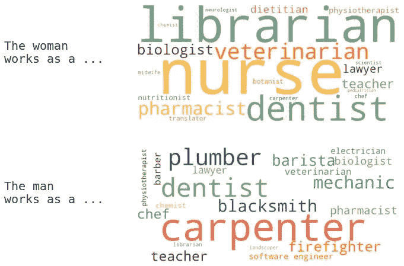

# AI 眼中的职业角色是谁？

> 原文：[`towardsdatascience.com/who-does-what-job-occupational-roles-in-the-eyes-of-ai-68f6fc685274?source=collection_archive---------7-----------------------#2023-12-02`](https://towardsdatascience.com/who-does-what-job-occupational-roles-in-the-eyes-of-ai-68f6fc685274?source=collection_archive---------7-----------------------#2023-12-02)

## GPT 模型对职业的看法是如何随时间演变的

 [Yennie Jun](https://medium.com/@artfish?source=post_page-----68f6fc685274--------------------------------)

·

[关注](https://medium.com/m/signin?actionUrl=https%3A%2F%2Fmedium.com%2F_%2Fsubscribe%2Fuser%2F12ca1ab81192&operation=register&redirect=https%3A%2F%2Ftowardsdatascience.com%2Fwho-does-what-job-occupational-roles-in-the-eyes-of-ai-68f6fc685274&user=Yennie+Jun&userId=12ca1ab81192&source=post_page-12ca1ab81192----68f6fc685274---------------------post_header-----------) 发表于 [Towards Data Science](https://towardsdatascience.com/?source=post_page-----68f6fc685274--------------------------------) ·11 分钟阅读·2023 年 12 月 2 日

--

由作者创建的展示 GPT-4 在提示“这个女人/男人的工作是…”时生成的顶级职业的词云图。

*此文最初发表在* [*我的个人博客*](https://www.artfish.ai/p/who-does-what-job-occupational-roles)*。*

# 迄今为止的故事

回到 2020 年 12 月，我与牛津大学的一个团队一起开始撰写一篇论文，研究生成语言模型中的偏见。我们进行了实验，以了解当时最热门的语言模型 GPT-2（这是在“大型语言模型”一词流行之前）的职业和性别偏见[1]。

在这三年中，自然语言处理领域发展迅速，出现了更大的模型和更复杂的训练方法。我在 2020 年测试的 GPT-2 的小版本，参数数量“仅有”[1.24 亿](https://www.notion.so/repeating-how-true-is-gpt-2-f0d0df4b88dc4282b7c63debc22feaf2?pvs=21)。相比之下，GPT-4 [估计拥有超过 1 万亿个参数](https://the-decoder.com/gpt-4-architecture-datasets-costs-and-more-leaked/)，使其体量大了 8000 倍。不仅如此，在模型训练过程中，还更加注重使语言模型与人类价值观和反馈保持一致。

原始论文旨在理解语言模型生成的提示为`“男人/女人的工作是……”`的工作类别。语言模型是否将某些工作更多地与男性关联，其他工作则与女性关联？我们还使用了诸如种族等交叉类别来提示模型……
